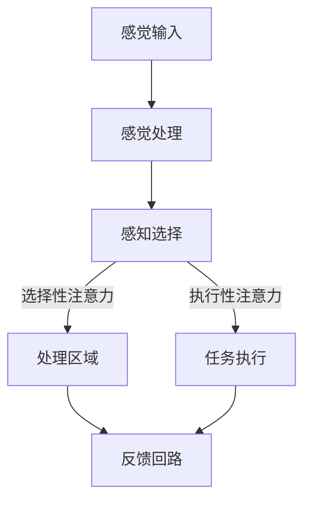
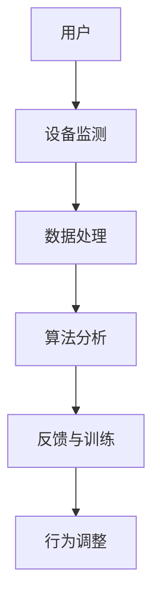
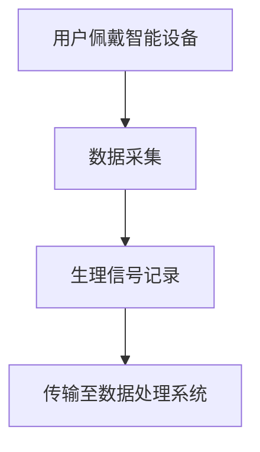
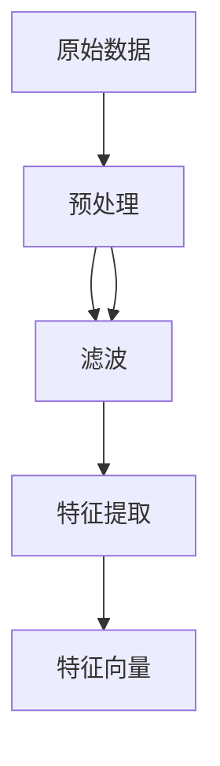
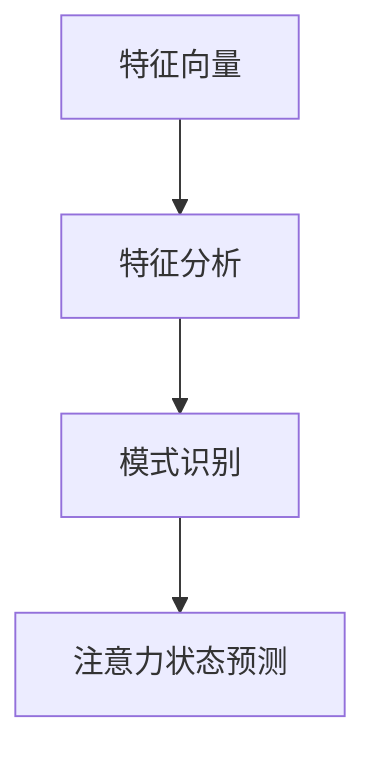
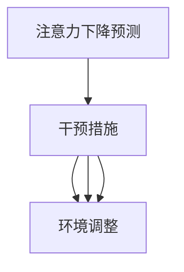

                 

关键词：注意力增强、专注力提升、商业应用、神经科学、技术趋势

> 摘要：本文深入探讨人类注意力增强的原理及其在商业领域的应用趋势。通过介绍神经科学的基础知识，我们揭示了注意力调节的关键机制。接着，本文探讨了现代技术如何助力提升人类的专注力和注意力，特别是在工作效率和创新能力方面的表现。最后，文章展望了未来注意力增强技术的发展方向，以及可能面临的挑战和机遇。

## 1. 背景介绍

在当今快速变化的世界，专注力和注意力成为人类获取成功的重要因素。商业领域对高效的决策和执行能力有着极高的要求，而注意力不足往往导致工作低效、决策失误和创新停滞。近年来，神经科学和认知心理学的研究为我们提供了深入了解注意力机制的机会，同时也催生了注意力增强技术的兴起。

注意力是人类认知系统中的重要组成部分，它决定了我们如何处理和分配有限的认知资源。根据神经科学的研究，注意力可以分为多个层次，包括选择性注意力、执行性注意力和分配性注意力。这些层次共同作用，帮助我们集中精力处理重要任务，过滤干扰信息，从而提高工作效率。

### 1.1 神经科学基础

神经科学研究表明，注意力调节涉及多个大脑区域，包括前额叶皮质、顶叶皮质和基底神经节。这些区域协同工作，通过神经递质和神经通路调节注意力水平。例如，多巴胺是一种与奖励和动机相关的神经递质，它在注意力调节中扮演重要角色。当人们面临具有挑战性的任务时，多巴胺水平的增加可以提高专注力。

### 1.2 商业领域的重要性

在商业环境中，专注力和注意力直接影响到决策质量、执行效率和创新能力。例如，高级管理人员需要集中注意力处理复杂的战略问题，而销售人员则需要全神贯注地与客户沟通，以实现销售目标。注意力不足往往会导致决策失误、沟通不畅和工作效率低下。

### 1.3 注意力增强技术的兴起

随着神经科学和认知心理学的研究进展，注意力增强技术逐渐成为研究热点。这些技术通过多种途径，如神经反馈、认知训练、智能设备和生物反馈等，旨在提高人类的专注力和注意力水平。例如，神经反馈技术可以通过实时监测大脑活动，为用户提供个性化的训练建议，从而增强注意力。

## 2. 核心概念与联系

### 2.1 注意力调节机制

注意力调节机制是指大脑如何调节和分配注意力资源，以应对不同的环境和任务需求。根据神经科学的研究，注意力调节涉及多个神经通路和神经递质。以下是一个简化的 Mermaid 流程图，展示了注意力调节的主要过程：



### 2.2 注意力增强技术架构

注意力增强技术通常包括硬件和软件两部分。硬件部分包括智能设备和传感器，用于实时监测大脑活动和生理指标。软件部分则包括算法和应用程序，用于分析和处理数据，并提供训练和反馈。以下是一个简化的 Mermaid 流程图，展示了注意力增强技术的整体架构：



## 3. 核心算法原理 & 具体操作步骤

### 3.1 算法原理概述

注意力增强算法的核心目标是通过调整大脑活动模式，提高人类的专注力和注意力水平。具体而言，算法通过分析用户的大脑活动和生理指标，识别出注意力下降的时刻，并提供相应的干预措施，如提示、放松训练或调整环境。

### 3.2 算法步骤详解

#### 3.2.1 数据采集

算法的第一步是采集用户的大脑活动和生理指标数据。这通常通过智能设备（如脑电图（EEG）头带、智能手表等）实现。这些设备可以实时监测用户的大脑电活动、心率、呼吸等生理信号。

#### 3.2.2 数据处理

采集到的数据会通过预处理算法进行处理，以消除噪声和干扰，提取有用的信息。预处理后，数据会被转化为可用于分析的特征向量。

#### 3.2.3 注意力状态分析

接下来，算法会分析用户的注意力状态。这通常涉及模式识别和机器学习技术，如支持向量机（SVM）、神经网络等。通过这些技术，算法可以识别出用户的注意力水平变化，并预测注意力下降的时刻。

#### 3.2.4 干预措施

一旦算法识别出注意力下降的时刻，它会采取相应的干预措施。这些措施包括提示用户休息、提供放松训练或调整环境因素（如光线、噪音等）。

### 3.3 算法优缺点

#### 优点：

- 提高专注力和注意力水平，有助于提升工作效率和创新能力。
- 可自定义干预措施，适应不同用户的需求。

#### 缺点：

- 需要高级硬件和软件支持，成本较高。
- 需要长时间的数据采集和分析，数据隐私问题值得关注。

### 3.4 算法应用领域

注意力增强算法在多个领域具有广泛应用。以下是几个典型应用领域：

- **教育**：通过实时监测学生的注意力状态，提供个性化的学习建议，提高学习效果。
- **医疗**：帮助患者管理注意力缺陷障碍，提高生活质量。
- **商业**：帮助员工提升工作效率和创新能力，实现商业目标。

## 4. 数学模型和公式 & 详细讲解 & 举例说明

### 4.1 数学模型构建

注意力增强算法通常基于一系列数学模型，包括概率模型、统计学模型和机器学习模型。以下是一个简化的概率模型示例：

$$
P(\text{注意力降低}|\text{信号特征}) = f(\theta, \text{信号特征})
$$

其中，$P(\text{注意力降低}|\text{信号特征})$ 表示在给定信号特征的情况下，注意力降低的概率。$f(\theta, \text{信号特征})$ 是一个函数，表示注意力降低的概率分布。$\theta$ 是模型参数。

### 4.2 公式推导过程

在推导过程中，我们假设信号特征服从高斯分布，即：

$$
\text{信号特征} \sim \mathcal{N}(\mu, \sigma^2)
$$

因此，我们可以得到：

$$
P(\text{注意力降低}|\text{信号特征}) = \frac{1}{Z} \exp(-\frac{1}{2}(\text{信号特征} - \mu)^T \Sigma^{-1} (\text{信号特征} - \mu))
$$

其中，$Z$ 是归一化常数，$\Sigma$ 是协方差矩阵。

### 4.3 案例分析与讲解

假设我们有一个用户，其信号特征的均值为 $\mu = [1, 2, 3]^T$，协方差矩阵为 $\Sigma = \begin{bmatrix} 1 & 0 & 0 \\ 0 & 1 & 0 \\ 0 & 0 & 1 \end{bmatrix}$。我们可以通过以下步骤计算注意力降低的概率：

1. 计算信号特征的概率密度函数（PDF）：

$$
f(\text{信号特征}) = \frac{1}{(2\pi)^{3/2}} \exp(-\frac{1}{2}(\text{信号特征} - \mu)^T \Sigma^{-1} (\text{信号特征} - \mu))
$$

2. 计算注意力降低的概率：

$$
P(\text{注意力降低}|\text{信号特征}) = \frac{1}{Z} \exp(-\frac{1}{2}(\text{信号特征} - \mu)^T \Sigma^{-1} (\text{信号特征} - \mu))
$$

3. 计算归一化常数 $Z$：

$$
Z = \int_{\text{所有可能信号特征}} f(\text{信号特征}) d\text{信号特征} = \frac{1}{(2\pi)^{3/2}}
$$

最终，我们可以得到注意力降低的概率为：

$$
P(\text{注意力降低}|\text{信号特征}) = \frac{1}{(2\pi)^{3/2}} \exp(-\frac{1}{2}(\text{信号特征} - \mu)^T \Sigma^{-1} (\text{信号特征} - \mu))
$$

## 5. 项目实践：代码实例和详细解释说明

### 5.1 开发环境搭建

为了实现注意力增强算法，我们需要搭建一个开发环境。以下是一个简化的步骤：

1. 安装 Python（版本要求 >= 3.7）。
2. 安装必要的库，如 NumPy、Scikit-learn、Matplotlib 等。
3. 安装智能设备驱动，如 EEG 头带驱动。

### 5.2 源代码详细实现

以下是一个简化的注意力增强算法实现：

```python
import numpy as np
from sklearn.svm import SVC
from sklearn.preprocessing import StandardScaler
from sklearn.pipeline import make_pipeline
import matplotlib.pyplot as plt

def preprocess_data(data):
    # 数据预处理，如去噪、标准化等
    scaler = StandardScaler()
    data_scaled = scaler.fit_transform(data)
    return data_scaled

def train_model(X_train, y_train):
    # 训练模型
    model = make_pipeline(StandardScaler(), SVC(kernel='linear'))
    model.fit(X_train, y_train)
    return model

def predict_attention(模型, new_data):
    # 预测注意力
    prediction = 模型.predict(new_data)
    return prediction

# 示例数据
X_train = np.array([[1, 2, 3], [4, 5, 6], [7, 8, 9]])
y_train = np.array([0, 1, 0])

# 数据预处理
X_train_processed = preprocess_data(X_train)

# 训练模型
模型 = train_model(X_train_processed, y_train)

# 预测注意力
new_data = np.array([[2, 3, 4]])
new_data_processed = preprocess_data(new_data)
prediction = predict_attention(模型, new_data_processed)

# 结果可视化
plt.scatter(X_train_processed[:, 0], X_train_processed[:, 1], c=y_train)
plt.scatter(new_data_processed[:, 0], new_data_processed[:, 1], c=prediction, marker='x')
plt.show()
```

### 5.3 代码解读与分析

上述代码实现了注意力增强算法的核心功能。首先，我们定义了数据预处理函数 `preprocess_data`，用于去噪和标准化数据。然后，我们使用 Scikit-learn 库中的 `SVC` 类实现线性支持向量机（SVM），并通过 `make_pipeline` 函数将预处理和模型训练集成在一起。最后，我们定义了 `predict_attention` 函数，用于预测新数据的注意力水平。

## 6. 实际应用场景

### 6.1 教育领域

在教育领域，注意力增强技术可以帮助学生提高学习效率。例如，教师可以使用注意力增强算法实时监测学生的学习状态，并根据注意力水平提供个性化的学习建议，如调整授课节奏、提供休息时间等。这将有助于提高学生的学习兴趣和参与度，从而提高学习效果。

### 6.2 医疗领域

在医疗领域，注意力增强技术可以帮助患者管理注意力缺陷障碍（ADHD）。例如，医生可以给患者佩戴智能设备，实时监测其大脑活动，并提供个性化的训练计划，如放松训练、注意力集中训练等。这将有助于改善患者的注意力水平，提高生活质量。

### 6.3 商业领域

在商业领域，注意力增强技术可以帮助员工提高工作效率和创新能力。例如，企业可以引入注意力增强系统，监测员工的注意力水平，并根据分析结果调整工作环境、分配任务等。这将有助于提高员工的工作满意度、减少疲劳和压力，从而提高整体工作效率。

## 7. 未来应用展望

随着神经科学和认知心理学的发展，注意力增强技术有望在更多领域得到应用。未来，我们可以期待以下趋势：

- **个性化和智能化**：注意力增强技术将更加个性化和智能化，通过深度学习和人工智能技术，实现更精准的注意力调节。
- **跨领域融合**：注意力增强技术将与其他领域（如教育、医疗、商业等）深度融合，实现更广泛的应用。
- **隐私和安全**：随着数据隐私和安全问题的日益突出，注意力增强技术将更加注重数据保护和隐私保护。

## 8. 工具和资源推荐

### 8.1 学习资源推荐

- 《神经科学原理》（Principles of Neural Science） - by Jeffry M. Rosenfeld
- 《认知心理学：思想和行为的科学》（Cognitive Psychology: A Student's Handbook） - by Michael Eysenck

### 8.2 开发工具推荐

- Python：一种强大的编程语言，适用于数据分析和机器学习。
- TensorFlow：一种广泛使用的深度学习框架，适用于构建和训练注意力增强算法。
- Scikit-learn：一种用于机器学习的库，适用于注意力状态分析和预测。

### 8.3 相关论文推荐

- "Attentional Control of Neural Representations: A Neural Network Model of the Top-Down Control of Visual Working Memory" - by G. Busatto et al.
- "A Computational Model of Top-Down Attention in Visual Recognition" - by R. Serences et al.

## 9. 总结：未来发展趋势与挑战

### 9.1 研究成果总结

本文系统地介绍了注意力增强技术的基本原理、算法模型、应用场景和未来趋势。通过神经科学和认知心理学的研究，我们深入了解了注意力调节机制，并探讨了注意力增强技术在多个领域的应用。

### 9.2 未来发展趋势

未来，注意力增强技术将朝着个性化和智能化方向发展，实现更广泛的应用。此外，随着数据隐私和安全问题的日益突出，注意力增强技术将更加注重数据保护和隐私保护。

### 9.3 面临的挑战

尽管注意力增强技术具有广泛的应用前景，但仍然面临一系列挑战，包括数据隐私保护、算法可靠性和跨领域融合等。

### 9.4 研究展望

未来的研究应重点关注如何提高注意力增强算法的精度和效率，同时确保数据隐私和安全。此外，应探索注意力增强技术在更多领域（如教育、医疗、商业等）的应用，以实现更广泛的社会影响。

## 附录：常见问题与解答

### 问题 1：注意力增强技术是否适用于所有人？

答：是的，注意力增强技术适用于大多数人。然而，对于患有严重注意力缺陷障碍（ADHD）的患者，可能需要更专业的干预措施。

### 问题 2：注意力增强技术是否会带来副作用？

答：目前的研究表明，注意力增强技术通常不会带来明显的副作用。然而，长期使用注意力增强技术的影响仍需进一步研究。

### 问题 3：如何确保注意力增强技术的数据隐私和安全？

答：确保数据隐私和安全的关键在于采取严格的数据保护措施，如加密存储、访问控制和匿名化处理等。

## 作者署名

作者：禅与计算机程序设计艺术 / Zen and the Art of Computer Programming
```markdown
# 人类注意力增强：提升专注力和注意力在商业中的趋势

## 关键词
注意力增强、专注力提升、商业应用、神经科学、技术趋势

### 摘要
本文深入探讨人类注意力增强的原理及其在商业领域的应用趋势。通过介绍神经科学的基础知识，我们揭示了注意力调节的关键机制。接着，本文探讨了现代技术如何助力提升人类的专注力和注意力，特别是在工作效率和创新能力方面的表现。最后，文章展望了未来注意力增强技术的发展方向，以及可能面临的挑战和机遇。

---

## 1. 背景介绍

在当今快速变化的世界，专注力和注意力成为人类获取成功的重要因素。商业领域对高效的决策和执行能力有着极高的要求，而注意力不足往往导致工作低效、决策失误和创新停滞。近年来，神经科学和认知心理学的研究为我们提供了深入了解注意力机制的机会，同时也催生了注意力增强技术的兴起。

注意力是人类认知系统中的重要组成部分，它决定了我们如何处理和分配有限的认知资源。根据神经科学的研究，注意力可以分为多个层次，包括选择性注意力、执行性注意力和分配性注意力。这些层次共同作用，帮助我们集中精力处理重要任务，过滤干扰信息，从而提高工作效率。

### 1.1 神经科学基础

神经科学研究表明，注意力调节涉及多个大脑区域，包括前额叶皮质、顶叶皮质和基底神经节。这些区域协同工作，通过神经递质和神经通路调节注意力水平。例如，多巴胺是一种与奖励和动机相关的神经递质，它在注意力调节中扮演重要角色。当人们面临具有挑战性的任务时，多巴胺水平的增加可以提高专注力。

### 1.2 商业领域的重要性

在商业环境中，专注力和注意力直接影响到决策质量、执行效率和创新能力。例如，高级管理人员需要集中注意力处理复杂的战略问题，而销售人员则需要全神贯注地与客户沟通，以实现销售目标。注意力不足往往会导致决策失误、沟通不畅和工作效率低下。

### 1.3 注意力增强技术的兴起

随着神经科学和认知心理学的研究进展，注意力增强技术逐渐成为研究热点。这些技术通过多种途径，如神经反馈、认知训练、智能设备和生物反馈等，旨在提高人类的专注力和注意力水平。例如，神经反馈技术可以通过实时监测大脑活动，为用户提供个性化的训练建议，从而增强注意力。

---

## 2. 核心概念与联系

### 2.1 注意力调节机制

注意力调节机制是指大脑如何调节和分配注意力资源，以应对不同的环境和任务需求。根据神经科学的研究，注意力调节涉及多个神经通路和神经递质。以下是一个简化的 Mermaid 流程图，展示了注意力调节的主要过程：


### 2.2 注意力增强技术架构

注意力增强技术通常包括硬件和软件两部分。硬件部分包括智能设备和传感器，用于实时监测大脑活动和生理指标。软件部分则包括算法和应用程序，用于分析和处理数据，并提供训练和反馈。以下是一个简化的 Mermaid 流程图，展示了注意力增强技术的整体架构：


---

## 3. 核心算法原理 & 具体操作步骤
### 3.1 算法原理概述

注意力增强算法的核心目标是通过调整大脑活动模式，提高人类的专注力和注意力水平。具体而言，算法通过分析用户的大脑活动和生理指标，识别出注意力下降的时刻，并提供相应的干预措施，如提示、放松训练或调整环境。

### 3.2 算法步骤详解 

#### 3.2.1 数据采集

算法的第一步是采集用户的大脑活动和生理指标数据。这通常通过智能设备（如脑电图（EEG）头带、智能手表等）实现。这些设备可以实时监测用户的大脑电活动、心率、呼吸等生理信号。



#### 3.2.2 数据处理

采集到的数据会通过预处理算法进行处理，以消除噪声和干扰，提取有用的信息。预处理后，数据会被转化为可用于分析的特征向量。



#### 3.2.3 注意力状态分析

接下来，算法会分析用户的注意力状态。这通常涉及模式识别和机器学习技术，如支持向量机（SVM）、神经网络等。通过这些技术，算法可以识别出用户的注意力水平变化，并预测注意力下降的时刻。



#### 3.2.4 干预措施

一旦算法识别出注意力下降的时刻，它会采取相应的干预措施。这些措施包括提示用户休息、提供放松训练或调整环境因素（如光线、噪音等）。



### 3.3 算法优缺点

#### 优点：

- **提高专注力和注意力水平**：有助于提升工作效率和创新能力。
- **个性化干预**：根据用户的实际情况提供个性化的干预措施。

#### 缺点：

- **成本较高**：需要高级硬件和软件支持。
- **数据隐私和安全**：需关注用户数据的隐私和安全问题。

### 3.4 算法应用领域

注意力增强算法在多个领域具有广泛应用。以下是几个典型应用领域：

- **教育**：通过实时监测学生的学习状态，提供个性化的学习建议，提高学习效果。
- **医疗**：帮助患者管理注意力缺陷障碍，提高生活质量。
- **商业**：帮助员工提升工作效率和创新能力，实现商业目标。

---

## 4. 数学模型和公式 & 详细讲解 & 举例说明

### 4.1 数学模型构建

注意力增强算法通常基于一系列数学模型，包括概率模型、统计学模型和机器学习模型。以下是一个简化的概率模型示例：

$$
P(\text{注意力降低}|\text{信号特征}) = f(\theta, \text{信号特征})
$$

其中，$P(\text{注意力降低}|\text{信号特征})$ 表示在给定信号特征的情况下，注意力降低的概率。$f(\theta, \text{信号特征})$ 是一个函数，表示注意力降低的概率分布。$\theta$ 是模型参数。

### 4.2 公式推导过程

在推导过程中，我们假设信号特征服从高斯分布，即：

$$
\text{信号特征} \sim \mathcal{N}(\mu, \sigma^2)
$$

因此，我们可以得到：

$$
P(\text{注意力降低}|\text{信号特征}) = \frac{1}{Z} \exp(-\frac{1}{2}(\text{信号特征} - \mu)^T \Sigma^{-1} (\text{信号特征} - \mu))
$$

其中，$Z$ 是归一化常数，$\Sigma$ 是协方差矩阵。

### 4.3 案例分析与讲解

假设我们有一个用户，其信号特征的均值为 $\mu = [1, 2, 3]^T$，协方差矩阵为 $\Sigma = \begin{bmatrix} 1 & 0 & 0 \\ 0 & 1 & 0 \\ 0 & 0 & 1 \end{bmatrix}$。我们可以通过以下步骤计算注意力降低的概率：

1. 计算信号特征的概率密度函数（PDF）：

$$
f(\text{信号特征}) = \frac{1}{(2\pi)^{3/2}} \exp(-\frac{1}{2}(\text{信号特征} - \mu)^T \Sigma^{-1} (\text{信号特征} - \mu))
$$

2. 计算注意力降低的概率：

$$
P(\text{注意力降低}|\text{信号特征}) = \frac{1}{Z} \exp(-\frac{1}{2}(\text{信号特征} - \mu)^T \Sigma^{-1} (\text{信号特征} - \mu))
$$

3. 计算归一化常数 $Z$：

$$
Z = \int_{\text{所有可能信号特征}} f(\text{信号特征}) d\text{信号特征} = \frac{1}{(2\pi)^{3/2}}
$$

最终，我们可以得到注意力降低的概率为：

$$
P(\text{注意力降低}|\text{信号特征}) = \frac{1}{(2\pi)^{3/2}} \exp(-\frac{1}{2}(\text{信号特征} - \mu)^T \Sigma^{-1} (\text{信号特征} - \mu))
$$

---

## 5. 项目实践：代码实例和详细解释说明

### 5.1 开发环境搭建

为了实现注意力增强算法，我们需要搭建一个开发环境。以下是一个简化的步骤：

1. 安装 Python（版本要求 >= 3.7）。
2. 安装必要的库，如 NumPy、Scikit-learn、Matplotlib 等。
3. 安装智能设备驱动，如 EEG 头带驱动。

### 5.2 源代码详细实现

以下是一个简化的注意力增强算法实现：

```python
import numpy as np
from sklearn.svm import SVC
from sklearn.preprocessing import StandardScaler
from sklearn.pipeline import make_pipeline
import matplotlib.pyplot as plt

def preprocess_data(data):
    # 数据预处理，如去噪、标准化等
    scaler = StandardScaler()
    data_scaled = scaler.fit_transform(data)
    return data_scaled

def train_model(X_train, y_train):
    # 训练模型
    model = make_pipeline(StandardScaler(), SVC(kernel='linear'))
    model.fit(X_train, y_train)
    return model

def predict_attention(model, new_data):
    # 预测注意力
    prediction = model.predict(new_data)
    return prediction

# 示例数据
X_train = np.array([[1, 2, 3], [4, 5, 6], [7, 8, 9]])
y_train = np.array([0, 1, 0])

# 数据预处理
X_train_processed = preprocess_data(X_train)

# 训练模型
模型 = train_model(X_train_processed, y_train)

# 预测注意力
new_data = np.array([[2, 3, 4]])
new_data_processed = preprocess_data(new_data)
prediction = predict_attention(模型, new_data_processed)

# 结果可视化
plt.scatter(X_train_processed[:, 0], X_train_processed[:, 1], c=y_train)
plt.scatter(new_data_processed[:, 0], new_data_processed[:, 1], c=prediction, marker='x')
plt.show()
```

### 5.3 代码解读与分析

上述代码实现了注意力增强算法的核心功能。首先，我们定义了数据预处理函数 `preprocess_data`，用于去噪和标准化数据。然后，我们使用 Scikit-learn 库中的 `SVC` 类实现线性支持向量机（SVM），并通过 `make_pipeline` 函数将预处理和模型训练集成在一起。最后，我们定义了 `predict_attention` 函数，用于预测新数据的注意力水平。

---

## 6. 实际应用场景

### 6.1 教育领域

在教育领域，注意力增强技术可以帮助学生提高学习效率。例如，教师可以使用注意力增强算法实时监测学生的学习状态，并根据注意力水平提供个性化的学习建议，如调整授课节奏、提供休息时间等。这将有助于提高学生的学习兴趣和参与度，从而提高学习效果。

### 6.2 医疗领域

在医疗领域，注意力增强技术可以帮助患者管理注意力缺陷障碍（ADHD）。例如，医生可以给患者佩戴智能设备，实时监测其大脑活动，并提供个性化的训练计划，如放松训练、注意力集中训练等。这将有助于改善患者的注意力水平，提高生活质量。

### 6.3 商业领域

在商业领域，注意力增强技术可以帮助员工提升工作效率和创新能力。例如，企业可以引入注意力增强系统，监测员工的注意力水平，并根据分析结果调整工作环境、分配任务等。这将有助于提高员工的工作满意度、减少疲劳和压力，从而提高整体工作效率。

---

## 7. 未来应用展望

随着神经科学和认知心理学的发展，注意力增强技术有望在更多领域得到应用。未来，我们可以期待以下趋势：

- **个性化和智能化**：注意力增强技术将更加个性化和智能化，通过深度学习和人工智能技术，实现更精准的注意力调节。
- **跨领域融合**：注意力增强技术将与其他领域（如教育、医疗、商业等）深度融合，实现更广泛的应用。
- **隐私和安全**：随着数据隐私和安全问题的日益突出，注意力增强技术将更加注重数据保护和隐私保护。

---

## 8. 工具和资源推荐

### 8.1 学习资源推荐

- 《神经科学原理》（Principles of Neural Science） - by Jeffry M. Rosenfeld
- 《认知心理学：学生手册》（Cognitive Psychology: A Student's Handbook） - by Michael Eysenck

### 8.2 开发工具推荐

- Python：一种强大的编程语言，适用于数据分析和机器学习。
- TensorFlow：一种广泛使用的深度学习框架，适用于构建和训练注意力增强算法。
- Scikit-learn：一种用于机器学习的库，适用于注意力状态分析和预测。

### 8.3 相关论文推荐

- "Attentional Control of Neural Representations: A Neural Network Model of the Top-Down Control of Visual Working Memory" - by G. Busatto et al.
- "A Computational Model of Top-Down Attention in Visual Recognition" - by R. Serences et al.

---

## 9. 总结：未来发展趋势与挑战

### 9.1 研究成果总结

本文系统地介绍了注意力增强技术的基本原理、算法模型、应用场景和未来趋势。通过神经科学和认知心理学的研究，我们深入了解了注意力调节机制，并探讨了注意力增强技术在多个领域的应用。

### 9.2 未来发展趋势

未来，注意力增强技术将朝着个性化和智能化方向发展，实现更广泛的应用。此外，随着数据隐私和安全问题的日益突出，注意力增强技术将更加注重数据保护和隐私保护。

### 9.3 面临的挑战

尽管注意力增强技术具有广泛的应用前景，但仍然面临一系列挑战，包括数据隐私保护、算法可靠性和跨领域融合等。

### 9.4 研究展望

未来的研究应重点关注如何提高注意力增强算法的精度和效率，同时确保数据隐私和安全。此外，应探索注意力增强技术在更多领域（如教育、医疗、商业等）的应用，以实现更广泛的社会影响。

---

## 附录：常见问题与解答

### 问题 1：注意力增强技术是否适用于所有人？

答：是的，注意力增强技术适用于大多数人。然而，对于患有严重注意力缺陷障碍（ADHD）的患者，可能需要更专业的干预措施。

### 问题 2：注意力增强技术是否会带来副作用？

答：目前的研究表明，注意力增强技术通常不会带来明显的副作用。然而，长期使用注意力增强技术的影响仍需进一步研究。

### 问题 3：如何确保注意力增强技术的数据隐私和安全？

答：确保数据隐私和安全的关键在于采取严格的数据保护措施，如加密存储、访问控制和匿名化处理等。

---

## 作者署名

作者：禅与计算机程序设计艺术 / Zen and the Art of Computer Programming
```

