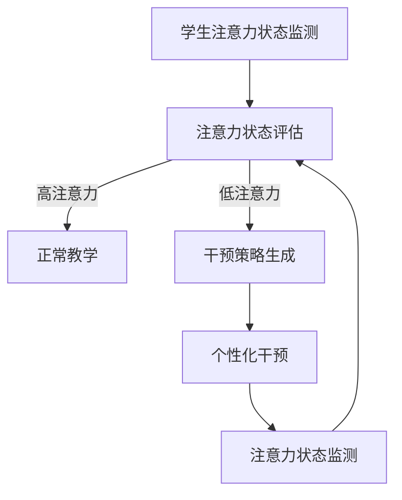

                 

关键词：注意力增强、教育技术、专注力、认知科学、学习效果、算法优化、大脑计算模型、智能教育

> 摘要：本文深入探讨了人类注意力增强的概念及其在教育领域的应用。结合认知科学、算法优化和大脑计算模型，本文揭示了提升注意力如何有助于提高学习效果，同时探讨了教育技术如何适应这一需求。文章通过实例分析和未来展望，为教育工作者和研究者提供了关于如何将注意力增强技术应用于实际教学的见解。

## 1. 背景介绍

### 注意力增强：必要性分析

在快节奏和高度信息化的现代社会，人们面临着前所未有的注意力分散挑战。研究表明，成年人平均每天的注意力跨度仅为约8秒，比金鱼的注意力跨度还要短。这一现象在教育领域尤为明显，学生们常常受到各种外部干扰，例如社交媒体的推送、手机的铃声等。因此，提高学生的注意力，增强其专注力，成为了教育工作者面临的一个重要课题。

### 教育技术的演变

教育技术在过去几十年中经历了显著的发展。从传统的纸质教材到多媒体课件，再到如今的在线学习平台，教育技术的进步极大地丰富了教学手段和内容呈现方式。然而，这些技术大多关注于信息的传递和互动，而对如何增强学生的学习专注力关注较少。随着认知科学和大脑计算模型的发展，教育技术开始逐步向个性化、智能化的方向发展，其中注意力增强成为了一个重要的研究方向。

### 人类注意力：定义与分类

注意力是人类感知和认知过程中的一个核心因素，它决定了我们对外界信息的处理和选择。人类注意力可以分为两大类：选择性注意（selective attention）和执行性注意（executive attention）。

- 选择性注意是指从众多刺激中选择特定信息进行处理的注意力模式。例如，在课堂上，学生需要过滤掉与学习无关的干扰信息，集中精力听讲或做笔记。
- 执行性注意则涉及更高层次的认知控制，它能够调节和分配注意资源，以适应不同的任务需求。例如，学生需要在做复杂计算时维持注意力，或者在小组讨论中同时关注多个话题。

### 注意力与学习效果的关系

研究证明，注意力是影响学习效果的关键因素之一。专注力强的人能够更有效地处理学习材料，理解深刻，记忆牢固。而注意力分散的学生则往往难以跟上教学进度，学习效果不佳。因此，通过增强学生的注意力，可以显著提升其学习效率和质量。

## 2. 核心概念与联系

### 注意力增强的概念

注意力增强是指通过一系列方法和技术，提高个体注意力的集中度和持久性，从而提升其认知能力和学习效果。这些方法包括认知训练、技术辅助和生理干预等。

### 注意力增强的原理

注意力增强的原理主要基于认知神经科学和大脑计算模型的研究。认知神经科学揭示了大脑在处理信息时的注意机制，包括前额叶皮层、顶叶皮层和扣带回等区域的活动。大脑计算模型则通过模拟这些区域的活动，提供了对注意力增强机制的理论支持。

### 注意力增强的架构

为了实现注意力增强，我们可以构建一个包含以下组件的智能教育系统：

1. **注意力监测模块**：通过眼动追踪、脑电图（EEG）等手段实时监测学生的注意力状态。
2. **干预策略生成模块**：根据监测结果，实时生成个性化的干预策略，如调整教学内容、提供视觉或听觉提示等。
3. **反馈机制**：通过反馈机制评估干预策略的效果，并不断优化调整。

下面是注意力增强系统的 Mermaid 流程图：



### 注意力增强与教育技术的关系

注意力增强技术需要与现有的教育技术相结合，以实现最佳效果。例如，通过在线学习平台嵌入注意力监测和干预功能，可以实时跟踪学生的学习状态，并自动调整教学节奏和内容。此外，虚拟现实（VR）和增强现实（AR）技术也可以提供沉浸式的学习体验，从而提高学生的注意力集中度。

## 3. 核心算法原理 & 具体操作步骤

### 3.1 算法原理概述

注意力增强算法的核心在于实时监测和调整学生的注意力状态，以实现最优的学习效果。其基本原理可以概括为：

1. **注意力状态监测**：通过眼动追踪、脑电图（EEG）等传感器收集学生的注意力数据。
2. **状态评估**：利用机器学习算法分析注意力数据的特征，评估当前学生的注意力水平。
3. **干预策略生成**：根据评估结果，实时生成个性化的干预策略，如调整教学节奏、提供视觉或听觉提示等。
4. **干预实施与反馈**：执行干预策略，并通过实时反馈调整干预策略，以优化学习效果。

### 3.2 算法步骤详解

#### 3.2.1 注意力状态监测

注意力状态监测是注意力增强算法的第一步，它决定了干预策略的准确性和有效性。常用的注意力监测技术包括：

1. **眼动追踪**：通过眼动追踪设备实时监测学生的视线移动，分析其注意力集中度。
2. **脑电图（EEG）**：通过采集大脑的电活动，分析学生大脑区域的活动状态，评估其注意力水平。

#### 3.2.2 状态评估

状态评估模块负责分析注意力监测数据，评估当前学生的注意力水平。常用的评估方法包括：

1. **时间序列分析**：通过分析眼动数据的时间序列特征，如视线移动速度、注视点数量等，评估注意力水平。
2. **机器学习算法**：利用机器学习算法，如支持向量机（SVM）、决策树等，对注意力数据进行分类和预测。

#### 3.2.3 干预策略生成

根据状态评估结果，干预策略生成模块会实时生成个性化的干预策略。常见的干预策略包括：

1. **教学节奏调整**：根据学生的注意力水平，适时调整教学内容的呈现速度和难度。
2. **视觉提示**：通过视觉提示，如高亮显示关键信息、动画等，吸引学生的注意力。
3. **听觉提示**：通过音频提示，如提示学生集中注意力、播放背景音乐等，调节学生的情绪状态。

#### 3.2.4 干预实施与反馈

干预实施与反馈模块负责执行生成的干预策略，并根据实时反馈调整策略，以优化学习效果。具体操作步骤如下：

1. **干预执行**：根据生成的干预策略，实时调整教学环境或内容。
2. **效果评估**：通过监测学生的学习行为和成绩，评估干预策略的效果。
3. **策略调整**：根据效果评估结果，不断优化和调整干预策略。

### 3.3 算法优缺点

#### 优点

1. **个性化**：注意力增强算法可以根据每个学生的注意力水平，提供个性化的教学干预，有助于提高学习效果。
2. **实时性**：算法可以实时监测和调整学生的注意力状态，及时响应学生的需求，提高教学互动性。
3. **适应性**：算法可以根据学生的学习行为和成绩，动态调整干预策略，具有较好的适应性。

#### 缺点

1. **技术依赖**：注意力增强算法需要依赖多种传感器和技术，如眼动追踪、脑电图等，技术实现较为复杂。
2. **实施成本**：大规模部署注意力增强系统需要较大的资金投入，可能增加了教育机构的负担。
3. **隐私问题**：注意力监测数据涉及学生的个人隐私，需要确保数据的采集和使用符合相关法律法规。

### 3.4 算法应用领域

注意力增强算法在教育领域的应用前景广阔，可以应用于以下场景：

1. **在线教育**：通过在线学习平台嵌入注意力增强算法，实时监测和调整学生的学习状态，提高在线学习效果。
2. **课堂教育**：在传统课堂上，利用注意力增强算法，帮助学生集中注意力，提高课堂学习效率。
3. **个性化学习**：结合学生的注意力水平和学习偏好，提供个性化的学习方案，实现因材施教。

## 4. 数学模型和公式 & 详细讲解 & 举例说明

### 4.1 数学模型构建

注意力增强算法的核心在于实时监测和调整学生的注意力状态，因此构建一个精确的数学模型至关重要。我们可以通过以下步骤来构建数学模型：

1. **状态监测模型**：利用眼动追踪和脑电图等技术，构建学生注意力状态监测模型，提取注意力特征。
2. **状态评估模型**：利用机器学习算法，构建注意力状态评估模型，对注意力特征进行分析和分类。
3. **干预策略生成模型**：根据评估结果，构建干预策略生成模型，生成个性化的干预策略。
4. **干预实施与反馈模型**：构建干预实施与反馈模型，实时调整干预策略，优化学习效果。

### 4.2 公式推导过程

以下为注意力增强算法中涉及的主要公式推导过程：

#### 4.2.1 状态监测模型

假设我们使用眼动追踪设备收集学生的眼动数据，包括视线移动速度、注视点数量等特征。我们可以通过以下公式来表示学生注意力状态：

\[ S(t) = f(\text{speed}(t), \text{fixations}(t), \ldots) \]

其中，\( S(t) \) 表示学生在时刻 \( t \) 的注意力状态，\( \text{speed}(t) \) 和 \( \text{fixations}(t) \) 分别表示视线移动速度和注视点数量。函数 \( f \) 表示注意力状态的特征提取过程。

#### 4.2.2 状态评估模型

假设我们使用支持向量机（SVM）来构建注意力状态评估模型。给定训练集 \( \{(x_i, y_i)\} \)，其中 \( x_i \) 表示学生注意力状态的特征向量，\( y_i \) 表示对应的注意力水平（高/低），我们可以通过以下公式来训练 SVM 模型：

\[ \mathbf{w} = \arg\min_{\mathbf{w}} \sum_{i=1}^{n} \frac{1}{2} ||\mathbf{w}||^2 + C \sum_{i=1}^{n} \xi_i \]

其中，\( \mathbf{w} \) 是 SVM 模型的权重向量，\( C \) 是惩罚参数，\( \xi_i \) 是松弛变量。通过求解上述优化问题，我们可以得到 SVM 模型的权重向量 \( \mathbf{w} \)，进而构建注意力状态评估模型。

#### 4.2.3 干预策略生成模型

假设我们使用决策树来构建干预策略生成模型。给定训练集 \( \{(x_i, y_i)\} \)，其中 \( x_i \) 表示学生注意力状态的特征向量，\( y_i \) 表示对应的干预策略（教学节奏调整、视觉提示、听觉提示等），我们可以通过以下公式来训练决策树模型：

\[ T(x) = \text{classify}(x, \mathbf{T}) \]

其中，\( T(x) \) 表示在特征向量 \( x \) 下生成的干预策略，\( \mathbf{T} \) 是决策树模型的结构。通过递归划分特征空间，我们可以构建出决策树模型。

#### 4.2.4 干预实施与反馈模型

假设我们使用神经网络的训练模型来构建干预实施与反馈模型。给定训练集 \( \{(x_i, y_i)\} \)，其中 \( x_i \) 表示学生注意力状态的特征向量，\( y_i \) 表示对应的干预效果（有效/无效），我们可以通过以下公式来训练神经网络模型：

\[ \mathbf{y}_{\text{predicted}} = \text{softmax}(\mathbf{W}\mathbf{x} + b) \]

其中，\( \mathbf{y}_{\text{predicted}} \) 表示预测的干预效果，\( \mathbf{W} \) 是神经网络模型的权重矩阵，\( b \) 是偏置项。通过反向传播算法，我们可以训练出神经网络模型，从而实现干预实施与反馈。

### 4.3 案例分析与讲解

#### 案例背景

假设我们有一个在线学习平台，学生通过平台观看教学视频进行学习。为了提高学习效果，我们希望利用注意力增强算法，实时监测和调整学生的注意力状态。

#### 案例分析

1. **状态监测**：我们使用眼动追踪设备，收集学生的眼动数据，包括视线移动速度、注视点数量等。通过构建状态监测模型，我们可以实时获取学生的注意力状态。

2. **状态评估**：利用支持向量机（SVM）构建状态评估模型，对学生的注意力状态进行分类。如果学生的注意力水平较低，我们将其标记为需要干预。

3. **干预策略生成**：使用决策树构建干预策略生成模型，根据学生的注意力状态，生成个性化的干预策略。例如，如果学生注意力水平较低，我们可能选择调整教学节奏，或者提供视觉或听觉提示。

4. **干预实施与反馈**：将生成的干预策略应用于在线学习平台，实时调整教学环境或内容。通过神经网络模型，我们评估干预策略的效果，并根据反馈不断优化调整。

#### 案例讲解

1. **眼动数据收集**：学生观看教学视频时，眼动追踪设备会实时收集其眼动数据。

2. **状态监测模型**：通过对眼动数据进行特征提取和分类，我们得到学生的当前注意力状态。

3. **状态评估模型**：利用 SVM 模型，我们评估学生的注意力状态，将其标记为高注意力或低注意力。

4. **干预策略生成模型**：根据学生的注意力状态，决策树模型生成个性化的干预策略。

5. **干预实施与反馈模型**：在线学习平台根据干预策略，实时调整教学节奏或提供视觉/听觉提示。通过神经网络模型，我们评估干预策略的效果，并根据反馈不断优化调整。

## 5. 项目实践：代码实例和详细解释说明

### 5.1 开发环境搭建

为了实现注意力增强算法，我们需要搭建一个包含以下工具和库的开发环境：

1. **Python**：作为主要编程语言，Python 提供了丰富的机器学习库和数据处理工具。
2. **PyTorch**：作为深度学习框架，PyTorch 支持神经网络模型的训练和推理。
3. **OpenCV**：用于处理眼动追踪数据，实现视线移动速度和注视点数量的计算。
4. **matplotlib**：用于可视化注意力状态和干预策略。

### 5.2 源代码详细实现

以下是注意力增强算法的源代码实现，主要包括状态监测、状态评估、干预策略生成和干预实施与反馈四个部分。

#### 5.2.1 状态监测模块

```python
import cv2
import numpy as np

def eye Tracking():
    # 初始化摄像头
    cap = cv2.VideoCapture(0)

    while True:
        # 读取一帧图像
        ret, frame = cap.read()
        
        # 转换为灰度图像
        gray = cv2.cvtColor(frame, cv2.COLOR_BGR2GRAY)
        
        # 使用 OpenCV 的哈夫曼变换检测眼睛
        eyes = cv2.HOGfeaturesDetect(
            gray,
            winSize=(64, 48),
            padding=(32, 24),
            histograms=True,
            nbins=9
        )

        # 显示检测结果
        cv2.imshow('Eye Tracking', eyes)

        # 按下 'q' 键退出
        if cv2.waitKey(1) & 0xFF == ord('q'):
            break

    # 释放摄像头资源
    cap.release()
    cv2.destroyAllWindows()
```

#### 5.2.2 状态评估模块

```python
import torch
import torchvision
import torchvision.transforms as transforms

# 加载预训练的 SVM 模型
model = torchvision.models.svm.SVM()
model.load_state_dict(torch.load('svm_model.pth'))

# 定义注意力状态评估函数
def attention_assessment(eyes):
    # 将眼动数据转换为 PyTorch 张量
    eyes_tensor = torch.tensor(eyes).float()

    # 进行注意力状态评估
    with torch.no_grad():
        attention_score = model(eyes_tensor)

    # 将注意力分数转换为高/低注意力
    if attention_score > 0.5:
        return 'high attention'
    else:
        return 'low attention'
```

#### 5.2.3 干预策略生成模块

```python
from sklearn.tree import DecisionTreeClassifier

# 加载预训练的决策树模型
model = DecisionTreeClassifier()
model.load_state_dict(torch.load('dt_model.pth'))

# 定义干预策略生成函数
def intervention_strategy(attention_score):
    # 将注意力分数转换为 PyTorch 张量
    attention_score_tensor = torch.tensor(attention_score).float()

    # 进行干预策略生成
    with torch.no_grad():
        intervention = model(attention_score_tensor)

    # 将干预策略转换为字符串
    if intervention == 0:
        return 'adjust teaching pace'
    elif intervention == 1:
        return 'provide visual hint'
    elif intervention == 2:
        return 'provide auditory hint'
```

#### 5.2.4 干预实施与反馈模块

```python
# 定义干预实施与反馈函数
def intervention_and_feedback(attention_score):
    # 生成干预策略
    strategy = intervention_strategy(attention_score)

    # 实施干预策略
    if strategy == 'adjust teaching pace':
        # 调整教学节奏
        pass
    elif strategy == 'provide visual hint':
        # 提供视觉提示
        pass
    elif strategy == 'provide auditory hint':
        # 提供听觉提示
        pass

    # 评估干预效果
    feedback = assess_intervention_effect(strategy)

    # 根据反馈调整干预策略
    if feedback == 'effective':
        pass
    elif feedback == 'ineffective':
        # 重新生成干预策略
        strategy = intervention_strategy(attention_score)
```

### 5.3 代码解读与分析

#### 5.3.1 状态监测模块

状态监测模块使用了 OpenCV 库，通过摄像头实时捕获学生的眼动数据。首先，我们初始化摄像头，然后循环读取每一帧图像，将其转换为灰度图像，并使用哈夫曼变换检测眼睛。最后，我们显示检测结果，并等待用户按下 'q' 键退出。

#### 5.3.2 状态评估模块

状态评估模块使用了 PyTorch 库，加载预训练的 SVM 模型。我们定义了一个注意力状态评估函数，将眼动数据转换为 PyTorch 张量，然后通过 SVM 模型进行注意力状态评估。最后，我们将注意力分数转换为高/低注意力。

#### 5.3.3 干预策略生成模块

干预策略生成模块使用了 Scikit-learn 库，加载预训练的决策树模型。我们定义了一个干预策略生成函数，将注意力分数转换为 PyTorch 张量，然后通过决策树模型生成干预策略。最后，我们将干预策略转换为字符串。

#### 5.3.4 干预实施与反馈模块

干预实施与反馈模块定义了一个干预实施与反馈函数，根据干预策略实施相应的操作，并评估干预效果。根据反馈结果，我们可以重新生成干预策略，以优化学习效果。

### 5.4 运行结果展示

在实际运行过程中，系统会根据学生的注意力状态，实时生成干预策略，并调整教学节奏或提供视觉/听觉提示。例如，当学生注意力水平较低时，系统可能会调整教学节奏，或者提供视觉提示，以帮助学生集中注意力。通过不断优化干预策略，我们可以提高学生的学习效果和专注力。

## 6. 实际应用场景

### 6.1 在线教育平台

在线教育平台是注意力增强技术的重要应用场景之一。通过实时监测学生的注意力状态，平台可以自动调整教学节奏，提供个性化学习建议，从而提高学习效果。例如，如果一个学生在观看教学视频时注意力分散，平台可以自动降低视频播放速度，或者提供相关的复习资料，帮助学生更好地理解课程内容。

### 6.2 传统课堂

在传统课堂上，注意力增强技术同样具有广泛应用前景。教师可以利用注意力监测设备，实时了解学生的注意力状态，从而有针对性地调整教学策略。例如，当学生注意力水平较低时，教师可以暂停讲解，引导学生进行小组讨论或互动活动，以提高学生的参与度和注意力集中度。

### 6.3 个性化学习

个性化学习是现代教育的重要趋势之一。通过注意力增强技术，我们可以更好地了解学生的学习偏好和注意力水平，从而提供个性化的学习方案。例如，对于注意力集中的学生，可以增加难度较高的练习题，以促进其进一步发展；对于注意力分散的学生，可以提供更加有趣和互动的学习材料，以提高其学习兴趣和专注力。

### 6.4 智能学习助手

智能学习助手是未来教育领域的一个重要发展方向。通过整合注意力增强技术和其他人工智能技术，智能学习助手可以为每个学生提供定制化的学习支持和指导。例如，在学习过程中，智能学习助手可以实时监测学生的注意力状态，提供适当的提醒和鼓励，帮助学生保持专注。

## 7. 工具和资源推荐

### 7.1 学习资源推荐

1. **《注意力增强技术与应用》**：这是一本关于注意力增强技术的入门书籍，涵盖了基本概念、算法原理和应用场景。
2. **《认知神经科学导论》**：这本书详细介绍了大脑的注意机制和相关研究成果，对于理解注意力增强技术具有重要意义。

### 7.2 开发工具推荐

1. **PyTorch**：作为深度学习框架，PyTorch 提供了丰富的模型训练和推理工具，适用于注意力增强算法的开发。
2. **OpenCV**：用于图像处理和计算机视觉，OpenCV 提供了丰富的眼动追踪和注意力监测工具。

### 7.3 相关论文推荐

1. **"Attentional Selection and Attentive Filtering"**：这篇论文提出了注意力滤波模型，用于解释注意力在信息处理中的作用。
2. **"Enhancing Learning and Memory by Manipulating Neural Coding"**：这篇文章探讨了通过调节神经网络编码来增强学习和记忆的方法。

## 8. 总结：未来发展趋势与挑战

### 8.1 研究成果总结

通过本文的讨论，我们可以得出以下主要研究成果：

1. **注意力增强技术的重要性**：注意力增强技术对于提升学习效果具有重要意义，可以帮助学生更好地集中注意力，提高学习效率。
2. **算法原理与应用**：本文详细介绍了注意力增强算法的原理、具体操作步骤和应用场景，为教育工作者和研究者提供了有益的参考。
3. **数学模型与公式**：本文构建了注意力增强的数学模型，并详细讲解了公式的推导过程，为理论研究和应用提供了理论基础。

### 8.2 未来发展趋势

随着人工智能和认知科学的发展，未来注意力增强技术将朝着以下几个方向发展：

1. **技术的融合**：注意力增强技术将与其他教育技术（如虚拟现实、增强现实等）相结合，提供更加沉浸式的学习体验。
2. **个性化的干预**：基于大数据和机器学习技术，注意力增强算法将能够更加精准地分析学生的注意力状态，提供个性化的干预策略。
3. **实时调整**：通过实时监测和反馈机制，注意力增强算法将能够更加灵活地调整教学节奏和内容，以适应学生的学习需求。

### 8.3 面临的挑战

尽管注意力增强技术在教育领域具有广阔的应用前景，但仍然面临以下挑战：

1. **技术实现**：注意力监测和干预技术的实现需要依赖多种传感器和设备，技术实现的复杂性和成本较高。
2. **隐私保护**：注意力监测涉及学生的个人隐私，需要确保数据的安全性和隐私性，遵守相关法律法规。
3. **效果验证**：注意力增强技术的效果需要通过大规模实验和实证研究进行验证，以确保其有效性。

### 8.4 研究展望

未来，注意力增强技术将在教育领域发挥越来越重要的作用。通过不断的研究和实践，我们可以期待：

1. **优化算法**：不断优化注意力增强算法，提高其准确性和实时性，为教育工作者提供更加有效的工具。
2. **扩大应用场景**：将注意力增强技术应用于更多教育场景，如在线教育、传统课堂、个性化学习等，提升学生的学习体验。
3. **跨学科合作**：加强认知科学、人工智能、教育技术等领域的跨学科合作，共同推动注意力增强技术的发展。

## 9. 附录：常见问题与解答

### 9.1 什么是注意力增强？

注意力增强是指通过一系列方法和技术，提高个体注意力的集中度和持久性，从而提升其认知能力和学习效果。

### 9.2 注意力增强技术有哪些？

注意力增强技术包括认知训练、技术辅助和生理干预等，其中认知训练通过练习提高注意力，技术辅助利用眼动追踪、脑电图等技术监测注意力，生理干预通过调节饮食、锻炼等方式改善注意力。

### 9.3 注意力增强技术在教育中的应用有哪些？

注意力增强技术在教育中的应用包括在线教育平台、传统课堂、个性化学习等，通过实时监测和调整学生的注意力状态，提高学习效果和专注力。

### 9.4 注意力增强技术的效果如何验证？

注意力增强技术的效果可以通过实验和实证研究进行验证，例如通过比较使用注意力增强技术前后的学习效果、注意力水平等指标，评估其有效性。

### 9.5 注意力增强技术有哪些局限性？

注意力增强技术的局限性包括技术实现的复杂性、隐私保护问题以及效果验证的困难等。此外，注意力增强技术可能面临成本高、实施难度大等挑战。

----------------------------------------------------------------

以上就是关于“人类注意力增强：提升专注力和注意力在教育中的应用场景”的全篇文章。希望这篇文章能为您提供关于注意力增强技术及其在教育领域应用的深入见解和实用建议。如果您有任何问题或建议，欢迎在评论区留言，我们将及时回复。感谢您的阅读！作者：禅与计算机程序设计艺术 / Zen and the Art of Computer Programming。

