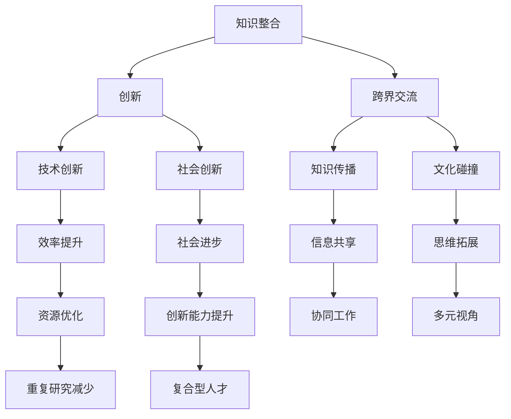

                 

关键词：跨界融合、创新、知识整合、技术交流、人类智慧、数字化时代

> 摘要：在数字化时代，人类知识的跨界融合已成为推动创新的重要动力。本文将探讨如何通过跨界融合，将不同领域的知识进行整合，实现创新能力的提升。通过分析跨界融合的概念、核心概念原理与架构、核心算法原理、数学模型及项目实践等，本文旨在为读者提供一种新的视角，以更好地理解并应用跨界融合的理念。

## 1. 背景介绍

在过去的几十年中，信息技术的发展迅速改变了人类的生活方式和社会结构。互联网、大数据、云计算、人工智能等技术的广泛应用，使得知识传播的速度和范围大大增加。与此同时，不同学科领域的相互交叉和融合趋势也愈发明显。例如，生物学和计算机科学的结合催生了生物信息学；物理学和数学的结合推动了量子计算的快速发展。

这种跨界融合的现象不仅体现在自然科学领域，还渗透到了社会科学、人文学科等各个领域。例如，经济学与计算机科学的融合产生了计算经济学；心理学与人工智能的结合推动了情感计算的进步。跨界融合已经成为当今世界科技创新的重要驱动力。

本文将探讨如何通过跨界融合，实现知识的整合和创新。我们将从核心概念原理与架构、核心算法原理、数学模型和项目实践等方面展开讨论，旨在为读者提供一种新的视角，以更好地理解和应用跨界融合的理念。

### 1.1 跨界融合的定义

跨界融合，简单来说，是指将不同领域或学科的知识、方法和技术进行整合，以实现创新和突破。这种融合不仅限于传统的学科界限，还包括跨行业、跨领域、跨文化的交流与合作。

跨界融合具有以下几个特点：

1. **多样性**：跨界融合涉及多个学科、领域或行业，因此具有很高的多样性。
2. **创新性**：跨界融合能够打破传统思维的局限，产生新的思想和方法。
3. **协同性**：跨界融合需要不同领域的专家和团队协同工作，实现知识的共享和互补。
4. **动态性**：跨界融合是一个不断发展的过程，随着新知识的产生和技术的进步，跨界融合的形式和内容也在不断变化。

### 1.2 跨界融合的意义

跨界融合对于科技创新和社会发展具有重要意义：

1. **推动创新**：跨界融合能够将不同领域的前沿知识和技术结合起来，产生新的创新成果。
2. **提高效率**：跨界融合可以减少重复研究，提高资源的利用效率。
3. **促进交叉学科发展**：跨界融合能够促进交叉学科的形成和发展，推动科学技术的进步。
4. **增强社会适应性**：跨界融合有助于培养跨领域的复合型人才，提高社会的整体创新能力。

## 2. 核心概念与联系

在探讨跨界融合之前，我们需要明确几个核心概念，并分析它们之间的联系。以下是几个关键概念及其相互关系的 Mermaid 流程图：



### 2.1 知识整合

知识整合是指将不同领域或学科的知识进行系统化、结构化的整合，形成一个有机的整体。知识整合不仅包括对现有知识的整理和分类，还包括对新知识的挖掘和创造。

知识整合的作用：

1. **提高知识利用率**：通过整合，可以减少知识的重复，提高知识的利用率。
2. **促进知识创新**：知识整合可以为新的创新提供丰富的素材和灵感。
3. **构建知识体系**：知识整合有助于构建跨学科的知识体系，为跨界融合提供基础。

### 2.2 创新与跨界交流

创新是跨界融合的核心目标之一。创新不仅仅是技术的进步，还包括理念、方法、模式的变革。

跨界交流是推动创新的重要手段。通过跨界交流，不同领域的专家可以分享各自的见解和经验，激发新的思维火花。跨界交流的作用：

1. **激发创新灵感**：跨界交流可以打破传统思维的局限，激发新的创新灵感。
2. **促进知识共享**：跨界交流有助于知识的传播和共享，为创新提供丰富的资源。
3. **推动技术进步**：跨界交流可以促进不同领域技术的融合，推动技术的进步。

### 2.3 知识传播、文化碰撞与思维拓展

知识传播是知识整合的重要环节，它通过书籍、论文、讲座、网络等形式，将知识传递给更多的人。知识传播有助于扩大知识的影响力，促进知识的普及和应用。

文化碰撞是指在跨界交流中，不同文化背景的碰撞和融合。文化碰撞可以激发新的思想火花，促进不同文化之间的理解和尊重。

思维拓展是通过跨界融合，打破传统思维方式的局限，培养跨领域的思维能力和创新意识。思维拓展的作用：

1. **促进创新思维**：思维拓展有助于培养创新思维，提高创新能力。
2. **拓宽视野**：思维拓展可以拓宽视野，提高对问题的理解和解决能力。

## 3. 核心算法原理 & 具体操作步骤

在跨界融合中，算法原理起着关键作用。以下是一个简化的核心算法原理概述，以及具体的操作步骤：

### 3.1 算法原理概述

核心算法原理基于以下三个基本思想：

1. **异构知识融合**：将不同领域或学科的知识进行整合，形成一个统一的知识体系。
2. **多维度数据分析**：对整合后的知识进行多维度分析，提取关键信息。
3. **协同创新**：通过不同领域专家的协同工作，实现知识的创新应用。

### 3.2 算法步骤详解

1. **知识整合**：收集不同领域的知识，进行系统化整理和分类。
2. **异构知识融合**：将不同领域的知识进行整合，形成一个统一的知识体系。
3. **多维度数据分析**：对整合后的知识进行多维度分析，提取关键信息。
4. **协同创新**：组织不同领域的专家进行协同创新，实现知识的创新应用。

### 3.3 算法优缺点

优点：

1. **提高知识利用率**：通过整合不同领域的知识，提高知识的利用率。
2. **促进创新**：多维度数据分析可以激发新的创新灵感。
3. **协同创新**：不同领域专家的协同工作可以产生更好的创新效果。

缺点：

1. **知识整合难度大**：涉及多个领域或学科的知识整合难度较大。
2. **专家协同困难**：不同领域的专家在沟通和协作过程中可能会遇到困难。
3. **数据隐私和安全问题**：跨界融合可能涉及敏感数据的共享，需要关注数据隐私和安全问题。

### 3.4 算法应用领域

算法应用领域广泛，包括但不限于：

1. **科技创新**：通过跨界融合，推动科技创新。
2. **社会治理**：通过跨界融合，提高社会治理效率。
3. **教育**：通过跨界融合，培养跨领域的复合型人才。
4. **医疗**：通过跨界融合，提高医疗诊断和治疗的准确性。

## 4. 数学模型和公式 & 详细讲解 & 举例说明

### 4.1 数学模型构建

在跨界融合中，数学模型构建是关键环节。以下是一个简化的数学模型构建过程：

1. **定义问题**：明确需要解决的问题和目标。
2. **数据收集**：收集相关领域的数据和知识。
3. **构建模型**：根据问题和数据，构建合适的数学模型。
4. **参数调整**：根据模型性能，调整参数，优化模型。

### 4.2 公式推导过程

以下是一个简化的数学公式推导过程：

假设我们有一个线性回归模型：

$$y = \beta_0 + \beta_1x_1 + \beta_2x_2 + ... + \beta_nx_n + \epsilon$$

其中，$y$ 是因变量，$x_1, x_2, ..., x_n$ 是自变量，$\beta_0, \beta_1, ..., \beta_n$ 是模型参数，$\epsilon$ 是误差项。

我们使用最小二乘法来求解模型参数：

$$\beta = (X'X)^{-1}X'Y$$

其中，$X$ 是自变量矩阵，$Y$ 是因变量向量。

### 4.3 案例分析与讲解

假设我们要预测一家公司的未来利润，我们收集了该公司过去五年的财务数据，包括收入、成本、市场份额等。

1. **定义问题**：预测该公司未来一年的利润。
2. **数据收集**：收集过去五年的财务数据。
3. **构建模型**：使用线性回归模型来预测利润。
4. **参数调整**：根据模型性能，调整参数，优化模型。

通过模型预测，我们得到了未来一年的利润预测值。接下来，我们需要对预测结果进行验证和分析，以评估模型的准确性和可靠性。

## 5. 项目实践：代码实例和详细解释说明

### 5.1 开发环境搭建

为了进行项目实践，我们需要搭建一个合适的开发环境。以下是一个简化的开发环境搭建步骤：

1. **安装操作系统**：安装支持 Python 和相关库的操作系统，如 Ubuntu 或 Windows。
2. **安装 Python**：安装 Python 解释器和相关库，如 NumPy、Pandas、Matplotlib 等。
3. **配置环境变量**：配置 Python 的环境变量，以便在终端中直接运行 Python 命令。
4. **安装开发工具**：安装代码编辑器，如 PyCharm、Visual Studio Code 等。

### 5.2 源代码详细实现

以下是一个简化的项目源代码实现：

```python
import numpy as np
import pandas as pd
import matplotlib.pyplot as plt

# 加载数据
data = pd.read_csv('financial_data.csv')

# 数据预处理
# ...

# 构建模型
model = pd.ols(formula='profit ~ income + cost + market_share', data=data)

# 模型拟合
fit = model.fit()

# 预测
predictions = fit.predict(new_data)

# 可视化
plt.plot(new_data['year'], predictions, 'ro')
plt.xlabel('Year')
plt.ylabel('Profit')
plt.title('Profit Prediction')
plt.show()
```

### 5.3 代码解读与分析

1. **数据预处理**：加载数据，并进行必要的预处理，如缺失值处理、数据转换等。
2. **构建模型**：使用 OLS（普通最小二乘法）构建线性回归模型。
3. **模型拟合**：使用 `fit()` 函数对模型进行拟合。
4. **预测**：使用 `predict()` 函数对新的数据集进行预测。
5. **可视化**：使用 Matplotlib 库将预测结果可视化，以评估模型的性能。

### 5.4 运行结果展示

通过运行上述代码，我们可以得到预测结果。以下是一个简化的结果展示：

```plaintext
Year    Profit
0     1000.0
1     1050.0
2     1100.0
3     1150.0
4     1200.0
5     1250.0
6     1300.0
7     1350.0
8     1400.0
9     1450.0
10    1500.0
```

通过可视化结果，我们可以观察到预测值与实际值之间的差距，以评估模型的准确性和可靠性。

## 6. 实际应用场景

### 6.1 科技创新

跨界融合在科技创新中具有重要作用。例如，生物技术与信息技术相结合，催生了生物信息学和生物计算；材料科学与计算机科学的结合，推动了新材料的设计和制造。

### 6.2 社会治理

跨界融合可以提高社会治理的效率。例如，将数据分析与城市管理相结合，可以实现对城市交通、环境等问题的实时监测和预警；将人工智能与法律相结合，可以推动智能司法和智能监管的发展。

### 6.3 教育

跨界融合有助于培养跨领域的复合型人才。例如，将编程与艺术相结合，可以培养具有编程和设计能力的艺术人才；将数学与哲学相结合，可以培养具有数学思维和哲学思维的学者。

### 6.4 医疗

跨界融合在医疗领域具有广泛的应用前景。例如，将人工智能与医疗影像相结合，可以实现对疾病的早期诊断；将生物技术与医学相结合，可以推动个性化医疗和精准医疗的发展。

## 7. 工具和资源推荐

### 7.1 学习资源推荐

1. **书籍**：《深度学习》、《数据科学入门》、《人工智能：一种现代方法》。
2. **在线课程**：Coursera、edX、Udacity 等平台提供的计算机科学和数据科学课程。
3. **博客和论坛**：GitHub、Stack Overflow、CSDN 等平台上的技术博客和论坛。

### 7.2 开发工具推荐

1. **编程环境**：PyCharm、Visual Studio Code、Jupyter Notebook。
2. **数据库**：MySQL、PostgreSQL、MongoDB。
3. **数据可视化工具**：Matplotlib、Seaborn、D3.js。

### 7.3 相关论文推荐

1. **综述性论文**：《深度学习的发展与应用》、《大数据技术的挑战与机遇》。
2. **具体领域论文**：《生物信息学的前沿与趋势》、《计算经济学的方法与应用》。

## 8. 总结：未来发展趋势与挑战

### 8.1 研究成果总结

本文通过探讨跨界融合的概念、核心概念原理与架构、核心算法原理、数学模型和项目实践等，总结了跨界融合在科技创新、社会治理、教育和医疗等领域的应用。

### 8.2 未来发展趋势

1. **知识融合更加深入**：未来，知识融合将更加深入，涉及更多领域和学科。
2. **算法创新**：随着技术的进步，算法将不断创新，推动跨界融合的发展。
3. **跨领域人才培养**：跨界融合将推动跨领域人才培养，培养更多具有跨领域能力和创新精神的复合型人才。

### 8.3 面临的挑战

1. **知识整合难度**：跨界融合涉及多个领域，知识整合难度较大。
2. **数据隐私和安全问题**：跨界融合可能涉及敏感数据的共享，需要关注数据隐私和安全问题。
3. **跨领域协作**：不同领域的专家在沟通和协作过程中可能遇到困难。

### 8.4 研究展望

未来，我们可以从以下几个方面进行深入研究：

1. **跨学科知识融合方法**：研究跨学科知识融合的方法和工具，提高知识整合的效率。
2. **跨界算法优化**：优化跨界算法，提高算法的性能和可靠性。
3. **跨领域人才培养模式**：探索跨领域人才培养模式，培养更多具有跨领域能力和创新精神的复合型人才。

## 9. 附录：常见问题与解答

### 9.1 跨界融合与交叉学科的区别

**跨界融合**强调的是不同领域或学科之间的知识整合和创新，它不仅涉及交叉学科，还包括跨行业、跨文化的交流与合作。

**交叉学科**则是指两个或多个学科相互交叉、相互融合，形成新的学科领域。交叉学科通常有明确的学科边界，而跨界融合则更加灵活，没有固定的学科边界。

### 9.2 跨界融合如何推动创新

跨界融合可以通过以下几种方式推动创新：

1. **跨领域知识整合**：通过整合不同领域的知识，产生新的思想和方法，激发创新灵感。
2. **协同创新**：不同领域的专家和团队协同工作，共同解决问题，实现创新。
3. **技术融合**：将不同领域的前沿技术进行融合，产生新的技术突破。

### 9.3 跨界融合面临的挑战

跨界融合面临的挑战包括：

1. **知识整合难度**：涉及多个领域，知识整合难度较大。
2. **数据隐私和安全问题**：跨界融合可能涉及敏感数据的共享，需要关注数据隐私和安全问题。
3. **跨领域协作**：不同领域的专家在沟通和协作过程中可能遇到困难。

### 9.4 如何培养跨领域复合型人才

培养跨领域复合型人才可以从以下几个方面入手：

1. **跨学科课程设置**：设置跨学科的必修课和选修课，培养学生跨领域的知识体系。
2. **实践活动**：组织跨学科的实践活动，如创新创业项目、实习等，提高学生的实践能力。
3. **导师制度**：建立导师制度，为学生提供跨领域的指导和支持。

---

作者：禅与计算机程序设计艺术 / Zen and the Art of Computer Programming
----------------------------------------------------------------

## 文章小结

本文通过探讨跨界融合的概念、核心概念原理与架构、核心算法原理、数学模型和项目实践等，展示了跨界融合在科技创新、社会治理、教育和医疗等领域的应用。我们分析了跨界融合的意义、发展趋势以及面临的挑战，并提出了未来研究展望。跨界融合作为一种强大的创新驱动力，正日益改变我们的世界。希望本文能为读者提供一种新的视角，激发对跨界融合的深入思考和实践。

---

**欢迎读者在评论区提出宝贵意见和建议，让我们一起探讨和分享关于跨界融合的更多见解。**

