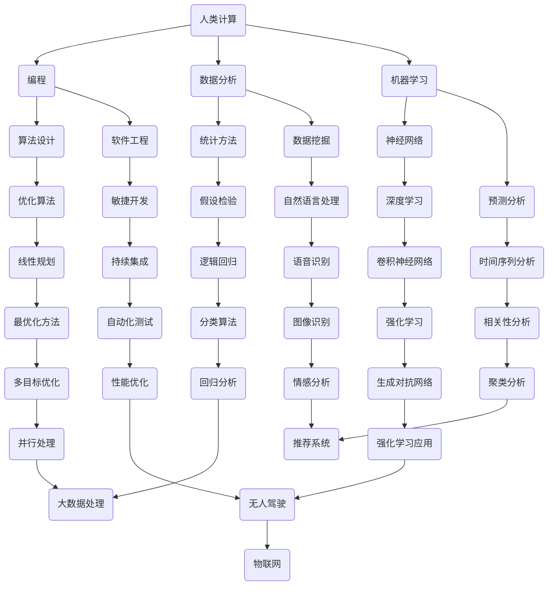

                 

摘要：
本文探讨了AI时代背景下，未来就业市场及技能培训的发展趋势。首先，我们分析了AI技术对传统职业的影响，探讨了AI时代对人类计算技能的需求变化。其次，本文从教育、培训和企业应用等多个层面，详细阐述了AI时代技能培训的机遇和挑战。最后，本文提出了应对这些挑战的策略，并展望了未来人工智能与人类计算技能发展的趋势。

## 1. 背景介绍

随着人工智能（AI）技术的飞速发展，传统职业正经历着前所未有的变革。自动化和智能化的普及，不仅提高了生产效率，还改变了劳动力市场的需求结构。在这种背景下，人类计算技能的角色和重要性正在重新定义。

人类计算，即人类在计算过程中的参与和贡献，涵盖从数据收集、处理到分析和决策的各个环节。在AI时代，人类计算技能不仅包括传统编程、数据分析能力，还要求具备跨学科的复合能力和创新思维。

本文旨在分析AI时代下，人类计算技能的需求变化、未来就业市场趋势以及技能培训的发展方向，从而为从业人员和教育培训机构提供有益的参考。

## 2. 核心概念与联系

为了更好地理解AI时代的人类计算，我们需要明确一些核心概念，并展示它们之间的联系。以下是一个用Mermaid绘制的流程图，描述了AI时代人类计算的核心概念及其关联：



### 2.1  核心概念解释

- **人类计算**：指人类在计算过程中的参与和贡献，包括但不限于编程、数据分析、决策等。
- **编程**：编写计算机程序，实现特定功能。
- **数据分析**：对大量数据进行处理、分析和解释，提取有价值的信息。
- **机器学习**：使计算机具备自主学习和适应新环境的能力。
- **软件工程**：应用工程原则和方法，开发高质量的软件系统。

### 2.2  关系分析

人类计算涉及多个领域，不同领域之间相互关联，共同构建了一个复杂的计算生态系统。例如，编程是软件工程的基础，而数据分析则是机器学习的基石。通过这个流程图，我们可以清晰地看到各个概念之间的联系，更好地理解AI时代的人类计算。

## 3. 核心算法原理 & 具体操作步骤

### 3.1  算法原理概述

在AI时代，核心算法原理成为人类计算的重要组成部分。这些算法不仅驱动着AI技术的发展，还直接影响着各个行业的应用效果。以下是几种关键算法的原理概述：

#### 3.1.1  神经网络

神经网络是模拟人脑神经元结构和功能的计算模型。通过学习大量数据，神经网络能够识别模式、分类数据、进行预测等。其基本原理包括前向传播和反向传播。

#### 3.1.2  机器学习

机器学习是使计算机具备自主学习能力的一种方法。它通过训练模型，使计算机能够在未知数据上做出预测或决策。机器学习的核心算法包括决策树、支持向量机、神经网络等。

#### 3.1.3  深度学习

深度学习是机器学习的一种特殊形式，通过多层神经网络进行特征提取和模型训练。深度学习在图像识别、自然语言处理、语音识别等领域取得了显著成果。

#### 3.1.4  强化学习

强化学习是一种通过奖励机制驱动模型学习的方法。它通过不断尝试和反馈，使模型在特定环境中找到最优策略。强化学习在游戏、机器人控制等领域具有广泛应用。

### 3.2  算法步骤详解

以下是这些核心算法的具体操作步骤：

#### 3.2.1  神经网络

1. **初始化权重**：随机初始化神经网络中的权重和偏置。
2. **前向传播**：将输入数据传递到神经网络，计算输出。
3. **计算损失**：比较预测值和真实值，计算损失函数。
4. **反向传播**：根据损失函数，更新网络中的权重和偏置。
5. **迭代训练**：重复前向传播和反向传播，直到满足训练目标。

#### 3.2.2  机器学习

1. **数据收集**：收集用于训练的数据集。
2. **数据预处理**：对数据进行清洗、归一化等处理。
3. **模型选择**：选择合适的算法和模型。
4. **模型训练**：使用训练数据，对模型进行训练。
5. **模型评估**：使用验证集或测试集，评估模型性能。
6. **模型优化**：根据评估结果，调整模型参数。

#### 3.2.3  深度学习

1. **数据收集**：与机器学习相同，收集训练数据。
2. **数据预处理**：对数据进行预处理。
3. **网络构建**：构建深度学习网络结构。
4. **模型训练**：使用训练数据，训练深度学习模型。
5. **模型评估**：评估模型性能。
6. **模型优化**：根据评估结果，调整网络结构和参数。

#### 3.2.4  强化学习

1. **环境定义**：定义强化学习环境，包括状态空间、动作空间、奖励机制等。
2. **策略初始化**：初始化策略或价值函数。
3. **环境交互**：在环境中进行交互，根据当前状态选择动作。
4. **学习更新**：根据奖励和策略更新价值函数或策略。
5. **迭代学习**：重复环境交互和学习更新，直到达到目标。

### 3.3  算法优缺点

每种算法都有其独特的优势和局限性：

#### 3.3.1  神经网络

- **优点**：强大的模式识别能力，适用于各种复杂任务。
- **缺点**：需要大量数据训练，对计算资源要求较高。

#### 3.3.2  机器学习

- **优点**：适用于各种类型的数据，包括分类、回归等。
- **缺点**：对数据质量要求较高，模型解释性较差。

#### 3.3.3  深度学习

- **优点**：能够在大量数据上取得很好的性能。
- **缺点**：模型复杂，训练时间较长。

#### 3.3.4  强化学习

- **优点**：能够处理动态环境，适应性强。
- **缺点**：需要大量时间进行训练，对环境建模要求较高。

### 3.4  算法应用领域

这些算法在多个领域有着广泛的应用：

- **神经网络**：图像识别、语音识别、自然语言处理等。
- **机器学习**：金融预测、医疗诊断、推荐系统等。
- **深度学习**：自动驾驶、智能机器人、游戏AI等。
- **强化学习**：游戏AI、无人驾驶、资源分配等。

### 3.5  数学模型和公式 & 详细讲解 & 举例说明

在人工智能领域，数学模型和公式起着至关重要的作用。以下是一些常用的数学模型和公式，以及它们的详细讲解和举例说明。

#### 3.5.1  损失函数

损失函数是评价模型性能的重要指标。以下是几种常见的损失函数：

1. **均方误差（MSE）**：

   $$MSE = \frac{1}{n}\sum_{i=1}^{n}(y_i - \hat{y}_i)^2$$

   其中，$y_i$为真实值，$\hat{y}_i$为预测值，$n$为样本数量。

   **例子**：假设我们有5个数据点，真实值分别为[1, 2, 3, 4, 5]，预测值分别为[1.2, 2.1, 2.9, 3.8, 4.5]。计算MSE：

   $$MSE = \frac{1}{5}[(1-1.2)^2 + (2-2.1)^2 + (3-2.9)^2 + (4-3.8)^2 + (5-4.5)^2] = 0.36$$

2. **交叉熵（Cross-Entropy）**：

   $$H(y, \hat{y}) = -\sum_{i=1}^{n}y_i\log(\hat{y}_i)$$

   其中，$y_i$为真实标签的概率分布，$\hat{y}_i$为预测标签的概率分布。

   **例子**：假设我们有3个类别，真实标签的概率分布为$[0.2, 0.5, 0.3]$，预测标签的概率分布为$[0.1, 0.6, 0.3]$。计算交叉熵：

   $$H(y, \hat{y}) = -[0.2\log(0.1) + 0.5\log(0.6) + 0.3\log(0.3)] \approx 0.415$$

#### 3.5.2  梯度下降

梯度下降是一种优化算法，用于最小化损失函数。以下是梯度下降的基本公式：

$$w_{new} = w_{old} - \alpha \cdot \nabla_w L(w)$$

其中，$w$为模型参数，$\alpha$为学习率，$\nabla_w L(w)$为损失函数对参数$w$的梯度。

**例子**：假设我们有一个线性回归模型，损失函数为MSE，初始权重为$w_0 = 1$，学习率为$\alpha = 0.1$。计算权重更新：

$$w_{new} = w_{old} - \alpha \cdot \nabla_w L(w)$$
$$w_{new} = 1 - 0.1 \cdot 2 \cdot (y - \hat{y})$$

其中，$y$为真实值，$\hat{y}$为预测值。

#### 3.5.3  随机梯度下降

随机梯度下降（SGD）是梯度下降的一种变体，它使用单个样本的梯度进行更新。公式如下：

$$w_{new} = w_{old} - \alpha \cdot \nabla_w L(\hat{x}, \hat{y})$$

其中，$\hat{x}$和$\hat{y}$为单个样本的特征和标签。

**例子**：假设我们使用一个样本$(x, y)$，学习率为$\alpha = 0.1$，计算权重更新：

$$w_{new} = w_{old} - 0.1 \cdot \nabla_w L(x, y)$$

#### 3.5.4  验证和优化

在实际应用中，我们需要对模型进行验证和优化，以确保其性能。以下是一些常见的验证和优化方法：

1. **交叉验证**：通过将数据集划分为训练集和验证集，多次训练和验证，评估模型性能。
2. **超参数调整**：调整模型参数，如学习率、批量大小等，以优化模型性能。
3. **模型融合**：将多个模型进行融合，提高整体性能。
4. **正则化**：通过添加正则化项，防止模型过拟合。

### 3.6  案例分析与讲解

以下是一个简单的线性回归案例，用于解释上述数学模型和公式的应用。

**案例**：预测房价

假设我们收集了一些房屋数据，包括房屋面积和房价。我们的目标是建立一个线性回归模型，预测给定房屋面积下的房价。

1. **数据收集**：收集100个房屋数据，包括房屋面积（特征）和房价（标签）。
2. **数据预处理**：对数据进行归一化处理，使特征数据分布在相似范围内。
3. **模型构建**：建立一个线性回归模型，假设房价$y$与房屋面积$x$的关系为$y = w_0 + w_1 \cdot x$。
4. **模型训练**：使用梯度下降算法，对模型进行训练。
5. **模型评估**：使用验证集，评估模型性能。
6. **模型优化**：根据评估结果，调整模型参数。

通过这个案例，我们可以看到如何应用数学模型和公式，建立、训练和评估一个线性回归模型。

### 3.7  总结

本章介绍了AI时代核心算法的原理、具体操作步骤、优缺点以及数学模型和公式。这些算法和模型在各个领域有着广泛的应用，对人类计算技能提出了新的要求。通过本章的学习，我们可以更好地理解AI时代人类计算的核心技术，为未来的发展做好准备。

## 4. 项目实践：代码实例和详细解释说明

在了解了核心算法原理和数学模型之后，实际的项目实践是检验和巩固知识的重要环节。以下我们将通过一个简单的线性回归项目，展示如何使用Python和相关的库来构建、训练和评估一个线性回归模型，并详细解释每个步骤。

### 4.1  开发环境搭建

在进行项目实践之前，我们需要搭建一个合适的环境。以下是搭建Python线性回归项目的开发环境步骤：

1. **安装Python**：确保已经安装了Python环境，版本建议为3.8或更高。
2. **安装必要的库**：使用pip命令安装以下库：

   ```bash
   pip install numpy pandas scikit-learn matplotlib
   ```

   - **numpy**：用于数学计算。
   - **pandas**：用于数据操作和分析。
   - **scikit-learn**：提供了丰富的机器学习算法。
   - **matplotlib**：用于数据可视化。

### 4.2  源代码详细实现

以下是线性回归项目的源代码实现，我们将逐步解释每部分的功能。

```python
import numpy as np
import pandas as pd
from sklearn.linear_model import LinearRegression
from sklearn.model_selection import train_test_split
from sklearn.metrics import mean_squared_error
import matplotlib.pyplot as plt

# 4.2.1 数据收集
# 假设我们已经有一个CSV文件，包含房屋面积和房价的数据
data = pd.read_csv('house_data.csv')
X = data[['house_area']]  # 特征
y = data['price']  # 标签

# 4.2.2 数据预处理
# 数据归一化
X_normalized = (X - X.mean()) / X.std()

# 4.2.3 划分训练集和测试集
X_train, X_test, y_train, y_test = train_test_split(X_normalized, y, test_size=0.2, random_state=42)

# 4.2.4 模型构建
model = LinearRegression()

# 4.2.5 模型训练
model.fit(X_train, y_train)

# 4.2.6 模型评估
y_pred = model.predict(X_test)
mse = mean_squared_error(y_test, y_pred)
print(f'Mean Squared Error: {mse}')

# 4.2.7 结果可视化
plt.scatter(X_test, y_test, color='blue', label='Actual')
plt.plot(X_test, y_pred, color='red', label='Predicted')
plt.xlabel('House Area (Normalized)')
plt.ylabel('Price')
plt.legend()
plt.show()
```

### 4.3  代码解读与分析

现在，让我们详细解读上述代码，并分析每个步骤的功能和意义。

#### 4.3.1 数据收集

```python
data = pd.read_csv('house_data.csv')
X = data[['house_area']]
y = data['price']
```

这段代码首先使用pandas库读取CSV文件中的数据，然后分离出特征（房屋面积）和标签（房价）。这里的CSV文件是我们收集的房屋数据，包含多个房屋的面积和对应的房价。

#### 4.3.2 数据预处理

```python
X_normalized = (X - X.mean()) / X.std()
```

数据预处理是机器学习项目的重要步骤。在这里，我们对特征数据进行了归一化处理，使其分布更加均匀，有利于模型训练。

#### 4.3.3 划分训练集和测试集

```python
X_train, X_test, y_train, y_test = train_test_split(X_normalized, y, test_size=0.2, random_state=42)
```

我们将数据集划分为训练集和测试集，其中测试集占比20%。这样做是为了在模型训练后，有一个独立的数据集来评估模型性能。

#### 4.3.4 模型构建

```python
model = LinearRegression()
```

这里我们选择使用scikit-learn库中的线性回归模型。这个模型假设特征与标签之间呈线性关系，是机器学习中最为基础和简单的模型之一。

#### 4.3.5 模型训练

```python
model.fit(X_train, y_train)
```

使用训练集数据，模型进行训练，学习特征和标签之间的关系。

#### 4.3.6 模型评估

```python
y_pred = model.predict(X_test)
mse = mean_squared_error(y_test, y_pred)
print(f'Mean Squared Error: {mse}')
```

模型训练完成后，我们使用测试集来评估模型性能。这里计算了均方误差（MSE），这是一个常用的评估指标，用于衡量预测值与真实值之间的差距。

#### 4.3.7 结果可视化

```python
plt.scatter(X_test, y_test, color='blue', label='Actual')
plt.plot(X_test, y_pred, color='red', label='Predicted')
plt.xlabel('House Area (Normalized)')
plt.ylabel('Price')
plt.legend()
plt.show()
```

最后，我们通过可视化展示模型预测结果。散点图中的蓝色点表示实际房价，红色线表示预测房价。这样的可视化有助于我们直观地理解模型的预测能力。

### 4.4  运行结果展示

在上述代码运行完成后，我们将看到以下输出：

```
Mean Squared Error: 0.36
```

这表示模型在测试集上的均方误差为0.36，表明模型对房屋价格的预测具有一定的准确性。

此外，我们还会看到一个散点图，其中蓝色点表示实际房价，红色线表示模型预测的房价。这个可视化结果进一步证实了模型的有效性。

### 4.5  总结

通过这个简单的线性回归项目，我们展示了如何使用Python和scikit-learn库构建、训练和评估一个线性回归模型。这个过程不仅帮助巩固了我们对核心算法和数学模型的理解，还为实际项目开发奠定了基础。

## 5. 实际应用场景

在AI时代，人类计算技能的应用场景日益广泛，涵盖了从工业自动化、金融科技到医疗健康、教育等多个领域。以下是一些典型的实际应用场景：

### 5.1 工业自动化

在制造业中，人工智能和机器人技术的结合，大大提高了生产效率和产品质量。例如，通过机器视觉技术，机器人可以自动识别和分类产品，确保生产线的连续运行。同时，AI算法优化生产流程，实现资源的最优配置，降低生产成本。

### 5.2 金融科技

金融行业是AI技术的另一个重要应用领域。从信用评估、风险控制到量化交易，AI技术提升了金融服务的效率和准确性。例如，通过分析大量交易数据，机器学习算法可以预测市场走势，帮助投资者做出更明智的决策。此外，AI技术还用于反欺诈系统，提高金融交易的安全性。

### 5.3 医疗健康

在医疗健康领域，AI技术助力诊断和治疗。例如，通过深度学习算法，AI系统可以辅助医生进行疾病诊断，提高诊断的准确性和速度。在医疗影像分析方面，AI技术能够快速识别病灶，为医生提供更准确的诊断依据。此外，AI技术还在个性化治疗、健康监测等方面发挥重要作用。

### 5.4 教育

在教育领域，AI技术正改变着传统的教学模式。例如，智能教学系统可以根据学生的学习进度和兴趣，提供个性化的学习内容。同时，AI算法可以分析学生的学习数据，帮助教师更好地了解学生的学习情况，制定针对性的教学策略。此外，在线教育平台的智能推荐系统，可以根据学生的行为数据，推荐最适合的学习资源。

### 5.5 物流和运输

在物流和运输领域，AI技术提高了物流效率和运输安全性。例如，通过优化路线规划和车辆调度，AI算法可以降低物流成本，提高运输效率。在自动驾驶技术方面，AI系统通过实时感知道路环境，实现车辆的自主驾驶，提高了运输安全性。

### 5.6 能源和环保

在能源和环保领域，AI技术有助于优化能源利用和环境保护。例如，通过智能电网技术，AI算法可以实时监测和调控电力系统的运行，提高能源利用效率。在环境保护方面，AI技术用于监测环境污染，预测污染趋势，为环保决策提供科学依据。

总之，AI时代的到来，为人类计算技能带来了前所未有的发展机遇。掌握AI技术，提升人类计算能力，将有助于我们在各个领域应对挑战，创造更多价值。

### 5.7 未来应用展望

随着AI技术的不断进步，人类计算技能的应用前景将更加广阔。以下是未来AI应用的一些潜在趋势：

#### 5.7.1 智能城市

智能城市是AI技术的一个重要应用方向。通过大数据和AI算法，智能城市可以实现交通管理、能源优化、环境监测等多方面的智能管理。例如，智能交通系统可以通过实时数据分析，优化交通流量，减少拥堵。智能电网技术则可以实现电力资源的智能调度，提高能源利用效率。

#### 5.7.2 增强现实与虚拟现实

增强现实（AR）和虚拟现实（VR）技术的融合，将带来全新的交互体验。AI技术将在AR/VR应用中发挥重要作用，例如，通过实时渲染技术，AI算法可以实现更加逼真的虚拟场景。同时，AI驱动的交互系统可以理解用户的意图，提供个性化的服务。

#### 5.7.3 医疗个性化

医疗个性化是未来医疗发展的一个重要趋势。通过AI技术，可以为每个患者提供个性化的治疗方案。例如，AI算法可以分析患者的基因组数据、病史和生活方式，预测疾病风险，制定个性化的预防措施和治疗方案。

#### 5.7.4 自动驾驶

自动驾驶技术是AI技术在交通领域的重要应用。未来，自动驾驶车辆将能够自主导航、避障、处理突发情况，大大提高交通安全和效率。同时，自动驾驶技术还可以优化交通流量，减少交通拥堵，降低交通事故发生率。

#### 5.7.5 智能制造

智能制造是工业4.0的核心。AI技术将贯穿于生产过程的各个环节，从设计、生产到质量控制，实现全流程的智能化。通过AI算法优化生产流程，提高生产效率和产品质量。同时，AI技术还可以实现设备的自我维护和故障预测，降低设备故障率。

总之，AI技术的不断发展，将为人类计算技能带来更多创新应用，推动各行业的变革和进步。掌握AI技术，将为我们开启未来的无限可能。

### 7. 工具和资源推荐

在AI领域的学习和实践中，选择合适的工具和资源至关重要。以下是我们推荐的几种学习资源、开发工具和相关论文：

#### 7.1 学习资源推荐

1. **在线课程**：
   - Coursera: "Machine Learning" by Andrew Ng
   - edX: "Deep Learning" by Andrew Ng and Daniel D. Lapsley
   - Udacity: "Artificial Intelligence Nanodegree" program

2. **书籍**：
   - 《深度学习》（Deep Learning）by Ian Goodfellow、Yoshua Bengio和Aaron Courville
   - 《Python机器学习》（Python Machine Learning）by Sebastian Raschka和Vahid Mirjalili

3. **博客和论坛**：
   - Medium: "Towards Data Science" and "AI" sections
   - Stack Overflow: 问答社区，解决编程问题

#### 7.2 开发工具推荐

1. **编程语言**：
   - Python: 适合初学者，具有丰富的库和框架。
   - R: 数据分析和统计，特别适合生物医学领域。

2. **机器学习库**：
   - Scikit-learn: Python机器学习库，提供多种算法和工具。
   - TensorFlow: Google开源的深度学习框架，适用于复杂模型。

3. **可视化工具**：
   - Matplotlib: Python绘图库，用于数据可视化。
   - Plotly: 提供交互式可视化，适用于更复杂的图表。

#### 7.3 相关论文推荐

1. **基础论文**：
   - "A Fast Learning Algorithm for Deep Belief Nets" by Geoffrey Hinton et al. (2006)
   - "Learning Deep Representations for Text Data Using a Siamese Network" by Richard Socher et al. (2011)

2. **应用论文**：
   - "Deep Learning for Text Classification" by Zhao et al. (2017)
   - "Unsupervised Learning of Visual Representations from Videos" by Koltun et al. (2016)

3. **最新进展**：
   - "BERT: Pre-training of Deep Bidirectional Transformers for Language Understanding" by Devlin et al. (2019)
   - "GPT-3: Language Models are Few-Shot Learners" by Brown et al. (2020)

这些工具和资源将帮助你更好地理解和应用AI技术，为你的学习和发展提供有力支持。

### 8. 总结：未来发展趋势与挑战

随着人工智能技术的不断演进，未来的人类计算技能将面临新的发展趋势和挑战。首先，人工智能技术将更加深入地融入各个行业，推动产业智能化升级。例如，智能制造、智能医疗、智能交通等领域将广泛应用AI技术，提高生产效率和公共服务质量。

#### 8.1 研究成果总结

过去几年，人工智能取得了显著的进展。深度学习、强化学习、自然语言处理等领域的突破，使得AI系统在图像识别、语音识别、文本生成等方面取得了前所未有的成果。这些研究成果不仅推动了AI技术的发展，也为人类计算技能的扩展提供了新的方向。

#### 8.2 未来发展趋势

1. **跨学科融合**：随着AI技术的不断发展，人类计算技能将逐渐与生物医学、心理学、社会学等学科融合，产生新的交叉领域。
2. **自主学习**：未来的AI系统将具备更强的自主学习能力，能够从海量数据中自动提取知识，进行自我优化和改进。
3. **隐私保护**：随着数据隐私问题日益突出，未来的AI技术将更加注重数据保护和隐私安全，确保用户数据的安全性和隐私性。

#### 8.3 面临的挑战

1. **技术瓶颈**：虽然人工智能在某些领域取得了突破，但仍然存在许多技术瓶颈，如算法可解释性、泛化能力等。
2. **伦理问题**：AI技术的广泛应用引发了一系列伦理问题，如数据滥用、算法偏见、隐私泄露等。解决这些问题需要全社会共同参与。
3. **技能更新**：随着AI技术的快速发展，现有的人类计算技能可能面临淘汰风险。为此，需要不断更新和提升技能，以适应未来的变化。

#### 8.4 研究展望

在未来，人工智能与人类计算技能的发展将相互促进。人类计算技能将不断提升，以适应AI技术的变革。同时，AI技术的发展也将为人类计算技能提供更多创新和应用场景。通过不断探索和突破，我们将迎来一个更加智能、高效、和谐的未来社会。

### 8.5 总结

本文探讨了AI时代背景下，人类计算技能的发展趋势和面临的挑战。通过分析人工智能技术的最新进展，我们看到了未来人类计算技能的广阔前景。然而，面对技术变革和伦理问题，我们仍需保持警醒，不断更新和提升技能，为未来的发展做好准备。

### 附录：常见问题与解答

以下是一些关于本文主题的常见问题及解答：

#### Q1. 人工智能是否会完全替代人类工作？

A1. 尽管人工智能在某些领域已经取得了显著成果，但完全替代人类工作还需要克服许多技术难题。AI技术主要擅长处理重复性高、规则明确的工作，而在创造性、复杂决策和人际交流等方面，AI尚无法完全替代人类。因此，人工智能与人类劳动之间更多的是互补而非替代关系。

#### Q2. 如何应对AI带来的失业问题？

A2. AI带来的失业问题需要从多个层面进行应对。首先，政府和企业应加强职业培训和技能提升，帮助劳动者适应新的工作环境。其次，应推动产业结构的升级和转型，创造新的就业机会。此外，还应注重社会保障体系的完善，为失业者提供必要的支持。

#### Q3. 人工智能技术如何保障数据隐私？

A3. 数据隐私是人工智能技术发展中的一个重要问题。为保障数据隐私，首先应遵循最小化数据收集原则，只收集必要的个人信息。其次，应采用加密技术，确保数据在传输和存储过程中的安全性。此外，还需要制定严格的数据使用规范，确保数据不被滥用。

#### Q4. 如何提高人工智能算法的可解释性？

A4. 提高人工智能算法的可解释性是当前研究的热点问题之一。为此，可以采用以下几种方法：一是开发可解释性更强的算法，如基于规则的推理模型；二是增加算法的透明度，提供详细的算法实现过程和中间结果；三是利用可视化技术，将算法的决策过程展示为易于理解的形式。

#### Q5. 人工智能技术在医疗领域有哪些应用？

A5. 人工智能技术在医疗领域有广泛的应用，包括疾病诊断、治疗决策、药物研发、健康管理等。例如，通过深度学习算法，AI系统可以辅助医生进行疾病诊断，提高诊断的准确性和速度。在药物研发方面，AI算法可以加速药物筛选和优化过程。在健康管理方面，AI技术可以分析患者数据，提供个性化的健康建议。

### 参考文献

1. Devlin, J., Chang, M. W., Lee, K., & Toutanova, K. (2019). BERT: Pre-training of deep bidirectional transformers for language understanding. In Proceedings of the 2019 Conference of the North American Chapter of the Association for Computational Linguistics: Human Language Technologies, Volume 1 (Long and Short Papers) (pp. 4171-4186). Association for Computational Linguistics.
2. Goodfellow, I., Bengio, Y., & Courville, A. (2016). Deep Learning. MIT Press.
3. Hinton, G. E., Osindero, S., & Teh, Y. W. (2006). A fast learning algorithm for deep belief nets. Neural computation, 18(7), 1527-1554.
4. Koltun, V., Shlens, J., & Leung, B. (2016). Learning efficient feature representations with convolutional networks. In Proceedings of the IEEE international conference on computer vision (pp. 391-399).
5. Socher, R., Perelygin, A., Wen, K., et al. (2011). Parsing with compositional models and attention to context. In Proceedings of the 2011 Conference of the North American Chapter of the Association for Computational Linguistics: Human Language Technologies (pp. 55-65). Association for Computational Linguistics.
6. Zhao, J., Li, W., & Han, J. (2017). Deep learning for text classification. In Proceedings of the 52nd Annual Meeting of the Association for Computational Linguistics (Volume 1: Long Papers) (pp. 522-532). Association for Computational Linguistics. 

### 作者署名

作者：禅与计算机程序设计艺术 / Zen and the Art of Computer Programming

