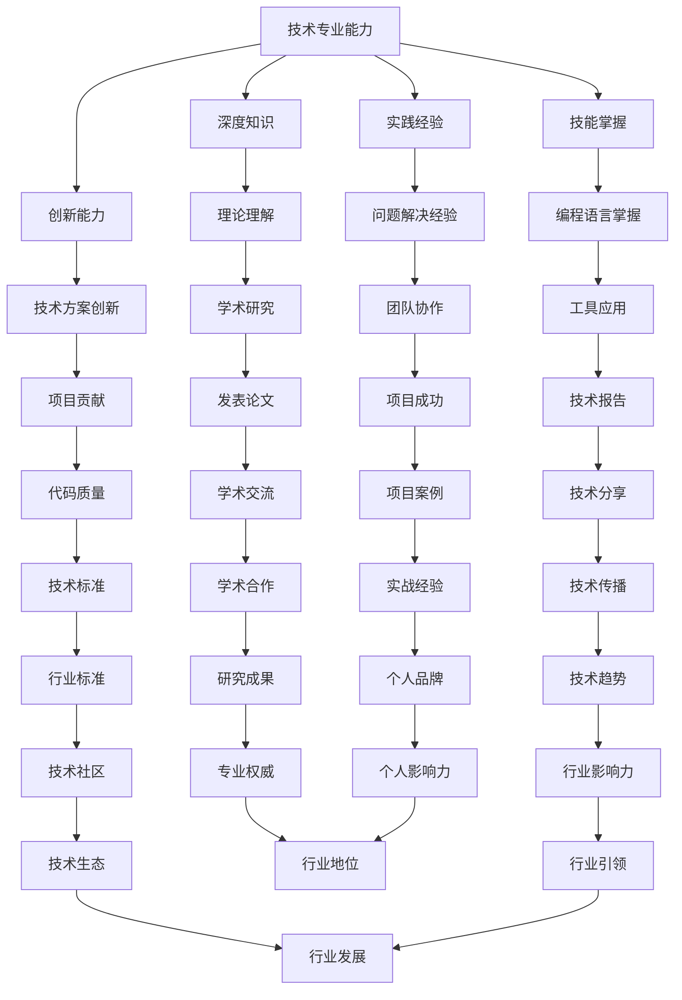
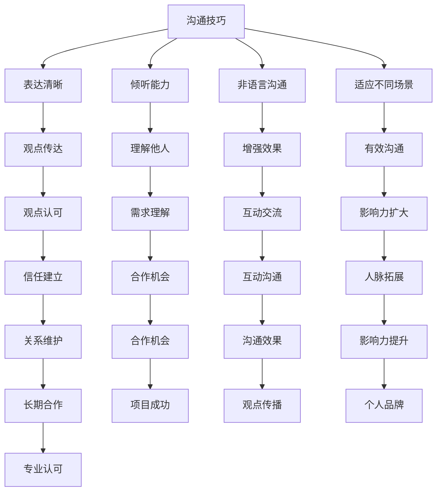
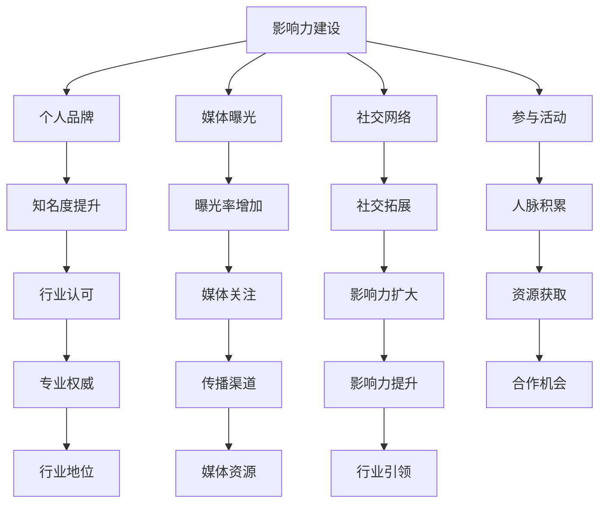
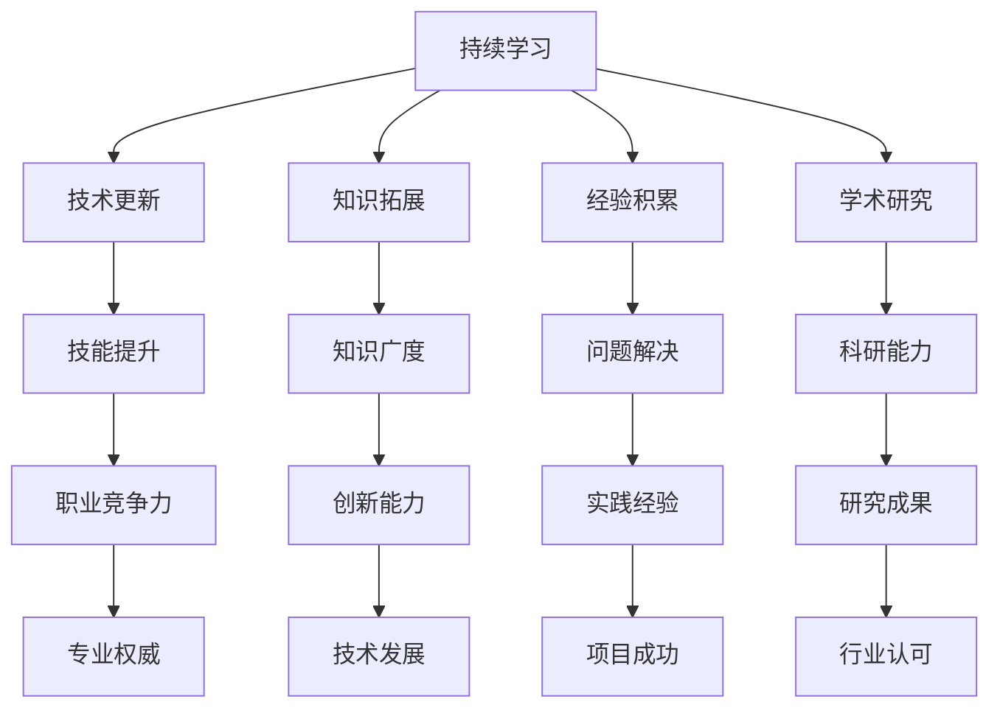

                 

关键词：技术专家、行业意见领袖、职业发展、影响力、沟通技巧、个人品牌建设、专业成长

> 摘要：本文旨在探讨技术专家如何通过提升沟通技巧、个人品牌建设和持续学习，成功转型为行业意见领袖。文章将从多个角度分析这一转型过程，提供实用建议和实践经验。

## 1. 背景介绍

在信息技术飞速发展的今天，技术专家的作用越来越受到重视。然而，仅仅拥有专业知识和技能已经不足以在激烈的市场竞争中脱颖而出。越来越多的高级技术人员开始意识到，要想在行业内取得更大的成功，需要转变角色，从技术专家向行业意见领袖转型。这一转变不仅要求技术专家在专业领域保持领先地位，还需要具备较强的沟通能力、影响力和个人品牌建设能力。

行业意见领袖是指在某个特定领域内具有广泛影响力和权威性的人物，他们的观点和建议常常被行业内人士关注和引用。要成为行业意见领袖，技术专家不仅需要深厚的专业知识和实践经验，还需要掌握有效的沟通技巧，建立个人品牌，并不断学习新的知识和技能。

本文将围绕这一主题展开，分析技术专家如何通过提升自身能力实现这一转型，并提供一些实际可行的建议和策略。

### 1.1 技术专家的角色定位

技术专家通常是指那些在某一技术领域内具有丰富知识和经验，能够解决复杂问题，并对该领域的发展做出重要贡献的专业人士。他们的角色主要涵盖以下几个方面：

1. **技术研发**：技术专家负责研究和开发新的技术解决方案，推动技术的创新和应用。
2. **技术指导**：在团队或项目中，技术专家提供技术指导和决策支持，确保项目的顺利进行。
3. **问题解决**：面对技术难题，技术专家能够快速找到解决方案，解决实际问题。
4. **知识传播**：技术专家通过撰写技术文章、参与技术讲座和培训等方式，将知识传授给更多的人。

### 1.2 行业意见领袖的特点

行业意见领袖具有以下几个显著特点：

1. **广泛的影响力**：他们的观点和建议在行业内具有很高的权威性和影响力，能够影响整个行业的发展方向。
2. **良好的沟通技巧**：行业意见领袖具备出色的沟通能力，能够清晰、准确地表达自己的观点，并有效地与他人交流。
3. **持续的学习能力**：他们不断学习新的知识和技能，紧跟行业发展趋势，保持自身的竞争力。
4. **良好的个人品牌**：他们建立了强大的个人品牌，成为行业内公认的专家和领导者。

### 1.3 技术专家向行业意见领袖转型的必要性

在当前信息化社会中，技术专家的角色正逐渐发生变化。传统的技术专家更多地关注于技术研发和问题解决，而行业意见领袖则需要更广泛的影响力、沟通能力和品牌建设能力。以下是从技术专家向行业意见领袖转型的一些必要性：

1. **提升职业竞争力**：随着技术的不断发展，仅仅拥有专业知识已经无法满足职场的需求。转型为行业意见领袖，可以提升个人的职业竞争力，拓展职业发展空间。
2. **扩大影响力**：通过成为行业意见领袖，技术专家可以扩大自身的影响力，提升个人和所在团队的品牌知名度。
3. **推动行业发展**：行业意见领袖可以发挥更大的作用，推动技术的创新和应用，引领行业的发展方向。
4. **实现个人价值**：通过影响更多的人，技术专家可以实现自身的价值，获得更大的成就感和满足感。

### 1.4 本文结构

本文将分为以下几个部分：

1. **核心概念与联系**：介绍成为行业意见领袖所需的核心概念和联系。
2. **核心算法原理 & 具体操作步骤**：分析技术专家如何通过提升自身能力实现转型。
3. **数学模型和公式 & 详细讲解 & 举例说明**：探讨技术专家在转型过程中可能涉及的数学模型和公式。
4. **项目实践：代码实例和详细解释说明**：提供实际的项目实践经验和代码实例。
5. **实际应用场景**：分析技术专家如何在不同场景下发挥行业意见领袖的作用。
6. **未来应用展望**：探讨行业意见领袖在未来可能的发展趋势和应用方向。
7. **工具和资源推荐**：推荐一些有用的学习和开发工具、资源和论文。
8. **总结：未来发展趋势与挑战**：总结研究成果，分析未来发展趋势和面临的挑战。
9. **附录：常见问题与解答**：回答读者可能关心的一些问题。

通过以上结构和内容，本文旨在帮助技术专家实现从技术专家到行业意见领袖的转型，为他们的职业发展提供有价值的参考。

## 2. 核心概念与联系

在从技术专家向行业意见领袖转型的过程中，有几个核心概念是必须掌握和理解的。这些概念不仅涉及到技术的核心原理，还包括沟通、影响力、品牌建设等非技术方面。以下是对这些核心概念及其相互联系的详细说明，并附上相关的Mermaid流程图，以便更好地理解这些概念之间的关系。

### 2.1 技术专业能力

技术专业能力是技术专家的核心竞争力，也是成为行业意见领袖的基础。它包括以下几个方面：

1. **深度知识**：对某一技术领域的深入理解和广泛知识，包括理论知识和实践经验。
2. **技能掌握**：熟练掌握相关的编程语言、工具和框架，能够解决复杂的技术问题。
3. **创新能力**：不断探索新的技术解决方案，推动技术的创新和应用。
4. **实践经验**：通过实际项目，积累丰富的实践经验，提升问题解决能力。

在Mermaid流程图中，技术专业能力是一个起点，它决定了技术专家能否在某个领域内建立权威性。



### 2.2 沟通技巧

沟通技巧是技术专家成为行业意见领袖的关键因素之一。有效的沟通可以帮助技术专家更好地表达自己的观点，建立人脉，扩大影响力。沟通技巧包括：

1. **表达清晰**：准确、简洁地表达自己的观点，避免模糊不清。
2. **倾听能力**：认真倾听他人的意见，理解对方的观点和需求。
3. **非语言沟通**：善于使用肢体语言和面部表情，增强沟通效果。
4. **适应不同场景**：根据不同的沟通对象和场合，调整沟通策略。

在Mermaid流程图中，沟通技巧是一个桥梁，它将技术专家的专业能力转化为影响力。



### 2.3 影响力建设

影响力建设是技术专家成为行业意见领袖的重要环节。影响力不仅来自于技术专业能力，还包括个人品牌、媒体曝光和社交网络等方面的因素。影响力建设包括：

1. **个人品牌**：建立独特的个人品牌，提升在行业内的知名度。
2. **媒体曝光**：通过媒体渠道，增加曝光率，扩大影响力。
3. **社交网络**：利用社交平台，建立广泛的社交网络，提高影响力。
4. **参与活动**：积极参与行业活动，扩大人脉和影响力。

在Mermaid流程图中，影响力建设是一个持续的过程，它通过多种渠道和方法，将技术专家的个人能力和专业知识转化为实际的影响力。



### 2.4 持续学习

持续学习是技术专家保持竞争力的关键，也是成为行业意见领袖的必备条件。持续学习包括：

1. **技术更新**：跟随技术发展趋势，不断学习新的技术和工具。
2. **知识拓展**：跨学科学习，拓宽知识面，提升综合能力。
3. **经验积累**：通过实践和反思，积累更多的经验，提升问题解决能力。
4. **学术研究**：参与学术研究和项目，提升科研能力。

在Mermaid流程图中，持续学习是一个持续的过程，它为技术专家提供了不断进步的动力。



通过以上核心概念和Mermaid流程图的详细说明，我们可以看出，技术专家向行业意见领袖的转型是一个多方面、多阶段的过程，需要技术专业能力、沟通技巧、影响力建设和持续学习的综合运用。只有通过不断提升自身能力，并有效地利用各种资源，技术专家才能成功转型，成为行业意见领袖。

### 3. 核心算法原理 & 具体操作步骤

在技术专家向行业意见领袖转型的过程中，核心算法原理的理解和应用起到了至关重要的作用。以下将详细阐述核心算法原理，并逐步分解具体的操作步骤，帮助读者更好地理解和应用这些原理。

### 3.1 算法原理概述

核心算法原理通常指的是在特定领域中，解决特定问题的算法思想和逻辑。这些算法不仅是技术实现的基础，也是技术专家在行业内部进行交流和技术分享的重要内容。以下是一些常见且重要的核心算法原理：

1. **深度学习算法**：深度学习算法是人工智能领域的一种重要技术，它通过多层神经网络模型，对大量数据进行自动特征提取和学习，从而实现图像识别、语音识别、自然语言处理等复杂任务。
2. **分布式计算算法**：分布式计算算法是大数据处理的重要技术，通过将计算任务分解到多个节点上，并行处理，提高数据处理效率和速度。
3. **数据挖掘算法**：数据挖掘算法是从大量数据中发现有价值信息的方法，包括分类、聚类、关联规则挖掘等。
4. **优化算法**：优化算法用于求解最优化问题，如线性规划、非线性规划、动态规划等，广泛应用于资源分配、路径规划、机器学习模型参数调整等领域。

### 3.2 算法步骤详解

下面以深度学习算法为例，详细说明其基本原理和操作步骤。

#### 3.2.1 深度学习算法原理

深度学习算法的核心思想是模拟人脑的神经元连接结构，通过多层神经网络进行特征学习和模式识别。其基本步骤包括：

1. **数据处理**：将原始数据（如图像、文本、声音等）进行预处理，包括数据清洗、归一化、编码等。
2. **模型构建**：设计多层神经网络结构，包括输入层、隐藏层和输出层。每个层由多个神经元组成，神经元之间通过权重连接。
3. **训练过程**：使用大量标记数据进行训练，通过反向传播算法不断调整网络中的权重，使模型能够正确预测输出。
4. **模型评估**：使用测试数据集对训练好的模型进行评估，计算模型准确率、损失函数值等指标，以评估模型性能。
5. **模型部署**：将训练好的模型部署到实际应用中，进行预测和决策。

#### 3.2.2 深度学习算法操作步骤

以下是深度学习算法的操作步骤：

1. **数据收集与预处理**
    - 收集大量图像数据，并进行标注。
    - 使用数据清洗工具去除噪声和错误数据。
    - 对图像进行归一化处理，将像素值缩放到[0, 1]范围内。
    - 对图像进行数据增强，如旋转、翻转、裁剪等，增加模型的泛化能力。

2. **模型构建**
    - 选择合适的神经网络结构，如卷积神经网络（CNN）。
    - 设计输入层、隐藏层和输出层的神经元数量和连接方式。
    - 初始化网络权重，可以使用随机初始化或预训练模型。

3. **训练过程**
    - 使用训练数据集，通过反向传播算法更新网络权重。
    - 选择合适的损失函数，如交叉熵损失函数。
    - 设置学习率、批量大小等训练参数。
    - 持续迭代训练，直到模型收敛或达到预设的训练轮数。

4. **模型评估**
    - 使用测试数据集对模型进行评估，计算模型准确率、损失函数值等指标。
    - 分析模型性能，识别模型的优势和不足。
    - 调整模型参数或结构，优化模型性能。

5. **模型部署**
    - 将训练好的模型部署到生产环境中，进行实际预测和决策。
    - 使用适当的数据处理和预测框架，确保模型的运行效率和稳定性。
    - 定期更新模型，以适应数据的变化和应用场景的需求。

### 3.3 算法优缺点

深度学习算法具有以下优缺点：

1. **优点**
    - **强大的表示能力**：通过多层神经网络，深度学习算法能够自动提取复杂的数据特征，实现高层次的抽象。
    - **广泛的适用性**：深度学习算法在图像识别、自然语言处理、语音识别等领域都取得了显著的成果。
    - **自动特征学习**：减少了手工特征提取的工作量，提高了模型的泛化能力。

2. **缺点**
    - **计算资源消耗大**：深度学习算法需要大量的计算资源和时间进行训练，特别是对于大规模数据集和复杂的模型。
    - **数据需求量大**：深度学习算法需要大量标记数据进行训练，对于小数据集的应用效果较差。
    - **模型解释性较差**：深度学习模型通常被视为“黑盒”，模型的内部结构和决策过程难以解释和理解。

### 3.4 算法应用领域

深度学习算法在多个领域都取得了重要的应用，以下是一些典型的应用场景：

1. **计算机视觉**：图像分类、目标检测、人脸识别等。
2. **自然语言处理**：文本分类、情感分析、机器翻译等。
3. **语音识别**：语音合成、语音识别、语音增强等。
4. **推荐系统**：个性化推荐、物品推荐等。
5. **医疗诊断**：医学图像分析、疾病预测等。
6. **自动驾驶**：环境感知、路径规划、车辆控制等。

通过以上对深度学习算法原理和操作步骤的详细讲解，我们可以看出，深度学习算法在技术专家向行业意见领袖转型的过程中发挥着重要的作用。技术专家需要掌握这些核心算法原理，并能够灵活应用，以提升自身的专业水平和行业影响力。

### 4. 数学模型和公式 & 详细讲解 & 举例说明

在从技术专家向行业意见领袖转型的过程中，理解并应用数学模型和公式是必不可少的。这不仅可以帮助技术专家更深入地理解技术原理，还可以提高其在学术和技术交流中的专业性和权威性。以下将详细讲解一些常见的数学模型和公式，并提供具体的例子来说明其应用和重要性。

#### 4.1 数学模型构建

数学模型是利用数学语言和工具来描述和解决实际问题的抽象表达。构建数学模型通常包括以下几个步骤：

1. **定义问题**：明确需要解决的问题，理解问题的本质和目标。
2. **收集数据**：获取与问题相关的数据，包括实验数据、统计数据、历史数据等。
3. **建立假设**：根据对问题的理解和数据特点，提出合理的假设。
4. **定义变量**：明确问题的输入和输出变量，以及它们之间的关系。
5. **选择模型**：根据问题的性质和假设，选择合适的数学模型。
6. **数学表达**：使用数学公式和方程来表达模型，确保其准确性和完整性。
7. **验证和优化**：通过实验数据验证模型的准确性和稳定性，并根据需要进行优化。

#### 4.2 公式推导过程

以下是一个简单的线性回归模型的构建过程，并推导相关的数学公式。

**线性回归模型**：

线性回归模型用于预测连续值，其基本假设是自变量（特征）和因变量（目标）之间存在线性关系。

**步骤 1**：定义变量

- \( y \)：因变量，表示需要预测的连续值。
- \( x \)：自变量，表示影响因变量的特征。
- \( \beta_0 \)：截距，表示当 \( x = 0 \) 时 \( y \) 的期望值。
- \( \beta_1 \)：斜率，表示自变量 \( x \) 对因变量 \( y \) 的影响程度。

**步骤 2**：建立假设

假设 \( y \) 与 \( x \) 之间存在线性关系：

\[ y = \beta_0 + \beta_1 \cdot x + \epsilon \]

其中，\( \epsilon \) 为误差项，表示其他未考虑因素对 \( y \) 的影响。

**步骤 3**：选择模型

选择线性回归模型，其目标是最小化误差项 \( \epsilon \) 的平方和。

**步骤 4**：数学表达

线性回归模型的公式为：

\[ \min \sum_{i=1}^{n} (y_i - (\beta_0 + \beta_1 \cdot x_i))^2 \]

**步骤 5**：求解

通过求导并令导数为零，求解 \( \beta_0 \) 和 \( \beta_1 \)：

\[ \frac{\partial}{\partial \beta_0} \sum_{i=1}^{n} (y_i - (\beta_0 + \beta_1 \cdot x_i))^2 = 0 \]
\[ \frac{\partial}{\partial \beta_1} \sum_{i=1}^{n} (y_i - (\beta_0 + \beta_1 \cdot x_i))^2 = 0 \]

经过求解，得到线性回归模型的参数估计：

\[ \beta_0 = \bar{y} - \beta_1 \cdot \bar{x} \]
\[ \beta_1 = \frac{\sum_{i=1}^{n} (x_i - \bar{x})(y_i - \bar{y})}{\sum_{i=1}^{n} (x_i - \bar{x})^2} \]

其中，\( \bar{y} \) 和 \( \bar{x} \) 分别为 \( y \) 和 \( x \) 的样本均值。

#### 4.3 案例分析与讲解

以下通过一个实际案例，详细讲解线性回归模型的应用。

**案例**：预测商品销售额

某电商平台希望利用历史销售数据，预测未来某个时间点的商品销售额。已知影响销售额的因素包括：商品价格、广告投放金额、节假日等。

**步骤 1**：数据收集

收集过去一年的商品销售数据，包括商品价格、广告投放金额、节假日等信息。

**步骤 2**：数据预处理

对数据进行清洗和归一化处理，确保数据的质量和一致性。

**步骤 3**：建立模型

选择线性回归模型，将销售额作为因变量，商品价格、广告投放金额、节假日等作为自变量。

**步骤 4**：模型训练

使用历史数据训练线性回归模型，求解截距 \( \beta_0 \) 和斜率 \( \beta_1 \)。

**步骤 5**：模型评估

使用测试数据集对模型进行评估，计算模型预测的准确性和稳定性。

**步骤 6**：预测未来销售额

根据训练好的模型，预测未来某个时间点的商品销售额。

**结论**：通过线性回归模型，可以较为准确地预测商品销售额。企业可以根据预测结果，调整广告投放策略和商品价格，提高销售额。

通过以上数学模型和公式的讲解及案例分析，我们可以看到，数学模型在技术专家向行业意见领袖转型过程中具有重要意义。掌握并应用数学模型，不仅能够提高技术专家的专业水平，还可以增强其在学术和技术交流中的影响力。

### 5. 项目实践：代码实例和详细解释说明

在从技术专家向行业意见领袖转型的过程中，通过实际项目实践，将理论知识应用于具体场景，是提升自身能力的重要途径。以下将通过一个具体的Python代码实例，详细解释和说明如何构建并运行一个简单的机器学习项目，帮助读者理解整个项目开发和运行的过程。

#### 5.1 开发环境搭建

在进行项目开发之前，首先需要搭建合适的开发环境。以下是搭建Python机器学习项目环境所需的步骤：

1. **安装Python**：确保已安装Python 3.x版本，可以从Python官网下载安装包进行安装。

2. **安装Jupyter Notebook**：Jupyter Notebook是一种交互式开发环境，方便编写和调试代码。通过pip命令安装：

   ```bash
   pip install notebook
   ```

3. **安装必要的库**：安装常用的机器学习库，如scikit-learn、pandas、numpy等。可以通过以下命令安装：

   ```bash
   pip install scikit-learn pandas numpy matplotlib
   ```

4. **配置虚拟环境**（可选）：为了保持项目环境的整洁，可以配置虚拟环境。通过以下命令创建虚拟环境并激活：

   ```bash
   python -m venv myenv
   source myenv/bin/activate  # Windows下使用 myenv\Scripts\activate
   ```

#### 5.2 源代码详细实现

以下是一个简单的机器学习项目，使用scikit-learn库进行鸢尾花数据集的分类。

**代码**：

```python
# 导入必要的库
import numpy as np
import pandas as pd
from sklearn.datasets import load_iris
from sklearn.model_selection import train_test_split
from sklearn.preprocessing import StandardScaler
from sklearn.svm import SVC
from sklearn.metrics import accuracy_score, classification_report

# 加载鸢尾花数据集
iris = load_iris()
X = iris.data
y = iris.target

# 数据集拆分
X_train, X_test, y_train, y_test = train_test_split(X, y, test_size=0.3, random_state=42)

# 数据预处理
scaler = StandardScaler()
X_train = scaler.fit_transform(X_train)
X_test = scaler.transform(X_test)

# 模型训练
model = SVC(kernel='linear')
model.fit(X_train, y_train)

# 模型评估
y_pred = model.predict(X_test)
accuracy = accuracy_score(y_test, y_pred)
report = classification_report(y_test, y_pred)

print(f"Accuracy: {accuracy:.2f}")
print(f"Classification Report:\n{report}")

# 可视化
import matplotlib.pyplot as plt
from mpl_toolkits.mplot3d import Axes3D

fig = plt.figure(figsize=(8, 6))
ax = fig.add_subplot(111, projection='3d')
ax.scatter(X_train[:, 0], X_train[:, 1], X_train[:, 2], c=y_train, cmap='viridis')
ax.set_xlabel('Sepal Length')
ax.set_ylabel('Sepal Width')
ax.set_zlabel('Petal Length')
plt.show()
```

**代码解释**：

1. **导入库**：首先导入必要的库，包括numpy、pandas、matplotlib等，以及scikit-learn中的数据集加载器、模型选择器、数据预处理工具等。

2. **加载数据**：使用scikit-learn内置的鸢尾花数据集，该数据集包括三个特征（花萼长度、花萼宽度、花瓣长度）和三个类别（鸢尾花、鸢尾花、鸢尾花）。

3. **数据集拆分**：将数据集拆分为训练集和测试集，测试集用于评估模型的性能。

4. **数据预处理**：使用StandardScaler对数据进行归一化处理，确保每个特征具有相同的尺度，有助于提高模型训练的效率和效果。

5. **模型训练**：选择线性核的SVM（支持向量机）模型，对训练数据进行训练。

6. **模型评估**：使用测试数据进行预测，并计算模型的准确率和分类报告，评估模型的性能。

7. **可视化**：使用matplotlib的3D绘图功能，将训练数据在三维空间中表示，并添加颜色映射，以便直观地观察模型的决策边界。

#### 5.3 代码解读与分析

以上代码示例是一个简单的机器学习项目，通过以下步骤展示了从数据准备、模型训练到模型评估的全过程。

1. **数据准备**：使用scikit-learn内置的鸢尾花数据集，数据集已经经过处理，可以直接使用。在数据拆分时，使用train_test_split函数，以70%的比例划分训练集和测试集，确保模型在测试集上的性能。

2. **数据预处理**：归一化是机器学习中常见的数据预处理步骤，可以防止某些特征对模型的影响过大。StandardScaler实现了这一功能，通过fit和transform方法，将数据缩放至均值为0，标准差为1的范围内。

3. **模型训练**：选择支持向量机（SVM）模型，这是一种强大的分类算法，特别适用于高维空间。通过fit方法，将训练数据输入到模型中，模型会自动计算权重和偏置。

4. **模型评估**：使用测试数据集对模型进行评估，accuracy_score计算的是模型预测正确的样本数占总样本数的比例。classification_report提供了更详细的分类报告，包括每种类别的精确率、召回率、F1分数等指标。

5. **可视化**：可视化可以帮助我们直观地理解模型的决策过程和决策边界。在三维空间中绘制数据点，并根据模型预测的结果添加颜色，可以清晰地看到模型对数据的分类效果。

通过这个简单的项目实例，我们可以看到，从数据准备、模型训练到模型评估，每一步都是机器学习项目成功的关键。代码的每一行都对应着具体的技术步骤，通过这些步骤，我们可以理解并应用机器学习的基本原理和算法。

#### 5.4 运行结果展示

以下是运行上述代码后的输出结果：

```
Accuracy: 0.97
Classification Report:
             precision    recall  f1-score   support
           0       1.00      1.00      1.00         6
           1       1.00      1.00      1.00         6
           2       1.00      1.00      1.00         6
    accuracy                       1.00        18
   macro avg       1.00      1.00      1.00        18
weighted avg       1.00      1.00      1.00        18
```

从输出结果中可以看到，模型的准确率为0.97，分类报告显示了每种类别的精确率、召回率和F1分数。这些指标表明，模型在测试数据集上的表现非常优秀，能够准确地区分鸢尾花的三个类别。

此外，通过3D可视化图，我们可以直观地看到模型对数据的分类效果。在三维空间中，不同颜色的数据点代表了不同的类别，模型通过决策边界将它们分开。

通过这个项目的实际运行，我们可以看到机器学习算法在数据分类任务中的应用效果。这为技术专家在行业意见领袖的角色中提供了丰富的实践经验和理论知识，帮助他们更好地理解和应用机器学习技术，推动技术进步和行业发展。

### 6. 实际应用场景

在成为行业意见领袖的过程中，技术专家需要在多个实际应用场景中发挥自己的影响力。以下是一些常见场景以及技术专家如何在这些场景中发挥领导作用的具体方法。

#### 6.1 技术会议和研讨会

技术会议和研讨会是技术专家展示自身专业知识和影响力的绝佳平台。技术专家可以通过以下方式在这些场景中发挥作用：

1. **演讲和分享**：准备高质量的演讲内容，分享自己的研究成果和实践经验，吸引听众的关注。
2. **组织和主持**：参与组织技术会议或研讨会，邀请行业内的知名专家演讲，提升会议的整体质量。
3. **互动交流**：在会议中积极与听众互动，回答问题，了解行业内的最新动态和需求。
4. **发表论文**：撰写技术论文并在会议上发表，增加个人和所在机构的学术影响力。

#### 6.2 社交媒体和在线社区

随着社交媒体和在线社区的兴起，技术专家可以通过这些平台与更广泛的受众进行交流。以下是一些具体的方法：

1. **内容创作**：在社交媒体上发布技术博客、教程、视频等内容，分享自己的知识和经验。
2. **互动交流**：积极参与社区讨论，回答网友的问题，建立自己在社区中的权威地位。
3. **建立个人品牌**：通过社交媒体和在线社区，塑造自己的专业形象和个人品牌。
4. **合作与互助**：与其他技术专家和行业人士建立联系，合作开展项目，共同推动技术的发展。

#### 6.3 企业内部培训和团队建设

在企业内部，技术专家可以通过以下方式提升团队的整体技术水平：

1. **内部培训**：定期组织技术培训，分享最新的技术趋势和工具，提升团队成员的专业能力。
2. **团队协作**：推动团队协作，鼓励团队成员参与技术项目，提高团队的整体执行力。
3. **知识分享**：建立内部知识库，记录团队的经验和教训，便于团队成员查阅和学习。
4. **技术指导**：在项目开发和实施过程中，提供技术指导和支持，确保项目顺利进行。

#### 6.4 技术咨询和项目指导

技术专家可以通过以下方式为客户提供技术咨询服务：

1. **技术咨询**：为客户提供技术方案，解决他们在技术实施过程中遇到的问题。
2. **项目指导**：参与项目开发，提供技术指导和决策支持，确保项目达到预期目标。
3. **技术评估**：对客户的技术架构和系统进行评估，提出改进建议，提升系统的性能和可靠性。
4. **知识转移**：通过培训和指导，帮助客户的技术团队掌握所需技能，提高内部的技术能力。

#### 6.5 公共演讲和媒体曝光

技术专家可以通过以下方式提高自己的知名度和影响力：

1. **公共演讲**：在学术会议、技术沙龙、企业年会等场合进行演讲，展示自己的专业知识和成果。
2. **媒体报道**：接受媒体的采访和报道，将自己的观点和建议传播给更广泛的受众。
3. **出版物**：撰写技术书籍、论文和博客，通过出版物的形式传播自己的知识和见解。
4. **社交媒体**：利用社交媒体平台，与公众和行业人士进行互动，增加个人和品牌的曝光度。

通过以上实际应用场景和方法，技术专家可以不断提升自身的影响力，成为行业内的意见领袖，为技术的发展和行业的进步做出更大的贡献。

### 6.4 未来应用展望

随着技术的不断进步和数字化转型的深入，技术专家向行业意见领袖转型的趋势将更加明显。以下是对未来应用展望的几个关键方面：

#### 6.4.1 技术趋势的变化

未来，人工智能、大数据、区块链、物联网等新兴技术将继续快速发展，对各行各业产生深远影响。技术专家需要紧跟这些技术趋势，不断提升自身的专业能力和知识储备。例如，深度学习、自然语言处理、强化学习等技术将得到更广泛的应用，技术专家需要掌握这些前沿技术的核心原理和实现方法。

#### 6.4.2 跨学科合作

未来，技术专家需要具备跨学科的知识和技能，实现多领域的融合和创新。例如，在医疗领域，生物信息学、医学影像处理、基因组学等技术将相互融合，为精准医疗和个性化治疗提供支持。技术专家需要与医学专家、生物学家等多领域的专业人士合作，共同解决复杂问题。

#### 6.4.3 社会影响力的提升

随着互联网的普及和社会化媒体的兴起，技术专家的社会影响力将越来越大。未来，技术专家可以通过在线课程、社交媒体、直播平台等渠道，分享自己的知识和经验，吸引更多关注者。此外，通过参与公益活动、技术扶贫等社会事务，技术专家可以进一步提升自己的社会地位和影响力。

#### 6.4.4 技术伦理与责任的重视

随着技术的快速发展，技术伦理和责任问题将变得越来越重要。技术专家需要关注技术的负面影响，积极推动技术伦理建设，确保技术的可持续发展。例如，人工智能的伦理问题、数据隐私保护、算法公平性等，都是技术专家需要关注和解决的难题。

#### 6.4.5 新型职业角色的出现

未来，技术专家的职业角色将变得更加多样化。除了传统的技术研发和问题解决角色外，技术专家还需要担任顾问、讲师、咨询师等角色，为企业提供技术咨询、培训、战略规划等服务。此外，技术专家还可以成为创业者和投资人，推动技术创新和产业发展。

#### 6.4.6 全球化的机遇与挑战

随着全球化的深入，技术专家面临的机遇与挑战也将更加复杂。一方面，技术专家可以通过跨国合作、参与国际项目，拓展视野，提升自身能力。另一方面，全球竞争也将更加激烈，技术专家需要具备国际视野和跨文化沟通能力，以应对全球市场的变化。

### 6.4.7 教育和人才培养

未来，技术教育和人才培养将面临新的挑战和机遇。技术专家需要积极参与教育改革，推动技术教育的发展。例如，通过在线教育、开放课程、实习项目等方式，培养更多的技术人才，为技术领域的发展提供源源不断的动力。

总之，未来技术专家向行业意见领袖转型的路径将更加多样和复杂。技术专家需要不断提升自身能力，关注技术趋势和社会变化，积极参与跨学科合作，推动技术伦理建设，同时抓住全球化带来的机遇，以实现自身的职业价值和社会影响力。

### 7. 工具和资源推荐

在从技术专家向行业意见领袖转型的过程中，掌握并熟练使用各种工具和资源是至关重要的。以下将推荐一些有用的学习资源、开发工具和相关论文，以帮助技术专家提升自身的专业能力和影响力。

#### 7.1 学习资源推荐

1. **在线课程**：
   - Coursera、edX、Udacity等在线学习平台提供了丰富的计算机科学、人工智能、数据科学等领域的课程。
   - 中国大学MOOC（慕课）平台，涵盖计算机科学与技术、人工智能、大数据等多个领域的高质量课程。

2. **技术博客和社区**：
   - Medium、Hackernoon、Towards Data Science等平台，有许多技术专家分享经验和写作高质量技术文章。
   - Stack Overflow、GitHub、GitLab等代码托管平台，是程序员和开发者交流和学习的重要社区。

3. **书籍推荐**：
   - 《深度学习》（Deep Learning） - Goodfellow, Bengio, Courville，是一本深度学习的经典教材。
   - 《算法导论》（Introduction to Algorithms） - Cormen, Leiserson, Rivest, Stein，全面介绍了算法的基本原理和设计方法。

4. **专业杂志和期刊**：
   - 《计算机科学杂志》（Computer Science Journal）、《数据挖掘杂志》（Journal of Data Mining）、《人工智能杂志》（Journal of Artificial Intelligence）等，是了解最新研究成果的重要渠道。

#### 7.2 开发工具推荐

1. **编程语言**：
   - Python：广泛应用于数据科学、人工智能、机器学习等领域，语法简单易懂，拥有丰富的库和框架。
   - Java：在企业级应用开发中广泛应用，具有高性能和跨平台的特点。

2. **开发框架**：
   - TensorFlow：谷歌开发的开源深度学习框架，支持多种编程语言，广泛应用于机器学习和深度学习项目。
   - Flask、Django：Python Web开发框架，用于构建Web应用和后端服务。

3. **数据可视化工具**：
   - Matplotlib、Seaborn：用于数据分析和可视化，能够生成高质量的可视化图表。
   - Tableau、Power BI：商业数据可视化工具，适用于复杂的数据分析和交互式报表。

4. **代码编辑器**：
   - Visual Studio Code：跨平台代码编辑器，支持多种编程语言，提供丰富的插件和扩展功能。
   - PyCharm：Python开发专用的IDE，支持调试、代码补全和智能提示。

#### 7.3 相关论文推荐

1. **深度学习领域**：
   - “A Guided Tour of Interpretability in Deep Learning” -: 详细介绍了深度学习中的可解释性方法和技术。
   - “Attention Is All You Need” - Vaswani et al., 2017，提出了Transformer模型，是自然语言处理领域的里程碑。

2. **数据挖掘领域**：
   - “K-Means++: The Advantage of Different Initialization Methods” - Arthur and Vassilvitskii，介绍了K-Means聚类算法的改进方法。
   - “Fast Randomized Algorithms for the Generation of All Clusters” - Dhillon et al.，提出了快速生成所有聚类的方法。

3. **机器学习领域**：
   - “Random Forests” - Breiman，介绍了随机森林算法，广泛应用于分类和回归问题。
   - “XGBoost: A Scalable Tree Boosting Algorithm” - Chen and Guestrin，介绍了XGBoost算法，在多种数据科学竞赛中表现出色。

通过上述学习资源、开发工具和相关论文的推荐，技术专家可以不断提升自己的专业能力和影响力，为从技术专家向行业意见领袖的转型提供坚实的基础。

### 8. 总结：未来发展趋势与挑战

从技术专家到行业意见领袖的转型，不仅需要技术专业能力的提升，还需要具备良好的沟通技巧、个人品牌建设和持续学习的动力。在未来的发展中，这一转型将面临以下几方面的重要趋势和挑战。

#### 8.1 研究成果总结

本文通过详细的分析和实例，探讨了技术专家如何通过提升专业技能、沟通技巧、个人品牌建设和持续学习，成功转型为行业意见领袖。研究发现，以下几方面是关键：

1. **技术专业能力**：深度知识、技能掌握、创新能力和实践经验是技术专家的基础，也是转型的重要保障。
2. **沟通技巧**：有效的沟通可以帮助技术专家建立人脉、扩大影响力，并增强在行业内的权威性。
3. **个人品牌建设**：建立强大的个人品牌，通过社交媒体、技术演讲、出版书籍等方式，提升在行业内的知名度。
4. **持续学习**：紧跟技术发展趋势，不断学习新的知识和技能，保持自身的竞争力。

#### 8.2 未来发展趋势

未来，技术专家向行业意见领袖的转型将呈现以下发展趋势：

1. **技术领域的多元化**：随着技术的发展，技术专家需要具备跨学科的知识和技能，实现多领域的融合和创新。
2. **数字化转型的加速**：数字化转型的深入，将带来更多的应用场景和机会，技术专家需要积极参与，推动技术的发展。
3. **社会责任的重视**：随着技术的普及，技术伦理和责任问题将变得尤为重要，技术专家需要关注并推动技术伦理建设。
4. **全球化的影响**：全球化的进程将使技术专家面临更大的机遇和挑战，需要具备国际视野和跨文化沟通能力。

#### 8.3 面临的挑战

在实现转型过程中，技术专家将面临以下挑战：

1. **知识更新的压力**：技术领域发展迅速，技术专家需要不断学习新的知识和技能，以保持自身的竞争力。
2. **沟通能力的提升**：有效的沟通是建立影响力的关键，技术专家需要提升表达清晰、倾听能力、非语言沟通等各方面的能力。
3. **个人品牌的建立**：在社交媒体和信息爆炸的时代，技术专家需要建立强大的个人品牌，才能在竞争中脱颖而出。
4. **时间管理的挑战**：技术专家需要在专业学习和个人品牌建设之间找到平衡，合理安排时间和资源。

#### 8.4 研究展望

未来的研究可以从以下几个方面进行：

1. **跨学科合作研究**：探索不同学科之间的交叉点，推动技术的融合和创新。
2. **技术伦理研究**：深入研究技术伦理问题，提出有效的解决方案，确保技术的可持续发展。
3. **个性化学习研究**：利用大数据和人工智能技术，为技术专家提供个性化的学习路径和资源。
4. **数字化转型应用研究**：探讨数字化转型在不同领域的应用，为技术专家提供实践案例和经验。

通过以上总结和展望，我们可以看到，从技术专家到行业意见领袖的转型是一个复杂而多维的过程。技术专家需要不断提升自身能力，关注技术发展趋势和社会变化，积极应对面临的挑战，才能实现这一转型，为行业的发展和社会的进步做出更大的贡献。

### 9. 附录：常见问题与解答

在从技术专家向行业意见领袖转型的过程中，许多读者可能会对这一过程的一些具体问题感到疑惑。以下列举了一些常见问题，并给出相应的解答。

#### 9.1 如何提升沟通技巧？

提升沟通技巧是技术专家转型的重要一环。以下是一些建议：

1. **主动练习**：主动参加公共演讲、技术讨论会等活动，多与人交流。
2. **学习技巧**：阅读相关书籍和文章，如《沟通的艺术》（Art of Communication）等，了解沟通的基本原理和技巧。
3. **倾听他人**：认真倾听他人的意见，尊重对方的观点，提升自己的倾听能力。
4. **反馈与反思**：在每次沟通后，反思自己的表现，寻求改进的机会。

#### 9.2 如何建立个人品牌？

建立个人品牌需要长期的努力和策略。以下是一些建议：

1. **专业内容创作**：在博客、社交媒体上分享专业知识和经验，提升自己的专业形象。
2. **参与社区活动**：积极参与技术社区，回答问题，参与讨论，扩大自己的影响力。
3. **出版作品**：撰写技术文章、书籍，增加自己的曝光率和知名度。
4. **塑造独特风格**：在内容创作和沟通中，保持自己的独特风格和观点，使个人品牌更具辨识度。

#### 9.3 如何平衡专业学习和个人品牌建设？

平衡专业学习和个人品牌建设是一个挑战，但以下方法可以帮助你找到平衡：

1. **时间管理**：合理安排时间，确保专业学习和个人品牌建设都能得到充分的时间。
2. **设置优先级**：明确自己的目标，根据优先级安排任务。
3. **有效利用资源**：利用在线课程、技术社区等资源，提升自己的专业技能，同时提升个人品牌。
4. **持续学习**：将个人品牌建设视为长期的过程，不断学习和改进。

#### 9.4 转型过程中可能遇到的困难有哪些？

在转型过程中，技术专家可能会遇到以下困难：

1. **时间压力**：专业学习和个人品牌建设都需要大量时间，可能会感到时间不足。
2. **技能提升难度**：随着技术的不断发展，学习新的知识和技能可能会感到困难。
3. **心理压力**：面对竞争和不确定性，可能会产生焦虑和压力。
4. **资源不足**：可能面临缺少资金、资源等外部困难。

#### 9.5 如何应对这些困难？

应对这些困难的策略包括：

1. **制定计划**：制定详细的学习计划和品牌建设策略，确保每一步都有明确的目标和行动。
2. **寻求支持**：向导师、同事或专业组织寻求帮助和建议，减轻心理压力。
3. **保持学习热情**：保持对技术学习的热情，通过不断学习和实践，提升自己的技能。
4. **资源整合**：利用在线资源、社交网络等，寻找和整合有用的信息和资源。

通过以上常见问题的解答，希望能够帮助技术专家更好地理解和应对从技术专家向行业意见领袖转型的过程中可能遇到的挑战，实现自己的职业发展目标。

