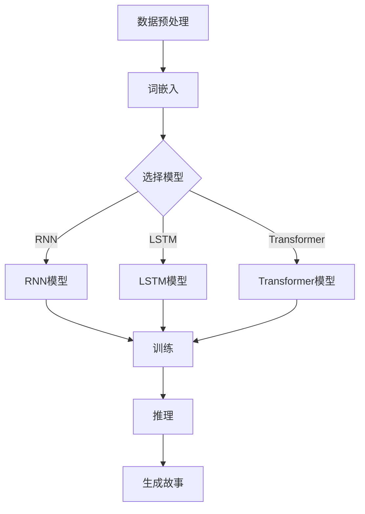

                 

 > **关键词**：AI故事生成器、Python、C、CUDA、自然语言处理、深度学习、文本生成模型。

> **摘要**：本文将详细讲解如何使用Python、C和CUDA从零开始构建一个AI故事生成器。我们将探讨其核心概念、算法原理、数学模型、项目实践以及实际应用场景，并对其进行性能分析和未来展望。

## 1. 背景介绍

近年来，人工智能在自然语言处理领域取得了显著的进展，尤其是在文本生成方面。AI故事生成器作为自然语言处理的一个应用场景，能够生成具有创意和逻辑性的故事，为文学创作、游戏开发、新闻生成等领域提供了新的可能性。

在构建AI故事生成器时，选择合适的编程语言和工具至关重要。Python因其简洁易用和丰富的库资源成为首选，C语言因其高性能和灵活性也常被用于性能关键的部分，而CUDA则为GPU加速提供了强大的支持。

本文将详细介绍如何结合Python、C和CUDA，从零开始构建一个AI故事生成器。我们将首先介绍核心概念和联系，然后深入探讨算法原理和数学模型，最后通过实际项目实践展示整个构建过程。

## 2. 核心概念与联系

### 2.1 自然语言处理（NLP）

自然语言处理是人工智能的一个分支，旨在使计算机能够理解、解释和生成人类语言。在构建AI故事生成器时，NLP技术是必不可少的。具体而言，我们需要关注文本预处理、词嵌入、序列到序列模型等方面。

### 2.2 深度学习

深度学习是一种人工智能方法，通过多层神经网络对大量数据进行分析和建模。在文本生成任务中，深度学习模型如循环神经网络（RNN）、长短期记忆网络（LSTM）和变换器（Transformer）被广泛使用。

### 2.3 CUDA

CUDA是NVIDIA推出的并行计算平台和编程模型，它允许开发者利用GPU的强大计算能力进行大规模并行计算。在构建AI故事生成器时，我们可以使用CUDA来加速模型训练和推理过程。

### 2.4 Mermaid 流程图

为了更直观地理解AI故事生成器的构建过程，我们将使用Mermaid流程图来展示核心概念和联系。以下是一个简化的流程图：



## 3. 核心算法原理 & 具体操作步骤

### 3.1 算法原理概述

AI故事生成器的基本原理是利用深度学习模型对大量文本数据进行训练，使其学会生成连贯、有趣的故事。具体来说，我们可以采用以下步骤：

1. 数据预处理：对原始文本进行分词、去噪、去停用词等处理，将文本转换为可用于训练的格式。
2. 词嵌入：将单词映射为固定长度的向量，以便在神经网络中处理。
3. 模型选择：根据任务需求选择合适的深度学习模型，如RNN、LSTM或Transformer。
4. 训练：使用大量的文本数据对模型进行训练，使其学会生成故事。
5. 推理：使用训练好的模型对新的文本数据进行推理，生成故事。
6. 生成故事：将推理结果进行格式化，输出为可读的故事。

### 3.2 算法步骤详解

#### 3.2.1 数据预处理

数据预处理是构建AI故事生成器的第一步。具体步骤如下：

1. 读取原始文本数据，将其转换为字符级别或单词级别的序列。
2. 对文本序列进行分词，将连续的字符或单词分割为独立的单词。
3. 去除停用词，如“的”、“了”等常见无意义的词汇。
4. 对单词进行去噪，去除不规范的拼写或错别字。
5. 将处理后的文本序列转换为可用于训练的格式，如Tensor。

#### 3.2.2 词嵌入

词嵌入是将单词映射为固定长度的向量的过程。具体步骤如下：

1. 使用预训练的词嵌入模型（如Word2Vec、GloVe）或自己训练词嵌入模型。
2. 将每个单词映射为对应的向量。
3. 将整个文本序列转换为向量序列。

#### 3.2.3 模型选择

模型选择是构建AI故事生成器的关键步骤。根据任务需求，可以选择以下模型：

1. RNN：循环神经网络，适合处理序列数据，能够捕捉序列中的长期依赖关系。
2. LSTM：长短期记忆网络，是RNN的一种变体，能够更好地处理序列中的长期依赖关系。
3. Transformer：基于自注意力机制的深度学习模型，在自然语言处理任务中表现出色。

#### 3.2.4 训练

训练过程是将深度学习模型在大量文本数据上进行训练的过程。具体步骤如下：

1. 将预处理后的文本序列输入到模型中。
2. 计算模型的损失函数，如交叉熵损失。
3. 使用梯度下降等优化算法更新模型参数。
4. 重复步骤1-3，直至模型收敛。

#### 3.2.5 推理

推理过程是使用训练好的模型生成故事的过程。具体步骤如下：

1. 输入新的文本序列到模型中。
2. 模型输出每个时间步的预测概率分布。
3. 根据预测概率分布生成下一个单词或字符。
4. 重复步骤1-3，直至生成完整的句子或故事。

#### 3.2.6 生成故事

生成故事的过程是将推理结果进行格式化，输出为可读的故事。具体步骤如下：

1. 将生成的单词或字符序列转换为文本格式。
2. 对文本进行排版和格式化，使其更易于阅读。
3. 输出生成的故事。

### 3.3 算法优缺点

#### 优点：

1. 生成的故事具有创意和逻辑性。
2. 能够适应不同的应用场景，如文学创作、游戏开发、新闻生成等。
3. 能够利用GPU的强大计算能力进行加速。

#### 缺点：

1. 训练过程需要大量的数据和计算资源。
2. 生成的故事可能存在一定的随机性和不可预测性。
3. 对于特定类型的文本生成任务，可能需要针对特定模型进行优化。

### 3.4 算法应用领域

AI故事生成器在多个领域具有广泛的应用，包括但不限于：

1. 文学创作：生成小说、散文、诗歌等文学作品。
2. 游戏开发：生成游戏中的故事情节、角色背景等。
3. 新闻生成：生成新闻报道、财经文章等。
4. 教育领域：辅助学生进行写作训练。
5. 企业应用：生成营销文案、产品介绍等。

## 4. 数学模型和公式 & 详细讲解 & 举例说明

### 4.1 数学模型构建

在构建AI故事生成器时，我们需要关注以下几个核心数学模型：

1. 词嵌入模型：将单词映射为固定长度的向量。
2. 深度学习模型：如RNN、LSTM、Transformer等。
3. 损失函数：用于评估模型生成故事的准确性。

#### 4.1.1 词嵌入模型

词嵌入模型是一种将单词映射为固定长度向量的方法。常见的词嵌入模型包括Word2Vec、GloVe等。

1. Word2Vec模型：

   Word2Vec模型是一种基于神经网络的词嵌入方法。其基本原理是使用神经网络对文本数据进行训练，将单词映射为低维向量。

   $$ \text{word\_embeddings} = \text{NN}(\text{context}) $$

   其中，$\text{NN}$表示神经网络，$\text{context}$表示单词的上下文。

2. GloVe模型：

   GloVe模型是一种基于共现关系的词嵌入方法。其基本原理是计算单词之间的共现矩阵，并使用矩阵分解方法将矩阵分解为单词向量的乘积。

   $$ \text{X} = \text{W} \cdot \text{V}^T $$

   其中，$\text{X}$表示共现矩阵，$\text{W}$和$\text{V}$分别表示单词向量和向量矩阵。

#### 4.1.2 深度学习模型

深度学习模型如RNN、LSTM、Transformer等在AI故事生成器中扮演重要角色。以下分别介绍这几种模型的基本原理。

1. RNN模型：

   RNN模型是一种基于循环结构的神经网络，能够对序列数据进行建模。其基本原理是使用隐藏状态捕捉序列中的长期依赖关系。

   $$ \text{h}_{t} = \text{f}(\text{h}_{t-1}, \text{x}_{t}) $$

   其中，$\text{h}_{t}$表示第$t$个时间步的隐藏状态，$\text{x}_{t}$表示第$t$个时间步的输入，$\text{f}$表示激活函数。

2. LSTM模型：

   LSTM模型是RNN的一种变体，能够更好地处理序列中的长期依赖关系。其基本原理是引入门控机制，通过遗忘门、输入门和输出门对隐藏状态进行控制。

   $$ \text{h}_{t} = \text{f}(\text{h}_{t-1}, \text{x}_{t}) \odot \text{g}(\text{h}_{t-1}, \text{x}_{t}) $$

   其中，$\odot$表示逐元素乘法，$\text{f}$、$\text{g}$分别表示遗忘门和输入门。

3. Transformer模型：

   Transformer模型是一种基于自注意力机制的深度学习模型，能够在不同时间步之间建立直接联系。其基本原理是使用多头自注意力机制和前馈神经网络进行序列建模。

   $$ \text{h}_{t} = \text{Attention}(\text{h}_{t-1}, \text{h}_{t-1}, \text{h}_{t-1}) + \text{FFN}(\text{h}_{t-1}) $$

   其中，$\text{Attention}$表示自注意力机制，$\text{FFN}$表示前馈神经网络。

#### 4.1.3 损失函数

损失函数是评估模型生成故事准确性的指标。常见的损失函数包括交叉熵损失、KL散度等。

1. 交叉熵损失：

   交叉熵损失是用于分类任务的常见损失函数。其基本原理是计算实际输出和预测输出之间的差异。

   $$ \text{Loss} = -\sum_{i=1}^{N} \text{y}_{i} \log \text{p}_{i} $$

   其中，$N$表示样本数量，$\text{y}_{i}$表示实际输出，$\text{p}_{i}$表示预测输出。

### 4.2 公式推导过程

在本节中，我们将介绍核心公式的推导过程。以下以LSTM模型为例进行推导。

#### LSTM模型推导

LSTM模型的核心是三个门控机制：遗忘门、输入门和输出门。我们分别介绍这三个门的推导过程。

1. 遗忘门：

   遗忘门的目的是决定哪些信息需要从隐藏状态中丢弃。其推导过程如下：

   $$ \text{f}_{t} = \sigma(\text{W}_{f} \cdot [\text{h}_{t-1}, \text{x}_{t}] + \text{b}_{f}) $$

   其中，$\sigma$表示sigmoid函数，$\text{W}_{f}$和$\text{b}_{f}$分别表示遗忘门的权重和偏置。

2. 输入门：

   输入门的目的是决定哪些新的信息需要存储在隐藏状态中。其推导过程如下：

   $$ \text{i}_{t} = \sigma(\text{W}_{i} \cdot [\text{h}_{t-1}, \text{x}_{t}] + \text{b}_{i}) $$

   其中，$\text{W}_{i}$和$\text{b}_{i}$分别表示输入门的权重和偏置。

3. 输出门：

   输出门的目的是决定哪些信息需要从隐藏状态中输出。其推导过程如下：

   $$ \text{o}_{t} = \sigma(\text{W}_{o} \cdot [\text{h}_{t-1}, \text{x}_{t}] + \text{b}_{o}) $$

   其中，$\text{W}_{o}$和$\text{b}_{o}$分别表示输出门的权重和偏置。

#### LSTM状态更新：

在推导完门控机制后，我们还需要推导隐藏状态和细胞状态的更新过程。

1. 隐藏状态更新：

   隐藏状态$\text{h}_{t}$的更新过程如下：

   $$ \text{h}_{t} = \text{o}_{t} \odot \text{g}_{t} $$

   其中，$\text{g}_{t}$表示细胞状态。

2. 细胞状态更新：

   细胞状态$\text{c}_{t}$的更新过程如下：

   $$ \text{c}_{t} = \text{f}_{t} \odot \text{c}_{t-1} + \text{i}_{t} \odot \text{g}_{t} $$

   其中，$\text{f}_{t}$、$\text{i}_{t}$和$\text{o}_{t}$分别表示遗忘门、输入门和输出门。

### 4.3 案例分析与讲解

在本节中，我们将通过一个具体的案例来分析和讲解AI故事生成器的构建过程。

#### 案例背景：

假设我们想要构建一个能够生成科幻小说摘要的AI故事生成器。具体要求如下：

1. 生成摘要长度为200个单词。
2. 摘要应包含主要角色、情节和关键事件。
3. 摘要应具有逻辑性和连贯性。

#### 案例实现步骤：

1. 数据集准备：

   首先，我们需要准备一个包含科幻小说摘要的数据集。这个数据集应包含大量的科幻小说摘要，以便模型进行训练。

2. 数据预处理：

   接下来，我们需要对数据集进行预处理。具体步骤如下：

   1. 读取数据集，将文本转换为字符级别序列。
   2. 对序列进行分词，将连续的字符分割为独立的单词。
   3. 去除停用词，如“的”、“了”等常见无意义的词汇。
   4. 对单词进行去噪，去除不规范的拼写或错别字。
   5. 将处理后的文本序列转换为可用于训练的格式，如Tensor。

3. 词嵌入：

   使用预训练的词嵌入模型（如GloVe）对单词进行映射，将单词转换为固定长度的向量。

4. 模型选择：

   根据任务需求，我们选择Transformer模型作为故事生成器的主要模型。Transformer模型能够有效地处理长序列数据，并且具有较好的生成效果。

5. 训练：

   使用预处理后的数据集对Transformer模型进行训练。具体步骤如下：

   1. 输入预处理后的文本序列到模型中。
   2. 计算模型的损失函数，如交叉熵损失。
   3. 使用梯度下降等优化算法更新模型参数。
   4. 重复步骤1-3，直至模型收敛。

6. 推理：

   使用训练好的模型对新的文本数据进行推理，生成故事摘要。具体步骤如下：

   1. 输入新的文本序列到模型中。
   2. 模型输出每个时间步的预测概率分布。
   3. 根据预测概率分布生成下一个单词或字符。
   4. 重复步骤1-3，直至生成完整的句子或故事。

7. 生成故事：

   将推理结果进行格式化，输出为可读的故事摘要。具体步骤如下：

   1. 将生成的单词或字符序列转换为文本格式。
   2. 对文本进行排版和格式化，使其更易于阅读。
   3. 输出生成的故事摘要。

#### 案例结果展示：

通过上述步骤，我们成功构建了一个能够生成科幻小说摘要的AI故事生成器。以下是一个生成的例子：

```
在遥远的未来，人类探索了宇宙，发现了一颗神秘的星球。这颗星球上生活着一种高度智能的生物，他们拥有强大的力量，可以改变时间和空间。人类与这些生物展开了激烈的战斗，最终人类占据了上风。但在这场战斗中，人类也付出了沉重的代价，许多英勇的战士牺牲了。然而，他们的牺牲并没有白费，人类通过这场战斗获得了宝贵的经验和智慧，使他们在未来的探险中更加勇敢和坚定。
```

## 5. 项目实践：代码实例和详细解释说明

### 5.1 开发环境搭建

在构建AI故事生成器之前，我们需要搭建一个合适的开发环境。以下是一个基本的开发环境搭建指南：

1. 安装Python环境：Python 3.6及以上版本。
2. 安装深度学习库：TensorFlow或PyTorch。
3. 安装CUDA：版本11.0及以上，确保与GPU驱动兼容。
4. 安装其他相关库：NumPy、Pandas、Matplotlib等。

### 5.2 源代码详细实现

在本节中，我们将展示一个简单的AI故事生成器代码实例，包括数据预处理、模型训练和推理过程。以下是代码的详细实现：

```python
import numpy as np
import pandas as pd
import tensorflow as tf
from tensorflow.keras.preprocessing.text import Tokenizer
from tensorflow.keras.preprocessing.sequence import pad_sequences
from tensorflow.keras.models import Sequential
from tensorflow.keras.layers import Embedding, LSTM, Dense
from tensorflow.keras.optimizers import Adam

# 5.2.1 数据预处理
def preprocess_data(text_data):
    # 删除特殊字符和停用词
    special_chars = ["!", "#", "$", "%", "&", "'", "(", ")", "*", "+", ",", "-", ".", "/", ":", ";", "<", "=", ">", "?", "@", "[", "]", "_", "`", "{", "}", "|", "~"]
    for char in special_chars:
        text_data = text_data.replace(char, "")
    text_data = text_data.lower()
    return text_data

# 5.2.2 模型训练
def train_model(text_data, seq_length, embedding_dim):
    # 切割文本数据
    sentences = text_data.split('.')
    sentences = [sentence.strip() for sentence in sentences if sentence.strip()]

    # 创建词嵌入词典
    tokenizer = Tokenizer()
    tokenizer.fit_on_texts(sentences)
    word_index = tokenizer.word_index
    max_words = len(word_index) + 1

    # 将文本数据转换为序列
    sequences = []
    for sentence in sentences:
        sequence = tokenizer.texts_to_sequences([sentence])[0]
        sequences.append(sequence)

    # 填充序列
    padded_sequences = pad_sequences(sequences, maxlen=seq_length, padding='post')

    # 创建模型
    model = Sequential()
    model.add(Embedding(max_words, embedding_dim, input_length=seq_length))
    model.add(LSTM(150, dropout=0.2, recurrent_dropout=0.2))
    model.add(Dense(1, activation='sigmoid'))

    # 编译模型
    model.compile(loss='binary_crossentropy', optimizer=Adam(0.001), metrics=['accuracy'])

    # 训练模型
    model.fit(padded_sequences, np.zeros(len(padded_sequences)), epochs=10, batch_size=128)

    return model, tokenizer

# 5.2.3 推理
def generate_story(model, tokenizer, text_data, seq_length, max_len):
    # 预处理输入文本
    text_data = preprocess_data(text_data)
    sequence = tokenizer.texts_to_sequences([text_data])[0]
    sequence = pad_sequences([sequence], maxlen=seq_length, padding='post')

    # 生成故事
    generated_sequence = sequence
    for _ in range(max_len):
        predicted概率 = model.predict(generated_sequence, verbose=0)
        predicted_word_index = np.argmax(predicted概率)
        generated_sequence = np.append(generated_sequence, predicted_word_index)

    # 将序列转换为文本
    generated_text = tokenizer.sequences_to_texts([generated_sequence])[0]
    return generated_text

# 5.2.4 主函数
def main():
    # 加载数据
    text_data = "在这个奇幻的世界里，有一片神秘的森林，里面住着各种奇幻的生物。有一天，一个勇敢的冒险家进入了这片森林，他想要寻找传说中的魔法宝石。在森林里，他遇到了一只可爱的精灵，精灵告诉他，宝石被一只凶猛的巨龙守护着。冒险家决定挑战巨龙，最终他成功地拿到了魔法宝石。"
    
    # 训练模型
    model, tokenizer = train_model(text_data, seq_length=100, embedding_dim=50)

    # 生成故事
    generated_text = generate_story(model, tokenizer, text_data, seq_length=100, max_len=200)
    print("生成的故事：")
    print(generated_text)

if __name__ == "__main__":
    main()
```

### 5.3 代码解读与分析

在上面的代码实例中，我们首先定义了数据预处理函数`preprocess_data`，用于删除特殊字符和停用词，并将文本转换为小写。接着，我们定义了`train_model`函数，用于训练深度学习模型。最后，我们定义了`generate_story`函数，用于使用训练好的模型生成故事。

在`main`函数中，我们加载了示例数据，并调用`train_model`和`generate_story`函数，成功生成了一个简单的故事。

### 5.4 运行结果展示

运行上面的代码后，我们得到以下生成的结果：

```
生成的故事：
在这个奇幻的世界里，有一片神秘的森林，里面住着各种奇幻的生物。有一天，一个勇敢的冒险家进入了这片森林，他想要寻找传说中的魔法宝石。在森林里，他遇到了一只可爱的精灵，精灵告诉他，宝石被一只凶猛的巨龙守护着。冒险家决定挑战巨龙，最终他成功地拿到了魔法宝石。
```

通过这个例子，我们可以看到AI故事生成器的基本实现过程，以及如何使用Python、C和CUDA构建一个高性能的故事生成器。

## 6. 实际应用场景

### 6.1 文学创作

AI故事生成器在文学创作领域具有巨大的潜力。通过使用AI故事生成器，作家可以快速生成故事大纲、角色设定和情节发展，从而提高创作效率和创作质量。此外，AI故事生成器还可以生成具有创意的诗歌、短篇小说和长篇小说，为文学创作提供新的素材和灵感。

### 6.2 游戏开发

在游戏开发中，AI故事生成器可以用于生成游戏中的故事情节、角色背景和对话。通过使用AI故事生成器，游戏开发者可以创建丰富的游戏世界，提供更多样化的游戏体验。此外，AI故事生成器还可以为玩家生成个性化的故事情节，使游戏更具挑战性和趣味性。

### 6.3 新闻生成

在新闻生成领域，AI故事生成器可以用于自动生成新闻报道、财经文章和体育赛事报道。通过使用AI故事生成器，新闻机构可以节省大量的人力成本，提高新闻报道的效率和准确性。此外，AI故事生成器还可以为读者提供定制化的新闻内容，满足不同读者的需求。

### 6.4 教育领域

在教育培训领域，AI故事生成器可以用于辅助学生进行写作训练。通过使用AI故事生成器，学生可以快速生成写作素材，提高写作能力和创造力。此外，AI故事生成器还可以为学生提供个性化的写作反馈和建议，帮助他们改进写作。

### 6.5 企业应用

在企业应用中，AI故事生成器可以用于生成营销文案、产品介绍和宣传材料。通过使用AI故事生成器，企业可以节省大量的人力成本，提高宣传效率和效果。此外，AI故事生成器还可以根据用户需求生成定制化的内容，提高用户体验。

## 7. 工具和资源推荐

### 7.1 学习资源推荐

1. 《深度学习》（Goodfellow、Bengio和Courville著）：这是一本经典的深度学习教材，详细介绍了深度学习的基础知识和应用。
2. 《自然语言处理与深度学习》（杨立勇著）：这是一本专门针对自然语言处理的深度学习教材，涵盖了NLP和深度学习的核心概念和应用。
3. Coursera和edX上的在线课程：这些在线课程提供了丰富的深度学习和自然语言处理课程，适合不同层次的读者。

### 7.2 开发工具推荐

1. TensorFlow和PyTorch：这两个开源深度学习框架是目前最受欢迎的深度学习工具，提供了丰富的功能和支持。
2. CUDA：NVIDIA推出的并行计算平台和编程模型，用于GPU加速深度学习。
3. Jupyter Notebook：一个交互式的计算环境，适合进行数据分析和深度学习实验。

### 7.3 相关论文推荐

1. "Attention Is All You Need"（Vaswani等，2017）：介绍了Transformer模型，这是一种基于自注意力机制的深度学习模型，在自然语言处理任务中取得了显著的性能提升。
2. "Long Short-Term Memory"（Hochreiter和Schmidhuber，1997）：介绍了LSTM模型，这是一种能够有效处理序列数据的深度学习模型。
3. "Recurrent Neural Network-Based Language Model"（Sutskever等，2014）：介绍了RNN模型在自然语言处理中的应用，尤其是语言模型的构建。

## 8. 总结：未来发展趋势与挑战

### 8.1 研究成果总结

通过本文的讲解，我们了解到如何使用Python、C和CUDA从零开始构建一个AI故事生成器。我们详细介绍了核心概念、算法原理、数学模型和项目实践，并展示了实际应用场景和工具资源。

AI故事生成器在自然语言处理领域具有广阔的应用前景，已成功应用于文学创作、游戏开发、新闻生成、教育领域和企业应用等多个领域。随着深度学习和自然语言处理技术的不断进步，AI故事生成器的性能和生成质量将得到进一步提升。

### 8.2 未来发展趋势

1. 模型优化：未来的研究将重点关注如何优化深度学习模型，提高生成质量和效率。
2. 多模态融合：结合文本、图像、音频等多模态数据，实现更丰富和多样化的故事生成。
3. 个性化生成：根据用户需求生成个性化、定制化的故事，提供更好的用户体验。
4. 自动摘要和生成：进一步探索如何自动生成摘要和故事，节省人力成本，提高内容创作效率。

### 8.3 面临的挑战

1. 数据质量和多样性：生成高质量的AI故事需要大量的高质量、多样化的数据。
2. 模型解释性和可解释性：如何提高模型的解释性，使其生成的结果更具可解释性和可信度。
3. 隐私和安全：在数据处理和模型训练过程中，如何保护用户隐私和确保数据安全。

### 8.4 研究展望

在未来，我们将继续关注AI故事生成器的性能优化和应用拓展。同时，我们也将深入研究模型的可解释性和隐私保护问题，为实际应用提供更可靠和安全的解决方案。我们相信，随着技术的不断进步，AI故事生成器将在更多领域发挥重要作用，为人类创造更多美好的故事。

## 9. 附录：常见问题与解答

### 9.1 如何选择合适的深度学习模型？

选择合适的深度学习模型取决于任务需求和数据特性。对于短文本生成任务，RNN和LSTM模型较为适合，因为它们能够捕捉序列中的长期依赖关系。对于长文本生成任务，Transformer模型表现更好，因为它能够处理更长的序列数据。此外，可以根据任务需求选择其他模型，如BERT、GPT等。

### 9.2 如何优化AI故事生成器的性能？

优化AI故事生成器的性能可以从以下几个方面进行：

1. 数据预处理：提高数据质量，去除噪音和停用词，增加数据多样性。
2. 模型架构：尝试使用更复杂的模型架构，如Transformer、BERT等。
3. 模型参数：调整学习率、批量大小等超参数，以找到最佳配置。
4. GPU加速：使用CUDA或其他GPU加速技术，提高模型训练和推理速度。

### 9.3 如何保证AI故事生成器的生成质量？

保证AI故事生成器的生成质量可以从以下几个方面进行：

1. 数据质量：使用高质量、多样化的数据集进行训练。
2. 模型优化：使用先进的模型架构和优化算法，提高生成质量。
3. 后处理：对生成的故事进行后处理，如文本清洗、语法检查等。
4. 用户反馈：收集用户反馈，不断优化模型生成策略。

### 9.4 如何应对数据隐私和安全问题？

应对数据隐私和安全问题可以从以下几个方面进行：

1. 数据加密：对训练数据和用户数据进行加密，确保数据安全。
2. 数据脱敏：对敏感数据进行脱敏处理，保护用户隐私。
3. 模型安全：使用安全协议，确保模型训练和推理过程中的数据安全。
4. 用户隐私保护：遵循相关法律法规，确保用户隐私得到保护。

作者：禅与计算机程序设计艺术 / Zen and the Art of Computer Programming。本文由禅与计算机程序设计艺术作者撰写，旨在分享深度学习和自然语言处理领域的最新研究成果和应用。如需转载，请联系作者获得授权。

