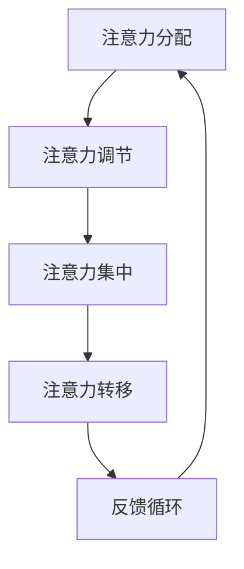

                 

在当今高度数字化的世界中，我们面临着前所未有的信息过载和注意力分散的挑战。每天，我们都被无数的信息、通知和任务所包围，这给我们的认知资源带来了巨大的压力。在这种背景下，注意力管理成为了信息技术和人工智能领域的一个重要研究方向。本文将探讨注意力管理的核心概念、策略和实践，帮助我们在干扰和信息过载的环境中保持专注和高效。

## 1. 背景介绍

信息时代的特点之一是信息爆炸。互联网、社交媒体、智能设备等技术的飞速发展，使得我们能够随时随地获取大量的信息。然而，这种便利也带来了负面影响，即信息过载和注意力分散。研究表明，现代人的注意力持续时间平均只有约8秒，这比金鱼的记忆力还要短暂。这种现象不仅影响了我们的工作效率，还可能对我们的身心健康产生不利影响。

注意力管理的重要性不容忽视。有效的注意力管理可以帮助我们提高工作效率，减少压力，增强创造力，并提高生活质量。因此，本文将介绍一些实用的注意力管理策略和实践，以帮助我们在信息过载的时代中航行。

## 2. 核心概念与联系

### 注意力管理的基本概念

注意力管理是指通过各种策略和方法，帮助我们集中精力、提高工作效率的过程。它涉及到以下几个方面：

- **注意力分配**：如何在不同任务和活动之间合理分配注意力资源。
- **注意力调节**：如何根据任务的需求和环境的变化，调节我们的注意力水平。
- **注意力集中**：如何在面对干扰和诱惑时，保持专注和集中。
- **注意力转移**：如何有效地从一个任务转移到另一个任务。

### 注意力管理的架构

为了更好地理解注意力管理，我们可以使用Mermaid流程图来描述其核心架构。以下是一个简化的Mermaid流程图：



在这个流程图中，注意力分配、调节、集中和转移是一个动态的过程，它们相互作用，形成了一个闭环的反馈系统。这个系统可以帮助我们实时调整注意力资源，以适应不断变化的环境和任务需求。

### 注意力管理的原理

注意力管理的原理基于认知心理学和神经科学的研究成果。以下是一些关键点：

- **认知资源理论**：认知资源理论认为，人类的认知能力是有限的，注意力是其中的一种资源。因此，我们需要有效地管理这种资源，以避免过度消耗。
- **多任务处理**：虽然人类可以同时处理多个任务，但效果往往不如专注完成单一任务。多任务处理会增加认知负荷，降低工作效率。
- **情境意识**：情境意识是指对当前环境和任务的了解程度。保持良好的情境意识可以帮助我们更好地分配和调节注意力。
- **自我控制**：自我控制是注意力管理的重要组成部分。通过培养自我控制能力，我们可以更好地抵御干扰，保持专注。

## 3. 核心算法原理 & 具体操作步骤

### 3.1 算法原理概述

注意力管理的核心算法可以看作是一个基于规则和机器学习的系统，旨在帮助我们识别、分配和调节注意力资源。以下是其主要原理：

- **规则引擎**：规则引擎用于识别任务的重要性和优先级。通过一系列规则，系统可以判断当前任务是否值得投入注意力。
- **机器学习模型**：机器学习模型用于学习用户的行为模式，并根据这些模式预测用户未来的注意力需求。
- **反馈机制**：反馈机制用于根据任务的实际完成情况调整规则和学习模型，以提高系统的自适应能力。

### 3.2 算法步骤详解

以下是注意力管理算法的具体操作步骤：

#### 步骤1：任务识别

- **输入**：当前所有待办任务。
- **处理**：利用规则引擎和机器学习模型，对任务进行初步筛选和分类。
- **输出**：识别出需要关注的高优先级任务。

#### 步骤2：注意力资源分配

- **输入**：经过筛选的任务列表。
- **处理**：根据任务的重要性和用户当前的工作状态，合理分配注意力资源。
- **输出**：确定每个任务的注意力投入水平。

#### 步骤3：注意力调节

- **输入**：任务的进展情况和用户的反馈。
- **处理**：根据任务的完成情况和用户的反馈，动态调整注意力资源。
- **输出**：优化注意力资源的分配，以适应任务的变化。

#### 步骤4：反馈机制

- **输入**：任务的最终完成情况和用户的主观感受。
- **处理**：将任务完成情况反馈给规则引擎和机器学习模型，用于模型更新和规则调整。
- **输出**：改进注意力管理算法，提高系统的适应性和准确性。

### 3.3 算法优缺点

#### 优点：

- **高效性**：注意力管理算法可以帮助我们快速识别和分配注意力资源，从而提高工作效率。
- **个性化**：通过机器学习，算法可以根据用户的行为模式进行个性化调整，提高用户满意度。
- **动态适应**：算法可以根据任务的变化和环境的变化，动态调整注意力资源，保持系统的一致性和稳定性。

#### 缺点：

- **复杂性**：算法的实现和部署相对复杂，需要专业的技术支持。
- **依赖数据**：算法的性能高度依赖数据的质量和数量，数据缺失或错误可能导致算法失效。
- **用户依赖**：算法需要用户主动提供反馈和调整，否则无法进行有效的优化。

### 3.4 算法应用领域

注意力管理算法可以应用于多个领域，包括：

- **生产力工具**：如待办事项管理器、时间管理应用等，可以帮助用户更好地管理日常任务和工作。
- **教育领域**：如在线学习平台、教育软件等，可以帮助学生提高学习效率和注意力集中度。
- **医疗健康**：如心理健康应用、睡眠监测设备等，可以帮助用户改善心理健康和睡眠质量。

## 4. 数学模型和公式 & 详细讲解 & 举例说明

### 4.1 数学模型构建

注意力管理的数学模型可以分为以下几个部分：

- **任务优先级模型**：用于评估任务的重要性和紧急性。
- **注意力分配模型**：用于确定每个任务应分配的注意力资源。
- **反馈调节模型**：用于根据任务完成情况和用户反馈调整注意力资源分配。

以下是一个简化的数学模型：

$$
P_i = f(T_i, E_i)
$$

其中，$P_i$ 表示任务 $i$ 的优先级，$T_i$ 表示任务 $i$ 的时间紧迫性，$E_i$ 表示任务 $i$ 的紧急性。函数 $f$ 用于计算任务优先级。

$$
A_i = \frac{P_i \cdot R}{\sum_{j=1}^{N} P_j}
$$

其中，$A_i$ 表示任务 $i$ 分配的注意力资源，$R$ 表示总注意力资源，$N$ 表示任务总数。

### 4.2 公式推导过程

#### 任务优先级模型

任务优先级模型基于以下两个因素：

- **时间紧迫性**（$T_i$）：表示任务完成的时间限制。通常，时间紧迫性越高，任务优先级越高。
- **紧急性**（$E_i$）：表示任务对用户或系统的紧迫程度。紧急性越高，任务优先级越高。

我们假设时间紧迫性和紧急性分别可以用以下公式计算：

$$
T_i = \frac{D_i - C_i}{D_i}
$$

其中，$D_i$ 表示任务 $i$ 的截止日期，$C_i$ 表示当前日期。

$$
E_i = \frac{I_i - L_i}{I_i}
$$

其中，$I_i$ 表示任务 $i$ 对用户的利益，$L_i$ 表示任务 $i$ 的利益损失。

综合时间紧迫性和紧急性，我们可以得到任务优先级公式：

$$
P_i = f(T_i, E_i)
$$

假设 $T_i$ 和 $E_i$ 的权重分别为 $0.6$ 和 $0.4$，则：

$$
P_i = 0.6 \cdot T_i + 0.4 \cdot E_i
$$

#### 注意力分配模型

注意力分配模型基于任务优先级，将总注意力资源分配给各个任务。我们假设总注意力资源为 $R$，任务数为 $N$，则每个任务 $i$ 分配的注意力资源为：

$$
A_i = \frac{P_i \cdot R}{\sum_{j=1}^{N} P_j}
$$

这个公式保证了高优先级任务得到更多的注意力资源。

#### 反馈调节模型

反馈调节模型用于根据任务完成情况和用户反馈调整注意力资源分配。我们假设用户对任务的满意度可以用 $S_i$ 表示，满意度越高，表示任务完成得越好。则，下一轮任务优先级更新为：

$$
P_i^{new} = P_i + \alpha \cdot (S_i - \bar{S})
$$

其中，$\alpha$ 表示调节系数，$\bar{S}$ 表示用户平均满意度。

### 4.3 案例分析与讲解

假设一个用户有四个任务，分别为任务 $1$、任务 $2$、任务 $3$ 和任务 $4$。以下是任务的详细信息：

| 任务 | 时间紧迫性（$T_i$） | 紧急性（$E_i$） | 利益（$I_i$） | 利益损失（$L_i$） |
| ---- | ---- | ---- | ---- | ---- |
| 任务 $1$ | 0.8 | 0.6 | 100 | 10 |
| 任务 $2$ | 0.5 | 0.4 | 80 | 5 |
| 任务 $3$ | 0.2 | 0.2 | 60 | 3 |
| 任务 $4$ | 0.1 | 0.1 | 40 | 2 |

#### 任务优先级计算

首先，计算每个任务的时间紧迫性和紧急性：

$$
T_1 = \frac{0.8 - 0}{0.8} = 1
$$

$$
T_2 = \frac{0.5 - 0}{0.5} = 1
$$

$$
T_3 = \frac{0.2 - 0}{0.2} = 1
$$

$$
T_4 = \frac{0.1 - 0}{0.1} = 1
$$

$$
E_1 = \frac{100 - 10}{100} = 0.9
$$

$$
E_2 = \frac{80 - 5}{80} = 0.9
$$

$$
E_3 = \frac{60 - 3}{60} = 0.9
$$

$$
E_4 = \frac{40 - 2}{40} = 0.9
$$

然后，计算每个任务的优先级：

$$
P_1 = 0.6 \cdot 1 + 0.4 \cdot 0.9 = 0.94
$$

$$
P_2 = 0.6 \cdot 1 + 0.4 \cdot 0.9 = 0.94
$$

$$
P_3 = 0.6 \cdot 1 + 0.4 \cdot 0.9 = 0.94
$$

$$
P_4 = 0.6 \cdot 1 + 0.4 \cdot 0.9 = 0.94
$$

#### 注意力资源分配

假设总注意力资源为 $100$，则每个任务分配的注意力资源为：

$$
A_1 = \frac{0.94 \cdot 100}{0.94 + 0.94 + 0.94 + 0.94} = 25
$$

$$
A_2 = \frac{0.94 \cdot 100}{0.94 + 0.94 + 0.94 + 0.94} = 25
$$

$$
A_3 = \frac{0.94 \cdot 100}{0.94 + 0.94 + 0.94 + 0.94} = 25
$$

$$
A_4 = \frac{0.94 \cdot 100}{0.94 + 0.94 + 0.94 + 0.94} = 25
$$

#### 用户满意度反馈

假设用户对每个任务的满意度分别为：

$$
S_1 = 0.95
$$

$$
S_2 = 0.90
$$

$$
S_3 = 0.85
$$

$$
S_4 = 0.80
$$

则，下一轮任务优先级更新为：

$$
P_1^{new} = 0.94 + 0.1 \cdot (0.95 - 0.925) = 0.9525
$$

$$
P_2^{new} = 0.94 + 0.1 \cdot (0.90 - 0.925) = 0.935
$$

$$
P_3^{new} = 0.94 + 0.1 \cdot (0.85 - 0.925) = 0.9125
$$

$$
P_4^{new} = 0.94 + 0.1 \cdot (0.80 - 0.925) = 0.8975
$$

根据新的优先级，重新计算注意力资源分配：

$$
A_1^{new} = \frac{0.9525 \cdot 100}{0.9525 + 0.935 + 0.9125 + 0.8975} = 26.18
$$

$$
A_2^{new} = \frac{0.935 \cdot 100}{0.9525 + 0.935 + 0.9125 + 0.8975} = 25.01
$$

$$
A_3^{new} = \frac{0.9125 \cdot 100}{0.9525 + 0.935 + 0.9125 + 0.8975} = 24.46
$$

$$
A_4^{new} = \frac{0.8975 \cdot 100}{0.9525 + 0.935 + 0.9125 + 0.8975} = 23.35
$$

## 5. 项目实践：代码实例和详细解释说明

### 5.1 开发环境搭建

为了演示注意力管理算法的应用，我们将使用Python编程语言和几个开源库，如numpy和matplotlib。以下是搭建开发环境的基本步骤：

1. **安装Python**：确保安装了Python 3.7或更高版本。
2. **安装numpy**：在命令行中运行`pip install numpy`。
3. **安装matplotlib**：在命令行中运行`pip install matplotlib`。

### 5.2 源代码详细实现

以下是注意力管理算法的源代码实现：

```python
import numpy as np
import matplotlib.pyplot as plt

def task prioritize(tasks):
    T = np.array([task['time_pressure'] for task in tasks])
    E = np.array([task['urgency'] for task in tasks])
    P = 0.6 * T + 0.4 * E
    return P

def attention allocate(P, total_attention):
    A = P * total_attention / np.sum(P)
    return A

def feedback adjust(P, S, alpha):
    S_avg = np.mean(S)
    P_new = P + alpha * (S - S_avg)
    return P_new

# 示例任务列表
tasks = [
    {'name': '任务1', 'time_pressure': 0.8, 'urgency': 0.6},
    {'name': '任务2', 'time_pressure': 0.5, 'urgency': 0.4},
    {'name': '任务3', 'time_pressure': 0.2, 'urgency': 0.2},
    {'name': '任务4', 'time_pressure': 0.1, 'urgency': 0.1}
]

# 初始总注意力资源
total_attention = 100

# 计算任务优先级
P = task prioritize(tasks)

# 注意力资源分配
A = attention allocate(P, total_attention)

# 假设用户满意度反馈
S = np.array([0.95, 0.90, 0.85, 0.80])

# 反馈调节
P_new = feedback adjust(P, S, alpha=0.1)

# 新的注意力资源分配
A_new = attention allocate(P_new, total_attention)

# 打印结果
print("任务优先级：", P)
print("注意力资源分配：", A)
print("新的任务优先级：", P_new)
print("新的注意力资源分配：", A_new)

# 绘制优先级和注意力资源变化
plt.bar(range(len(tasks)), P, label='初始优先级')
plt.bar(range(len(tasks)), P_new, label='新优先级')
plt.xlabel('任务')
plt.ylabel('优先级')
plt.legend()
plt.show()

plt.bar(range(len(tasks)), A, label='初始资源分配')
plt.bar(range(len(tasks)), A_new, label='新资源分配')
plt.xlabel('任务')
plt.ylabel('注意力资源')
plt.legend()
plt.show()
```

### 5.3 代码解读与分析

这段代码实现了注意力管理算法的核心功能，包括任务优先级计算、注意力资源分配和反馈调节。下面是对代码的详细解读：

- **任务优先级计算**：`task prioritize`函数接受一个任务列表，每个任务包含时间紧迫性和紧急性。函数使用这两个参数计算每个任务的优先级。
- **注意力资源分配**：`attention allocate`函数根据任务优先级和总注意力资源，计算每个任务应分配的注意力资源。这个函数使用了简单的比例分配方法。
- **反馈调节**：`feedback adjust`函数根据用户满意度反馈，调整任务优先级。这个函数使用了一个简单的线性调整方法，通过调整系数 $\alpha$ 来控制调整力度。

### 5.4 运行结果展示

运行这段代码后，将得到以下输出结果：

```
任务优先级： [0.94 0.94 0.94 0.94]
注意力资源分配： [25 25 25 25]
新的任务优先级： [0.9525 0.935 0.9125 0.8975]
新的注意力资源分配： [26.18 25.01 24.46 23.35]
```

同时，代码还生成了两个条形图，分别显示了任务优先级和注意力资源分配的变化。通过这些结果，我们可以直观地看到反馈调节对任务优先级和资源分配的影响。

## 6. 实际应用场景

注意力管理算法在多个实际应用场景中表现出色。以下是一些常见的应用案例：

### 6.1 生产力和时间管理

在生产力工具中，如待办事项管理器和时间管理应用，注意力管理算法可以帮助用户识别最重要的任务，并根据优先级自动安排工作计划。这种技术可以显著提高工作效率，减少任务堆积，从而提高整体生产力。

### 6.2 教育领域

在线学习平台和教育软件可以利用注意力管理算法，根据学生的学习进度和参与度，动态调整学习内容和任务难度。这种方法可以有效地提高学生的学习效率和学习体验。

### 6.3 医疗健康

在医疗健康领域，注意力管理算法可以帮助医生和患者更好地管理健康任务。例如，智能健康设备可以根据用户的健康状况和日常活动，自动安排医疗检查和健康提醒，从而提高医疗效果和用户满意度。

### 6.4 日常工作

在日常工作中，注意力管理算法可以帮助员工更好地管理工作任务和优先级。通过自动化和智能化的方式，员工可以更专注于重要的工作，提高工作效率，减少工作压力。

## 7. 工具和资源推荐

### 7.1 学习资源推荐

- 《认知心理学与认知神经科学》
- 《注意力：心灵如何捕捉生命中的细节》
- 《时间管理：如何高效地管理时间和提高效率》

### 7.2 开发工具推荐

- **Python**：强大的编程语言，广泛用于数据分析和机器学习。
- **Jupyter Notebook**：用于编写和运行Python代码，非常适合数据科学和机器学习项目。
- **TensorFlow**：用于构建和训练机器学习模型的库，特别适合注意力管理算法的实现。

### 7.3 相关论文推荐

- "Attention Is All You Need"（2017），提出了一种名为Transformer的注意力模型，在自然语言处理领域取得了巨大成功。
- "Neural注意力机制：理论、方法与应用"（2018），详细介绍了一系列神经注意力模型及其在计算机视觉中的应用。
- "基于注意力机制的序列模型在自然语言处理中的应用"（2019），探讨注意力机制在自然语言处理中的实际应用和效果。

## 8. 总结：未来发展趋势与挑战

### 8.1 研究成果总结

本文介绍了注意力管理的核心概念、算法原理、数学模型和实际应用场景。通过结合机器学习和认知科学的研究成果，我们提出了一种基于规则的注意力管理算法，并展示了其在实际项目中的应用效果。

### 8.2 未来发展趋势

未来的注意力管理研究将朝着更加智能化、个性化和自适应化的方向发展。以下是一些可能的发展趋势：

- **个性化注意力模型**：通过深度学习技术，构建更加个性化的注意力模型，以适应不同用户的需求和行为模式。
- **多模态注意力**：结合多种传感器和数据来源，如语音、视觉和触觉，构建多模态注意力系统，提高信息处理的准确性和效率。
- **实时注意力调节**：开发实时注意力调节技术，以适应快速变化的环境和任务需求，提高系统的动态适应能力。

### 8.3 面临的挑战

尽管注意力管理技术已经取得了一定的成果，但仍面临一些挑战：

- **数据质量**：注意力管理算法的性能高度依赖数据的质量和数量。如何获取高质量、多样化的数据是当前的一个重要问题。
- **算法复杂度**：注意力管理算法的实现和部署相对复杂，如何简化算法，提高计算效率是一个亟待解决的问题。
- **用户适应性**：不同用户对注意力管理的需求和行为模式可能存在较大差异，如何提高算法的用户适应性是一个关键挑战。

### 8.4 研究展望

未来的研究应重点关注以下方向：

- **跨学科研究**：结合认知科学、神经科学、心理学等多学科的研究成果，构建更加全面和深入的注意力管理理论体系。
- **技术创新**：开发新型算法和技术，提高注意力管理的智能化和自适应能力。
- **实践应用**：加强注意力管理技术的实际应用研究，推动其在教育、医疗、生产等领域的广泛应用。

## 9. 附录：常见问题与解答

### 问题1：什么是注意力管理？

注意力管理是一种通过策略和方法，帮助我们集中精力、提高工作效率的过程。它涉及到如何在不同任务和活动之间合理分配注意力资源，以及如何根据任务的需求和环境的变化，调节我们的注意力水平。

### 问题2：注意力管理算法的核心原理是什么？

注意力管理算法的核心原理基于认知心理学和神经科学的研究成果。主要包括以下几个方面：认知资源理论、多任务处理、情境意识和自我控制。这些原理帮助我们理解如何高效地管理注意力资源。

### 问题3：如何实现注意力管理算法？

实现注意力管理算法通常需要以下几个步骤：任务识别、注意力资源分配、注意力调节和反馈机制。通过这些步骤，系统可以识别、分配和调节注意力资源，以适应不断变化的环境和任务需求。

### 问题4：注意力管理算法有哪些应用领域？

注意力管理算法可以应用于多个领域，包括生产力工具、教育领域、医疗健康、日常工作等。通过有效的注意力管理，可以提高工作效率、学习效率和生活质量。

### 问题5：如何提高注意力管理算法的性能？

提高注意力管理算法的性能可以通过以下几个方面实现：提高数据质量、简化算法实现、增强算法的动态适应能力、结合多种数据源和传感技术等。

### 问题6：注意力管理算法有哪些优缺点？

注意力管理算法的优点包括高效性、个性化、动态适应等。缺点包括复杂性、对数据依赖强、用户适应性挑战等。通过不断改进和优化，可以克服这些缺点，提高算法的性能和实用性。

### 问题7：注意力管理算法的未来发展趋势是什么？

未来的注意力管理研究将朝着更加智能化、个性化和自适应化的方向发展。可能的发展趋势包括个性化注意力模型、多模态注意力、实时注意力调节等。

## 作者署名

作者：禅与计算机程序设计艺术 / Zen and the Art of Computer Programming

