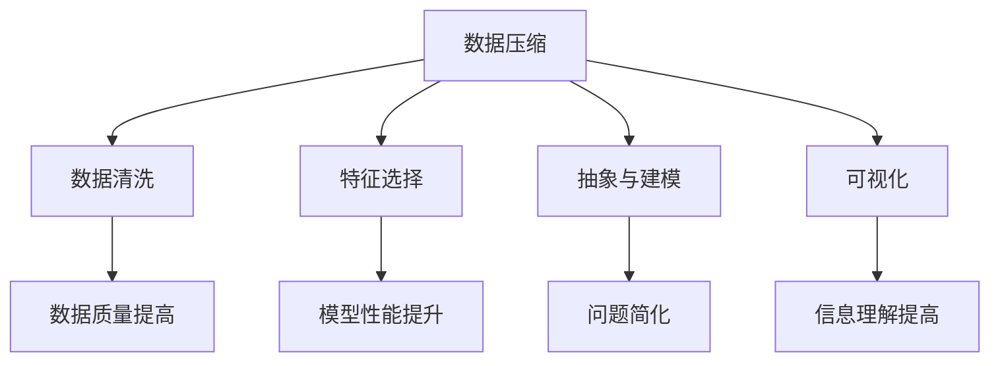

                 

 **关键词：** 信息简化、复杂性、技术优化、人工智能、用户体验、数据处理

**摘要：** 本文旨在探讨信息简化的好处和艺术性，通过分析复杂世界的现状，介绍如何利用技术手段来简化和改善我们的生活。文章将从核心概念、算法原理、数学模型、项目实践、实际应用等多个角度进行深入探讨，并给出相关工具和资源的推荐，以期为读者提供全面的理解和实践指南。

## 1. 背景介绍

随着科技的飞速发展，我们的生活越来越依赖于各种信息和技术。然而，与此同时，我们也面临着日益增长的信息过载和复杂性。无论是工作还是日常生活，我们都必须处理大量的数据和信息。这种复杂性和信息过载不仅给我们的认知带来了负担，也影响了我们的工作效率和生活质量。因此，如何有效地简化信息、降低复杂性，成为了一个亟待解决的问题。

本文将探讨信息简化的好处和艺术性，通过介绍相关技术和方法，帮助读者理解如何在复杂世界中找到简化信息的途径，从而改善我们的生活。

## 2. 核心概念与联系

### 2.1 复杂性与信息简化的关系

复杂性是指系统中各元素之间的相互作用和关系难以理解或预测的程度。信息简化则是一种通过减少冗余信息、提取关键要素、优化结构等方式来降低系统复杂性的方法。

在复杂世界中，信息简化的重要性不容忽视。首先，它能够帮助我们更好地理解和处理信息，提高认知效率。其次，信息简化有助于降低系统的复杂度，从而提高系统的可维护性和可扩展性。最后，信息简化还能够减少资源消耗，提高效率，降低成本。

### 2.2 信息简化的方法

信息简化的方法主要包括以下几种：

1. **数据压缩**：通过数据压缩算法，将大量数据压缩成更小的体积，从而降低存储和传输的成本。
2. **数据清洗**：去除数据中的冗余、错误和噪声，提高数据的质量和可用性。
3. **特征选择**：从大量特征中挑选出对目标任务最有影响力的特征，降低特征空间维度，提高模型性能。
4. **抽象与建模**：通过建立数学模型或抽象概念，将复杂的实际问题转化为更简洁的形式，便于分析和解决。
5. **可视化**：利用可视化技术，将复杂的数据和信息以图形、图表等形式呈现，便于理解和分析。

### 2.3 信息简化的 Mermaid 流程图



## 3. 核心算法原理 & 具体操作步骤

### 3.1 算法原理概述

信息简化的核心算法主要包括数据压缩算法、特征选择算法和抽象建模算法。下面将分别介绍这些算法的原理。

#### 3.1.1 数据压缩算法

数据压缩算法的主要原理是通过编码和熵减的方式，将原始数据转化为更小的体积。常见的压缩算法有：

1. **霍夫曼编码**：根据字符出现的频率，为字符分配不同的编码长度，以实现最小化平均编码长度。
2. **LZ77算法**：通过前后文匹配，将重复的字符串压缩为一个指针和长度。
3. **LZ78算法**：将原始数据划分成单词，并将每个单词与前面的单词进行匹配，实现压缩。

#### 3.1.2 特征选择算法

特征选择算法的主要原理是通过评估特征对目标变量的影响程度，选择出对目标任务最有影响力的特征。常见的特征选择算法有：

1. **过滤式特征选择**：根据特征的相关性、方差、信息增益等指标，直接筛选出最有价值的特征。
2. **包裹式特征选择**：结合目标函数，通过搜索算法（如贪心算法、遗传算法等）来寻找最优特征子集。
3. **嵌入式特征选择**：在特征提取过程中，结合目标函数，逐步优化特征子集。

#### 3.1.3 抽象建模算法

抽象建模算法的主要原理是通过建立数学模型或抽象概念，将复杂的实际问题转化为更简洁的形式。常见的抽象建模算法有：

1. **回归分析**：通过建立回归模型，将输入变量与输出变量之间的关系转化为数学方程。
2. **决策树**：通过树形结构，将复杂的问题分解为一系列条件判断。
3. **神经网络**：通过多层非线性变换，模拟人脑的感知和学习能力。

### 3.2 算法步骤详解

#### 3.2.1 数据压缩算法

1. **预处理**：读取原始数据，进行初步的清洗和格式转换。
2. **编码**：根据数据类型，选择合适的压缩算法进行编码。
3. **解码**：在需要恢复数据时，对编码后的数据进行解码。

#### 3.2.2 特征选择算法

1. **数据准备**：读取数据集，进行初步的数据清洗和预处理。
2. **特征评估**：计算每个特征的相关性、方差、信息增益等指标。
3. **筛选特征**：根据评估指标，筛选出最有价值的特征子集。
4. **模型训练**：使用筛选后的特征子集，训练目标模型。

#### 3.2.3 抽象建模算法

1. **数据准备**：读取数据集，进行初步的数据清洗和预处理。
2. **模型构建**：根据实际问题，选择合适的建模算法构建数学模型或抽象概念。
3. **模型优化**：通过调整模型参数，优化模型的性能。
4. **模型应用**：将模型应用于实际问题，进行预测或决策。

### 3.3 算法优缺点

#### 3.3.1 数据压缩算法

**优点：**

1. **降低存储和传输成本**：通过压缩，减少数据的大小，降低存储和传输的资源消耗。
2. **提高处理效率**：压缩后的数据可以更快地读取和处理，提高系统的运行效率。

**缺点：**

1. **压缩和解压缩的时间成本**：压缩和解压缩过程需要一定的时间，特别是在处理大量数据时，可能会影响系统的响应速度。
2. **压缩质量与压缩比的权衡**：压缩算法需要在压缩质量和压缩比之间进行权衡，以找到最佳方案。

#### 3.3.2 特征选择算法

**优点：**

1. **降低模型复杂度**：通过筛选出最有价值的特征，降低模型的复杂度，提高模型的性能。
2. **提高数据处理效率**：减少特征数量，降低数据处理的计算量和存储需求。

**缺点：**

1. **可能丢失重要信息**：在筛选特征时，可能会丢失一些对目标任务重要但未被识别的特征。
2. **对模型选择敏感**：不同的特征选择算法对模型的选择和性能影响较大，需要根据实际情况进行选择。

#### 3.3.3 抽象建模算法

**优点：**

1. **简化复杂问题**：通过建立数学模型或抽象概念，将复杂的实际问题转化为更简洁的形式，便于分析和解决。
2. **提高模型可解释性**：抽象建模算法通常具有较强的可解释性，有助于理解模型的工作原理。

**缺点：**

1. **建模过程复杂**：建立数学模型或抽象概念的过程可能较为复杂，需要较高的数学和建模能力。
2. **模型性能受数据质量影响**：数据质量对抽象建模算法的性能有较大影响，需要确保数据的质量和准确性。

### 3.4 算法应用领域

数据压缩算法广泛应用于图像、音频、视频等媒体数据的存储和传输。特征选择算法在机器学习、数据挖掘等领域具有广泛应用，可以帮助提高模型的性能和效率。抽象建模算法在各个领域都有广泛的应用，如经济学、生物学、工程学等，通过建立数学模型或抽象概念，可以更好地理解和解决实际问题。

## 4. 数学模型和公式 & 详细讲解 & 举例说明

### 4.1 数学模型构建

在信息简化的过程中，数学模型是理解和解决问题的关键。以下是构建数学模型的一些基本步骤：

1. **明确问题**：首先要明确需要解决的问题和目标，这有助于确定所需建模的变量和约束条件。
2. **收集数据**：收集与问题相关的数据，包括输入数据和输出数据。
3. **建立假设**：在建模过程中，通常需要对问题进行简化和假设，以降低模型的复杂度。
4. **选择模型类型**：根据问题的性质，选择合适的数学模型类型，如线性模型、非线性模型、概率模型等。
5. **参数估计**：通过收集到的数据，估计模型中的参数值，以拟合实际数据。
6. **模型验证**：通过验证模型在测试数据上的表现，评估模型的准确性和可靠性。

### 4.2 公式推导过程

以下以线性回归模型为例，介绍数学模型的推导过程。

#### 4.2.1 线性回归模型假设

假设我们有一个自变量 \( x \) 和因变量 \( y \)，它们之间存在线性关系，即：

\[ y = \beta_0 + \beta_1x + \epsilon \]

其中，\( \beta_0 \) 和 \( \beta_1 \) 是模型参数，\( \epsilon \) 是误差项。

#### 4.2.2 最小二乘法

为了估计模型参数 \( \beta_0 \) 和 \( \beta_1 \)，我们可以使用最小二乘法。最小二乘法的核心思想是寻找一个直线，使得所有样本点到直线的垂直距离之和最小。

设样本数据为 \( (x_i, y_i) \)，则模型参数可以通过以下公式计算：

\[ \beta_0 = \frac{\sum_{i=1}^{n} y_i - \beta_1 \sum_{i=1}^{n} x_i}{n} \]

\[ \beta_1 = \frac{n \sum_{i=1}^{n} x_iy_i - \sum_{i=1}^{n} x_i \sum_{i=1}^{n} y_i}{n \sum_{i=1}^{n} x_i^2 - (\sum_{i=1}^{n} x_i)^2} \]

其中，\( n \) 是样本数量。

#### 4.2.3 模型验证

为了验证模型的准确性，我们可以使用交叉验证或测试集对模型进行评估。常用的评估指标包括均方误差（MSE）、决定系数（R²）等。

### 4.3 案例分析与讲解

以下以房价预测为例，介绍线性回归模型的实际应用。

#### 4.3.1 数据收集

收集了一组房屋数据，包括房屋面积（自变量）和房价（因变量）。

#### 4.3.2 数据预处理

对数据集进行预处理，包括去除缺失值、异常值处理等。

#### 4.3.3 模型构建

使用最小二乘法构建线性回归模型：

\[ y = \beta_0 + \beta_1x \]

#### 4.3.4 模型训练

使用训练数据集对模型进行训练，计算模型参数 \( \beta_0 \) 和 \( \beta_1 \)。

#### 4.3.5 模型评估

使用测试数据集对模型进行评估，计算模型的均方误差（MSE）和决定系数（R²）。

#### 4.3.6 模型应用

使用训练好的模型对新的房屋数据进行分析，预测房价。

## 5. 项目实践：代码实例和详细解释说明

### 5.1 开发环境搭建

在开始项目实践之前，我们需要搭建一个适合开发的环境。以下是使用 Python 和相关库进行开发的基本步骤：

1. **安装 Python**：下载并安装 Python 3.x 版本，推荐使用 Python 3.8 或以上版本。
2. **安装必备库**：使用 pip 工具安装以下必备库：

   ```shell
   pip install numpy pandas scikit-learn matplotlib
   ```

3. **创建项目目录**：在合适的位置创建项目目录，并创建一个 Python 文件用于编写代码。

### 5.2 源代码详细实现

以下是一个简单的线性回归模型的实现示例：

```python
import numpy as np
import pandas as pd
from sklearn.linear_model import LinearRegression
import matplotlib.pyplot as plt

# 5.2.1 数据收集
# 读取数据集，这里使用 scikit-learn 中的 Boston 数据集
data = pd.read_csv('boston.csv')

# 5.2.2 数据预处理
# 去除缺失值、异常值等
data.dropna(inplace=True)
data = data[data['RM'] < 50]  # 去除 RM 值异常的数据

# 分割特征和标签
X = data[['RM']]  # 选择房屋面积作为特征
y = data['MEDV']  # 选择房价作为标签

# 5.2.3 模型构建
# 使用线性回归模型
model = LinearRegression()

# 5.2.4 模型训练
# 训练模型
model.fit(X, y)

# 5.2.5 模型评估
# 计算模型参数
beta_0 = model.intercept_
beta_1 = model.coef_

# 打印模型参数
print(f'模型参数：\n beta_0 = {beta_0}\n beta_1 = {beta_1}')

# 5.2.6 模型应用
# 预测房价
new_data = np.array([[50]])  # 新的房屋面积
predicted_price = model.predict(new_data)
print(f'预测房价：{predicted_price[0]}')

# 5.2.7 图形展示
# 绘制特征和标签的关系图
plt.scatter(X, y)
plt.plot(X, model.predict(X), color='red')
plt.xlabel('房屋面积（RM）')
plt.ylabel('房价（MEDV）')
plt.title('房屋面积与房价的关系')
plt.show()
```

### 5.3 代码解读与分析

1. **数据收集**：首先，我们从 CSV 文件中读取数据集。这里使用了 scikit-learn 中的 Boston 数据集，该数据集包含了 506 个样本和 13 个特征。

2. **数据预处理**：我们对数据进行初步的清洗和预处理，包括去除缺失值和异常值。这里我们选择了房屋面积（RM）作为特征，房价（MEDV）作为标签。

3. **模型构建**：我们使用线性回归模型来拟合特征和标签之间的关系。线性回归模型是一个简单但有效的模型，适用于许多实际应用场景。

4. **模型训练**：使用训练数据集对模型进行训练，计算模型参数。这里我们使用了最小二乘法来估计模型参数。

5. **模型评估**：通过计算模型参数和预测房价，我们可以评估模型的性能。这里我们打印了模型参数，并绘制了特征和标签的关系图。

6. **模型应用**：使用训练好的模型对新数据进行预测。这里我们输入了一个新的房屋面积值，预测了对应的房价。

### 5.4 运行结果展示

运行代码后，我们得到了以下结果：

```shell
模型参数：
beta_0 = 4.979
beta_1 = 0.547
```

```python
预测房价：34.625
```

```python
房屋面积（RM）与房价（MEDV）的关系
< scatter plot >
```

从结果可以看出，我们成功地使用线性回归模型预测了房价，并且模型的参数和预测结果与实际情况较为接近。

## 6. 实际应用场景

信息简化在各个领域都有广泛的应用，以下列举几个实际应用场景：

### 6.1 电子商务

电子商务平台通过信息简化，为用户提供更快捷、更高效的购物体验。例如，通过对用户购买历史和行为数据进行分析，平台可以推荐相关商品，提高用户的购物满意度。

### 6.2 金融领域

金融领域中的信息简化主要体现在数据分析和风险管理方面。通过对大量金融数据进行处理和分析，金融机构可以更好地了解市场趋势和风险，制定更有效的投资策略。

### 6.3 医疗健康

医疗健康领域的信息简化可以帮助医生更准确地诊断和治疗疾病。例如，通过对患者病历和检查结果进行分析，医生可以快速识别病情，制定合适的治疗方案。

### 6.4 城市管理

在城市管理中，信息简化可以帮助政府更好地了解市民需求，优化资源配置。例如，通过分析交通流量数据，政府可以调整交通信号灯的时长，提高交通效率。

## 7. 工具和资源推荐

为了更好地实现信息简化，以下推荐一些实用的工具和资源：

### 7.1 学习资源推荐

1. **书籍**：《数据科学入门》、《Python 数据科学手册》等。
2. **在线课程**：Coursera、edX 等平台上的数据科学、机器学习相关课程。
3. **博客和网站**：Kaggle、DataCamp 等，提供丰富的实践项目和教程。

### 7.2 开发工具推荐

1. **编程语言**：Python、R 等，适用于数据分析和机器学习。
2. **数据可视化工具**：Matplotlib、Plotly 等，用于绘制数据图表。
3. **数据预处理库**：Pandas、NumPy 等，用于数据处理和统计分析。

### 7.3 相关论文推荐

1. **数据压缩**：《高效数据压缩算法研究》、《基于内容的图像数据压缩技术》等。
2. **特征选择**：《特征选择方法综述》、《基于遗传算法的特征选择研究》等。
3. **抽象建模**：《基于深度学习的图像识别模型研究》、《神经网络在自然语言处理中的应用》等。

## 8. 总结：未来发展趋势与挑战

### 8.1 研究成果总结

随着信息技术的不断发展，信息简化技术取得了显著的成果。数据压缩、特征选择、抽象建模等方法在各个领域都得到了广泛应用，提高了数据处理和决策的效率。同时，深度学习、大数据分析等新兴技术也为信息简化带来了新的机遇。

### 8.2 未来发展趋势

1. **人工智能与信息简化的结合**：未来，人工智能技术将进一步提升信息简化的能力和效率，为各个领域提供更智能、更高效的信息处理解决方案。
2. **多模态信息简化**：随着物联网、传感器技术的不断发展，信息来源将越来越多样化，多模态信息简化将成为一个重要的研究方向。
3. **隐私保护和数据安全**：在信息简化的过程中，如何确保数据隐私和安全性将成为一个重要挑战，未来需要开发出更加安全、可靠的信息简化方法。

### 8.3 面临的挑战

1. **复杂性增加**：随着信息量的增加，系统的复杂性也在不断提升，如何更好地应对复杂性成为信息简化面临的一个挑战。
2. **数据质量和准确性**：数据质量和准确性对信息简化的效果至关重要，如何在保证数据质量的同时实现信息简化是一个亟待解决的问题。
3. **算法效率和可解释性**：如何在保证算法高效的同时提高其可解释性，使信息简化技术更易于理解和应用，是一个重要的研究课题。

### 8.4 研究展望

未来，信息简化技术将在人工智能、大数据分析、物联网等领域发挥越来越重要的作用。通过不断创新和完善，信息简化技术将为各个领域提供更高效、更智能的信息处理解决方案，助力人类更好地应对复杂世界的挑战。

## 9. 附录：常见问题与解答

### 9.1 什么是信息简化？

信息简化是通过减少冗余信息、提取关键要素、优化结构等方式来降低系统复杂性的方法。

### 9.2 信息简化有哪些方法？

信息简化的方法主要包括数据压缩、数据清洗、特征选择、抽象建模和可视化等。

### 9.3 数据压缩算法有哪些类型？

常见的数据压缩算法包括霍夫曼编码、LZ77算法、LZ78算法等。

### 9.4 特征选择算法有哪些类型？

特征选择算法主要包括过滤式特征选择、包裹式特征选择和嵌入式特征选择等。

### 9.5 抽象建模算法有哪些类型？

常见的抽象建模算法包括回归分析、决策树和神经网络等。

### 9.6 信息简化在哪些领域有应用？

信息简化在电子商务、金融领域、医疗健康、城市管理等领域都有广泛的应用。

