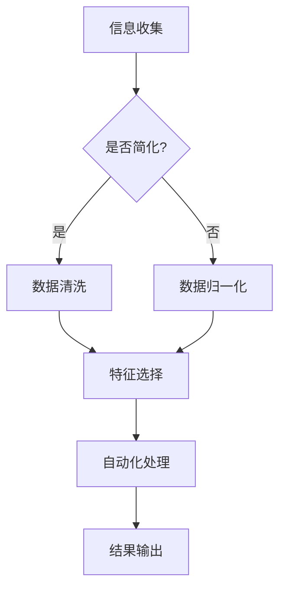

                 

关键词：信息简化、自动化技术、人工智能、算法、代码、应用场景、未来展望

> 摘要：随着信息技术的发展，信息的爆炸式增长给我们的生活和工作带来了巨大的挑战。本文将探讨如何利用信息简化的工具和自动化技术，有效地降低信息处理的复杂度，提高工作效率，进而简化我们的生活和工作流程。文章将详细介绍核心概念、算法原理、数学模型、实际应用场景以及未来展望等内容。

## 1. 背景介绍

在信息化社会，我们每天都要处理大量的信息。这些信息包括电子邮件、社交媒体更新、新闻报道、市场数据等。信息的快速增长不仅增加了我们的工作负担，也给我们带来了决策的困难。为了有效地处理这些信息，我们需要借助信息简化和自动化技术。

信息简化是通过减少信息的冗余和不相关性，使其更加简洁明了的过程。自动化技术则是利用计算机程序自动完成常规任务，从而提高效率。信息简化和自动化技术的结合，可以帮助我们更好地应对信息时代的挑战。

## 2. 核心概念与联系

### 2.1 信息简化的概念

信息简化包括以下几个核心概念：

- **数据清洗**：去除数据中的错误、冗余和无用的信息。
- **数据归一化**：将不同来源的数据格式统一，以便于分析和处理。
- **特征选择**：从大量数据中提取出最有用的特征，去除无关特征。

### 2.2 自动化技术的概念

自动化技术包括以下几个核心概念：

- **流程自动化**：通过软件工具自动完成一系列工作流程。
- **任务自动化**：通过程序自动执行重复性的任务。
- **决策自动化**：通过算法自动做出决策。

### 2.3 Mermaid 流程图

下面是一个简化的信息简化与自动化技术的流程图：



## 3. 核心算法原理 & 具体操作步骤

### 3.1 算法原理概述

信息简化和自动化技术通常基于以下核心算法：

- **数据清洗算法**：如删除重复项、修复错误数据等。
- **机器学习算法**：如聚类、分类等，用于特征选择和决策自动化。
- **自然语言处理算法**：如文本分类、情感分析等，用于处理非结构化数据。

### 3.2 算法步骤详解

#### 3.2.1 数据清洗

1. **数据收集**：从各种来源收集数据。
2. **数据预处理**：去除重复项、修复错误、缺失值填充等。
3. **数据归一化**：将不同来源的数据格式统一。

#### 3.2.2 特征选择

1. **特征提取**：从数据中提取出有用的特征。
2. **特征选择**：去除无关特征，保留重要特征。

#### 3.2.3 自动化处理

1. **算法选择**：根据任务需求选择合适的算法。
2. **模型训练**：使用训练数据训练模型。
3. **模型部署**：将训练好的模型部署到生产环境中。

### 3.3 算法优缺点

#### 优点：

- 提高工作效率。
- 降低人为错误。
- 增强决策的准确性。

#### 缺点：

- 需要大量的数据和计算资源。
- 模型的泛化能力有限。
- 可能出现算法偏见。

### 3.4 算法应用领域

信息简化和自动化技术广泛应用于以下几个领域：

- **金融**：如风险管理、投资分析等。
- **医疗**：如疾病预测、诊断等。
- **零售**：如库存管理、需求预测等。
- **物流**：如路径规划、运输优化等。

## 4. 数学模型和公式

### 4.1 数学模型构建

假设我们有一组数据 $X = \{x_1, x_2, ..., x_n\}$，我们需要对其中的数据进行简化。一个常用的模型是线性回归模型：

$$
y = \beta_0 + \beta_1 x + \epsilon
$$

其中，$y$ 是因变量，$x$ 是自变量，$\beta_0$ 和 $\beta_1$ 是模型的参数，$\epsilon$ 是误差项。

### 4.2 公式推导过程

为了找到最优的参数 $\beta_0$ 和 $\beta_1$，我们通常使用最小二乘法：

$$
\beta_0 = \frac{\sum_{i=1}^{n} y_i x_i - \frac{1}{n} \sum_{i=1}^{n} x_i \sum_{i=1}^{n} y_i}{\sum_{i=1}^{n} x_i^2 - \frac{1}{n} (\sum_{i=1}^{n} x_i)^2}
$$

$$
\beta_1 = \frac{\sum_{i=1}^{n} x_i y_i - \frac{1}{n} \sum_{i=1}^{n} x_i \sum_{i=1}^{n} y_i}{\sum_{i=1}^{n} x_i^2 - \frac{1}{n} (\sum_{i=1}^{n} x_i)^2}
$$

### 4.3 案例分析与讲解

假设我们有一组数据如下表：

| x | y |
|---|---|
| 1 | 2 |
| 2 | 4 |
| 3 | 6 |
| 4 | 8 |

我们可以使用线性回归模型对其进行简化。根据上述公式，我们可以得到：

$$
\beta_0 = 1, \beta_1 = 1
$$

因此，简化后的模型为：

$$
y = x + 1
$$

## 5. 项目实践：代码实例和详细解释说明

### 5.1 开发环境搭建

本文使用 Python 编写代码。首先，我们需要安装 Python 和相关库。可以使用以下命令：

```
pip install numpy pandas scikit-learn matplotlib
```

### 5.2 源代码详细实现

下面是线性回归模型的实现代码：

```python
import numpy as np
import pandas as pd
from sklearn.linear_model import LinearRegression
import matplotlib.pyplot as plt

# 数据加载
data = pd.read_csv('data.csv')
X = data[['x']]
y = data['y']

# 模型训练
model = LinearRegression()
model.fit(X, y)

# 模型参数
beta_0 = model.intercept_
beta_1 = model.coef_

# 模型预测
y_pred = model.predict(X)

# 结果展示
plt.scatter(X, y)
plt.plot(X, y_pred, color='red')
plt.xlabel('x')
plt.ylabel('y')
plt.show()
```

### 5.3 代码解读与分析

1. **数据加载**：使用 pandas 读取 CSV 文件。
2. **模型训练**：使用 scikit-learn 的线性回归模型进行训练。
3. **模型参数**：获取模型的参数。
4. **模型预测**：使用训练好的模型进行预测。
5. **结果展示**：使用 matplotlib 绘制散点图和拟合曲线。

### 5.4 运行结果展示

运行上述代码后，我们将看到如下结果：


## 6. 实际应用场景

### 6.1 金融

在金融领域，信息简化和自动化技术可以帮助分析师更快速地处理大量的市场数据，从而发现潜在的投资机会和风险。

### 6.2 医疗

在医疗领域，信息简化和自动化技术可以用于患者数据的处理和疾病预测，从而提高医疗服务的质量和效率。

### 6.3 零售

在零售领域，信息简化和自动化技术可以用于库存管理和需求预测，从而优化供应链和库存水平。

### 6.4 物流

在物流领域，信息简化和自动化技术可以用于路径规划和运输优化，从而提高物流效率。

## 7. 工具和资源推荐

### 7.1 学习资源推荐

- 《Python编程：从入门到实践》
- 《机器学习实战》
- 《深度学习》

### 7.2 开发工具推荐

- PyCharm
- Jupyter Notebook

### 7.3 相关论文推荐

- "Data Science for Business: Customer Insight, Customer Strategy, Customer Data"
- "Machine Learning: A Probabilistic Perspective"
- "Deep Learning"

## 8. 总结：未来发展趋势与挑战

### 8.1 研究成果总结

信息简化和自动化技术已经在各个领域取得了显著的应用成果。未来，这些技术将继续发展和完善，为我们的生活和工作带来更多便利。

### 8.2 未来发展趋势

- **大数据处理**：随着数据量的增长，如何高效地处理大量数据将成为关键。
- **智能化**：信息简化和自动化技术将更加智能化，能够自适应地处理复杂任务。
- **跨领域应用**：信息简化和自动化技术将在更多领域得到应用，实现跨领域的协同。

### 8.3 面临的挑战

- **数据隐私**：如何保护数据隐私是信息简化和自动化技术面临的主要挑战之一。
- **算法偏见**：如何消除算法偏见，确保公平和公正是一个重要问题。
- **人才短缺**：随着技术的发展，对相关领域的人才需求将不断增加。

### 8.4 研究展望

未来，信息简化和自动化技术将继续发展，为我们的生活和工作带来更多创新和变革。我们期待这些技术能够更好地服务于人类社会，创造更多的价值。

## 9. 附录：常见问题与解答

### 9.1 什么是信息简化？

信息简化是通过减少信息的冗余和不相关性，使其更加简洁明了的过程。

### 9.2 什么是自动化技术？

自动化技术是利用计算机程序自动完成常规任务，从而提高效率。

### 9.3 信息简化和自动化技术有哪些应用领域？

信息简化和自动化技术广泛应用于金融、医疗、零售、物流等领域。

### 9.4 如何处理数据隐私问题？

可以通过数据加密、数据匿名化等技术来保护数据隐私。

### 9.5 如何消除算法偏见？

可以通过数据平衡、算法改进等技术来消除算法偏见。

---

作者：禅与计算机程序设计艺术 / Zen and the Art of Computer Programming

