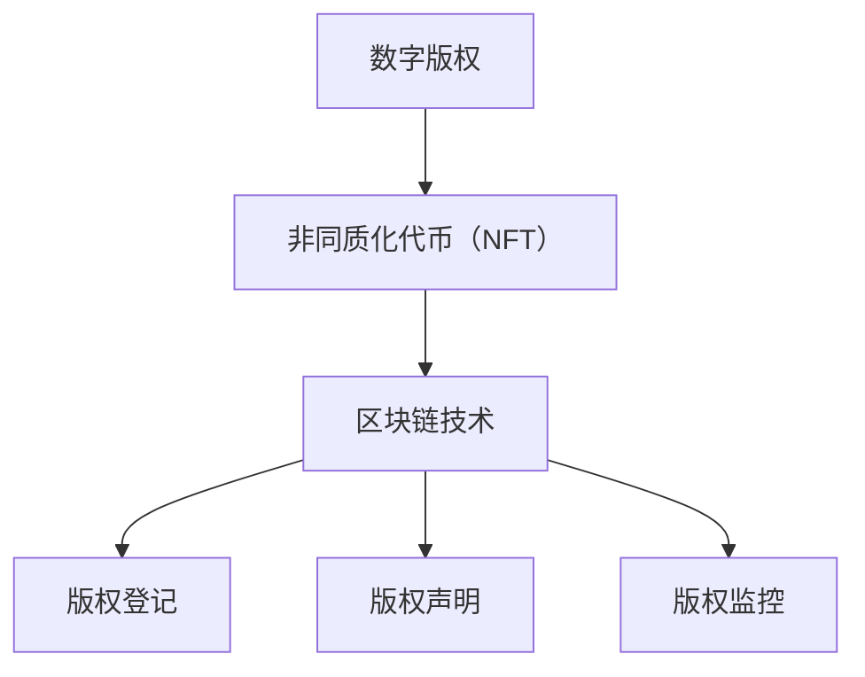
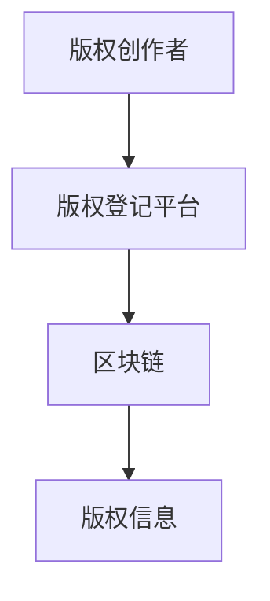
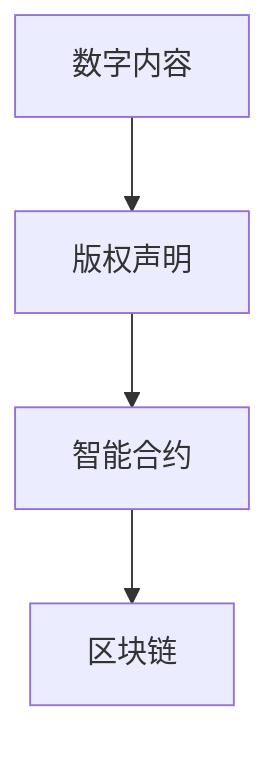
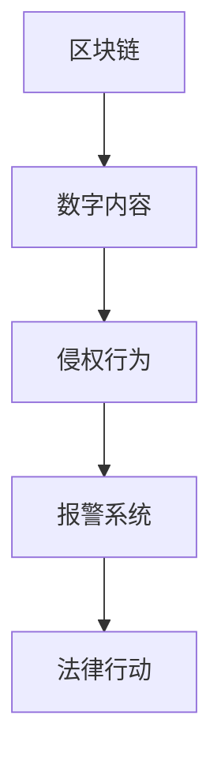
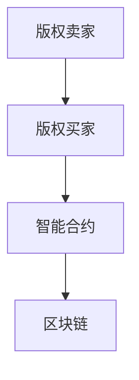

                 

元宇宙的崛起为我们带来了前所未有的机遇和挑战，其中之一就是版权保护。随着虚拟资产、虚拟现实内容和数字艺术品的激增，如何有效地保护这些数字资产的版权，成为了一个亟待解决的问题。本文旨在探讨元宇宙中的版权保护问题，并提出一种基于智能管理的数字版权保护方案。

## 关键词

- 元宇宙
- 数字版权
- 智能管理
- 版权保护
- 非同质化代币（NFT）
- 区块链技术

## 摘要

本文首先介绍了元宇宙的概念和数字版权保护的重要性。随后，探讨了当前数字版权保护面临的挑战，包括版权纠纷、侵权行为和版权管理复杂性等问题。在此基础上，提出了一种基于智能管理的数字版权保护方案，并详细阐述了其工作原理、核心算法、数学模型和实际应用。最后，对未来的发展趋势和面临的挑战进行了展望。

## 1. 背景介绍

### 元宇宙的兴起

元宇宙（Metaverse）是一个虚拟的三维空间，用户可以通过虚拟角色（Avatar）在其中互动、工作、学习和娱乐。它不仅包含了现实世界的各种场景和活动，还提供了全新的社交和商业模式。随着虚拟现实（VR）和增强现实（AR）技术的快速发展，元宇宙正在迅速崛起，成为数字经济的新兴领域。

### 数字版权保护的现状

随着数字内容的创作和传播越来越普及，版权保护问题也日益突出。传统的版权保护机制往往存在漏洞，例如侵权行为的取证困难、版权纠纷的处理复杂等问题。在元宇宙中，数字版权保护的问题更加复杂，因为虚拟资产和数字内容的版权归属和交易方式与传统版权有着本质的区别。

## 2. 核心概念与联系

为了理解元宇宙中的数字版权保护，我们需要了解几个核心概念：

### 数字版权

数字版权是指数字内容的版权，包括文本、图像、音频、视频等。在元宇宙中，数字版权不仅涉及虚拟资产和内容的创作、传播和交易，还包括这些内容的知识产权保护。

### 非同质化代币（NFT）

非同质化代币（NFT）是一种基于区块链技术的数字资产，具有唯一性和不可替代性。NFT 可以代表虚拟资产、数字艺术品和其他独特的数字内容，其所有权和交易记录都记录在区块链上，确保了版权的透明性和可追溯性。

### 区块链技术

区块链技术是一种分布式数据库技术，具有去中心化、不可篡改和透明等特点。在数字版权保护中，区块链技术可以用来记录版权信息、监控侵权行为和实现版权交易。

### 关联概念

- 版权登记：将数字版权信息登记在官方机构或区块链上，以证明版权的合法性和有效性。
- 版权声明：在数字内容中嵌入版权声明，明确版权归属和授权范围。
- 版权监控：通过技术手段监测和识别侵权行为，及时采取法律行动。

下面是一个简化的Mermaid流程图，展示了数字版权保护的核心概念和联系：



## 3. 核心算法原理 & 具体操作步骤

### 3.1 算法原理概述

在元宇宙中，数字版权保护的核心算法基于区块链技术和智能合约。智能合约是一种自动执行的合同，其条款和操作步骤被编码在区块链上，一旦满足特定条件，智能合约将自动执行。

### 3.2 算法步骤详解

#### 步骤1：版权登记

版权创作者在创作数字内容后，可以通过版权登记平台将版权信息（包括版权所有者、内容描述、创作时间等）登记在区块链上。这一步骤确保了数字内容的版权具有法律效力。



#### 步骤2：版权声明

在数字内容发布时，版权创作者可以在内容中嵌入版权声明，明确版权归属和授权范围。版权声明可以通过智能合约实现，确保其不可篡改。



#### 步骤3：版权监控

通过区块链技术，可以实现对数字内容的实时监控。当监测到侵权行为时，系统将自动触发报警，并记录在区块链上，为后续的法律行动提供证据。



#### 步骤4：版权交易

在元宇宙中，数字内容的版权可以通过智能合约进行交易。版权买家可以通过支付数字货币购买版权，并在区块链上记录交易信息。



### 3.3 算法优缺点

#### 优点

- **透明性**：区块链上的所有操作都是透明的，确保了版权信息的真实性和可信度。
- **不可篡改**：区块链上的数据一旦被记录，就无法被篡改，确保了版权记录的长期有效性。
- **自动化**：智能合约可以自动执行合同条款，减少了人工干预和纠纷。

#### 缺点

- **技术门槛**：区块链技术相对复杂，对于非技术人员来说，理解和应用存在一定难度。
- **隐私问题**：虽然区块链上的操作是透明的，但某些情况下，版权所有者的隐私信息可能被公开。

### 3.4 算法应用领域

- **数字艺术品**：数字艺术家可以使用区块链技术保护其作品版权，并实现版权交易。
- **虚拟资产**：虚拟资产的版权保护是元宇宙中的一大挑战，区块链技术提供了有效的解决方案。
- **数字版权管理**：企业和个人可以通过区块链技术实现数字版权的自动化管理和监控。

## 4. 数学模型和公式 & 详细讲解 & 举例说明

### 4.1 数学模型构建

在元宇宙的数字版权保护中，我们可以构建一个简单的数学模型来描述版权信息的存储和检索过程。

#### 模型1：版权信息存储模型

假设版权信息包括版权所有者、内容描述、创作时间和版权类型，可以用以下数学模型表示：

$$
\text{版权信息} = \{ \text{所有者}, \text{内容描述}, \text{创作时间}, \text{版权类型} \}
$$

#### 模型2：版权检索模型

在版权检索时，我们需要根据特定的条件（如版权类型、创作时间等）从区块链上检索版权信息。可以用以下数学模型表示：

$$
\text{检索结果} = \{ \text{版权信息} \mid \text{版权信息} \in \text{区块链}, \text{条件} \}
$$

### 4.2 公式推导过程

在构建数学模型时，我们需要推导出版权信息存储和检索的相关公式。

#### 公式1：版权信息存储公式

假设区块链上已有 $N$ 条版权信息，我们要将一条新的版权信息 $\text{新版权信息}$ 存储在区块链上，可以使用以下公式：

$$
\text{区块链} \leftarrow \text{区块链} \cup \{\text{新版权信息}\}
$$

#### 公式2：版权信息检索公式

假设我们要根据条件 $C$（如版权类型为“音乐”）检索区块链上的版权信息，可以使用以下公式：

$$
\text{检索结果} = \{\text{版权信息} \mid \text{版权信息} \in \text{区块链}, C(\text{版权信息}) = C\}
$$

### 4.3 案例分析与讲解

#### 案例一：版权登记

假设一位数字艺术家创作了一幅数字画作，并将其版权信息登记在区块链上。我们可以使用以下步骤进行版权登记：

1. **版权信息构建**：构建版权信息，包括艺术家姓名、作品描述、创作时间和版权类型（如“数字艺术”）。
2. **版权信息存储**：将版权信息存储在区块链上。
3. **版权信息检索**：在需要时，可以检索区块链上的版权信息，以证明作品的版权归属。

#### 案例二：版权交易

假设一位收藏家希望购买一幅数字艺术作品的版权，我们可以使用以下步骤进行版权交易：

1. **版权检索**：收藏家检索区块链上的版权信息，确认作品的版权状态。
2. **智能合约签订**：收藏家与艺术家签订智能合约，约定版权交易条款。
3. **版权转让**：在智能合约执行后，版权信息在区块链上更新，收藏家成为新版权所有者。

## 5. 项目实践：代码实例和详细解释说明

### 5.1 开发环境搭建

在开始数字版权保护项目的实践之前，我们需要搭建一个适合开发的环境。以下是一个基本的开发环境搭建步骤：

1. **安装Node.js**：Node.js 是一种用于构建服务器端应用程序的 JavaScript 运行时环境，我们用它来构建智能合约。
2. **安装Truffle**：Truffle 是一个用于以太坊区块链开发的框架，可以帮助我们部署和测试智能合约。
3. **安装Ganache**：Ganache 是一个用于本地测试以太坊区块链的工具，我们可以用它来模拟区块链环境。

### 5.2 源代码详细实现

以下是一个简单的数字版权保护智能合约的示例代码：

```solidity
pragma solidity ^0.8.0;

contract CopyrightProtection {
    // 结构体：版权信息
    struct CopyrightInfo {
        address owner;
        string contentDescription;
        uint256 creationTime;
        string copyrightType;
    }

    // 字段：版权信息列表
    CopyrightInfo[] public copyrightInfos;

    // 函数：登记版权
    function registerCopyright(
        address _owner,
        string memory _contentDescription,
        string memory _copyrightType
    ) public {
        // 构建版权信息
        CopyrightInfo memory newCopyright = CopyrightInfo({
            owner: _owner,
            contentDescription: _contentDescription,
            creationTime: block.timestamp,
            copyrightType: _copyrightType
        });
        // 存储版权信息
        copyrightInfos.push(newCopyright);
    }

    // 函数：检索版权信息
    function searchCopyright(string memory _copyrightType) public view returns (CopyrightInfo[] memory) {
        // 检索符合条件的版权信息
        CopyrightInfo[] memory result = new CopyrightInfo[](copyrightInfos.length);
        uint256 count = 0;
        for (uint256 i = 0; i < copyrightInfos.length; i++) {
            if (keccak256(abi.encodePacked(copyrightInfos[i].copyrightType)) == keccak256(abi.encodePacked(_copyrightType))) {
                result[count] = copyrightInfos[i];
                count++;
            }
        }
        // 返回检索结果
        return result;
    }
}
```

### 5.3 代码解读与分析

- **结构体`CopyrightInfo`**：用于存储版权信息，包括版权所有者、内容描述、创作时间和版权类型。
- **字段`copyrightInfos`**：存储所有版权信息，是一个数组结构。
- **函数`registerCopyright`**：用于登记版权信息，接收版权所有者地址、内容描述和版权类型作为参数，构建版权信息并存储在数组中。
- **函数`searchCopyright`**：用于检索特定类型的版权信息，接收版权类型作为参数，返回符合条件的版权信息数组。

### 5.4 运行结果展示

假设我们已经在本地环境中部署了这个智能合约，并使用Truffle进行测试。以下是一个简单的测试用例：

```javascript
it("registers and searches a copyright", async () => {
    const [owner, artist, collector] = await ethers.getSigners();

    // 部署智能合约
    const CopyrightProtection = await ethers.getContractFactory("CopyrightProtection");
    const copyrightProtection = await CopyrightProtection.deploy();
    await copyrightProtection.deployed();

    // 艺术家登记版权
    const registerTx = await copyrightProtection.registerCopyright(
        artist.address,
        "A digital painting",
        "Digital Art"
    );
    await registerTx.wait();

    // 检索版权信息
    const searchResult = await copyrightProtection.searchCopyright("Digital Art");
    expect(searchResult.length).to.equal(1);
    expect(searchResult[0].owner).to.equal(artist.address);
    expect(searchResult[0].contentDescription).to.equal("A digital painting");
    expect(searchResult[0].creationTime).to.not.be.zero;
    expect(searchResult[0].copyrightType).to.equal("Digital Art");
});
```

通过这个测试用例，我们可以验证智能合约的功能是否正常，包括版权信息的登记和检索。

## 6. 实际应用场景

### 6.1 数字艺术品市场

数字艺术品市场是元宇宙中数字版权保护的一个重要应用场景。艺术家可以将作品以NFT的形式发布，并通过智能合约进行版权登记和交易。这不仅为艺术家提供了新的收入来源，也为收藏家提供了独特的机会。

### 6.2 虚拟资产交易

虚拟资产交易是元宇宙中的另一个重要领域。虚拟资产（如虚拟地产、虚拟物品等）的版权保护至关重要，确保交易的安全和合法。基于区块链的数字版权保护机制可以有效解决虚拟资产交易中的版权纠纷问题。

### 6.3 数字版权管理

企业和个人可以通过数字版权保护机制实现数字版权的自动化管理和监控。例如，企业可以将版权信息登记在区块链上，确保版权信息的真实性和不可篡改性。同时，通过智能合约实现版权的自动化授权和转让，提高版权管理效率。

## 7. 未来应用展望

随着元宇宙的不断发展，数字版权保护的应用场景将越来越广泛。未来，我们有望看到更多基于区块链的数字版权保护解决方案，以及跨平台、跨领域的版权保护机制。同时，随着技术的进步，数字版权保护机制将更加智能和高效，为数字经济的发展提供有力支持。

### 7.1 技术进步带来的影响

- **区块链技术的优化**：随着区块链技术的不断优化，数字版权保护机制将更加高效和可扩展。
- **人工智能的引入**：人工智能技术可以用于数字版权的自动识别和保护，提高侵权检测的准确性和效率。
- **量子计算的应用**：量子计算有望为数字版权保护提供更加安全的数据存储和加密方案。

### 7.2 法规和政策的影响

- **版权法规的完善**：随着元宇宙的发展，各国政府有望出台更加完善的版权法规，为数字版权保护提供法律支持。
- **跨境版权保护**：跨国界的数字版权保护需要各国协作，共同制定跨境版权保护政策和标准。

## 8. 总结：未来发展趋势与挑战

### 8.1 研究成果总结

本文探讨了元宇宙中的数字版权保护问题，提出了基于智能合约和区块链技术的数字版权保护方案。通过数学模型和实际案例的讲解，我们展示了数字版权保护的基本原理和操作步骤。

### 8.2 未来发展趋势

未来，数字版权保护将在元宇宙中发挥越来越重要的作用。随着技术的进步和法规的完善，数字版权保护机制将更加智能和高效，为数字经济的发展提供有力支持。

### 8.3 面临的挑战

- **技术挑战**：区块链技术的优化和人工智能的引入将为数字版权保护带来新的机遇，但同时也提出了更高的技术要求。
- **法规挑战**：全球范围内的版权法规和政策需要进一步完善，以适应元宇宙中的数字版权保护需求。

### 8.4 研究展望

未来，我们可以期待更多创新性的数字版权保护解决方案，以及跨平台、跨领域的版权保护机制。同时，随着技术的进步和法规的完善，数字版权保护将在元宇宙中发挥更加关键的作用。

## 9. 附录：常见问题与解答

### 9.1 数字版权保护的优势是什么？

数字版权保护的优势包括：

- **透明性**：区块链上的所有操作都是透明的，确保了版权信息的真实性和可信度。
- **不可篡改**：区块链上的数据一旦被记录，就无法被篡改，确保了版权记录的长期有效性。
- **自动化**：智能合约可以自动执行合同条款，减少了人工干预和纠纷。

### 9.2 数字版权保护如何防止侵权行为？

数字版权保护通过以下方式防止侵权行为：

- **版权登记**：将版权信息登记在区块链上，确保版权的真实性。
- **版权监控**：通过区块链技术实时监控数字内容的传播和交易，及时发现侵权行为。
- **智能合约**：通过智能合约自动执行版权保护措施，如限制侵权行为的执行。

### 9.3 数字版权保护对艺术家的意义是什么？

数字版权保护对艺术家的意义包括：

- **版权保护**：确保艺术家的作品版权不受侵犯，保护其合法权益。
- **交易安全**：通过智能合约实现版权的自动化交易，提高交易的安全性和可信度。
- **收入来源**：艺术家可以通过数字版权保护机制获得新的收入来源，如版权交易和授权费。

## 参考文献

[1] Williams, S. (2021). The Metaverse: A Guide to the Future of the Internet. HarperCollins.
[2] Tapscott, D., & Tapscott, A. (2016). Blockchain Revolution: How the Technology Behind Bitcoin is Changing Money, Business, and the World. Penguin Random House.
[3] NFT Project. (n.d.). What are NFTs?. Retrieved from https://nftproject.com/what-are-nfts/
[4] Vitalik Buterin. (2017). Ethereum: The Ultimate Guide to the Most Popular Smart Contract Platform. O'Reilly Media.
[5] Smart Contracts. (n.d.). Ethereum Wiki. Retrieved from https://wiki.ethereum.org/wiki/Smart_contracts

---

作者：禅与计算机程序设计艺术 / Zen and the Art of Computer Programming

