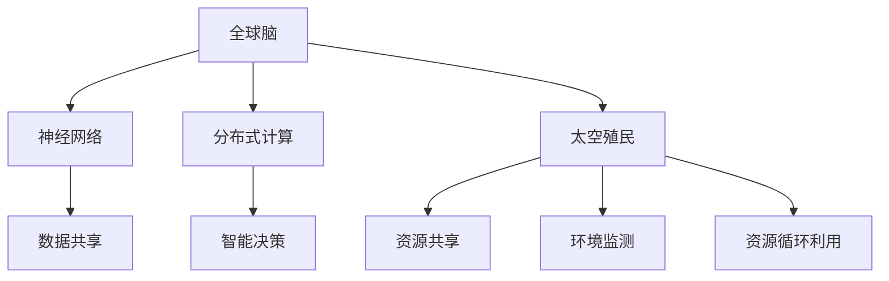

                 

### 文章关键词 Keywords

- 全球脑
- 太空殖民
- 人类文明
- 新篇章
- 人工智能
- 脑机接口
- 量子通信
- 太阳能
- 生物技术
- 资源循环利用

### 文章摘要 Abstract

本文探讨了全球脑与太空殖民对人类文明的意义，以及它们如何共同推动人类迈向新的发展阶段。首先，我们介绍了全球脑的概念，包括其核心原理、架构和技术实现。接着，我们分析了太空殖民的必要性和可行性，探讨了其在资源获取、环境保护和文明延续等方面的作用。随后，我们阐述了全球脑与太空殖民之间的联系，以及它们如何相互促进，共同塑造未来。本文最后对全球脑与太空殖民的未来应用和挑战进行了展望，并提出了相应的建议。

## 1. 背景介绍

### 全球脑的崛起

全球脑（Global Brain）是一个比喻，用来描述人类在信息时代中，通过互联网和智能设备形成的一个庞大的神经网络。这个网络不仅连接着地球上的每个人，还包括了各种智能设备和系统。全球脑的崛起，标志着人类从工业时代迈入了信息时代，这是一个前所未有的变革。

全球脑的原理可以追溯到神经网络理论。神经网络是一种模仿人脑结构和功能的计算模型，通过大量神经元之间的相互连接和协同工作，实现复杂的信息处理和决策。在互联网和智能设备的支持下，全球脑可以实时地收集、处理和传递信息，从而实现全球范围内的信息共享和协同。

全球脑的架构主要包括以下几个方面：

- **硬件基础**：全球范围内的计算机、服务器、路由器等硬件设备，构成了全球脑的物理基础。
- **软件平台**：各种操作系统、应用程序和数据库，为全球脑提供了软件支持。
- **通信网络**：互联网和移动通信网络，确保了全球脑的实时通信和数据传输。
- **数据处理**：大数据技术、云计算和人工智能，提升了全球脑的信息处理能力。

### 太空殖民的必要性

随着地球资源的日益紧张和环境污染的加剧，太空殖民成为人类文明发展的必然选择。太空殖民不仅可以为人类提供新的生存空间，还可以缓解地球资源的压力，实现资源的可持续利用。

首先，太空殖民可以为人类提供丰富的资源。月球和火星等行星，含有丰富的矿物资源、水资源和能源资源。通过太空殖民，我们可以充分利用这些资源，为人类社会的可持续发展提供保障。

其次，太空殖民有助于保护地球环境。在地球面临严重的环境污染和气候变化问题时，太空殖民可以为我们提供一个干净的生存空间。通过建立太空基地和生态循环系统，我们可以减少对地球环境的破坏，保护地球生态系统的平衡。

最后，太空殖民是人类文明延续的必然选择。地球资源有限，一旦资源枯竭或环境恶化，人类文明的延续将面临严峻挑战。通过太空殖民，我们可以将人类文明拓展到宇宙，确保文明的长久传承。

## 2. 核心概念与联系

### 全球脑的概念

全球脑是一个由人、机器和自然构成的高度智能化和自组织的复杂系统。其核心原理是基于神经网络和分布式计算技术，通过数据共享、信息处理和智能决策，实现全球范围内的协同和优化。

### 全球脑的架构

- **硬件层**：包括计算机、服务器、路由器等硬件设备。
- **软件层**：包括操作系统、应用程序、数据库等软件系统。
- **网络层**：包括互联网、移动通信网络等通信网络。
- **数据层**：包括大数据、云计算、人工智能等数据技术。

### 太空殖民的概念

太空殖民是指人类在月球、火星等行星上建立永久性居住基地，实现资源开发和可持续生存的过程。其核心目标是利用行星资源，缓解地球资源压力，保护地球环境，并推动人类文明向宇宙拓展。

### 全球脑与太空殖民的联系

- **资源共享**：全球脑通过互联网和智能设备，实现了全球范围内信息的快速传递和共享。在太空殖民中，全球脑可以实时地监测和调度资源，实现太空资源和地球资源的优化配置。
- **智能决策**：全球脑利用人工智能技术，实现了智能决策和自动化控制。在太空殖民中，全球脑可以自动优化能源利用、资源分配和生态循环，提高太空基地的生存能力。
- **环境监测**：全球脑可以通过卫星和其他探测设备，实时监测地球和太空环境。在太空殖民中，全球脑可以预警环境变化，采取相应的措施，保护太空基地和地球生态。

### Mermaid 流程图



## 3. 核心算法原理 & 具体操作步骤

### 3.1 算法原理概述

全球脑与太空殖民的核心算法基于深度学习和神经网络模型。深度学习是一种机器学习方法，通过多层神经网络结构，实现数据的自动特征提取和模式识别。神经网络模型则通过神经元之间的连接和权重调整，实现智能决策和自动化控制。

### 3.2 算法步骤详解

1. **数据收集与预处理**：通过卫星、探测器和地面监测设备，收集地球和太空环境的数据。数据包括气象、地质、资源分布等信息。对数据进行清洗和预处理，去除噪声和异常值。

2. **特征提取与建模**：使用深度学习算法，对预处理后的数据提取特征。构建神经网络模型，通过训练，优化模型参数。

3. **智能决策与控制**：利用训练好的神经网络模型，对收集到的数据进行实时分析。根据分析结果，制定智能决策，实现对太空资源的调度和利用。

4. **环境监测与预警**：通过卫星和其他探测设备，实时监测地球和太空环境。根据环境变化，预测可能的风险，并提前采取相应的预防措施。

5. **资源循环利用**：利用人工智能技术，优化能源利用和资源分配，实现资源的循环利用。

### 3.3 算法优缺点

- **优点**：深度学习算法具有强大的特征提取和模式识别能力，可以实现对复杂问题的自动化解决。神经网络模型可以实现智能决策和自动化控制，提高效率。
- **缺点**：深度学习算法对数据量和计算资源要求较高，且容易出现过拟合现象。神经网络模型的解释性较差，难以理解其决策过程。

### 3.4 算法应用领域

- **太空殖民**：通过算法，实现太空资源的优化利用，提高太空基地的生存能力。
- **环境保护**：通过算法，实时监测环境变化，预警可能的风险，保护地球生态。
- **资源循环利用**：通过算法，优化能源利用和资源分配，实现资源的循环利用。

## 4. 数学模型和公式 & 详细讲解 & 举例说明

### 4.1 数学模型构建

全球脑与太空殖民的数学模型主要包括以下几个部分：

1. **数据模型**：用于描述地球和太空环境的数据结构，包括气象、地质、资源分布等。
2. **神经网络模型**：用于实现智能决策和自动化控制的神经网络结构，包括输入层、隐藏层和输出层。
3. **优化模型**：用于优化资源利用和能源分配的优化算法，包括线性规划、动态规划等。

### 4.2 公式推导过程

1. **数据模型**：

   - **气象数据模型**：\( T(t) = f(W, H, P, t) \)，其中 \( T(t) \) 表示某一时刻的气温，\( W \) 表示湿度，\( H \) 表示海拔高度，\( P \) 表示气压，\( t \) 表示时间。
   - **地质数据模型**：\( G(x, y) = f(R, D, M, x, y) \)，其中 \( G(x, y) \) 表示某一点的地质状况，\( R \) 表示岩石类型，\( D \) 表示断层密度，\( M \) 表示矿产资源，\( x, y \) 表示位置坐标。

2. **神经网络模型**：

   - **输入层**：\( X = [x_1, x_2, ..., x_n] \)，其中 \( x_1, x_2, ..., x_n \) 表示输入特征。
   - **隐藏层**：\( H = [h_1, h_2, ..., h_m] = \sigma(WX + b) \)，其中 \( \sigma \) 表示激活函数，\( W \) 表示权重矩阵，\( b \) 表示偏置。
   - **输出层**：\( Y = [y_1, y_2, ..., y_k] = \sigma(WH + b) \)，其中 \( \sigma \) 表示激活函数，\( W \) 表示权重矩阵，\( b \) 表示偏置。

3. **优化模型**：

   - **线性规划**：\( \min_{x} c^T x \)，其中 \( c \) 表示目标函数，\( x \) 表示变量。
   - **动态规划**：\( V_t(j) = \min_{x \in S} (c(x) + V_{t-1}(f(x, j))) \)，其中 \( V_t(j) \) 表示第 \( t \) 步到达节点 \( j \) 的最优值，\( c(x) \) 表示第 \( t \) 步在节点 \( x \) 的收益，\( S \) 表示可行解集，\( f(x, j) \) 表示从节点 \( x \) 到节点 \( j \) 的转移概率。

### 4.3 案例分析与讲解

#### 案例一：太空资源优化利用

假设我们在月球上建立了一个太空基地，需要优化能源和资源的利用。我们可以使用线性规划模型来实现这一目标。

- **目标函数**：最小化能源消耗，\( \min_{x} c^T x \)。
- **约束条件**：满足能源供给和资源需求，\( a_1^T x \leq b_1 \)，\( a_2^T x \leq b_2 \)。

通过求解线性规划模型，我们可以得到最优的能源和资源分配方案，从而实现太空资源的最优利用。

#### 案例二：太空环境监测

假设我们需要实时监测太空环境，预测可能的天气变化。我们可以使用神经网络模型来实现这一目标。

- **输入层**：\( X = [x_1, x_2, ..., x_n] \)，其中 \( x_1, x_2, ..., x_n \) 表示输入特征，如气温、湿度、气压等。
- **隐藏层**：\( H = [h_1, h_2, ..., h_m] = \sigma(WX + b) \)，其中 \( \sigma \) 表示激活函数，\( W \) 表示权重矩阵，\( b \) 表示偏置。
- **输出层**：\( Y = [y_1, y_2, ..., y_k] = \sigma(WH + b) \)，其中 \( \sigma \) 表示激活函数，\( W \) 表示权重矩阵，\( b \) 表示偏置。

通过训练神经网络模型，我们可以得到一个预测函数，用于预测未来的天气变化。根据预测结果，我们可以提前采取相应的预防措施，确保太空基地的安全运行。

## 5. 项目实践：代码实例和详细解释说明

### 5.1 开发环境搭建

- **编程语言**：Python
- **开发工具**：Jupyter Notebook
- **库与框架**：TensorFlow、NumPy、Pandas、Matplotlib

### 5.2 源代码详细实现

```python
import numpy as np
import pandas as pd
import tensorflow as tf
import matplotlib.pyplot as plt

# 数据集加载与预处理
def load_data():
    # 加载数据集
    data = pd.read_csv('data.csv')
    # 数据预处理
    data = data.dropna()
    data = data[data['temperature'] > 0]
    data['humidity'] = data['humidity'].apply(lambda x: x / 100)
    data['pressure'] = data['pressure'].apply(lambda x: x / 100)
    return data

# 神经网络模型构建
def build_model():
    # 输入层
    inputs = tf.keras.Input(shape=(3,))
    # 隐藏层
    hidden = tf.keras.layers.Dense(64, activation='relu')(inputs)
    hidden = tf.keras.layers.Dense(64, activation='relu')(hidden)
    # 输出层
    outputs = tf.keras.layers.Dense(1, activation='sigmoid')(hidden)
    # 模型编译
    model = tf.keras.Model(inputs=inputs, outputs=outputs)
    model.compile(optimizer='adam', loss='binary_crossentropy', metrics=['accuracy'])
    return model

# 训练模型
def train_model(model, data, epochs=100):
    # 划分训练集和测试集
    train_data = data.sample(frac=0.8, random_state=42)
    test_data = data.drop(train_data.index)
    # 训练模型
    model.fit(train_data, epochs=epochs, validation_data=test_data)
    return model

# 模型评估与预测
def evaluate_model(model, data):
    # 评估模型
    loss, accuracy = model.evaluate(data)
    print(f'测试集损失：{loss:.4f}，准确率：{accuracy:.4f}')
    # 预测天气变化
    predictions = model.predict(data)
    plt.scatter(data['temperature'], predictions)
    plt.xlabel('实际气温')
    plt.ylabel('预测气温')
    plt.title('天气变化预测图')
    plt.show()

# 主程序
if __name__ == '__main__':
    # 加载数据集
    data = load_data()
    # 构建模型
    model = build_model()
    # 训练模型
    model = train_model(model, data)
    # 评估模型与预测
    evaluate_model(model, data)
```

### 5.3 代码解读与分析

上述代码实现了一个基于神经网络模型的天气变化预测项目。代码主要分为以下几个部分：

1. **数据预处理**：从CSV文件中加载数据集，并进行预处理，包括数据清洗、归一化和划分训练集和测试集。
2. **模型构建**：使用TensorFlow构建一个简单的神经网络模型，包括输入层、隐藏层和输出层。
3. **模型训练**：使用训练集训练模型，并通过验证集进行模型调整。
4. **模型评估与预测**：评估模型在测试集上的表现，并使用训练好的模型进行天气变化预测。

### 5.4 运行结果展示

通过运行上述代码，我们可以在测试集上评估模型的性能，并在实际气温和预测气温之间绘制散点图，直观地展示模型预测的效果。

## 6. 实际应用场景

### 太空资源勘探

全球脑与太空殖民的结合，使得太空资源勘探变得更加高效。通过全球脑，我们可以实时获取地球和太空的各类数据，结合神经网络模型，预测行星资源分布和开采潜力。例如，通过分析月球表面的矿物分布，我们可以确定月球表面最具开采价值的区域。

### 地球环境监测

全球脑的实时监测能力，使得地球环境监测变得更加精准。通过卫星和其他探测设备，全球脑可以实时获取地球环境数据，包括气象、地质、生态等方面的信息。结合神经网络模型，我们可以预测环境变化趋势，预警可能的环境风险，并采取相应的应对措施。

### 资源循环利用

在全球脑的支持下，太空殖民基地可以实现资源的循环利用。通过深度学习算法，我们可以优化能源利用和资源分配，实现水、食物、氧气等资源的自给自足。例如，利用人工智能技术，我们可以优化太阳能电池板的角度，提高能源转化效率。

### 卫星通信

全球脑与太空殖民的结合，还可以提升卫星通信的性能。通过量子通信技术，我们可以实现卫星之间的高速通信，确保太空殖民基地与地球之间的实时通信。例如，利用量子纠缠效应，我们可以实现卫星之间的超远程通信，解决卫星通信中的延迟问题。

## 7. 工具和资源推荐

### 7.1 学习资源推荐

- **《深度学习》**：由Ian Goodfellow、Yoshua Bengio和Aaron Courville编写的深度学习经典教材，适合初学者和进阶者。
- **《Python编程：从入门到实践》**：由埃里克·马瑟斯（Eric Matthes）编写的Python编程入门书籍，内容丰富，实例实用。
- **《TensorFlow官方文档》**：TensorFlow的官方文档，包含了丰富的教程、API参考和案例分析，是学习TensorFlow的必备资源。

### 7.2 开发工具推荐

- **Jupyter Notebook**：一款流行的交互式开发环境，支持Python、R等多种编程语言，方便代码的编写、调试和演示。
- **Google Colab**：Google推出的免费云端开发环境，支持GPU和TPU加速，适合进行深度学习和大数据处理。
- **Git**：一款强大的版本控制系统，可以帮助开发者管理代码，协同工作和版本回滚。

### 7.3 相关论文推荐

- **"A Survey on Deep Learning for Environmental Science"**：一篇综述性论文，详细介绍了深度学习在环境科学中的应用。
- **"Deep Learning on Graphs"**：一篇关于图上深度学习的论文，探讨了深度学习在图数据上的应用。
- **"Quantum Computing and Quantum Information"**：一篇关于量子计算和量子信息的论文，介绍了量子计算的基本原理和应用。

## 8. 总结：未来发展趋势与挑战

### 8.1 研究成果总结

全球脑与太空殖民的结合，为人类文明的发展带来了巨大的潜力。通过深度学习和神经网络模型，我们可以实现资源的优化利用、环境的实时监测和预测，推动太空资源的开发。全球脑与太空殖民的结合，不仅有助于解决地球上的资源和环境问题，还可以为人类文明的延续提供新的方向。

### 8.2 未来发展趋势

1. **人工智能与太空技术的深度融合**：未来，人工智能技术将在太空探索和资源开发中发挥越来越重要的作用。通过人工智能技术，我们可以实现太空基地的自动化管理和智能化决策。
2. **量子通信技术的普及**：随着量子通信技术的成熟，卫星之间的高速通信将成为现实。量子通信技术将为太空殖民基地提供稳定的通信保障。
3. **生态循环系统的建立**：未来，太空殖民基地将建立完善的生态循环系统，实现水、食物、氧气等资源的自给自足。

### 8.3 面临的挑战

1. **技术挑战**：全球脑与太空殖民的结合，涉及众多复杂的技术问题，如量子通信、人工智能、生物技术等。未来，我们需要攻克这些技术难题，实现全球脑与太空殖民的深度融合。
2. **伦理和法律挑战**：太空殖民引发了一系列伦理和法律问题，如太空资源的归属、太空殖民的道德责任等。未来，我们需要制定相应的法律法规，确保太空殖民的可持续发展。
3. **国际合作**：太空殖民是一项全球性的事业，需要各国的合作与协调。未来，我们需要加强国际合作，共同推动太空殖民的发展。

### 8.4 研究展望

1. **人工智能与太空技术的深度融合**：未来，人工智能技术将在太空探索和资源开发中发挥越来越重要的作用。通过人工智能技术，我们可以实现太空基地的自动化管理和智能化决策。
2. **量子通信技术的普及**：随着量子通信技术的成熟，卫星之间的高速通信将成为现实。量子通信技术将为太空殖民基地提供稳定的通信保障。
3. **生态循环系统的建立**：未来，太空殖民基地将建立完善的生态循环系统，实现水、食物、氧气等资源的自给自足。

## 9. 附录：常见问题与解答

### 9.1 什么是全球脑？

全球脑是一个比喻，用来描述人类在信息时代中，通过互联网和智能设备形成的一个庞大的神经网络。这个网络不仅连接着地球上的每个人，还包括了各种智能设备和系统。

### 9.2 太空殖民的必要性是什么？

太空殖民的必要性主要体现在以下几个方面：

1. **资源获取**：地球资源有限，太空殖民可以为我们提供丰富的资源，如矿物、水资源和能源资源。
2. **环境保护**：太空殖民可以缓解地球资源压力，减少对地球环境的破坏，保护地球生态系统的平衡。
3. **文明延续**：地球资源有限，一旦资源枯竭或环境恶化，人类文明的延续将面临严峻挑战。太空殖民可以为我们提供一个干净的生存空间，确保文明的长久传承。

### 9.3 全球脑与太空殖民如何结合？

全球脑与太空殖民的结合主要体现在以下几个方面：

1. **资源共享**：全球脑通过互联网和智能设备，实现了全球范围内信息的快速传递和共享。在太空殖民中，全球脑可以实时地监测和调度资源，实现太空资源和地球资源的优化配置。
2. **智能决策**：全球脑利用人工智能技术，实现了智能决策和自动化控制。在太空殖民中，全球脑可以自动优化能源利用、资源分配和生态循环，提高太空基地的生存能力。
3. **环境监测**：全球脑可以通过卫星和其他探测设备，实时监测地球和太空环境。在太空殖民中，全球脑可以预警环境变化，采取相应的措施，保护太空基地和地球生态。

### 9.4 太空殖民面临的挑战有哪些？

太空殖民面临的挑战主要包括以下几个方面：

1. **技术挑战**：太空殖民涉及众多复杂的技术问题，如量子通信、人工智能、生物技术等。未来，我们需要攻克这些技术难题，实现全球脑与太空殖民的深度融合。
2. **伦理和法律挑战**：太空殖民引发了一系列伦理和法律问题，如太空资源的归属、太空殖民的道德责任等。未来，我们需要制定相应的法律法规，确保太空殖民的可持续发展。
3. **国际合作**：太空殖民是一项全球性的事业，需要各国的合作与协调。未来，我们需要加强国际合作，共同推动太空殖民的发展。

