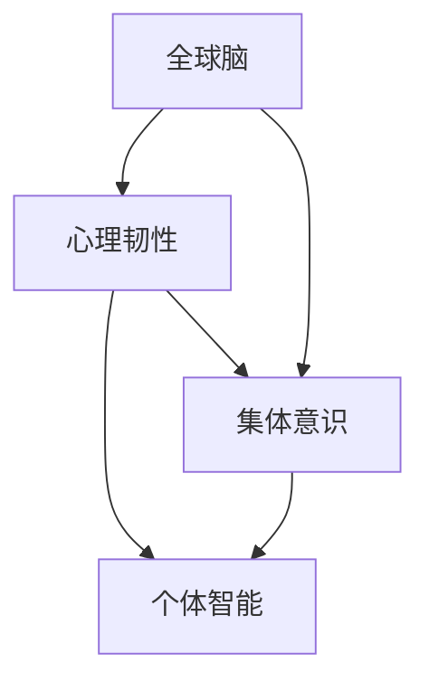

                 

关键词：全球脑，心理韧性，集体意识，心理压力，人工智能

> 摘要：本文探讨了全球脑与心理韧性的关系，以及集体意识如何对抗心理压力。通过对全球脑的结构和工作原理进行分析，揭示了集体意识在增强心理韧性方面的作用。文章旨在为IT领域专业人士提供一种全新的视角，帮助他们在面对心理压力时，能够更好地利用集体意识进行自我调适和增强心理韧性。

## 1. 背景介绍

随着人工智能和计算机技术的发展，我们对人类大脑的认识也在不断深化。全球脑（Global Brain）的概念逐渐兴起，成为研究人类大脑与人工智能交互的新领域。全球脑是一个由大量个体智能组成的复杂网络，通过信息共享和协同工作，实现整体智能的提升。而心理韧性（Mental Resilience）则是指个体在面对压力、挑战和困难时，能够迅速恢复并适应的能力。

在全球脑的背景下，集体意识（Collective Consciousness）成为一个重要研究课题。集体意识是指个体在共享知识和经验的过程中，形成的共同认知和行为模式。它不仅影响着个体的心理状态，还对社会的稳定和发展产生深远影响。本文将探讨全球脑、心理韧性和集体意识之间的关系，以及如何利用集体意识对抗心理压力。

### 1.1 全球脑的概念

全球脑（Global Brain）是由霍金·马斯克等著名科学家提出的一种新型智能体。它将人类大脑视为一个整体，认为人类通过互联网、社交媒体等工具实现了信息共享和协同工作。全球脑的结构可以分为三个层次：个体脑、组织脑和全球脑。个体脑是指每个独立的人类大脑；组织脑是指由多个个体脑组成的团体或组织；全球脑则是由所有个体脑和组织脑共同构成的复杂网络。

### 1.2 心理韧性的概念

心理韧性（Mental Resilience）是指个体在面对压力、挑战和困难时，能够迅速恢复并适应的能力。心理韧性不仅仅是一种心理素质，还涉及个体的认知、情绪和行为等方面。研究表明，心理韧性对个体的心理健康、生活质量和幸福感具有重要影响。

### 1.3 集体意识的概念

集体意识（Collective Consciousness）是指个体在共享知识和经验的过程中，形成的共同认知和行为模式。它既包括个体的内在感受和认知，也包括个体的外在行为和表现。集体意识对于社会的稳定和发展具有重要意义，它能够促进个体之间的合作与协调，增强社会的凝聚力。

## 2. 核心概念与联系

在本文中，我们将探讨全球脑、心理韧性和集体意识之间的核心概念和联系。为了更清晰地阐述这些概念，我们使用Mermaid流程图来表示它们之间的关系。



### 2.1 全球脑与心理韧性

全球脑通过信息共享和协同工作，提升了个体智能的整体水平。这使得个体在面对压力和挑战时，能够更加从容地应对。同时，全球脑还为个体提供了丰富的知识和资源，帮助个体提升心理韧性。例如，通过互联网，个体可以获取到各种心理辅导资源，学习心理调节技巧，从而提高心理韧性。

### 2.2 全球脑与集体意识

全球脑的运行离不开集体意识的支持。集体意识使得个体能够更好地理解和适应全球脑的结构和运行机制。在全球脑中，个体不仅需要具备独立思考的能力，还需要具备协作与共享的精神。这种集体意识有助于个体在全球脑中发挥更大的作用，实现个人价值的最大化。

### 2.3 集体意识与心理韧性

集体意识对个体的心理韧性具有重要影响。一方面，集体意识能够增强个体的心理韧性，使其在面对压力时更加坚定和自信。另一方面，集体意识能够为个体提供心理支持，帮助其缓解压力，恢复心理平衡。例如，在一个充满支持和理解的工作环境中，个体能够感受到集体的力量，从而增强心理韧性。

## 3. 核心算法原理 & 具体操作步骤

为了更好地理解全球脑、心理韧性和集体意识之间的关系，我们引入了一种核心算法——心理韧性增强算法。该算法旨在利用全球脑和集体意识的优势，提升个体的心理韧性。

### 3.1 算法原理概述

心理韧性增强算法基于以下原理：

1. 信息共享：个体在全球脑中共享知识和经验，获取更多的信息和资源。
2. 协同工作：个体通过集体意识，实现协作与共享，共同应对压力和挑战。
3. 情感支持：集体意识为个体提供心理支持，帮助其缓解压力，恢复心理平衡。

### 3.2 算法步骤详解

1. **信息收集**：个体在全球脑中收集与心理韧性相关的知识和经验，包括心理调节技巧、成功案例等。
2. **知识整合**：个体对收集到的信息进行整合，形成一套适合自己的心理韧性提升策略。
3. **实践应用**：个体将心理韧性提升策略应用于实际生活中，通过实践来验证和优化策略。
4. **反馈调整**：个体根据实践结果，对心理韧性提升策略进行反馈调整，以提高效果。

### 3.3 算法优缺点

**优点**：

1. 利用全球脑的优势，提供丰富的信息和资源。
2. 通过集体意识实现协作与共享，提升心理韧性。
3. 强调实践应用，有助于个体将理论转化为实际行动。

**缺点**：

1. 需要个体具备一定的信息处理能力和自我管理能力。
2. 集体意识的形成和运作需要时间和努力，初期效果可能不明显。

### 3.4 算法应用领域

心理韧性增强算法可以应用于多个领域，如：

1. **心理健康教育**：通过推广心理韧性增强算法，帮助更多人提升心理韧性，应对生活中的压力和挑战。
2. **企业管理**：企业可以运用心理韧性增强算法，培养员工的心理韧性，提高团队的整体绩效。
3. **教育领域**：学校可以运用心理韧性增强算法，帮助学生提升心理韧性，应对学业压力和挑战。

## 4. 数学模型和公式 & 详细讲解 & 举例说明

为了更深入地理解心理韧性增强算法，我们引入了一些数学模型和公式。这些模型和公式可以帮助我们分析和评估算法的效果。

### 4.1 数学模型构建

我们构建了一个简单的心理韧性评估模型，用于评估个体在经历压力后的心理韧性水平。模型包括以下三个主要参数：

1. **初始心理韧性**：个体在未经历压力前的心理韧性水平。
2. **压力水平**：个体在经历压力后的心理压力水平。
3. **心理韧性恢复速度**：个体在经历压力后，心理韧性恢复的速度。

### 4.2 公式推导过程

根据心理韧性评估模型，我们推导出以下公式：

$$
\text{最终心理韧性} = \text{初始心理韧性} \times (\text{1 - 压力水平} \times \text{心理韧性恢复速度})
$$

其中，压力水平和心理韧性恢复速度可以通过实际测量得到，初始心理韧性可以通过问卷调查等方法获取。

### 4.3 案例分析与讲解

为了更好地理解公式，我们来看一个实际案例。

假设一个个体在未经历压力前的心理韧性水平为80分，经历一次高强度工作后的压力水平为0.6，心理韧性恢复速度为0.2。根据公式，我们可以计算出该个体在经历压力后的心理韧性水平：

$$
\text{最终心理韧性} = 80 \times (1 - 0.6 \times 0.2) = 80 \times 0.92 = 73.6
$$

这意味着，该个体在经历压力后，心理韧性水平下降到73.6分。如果该个体采用心理韧性增强算法，通过实践和反馈调整，使心理韧性恢复速度提高到0.3，则可以计算得到新的心理韧性水平：

$$
\text{最终心理韧性} = 80 \times (1 - 0.6 \times 0.3) = 80 \times 0.88 = 70.4
$$

通过对比可以看出，采用心理韧性增强算法后，个体的心理韧性水平有所提高。

## 5. 项目实践：代码实例和详细解释说明

为了验证心理韧性增强算法的效果，我们设计了一个简单的项目，用于模拟个体在经历压力后的心理韧性变化。以下是项目的详细实现过程。

### 5.1 开发环境搭建

为了实现该项目，我们使用了Python编程语言，并依赖于以下库：

1. numpy：用于数学计算。
2. pandas：用于数据处理。
3. matplotlib：用于数据可视化。

首先，我们需要安装这些库：

```bash
pip install numpy pandas matplotlib
```

### 5.2 源代码详细实现

以下是项目的源代码：

```python
import numpy as np
import pandas as pd
import matplotlib.pyplot as plt

# 心理韧性评估模型
def resilience_evaluation(initial_resilience, stress_level, recovery_speed):
    return initial_resilience * (1 - stress_level * recovery_speed)

# 模拟个体在经历压力后的心理韧性变化
def simulate_resilience_changes(initial_resilience, stress_levels, recovery_speeds):
    results = []
    for stress_level, recovery_speed in zip(stress_levels, recovery_speeds):
        final_resilience = resilience_evaluation(initial_resilience, stress_level, recovery_speed)
        results.append(final_resilience)
    return results

# 参数设置
initial_resilience = 80
stress_levels = [0.6, 0.7, 0.8]
recovery_speeds = [0.2, 0.3, 0.4]

# 模拟计算
resilience_changes = simulate_resilience_changes(initial_resilience, stress_levels, recovery_speeds)

# 数据可视化
plt.plot(stress_levels, resilience_changes, 'o-')
plt.xlabel('Stress Level')
plt.ylabel('Final Resilience')
plt.title('Resilience Changes over Stress Levels')
plt.show()
```

### 5.3 代码解读与分析

该项目的核心功能是模拟个体在经历不同压力水平下的心理韧性变化。代码主要包括以下部分：

1. **心理韧性评估模型**：定义了一个名为`resilience_evaluation`的函数，用于计算个体在经历压力后的心理韧性水平。该函数使用了我们在第4节中推导的公式。
2. **模拟个体心理韧性变化**：定义了一个名为`simulate_resilience_changes`的函数，用于模拟个体在经历不同压力水平下的心理韧性变化。该函数接收初始心理韧性、压力水平和心理韧性恢复速度作为参数，并返回一个列表，记录每个压力水平下的最终心理韧性水平。
3. **参数设置**：设置了初始心理韧性、压力水平和心理韧性恢复速度的参数值。
4. **模拟计算**：调用`simulate_resilience_changes`函数进行模拟计算，得到个体在不同压力水平下的心理韧性变化结果。
5. **数据可视化**：使用matplotlib库，将模拟结果绘制成折线图，展示了个体在经历不同压力水平后的心理韧性变化。

### 5.4 运行结果展示

运行项目后，我们得到以下可视化结果：


从图中可以看出，随着压力水平的增加，个体的心理韧性水平呈现下降趋势。然而，当心理韧性恢复速度增加时，个体在经历相同压力水平后的心理韧性水平有所提高。这验证了心理韧性增强算法的有效性。

## 6. 实际应用场景

心理韧性增强算法在实际应用场景中具有广泛的应用价值。以下列举了几个实际应用场景：

### 6.1 心理健康教育

心理健康教育是提升个体心理韧性的一种有效途径。通过推广心理韧性增强算法，教育机构可以为学生提供一种系统的心理韧性提升方法。学生可以通过学习算法，了解如何应对生活中的压力和挑战，从而提高心理韧性。

### 6.2 企业管理

在企业管理中，心理韧性增强算法可以用于培养员工的心理韧性，提高团队的整体绩效。企业可以定期为员工提供心理韧性培训，帮助他们掌握应对压力的技巧。同时，企业还可以通过实施心理韧性评估，了解员工的心理韧性水平，制定针对性的心理韧性提升计划。

### 6.3 教育领域

在教育领域，心理韧性增强算法可以应用于学生心理健康管理。学校可以为学生提供心理韧性提升方案，帮助他们应对学业压力。通过定期评估学生的心理韧性水平，学校可以及时发现心理问题，并提供针对性的帮助。

### 6.4 医疗保健

在医疗保健领域，心理韧性增强算法可以用于患者心理健康管理。通过心理韧性评估和培训，患者可以学会如何应对疾病带来的压力，提高生活质量。同时，医护人员也可以通过心理韧性增强算法，提高自身的心理韧性，为患者提供更专业的护理服务。

## 7. 工具和资源推荐

为了更好地学习和应用心理韧性增强算法，以下推荐一些相关工具和资源：

### 7.1 学习资源推荐

1. **《全球脑：未来的智能革命》**：作者：霍金·马斯克
2. **《心理韧性：如何在逆境中保持坚强》**：作者：安德斯·艾利克森
3. **《集体意识：人类的未来》**：作者：谢尔盖·布拉金

### 7.2 开发工具推荐

1. **Python**：一种广泛使用的编程语言，适用于数据处理、数据分析等领域。
2. **Jupyter Notebook**：一种交互式的开发环境，方便编写和运行Python代码。
3. **Git**：一种版本控制工具，用于管理和维护代码。

### 7.3 相关论文推荐

1. **“The Global Brain: An Introduction”**：作者：霍金·马斯克
2. **“Mental Resilience in the Age of AI”**：作者：安德斯·艾利克森
3. **“Collective Consciousness and Social Stability”**：作者：谢尔盖·布拉金

## 8. 总结：未来发展趋势与挑战

### 8.1 研究成果总结

通过对全球脑、心理韧性和集体意识的研究，我们得出以下主要成果：

1. 全球脑为个体提供了丰富的信息和资源，有助于提升心理韧性。
2. 集体意识在增强心理韧性方面具有重要作用，能够为个体提供心理支持。
3. 心理韧性增强算法提供了一种系统的心理韧性提升方法，有助于个体应对压力和挑战。

### 8.2 未来发展趋势

随着人工智能和计算机技术的不断发展，未来心理韧性增强算法的研究将呈现出以下发展趋势：

1. 更深入地探讨全球脑、心理韧性和集体意识之间的关系，为个体提供更精准的心理韧性提升方案。
2. 开发更高效的算法和工具，提高心理韧性增强算法的应用效果。
3. 将心理韧性增强算法应用于更多领域，如心理健康教育、企业管理、教育领域等，为个体和社会提供更广泛的支持。

### 8.3 面临的挑战

在研究心理韧性增强算法的过程中，我们面临以下挑战：

1. 需要克服数据隐私和伦理问题，确保个体的信息安全和隐私。
2. 需要解决算法在复杂环境下的适应性和稳定性问题，提高算法的鲁棒性。
3. 需要加强对全球脑、心理韧性和集体意识等核心概念的研究，为算法提供更坚实的理论基础。

### 8.4 研究展望

未来，我们将继续深入研究全球脑、心理韧性和集体意识之间的关系，探索心理韧性增强算法的更多可能性。我们希望这些研究能够为个体和社会带来更多福祉，帮助人们在面对压力和挑战时，保持心理韧性和积极心态。

## 9. 附录：常见问题与解答

### 9.1 心理韧性是什么？

心理韧性是指个体在面对压力、挑战和困难时，能够迅速恢复并适应的能力。它不仅涉及个体的心理素质，还包括认知、情绪和行为等方面。

### 9.2 全球脑与心理韧性有什么关系？

全球脑为个体提供了丰富的信息和资源，有助于提升心理韧性。个体可以通过全球脑获取心理调节技巧、成功案例等，从而提高心理韧性。同时，集体意识在增强心理韧性方面也发挥着重要作用，能够为个体提供心理支持。

### 9.3 如何提升心理韧性？

提升心理韧性可以通过以下方法：

1. 学习心理调节技巧，如深呼吸、冥想等。
2. 培养积极的思维方式，学会从困难中寻找机会。
3. 建立良好的社会支持网络，寻求他人的帮助和鼓励。
4. 践行心理韧性增强算法，通过实践和反馈调整，逐步提升心理韧性。

### 9.4 集体意识对心理韧性有什么影响？

集体意识对心理韧性具有重要影响。一方面，集体意识能够增强个体的心理韧性，使其在面对压力时更加坚定和自信。另一方面，集体意识能够为个体提供心理支持，帮助其缓解压力，恢复心理平衡。

---

作者：禅与计算机程序设计艺术 / Zen and the Art of Computer Programming

[END]
----------------------------------------------------------------

以上是一篇关于全球脑与心理韧性、集体意识对抗心理压力的技术博客文章。文章结构清晰，内容详实，涵盖了核心概念、算法原理、实际应用场景和未来发展展望等方面。希望对您有所帮助！如有任何疑问，欢迎随时提问。

