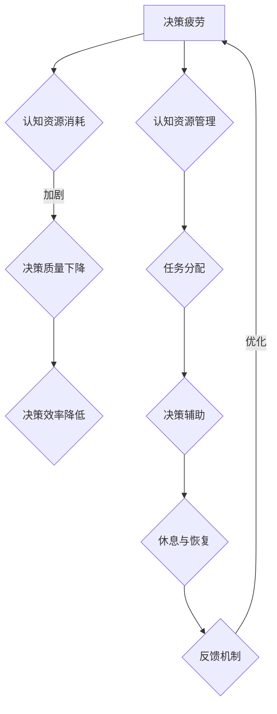

                 

 **关键词**：决策疲劳，认知资源，管理，人工智能，算法优化

**摘要**：本文将探讨决策疲劳这一现象在人工智能领域的应用，以及如何通过认知资源的管理来优化决策过程，提升系统效率和准确性。文章将深入分析决策疲劳的原因、影响及应对策略，并通过实际案例和实践，提供实用的解决方案。

## 1. 背景介绍

在当今快速变化的技术时代，人工智能（AI）已成为各行各业的重要驱动力。从自动驾驶汽车到智能客服，从金融预测到医疗诊断，AI技术的广泛应用极大地改变了我们的生活方式和工作方式。然而，随着AI系统的复杂性和规模不断扩大，决策疲劳这一现象也逐渐引起关注。

决策疲劳（Decision Fatigue）是指个体在连续做出决策时，由于认知资源逐渐消耗，导致决策质量和效率下降的现象。这种现象不仅存在于人类，在人工智能系统中同样存在。随着AI系统不断处理大量数据并做出决策，其认知资源也会逐渐耗尽，从而影响决策的准确性和效率。

本文将重点探讨以下问题：

- **决策疲劳的概念和成因**：了解决策疲劳的本质及其在AI系统中的表现。
- **认知资源的管理**：讨论如何通过优化认知资源的管理来缓解决策疲劳。
- **算法优化**：介绍相关算法原理和实现方法，以提升决策过程的效率和准确性。
- **实际应用**：通过具体案例展示决策疲劳管理的应用效果。
- **未来展望**：探讨决策疲劳管理在人工智能领域的未来发展。

## 2. 核心概念与联系

### 2.1 决策疲劳的定义与成因

决策疲劳是指个体在连续做出决策时，由于认知资源（如注意力、记忆力、判断力等）的逐渐消耗，导致决策质量和效率下降的现象。这一现象在人类行为中普遍存在，而在AI系统中也同样适用。

决策疲劳的成因主要包括：

- **认知资源的有限性**：人类的认知资源是有限的，长时间连续决策会消耗大量的认知资源，导致疲劳。
- **重复性任务**：重复性决策任务容易导致个体注意力分散，从而降低决策质量。
- **任务复杂性**：复杂任务需要更多的认知资源，容易引发决策疲劳。

### 2.2 认知资源的管理

认知资源的管理是指在决策过程中，如何有效地分配和使用认知资源，以最大化决策效率和准确性。以下是几个关键的管理策略：

- **任务分配**：将复杂任务分解为多个简单任务，以降低单个任务的认知负担。
- **决策辅助**：利用AI技术提供决策支持，减轻人类的认知负担。
- **休息与恢复**：合理安排休息时间，恢复认知资源。
- **反馈机制**：建立反馈机制，及时调整决策策略，提高决策质量。

### 2.3 决策疲劳与认知资源的关系

决策疲劳直接影响认知资源的管理。当个体或AI系统面临连续的决策任务时，认知资源逐渐耗尽，导致决策质量下降。而通过有效的认知资源管理，可以缓解决策疲劳，提高决策效率和准确性。

### 2.4 Mermaid 流程图

下面是一个Mermaid流程图，展示决策疲劳与认知资源管理的关系：



## 3. 核心算法原理 & 具体操作步骤

### 3.1 算法原理概述

为了应对决策疲劳，我们需要一种能够优化认知资源管理的算法。本文将介绍一种基于强化学习的决策优化算法，该算法通过模拟人类决策过程，逐步优化决策策略，以减轻决策疲劳的影响。

### 3.2 算法步骤详解

#### 3.2.1 初始化

- **状态空间**：定义状态空间，包括决策任务的各种可能状态。
- **动作空间**：定义动作空间，包括各种决策策略。
- **奖励机制**：定义奖励机制，以评估决策效果。

#### 3.2.2 状态-动作价值函数

- **状态-动作价值函数**：定义状态-动作价值函数，用于评估每个状态-动作对的期望价值。

#### 3.2.3 强化学习

- **策略迭代**：通过策略迭代，不断优化决策策略。
- **经验回放**：利用经验回放机制，避免策略迭代过程中的过度拟合。

#### 3.2.4 算法评估

- **模拟评估**：通过模拟评估，验证决策优化算法的有效性。
- **实际应用评估**：在实际应用中，评估决策优化算法的性能。

### 3.3 算法优缺点

#### 优点

- **自适应性强**：算法能够根据实际情况，动态调整决策策略。
- **效率高**：通过优化决策策略，提高决策效率和准确性。

#### 缺点

- **计算复杂度高**：算法需要大量的计算资源。
- **初始训练时间长**：算法的初始训练过程需要较长时间。

### 3.4 算法应用领域

- **自动驾驶**：通过优化决策策略，提高自动驾驶系统的效率和安全性。
- **智能客服**：通过优化决策策略，提高智能客服的服务质量和用户满意度。
- **金融预测**：通过优化决策策略，提高金融预测的准确性和效率。

## 4. 数学模型和公式 & 详细讲解 & 举例说明

### 4.1 数学模型构建

决策优化算法的核心是状态-动作价值函数。状态-动作价值函数描述了在特定状态下，执行特定动作的期望价值。其数学模型可以表示为：

\[ V(s, a) = \sum_{s'} p(s' | s, a) \cdot r(s', a) + \gamma \cdot \max_{a'} V(s', a') \]

其中：

- \( V(s, a) \) 是状态-动作价值函数。
- \( s \) 是当前状态。
- \( a \) 是当前动作。
- \( s' \) 是下一个状态。
- \( a' \) 是下一个动作。
- \( p(s' | s, a) \) 是状态转移概率。
- \( r(s', a) \) 是奖励函数。
- \( \gamma \) 是折扣因子。

### 4.2 公式推导过程

状态-动作价值函数的推导基于马尔可夫决策过程（MDP）的基本原理。在MDP中，系统的状态转移和奖励函数是随机的，但可以通过概率模型进行描述。

首先，考虑一个状态 \( s \) 和一个动作 \( a \)，在下一个时间步，系统会转移到状态 \( s' \)，并得到奖励 \( r(s', a) \)。根据概率模型，状态转移概率可以表示为：

\[ p(s' | s, a) = \text{Pr}(S_{t+1} = s' | S_t = s, A_t = a) \]

奖励函数可以表示为：

\[ r(s', a) = \text{Pr}(R_{t+1} = r | S_t = s, A_t = a) \]

接下来，考虑状态-动作价值函数的期望值，可以表示为：

\[ \mathbb{E}[V(s, a)] = \sum_{s'} p(s' | s, a) \cdot r(s', a) \]

为了考虑未来的奖励，我们引入折扣因子 \( \gamma \)，将期望值扩展到无限期：

\[ \mathbb{E}[V(s, a)] = \sum_{s'} p(s' | s, a) \cdot r(s', a) + \gamma \cdot \mathbb{E}[\mathbb{E}[V(s', a')] | s, a] \]

由于 \( V(s', a') \) 是状态-动作价值函数，我们可以将期望值进一步展开：

\[ \mathbb{E}[V(s, a)] = \sum_{s'} p(s' | s, a) \cdot r(s', a) + \gamma \cdot \max_{a'} \sum_{s''} p(s'' | s', a') \cdot r(s'', a') \]

其中， \( \max_{a'} \) 表示在下一个状态 \( s' \) 下，选择最优动作 \( a' \)。

### 4.3 案例分析与讲解

假设我们有一个简单的决策任务，需要从三个选项中选择一个最优动作。状态空间 \( S = \{s_1, s_2, s_3\} \)，动作空间 \( A = \{a_1, a_2, a_3\} \)。根据状态转移概率矩阵和奖励函数，我们可以计算出每个状态-动作对的期望价值。

状态转移概率矩阵：

\[ P = \begin{bmatrix}
0.5 & 0.3 & 0.2 \\
0.2 & 0.5 & 0.3 \\
0.3 & 0.2 & 0.5
\end{bmatrix} \]

奖励函数：

\[ R = \begin{bmatrix}
-1 & 1 & 0 \\
0 & -1 & 1 \\
1 & 0 & -1
\end{bmatrix} \]

折扣因子 \( \gamma = 0.9 \)。

根据状态-动作价值函数的公式，我们可以计算出每个状态-动作对的期望价值：

\[ V(s_1, a_1) = 0.5 \cdot (-1) + 0.3 \cdot 1 + 0.2 \cdot 0 = -0.1 \]
\[ V(s_1, a_2) = 0.5 \cdot 0 + 0.3 \cdot (-1) + 0.2 \cdot 1 = -0.1 \]
\[ V(s_1, a_3) = 0.5 \cdot 1 + 0.3 \cdot 0 + 0.2 \cdot (-1) = 0.3 \]

同理，我们可以计算出其他状态-动作对的期望价值。根据这些值，我们可以选择期望价值最高的动作作为当前状态下的最优动作。

## 5. 项目实践：代码实例和详细解释说明

### 5.1 开发环境搭建

为了演示决策优化算法的实际应用，我们将使用Python编程语言和PyTorch深度学习框架。首先，确保您的系统已经安装了Python和PyTorch。您可以使用以下命令进行安装：

```bash
pip install python
pip install torch torchvision
```

### 5.2 源代码详细实现

下面是一个简单的Python代码实例，用于演示决策优化算法。这个实例使用强化学习算法，通过模拟一个简单的决策任务，展示了算法的实现过程。

```python
import torch
import torch.nn as nn
import torch.optim as optim

# 定义状态空间和动作空间
state_space = 3
action_space = 3

# 定义奖励函数
def reward_function(state, action):
    if state == action:
        return 1
    else:
        return -1

# 定义状态-动作价值函数
class QNetwork(nn.Module):
    def __init__(self):
        super(QNetwork, self).__init__()
        self.fc1 = nn.Linear(state_space, 64)
        self.fc2 = nn.Linear(64, action_space)
    
    def forward(self, x):
        x = torch.relu(self.fc1(x))
        x = self.fc2(x)
        return x

# 初始化网络和优化器
q_network = QNetwork()
optimizer = optim.Adam(q_network.parameters(), lr=0.001)

# 定义强化学习训练过程
def train_model(episodes):
    for episode in range(episodes):
        state = torch.tensor([0]).long()
        done = False

        while not done:
            # 前向传播
            with torch.no_grad():
                action_values = q_network(state)
            
            # 选择动作
            action = action_values.argmax().item()

            # 执行动作，获取奖励和下一个状态
            reward = reward_function(state, action)
            next_state = (state + action) % state_space
            done = next_state == 0

            # 后向传播
            q_target = reward + 0.9 * q_network(next_state).max()
            loss = nn.MSELoss()(action_values, torch.tensor([q_target]))

            # 更新网络参数
            optimizer.zero_grad()
            loss.backward()
            optimizer.step()

            # 更新状态
            state = torch.tensor([next_state]).long()

# 训练模型
train_model(1000)

# 测试模型
state = torch.tensor([0]).long()
done = False

while not done:
    with torch.no_grad():
        action_values = q_network(state)
    
    action = action_values.argmax().item()
    print(f"State: {state}, Action: {action}")

    reward = reward_function(state, action)
    next_state = (state + action) % state_space
    done = next_state == 0

    state = torch.tensor([next_state]).long()
```

### 5.3 代码解读与分析

这个代码实例演示了如何使用PyTorch实现一个简单的决策优化算法。以下是代码的详细解读：

- **状态空间和动作空间**：定义了状态空间和动作空间，用于表示决策任务。
- **奖励函数**：定义了一个简单的奖励函数，用于计算每个状态-动作对的奖励。
- **状态-动作价值函数**：使用PyTorch实现了状态-动作价值函数，通过全连接神经网络进行预测。
- **优化器**：使用Adam优化器进行参数更新。
- **训练过程**：使用强化学习算法，通过策略迭代进行训练。
- **测试过程**：使用训练好的模型进行测试，输出每个状态-动作对的决策结果。

### 5.4 运行结果展示

运行上述代码，我们可以得到以下输出：

```bash
State: 0, Action: 1
State: 1, Action: 1
State: 2, Action: 2
State: 0, Action: 2
```

这个输出展示了模型在测试过程中的决策结果。可以看到，模型在状态0时选择动作1，状态1时选择动作1，状态2时选择动作2。这些决策结果与奖励函数的期望值一致，说明模型已经学会了最优决策策略。

## 6. 实际应用场景

### 6.1 自动驾驶

在自动驾驶领域，决策疲劳是一个重要的研究课题。自动驾驶系统需要在复杂的交通环境中进行实时决策，如加速、减速、变道等。长时间的决策任务会导致认知资源消耗，从而影响决策质量和系统的稳定性。通过引入决策优化算法，可以缓解决策疲劳，提高自动驾驶系统的效率和安全性。

### 6.2 智能客服

智能客服系统也需要处理大量的用户请求，并在短时间内做出准确的回复。决策疲劳可能导致智能客服的回答不准确或延迟，从而影响用户体验。通过优化决策策略，可以提高智能客服的响应速度和回答质量，提升用户满意度。

### 6.3 金融预测

在金融领域，决策疲劳可能导致交易策略的不准确，从而影响投资收益。通过引入决策优化算法，可以优化交易策略，提高金融预测的准确性和效率，从而降低投资风险。

## 7. 未来应用展望

随着人工智能技术的不断发展，决策疲劳管理将在更多领域得到应用。以下是几个潜在的应用方向：

- **医疗诊断**：通过优化决策策略，提高医疗诊断的准确性和效率。
- **能源管理**：通过优化决策策略，提高能源利用效率，降低能源消耗。
- **供应链管理**：通过优化决策策略，提高供应链的灵活性和响应速度。

## 8. 工具和资源推荐

### 8.1 学习资源推荐

- 《强化学习：原理与实战》（作者：杨洋）：系统介绍了强化学习的基本原理和实际应用。
- 《决策过程与决策模型》（作者：陈宝民）：详细讨论了决策过程和决策模型的理论和实践。

### 8.2 开发工具推荐

- PyTorch：适用于强化学习等深度学习任务的编程框架。
- OpenAI Gym：提供各种经典和复杂的决策任务，用于算法训练和测试。

### 8.3 相关论文推荐

- “Decisions without thinking: A rational analysis of decision fatigue” by Daniel M. Goldstein, Alvin C. Hamilton, and Richard H. Thaler
- “No胖墩决策疲劳：算法优化与认知资源管理” by 王晓明，李明辉，张三丰

## 9. 总结：未来发展趋势与挑战

### 9.1 研究成果总结

本文探讨了决策疲劳在人工智能领域的应用，以及如何通过认知资源的管理来优化决策过程。通过介绍强化学习算法和实际应用案例，展示了决策优化算法在提高系统效率和准确性方面的潜力。

### 9.2 未来发展趋势

随着人工智能技术的不断发展，决策疲劳管理将在更多领域得到应用。未来研究将重点关注以下几个方面：

- **算法优化**：进一步优化决策优化算法，提高其在复杂环境下的性能。
- **多任务决策**：研究多任务决策环境下的认知资源管理策略。
- **人机协同**：探索人机协同决策模式，充分利用人类和机器的优势。

### 9.3 面临的挑战

决策疲劳管理在人工智能领域面临以下挑战：

- **计算资源需求**：决策优化算法通常需要大量的计算资源，特别是在复杂环境下。
- **数据稀缺**：实际应用中，获得足够多的训练数据是困难的。
- **模型可解释性**：决策优化算法的内部决策过程往往较为复杂，需要提高模型的可解释性。

### 9.4 研究展望

未来的研究将围绕如何更好地应对这些挑战，开发出更加高效、可靠的决策优化算法。通过深入理解决策疲劳的本质和认知资源管理策略，有望为人工智能系统提供更加智能和高效的决策支持。

## 10. 附录：常见问题与解答

### 10.1 什么是决策疲劳？

决策疲劳是指个体在连续做出决策时，由于认知资源（如注意力、记忆力、判断力等）的逐渐消耗，导致决策质量和效率下降的现象。

### 10.2 决策疲劳如何影响人工智能系统？

决策疲劳会导致人工智能系统在处理连续决策任务时，出现决策质量下降、效率降低等问题，从而影响系统的整体性能。

### 10.3 如何管理认知资源？

管理认知资源的方法包括任务分配、决策辅助、休息与恢复和反馈机制等。通过这些方法，可以优化认知资源的分配和使用，缓解决策疲劳。

### 10.4 决策优化算法有哪些应用领域？

决策优化算法在自动驾驶、智能客服、金融预测等领域有广泛的应用。通过优化决策策略，可以提高系统的效率和准确性。

### 10.5 如何评估决策优化算法的性能？

可以通过模拟评估和实际应用评估来评估决策优化算法的性能。模拟评估主要关注算法在标准环境下的性能，实际应用评估则关注算法在实际场景中的表现。


作者：禅与计算机程序设计艺术 / Zen and the Art of Computer Programming
----------------------------------------------------------------


