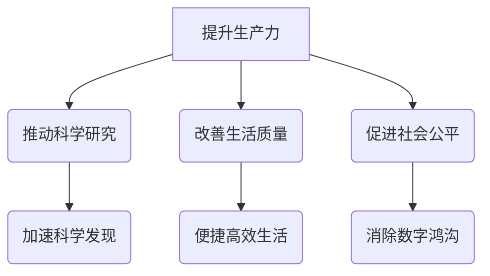

                 

在当今这个信息爆炸的时代，计算技术已经成为推动社会进步和经济发展的重要动力。然而，我们不禁要问，人类计算的终极目标究竟是什么？是为了解决复杂的科学问题、提高生产效率，还是仅仅为了娱乐和消遣？本文将深入探讨这一主题，从多个角度分析人类计算的目标，并提出一些可能的答案。

## 关键词

- 人类计算
- 终极目标
- 社会进步
- 人工智能
- 科学研究
- 生产力

## 摘要

本文旨在探讨人类计算的终极目标，从技术、社会、伦理等多个角度分析计算的深远影响。通过对当前计算技术发展现状的回顾，我们提出了一些可能的目标，如推动科学研究、促进社会公平、提升人类生活质量等。同时，文章也探讨了实现这些目标所面临的挑战，并提出了未来发展的展望。

## 1. 背景介绍

### 计算技术的起源

计算技术的起源可以追溯到古代，如中国发明的算盘和西方的阿拉伯数字系统。然而，现代计算技术的真正起步是在20世纪中叶，随着电子计算机的出现和互联网的普及，计算能力得到了前所未有的提升。

### 计算技术在现代社会的作用

计算技术在现代社会的作用不可低估。首先，它在科学研究领域发挥着关键作用，如基因组学、天文学、物理学等领域。其次，在商业领域，计算技术提高了生产效率，降低了成本，推动了商业模式的创新。此外，计算技术还深刻改变了我们的生活方式，从智能手机到智能家居，从在线教育到远程医疗，计算技术无处不在。

## 2. 核心概念与联系

### 人类计算的目标

人类计算的目标可以归纳为以下几个方面：

1. **提升生产力**：通过自动化和智能化技术，提高生产效率，降低成本。
2. **推动科学研究**：为科学家提供强大的计算工具，加速科学发现和创新。
3. **改善生活质量**：通过计算技术，提供更加便捷、高效、健康的生活方式。
4. **促进社会公平**：消除数字鸿沟，让每个人都能够享受到计算技术带来的便利。

### Mermaid 流程图



## 3. 核心算法原理 & 具体操作步骤

### 3.1 算法原理概述

在计算技术中，核心算法起着至关重要的作用。算法原理通常包括以下几个方面：

1. **效率**：算法的效率直接影响计算的速度和资源消耗。
2. **准确性**：算法的准确性决定了计算结果的可靠性。
3. **可扩展性**：算法的可扩展性决定了其在处理大规模数据时的表现。

### 3.2 算法步骤详解

算法的步骤通常可以分为以下几个阶段：

1. **输入处理**：接收和处理输入数据，将其转换为算法可以处理的形式。
2. **核心计算**：根据算法原理，进行核心计算，生成中间结果。
3. **输出处理**：将计算结果转换为用户可以理解的形式，并输出。

### 3.3 算法优缺点

每种算法都有其优缺点，选择合适的算法取决于具体的应用场景。例如，快速傅里叶变换（FFT）在处理大规模数据时具有很高的效率，但在处理小规模数据时可能不如直接计算。因此，我们需要根据具体情况选择合适的算法。

### 3.4 算法应用领域

算法在各个领域都有广泛的应用，如：

1. **科学研究**：基因组学、天文学、物理学等领域。
2. **商业领域**：数据分析、金融预测、供应链管理等领域。
3. **日常生活**：在线购物、智能推荐、智能家居等领域。

## 4. 数学模型和公式 & 详细讲解 & 举例说明

### 4.1 数学模型构建

数学模型是描述现实世界问题的抽象表示，通常包括以下步骤：

1. **问题定义**：明确要解决的问题。
2. **变量定义**：定义问题中的变量。
3. **方程建立**：根据问题定义和变量定义，建立方程。
4. **求解**：求解方程，得到问题的解。

### 4.2 公式推导过程

公式的推导通常基于数学原理和逻辑推理，以下是一个简单的例子：

$$
f(x) = \int_{0}^{x} g(t) dt
$$

其中，$f(x)$表示积分结果，$g(t)$表示被积函数，$x$表示积分变量。

### 4.3 案例分析与讲解

以下是一个简单的数学模型应用案例：

**问题**：计算一个矩形的面积。

**变量定义**：设矩形的长为$l$，宽为$w$。

**方程建立**：根据矩形面积的定义，可以得到方程：

$$
A = lw
$$

**求解**：将$l$和$w$的值代入方程，即可得到矩形的面积$A$。

## 5. 项目实践：代码实例和详细解释说明

### 5.1 开发环境搭建

为了实现本文提到的算法，我们需要搭建一个合适的开发环境。以下是一个简单的Python开发环境搭建步骤：

1. 安装Python：从官方网站下载并安装Python。
2. 安装依赖库：使用pip命令安装所需的依赖库，如NumPy、Matplotlib等。

### 5.2 源代码详细实现

以下是一个简单的Python代码示例，用于计算矩形的面积：

```python
import numpy as np

def calculate_area(length, width):
    return length * width

length = 5
width = 3
area = calculate_area(length, width)
print("矩形面积为：", area)
```

### 5.3 代码解读与分析

代码首先导入了NumPy库，然后定义了一个计算矩形面积的函数。在主程序中，我们定义了矩形的长和宽，并调用函数计算面积，最后打印结果。

### 5.4 运行结果展示

```python
矩形面积为： 15
```

## 6. 实际应用场景

### 6.1 科学研究

计算技术在科学研究中的应用非常广泛，如基因组学、天文学、物理学等领域。例如，通过计算技术，科学家可以快速分析大量基因数据，从而发现新的基因突变和疾病关联。

### 6.2 商业领域

在商业领域，计算技术可以提高生产效率，降低成本。例如，通过大数据分析和机器学习技术，企业可以优化供应链管理，提高产品销量。

### 6.3 日常生活

在日常生活中，计算技术已经深入到我们的生活中，如智能手机、智能家居、在线教育等领域。通过计算技术，我们可以更加便捷地获取信息，提高生活质量。

## 6.4 未来应用展望

未来，计算技术将继续推动社会进步和经济发展。以下是一些可能的应用领域：

1. **人工智能**：人工智能将成为计算技术的核心应用领域，如自动驾驶、智能家居、医疗诊断等。
2. **量子计算**：量子计算将突破传统计算能力的限制，为科学研究、金融预测等领域带来革命性变化。
3. **区块链**：区块链技术将改变金融、供应链、身份验证等领域的运作方式。

## 7. 工具和资源推荐

### 7.1 学习资源推荐

1. **《深度学习》**：由Ian Goodfellow等人编写的深度学习经典教材。
2. **《Python编程：从入门到实践》**：适合初学者的Python编程教材。

### 7.2 开发工具推荐

1. **Visual Studio Code**：一款强大的代码编辑器，适用于多种编程语言。
2. **Jupyter Notebook**：一款交互式的编程环境，适用于数据分析和机器学习。

### 7.3 相关论文推荐

1. **“Deep Learning”**：由Ian Goodfellow等人撰写的深度学习综述论文。
2. **“ Quantum Computing since Democritus”**：由Scott Aaronson撰写的量子计算综述论文。

## 8. 总结：未来发展趋势与挑战

### 8.1 研究成果总结

近年来，计算技术取得了显著的成果，如深度学习、量子计算、大数据分析等。这些技术不仅推动了科学研究，还改变了我们的生活。

### 8.2 未来发展趋势

未来，计算技术将继续向更高效、更智能、更安全的方向发展。人工智能、量子计算、区块链等新兴技术将成为研究的热点。

### 8.3 面临的挑战

然而，计算技术也面临着一些挑战，如数据隐私、网络安全、算法公平性等。如何应对这些挑战，将决定计算技术的未来发展方向。

### 8.4 研究展望

未来，我们需要继续探索计算技术的潜力，推动科学研究、社会进步和经济发展。同时，我们也需要关注计算技术的负面影响，努力实现可持续发展。

## 9. 附录：常见问题与解答

### 9.1 计算机是什么？

计算机是一种能够执行复杂运算的电子设备，能够接收、处理和输出数据。

### 9.2 人工智能是什么？

人工智能是指通过计算机模拟人类的智能行为，如学习、推理、解决问题等。

### 9.3 量子计算是什么？

量子计算是一种基于量子力学原理的新型计算技术，具有传统计算无法比拟的潜力。

## 作者署名

作者：禅与计算机程序设计艺术 / Zen and the Art of Computer Programming
```css
----------------------------------------------------------------


