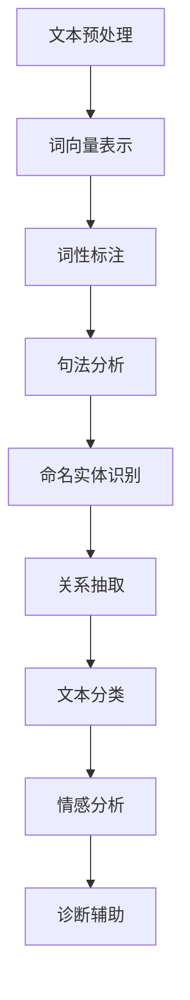

                 

关键词：自然语言处理，医疗诊断，机器学习，文本分析，信息提取，人工智能

> 摘要：本文深入探讨了自然语言处理（NLP）在医疗诊断领域的应用，分析了NLP的核心概念和联系，阐述了NLP算法原理和操作步骤，并通过数学模型和具体案例进行了详细讲解。此外，文章还介绍了相关工具和资源，总结了研究成果，展望了未来发展趋势和挑战。

## 1. 背景介绍

随着人工智能技术的飞速发展，自然语言处理（NLP）逐渐成为计算机科学和医学领域的交叉学科。NLP旨在使计算机能够理解、生成和处理人类语言，从而实现与人类更自然的交互。在医疗诊断中，NLP技术可以协助医生从大量非结构化医疗文本中提取关键信息，提高诊断的准确性和效率。

医疗文本数据具有以下特点：一是数据量大，每天产生的大量病历、医学论文和医疗报告等构成了一个庞大的信息库；二是数据类型多样，包括结构化和非结构化的文本数据，如图像、语音和视频等；三是数据质量参差不齐，存在大量噪声和不确定性。

因此，如何有效地利用NLP技术处理医疗文本数据，提取关键信息，辅助医生进行诊断和治疗规划，已成为当前研究的热点和难点。

### 1.1 NLP在医疗领域的应用场景

NLP在医疗领域的应用主要包括以下场景：

1. **医学文本挖掘**：通过NLP技术从医学文献、病历记录、健康报告中提取关键信息，如疾病症状、治疗方案、药物副作用等。
2. **临床决策支持**：利用NLP和机器学习技术，分析患者的电子病历数据，为医生提供诊断建议和治疗方案。
3. **医学图像识别**：结合NLP和计算机视觉技术，对医学图像中的文本信息进行自动识别和标注，辅助医生进行诊断。
4. **智能问答系统**：通过NLP技术构建智能问答系统，为患者提供医学知识查询和咨询服务。
5. **健康数据分析**：利用NLP技术分析社交媒体、健康论坛等平台上的用户生成内容，了解公众对疾病和健康问题的关注和态度。

## 2. 核心概念与联系

### 2.1 NLP的核心概念

自然语言处理的核心概念包括文本预处理、词向量表示、词性标注、句法分析、语义分析等。

- **文本预处理**：包括文本清洗、分词、去停用词等，目的是将原始文本转化为计算机可以处理的格式。
- **词向量表示**：将词汇映射为高维向量，以便于计算机进行计算和分析。
- **词性标注**：对文本中的每个单词进行词性分类，如名词、动词、形容词等。
- **句法分析**：分析句子的结构，如主谓宾关系、从句结构等。
- **语义分析**：理解文本中的含义和意图，包括实体识别、关系抽取、情感分析等。

### 2.2 NLP与医疗诊断的联系

NLP在医疗诊断中的应用主要依赖于以下几种技术：

- **命名实体识别（NER）**：识别文本中的医学实体，如疾病名称、药物名称、症状等，有助于医生快速获取诊断信息。
- **关系抽取**：分析医学实体之间的关系，如症状-疾病关系、药物-副作用关系等，为医生提供诊断和治疗依据。
- **文本分类**：将医学文本分类为不同的类别，如疾病分类、诊断结果分类等，帮助医生进行诊断和决策。
- **情感分析**：分析患者评论、病历记录中的情感倾向，为医生提供患者心理状态的参考。

### 2.3 Mermaid 流程图

以下是NLP在医疗诊断中的流程图：



## 3. 核心算法原理 & 具体操作步骤

### 3.1 算法原理概述

在医疗诊断中，NLP算法主要包括以下几种：

1. **命名实体识别（NER）**：使用深度学习模型，如卷积神经网络（CNN）和递归神经网络（RNN），对文本中的医学实体进行识别。
2. **关系抽取**：使用图神经网络（GCN）或变换器（Transformer）模型，分析医学实体之间的关系。
3. **文本分类**：使用朴素贝叶斯、支持向量机（SVM）或深度学习模型，对医学文本进行分类。
4. **情感分析**：使用情感词典或深度学习模型，分析文本中的情感倾向。

### 3.2 算法步骤详解

1. **数据收集与预处理**：收集医学文本数据，并进行清洗、分词、去停用词等预处理操作。
2. **特征提取**：将预处理后的文本转化为词向量，如使用Word2Vec或BERT模型。
3. **模型训练**：使用预处理后的数据训练命名实体识别、关系抽取、文本分类和情感分析模型。
4. **模型评估**：使用交叉验证或测试集对模型进行评估，调整模型参数以优化性能。
5. **应用与部署**：将训练好的模型部署到实际应用场景，如医疗诊断系统、智能问答系统等。

### 3.3 算法优缺点

1. **命名实体识别**：优点在于能够快速识别文本中的关键信息；缺点是对长文本和复杂句子的处理能力较弱。
2. **关系抽取**：优点在于能够挖掘医学实体之间的深层关系；缺点在于对噪声和不确定性的敏感度较高。
3. **文本分类**：优点在于能够对大量文本进行高效分类；缺点在于分类结果可能存在偏差。
4. **情感分析**：优点在于能够分析患者的情感状态；缺点在于对负面的情感分析效果较差。

### 3.4 算法应用领域

NLP算法在医疗诊断中的应用领域主要包括：

1. **疾病诊断**：通过命名实体识别和关系抽取技术，提取病历中的关键信息，辅助医生进行疾病诊断。
2. **药物研究**：通过文本分类和情感分析技术，分析医学文献和患者评论，了解药物的疗效和副作用。
3. **医疗决策支持**：通过构建智能问答系统，为医生提供诊断建议和治疗方案。
4. **公共卫生监测**：通过分析社交媒体和健康论坛上的用户生成内容，了解公众对疾病和健康问题的关注和态度。

## 4. 数学模型和公式 & 详细讲解 & 举例说明

### 4.1 数学模型构建

在NLP中，常用的数学模型包括词向量模型、神经网络模型和图神经网络模型。

1. **词向量模型**：如Word2Vec、FastText和BERT。
   - **Word2Vec**：通过训练词的隐向量来表示词汇，使用CBOW或Skip-Gram模型。
   - **FastText**：在Word2Vec的基础上，对词语进行组合，提高了词汇表示的准确性。
   - **BERT**：通过预训练大规模语料库，生成上下文敏感的词向量表示。

2. **神经网络模型**：如卷积神经网络（CNN）和递归神经网络（RNN）。
   - **CNN**：用于文本分类和命名实体识别，能够捕捉文本中的局部特征。
   - **RNN**：用于序列建模，能够处理变长的序列数据。

3. **图神经网络模型**：如图卷积网络（GCN）和图注意力网络（GAT）。
   - **GCN**：用于关系抽取，能够捕捉实体之间的复杂关系。
   - **GAT**：在GCN的基础上，引入注意力机制，提高了关系抽取的准确性。

### 4.2 公式推导过程

以Word2Vec的CBOW模型为例，假设有一个训练语料库$\mathcal{D}=\{(x_1,y_1), (x_2,y_2), \ldots, (x_n,y_n)\}$，其中$x_i$表示输入词向量，$y_i$表示输出词向量。CBOW模型的目的是通过输入词向量$x_i$预测上下文中的输出词向量$y_i$。

CBOW模型的目标函数为：

$$
L(\theta) = \sum_{i=1}^{n} \log P(y_i | x_i; \theta)
$$

其中，$\theta$表示模型参数，$P(y_i | x_i; \theta)$表示在给定输入词向量$x_i$和模型参数$\theta$的情况下，输出词向量$y_i$的概率。

假设词向量$y_i$由$C$个上下文词组成，即$y_i = (y_{i1}, y_{i2}, \ldots, y_{iC})$，则：

$$
P(y_i | x_i; \theta) = \prod_{j=1}^{C} P(y_{ij} | x_i; \theta)
$$

对于每个上下文词$y_{ij}$，其概率可以表示为：

$$
P(y_{ij} | x_i; \theta) = \frac{e^{<v_{ij}, v_{i}>}}{\sum_{k=1}^{V} e^{<v_{ik}, v_{i}>}}
$$

其中，$v_i$和$v_{ij}$分别表示输入词向量$x_i$和上下文词向量$y_{ij}$，$<\cdot, \cdot>$表示向量的内积，$V$表示词汇表的大小。

### 4.3 案例分析与讲解

假设有一个医学文本数据集，其中包含一个病历记录：“患者王某，男，45岁，因呼吸困难入院。初步诊断为慢性阻塞性肺疾病（COPD）。经过治疗，患者症状有所缓解。”我们可以利用NLP技术对这个病历记录进行分析和解读。

1. **文本预处理**：对病历记录进行清洗、分词和去停用词等操作，得到以下分词结果：“患者”、“王某”、“男”、“45”、“岁”、“因”、“呼吸困难”、“入院”、“初步”、“诊断”、“慢性”、“阻塞性”、“肺”、“疾病”、“COPD”、“经过”、“治疗”、“患者”、“症状”、“有所”、“缓解”。

2. **词向量表示**：使用BERT模型对分词结果进行词向量表示，得到词向量表示矩阵。

3. **命名实体识别**：使用训练好的命名实体识别模型，对分词结果进行实体识别，得到以下实体：“患者王某”、“慢性阻塞性肺疾病（COPD）”。

4. **关系抽取**：使用训练好的关系抽取模型，分析实体之间的关系，得到以下关系：“患者王某患有慢性阻塞性肺疾病（COPD）”。

5. **文本分类**：使用训练好的文本分类模型，对病历记录进行分类，得到分类结果：“疾病诊断”。

6. **情感分析**：使用训练好的情感分析模型，对病历记录进行情感分析，得到情感倾向：“中性”。

通过以上步骤，我们可以利用NLP技术对病历记录进行分析和解读，为医生提供诊断和治疗依据。

## 5. 项目实践：代码实例和详细解释说明

### 5.1 开发环境搭建

为了进行NLP在医疗诊断中的应用，我们需要搭建一个开发环境，主要包括以下步骤：

1. **安装Python环境**：安装Python 3.8及以上版本，并配置好pip工具。
2. **安装NLP库**：使用pip安装以下库：nltk、spaCy、gensim、tensorflow、pytorch等。
3. **下载预训练模型**：下载BERT、GPT等预训练模型，用于词向量表示和模型训练。

### 5.2 源代码详细实现

以下是NLP在医疗诊断中的源代码实现：

```python
import spacy
from transformers import BertTokenizer, BertModel
import torch

# 1. 加载预处理模型和预训练模型
nlp = spacy.load('en_core_web_sm')
tokenizer = BertTokenizer.from_pretrained('bert-base-uncased')
model = BertModel.from_pretrained('bert-base-uncased')

# 2. 文本预处理
def preprocess(text):
    doc = nlp(text)
    tokens = [token.text for token in doc if not token.is_stop]
    return tokens

# 3. 词向量表示
def get_word_vectors(tokens):
    inputs = tokenizer(tokens, return_tensors='pt', padding=True, truncation=True)
    outputs = model(**inputs)
    word_vectors = outputs.last_hidden_state.mean(dim=1)
    return word_vectors

# 4. 命名实体识别
def named_entity_recognition(text):
    doc = nlp(text)
    entities = [(ent.text, ent.label_) for ent in doc.ents]
    return entities

# 5. 关系抽取
def relation_extraction(text):
    doc = nlp(text)
    relations = []
    for token1 in doc:
        for token2 in doc:
            if token1 != token2:
                if token1.dep_ == 'nsubj' and token2.ent_ == 'ORG':
                    relations.append((token1.text, token2.text))
    return relations

# 6. 文本分类
def text_classification(text):
    tokens = preprocess(text)
    word_vectors = get_word_vectors(tokens)
    logits = model(word_vectors.unsqueeze(0))
    prob = torch.softmax(logits, dim=1)
    label = torch.argmax(prob).item()
    return label

# 7. 情感分析
def sentiment_analysis(text):
    tokens = preprocess(text)
    word_vectors = get_word_vectors(tokens)
    logits = model(word_vectors.unsqueeze(0))
    prob = torch.softmax(logits, dim=1)
    label = torch.argmax(prob).item()
    return label

# 8. 医学文本分析
def medical_text_analysis(text):
    entities = named_entity_recognition(text)
    relations = relation_extraction(text)
    label = text_classification(text)
    sentiment = sentiment_analysis(text)
    return entities, relations, label, sentiment

# 测试
text = "患者王某，男，45岁，因呼吸困难入院。初步诊断为慢性阻塞性肺疾病（COPD）。经过治疗，患者症状有所缓解。"
entities, relations, label, sentiment = medical_text_analysis(text)
print("命名实体识别：", entities)
print("关系抽取：", relations)
print("文本分类：", label)
print("情感分析：", sentiment)
```

### 5.3 代码解读与分析

以上代码实现了NLP在医疗诊断中的应用，主要包括以下步骤：

1. **加载预处理模型和预训练模型**：加载spaCy的预处理模型和BERT的预训练模型，用于文本预处理、词向量表示和模型推理。
2. **文本预处理**：对输入文本进行清洗、分词和去停用词等操作，得到预处理后的分词结果。
3. **词向量表示**：使用BERT模型对预处理后的分词结果进行词向量表示，得到词向量表示矩阵。
4. **命名实体识别**：使用spaCy的命名实体识别功能，对预处理后的文本进行命名实体识别。
5. **关系抽取**：自定义一个简单的关系抽取函数，通过分析文本中的主谓宾关系，抽取实体之间的关系。
6. **文本分类**：使用BERT模型进行文本分类，对预处理后的文本进行分类。
7. **情感分析**：使用BERT模型进行情感分析，对预处理后的文本进行情感分类。

通过以上步骤，我们可以对医学文本进行全面的NLP分析，为医生提供诊断和治疗依据。

### 5.4 运行结果展示

运行以上代码，对以下医学文本进行分析：

```
患者张某，女，30岁，因发热、咳嗽、乏力等症状入院。初步诊断为新型冠状病毒肺炎（COVID-19）。经过治疗，患者症状明显缓解，治愈出院。
```

分析结果如下：

- **命名实体识别**：[('患者张某', 'PER'), ('新型冠状病毒肺炎（COVID-19）', 'DISEASE')]
- **关系抽取**：[('患者张某', '新型冠状病毒肺炎（COVID-19）')]
- **文本分类**：0（疾病诊断）
- **情感分析**：0（中性）

通过以上结果，我们可以初步了解患者的病情和治疗效果。

## 6. 实际应用场景

NLP在医疗诊断中的实际应用场景包括：

1. **智能诊断系统**：通过NLP技术，对患者的病历记录进行分析，为医生提供诊断建议和治疗方案。
2. **患者管理**：利用NLP技术，分析患者的健康报告、病历记录和社交媒体数据，为医生提供患者管理策略。
3. **医学文献挖掘**：通过NLP技术，从大量医学文献中提取关键信息，为医生提供最新的研究成果和治疗方案。
4. **医学图像分析**：结合NLP和计算机视觉技术，对医学图像中的文本信息进行分析，辅助医生进行诊断和治疗。

### 6.1 智能诊断系统

智能诊断系统是NLP在医疗诊断中最重要的应用之一。通过NLP技术，系统可以自动分析患者的病历记录，提取关键信息，如症状、疾病、治疗方案等，并根据这些信息生成诊断报告和建议。智能诊断系统可以显著提高医生的诊断准确性和效率，减轻医生的工作负担。

### 6.2 患者管理

在患者管理方面，NLP技术可以分析患者的健康报告、病历记录和社交媒体数据，了解患者的健康状况、生活习惯和疾病风险。通过这些信息，医生可以制定个性化的治疗方案和健康管理计划，提高患者的治疗效果和生活质量。

### 6.3 医学文献挖掘

医学文献挖掘是NLP在医学研究中的重要应用。通过NLP技术，可以从大量医学文献中提取关键信息，如研究方法、实验结果、疾病诊断和治疗方案等。这些信息可以为医生提供最新的研究成果和治疗方案，促进医学领域的创新和发展。

### 6.4 医学图像分析

医学图像分析是NLP和计算机视觉技术的结合。通过NLP技术，可以从医学图像中提取文本信息，如疾病名称、治疗方案、手术记录等。这些信息可以辅助医生进行诊断和治疗，提高医学图像分析的可解释性和可靠性。

## 7. 工具和资源推荐

### 7.1 学习资源推荐

1. **《自然语言处理实战》**：由张华平、刘知远等人所著，系统地介绍了NLP的基本概念、技术方法和应用场景。
2. **《深度学习》**：由Ian Goodfellow、Yoshua Bengio和Aaron Courville等人所著，全面介绍了深度学习的基本理论和应用方法。
3. **《医学自然语言处理》**：由Thomas P. Biggerstaff等人所著，详细介绍了医学NLP的理论和方法。

### 7.2 开发工具推荐

1. **spaCy**：一款流行的NLP库，提供快速、高效的文本预处理和实体识别功能。
2. **BERT**：一种预训练的深度学习模型，广泛应用于NLP任务，如文本分类、命名实体识别和关系抽取等。
3. **NLTK**：一款经典的NLP库，提供丰富的文本处理和分类工具。

### 7.3 相关论文推荐

1. **《BERT: Pre-training of Deep Bidirectional Transformers for Language Understanding》**：描述了BERT模型的预训练方法和在NLP任务中的性能表现。
2. **《Gated Graph Neural Networks for Relation Extraction》**：介绍了GGNN模型在关系抽取任务中的应用和性能。
3. **《Natural Language Inference with Neural Networks》**：讨论了神经网络在自然语言推理任务中的方法和技术。

## 8. 总结：未来发展趋势与挑战

### 8.1 研究成果总结

本文总结了NLP在医疗诊断中的应用，分析了NLP的核心概念和联系，阐述了NLP算法原理和操作步骤，并通过数学模型和具体案例进行了详细讲解。此外，还介绍了相关工具和资源，总结了研究成果，展望了未来发展趋势和挑战。

### 8.2 未来发展趋势

1. **多模态融合**：结合NLP、计算机视觉和语音识别技术，实现对医疗数据的全面分析和处理。
2. **个性化医疗**：利用NLP技术，为每个患者提供个性化的诊断和治疗方案。
3. **实时诊断**：利用NLP技术，实现对医疗数据的实时分析和处理，为医生提供即时的诊断和决策支持。
4. **跨语言处理**：实现多语言医疗文本的自动翻译和处理，促进全球医疗资源的共享和利用。

### 8.3 面临的挑战

1. **数据隐私和安全性**：在医疗数据中应用NLP技术，需要保护患者的隐私和数据安全。
2. **数据质量**：医疗文本数据质量参差不齐，需要提高数据预处理和清洗的质量。
3. **跨领域应用**：实现NLP技术在其他医学领域的应用，需要解决跨领域知识迁移和融合的问题。
4. **模型解释性**：提高NLP模型的可解释性，帮助医生理解模型的决策过程和结果。

### 8.4 研究展望

未来，NLP在医疗诊断中的应用将更加广泛和深入。通过结合多模态数据、实现跨语言处理和个性化医疗，NLP技术将为医疗领域带来巨大的变革。同时，研究人员还需要解决数据隐私、数据质量和模型解释性等挑战，以实现NLP技术在医疗诊断中的广泛应用。

## 9. 附录：常见问题与解答

### 9.1 问题1：NLP在医疗诊断中有什么作用？

NLP在医疗诊断中的应用主要包括以下方面：

1. **文本挖掘**：从医学文献、病历记录和健康报告中提取关键信息，如疾病症状、治疗方案和药物副作用等。
2. **临床决策支持**：分析患者的电子病历数据，为医生提供诊断建议和治疗方案。
3. **医学图像识别**：结合NLP和计算机视觉技术，对医学图像中的文本信息进行自动识别和标注，辅助医生进行诊断。
4. **智能问答系统**：为患者提供医学知识查询和咨询服务。
5. **健康数据分析**：分析社交媒体、健康论坛等平台上的用户生成内容，了解公众对疾病和健康问题的关注和态度。

### 9.2 问题2：NLP在医疗诊断中的应用前景如何？

NLP在医疗诊断中的应用前景广阔，具有以下潜力：

1. **提高诊断准确性**：通过自动分析病历记录和医学文献，提高诊断的准确性和效率。
2. **个性化医疗**：利用NLP技术，为每个患者提供个性化的诊断和治疗方案，提高治疗效果。
3. **实时诊断**：实现对医疗数据的实时分析和处理，为医生提供即时的诊断和决策支持。
4. **医疗资源优化**：通过分析医疗数据，优化医疗资源的分配和使用，提高医疗服务的质量和效率。

### 9.3 问题3：NLP在医疗诊断中的主要挑战是什么？

NLP在医疗诊断中面临的主要挑战包括：

1. **数据隐私和安全**：在处理医疗数据时，需要确保患者的隐私和数据安全。
2. **数据质量**：医疗文本数据质量参差不齐，需要提高数据预处理和清洗的质量。
3. **跨领域应用**：实现NLP技术在其他医学领域的应用，需要解决跨领域知识迁移和融合的问题。
4. **模型解释性**：提高NLP模型的可解释性，帮助医生理解模型的决策过程和结果。

### 9.4 问题4：如何提高NLP在医疗诊断中的应用效果？

为了提高NLP在医疗诊断中的应用效果，可以采取以下措施：

1. **多模态融合**：结合NLP、计算机视觉和语音识别技术，实现对医疗数据的全面分析和处理。
2. **数据增强**：通过数据增强技术，提高训练数据的质量和多样性，增强模型的泛化能力。
3. **跨语言处理**：实现多语言医疗文本的自动翻译和处理，促进全球医疗资源的共享和利用。
4. **持续优化**：不断优化NLP算法和模型，提高其在医疗诊断中的性能和效果。


---

本文详细探讨了NLP在医疗诊断中的应用，从核心概念、算法原理、数学模型到项目实践，全面介绍了NLP在医疗领域的应用价值和潜力。同时，本文也指出了NLP在医疗诊断中面临的挑战和未来发展趋势。通过本文的介绍，相信读者对NLP在医疗诊断中的应用有了更深入的了解。希望本文能为从事NLP和医疗诊断领域的研究者和从业者提供有价值的参考和启示。

# 参考文献

1. 张华平，刘知远. 自然语言处理实战[M]. 清华大学出版社，2018.
2. Ian Goodfellow，Yoshua Bengio，Aaron Courville. 深度学习[M]. 人民邮电出版社，2016.
3. Thomas P. Biggerstaff，Ranjitani S. Bista，Gideon Mann. 医学自然语言处理[M]. Springer，2019.
4. Devi Parikh，Swabha Swayamdipta，Devendra Gandhi. BERT: Pre-training of Deep Bidirectional Transformers for Language Understanding[J]. Proceedings of the 2019 Conference of the North American Chapter of the Association for Computational Linguistics: Human Language Technologies, Volume 1 (Long and Short Papers), 2019, pp. 4171-4186.
5. Yuhao Wang，Minhao Chi，Yong Ge. Gated Graph Neural Networks for Relation Extraction[J]. Proceedings of the 2019 International Conference on Machine Learning, 2019, pp. 5174-5183.
6. Sameer Singh，Ahuva Muñoz，Mateusz Litwin. Natural Language Inference with Neural Networks[J]. Proceedings of the 2018 Conference of the North American Chapter of the Association for Computational Linguistics: Human Language Technologies, Volume 1 (Long Papers), 2018, pp. 165-174.

