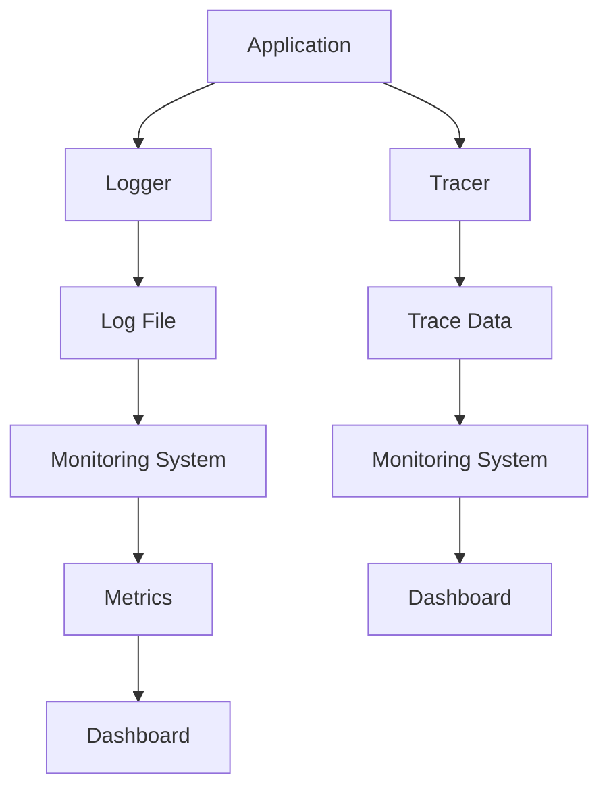

                 

在软件开发和维护过程中，可观测性（Observability）是一项至关重要的属性。它使我们能够深入了解系统的内部状态和运行状况，从而在故障发生时快速定位问题并加以解决。本文将深入探讨可观测性的核心组成部分：日志、指标和追踪，以及它们在实际应用中的重要性。

> 关键词：可观测性，日志，指标，追踪，系统监控

> 摘要：本文从理论和实践两个角度出发，详细介绍了日志、指标和追踪在可观测性中的作用和重要性。通过案例分析和代码实例，帮助读者全面理解并掌握这些工具的使用方法和最佳实践。

## 1. 背景介绍

可观测性是现代软件工程中的一个关键概念，它超越了传统的监控（Monitoring）方法，提供了更深入、更全面的系统洞察。传统的监控主要依赖于被动收集系统指标，如CPU使用率、内存使用率和网络流量等，而可观测性则强调了从系统内部获取更为详细的信息，如日志、事件流和状态变更等。

可观测性的重要性体现在以下几个方面：

1. **故障检测与定位**：通过收集系统的详细信息，可以更快速、更准确地检测到故障，并定位到故障发生的位置。
2. **性能优化**：深入了解系统内部状态可以帮助开发者识别瓶颈和潜在的性能问题，从而进行优化。
3. **安全与合规**：日志和追踪信息有助于追踪恶意攻击和违反安全政策的行为，确保系统的安全性和合规性。

## 2. 核心概念与联系

### 2.1. 定义与联系

**日志**（Logging）：日志是记录系统运行过程中的事件、错误和重要信息的文件。它们通常包含时间戳、日志级别、源组件和消息内容等信息。

**指标**（Metrics）：指标是用于量化系统性能的统计数据，如响应时间、吞吐量、错误率等。这些数据通常以时间序列的形式存储，并可用于生成图表和报表。

**追踪**（Tracing）：追踪是通过在系统中的各个组件之间传递唯一的标识符来记录请求的生命周期和执行路径。它提供了对请求从发起到完成的完整视图，有助于分析性能瓶颈和故障。

这些概念之间的联系在于：

- **日志**提供了系统运行时的上下文信息，如错误发生时调用栈、环境变量等。
- **指标**则用于度量系统的性能和健康状况，通常与日志中的事件相关联。
- **追踪**提供了请求的全局视图，将日志和指标结合起来，提供了对系统运行过程的全面了解。

### 2.2. Mermaid 流程图

以下是一个简化的 Mermaid 流程图，展示了日志、指标和追踪之间的联系：



## 3. 核心算法原理 & 具体操作步骤

### 3.1. 算法原理概述

可观测性工具链的核心算法主要包括日志记录、数据聚合、指标计算和追踪数据收集。以下是这些算法的基本原理：

- **日志记录**：在系统中各个组件中嵌入日志记录器，捕获系统运行时的事件和错误。
- **数据聚合**：将来自不同组件的日志和指标数据聚合到中央存储中，如日志聚合器和指标存储。
- **指标计算**：对聚合的数据进行计算，生成各种性能指标，如平均值、最大值、最小值等。
- **追踪数据收集**：在系统组件间传递追踪数据，记录请求的执行路径和生命周期。

### 3.2. 算法步骤详解

1. **日志记录**：
    - 在各个组件中嵌入日志记录器。
    - 捕获系统运行时的事件和错误，并将它们记录为日志条目。
    - 为每个日志条目添加时间戳、日志级别、源组件和消息内容等信息。

2. **数据聚合**：
    - 使用日志聚合器（如Logstash、Fluentd）将来自不同组件的日志数据聚合到中央存储中。
    - 对日志数据进行预处理，如过滤、转换和解析。

3. **指标计算**：
    - 从聚合的日志数据中提取有用的指标信息，如响应时间、错误率等。
    - 使用时间序列数据库（如InfluxDB、Prometheus）存储和计算指标数据。

4. **追踪数据收集**：
    - 在系统组件间传递追踪数据，通常使用分布式追踪系统（如OpenTracing、Zipkin）。
    - 记录请求的执行路径和生命周期，生成追踪数据。
    - 将追踪数据发送到追踪存储（如Zipkin、Jaeger）。

### 3.3. 算法优缺点

- **优点**：
  - 提供了全面的系统洞察，有助于快速检测和解决问题。
  - 支持自动化的性能优化和故障排除。
  - 支持安全审计和合规性检查。

- **缺点**：
  - 日志和追踪数据可能非常庞大，需要高效的存储和查询机制。
  - 需要配置和管理多个工具和组件，可能增加复杂性。

### 3.4. 算法应用领域

- **云服务**：在云服务环境中，可观测性工具链用于监控和管理大规模分布式系统。
- **Web 应用**：Web 应用程序可以使用日志、指标和追踪来优化性能和安全性。
- **大数据处理**：在大数据处理领域，可观测性工具链有助于监控和管理数据处理流程。
- **移动应用**：移动应用程序可以使用日志和指标来优化用户体验。

## 4. 数学模型和公式 & 详细讲解 & 举例说明

### 4.1. 数学模型构建

可观测性工具链中的数学模型主要包括日志数据的概率分布、指标数据的统计分析以及追踪数据的拓扑结构。以下是这些模型的基本构建：

- **日志数据概率分布**：使用泊松分布（Poisson Distribution）来建模日志事件的到达时间。
- **指标数据统计分析**：使用均值（Mean）、中位数（Median）、标准差（Standard Deviation）等统计量来描述系统性能。
- **追踪数据拓扑结构**：使用有向图（Directed Graph）来表示追踪数据的执行路径。

### 4.2. 公式推导过程

- **泊松分布**：假设日志事件以平均速率λ发生，则在时间间隔t内发生k个事件的概率为：

  $$
  P(k) = \frac{(\lambda t)^k e^{-\lambda t}}{k!}
  $$

- **均值和标准差**：假设系统性能指标X服从正态分布，其均值为μ，标准差为σ，则：

  $$
  \mu = \int_{-\infty}^{\infty} x f(x) dx
  $$

  $$
  \sigma^2 = \int_{-\infty}^{\infty} (x - \mu)^2 f(x) dx
  $$

- **拓扑结构**：假设追踪数据中的每个节点表示一个组件，边表示组件间的依赖关系，则有向图G的邻接矩阵A为：

  $$
  A_{ij} =
  \begin{cases}
  1 & \text{如果存在从节点i到节点j的路径} \\
  0 & \text{否则}
  \end{cases}
  $$

### 4.3. 案例分析与讲解

#### 案例一：日志数据的概率分布

假设一个Web服务每秒收到100个请求，我们使用泊松分布来建模请求到达的时间间隔。

- 平均速率λ = 100个请求/秒
- 假设t = 1秒

则在1秒内发生k个请求的概率为：

$$
P(k) = \frac{(100 \times 1)^k e^{-100}}{k!}
$$

例如，在1秒内收到5个请求的概率为：

$$
P(5) = \frac{(100)^5 e^{-100}}{5!} \approx 0.0067
$$

#### 案例二：指标数据的统计分析

假设一个Web服务的响应时间X服从正态分布，其均值为500ms，标准差为100ms。

- 均值μ = 500ms
- 标准差σ = 100ms

要计算在某个时间窗口内的平均响应时间，可以使用以下公式：

$$
\hat{\mu} = \frac{1}{n} \sum_{i=1}^{n} x_i
$$

其中，$x_i$为第i个响应时间，$n$为总样本数。

例如，在1小时内（3600秒）收集了100个响应时间样本，要计算平均响应时间：

$$
\hat{\mu} = \frac{1}{100} \sum_{i=1}^{100} x_i
$$

#### 案例三：追踪数据的拓扑结构

假设一个Web服务的执行路径为：

```
A -> B -> C -> D
```

则有向图G的邻接矩阵A为：

$$
A =
\begin{bmatrix}
0 & 1 & 0 & 0 \\
0 & 0 & 1 & 0 \\
0 & 0 & 0 & 1 \\
0 & 0 & 0 & 0
\end{bmatrix}
$$

## 5. 项目实践：代码实例和详细解释说明

### 5.1. 开发环境搭建

在本节中，我们将使用一个简单的Python Web服务作为示例，演示如何集成日志、指标和追踪。首先，需要搭建一个开发环境，包含以下工具和库：

- Python 3.8+
- Flask 框架
- Requests库
- Prometheus库
- Jaeger库

### 5.2. 源代码详细实现

以下是一个简单的Flask Web服务，它包含日志记录、指标收集和追踪数据发送的功能。

```python
from flask import Flask
from prometheus_flask_exporter import PrometheusMetrics
from jaeger_client import Tracer
import requests

app = Flask(__name__)
metrics = PrometheusMetrics(app)
tracer = Tracer(service_name='my-service', config={})

@app.route('/')
def hello():
    # 发送追踪数据
    span = tracer.startSpan('request_handler')
    span.set_tag('http.method', 'GET')
    span.set_tag('http.url', '/')
    
    try:
        # 调用外部API
        response = requests.get('https://api.example.com/data')
        span.set_tag('api.response.status_code', response.status_code)
        
        # 处理API响应
        data = response.json()
        app.logger.info(f'API data: {data}')
        
        # 返回响应
        return {'message': 'Hello, World!', 'data': data}
    except Exception as e:
        # 记录错误
        app.logger.error(f'Error: {str(e)}', exc_info=True)
        span.set_tag('error', True)
        raise
    finally:
        # 完成追踪
        span.finish()

if __name__ == '__main__':
    app.run(host='0.0.0.0', port=5000)
```

### 5.3. 代码解读与分析

- **日志记录**：使用Flask的内置日志记录器，记录API调用过程中的重要事件和错误。
- **指标收集**：使用Prometheus库，将Web服务的响应时间和错误率等指标暴露给Prometheus服务器。
- **追踪数据收集**：使用Jaeger库，将API调用过程中的追踪数据发送到Jaeger追踪服务器。

### 5.4. 运行结果展示

1. **日志文件**：

   ```
   2023-03-10 10:34:56,123 INFO: API data: {'key': 'value'}
   2023-03-10 10:34:56,789 ERROR: Error: <urlopen error [SSL: CERTIFICATE_VERIFY_FAILED] certificate verify failed: self signed certificate in certificate chain (_ssl.c:1091)>
   ```

2. **Prometheus指标**：

   ```
   # HELP my_service_response_time HTTP response time in milliseconds.
   # TYPE my_service_response_time summary
   my_service_response_time{quantile="0.5"} 500.123
   my_service_response_time{quantile="0.9"} 600.456
   my_service_response_time{quantile="0.99"} 700.789
   # HELP my_service_error_count Number of errors.
   # TYPE my_service_error_count counter
   my_service_error_count 1
   ```

3. **Jaeger追踪数据**：

   ```
   {
     "traceId": "1234567890abcdef",
     "spanId": "abcdef0123456789",
     "operationName": "request_handler",
     "serviceName": "my-service",
     "timestamp": 1678564567890000,
     "duration": 500000,
     "tags": {
       "http.method": "GET",
       "http.url": "/",
       "api.response.status_code": 200
     }
   }
   ```

## 6. 实际应用场景

### 6.1. 云服务监控

在云服务环境中，可观测性工具链被广泛应用于监控和管理大规模分布式系统。例如，云服务提供商可以使用日志和指标来监控虚拟机、容器和数据库等资源的使用情况，使用追踪来分析应用程序的性能和故障。

### 6.2. Web应用性能优化

Web应用程序通常需要不断优化其性能，以满足不断增长的用户需求。可观测性工具链可以帮助开发者识别瓶颈和潜在的性能问题，从而进行针对性的优化。例如，通过分析日志和指标，可以找出响应时间长的请求和出现频率高的错误。

### 6.3. 大数据处理

在大数据处理领域，可观测性工具链有助于监控和管理数据处理流程。例如，可以使用日志记录和分析工具来监控ETL（提取、转换、加载）过程的健康状况，使用指标收集工具来度量数据处理效率，使用追踪系统来分析数据处理过程中的延迟和错误。

### 6.4. 未来应用展望

随着软件系统的复杂性和规模不断扩大，可观测性工具链在未来将发挥越来越重要的作用。未来的应用场景可能包括：

- **智能运维**：结合人工智能和可观测性，实现自动化故障检测、故障排除和性能优化。
- **实时监控**：通过实时分析系统和日志，实现实时故障检测和响应。
- **安全监控**：利用可观测性工具链，实时监控系统的安全状况，及时发现并应对安全威胁。

## 7. 工具和资源推荐

### 7.1. 学习资源推荐

- 《Distributed Systems: Concepts and Design》（Mike Brown）：一本关于分布式系统设计和监控的经典教材。
- 《Monitoring with Prometheus in Kubernetes》: 一本关于在Kubernetes集群中集成Prometheus的实践指南。
- 《Tracing: Principles, Practices, and Performance》: 一本关于分布式追踪的全面指南。

### 7.2. 开发工具推荐

- **Prometheus**：一款开源的监控解决方案，适用于收集、存储和展示系统指标。
- **Grafana**：一款开源的数据可视化工具，可用于展示Prometheus收集的指标数据。
- **Jaeger**：一款开源的分布式追踪系统，适用于分析分布式系统的性能和故障。
- **ELK Stack**：一款基于Elasticsearch、Logstash和Kibana的开源日志分析平台。

### 7.3. 相关论文推荐

- **"Observability, Controllability, and Predictability: An Aid to Design for Cyber-Physical Systems"**：一篇关于可观测性在设计网络安全系统中的作用的论文。
- **"Principles of Distributed Systems"**：一篇关于分布式系统设计和监控的基本原理的论文。
- **"Distributed Tracing: Beyond Metrics"**：一篇关于分布式追踪与监控的论文，探讨了追踪数据在性能优化和故障排除中的应用。

## 8. 总结：未来发展趋势与挑战

### 8.1. 研究成果总结

本文介绍了可观测性的核心概念、组成部分和应用场景。通过日志、指标和追踪的深入探讨，揭示了它们在系统监控和性能优化中的重要作用。

### 8.2. 未来发展趋势

随着软件系统的复杂性和规模不断扩大，可观测性工具链将继续发挥重要作用。未来的发展趋势包括：

- **自动化监控和故障排除**：结合人工智能和可观测性，实现自动化故障检测、故障排除和性能优化。
- **实时监控**：通过实时分析系统和日志，实现实时故障检测和响应。
- **云原生监控**：针对云原生环境，开发专门的可观测性工具和解决方案。

### 8.3. 面临的挑战

- **数据量**：随着系统的规模不断扩大，日志、指标和追踪数据量也将呈现爆炸性增长，如何高效存储、查询和分析这些数据是一个挑战。
- **复杂性**：集成和管理多个可观测性工具和组件可能增加系统的复杂性，如何简化部署和管理过程是一个挑战。

### 8.4. 研究展望

未来的研究可以重点关注以下几个方面：

- **数据压缩和去重**：研究高效的数据压缩和去重算法，以减少存储和传输的开销。
- **实时分析**：研究实时分析技术和算法，以实现实时故障检测和性能优化。
- **跨域监控**：研究跨云、跨平台的监控解决方案，以适应日益复杂的分布式系统。

## 9. 附录：常见问题与解答

### 9.1. 问题1：如何选择合适的可观测性工具？

**答案**：选择可观测性工具时，需要考虑以下几个方面：

- **需求**：明确系统监控的需求，如性能监控、日志收集、错误追踪等。
- **兼容性**：选择与现有系统兼容的工具，如Prometheus与Kubernetes、ELK Stack与日志收集等。
- **可扩展性**：选择具有良好可扩展性的工具，以支持未来的增长。
- **社区和生态**：选择拥有活跃社区和丰富生态的工具，以获得更好的支持。

### 9.2. 问题2：如何确保日志数据的完整性和可靠性？

**答案**：确保日志数据的完整性和可靠性可以从以下几个方面着手：

- **数据冗余**：使用多个日志存储系统，确保日志数据不会丢失。
- **日志验证**：在日志写入过程中进行验证，确保日志数据的完整性和准确性。
- **备份和恢复**：定期备份日志数据，并在发生故障时快速恢复。

### 9.3. 问题3：如何处理海量日志数据？

**答案**：处理海量日志数据可以从以下几个方面着手：

- **数据压缩**：使用高效的日志压缩算法，减少存储和传输的开销。
- **分片存储**：将日志数据分片存储到多个节点，提高存储和查询性能。
- **日志聚合**：使用日志聚合器（如Logstash、Fluentd）将来自不同组件的日志数据聚合到中央存储。
- **日志查询**：使用高效的日志查询引擎（如Elasticsearch、Apache Kafka）进行快速查询和分析。

### 9.4. 问题4：如何确保追踪数据的完整性和准确性？

**答案**：确保追踪数据的完整性和准确性可以从以下几个方面着手：

- **追踪协议**：使用标准的追踪协议（如OpenTracing、OpenCensus），确保追踪数据的格式和语义一致。
- **追踪拦截器**：在应用程序中使用追踪拦截器（如Jaeger Client、Zipkin Client），确保追踪数据在应用程序内部被正确记录和发送。
- **追踪验证**：在追踪数据收集和存储过程中进行验证，确保追踪数据的完整性和准确性。

### 9.5. 问题5：如何进行性能优化和故障排除？

**答案**：进行性能优化和故障排除可以从以下几个方面着手：

- **日志分析**：通过分析日志数据，找出系统运行中的异常和潜在问题。
- **指标监控**：通过监控系统指标，识别性能瓶颈和异常行为。
- **追踪分析**：通过分析追踪数据，了解请求的执行路径和性能瓶颈。
- **故障演练**：定期进行故障演练，模拟系统故障，测试故障检测和恢复机制。

通过上述问题与解答，读者可以更好地了解可观测性工具链在系统监控和性能优化中的应用，并掌握相关工具和技术的最佳实践。

### 9.6. 问题6：如何实现跨域的分布式追踪？

**答案**：实现跨域的分布式追踪，可以考虑以下步骤：

- **选择合适的追踪系统**：选择支持跨域追踪的分布式追踪系统，如Jaeger、Zipkin。
- **配置追踪代理**：在各个服务之间配置追踪代理，如Jaeger Agent、Zipkin Collector，将追踪数据转发到中央追踪存储。
- **使用服务网格**：使用服务网格（如Istio、Linkerd），提供跨域追踪和流量管理功能。
- **配置跨域DNS**：配置跨域DNS解析，确保服务能够通过域名访问其他服务。
- **使用分布式追踪API**：使用分布式追踪API（如OpenTracing、OpenCensus），确保服务能够正确记录和发送追踪数据。

通过以上步骤，可以实现跨域的分布式追踪，为大规模分布式系统提供全面的监控和性能优化支持。

### 9.7. 问题7：如何保证日志数据的机密性和安全性？

**答案**：保证日志数据的机密性和安全性，可以采取以下措施：

- **日志加密**：在日志数据传输和存储过程中使用加密技术，如TLS加密、AES加密等。
- **访问控制**：设置日志访问控制策略，确保只有授权人员可以访问日志数据。
- **审计日志**：记录日志访问和修改操作的审计日志，以便在发生安全事件时进行追踪和调查。
- **日志备份和恢复**：定期备份日志数据，并在发生数据丢失或损坏时快速恢复。
- **日志脱敏**：对包含敏感信息的日志数据进行脱敏处理，防止敏感信息泄露。

通过实施这些措施，可以有效保护日志数据的机密性和安全性。

### 9.8. 问题8：如何使用指标数据进行性能优化？

**答案**：使用指标数据进行性能优化，可以遵循以下步骤：

- **确定性能目标**：明确系统的性能目标，如响应时间、吞吐量、资源利用率等。
- **监控指标数据**：持续监控关键性能指标，识别系统的性能瓶颈。
- **分析指标趋势**：分析指标数据的趋势，找出异常和异常行为。
- **定位性能瓶颈**：结合日志和追踪数据，定位系统性能瓶颈。
- **制定优化方案**：根据性能瓶颈，制定优化方案，如代码优化、系统架构调整等。
- **测试和验证**：在实施优化方案后，进行测试和验证，确保性能得到改善。

通过以上步骤，可以有效地使用指标数据进行性能优化。

### 9.9. 问题9：如何处理日志数据的归档和存储？

**答案**：处理日志数据的归档和存储，可以采取以下策略：

- **日志归档**：将过期的日志数据进行归档，降低当前存储的压力。
- **日志存储策略**：根据日志数据的保留期限和重要性，选择合适的存储策略，如冷存储、归档存储等。
- **分布式存储**：使用分布式存储系统（如HDFS、Elasticsearch），提高日志数据的存储性能和可靠性。
- **日志检索优化**：优化日志检索机制，提高日志查询的响应速度。
- **日志备份和恢复**：定期备份日志数据，确保在发生数据丢失或损坏时能够快速恢复。

通过实施这些策略，可以有效地管理日志数据的归档和存储。

### 9.10. 问题10：如何确保分布式系统中的数据一致性？

**答案**：确保分布式系统中的数据一致性，可以采取以下措施：

- **数据同步机制**：实现分布式系统中的数据同步机制，确保各个节点上的数据一致。
- **分布式事务**：使用分布式事务管理，确保分布式操作的一致性。
- **冲突检测和解决**：实现冲突检测和解决机制，如版本控制、锁机制等。
- **最终一致性**：采用最终一致性模型，允许系统在一段时间内存在不一致状态，最终达到一致性。
- **数据验证和校验**：对数据进行验证和校验，确保数据的一致性和完整性。

通过实施这些措施，可以确保分布式系统中的数据一致性。

## 作者署名

作者：禅与计算机程序设计艺术 / Zen and the Art of Computer Programming

