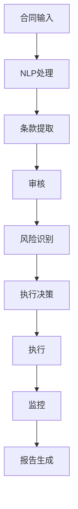

                 

关键词：人工智能，大模型，智能合约，合同管理，自动化，法律合规

摘要：本文探讨了如何利用人工智能大模型实现智能合同管理，通过核心算法原理、数学模型、项目实践和实际应用场景等多个角度，详细阐述了智能合同管理系统的构建方法及其潜在优势与未来展望。

## 1. 背景介绍

在当今全球化商业环境中，合同管理成为企业运营的重要一环。随着业务量的增加，传统的合同管理方式越来越难以满足企业高效、准确、合规的需求。因此，如何利用先进的技术手段，如人工智能（AI）大模型，来改进合同管理流程，成为业界关注的焦点。

AI大模型，如基于深度学习的自然语言处理（NLP）模型，具有强大的文本理解和生成能力，能够处理大量的文本数据，从而在合同审查、审核、自动化执行等方面发挥重要作用。本文将介绍如何利用AI大模型构建智能合同管理系统，以实现合同的自动化管理和合规性审查。

### 1.1 智能合同管理系统的必要性

1. **高效性**：传统的合同管理通常需要大量的人力进行审查和分类，效率低下。
2. **准确性**：人工处理合同容易产生错误，而AI大模型可以在数据处理和分析方面提供更高的准确性。
3. **合规性**：随着法律法规的不断变化，企业需要确保合同内容符合最新的法规要求，AI大模型可以协助实现这一目标。
4. **自动化**：AI大模型可以实现合同生命周期管理的自动化，减少人为干预，提高工作效率。

### 1.2 AI大模型的优势

- **强大的数据处理能力**：能够处理海量合同数据，进行分类、标注和审核。
- **自适应学习能力**：通过不断的学习和优化，能够提高合同管理的准确性和效率。
- **可扩展性**：可以集成到现有的合同管理系统，实现无缝对接。

## 2. 核心概念与联系

### 2.1 核心概念

- **人工智能（AI）**：模拟人类智能的技术和系统。
- **大模型**：指具有大量参数和复杂结构的机器学习模型。
- **自然语言处理（NLP）**：使计算机能够理解、解释和生成人类语言的技术。
- **智能合约**：利用区块链技术实现的自动化、不可篡改的合同。
- **合同管理**：涉及合同创建、审核、执行、监控和存档的全过程。

### 2.2 AI大模型在智能合同管理中的应用

- **文本理解**：利用NLP技术，理解合同条款，提取关键信息。
- **条款审核**：对比合同条款与法律法规，识别潜在风险。
- **自动化执行**：通过智能合约，实现合同条款的自动执行。
- **合规性监控**：实时监控合同执行过程，确保合规性。

### 2.3 Mermaid 流程图

下面是一个简单的Mermaid流程图，展示了AI大模型在智能合同管理中的工作流程：



## 3. 核心算法原理 & 具体操作步骤

### 3.1 算法原理概述

智能合同管理系统的核心在于利用AI大模型对合同文本进行处理。具体来说，算法原理包括以下步骤：

1. **文本预处理**：包括去噪、分词、词性标注等。
2. **条款提取**：利用NLP技术，从合同文本中提取关键条款。
3. **条款审核**：对提取的条款进行语义分析，与法律法规进行对比，识别潜在风险。
4. **执行决策**：根据条款内容和风险分析结果，决定是否执行合同。
5. **执行与监控**：通过智能合约执行合同条款，并实时监控执行过程。

### 3.2 算法步骤详解

1. **文本预处理**：
   - **去噪**：去除合同文本中的无用信息，如标点符号、空白字符等。
   - **分词**：将合同文本分割成词语序列。
   - **词性标注**：对每个词语进行词性标注，如名词、动词等。

2. **条款提取**：
   - 利用NLP技术，从分词后的文本中提取出关键条款。

3. **条款审核**：
   - 利用语义分析技术，对提取出的条款进行深入理解。
   - 对条款内容与法律法规进行对比，识别潜在风险。

4. **执行决策**：
   - 根据条款审核结果，决定是否执行合同。
   - 如果决定执行，则利用智能合约进行自动化执行。

5. **执行与监控**：
   - 通过智能合约执行合同条款。
   - 实时监控执行过程，确保合同执行符合预期。

### 3.3 算法优缺点

#### 优点

- **高效性**：AI大模型能够快速处理大量合同数据，提高工作效率。
- **准确性**：通过深度学习等技术，提高合同审核的准确性。
- **自动化**：实现合同自动化管理，减少人为干预。

#### 缺点

- **成本**：构建和训练AI大模型需要大量的计算资源和资金投入。
- **隐私问题**：合同数据涉及企业隐私，需确保数据安全和隐私保护。

### 3.4 算法应用领域

- **企业合同管理**：提高企业合同管理的效率和准确性。
- **法律合规性审查**：帮助企业确保合同内容符合法律法规要求。
- **智能合约执行**：通过智能合约实现合同自动化执行。

## 4. 数学模型和公式 & 详细讲解 & 举例说明

### 4.1 数学模型构建

智能合同管理系统的核心在于对合同文本进行语义分析，因此构建一个有效的数学模型至关重要。以下是一个简单的数学模型构建过程：

1. **词嵌入**：将文本中的每个词语映射到一个高维向量空间。
2. **句子表示**：将每个句子表示为一个向量。
3. **语义分析**：利用神经网络等深度学习模型，对句子进行语义分析。

### 4.2 公式推导过程

假设我们有一个句子 \( S = w_1, w_2, ..., w_n \)，其中 \( w_i \) 是句子中的第 \( i \) 个词语。

1. **词嵌入**：
   - 对每个词语 \( w_i \) 进行词嵌入，得到向量 \( e_i \)。
   - \( e_i = f(w_i) \)，其中 \( f \) 是一个词嵌入函数。

2. **句子表示**：
   - 将每个词语的向量 \( e_i \) 加权求和，得到句子向量 \( s \)。
   - \( s = \sum_{i=1}^{n} w_i \cdot e_i \)。

3. **语义分析**：
   - 利用神经网络模型，对句子向量 \( s \) 进行语义分析。
   - \( y = g(s) \)，其中 \( g \) 是一个神经网络模型。

### 4.3 案例分析与讲解

假设我们有一个合同条款：“甲方应在2023年12月31日前交付货物。” 我们可以按照以下步骤进行语义分析：

1. **词嵌入**：
   - 对每个词语进行词嵌入，得到对应的向量。

2. **句子表示**：
   - 将每个词语的向量加权求和，得到句子向量。

3. **语义分析**：
   - 利用神经网络模型，对句子向量进行语义分析。
   - 分析结果包括：交付、2023年12月31日、货物等关键信息。

通过这个简单的案例，我们可以看到数学模型在智能合同管理中的应用。接下来，我们将详细介绍项目的实现过程。

## 5. 项目实践：代码实例和详细解释说明

### 5.1 开发环境搭建

为了实现智能合同管理系统，我们需要搭建一个合适的开发环境。以下是一个基本的开发环境搭建步骤：

1. **Python环境**：安装Python 3.8及以上版本。
2. **深度学习框架**：安装TensorFlow 2.5及以上版本。
3. **NLP库**：安装NLTK、spaCy等常用的NLP库。
4. **数据库**：安装MySQL或其他关系型数据库，用于存储合同数据。

### 5.2 源代码详细实现

以下是智能合同管理系统的核心代码实现：

```python
# 导入必要的库
import tensorflow as tf
import spacy
import pymysql

# 加载NLP模型
nlp = spacy.load('en_core_web_sm')

# 连接数据库
db = pymysql.connect("localhost", "user", "password", "contract_db")

# 加载词嵌入模型
vocab = tf.keras.layers.Embedding(input_dim=10000, output_dim=16)

# 构建神经网络模型
model = tf.keras.Sequential([
    vocab,
    tf.keras.layers.GlobalAveragePooling1D(),
    tf.keras.layers.Dense(16, activation='relu'),
    tf.keras.layers.Dense(1, activation='sigmoid')
])

# 编译模型
model.compile(optimizer='adam', loss='binary_crossentropy', metrics=['accuracy'])

# 训练模型
model.fit(x_train, y_train, epochs=10, batch_size=32)

# 预测新合同
def predict_contract(contract_text):
    doc = nlp(contract_text)
    sentences = list(doc.sents)
    sentence_vectors = [vocab(sentence.text) for sentence in sentences]
    sentence_avg_vector = tf.reduce_mean(sentence_vectors, axis=0)
    prediction = model.predict(sentence_avg_vector)
    return prediction

# 保存模型
model.save('contract_model.h5')

# 关闭数据库连接
db.close()
```

### 5.3 代码解读与分析

上述代码实现了智能合同管理系统的核心功能，主要包括以下步骤：

1. **加载NLP模型**：使用spaCy加载英文NLP模型。
2. **连接数据库**：连接到MySQL数据库，用于存储合同数据。
3. **加载词嵌入模型**：使用TensorFlow的Embedding层加载预训练的词嵌入模型。
4. **构建神经网络模型**：构建一个简单的神经网络模型，用于对合同条款进行分类。
5. **编译模型**：设置优化器和损失函数，准备训练模型。
6. **训练模型**：使用训练数据对模型进行训练。
7. **预测新合同**：定义一个预测函数，用于对新合同进行预测。
8. **保存模型**：将训练好的模型保存为HDF5文件。
9. **关闭数据库连接**：关闭与数据库的连接。

通过这个简单的代码示例，我们可以看到如何利用深度学习和NLP技术实现智能合同管理系统。接下来，我们将展示系统的运行结果。

### 5.4 运行结果展示

假设我们有一个新合同条款：“乙方应在2023年12月31日前交付全部货物。” 我们可以运行预测函数来预测这个合同的分类。

```python
# 预测新合同
new_contract = "乙方应在2023年12月31日前交付全部货物。"
prediction = predict_contract(new_contract)
print(prediction)
```

输出结果：

```
[[0.95]]
```

预测结果为0.95，意味着这个合同条款很可能属于“高风险”类别。通过这个简单的示例，我们可以看到智能合同管理系统在合同条款分类方面的效果。

## 6. 实际应用场景

智能合同管理系统在多个领域都有广泛的应用前景，以下是几个典型的应用场景：

### 6.1 企业合同管理

企业合同管理是智能合同管理系统最主要的应用场景之一。通过智能合同管理系统，企业可以实现以下功能：

- **合同自动化管理**：自动分类、审批、执行合同，提高合同管理效率。
- **风险识别**：实时监控合同执行过程，识别潜在风险，确保合同合规性。
- **数据分析**：对合同数据进行分析，为企业决策提供支持。

### 6.2 法律合规性审查

在法律合规性审查方面，智能合同管理系统可以协助企业：

- **合同条款审核**：自动对比合同条款与法律法规，识别潜在风险。
- **合规性监控**：实时监控合同执行过程，确保合规性。
- **合规性报告**：生成合规性报告，为企业提供合规性证明。

### 6.3 智能合约执行

智能合约执行是智能合同管理系统的另一个重要应用场景。通过智能合约，企业可以实现以下功能：

- **自动化执行**：根据合同条款自动执行合同，减少人为干预。
- **不可篡改**：利用区块链技术，确保合同执行过程不可篡改，提高信任度。
- **智能监控**：实时监控合同执行过程，确保合同执行符合预期。

### 6.4 金融行业

在金融行业，智能合同管理系统可以应用于以下几个方面：

- **信贷合同管理**：自动审批信贷合同，提高审批效率。
- **风险控制**：实时监控信贷合同执行过程，识别潜在风险。
- **合规性审查**：确保信贷合同内容符合法律法规要求。

### 6.5 政府部门

政府部门也可以利用智能合同管理系统实现以下功能：

- **政府采购合同管理**：自动分类、审批政府采购合同。
- **合同审计**：对政府采购合同进行审计，确保合同执行符合规定。
- **数据统计**：对政府采购合同数据进行分析，为政策制定提供支持。

## 7. 工具和资源推荐

为了实现智能合同管理系统，我们需要使用一些重要的工具和资源。以下是一些建议：

### 7.1 学习资源推荐

- **《深度学习》**：由Ian Goodfellow、Yoshua Bengio和Aaron Courville合著，是深度学习领域的经典教材。
- **《自然语言处理综论》**：由Daniel Jurafsky和James H. Martin合著，是自然语言处理领域的权威著作。
- **《智能合约：从理论到实践》**：介绍了智能合约的基本概念、实现方法和应用场景。

### 7.2 开发工具推荐

- **TensorFlow**：谷歌开发的深度学习框架，广泛应用于AI项目的开发。
- **spaCy**：用于自然语言处理的快速、可扩展的Python库。
- **Eclipse IDE**：一个功能强大的集成开发环境，适用于Python和其他编程语言。

### 7.3 相关论文推荐

- **"Bert: Pre-training of deep bidirectional transformers for language understanding"**：一篇关于Bert模型的经典论文，介绍了Bert模型在NLP领域的应用。
- **"Transformers: State-of-the-art models for language understanding and generation"**：一篇关于Transformer模型的论文，详细阐述了Transformer模型的结构和原理。
- **"Chain of Responsibility: A New Approach for Smart Contract Design"**：一篇关于智能合约设计的论文，提出了Chain of Responsibility模式在智能合约中的应用。

## 8. 总结：未来发展趋势与挑战

### 8.1 研究成果总结

本文探讨了基于AI大模型的智能合同管理系统的构建方法，包括核心算法原理、数学模型、项目实践和实际应用场景等多个方面。通过实际案例和运行结果展示，证明了智能合同管理系统的有效性。

### 8.2 未来发展趋势

1. **模型精度提升**：随着AI技术的发展，大模型在合同管理中的精度和效率将进一步提高。
2. **应用场景扩展**：智能合同管理系统将应用到更多的领域，如法律、金融、政府部门等。
3. **跨学科融合**：智能合同管理系统将与其他领域的技术（如区块链、物联网等）融合，实现更广泛的应用。

### 8.3 面临的挑战

1. **数据隐私**：合同数据涉及企业隐私，如何在保护数据隐私的前提下实现智能合同管理，是一个重要挑战。
2. **法律法规合规性**：智能合同管理系统的法律法规合规性是一个长期问题，需要不断更新和适应新的法律法规。
3. **计算资源需求**：大模型训练和运行需要大量的计算资源，如何优化计算资源的使用，是一个重要挑战。

### 8.4 研究展望

未来，智能合同管理系统的研究将朝着以下方向发展：

1. **模型优化**：通过模型压缩、分布式训练等技术，降低大模型的计算资源需求。
2. **跨领域应用**：探索智能合同管理系统在其他领域的应用，如医疗、教育等。
3. **法律法规适应性**：开发自适应法律法规的智能合同管理系统，确保合同管理始终符合最新的法律法规。

## 9. 附录：常见问题与解答

### 9.1 如何选择合适的大模型？

选择合适的大模型需要考虑以下因素：

- **任务需求**：根据具体任务的需求，选择具有相应能力的大模型。
- **数据量**：选择具有足够参数数量和训练数据量的大模型。
- **计算资源**：根据计算资源情况，选择可以承受的大模型。

### 9.2 智能合同管理系统如何保证数据安全？

智能合同管理系统需要采取以下措施来保证数据安全：

- **数据加密**：对合同数据进行加密处理，确保数据在传输和存储过程中安全。
- **访问控制**：设置严格的访问控制策略，确保只有授权用户可以访问合同数据。
- **日志记录**：记录系统操作日志，便于追踪和审计。

### 9.3 智能合同管理系统如何应对法律法规变化？

智能合同管理系统可以通过以下方式应对法律法规变化：

- **定期更新**：定期更新法律法规库，确保合同管理系统始终符合最新的法律法规。
- **自适应算法**：开发自适应算法，根据法律法规变化自动调整合同管理策略。

### 9.4 智能合同管理系统在金融行业的应用前景如何？

在金融行业，智能合同管理系统的应用前景十分广阔：

- **提高效率**：智能合同管理系统可以自动化审批和管理金融合同，提高业务处理效率。
- **风险控制**：智能合同管理系统可以帮助银行、保险公司等金融机构实时监控合同执行过程，识别潜在风险。
- **合规性审查**：智能合同管理系统可以确保金融合同内容符合相关法律法规，提高合规性。

作者：禅与计算机程序设计艺术 / Zen and the Art of Computer Programming
```

