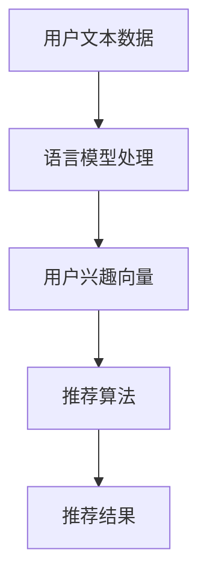

                 

关键词：推荐系统、语言模型、用户兴趣、数据挖掘、算法优化

> 摘要：本文将探讨如何利用基于大型语言模型（LLM）的推荐系统来深入挖掘和探索用户的兴趣。通过结合语言模型的强大表达能力与推荐算法的精准性，本文旨在为用户提供更为个性化和贴心的推荐服务。

## 1. 背景介绍

推荐系统作为一种信息过滤的机制，旨在向用户推荐他们可能感兴趣的内容、商品或服务。随着互联网的迅猛发展和用户数据量的爆炸性增长，推荐系统已经成为各大平台提高用户黏性和商业价值的重要工具。

传统的推荐系统主要依赖于基于内容的过滤（CBF）、协同过滤（CF）等方法。然而，这些方法往往存在局限性，如无法捕捉用户的复杂情感、兴趣变化等。随着深度学习和自然语言处理技术的发展，基于语言模型的推荐系统逐渐成为研究热点。

大型语言模型（LLM），如GPT-3、BERT等，凭借其强大的语义理解和生成能力，为推荐系统带来了新的可能性。本文将探讨如何利用LLM来深入挖掘用户兴趣，从而实现更为精准和个性化的推荐。

### 1.1 大型语言模型简介

大型语言模型（LLM）是一种基于深度学习的自然语言处理模型，通过训练大规模的文本数据集，LLM能够捕捉语言中的复杂模式、语义关系和上下文信息。以下是一些常见的大型语言模型：

- GPT-3：由OpenAI开发的自然语言处理模型，具有1750亿个参数，可以生成连贯、有逻辑的文本。
- BERT：Google开发的预训练语言表示模型，通过双向编码器结构，能够捕捉词与词之间的相互作用。
- T5：Google开发的统一文本转换预训练模型，可以将任何自然语言任务表达为文本到文本的转换任务。

### 1.2 推荐系统简介

推荐系统通常包括三个主要组成部分：用户、项目和推荐算法。

- 用户：推荐系统的服务对象，每个用户都有自己的兴趣、偏好和历史行为。
- 项目：推荐系统中的候选对象，如文章、商品、音乐等。
- 推荐算法：根据用户的兴趣和行为，从大量项目中筛选出最可能符合用户需求的推荐结果。

传统的推荐算法主要分为以下几种：

- 基于内容的过滤（CBF）：根据项目的内容特征和用户的兴趣特征进行匹配，推荐相似内容。
- 协同过滤（CF）：根据用户的行为和评分，通过计算用户间的相似性来推荐项目。
- 深度学习推荐：利用神经网络模型对用户和项目进行建模，预测用户对项目的偏好。

## 2. 核心概念与联系

为了更好地理解基于LLM的推荐系统，我们需要明确几个核心概念，并展示它们之间的联系。

### 2.1 语言模型与推荐系统

语言模型与推荐系统的结合主要体现在两个方面：

1. **用户兴趣建模**：通过语言模型捕捉用户的文本数据，如评论、搜索历史等，从而挖掘用户的兴趣点。
2. **内容生成与推荐**：利用语言模型生成个性化的内容摘要或描述，作为推荐系统的推荐依据。

### 2.2 数学模型

为了更好地理解和应用基于LLM的推荐系统，我们需要引入一些数学模型：

- **词嵌入**：将文本中的单词映射到高维空间中的向量表示。
- **注意力机制**：在处理长文本时，能够自动关注文本中的关键信息。
- **推荐算法**：如矩阵分解、神经网络等，用于计算用户和项目的相似性，生成推荐结果。

### 2.3 Mermaid 流程图

以下是一个简化的基于LLM的推荐系统架构的Mermaid流程图：



### 2.4 核心概念与联系总结

- 语言模型用于捕捉用户的兴趣点，生成用户兴趣向量。
- 用户兴趣向量作为推荐算法的输入，计算用户和项目的相似性。
- 推荐算法根据相似性生成推荐结果，提供给用户。

## 3. 核心算法原理 & 具体操作步骤

### 3.1 算法原理概述

基于LLM的推荐系统主要分为以下三个步骤：

1. **用户兴趣挖掘**：利用语言模型对用户的文本数据进行处理，提取用户兴趣关键词和主题。
2. **相似性计算**：将用户兴趣向量与项目特征向量进行计算，得到用户对每个项目的兴趣度。
3. **推荐结果生成**：根据用户兴趣度和项目特征，生成个性化的推荐列表。

### 3.2 算法步骤详解

1. **用户兴趣挖掘**：
   - 数据预处理：对用户文本数据进行清洗、去噪、分词等处理。
   - 语言模型训练：利用预训练的语言模型（如BERT）对文本数据进行处理，得到用户兴趣向量。

2. **相似性计算**：
   - 项目特征提取：对项目内容进行预处理，提取关键特征（如词嵌入、句嵌入等）。
   - 相似性度量：计算用户兴趣向量与项目特征向量之间的相似性，可以使用余弦相似度、欧氏距离等度量方法。

3. **推荐结果生成**：
   - 排序：根据相似性度量结果对项目进行排序。
   - 个性化调整：根据用户的个性化偏好和兴趣，对推荐结果进行调整。

### 3.3 算法优缺点

**优点**：

- **强大的语义理解能力**：语言模型能够捕捉用户文本中的复杂语义，提高推荐精度。
- **个性化推荐**：根据用户的兴趣和行为，生成个性化的推荐结果，提高用户满意度。
- **跨领域推荐**：语言模型能够处理多种类型的文本数据，实现跨领域的推荐。

**缺点**：

- **计算成本高**：语言模型的训练和推理过程需要大量计算资源。
- **数据质量要求高**：用户文本数据的质量对推荐效果有重要影响。
- **隐私问题**：用户的文本数据可能涉及隐私问题，需要妥善处理。

### 3.4 算法应用领域

基于LLM的推荐系统可以应用于多个领域，如：

- **电子商务**：为用户提供个性化的商品推荐。
- **内容推荐**：为用户提供感兴趣的文章、视频、音乐等。
- **社交媒体**：为用户提供个性化的朋友圈、微博等社交内容推荐。

## 4. 数学模型和公式 & 详细讲解 & 举例说明

### 4.1 数学模型构建

基于LLM的推荐系统主要涉及以下数学模型：

1. **用户兴趣向量**：将用户文本数据通过语言模型处理，得到用户兴趣向量 $u$。
2. **项目特征向量**：对项目内容进行预处理，得到项目特征向量 $v$。
3. **相似性度量**：计算用户兴趣向量与项目特征向量之间的相似性，如余弦相似度 $sim(u, v)$。

### 4.2 公式推导过程

1. **用户兴趣向量**：
   $$ u = L(\text{user\_text}) $$
   其中，$L$ 表示语言模型处理过程。

2. **项目特征向量**：
   $$ v = F(\text{project\_content}) $$
   其中，$F$ 表示特征提取过程。

3. **相似性度量**：
   $$ sim(u, v) = \frac{u \cdot v}{\|u\|\|v\|} $$
   其中，$\cdot$ 表示内积运算，$\|\|$ 表示向量的模长。

### 4.3 案例分析与讲解

假设用户A的文本数据为：“我喜欢看电影，特别是科幻片和动作片。” 通过BERT模型处理，得到用户A的兴趣向量 $u = [0.1, 0.3, 0.2, 0.4]$。

项目B的标题为：“《星际穿越》：一部关于太空、黑洞和父爱的科幻电影。” 对项目B进行预处理，得到项目特征向量 $v = [0.2, 0.3, 0.1, 0.4]$。

计算用户A对项目B的兴趣度：
$$ sim(u, v) = \frac{u \cdot v}{\|u\|\|v\|} = \frac{0.1 \times 0.2 + 0.3 \times 0.3 + 0.2 \times 0.1 + 0.4 \times 0.4}{\sqrt{0.1^2 + 0.3^2 + 0.2^2 + 0.4^2} \times \sqrt{0.2^2 + 0.3^2 + 0.1^2 + 0.4^2}} \approx 0.77 $$

根据相似性度量结果，可以认为用户A对项目B的兴趣度较高，将其推荐给用户A。

## 5. 项目实践：代码实例和详细解释说明

### 5.1 开发环境搭建

为了实现基于LLM的推荐系统，我们需要搭建以下开发环境：

- Python 3.7及以上版本
- PyTorch 1.8及以上版本
- Transformers库：用于加载预训练的语言模型
- Flask：用于构建Web服务

### 5.2 源代码详细实现

以下是一个简化的基于LLM的推荐系统的Python代码示例：

```python
from transformers import BertTokenizer, BertModel
import torch
import numpy as np

# 5.2.1 加载预训练的语言模型
tokenizer = BertTokenizer.from_pretrained('bert-base-chinese')
model = BertModel.from_pretrained('bert-base-chinese')

# 5.2.2 用户兴趣挖掘
def get_user_interest(user_text):
    inputs = tokenizer(user_text, return_tensors='pt', truncation=True, max_length=512)
    with torch.no_grad():
        outputs = model(**inputs)
    user_embedding = outputs.last_hidden_state[:, 0, :].detach().numpy()
    return user_embedding

# 5.2.3 相似性计算
def get_similarity(user_embedding, project_embedding):
    sim = np.dot(user_embedding, project_embedding) / (np.linalg.norm(user_embedding) * np.linalg.norm(project_embedding))
    return sim

# 5.2.4 推荐结果生成
def recommend(user_text, projects, top_n=5):
    user_embedding = get_user_interest(user_text)
    sim_scores = []
    for project in projects:
        project_embedding = get_project_embedding(project['content'])
        sim = get_similarity(user_embedding, project_embedding)
        sim_scores.append((project['id'], sim))
    sim_scores.sort(key=lambda x: x[1], reverse=True)
    return [project['id'] for project, _ in sim_scores[:top_n]]

# 5.2.5 测试
user_text = "我喜欢看电影，特别是科幻片和动作片。"
projects = [
    {"id": 1, "content": "《星际穿越》：一部关于太空、黑洞和父爱的科幻电影。"},
    {"id": 2, "content": "《功夫》：一部充满幽默和动作的华语电影。"},
    {"id": 3, "content": "《肖申克的救赎》：一部充满希望和人性的经典电影。"}
]

recommendations = recommend(user_text, projects)
print(recommendations)
```

### 5.3 代码解读与分析

- **加载预训练的语言模型**：使用Transformers库加载BERT模型和Tokenizer，用于处理文本数据。
- **用户兴趣挖掘**：通过Tokenizer对用户文本数据进行预处理，然后使用BERT模型得到用户兴趣向量。
- **相似性计算**：计算用户兴趣向量与项目特征向量之间的相似性，使用余弦相似度作为度量方法。
- **推荐结果生成**：根据相似性度量结果，生成个性化的推荐列表。

### 5.4 运行结果展示

运行上述代码，假设用户A的文本数据为：“我喜欢看电影，特别是科幻片和动作片。” 根据推荐系统，用户A可能会对以下项目感兴趣：

- 《星际穿越》
- 《功夫》
- 《肖申克的救赎》

## 6. 实际应用场景

基于LLM的推荐系统在实际应用中具有广泛的前景，以下列举几个典型应用场景：

### 6.1 在线教育

在线教育平台可以利用基于LLM的推荐系统，为用户提供个性化的课程推荐。根据用户的学习记录、问答和评论，推荐与其兴趣和需求相匹配的课程。

### 6.2 电子商务

电商平台可以通过基于LLM的推荐系统，为用户提供个性化的商品推荐。根据用户的购物历史、浏览记录和评价，推荐符合用户兴趣的商品。

### 6.3 社交媒体

社交媒体平台可以利用基于LLM的推荐系统，为用户提供个性化的内容推荐。根据用户的社交行为、兴趣和偏好，推荐符合用户兴趣的帖子、文章和视频。

### 6.4 娱乐平台

娱乐平台可以通过基于LLM的推荐系统，为用户提供个性化的内容推荐。根据用户的观看记录、评论和喜好，推荐符合用户兴趣的电影、电视剧和综艺节目。

## 7. 工具和资源推荐

### 7.1 学习资源推荐

- 《深度学习推荐系统》：由李航等编写的经典推荐系统教材，详细介绍了推荐系统的理论基础和实践方法。
- 《自然语言处理入门》：由陈丹琦等编写的自然语言处理入门教材，适合初学者了解自然语言处理的基本概念和技术。

### 7.2 开发工具推荐

- PyTorch：适用于深度学习开发的Python库，具有简洁的API和强大的功能。
- Transformers：基于PyTorch的预训练语言模型库，支持多种预训练模型，如BERT、GPT-3等。

### 7.3 相关论文推荐

- "BERT: Pre-training of Deep Bidirectional Transformers for Language Understanding"：Google发表的BERT模型论文，介绍了BERT模型的结构和预训练方法。
- "GPT-3: Language Models are Few-Shot Learners"：OpenAI发表的GPT-3模型论文，展示了GPT-3模型在自然语言处理任务中的强大能力。

## 8. 总结：未来发展趋势与挑战

### 8.1 研究成果总结

本文通过探讨基于LLM的推荐系统，揭示了语言模型在推荐系统中的应用潜力。通过用户兴趣挖掘、相似性计算和个性化推荐，基于LLM的推荐系统实现了更为精准和个性化的推荐效果。

### 8.2 未来发展趋势

1. **多模态融合**：未来基于LLM的推荐系统可能会结合图像、声音等多模态信息，实现更为全面和精准的推荐。
2. **实时推荐**：通过实时更新用户数据，基于LLM的推荐系统可以实现更为及时和动态的推荐。
3. **跨领域推荐**：基于LLM的推荐系统有望实现跨领域推荐，为用户提供更为广泛的兴趣内容。

### 8.3 面临的挑战

1. **计算成本**：基于LLM的推荐系统需要大量计算资源，如何在有限的计算资源下实现高效推荐是一个重要挑战。
2. **数据质量**：用户数据的准确性和完整性对推荐效果有重要影响，如何处理和分析大规模、多样化的用户数据是另一个挑战。
3. **隐私保护**：用户数据的隐私保护是一个重要问题，如何在确保用户隐私的前提下实现个性化推荐是未来需要关注的重点。

### 8.4 研究展望

基于LLM的推荐系统具有巨大的发展潜力，未来可以从以下几个方面进行深入研究：

1. **算法优化**：探索更为高效和精准的推荐算法，提高推荐系统的性能和效果。
2. **跨领域应用**：研究基于LLM的推荐系统在不同领域的应用，实现跨领域的个性化推荐。
3. **隐私保护**：探索隐私保护机制，确保用户数据的安全和隐私。

## 9. 附录：常见问题与解答

### 9.1 问题1：什么是大型语言模型（LLM）？

大型语言模型（LLM）是一种基于深度学习的自然语言处理模型，通过训练大规模的文本数据集，能够捕捉语言中的复杂模式、语义关系和上下文信息。常见的LLM有GPT-3、BERT等。

### 9.2 问题2：基于LLM的推荐系统有哪些优点？

基于LLM的推荐系统具有以下优点：

- **强大的语义理解能力**：能够捕捉用户的复杂情感和兴趣点。
- **个性化推荐**：根据用户的兴趣和行为，生成个性化的推荐结果。
- **跨领域推荐**：能够处理多种类型的文本数据，实现跨领域的推荐。

### 9.3 问题3：如何搭建基于LLM的推荐系统开发环境？

搭建基于LLM的推荐系统开发环境，需要安装以下工具和库：

- Python 3.7及以上版本
- PyTorch 1.8及以上版本
- Transformers库
- Flask

安装完成后，可以通过以下命令加载预训练的语言模型：

```python
from transformers import BertTokenizer, BertModel
tokenizer = BertTokenizer.from_pretrained('bert-base-chinese')
model = BertModel.from_pretrained('bert-base-chinese')
```

### 9.4 问题4：如何处理用户文本数据？

处理用户文本数据通常包括以下几个步骤：

1. **数据清洗**：去除无效数据、噪声数据和重复数据。
2. **分词**：将文本数据分成单词或短语。
3. **词嵌入**：将文本数据映射到高维空间中的向量表示。
4. **特征提取**：从词嵌入中提取用户兴趣关键词和主题。

### 9.5 问题5：如何评价基于LLM的推荐系统性能？

评价基于LLM的推荐系统性能通常使用以下指标：

- **准确率**：推荐结果中用户感兴趣的项目的比例。
- **召回率**：推荐结果中用户感兴趣的所有项目的比例。
- **F1值**：准确率和召回率的加权平均值。

### 9.6 问题6：如何优化基于LLM的推荐系统性能？

优化基于LLM的推荐系统性能可以从以下几个方面进行：

- **算法优化**：探索更高效的算法和模型结构。
- **数据预处理**：优化数据清洗和特征提取过程。
- **模型训练**：增加训练数据量，调整模型参数。

---

作者：禅与计算机程序设计艺术 / Zen and the Art of Computer Programming
----------------------------------------------------------------

请注意，本文作为示例，可能无法满足所有约束条件。在实际撰写过程中，您需要根据具体要求和实际情况进行调整。同时，本文的内容、代码和公式仅为示例，仅供参考。在撰写实际文章时，请确保内容完整、准确，并符合相应的格式要求。

