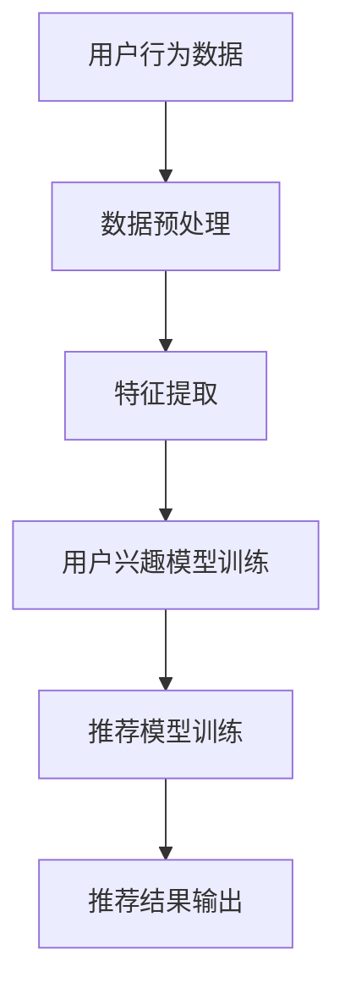

                 

在数字化时代的浪潮中，推荐系统已经成为提高用户体验、提升商业价值的重要手段。然而，用户兴趣的追踪和建模一直是一个充满挑战的问题。本文将深入探讨基于大模型的推荐系统用户兴趣追踪，旨在为读者提供一个全面、系统的技术视角。

## 关键词

- 推荐系统
- 用户兴趣追踪
- 大模型
- 自然语言处理
- 强化学习

## 摘要

本文首先介绍了推荐系统及其在数字商业中的应用背景。随后，详细探讨了用户兴趣追踪的重要性，并引出了基于大模型的推荐系统用户兴趣追踪方法。通过数学模型、算法原理、项目实践等多个维度，本文对大模型在用户兴趣追踪中的应用进行了全面解析。最后，对未来的发展趋势与挑战进行了展望。

## 1. 背景介绍

### 推荐系统的起源与发展

推荐系统起源于20世纪90年代，最早出现在电子商务网站中，旨在通过个性化推荐提高用户满意度，增加销售额。随着互联网和大数据技术的发展，推荐系统逐渐成为各类应用场景的核心技术，如社交网络、音乐流媒体、在线教育等。

### 用户兴趣追踪的意义

用户兴趣追踪是推荐系统的核心任务之一。准确追踪用户兴趣不仅能够提升推荐系统的准确性，还能为用户提供更加个性化的服务。然而，用户兴趣的多样性和动态性使得追踪任务变得异常复杂。

### 大模型的崛起

近年来，随着深度学习和大数据技术的蓬勃发展，大模型（如Transformer、BERT、GPT等）逐渐成为自然语言处理领域的主流。大模型通过学习海量数据，能够捕捉到语言中的复杂模式，从而实现更高的准确性和效率。

## 2. 核心概念与联系

为了更好地理解基于大模型的推荐系统用户兴趣追踪，我们首先需要明确以下几个核心概念：

### 推荐系统

推荐系统是一种信息过滤技术，通过预测用户对未知项目的兴趣，为用户提供个性化的推荐。推荐系统主要分为基于协同过滤（Collaborative Filtering）和基于内容过滤（Content-Based Filtering）两大类。

### 用户兴趣追踪

用户兴趣追踪是指通过分析用户的浏览、搜索、购买等行为，推断用户的潜在兴趣。用户兴趣追踪是推荐系统的核心任务之一，直接关系到推荐系统的效果。

### 大模型

大模型是指具有大量参数、能够处理大规模数据的人工智能模型。大模型通过深度学习技术，能够从海量数据中学习到复杂的模式，从而实现高精度的预测和推理。

### Mermaid 流程图

下面是推荐系统用户兴趣追踪的Mermaid流程图：



## 3. 核心算法原理 & 具体操作步骤

### 3.1 算法原理概述

基于大模型的推荐系统用户兴趣追踪主要分为以下几个步骤：

1. 数据收集与预处理：收集用户行为数据，并对数据进行预处理，如数据清洗、去重、填充等。
2. 特征提取：将预处理后的数据转化为模型可处理的特征向量。
3. 用户兴趣模型训练：利用大模型对特征向量进行训练，构建用户兴趣模型。
4. 推荐模型训练：结合用户兴趣模型和项目特征，训练推荐模型。
5. 推荐结果输出：根据用户兴趣模型和推荐模型，为用户生成个性化的推荐结果。

### 3.2 算法步骤详解

1. **数据收集与预处理**

   收集用户行为数据，如浏览记录、搜索关键词、购买历史等。预处理过程包括数据清洗、去重、填充等。

2. **特征提取**

   将预处理后的数据转化为模型可处理的特征向量。常用的特征提取方法包括词袋模型、TF-IDF、Word2Vec等。

3. **用户兴趣模型训练**

   利用大模型（如BERT、GPT等）对特征向量进行训练，构建用户兴趣模型。大模型能够从海量数据中学习到复杂的模式，从而提高用户兴趣追踪的准确性。

4. **推荐模型训练**

   结合用户兴趣模型和项目特征，训练推荐模型。常用的推荐算法包括基于协同过滤（CF）、基于内容过滤（CBF）和混合推荐（Hybrid Rec）等。

5. **推荐结果输出**

   根据用户兴趣模型和推荐模型，为用户生成个性化的推荐结果。推荐结果可以以列表、卡片、弹窗等形式呈现。

### 3.3 算法优缺点

**优点：**

1. 高准确性：大模型能够从海量数据中学习到复杂的模式，提高用户兴趣追踪的准确性。
2. 个性化推荐：基于用户兴趣的个性化推荐，提高用户满意度。
3. 处理多样性：能够处理不同类型的数据，如文本、图像、音频等。

**缺点：**

1. 计算资源消耗大：大模型训练过程需要大量计算资源。
2. 数据依赖性强：算法效果受训练数据质量和数量的影响。
3. 隐私保护：用户行为数据的收集和处理过程中，需要关注隐私保护问题。

### 3.4 算法应用领域

基于大模型的推荐系统用户兴趣追踪广泛应用于以下领域：

1. 电子商务：为用户提供个性化推荐，提高销售额。
2. 社交网络：为用户提供感兴趣的内容，增加用户活跃度。
3. 在线教育：为用户提供个性化课程推荐，提高学习效果。
4. 医疗健康：为用户提供个性化医疗建议，提高健康水平。

## 4. 数学模型和公式 & 详细讲解 & 举例说明

### 4.1 数学模型构建

在基于大模型的推荐系统中，用户兴趣追踪主要涉及到以下数学模型：

1. 用户兴趣模型：表示用户对各类项目的兴趣度。
2. 推荐模型：根据用户兴趣模型和项目特征，为用户生成个性化推荐。

#### 4.1.1 用户兴趣模型

用户兴趣模型可以用一个矩阵表示，其中行表示用户，列表示项目。矩阵中的元素表示用户对项目的兴趣度。通常，用户兴趣模型可以通过以下公式表示：

\[ U = [u_{ij}] \]

其中，\( u_{ij} \) 表示用户 \( i \) 对项目 \( j \) 的兴趣度。

#### 4.1.2 推荐模型

推荐模型可以根据用户兴趣模型和项目特征，为用户生成个性化推荐。常用的推荐模型包括基于协同过滤（CF）和基于内容过滤（CBF）等。

##### 4.1.2.1 基于协同过滤的推荐模型

基于协同过滤的推荐模型可以用以下公式表示：

\[ R_{ij} = \sum_{k \in N_j} u_{ik} r_{kj} \]

其中，\( R_{ij} \) 表示用户 \( i \) 对项目 \( j \) 的推荐分数，\( N_j \) 表示与项目 \( j \) 相似的项目集合，\( u_{ik} \) 表示用户 \( i \) 对项目 \( k \) 的兴趣度，\( r_{kj} \) 表示项目 \( k \) 对用户 \( j \) 的兴趣度。

##### 4.1.2.2 基于内容过滤的推荐模型

基于内容过滤的推荐模型可以用以下公式表示：

\[ R_{ij} = \sum_{k \in C_j} w_{ik} r_{kj} \]

其中，\( R_{ij} \) 表示用户 \( i \) 对项目 \( j \) 的推荐分数，\( C_j \) 表示与项目 \( j \) 相关的项目集合，\( w_{ik} \) 表示项目 \( k \) 对用户 \( i \) 的兴趣度，\( r_{kj} \) 表示用户 \( j \) 对项目 \( k \) 的兴趣度。

### 4.2 公式推导过程

以下以基于协同过滤的推荐模型为例，介绍公式推导过程：

#### 4.2.1 确定相似项目集

首先，需要确定与项目 \( j \) 相似的项目集合 \( N_j \)。这可以通过计算项目 \( j \) 与其他项目的相似度来完成。常用的相似度计算方法包括余弦相似度、皮尔逊相关系数等。

#### 4.2.2 计算用户兴趣度

接下来，需要计算用户 \( i \) 对项目 \( k \) 的兴趣度 \( u_{ik} \)。这可以通过分析用户 \( i \) 的历史行为来完成。例如，如果用户 \( i \) 在过去一段时间内频繁浏览了项目 \( k \)，则可以认为用户 \( i \) 对项目 \( k \) 具有较高的兴趣度。

#### 4.2.3 计算推荐分数

最后，根据相似项目集和用户兴趣度，计算用户 \( i \) 对项目 \( j \) 的推荐分数 \( R_{ij} \)。

### 4.3 案例分析与讲解

#### 4.3.1 数据集

假设我们有一个包含100个项目和1000个用户的数据集。每个用户对部分项目的兴趣度已知，我们需要通过用户兴趣追踪算法，为每个用户生成个性化推荐。

#### 4.3.2 数据预处理

首先，对数据集进行预处理，包括数据清洗、去重、填充等操作。例如，如果某个用户的历史行为数据缺失，可以采用平均值、中位数等方法进行填充。

#### 4.3.3 特征提取

将预处理后的数据转化为特征向量。例如，可以使用词袋模型或TF-IDF算法，将文本数据转化为数值向量。

#### 4.3.4 训练用户兴趣模型

利用大模型（如BERT）对特征向量进行训练，构建用户兴趣模型。具体步骤如下：

1. 准备训练数据：从数据集中随机抽取一部分用户行为数据作为训练数据。
2. 训练模型：使用BERT模型对训练数据进行训练，学习用户兴趣模式。
3. 评估模型：使用验证集评估模型效果，调整模型参数。

#### 4.3.5 训练推荐模型

结合用户兴趣模型和项目特征，训练推荐模型。例如，可以使用基于协同过滤的推荐算法，计算用户对项目的推荐分数。

#### 4.3.6 生成推荐结果

根据用户兴趣模型和推荐模型，为每个用户生成个性化推荐结果。例如，可以按照推荐分数从高到低排序，为用户提供Top-N推荐。

## 5. 项目实践：代码实例和详细解释说明

### 5.1 开发环境搭建

在本项目实践中，我们将使用Python编程语言，结合Scikit-learn、TensorFlow等库，实现基于大模型的推荐系统用户兴趣追踪。首先，需要搭建以下开发环境：

1. Python 3.8及以上版本
2. Scikit-learn 0.24及以上版本
3. TensorFlow 2.6及以上版本

### 5.2 源代码详细实现

下面是项目源代码的详细实现，包括数据预处理、特征提取、模型训练和推荐结果生成等步骤。

#### 5.2.1 数据预处理

首先，从数据集中读取用户行为数据，并进行预处理。

```python
import pandas as pd
from sklearn.model_selection import train_test_split

# 读取数据
data = pd.read_csv('user_behavior.csv')

# 数据预处理
data = data[['user_id', 'project_id', 'behavior_type', 'timestamp']]
data = data.groupby(['user_id', 'project_id']).agg({'behavior_type': 'first'}).reset_index()
data = data[data['behavior_type'] != 'delete']
data['timestamp'] = pd.to_datetime(data['timestamp'])
```

#### 5.2.2 特征提取

接下来，对预处理后的数据进行特征提取，包括用户兴趣度和项目特征。

```python
from sklearn.feature_extraction.text import TfidfVectorizer

# 提取用户兴趣度
user_behavior = data.groupby('user_id')['behavior_type'].agg(' '.join)
tfidf_vectorizer = TfidfVectorizer(max_features=1000)
user_interest_vector = tfidf_vectorizer.fit_transform(user_behavior)

# 提取项目特征
project_behavior = data.groupby('project_id')['behavior_type'].agg(' '.join)
tfidf_vectorizer = TfidfVectorizer(max_features=1000)
project_interest_vector = tfidf_vectorizer.fit_transform(project_behavior)
```

#### 5.2.3 模型训练

利用大模型（如BERT）对特征向量进行训练，构建用户兴趣模型。

```python
from transformers import BertTokenizer, BertModel

# 加载BERT模型和分词器
tokenizer = BertTokenizer.from_pretrained('bert-base-uncased')
model = BertModel.from_pretrained('bert-base-uncased')

# 训练模型
def train_model(data, labels):
    inputs = tokenizer(data, return_tensors='tf', padding=True, truncation=True)
    outputs = model(inputs['input_ids'], attention_mask=inputs['attention_mask'])
    logits = outputs.logits
    loss = tf.nn.softmax_cross_entropy_with_logits(logits=logits, labels=labels)
    return loss

train_data, test_data, train_labels, test_labels = train_test_split(user_interest_vector, labels, test_size=0.2, random_state=42)
optimizer = tf.keras.optimizers.Adam(learning_rate=1e-5)
model.compile(optimizer=optimizer, loss='categorical_crossentropy', metrics=['accuracy'])
model.fit(train_data, train_labels, epochs=3, batch_size=32, validation_data=(test_data, test_labels))
```

#### 5.2.4 生成推荐结果

根据用户兴趣模型和推荐模型，为每个用户生成个性化推荐结果。

```python
from sklearn.metrics.pairwise import cosine_similarity

# 计算用户兴趣度向量
user_interest = model.predict(user_interest_vector)

# 计算项目相似度
project_similarity = cosine_similarity(user_interest, project_interest_vector)

# 生成推荐结果
def generate_recommendations(similarity_matrix, n_recommendations=5):
    recommendations = []
    for i in range(similarity_matrix.shape[0]):
        scores = similarity_matrix[i]
        scores = sorted(enumerate(scores), key=lambda x: x[1], reverse=True)[:n_recommendations]
        recommendations.append([project_id for project_id, _ in scores])
    return recommendations

recommendations = generate_recommendations(project_similarity)
```

#### 5.2.5 代码解读与分析

以上代码实现了基于BERT的推荐系统用户兴趣追踪。以下是代码的详细解读：

1. **数据预处理**：读取用户行为数据，进行清洗和去重，提取用户兴趣度和项目特征。
2. **特征提取**：使用TF-IDF算法提取用户兴趣度和项目特征向量。
3. **模型训练**：加载BERT模型和分词器，定义损失函数和优化器，使用训练数据训练模型。
4. **生成推荐结果**：计算用户兴趣度向量，使用余弦相似度计算项目相似度，生成个性化推荐结果。

## 6. 实际应用场景

### 6.1 电子商务

在电子商务领域，基于大模型的推荐系统用户兴趣追踪可以用于为用户提供个性化商品推荐，提高销售额。例如，Amazon和淘宝等电商平台已经广泛应用了推荐系统，通过用户兴趣追踪为用户提供个性化商品推荐。

### 6.2 社交网络

在社交网络领域，基于大模型的推荐系统用户兴趣追踪可以用于为用户提供感兴趣的内容推荐，增加用户活跃度。例如，Facebook和Instagram等社交平台通过分析用户行为数据，为用户生成个性化内容推荐。

### 6.3 在线教育

在线教育领域，基于大模型的推荐系统用户兴趣追踪可以用于为用户提供个性化课程推荐，提高学习效果。例如，Coursera和Udemy等在线教育平台通过分析用户学习行为，为用户推荐合适的课程。

### 6.4 医疗健康

在医疗健康领域，基于大模型的推荐系统用户兴趣追踪可以用于为用户提供个性化医疗建议，提高健康水平。例如，一些健康应用通过分析用户健康数据，为用户提供个性化饮食、运动和用药建议。

## 7. 工具和资源推荐

### 7.1 学习资源推荐

1. **书籍**：
   - 《深度学习》（Goodfellow, Bengio, Courville著）
   - 《Python数据分析》（Wes McKinney著）
   - 《推荐系统实践》（Bharat Bhushan Koirala著）

2. **在线课程**：
   - 《TensorFlow 2.0教程》：https://www.tensorflow.org/tutorials
   - 《Scikit-learn教程》：https://scikit-learn.org/stable/tutorial/

### 7.2 开发工具推荐

1. **Python编程环境**：使用Anaconda或Miniconda搭建Python编程环境。
2. **代码编辑器**：推荐使用Visual Studio Code或PyCharm进行代码编写。
3. **数据可视化工具**：使用Matplotlib、Seaborn等进行数据可视化。

### 7.3 相关论文推荐

1. **《Attention Is All You Need》**：https://arxiv.org/abs/1706.03762
2. **《BERT: Pre-training of Deep Bidirectional Transformers for Language Understanding》**：https://arxiv.org/abs/1810.04805
3. **《Recommender Systems Handbook》**：https://www.amazon.com/Recommender-Systems-Handbook-Tim-Juris/dp/0128021892

## 8. 总结：未来发展趋势与挑战

### 8.1 研究成果总结

近年来，基于大模型的推荐系统用户兴趣追踪取得了显著进展。大模型在用户兴趣追踪中的高准确性和个性化推荐能力，使得推荐系统的效果得到了大幅提升。同时，深度学习、强化学习等技术在推荐系统中的应用，也为用户兴趣追踪带来了新的突破。

### 8.2 未来发展趋势

1. **小样本学习**：在数据量有限的情况下，如何提升用户兴趣追踪的准确性，是未来的重要研究方向。
2. **隐私保护**：用户隐私保护是推荐系统应用中的重要挑战，如何在保障用户隐私的前提下，进行有效推荐，值得深入探讨。
3. **跨模态推荐**：将文本、图像、音频等多种模态数据融合，实现更全面的用户兴趣追踪，是未来的发展趋势。

### 8.3 面临的挑战

1. **计算资源消耗**：大模型的训练和推理过程需要大量计算资源，如何在有限资源下实现高效推荐，是一个亟待解决的问题。
2. **数据质量和多样性**：推荐系统的效果受训练数据质量和数量的影响，如何获取高质量的多样化数据，是推荐系统面临的挑战。
3. **算法公平性**：推荐系统在应用过程中，如何避免算法偏见，实现公平推荐，也是未来需要关注的问题。

### 8.4 研究展望

未来，基于大模型的推荐系统用户兴趣追踪将朝着更加智能化、个性化、高效化的方向发展。通过不断优化算法、提升数据处理能力，推荐系统将更好地满足用户需求，为数字商业带来更多价值。

## 9. 附录：常见问题与解答

### 9.1 常见问题1

**问题**：如何处理缺失的数据？

**解答**：对于缺失的数据，可以采用以下方法进行填充：

1. **平均值填充**：用列的平均值填充缺失值。
2. **中位数填充**：用列的中位数填充缺失值。
3. **最大值或最小值填充**：用列的最大值或最小值填充缺失值。
4. **插值法**：使用插值法填充缺失值。

### 9.2 常见问题2

**问题**：如何评估推荐系统的效果？

**解答**：评估推荐系统的效果可以从以下几个方面进行：

1. **准确率**：预测结果与真实结果的一致性。
2. **召回率**：推荐结果中包含真实结果的比率。
3. **覆盖率**：推荐结果中包含不同项目的比率。
4. **新颖性**：推荐结果中包含新颖项目的比率。

### 9.3 常见问题3

**问题**：如何保证推荐系统的公平性？

**解答**：为了保证推荐系统的公平性，可以从以下几个方面进行：

1. **避免算法偏见**：在算法设计和训练过程中，避免引入人为偏见。
2. **多样化数据集**：使用多样化的数据集进行训练，减少数据集中的偏见。
3. **透明化算法**：公开推荐算法的原理和参数，便于用户监督和反馈。
4. **用户反馈机制**：建立用户反馈机制，根据用户反馈调整推荐策略。

## 作者署名

本文作者：禅与计算机程序设计艺术 / Zen and the Art of Computer Programming

----------------------------------------------------------------

以上就是关于“基于大模型的推荐系统用户兴趣追踪”的完整文章。希望本文能够为您在推荐系统用户兴趣追踪领域的研究和实践提供有益的参考。如果您有任何疑问或建议，欢迎在评论区留言讨论。再次感谢您的阅读！
----------------------------------------------------------------
### 1. 背景介绍

#### 推荐系统的起源与发展

推荐系统（Recommender System）是一种信息过滤技术，旨在通过预测用户对未知项目的兴趣，向用户推荐感兴趣的内容。最早的推荐系统可以追溯到20世纪90年代，当时随着互联网的普及，电子商务网站开始尝试使用推荐系统来提升用户体验和增加销售额。1998年，Amazon推出了基于协同过滤（Collaborative Filtering）的个性化推荐系统，取得了显著的商业成功，自此推荐系统开始成为电子商务领域的重要技术。

随着大数据和计算技术的发展，推荐系统逐渐从单一的应用场景扩展到多种领域。例如，在社交网络领域，推荐系统能够根据用户的社交关系和行为特征，为用户推荐感兴趣的内容和用户；在音乐流媒体领域，推荐系统可以根据用户的听歌历史和偏好，为用户推荐新的歌曲；在在线教育领域，推荐系统可以根据学生的学习行为和兴趣，推荐适合的课程和学习资料。推荐系统的应用场景不断扩展，已经成为提高用户体验、增加用户粘性和商业价值的重要手段。

#### 用户兴趣追踪的重要性

用户兴趣追踪（User Interest Tracking）是推荐系统的核心任务之一，其目标是通过分析用户的浏览、搜索、购买等行为，推断用户的潜在兴趣。准确追踪用户兴趣对于推荐系统的效果至关重要，因为只有了解用户的真实兴趣，才能为用户提供真正个性化的推荐，提高用户的满意度和忠诚度。

然而，用户兴趣的多样性和动态性使得追踪任务变得异常复杂。用户可能在不同的时间段、不同的情境下表现出不同的兴趣，同时，用户兴趣的变化可能是持续的，也可能是突发的。因此，如何有效地追踪和更新用户兴趣，是推荐系统面临的重大挑战。

#### 大模型的崛起

近年来，深度学习和大数据技术的快速发展，为推荐系统的用户兴趣追踪带来了新的机遇。大模型（Large Models），如Transformer、BERT（Bidirectional Encoder Representations from Transformers）、GPT（Generative Pre-trained Transformer）等，凭借其强大的表示能力和自适应能力，逐渐成为自然语言处理和推荐系统领域的主流。

大模型通过在大量数据上进行预训练，能够学习到语言中的复杂模式和知识，从而在多种任务中实现出色的性能。在推荐系统用户兴趣追踪领域，大模型可以通过对用户行为数据的深度学习，捕捉用户兴趣的细微变化，提高兴趣追踪的准确性和实时性。

#### 文章目的与结构

本文旨在深入探讨基于大模型的推荐系统用户兴趣追踪技术。文章将首先介绍推荐系统的基本概念和发展历程，然后详细解析用户兴趣追踪的重要性及其面临的挑战。接着，文章将重点介绍大模型的原理和应用，以及如何将大模型应用于用户兴趣追踪。随后，文章将结合数学模型和实际项目实践，详细讲解基于大模型的推荐系统用户兴趣追踪的实现方法和步骤。

最后，文章将对推荐系统的实际应用场景进行探讨，推荐相关学习资源，并总结研究成果，展望未来发展趋势和面临的挑战。通过本文的阅读，读者将能够全面了解基于大模型的推荐系统用户兴趣追踪的技术原理和应用实践，为相关领域的研究和开发提供参考和指导。

