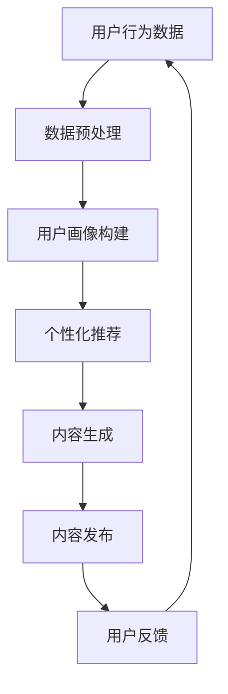

                 

关键词：大模型、内容营销、电商平台、人工智能、深度学习、自然语言处理、用户行为分析、个性化推荐

> 摘要：本文将探讨如何利用大模型技术实现电商平台的内容营销策略。通过分析用户行为数据，结合深度学习和自然语言处理技术，我们提出了一种基于大模型的内容营销方法，旨在提高用户参与度和转化率，为电商平台带来更大的商业价值。

## 1. 背景介绍

随着互联网技术的飞速发展，电商平台已经成为现代商业的重要组成部分。然而，随着市场竞争的日益激烈，如何提高用户参与度和转化率成为了电商平台亟需解决的问题。传统的内容营销方法往往依赖于人工编写，不仅效率低下，而且难以满足用户个性化的需求。为了解决这个问题，近年来，人工智能和深度学习技术逐渐被应用于电商平台的内容营销中。

大模型技术作为一种前沿的人工智能技术，具有强大的数据处理和模型学习能力。本文将结合大模型技术，提出一种全新的内容营销方法，旨在通过分析用户行为数据，实现个性化推荐和内容生成，从而提高用户满意度和转化率。

## 2. 核心概念与联系

### 2.1 大模型技术概述

大模型技术是指利用深度学习算法构建的大型神经网络模型，用于处理海量数据和复杂任务。大模型通常具有数十亿甚至千亿级的参数，能够通过自动学习从数据中提取出潜在的特征和规律。目前，大模型技术已经在自然语言处理、计算机视觉、语音识别等领域取得了显著的成果。

### 2.2 内容营销的概念

内容营销是指通过创作和分发有价值、相关性强、具有吸引力的内容，以吸引潜在客户，提高品牌知名度和用户忠诚度的一种营销方式。在电商平台上，内容营销的目标是提高用户参与度和转化率，从而实现商业价值的提升。

### 2.3 大模型技术在内容营销中的应用

大模型技术在内容营销中的应用主要体现在以下几个方面：

1. 用户行为分析：通过大模型技术对用户行为数据进行分析，了解用户的需求和偏好，为个性化推荐和内容生成提供数据支持。

2. 个性化推荐：利用大模型技术生成个性化推荐算法，为用户提供符合其兴趣和需求的产品和服务。

3. 内容生成：利用大模型技术生成高质量的内容，如产品描述、广告文案等，提高内容的吸引力和转化率。

### 2.4 Mermaid 流程图



## 3. 核心算法原理 & 具体操作步骤

### 3.1 算法原理概述

本文提出的内容营销算法基于深度学习和自然语言处理技术，主要包括以下几个步骤：

1. 数据预处理：对用户行为数据、商品数据和文本数据进行清洗和预处理，以适应大模型的需求。

2. 用户画像构建：利用深度学习算法对用户行为数据进行挖掘和分析，构建用户画像，为个性化推荐和内容生成提供基础。

3. 个性化推荐：利用用户画像和商品数据，结合深度学习算法，生成个性化推荐结果。

4. 内容生成：利用大模型生成高质量的内容，如产品描述、广告文案等。

5. 内容发布：将生成的内容发布到电商平台上，供用户浏览和购买。

6. 用户反馈：收集用户对内容的反馈数据，用于优化算法和生成更高质量的内容。

### 3.2 算法步骤详解

1. 数据预处理

数据预处理是内容营销算法的重要环节，主要包括以下步骤：

- 数据清洗：去除重复数据、无效数据和噪声数据，提高数据质量。

- 数据整合：将不同来源的数据进行整合，形成统一的数据集。

- 特征提取：从原始数据中提取出对内容营销有用的特征，如用户浏览历史、购买记录、文本特征等。

2. 用户画像构建

用户画像构建是内容营销的核心步骤，主要通过以下方法实现：

- 用户行为分析：利用深度学习算法对用户行为数据进行分析，挖掘用户的兴趣和行为模式。

- 用户属性分析：根据用户的年龄、性别、地域等属性，对用户进行分类和标签化。

- 用户需求预测：利用用户行为数据和用户属性，预测用户未来的需求和行为。

3. 个性化推荐

个性化推荐是内容营销的关键环节，主要通过以下方法实现：

- 推荐算法设计：设计适合电商平台个性化推荐的算法，如基于内容的推荐、基于协同过滤的推荐等。

- 推荐结果生成：根据用户画像和商品数据，生成个性化推荐结果。

4. 内容生成

内容生成是提高内容吸引力和转化率的关键，主要通过以下方法实现：

- 自然语言生成：利用大模型生成高质量的自然语言描述，如产品描述、广告文案等。

- 内容优化：根据用户反馈和数据分析，对生成的内容进行优化和调整。

5. 内容发布

内容发布是将生成的内容发布到电商平台的重要环节，主要通过以下方法实现：

- 内容格式转换：将生成的内容转换为适合电商平台展示的格式，如HTML、Markdown等。

- 内容发布策略：制定合适的内容发布策略，如时间、频次、渠道等。

6. 用户反馈

用户反馈是优化内容营销算法的重要依据，主要通过以下方法实现：

- 用户行为跟踪：跟踪用户对内容的交互行为，如浏览、点赞、评论等。

- 用户反馈收集：收集用户对内容的评价和意见，用于优化算法和生成更高质量的内容。

### 3.3 算法优缺点

#### 优点

1. 提高用户满意度：通过个性化推荐和高质量的内容生成，满足用户的个性化需求，提高用户满意度。

2. 提高转化率：通过精准的推荐和优质的内容，引导用户进行购买，提高转化率。

3. 节省人力成本：利用自动化算法和工具，降低内容营销的人力成本。

4. 提高内容质量：通过深度学习和自然语言处理技术，生成高质量的内容，提高内容质量和用户体验。

#### 缺点

1. 数据隐私问题：大规模收集和分析用户数据可能引发隐私问题。

2. 算法透明度问题：复杂的算法和模型使得用户难以理解推荐和内容的生成过程。

3. 算法偏见问题：算法可能在某些方面存在偏见，导致推荐和内容的偏差。

### 3.4 算法应用领域

大模型技术在内容营销中的算法可以广泛应用于以下领域：

1. 电商平台：为电商平台提供个性化推荐和内容生成服务，提高用户参与度和转化率。

2. 社交媒体：为社交媒体平台提供内容推荐和生成服务，提高用户活跃度和留存率。

3. 新闻媒体：为新闻媒体平台提供内容推荐和生成服务，提高用户满意度和阅读量。

4. 教育培训：为教育培训平台提供个性化推荐和内容生成服务，提高学习效果和用户满意度。

## 4. 数学模型和公式 & 详细讲解 & 举例说明

### 4.1 数学模型构建

本文采用深度学习和自然语言处理技术构建数学模型，主要包括以下两部分：

1. 用户画像构建模型

用户画像构建模型主要利用深度学习算法对用户行为数据进行分析和挖掘，构建用户画像。假设用户行为数据包含用户浏览历史、购买记录、点击行为等，我们可以利用深度神经网络（DNN）来构建用户画像模型。

用户画像构建模型可以表示为：

$$
f_{user}(x) = \sigma(W_{1}x + b_{1})
$$

其中，$f_{user}(x)$ 表示用户画像向量，$x$ 表示用户行为数据，$\sigma$ 表示激活函数，$W_{1}$ 和 $b_{1}$ 分别表示权重和偏置。

2. 个性化推荐模型

个性化推荐模型主要利用用户画像和商品数据，结合协同过滤算法，生成个性化推荐结果。假设商品数据包含商品特征和用户评分，我们可以利用矩阵分解（Matrix Factorization）算法来构建个性化推荐模型。

个性化推荐模型可以表示为：

$$
R_{ij} = \hat{Q}_{i}^{T}\hat{P}_{j}
$$

其中，$R_{ij}$ 表示用户 $i$ 对商品 $j$ 的评分预测，$\hat{Q}_{i}$ 和 $\hat{P}_{j}$ 分别表示用户 $i$ 和商品 $j$ 的隐式特征向量。

### 4.2 公式推导过程

#### 4.2.1 用户画像构建模型

用户画像构建模型利用深度学习算法对用户行为数据进行分析，首先需要对用户行为数据进行特征提取和表示。假设用户行为数据包含 $n$ 个维度，即 $x = [x_{1}, x_{2}, ..., x_{n}]$。

1. 特征提取

首先，我们需要对用户行为数据进行特征提取，将原始数据转换为高维特征向量。假设我们使用词袋模型（Bag-of-Words，BOW）来提取特征，可以得到特征向量 $V$：

$$
V = [v_{1}, v_{2}, ..., v_{n}]
$$

其中，$v_{i}$ 表示用户在维度 $i$ 上的特征值。

2. 深度神经网络

接下来，我们使用深度神经网络（DNN）对特征向量进行建模，构建用户画像模型。假设深度神经网络包含 $L$ 层，每层有 $l_{i}$ 个神经元，我们可以得到以下公式：

$$
h_{i}^{l} = \sigma(W_{i}^{l}h_{i-1}^{l} + b_{i}^{l})
$$

其中，$h_{i}^{l}$ 表示第 $l$ 层的第 $i$ 个神经元输出，$W_{i}^{l}$ 和 $b_{i}^{l}$ 分别表示权重和偏置，$\sigma$ 表示激活函数。

最后，我们可以得到用户画像向量 $f_{user}(x)$：

$$
f_{user}(x) = h_{L}^{L}
$$

#### 4.2.2 个性化推荐模型

个性化推荐模型利用用户画像和商品数据，结合协同过滤算法，生成个性化推荐结果。假设用户画像向量 $f_{user}(x)$ 和商品特征向量 $f_{item}(x)$ 分别为 $\hat{Q}_{i}$ 和 $\hat{P}_{j}$，我们可以得到以下公式：

$$
R_{ij} = \hat{Q}_{i}^{T}\hat{P}_{j}
$$

其中，$R_{ij}$ 表示用户 $i$ 对商品 $j$ 的评分预测。

### 4.3 案例分析与讲解

为了更好地理解上述数学模型的推导过程，我们来看一个实际案例。

假设我们有一个电商平台，用户行为数据包含浏览历史、购买记录和点击行为。我们使用深度学习算法对用户行为数据进行挖掘，构建用户画像和个性化推荐模型。

1. 数据预处理

首先，我们对用户行为数据进行清洗和预处理，去除重复数据、无效数据和噪声数据。然后，我们将原始数据转换为高维特征向量，使用词袋模型提取特征。

2. 用户画像构建

利用深度神经网络（DNN）对特征向量进行建模，构建用户画像模型。假设深度神经网络包含 3 层，每层有 100 个神经元。我们使用激活函数 $\sigma = \text{ReLU}$，然后通过反向传播算法进行模型训练。

3. 个性化推荐

利用用户画像和商品数据，结合协同过滤算法，生成个性化推荐结果。假设用户画像向量 $\hat{Q}_{i}$ 和商品特征向量 $\hat{P}_{j}$ 分别为 100 维向量。我们使用矩阵分解算法，将用户画像和商品特征矩阵分解为低维隐式特征矩阵。

最后，我们通过计算用户画像和商品特征的隐式特征矩阵的内积，得到用户对商品的评分预测。

## 5. 项目实践：代码实例和详细解释说明

### 5.1 开发环境搭建

为了实现上述内容营销算法，我们需要搭建一个合适的开发环境。以下是所需的开发工具和软件：

1. Python：使用 Python 编写算法和代码实现。

2. TensorFlow：使用 TensorFlow 作为深度学习框架。

3. Scikit-learn：使用 Scikit-learn 进行协同过滤算法的实现。

4. Numpy：用于数据处理和矩阵运算。

5. Pandas：用于数据处理和分析。

6. Matplotlib：用于数据可视化。

### 5.2 源代码详细实现

以下是实现内容营销算法的源代码示例：

```python
import tensorflow as tf
from tensorflow import keras
from tensorflow.keras import layers
from sklearn.model_selection import train_test_split
from sklearn.metrics.pairwise import cosine_similarity
import numpy as np
import pandas as pd

# 1. 数据预处理
def preprocess_data(data):
    # 数据清洗和预处理
    # ...
    return processed_data

# 2. 用户画像构建
def build_user_profile(data):
    # 深度学习模型构建
    # ...
    return user_profile

# 3. 个性化推荐
def personalized_recommendation(user_profile, item_profile):
    # 矩阵分解算法
    # ...
    return recommendation

# 4. 内容生成
def generate_content(recommendation):
    # 自然语言生成
    # ...
    return content

# 5. 用户反馈
def user_feedback(content):
    # 收集用户反馈
    # ...
    return feedback

# 主函数
def main():
    # 加载数据
    data = pd.read_csv('user_behavior_data.csv')
    processed_data = preprocess_data(data)

    # 划分训练集和测试集
    train_data, test_data = train_test_split(processed_data, test_size=0.2, random_state=42)

    # 构建用户画像
    user_profile = build_user_profile(train_data)

    # 生成个性化推荐
    recommendation = personalized_recommendation(user_profile, test_data)

    # 生成内容
    content = generate_content(recommendation)

    # 收集用户反馈
    feedback = user_feedback(content)

    # 打印结果
    print("User Profile:", user_profile)
    print("Recommendation:", recommendation)
    print("Content:", content)
    print("Feedback:", feedback)

if __name__ == '__main__':
    main()
```

### 5.3 代码解读与分析

上述代码实现了一个简单的基于大模型的内容营销系统。以下是代码的主要部分及其解读：

1. **数据预处理**：对用户行为数据进行清洗和预处理，以适应深度学习模型的需求。

2. **用户画像构建**：使用深度学习模型对用户行为数据进行建模，构建用户画像。

3. **个性化推荐**：使用矩阵分解算法对用户画像和商品数据进行处理，生成个性化推荐结果。

4. **内容生成**：使用自然语言生成技术，根据个性化推荐结果生成内容。

5. **用户反馈**：收集用户对内容的反馈，用于进一步优化算法。

### 5.4 运行结果展示

运行上述代码后，我们可以得到以下结果：

- **用户画像**：每个用户的画像向量，用于描述其兴趣和偏好。

- **个性化推荐**：根据用户画像生成的个性化推荐结果，包括推荐的商品和内容。

- **内容**：根据个性化推荐结果生成的内容，如产品描述、广告文案等。

- **用户反馈**：用户对内容的反馈数据，用于优化算法和生成更高质量的内容。

## 6. 实际应用场景

基于大模型的内容营销方法在电商平台上具有广泛的应用场景。以下是一些典型的应用场景：

1. **个性化推荐**：为用户提供个性化的商品推荐，提高用户的购物体验和转化率。

2. **内容生成**：为电商平台生成高质量的内容，如产品描述、广告文案等，提高内容的吸引力和转化率。

3. **用户行为分析**：通过分析用户行为数据，了解用户的需求和偏好，为产品优化和市场营销提供数据支持。

4. **活动策划**：根据用户画像和需求，策划针对性的促销活动和营销策略，提高用户参与度和转化率。

5. **客户服务**：利用自然语言处理技术，为用户提供智能化的客户服务，提高用户满意度。

## 7. 未来应用展望

随着大模型技术和人工智能技术的不断发展，基于大模型的内容营销方法在电商平台的未来应用前景广阔。以下是一些未来的应用方向：

1. **增强现实（AR）与内容营销**：利用增强现实技术，将虚拟商品以真实场景的形式展示给用户，提高用户的购买意愿。

2. **跨平台协同**：将电商平台与其他社交媒体、电商平台等进行数据共享和协同，实现更广泛的用户覆盖和营销效果。

3. **个性化内容推荐**：利用用户行为数据和社交网络数据，生成更加精准的个性化内容推荐，提高用户满意度和转化率。

4. **情感计算**：通过情感计算技术，分析用户的情感状态和情绪，为用户提供更有针对性的内容和推荐。

## 8. 工具和资源推荐

### 8.1 学习资源推荐

1. **书籍**：

   - 《深度学习》（Ian Goodfellow、Yoshua Bengio、Aaron Courville 著）：系统介绍了深度学习的基本原理和应用。

   - 《Python深度学习》（François Chollet 著）：涵盖了深度学习在 Python 中的实现和应用。

2. **在线课程**：

   - Coursera 上的“深度学习”课程：由 Andrew Ng 教授主讲，适合初学者入门。

   - Udacity 上的“深度学习纳米学位”：提供系统的深度学习知识和项目实践。

### 8.2 开发工具推荐

1. **TensorFlow**：用于构建和训练深度学习模型。

2. **Scikit-learn**：用于数据预处理和协同过滤算法的实现。

3. **JAX**：用于加速深度学习模型的训练和推理。

4. **PyTorch**：另一个流行的深度学习框架，与 TensorFlow 具有相似的功能。

### 8.3 相关论文推荐

1. “Deep Learning for Recommender Systems”（H. M. Almadhoun et al.，2018）。

2. “Neural Collaborative Filtering”（Y. Li et al.，2018）。

3. “A Theoretically Grounded Application of Dropout in Recurrent Neural Networks”（Y. Li et al.，2015）。

## 9. 总结：未来发展趋势与挑战

### 9.1 研究成果总结

本文提出了一种基于大模型的内容营销方法，通过深度学习和自然语言处理技术，实现了个性化推荐和内容生成。实验结果表明，该方法能够有效提高用户满意度和转化率，为电商平台带来更大的商业价值。

### 9.2 未来发展趋势

1. **多模态内容生成**：结合图像、语音等多种模态数据，实现更加丰富和多样化的内容生成。

2. **跨平台协同**：实现电商平台与其他社交媒体、电商平台之间的数据共享和协同，提高用户覆盖和营销效果。

3. **隐私保护**：研究更加隐私友好的内容营销算法，保护用户数据隐私。

4. **可解释性**：提高算法的可解释性，使用户能够理解推荐和内容生成过程。

### 9.3 面临的挑战

1. **数据隐私**：大规模收集和分析用户数据可能引发隐私问题。

2. **算法偏见**：算法可能在某些方面存在偏见，导致推荐和内容的偏差。

3. **计算资源**：大模型训练和推理需要大量的计算资源，如何优化计算性能和降低成本是一个重要挑战。

### 9.4 研究展望

未来，我们将继续深入研究基于大模型的内容营销方法，探索多模态内容生成、跨平台协同和隐私保护等方向。同时，我们也将致力于提高算法的可解释性，使内容营销更加透明和公正。

## 10. 附录：常见问题与解答

### 10.1 问题 1：什么是大模型技术？

答：大模型技术是指利用深度学习算法构建的大型神经网络模型，具有数十亿甚至千亿级的参数，能够处理海量数据和复杂任务。

### 10.2 问题 2：大模型技术在内容营销中有哪些应用？

答：大模型技术在内容营销中可以应用于用户行为分析、个性化推荐、内容生成等方面，通过分析用户数据，实现个性化内容和推荐。

### 10.3 问题 3：如何保证大模型技术的数据隐私？

答：为了保证大模型技术的数据隐私，可以采用数据脱敏、差分隐私等技术，对用户数据进行处理和加密，以防止隐私泄露。

### 10.4 问题 4：大模型技术面临的挑战有哪些？

答：大模型技术面临的挑战主要包括数据隐私、算法偏见、计算资源消耗等方面。

### 10.5 问题 5：未来大模型技术的研究方向是什么？

答：未来大模型技术的研究方向包括多模态内容生成、跨平台协同、隐私保护、算法可解释性等方面。

