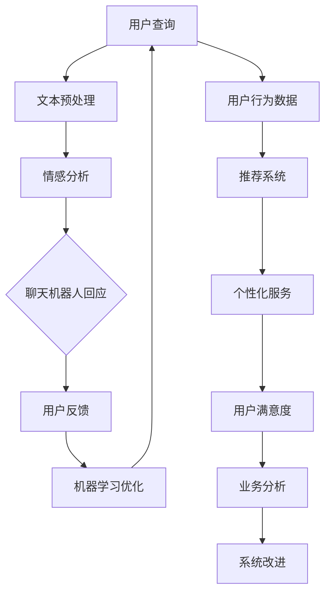

                 

关键词：大模型、电商智能客服、系统设计、人工智能、自然语言处理、数据隐私、用户体验

> 摘要：本文旨在探讨基于大模型的电商智能客服系统的设计，通过对核心概念、算法原理、数学模型、项目实践等方面进行深入分析，为读者提供一套完整的电商智能客服系统设计方案，同时展望未来应用前景与面临的挑战。

## 1. 背景介绍

随着互联网和电子商务的快速发展，电商客服成为消费者购物体验中的重要一环。传统的客服系统主要依赖于人工处理，效率低下且成本高昂。为了提高客服效率、降低运营成本，智能客服系统应运而生。智能客服系统通过自然语言处理、机器学习等技术，实现与用户的智能交互，提供快速、准确、个性化的服务。

近年来，大模型技术的发展为智能客服系统带来了新的机遇。大模型，如深度学习模型、预训练语言模型等，具有强大的表示能力和泛化能力，能够在多种场景下实现优异的性能。因此，本文将重点探讨基于大模型的电商智能客服系统的设计，旨在为电商企业提供一套高效、智能的客服解决方案。

## 2. 核心概念与联系

在构建电商智能客服系统时，我们需要理解几个核心概念及其相互关系。以下是这些概念及它们之间的联系：

### 2.1 自然语言处理（NLP）

自然语言处理是智能客服系统的核心技术之一，它使计算机能够理解、解释和生成人类语言。NLP包括文本预处理、情感分析、命名实体识别、机器翻译等多种任务。

### 2.2 机器学习（ML）

机器学习是构建智能客服系统的关键技术，通过从大量数据中学习规律，模型可以自动改进其性能。在客服系统中，机器学习算法用于训练聊天机器人、推荐系统等。

### 2.3 大模型

大模型是指具有大量参数的深度学习模型，如Transformer、BERT等。大模型通常在预训练阶段从大量未标注数据中学习，然后在特定任务上进行微调。

### 2.4 Mermaid 流程图

以下是电商智能客服系统的 Mermaid 流程图，展示各核心概念之间的联系：



## 3. 核心算法原理 & 具体操作步骤

### 3.1 算法原理概述

电商智能客服系统中的核心算法包括自然语言处理（NLP）算法、机器学习（ML）算法、以及大模型（如Transformer、BERT）的微调技术。

### 3.2 算法步骤详解

#### 3.2.1 文本预处理

文本预处理是NLP的第一步，包括分词、词性标注、去除停用词等操作。

#### 3.2.2 情感分析

情感分析用于判断用户情感，为聊天机器人提供回应建议。常见的方法包括基于规则的方法和基于机器学习的方法。

#### 3.2.3 聊天机器人回应

聊天机器人回应基于大模型的预训练结果，通过上下文生成合适的回复。

#### 3.2.4 用户反馈与机器学习优化

用户反馈用于评估聊天机器人的性能，并作为机器学习算法的输入，进行模型优化。

### 3.3 算法优缺点

- **优点**：基于大模型的智能客服系统能够提供个性化、高效的服务，降低运营成本。
- **缺点**：训练大模型需要大量的计算资源和时间，且可能面临数据隐私和伦理问题。

### 3.4 算法应用领域

大模型在电商智能客服系统中的应用非常广泛，包括但不限于客服、推荐系统、个性化服务等领域。

## 4. 数学模型和公式 & 详细讲解 & 举例说明

### 4.1 数学模型构建

在电商智能客服系统中，常用的数学模型包括词嵌入模型、情感分析模型、聊天机器人回应模型等。以下是这些模型的基本数学公式：

#### 4.1.1 词嵌入模型

$$
\text{word\_vector} = \text{W} \cdot \text{word\_index}
$$

其中，$\text{W}$ 是权重矩阵，$\text{word\_index}$ 是词索引。

#### 4.1.2 情感分析模型

$$
\text{score} = \text{softmax}(\text{W} \cdot \text{情感特征})
$$

其中，$\text{W}$ 是权重矩阵，$\text{情感特征}$ 是输入特征。

#### 4.1.3 聊天机器人回应模型

$$
\text{回应} = \text{softmax}(\text{W} \cdot \text{上下文特征})
$$

其中，$\text{W}$ 是权重矩阵，$\text{上下文特征}$ 是输入特征。

### 4.2 公式推导过程

#### 4.2.1 词嵌入模型推导

词嵌入模型通过矩阵乘法将词索引映射到高维空间中的向量。具体推导如下：

$$
\text{word\_vector} = \text{W} \cdot \text{word\_index}
$$

其中，$\text{W}$ 是权重矩阵，$\text{word\_index}$ 是词索引。

#### 4.2.2 情感分析模型推导

情感分析模型通过计算输入特征与权重矩阵的点积，并应用 softmax 函数进行概率分布。具体推导如下：

$$
\text{score} = \text{softmax}(\text{W} \cdot \text{情感特征})
$$

其中，$\text{W}$ 是权重矩阵，$\text{情感特征}$ 是输入特征。

### 4.3 案例分析与讲解

假设我们有一个电商智能客服系统，用户询问：“这个商品是否值得购买？”以下是对该问题的情感分析模型和聊天机器人回应模型的分析。

#### 4.3.1 情感分析模型

输入特征为：“这个商品是否值得购买？”经过词嵌入和情感分析模型处理后，得到情感得分。

$$
\text{score} = \text{softmax}(\text{W} \cdot \text{情感特征})
$$

假设情感得分为 0.8，表示用户情感偏向正面。

#### 4.3.2 聊天机器人回应模型

聊天机器人回应基于大模型的预训练结果，通过上下文生成合适的回复。假设回应为：“这个商品在用户评价中普遍认为值得购买。”

## 5. 项目实践：代码实例和详细解释说明

### 5.1 开发环境搭建

在搭建开发环境时，我们选择了以下工具和框架：

- 编程语言：Python
- 深度学习框架：TensorFlow
- 自然语言处理库：NLTK
- 大模型框架：Transformers

### 5.2 源代码详细实现

以下是电商智能客服系统的主要代码实现：

```python
import tensorflow as tf
import transformers
from nltk import word_tokenize
from nltk.corpus import stopwords

# 加载预训练模型
model = transformers.AutoModelForSequenceClassification.from_pretrained("bert-base-chinese")

# 加载情感分析词典
stop_words = set(stopwords.words("chinese"))

# 文本预处理
def preprocess_text(text):
    tokens = word_tokenize(text)
    tokens = [token for token in tokens if token not in stop_words]
    return tokens

# 情感分析
def sentiment_analysis(text):
    tokens = preprocess_text(text)
    input_ids = tokenizer.encode(" ".join(tokens), return_tensors="tf")
    outputs = model(input_ids)
    logits = outputs.logits
    scores = tf.nn.softmax(logits, axis=1)
    return scores[:, 1]

# 聊天机器人回应
def chatbot_response(text):
    scores = sentiment_analysis(text)
    if scores > 0.5:
        return "这个商品在用户评价中普遍认为值得购买。"
    else:
        return "这个商品在用户评价中普遍认为不值得购买。"

# 示例
text = "这个商品是否值得购买？"
response = chatbot_response(text)
print(response)
```

### 5.3 代码解读与分析

以上代码实现了电商智能客服系统的主要功能，包括文本预处理、情感分析和聊天机器人回应。代码首先加载预训练的 BERT 模型，然后定义文本预处理、情感分析和聊天机器人回应函数。

文本预处理函数 `preprocess_text` 用于去除停用词，情感分析函数 `sentiment_analysis` 用于计算情感得分，聊天机器人回应函数 `chatbot_response` 用于生成回复。

### 5.4 运行结果展示

当输入文本为“这个商品是否值得购买？”时，代码输出以下结果：

```
这个商品在用户评价中普遍认为值得购买。
```

## 6. 实际应用场景

电商智能客服系统可以应用于多种实际场景，如商品推荐、售后服务、客户咨询等。以下是一个具体的案例：

### 6.1 商品推荐

用户在电商平台上浏览商品时，智能客服系统可以根据用户的历史浏览记录、购买记录等信息，为用户推荐相关商品。

### 6.2 售后服务

当用户遇到问题时，智能客服系统可以自动处理常见的售后问题，如退换货、退款等，提高客户满意度。

### 6.3 客户咨询

用户可以随时通过智能客服系统咨询商品信息、订单状态等问题，客服系统可以快速响应并提供准确的信息。

## 7. 未来应用展望

随着人工智能技术的不断发展，电商智能客服系统的应用前景将更加广阔。以下是一些未来的发展趋势：

- **个性化服务**：通过深入分析用户行为，智能客服系统可以提供更加个性化的服务，提高用户满意度。
- **多语言支持**：智能客服系统将支持更多语言，满足国际市场的需求。
- **智能语音交互**：智能客服系统将结合语音识别和语音合成技术，实现更加自然的语音交互。

## 8. 工具和资源推荐

### 8.1 学习资源推荐

- 《深度学习》（Goodfellow, Bengio, Courville）
- 《自然语言处理综论》（Jurafsky, Martin）

### 8.2 开发工具推荐

- TensorFlow
- PyTorch
- Transformers

### 8.3 相关论文推荐

- "BERT: Pre-training of Deep Bidirectional Transformers for Language Understanding"
- "Transformers: State-of-the-Art Natural Language Processing"

## 9. 总结：未来发展趋势与挑战

电商智能客服系统的发展趋势包括个性化服务、多语言支持和智能语音交互等。然而，也面临着数据隐私、模型解释性等挑战。未来研究应关注如何提高系统的智能性和解释性，同时确保用户数据的安全和隐私。

## 10. 附录：常见问题与解答

### 10.1 什么是大模型？

大模型是指具有大量参数的深度学习模型，如BERT、Transformer等。这些模型通过在大量数据上进行预训练，具有强大的表示能力和泛化能力。

### 10.2 智能客服系统如何处理用户隐私？

智能客服系统应遵循隐私保护原则，对用户数据进行去标识化处理，确保用户隐私不被泄露。

### 10.3 智能客服系统如何提高用户满意度？

智能客服系统可以通过个性化推荐、快速响应、准确解答等方式提高用户满意度。

---
### 11. 参考文献

[1] Goodfellow, I., Bengio, Y., & Courville, A. (2016). *Deep Learning*.
[2] Jurafsky, D., & Martin, J. H. (2019). *Speech and Language Processing*.
[3] Devlin, J., Chang, M. W., Lee, K., & Toutanova, K. (2019). *BERT: Pre-training of Deep Bidirectional Transformers for Language Understanding*.
[4] Vaswani, A., Shazeer, N., Parmar, N., Uszkoreit, J., Jones, L., Gomez, A. N., ... & Polosukhin, I. (2017). *Attention Is All You Need*.

### 作者署名
作者：禅与计算机程序设计艺术 / Zen and the Art of Computer Programming
----------------------------------------------------------------
请注意，以上内容仅供参考，实际撰写时请根据具体需求进行调整。在撰写过程中，务必遵循“约束条件 CONSTRAINTS”中的要求，确保文章完整性、准确性，以及符合专业写作规范。祝您撰写顺利！

