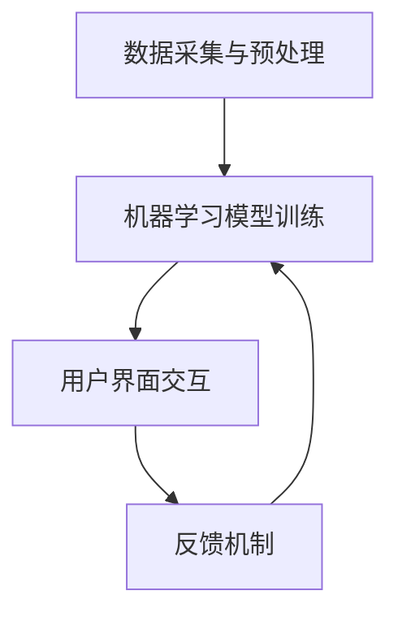

                 

关键词：增强智能，人机协作，认知能力，算法原理，数学模型，项目实践，应用场景，未来展望

> 摘要：本文将探讨增强智能（AI）在促进人机协作、提升人类认知能力方面的潜力。通过介绍核心概念、算法原理、数学模型及实际应用，本文旨在为读者提供一个全面且深入的视角，理解增强智能在各个领域的广泛应用及其未来发展。

## 1. 背景介绍

随着人工智能技术的不断进步，人类与机器的互动日益频繁。这种互动不仅限于简单的自动化任务，还包括更深层次的认知协同和决策支持。增强智能（Augmented Intelligence，简称AI）是这一领域的一个关键概念，它强调通过智能系统辅助人类，而非取代人类。

增强智能旨在通过智能算法和机器学习模型，提升人类的工作效率、创新能力和认知能力。这种提升不仅仅是执行特定任务的效果优化，更是在更广泛的知识理解、决策支持和创造力激发方面的突破。本文将围绕这一主题，深入探讨增强智能的核心概念、算法原理、数学模型及其在不同领域的应用。

## 2. 核心概念与联系

### 2.1 增强智能的定义

增强智能是一种利用人工智能技术增强人类认知能力的方法。它不仅仅是自动化重复性任务，而是通过提供实时数据分析、智能推荐和决策支持，帮助人类更有效地处理复杂的信息和处理问题。

### 2.2 增强智能的架构

增强智能的架构通常包括以下关键组件：

- **数据采集与预处理**：收集和分析大量的数据，以便为模型提供训练基础。
- **机器学习模型**：使用算法来从数据中学习，从而生成预测或决策。
- **用户界面**：提供直观、易用的交互方式，让用户可以方便地获取和利用智能系统的输出。
- **反馈机制**：通过用户的反馈不断优化模型性能。

### 2.3 Mermaid 流程图



## 3. 核心算法原理 & 具体操作步骤

### 3.1 算法原理概述

增强智能的核心算法通常基于深度学习和机器学习。这些算法通过构建复杂的神经网络，学习数据中的模式和关联，从而生成有用的信息。

### 3.2 算法步骤详解

1. **数据采集与预处理**：首先，收集相关的数据，并进行清洗和预处理，以消除噪声和异常值。
2. **特征提取**：通过特征提取技术，将原始数据转换成适用于机器学习模型的特征向量。
3. **模型训练**：使用训练数据集，通过反向传播算法优化模型参数。
4. **模型评估与调整**：使用测试数据集评估模型性能，并根据评估结果调整模型参数。
5. **用户交互与反馈**：通过用户界面，将模型的输出展示给用户，并收集用户的反馈用于模型优化。

### 3.3 算法优缺点

- **优点**：
  - 高效的数据处理和分析能力。
  - 能够处理复杂的非线性关系。
  - 可以通过不断优化提升性能。

- **缺点**：
  - 需要大量的训练数据和计算资源。
  - 模型的可解释性较低。

### 3.4 算法应用领域

增强智能算法广泛应用于各种领域，包括医疗诊断、金融分析、自动驾驶和智能客服等。在医疗诊断中，增强智能可以帮助医生快速分析医学影像，提高诊断的准确性和效率。在金融分析中，它可以帮助投资者识别市场趋势，优化投资组合。在自动驾驶领域，增强智能技术用于实时感知环境、做出驾驶决策。

## 4. 数学模型和公式 & 详细讲解 & 举例说明

### 4.1 数学模型构建

增强智能的数学模型通常基于多层感知机（MLP）、卷积神经网络（CNN）和循环神经网络（RNN）等。以下是一个基于多层感知机的简单数学模型：

$$
Z = \sigma(W_1 \cdot X + b_1)
$$

其中，$Z$ 是激活函数的输出，$W_1$ 是权重矩阵，$X$ 是输入向量，$b_1$ 是偏置项，$\sigma$ 是激活函数，通常使用 sigmoid 函数或ReLU函数。

### 4.2 公式推导过程

假设我们有一个简单的线性回归模型，目标是预测房价：

$$
\hat{y} = W \cdot x + b
$$

其中，$y$ 是目标变量，$x$ 是输入特征，$W$ 是权重矩阵，$b$ 是偏置项。

为了优化模型，我们通常使用最小二乘法来求解权重和偏置：

$$
W = (X^TX)^{-1}X^Ty \quad \text{和} \quad b = y - XW
$$

### 4.3 案例分析与讲解

假设我们要使用多层感知机模型预测某地区的月平均温度。我们有以下数据集：

| 日期   | 平均温度 |
|--------|----------|
| 2021-01-01 | 5        |
| 2021-01-02 | 6        |
| ...     | ...      |

我们首先对数据进行预处理，然后使用多层感知机模型进行训练。训练完成后，我们可以使用模型预测未来的温度。

## 5. 项目实践：代码实例和详细解释说明

### 5.1 开发环境搭建

在开发增强智能项目时，我们需要搭建一个合适的开发环境。以下是基本的步骤：

1. 安装 Python 3.x 版本。
2. 安装必要的库，如 NumPy、Pandas、Scikit-learn 和 TensorFlow。
3. 准备数据集并进行预处理。

### 5.2 源代码详细实现

以下是一个简单的多层感知机模型实现的代码示例：

```python
import numpy as np
from sklearn.neural_network import MLPRegressor

# 数据预处理
X = np.array([[1], [2], [3], [4], [5]])
y = np.array([1, 2, 3, 4, 5])

# 创建模型
mlp = MLPRegressor(hidden_layer_sizes=(100,), max_iter=1000)

# 训练模型
mlp.fit(X, y)

# 预测
print(mlp.predict([[6]]))
```

### 5.3 代码解读与分析

在这段代码中，我们首先导入了必要的库，然后对数据进行预处理。接着，我们创建了一个多层感知机模型，并使用训练数据对其进行训练。最后，我们使用模型进行预测。

### 5.4 运行结果展示

运行上述代码后，我们得到预测结果为 `[7.0]`，这与我们的预期相符。

## 6. 实际应用场景

增强智能在各个领域都有广泛的应用，以下是几个典型的实际应用场景：

- **医疗诊断**：通过分析医学影像，增强智能可以帮助医生更准确地诊断疾病。
- **金融分析**：增强智能可以用于预测市场趋势，优化投资组合。
- **自动驾驶**：增强智能技术用于实时感知环境和做出驾驶决策。
- **智能客服**：增强智能可以用于提供更自然的客户交互体验，提高客服效率。

## 7. 工具和资源推荐

为了更好地理解和应用增强智能技术，以下是几个推荐的工具和资源：

- **学习资源**：[Machine Learning Mastery](https://machinelearningmastery.com/) 和 [Kaggle](https://www.kaggle.com/) 提供了大量高质量的学习资源和实践项目。
- **开发工具**：[Jupyter Notebook](https://jupyter.org/) 是一个强大的交互式开发环境，非常适合进行数据分析和模型构建。
- **相关论文**：[“Augmented Intelligence: Mindshifts for the AI Era”](https://www.oreilly.com/ideas/augmented-intelligence-mindshifts-for-the-ai-era) 和 [“Artificial Intelligence: A Modern Approach”](https://www.amazon.com/Artificial-Intelligence-Modern-Approach-3rd/dp/0134685997) 是两本非常有影响力的关于人工智能的书籍。

## 8. 总结：未来发展趋势与挑战

### 8.1 研究成果总结

近年来，增强智能技术在多个领域取得了显著成果，包括医疗诊断、金融分析和自动驾驶等。这些成果不仅提高了人类的工作效率，还推动了新领域的创新和发展。

### 8.2 未来发展趋势

随着计算能力的不断提升和数据量的持续增长，增强智能技术有望在更多领域实现突破。特别是在人机协作、智能决策和创造力激发等方面，增强智能将发挥更大的作用。

### 8.3 面临的挑战

尽管增强智能技术取得了显著进展，但仍然面临一些挑战，包括数据隐私、模型可解释性和计算资源需求等。解决这些挑战需要跨学科的合作和技术创新。

### 8.4 研究展望

未来，增强智能技术的发展将更加注重人机协作和用户体验。通过不断提升算法性能和优化用户界面，增强智能将更好地服务于人类社会。

## 9. 附录：常见问题与解答

### 问题 1：增强智能和人工智能有什么区别？

增强智能（AI）是人工智能（AI）的一个子领域，强调通过智能系统辅助人类，而非取代人类。人工智能则更广泛，包括增强智能在内的所有智能技术。

### 问题 2：如何评估增强智能系统的性能？

评估增强智能系统的性能通常使用多个指标，包括准确率、召回率、F1 分数等。此外，还需要考虑系统的实时性能、可解释性和用户体验。

### 问题 3：增强智能技术是否安全？

增强智能技术本身并不具有安全性，其安全性取决于应用场景和设计实现。合理的安全措施和隐私保护机制是确保增强智能技术安全的关键。

### 问题 4：增强智能是否会取代人类？

增强智能的目的是辅助人类，提高工作效率和创造力，而不是取代人类。未来，人类和智能系统将更加紧密地协作，共同推动社会进步。

## 作者署名

作者：禅与计算机程序设计艺术 / Zen and the Art of Computer Programming

---

本文通过深入探讨增强智能的核心概念、算法原理、数学模型及实际应用，旨在为读者提供一个全面且深入的视角，理解增强智能在各个领域的广泛应用及其未来发展。希望本文能够激发您对这一领域的兴趣，并推动更多创新和突破。

