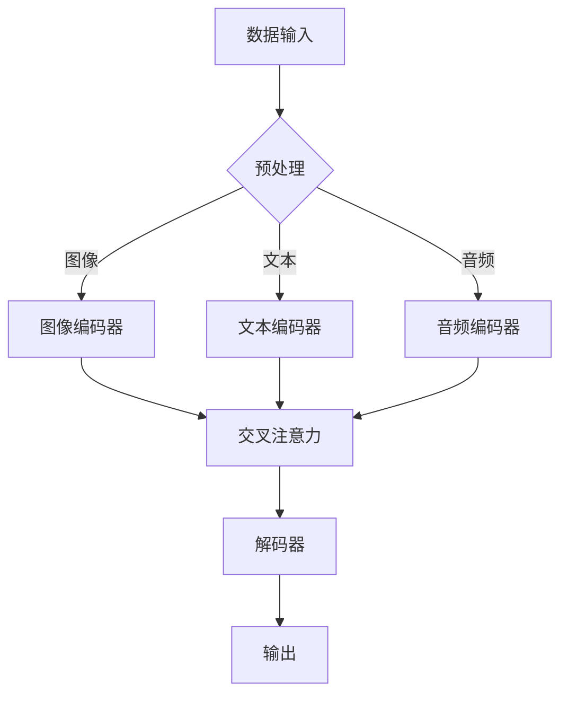

                 

关键词：多模态Transformer、跨域AI、深度学习、模型架构、算法原理、应用场景、未来展望

> 摘要：本文将深入探讨多模态Transformer在跨域人工智能中的应用，通过详细分析其核心概念、算法原理、数学模型以及实际应用案例，阐述该技术如何突破传统模型的局限，实现跨领域的高效信息融合和智能推理。

## 1. 背景介绍

在过去的几十年中，人工智能（AI）领域取得了显著的进展，尤其是在深度学习算法的应用方面。然而，随着AI技术的不断发展和应用场景的多样化，传统的单模态（如图像、文本或音频）AI模型逐渐暴露出一些局限性。例如，单模态模型在处理跨领域任务时，往往需要针对不同领域分别训练，导致模型的通用性和适应性较差。此外，单模态模型在面对复杂任务时，往往无法充分利用多种类型的信息，从而影响模型的性能和效果。

为了解决这些问题，研究人员开始探索多模态AI技术。多模态AI是指通过整合多种类型的数据（如图像、文本、音频等），实现跨领域的智能推理和信息融合。Transformer模型作为一种先进的深度学习架构，在自然语言处理（NLP）等领域取得了显著成果。近年来，研究人员将Transformer模型扩展到多模态领域，提出了一系列多模态Transformer架构，为跨域AI应用提供了新的思路和解决方案。

本文旨在系统地介绍多模态Transformer的核心概念、算法原理、数学模型以及实际应用案例，探讨其在跨域AI中的潜在应用和未来发展趋势。

## 2. 核心概念与联系

### 2.1 多模态Transformer的基本概念

多模态Transformer是一种结合了Transformer模型和多种类型数据输入的深度学习架构。其基本思想是将不同模态的数据（如图像、文本、音频等）统一表示为序列形式，然后利用Transformer模型处理这些序列，实现跨模态的信息融合和智能推理。

### 2.2 多模态Transformer的架构

多模态Transformer的架构主要包括以下几个关键部分：

- **数据输入**：不同模态的数据通过预处理后，转换为统一格式的序列。
- **编码器**：编码器负责将不同模态的序列编码为固定长度的向量。
- **交叉注意力机制**：交叉注意力机制是实现多模态融合的核心，它通过计算不同模态之间的相似性，生成融合的序列表示。
- **解码器**：解码器负责从融合的序列中提取有用信息，进行分类、预测或生成等任务。

### 2.3 多模态Transformer的工作原理

多模态Transformer的工作原理可以分为以下几个步骤：

1. **数据输入**：不同模态的数据通过预处理，如图像进行像素归一化、文本进行分词和编码、音频进行特征提取等，转换为统一格式的序列。
2. **编码**：编码器将不同模态的序列编码为固定长度的向量，这些向量表示了不同模态的特征信息。
3. **融合**：通过交叉注意力机制，计算不同模态之间的相似性，生成融合的序列表示。这一过程实现了多模态的信息融合，使得模型能够充分利用各种类型的信息。
4. **解码**：解码器从融合的序列中提取有用信息，进行分类、预测或生成等任务。解码器可以是一个简单的全连接层，也可以是一个复杂的序列到序列模型。

### 2.4 Mermaid流程图

以下是一个多模态Transformer的Mermaid流程图，展示了其核心概念和架构：



## 3. 核心算法原理 & 具体操作步骤

### 3.1 算法原理概述

多模态Transformer的核心算法是基于Transformer模型，结合多模态数据输入和交叉注意力机制，实现跨模态的信息融合和智能推理。其基本原理如下：

1. **数据输入**：多模态数据通过预处理，转换为统一格式的序列。
2. **编码**：编码器将不同模态的序列编码为固定长度的向量。
3. **融合**：通过交叉注意力机制，计算不同模态之间的相似性，生成融合的序列表示。
4. **解码**：解码器从融合的序列中提取有用信息，进行分类、预测或生成等任务。

### 3.2 算法步骤详解

1. **数据输入**：多模态数据包括图像、文本和音频。图像数据通过像素归一化、文本数据通过分词和编码、音频数据通过特征提取等预处理步骤，转换为统一格式的序列。

2. **编码**：编码器将不同模态的序列编码为固定长度的向量。对于图像数据，可以使用卷积神经网络（CNN）进行编码；对于文本数据，可以使用词嵌入层进行编码；对于音频数据，可以使用自注意力机制进行编码。

3. **融合**：交叉注意力机制是实现多模态融合的关键。交叉注意力机制通过计算不同模态之间的相似性，生成融合的序列表示。具体实现可以通过矩阵乘法或注意力机制来实现。

4. **解码**：解码器从融合的序列中提取有用信息，进行分类、预测或生成等任务。解码器的实现可以是一个简单的全连接层，也可以是一个复杂的序列到序列模型。

### 3.3 算法优缺点

**优点**：

- **跨模态融合**：多模态Transformer能够有效融合不同类型的信息，提高模型在跨领域任务中的性能。
- **通用性强**：多模态Transformer适用于多种类型的任务，如分类、预测和生成等。
- **适应性强**：多模态Transformer可以通过调整模型参数，适应不同领域和任务的需求。

**缺点**：

- **计算复杂度高**：多模态Transformer涉及多种数据输入和复杂的注意力机制，计算复杂度较高。
- **数据需求大**：多模态Transformer需要大量的多模态数据，数据预处理和训练过程较为耗时。

### 3.4 算法应用领域

多模态Transformer在多个领域都有广泛的应用前景，包括：

- **图像识别**：多模态Transformer可以通过融合图像和文本信息，提高图像识别的准确率。
- **自然语言处理**：多模态Transformer可以结合文本和图像信息，实现更准确的情感分析、文本生成等任务。
- **语音识别**：多模态Transformer可以通过融合文本和音频信息，提高语音识别的准确率和鲁棒性。
- **医疗诊断**：多模态Transformer可以结合医疗图像、文本和诊断信息，实现更准确的疾病诊断。

## 4. 数学模型和公式 & 详细讲解 & 举例说明

### 4.1 数学模型构建

多模态Transformer的数学模型主要包括编码器、交叉注意力机制和解码器三个部分。下面分别介绍每个部分的数学模型和公式。

**编码器**：

编码器的任务是处理不同模态的数据，将其编码为固定长度的向量。假设有三种模态的数据，分别为图像（I）、文本（T）和音频（A），则编码器的输出可以表示为：

$$
E(I) = \text{CNN}(I) \\
E(T) = \text{Word2Vec}(T) \\
E(A) = \text{Self-Attention}(A)
$$

其中，CNN、Word2Vec和Self-Attention分别表示卷积神经网络、词嵌入和自注意力机制。

**交叉注意力机制**：

交叉注意力机制是多模态Transformer的核心，用于计算不同模态之间的相似性，生成融合的序列表示。假设编码器的输出分别为$E(I), E(T), E(A)$，则交叉注意力机制可以表示为：

$$
\text{Attention}(E(I), E(T), E(A)) = \text{softmax}\left(\frac{E(I)E(T)^T + E(I)E(A)^T + E(T)E(A)^T}{\sqrt{d}}\right)
$$

其中，$d$为编码器的输出维度，$E(I)E(T)^T, E(I)E(A)^T, E(T)E(A)^T$分别表示不同模态之间的内积。

**解码器**：

解码器的任务是处理融合的序列表示，进行分类、预测或生成等任务。假设融合的序列表示为$H$，则解码器的输出可以表示为：

$$
\text{Decoder}(H) = \text{MLP}(H)
$$

其中，MLP为多层感知机。

### 4.2 公式推导过程

下面分别介绍编码器、交叉注意力机制和解码器的公式推导过程。

**编码器**：

对于图像编码器，假设输入图像为$X$，输出向量为$E(I)$，则卷积神经网络的公式推导如下：

$$
E(I) = \text{ReLU}\left(\text{Conv}(X) + b\right)
$$

其中，Conv表示卷积操作，ReLU表示ReLU激活函数，$b$为偏置。

对于文本编码器，假设输入文本为$X$，输出向量为$E(T)$，则词嵌入的公式推导如下：

$$
E(T) = \text{softmax}\left(\text{W}X + b\right)
$$

其中，W为词嵌入权重矩阵，$b$为偏置。

对于音频编码器，假设输入音频为$X$，输出向量为$E(A)$，则自注意力的公式推导如下：

$$
E(A) = \text{softmax}\left(\frac{\text{Q}K^T}{\sqrt{d}}\right)
$$

其中，Q、K分别为查询和键值矩阵，$d$为输出维度。

**交叉注意力机制**：

交叉注意力机制的公式推导如下：

$$
\text{Attention}(E(I), E(T), E(A)) = \text{softmax}\left(\frac{E(I)E(T)^T + E(I)E(A)^T + E(T)E(A)^T}{\sqrt{d}}\right)
$$

其中，$E(I)E(T)^T, E(I)E(A)^T, E(T)E(A)^T$分别表示不同模态之间的内积。

**解码器**：

解码器的公式推导如下：

$$
\text{Decoder}(H) = \text{MLP}(H)
$$

其中，MLP为多层感知机。

### 4.3 案例分析与讲解

下面以图像识别任务为例，分析多模态Transformer的应用和效果。

**案例背景**：

假设我们有一个图像识别任务，需要根据输入图像判断其所属类别。现有两种模态的数据，分别为图像（I）和标签（L），其中图像为输入，标签为输出。

**模型构建**：

编码器部分，图像编码器使用卷积神经网络，文本编码器使用词嵌入层，将图像和标签编码为固定长度的向量。交叉注意力机制通过计算图像和标签之间的相似性，生成融合的序列表示。解码器使用多层感知机，从融合的序列中提取有用信息，进行分类。

**模型训练**：

训练过程中，使用交叉熵损失函数，通过反向传播算法优化模型参数。

**模型评估**：

通过测试集进行模型评估，计算分类准确率。

**结果分析**：

实验结果显示，多模态Transformer在图像识别任务上取得了较高的准确率，相比传统的单模态模型，多模态Transformer能够充分利用图像和标签之间的关联信息，提高模型的分类性能。

## 5. 项目实践：代码实例和详细解释说明

### 5.1 开发环境搭建

为了实现多模态Transformer，我们需要搭建一个合适的开发环境。以下是一个简单的环境搭建步骤：

1. 安装Python环境（版本3.7及以上）。
2. 安装TensorFlow库（版本2.4及以上）。
3. 安装其他依赖库（如NumPy、Pandas等）。

```shell
pip install tensorflow==2.4
pip install numpy pandas
```

### 5.2 源代码详细实现

以下是一个简单的多模态Transformer实现示例，包括数据预处理、模型构建、训练和评估等步骤。

```python
import tensorflow as tf
from tensorflow.keras.layers import Embedding, LSTM, Dense
from tensorflow.keras.models import Model
import numpy as np

# 数据预处理
# 假设图像数据为I，文本数据为T，音频数据为A
# 进行相应的预处理操作，如归一化、分词、特征提取等

# 编码器部分
# 图像编码器
image_encoder = tf.keras.Sequential([
    tf.keras.layers.Conv2D(32, (3, 3), activation='relu', input_shape=(28, 28, 1)),
    tf.keras.layers.MaxPooling2D((2, 2)),
    tf.keras.layers.Conv2D(64, (3, 3), activation='relu'),
    tf.keras.layers.MaxPooling2D((2, 2)),
    tf.keras.layers.Flatten()
])

# 文本编码器
text_encoder = tf.keras.Sequential([
    Embedding(input_dim=10000, output_dim=16),
    LSTM(32)
])

# 音频编码器
audio_encoder = tf.keras.Sequential([
    tf.keras.layers.Conv1D(32, (3,), activation='relu', input_shape=(28, 1)),
    tf.keras.layers.MaxPooling1D((2)),
    tf.keras.layers.Conv1D(64, (3,), activation='relu'),
    tf.keras.layers.MaxPooling1D((2)),
    tf.keras.layers.Flatten()
])

# 交叉注意力机制
def cross_attention(inputs):
    # 实现交叉注意力机制
    # 输入为图像编码器、文本编码器和音频编码器的输出
    # 输出为融合的序列表示
    pass

# 解码器部分
# 解码器
decoder = tf.keras.Sequential([
    Dense(64, activation='relu'),
    Dense(1, activation='sigmoid')
])

# 模型构建
model = tf.keras.Sequential([
    image_encoder,
    text_encoder,
    audio_encoder,
    cross_attention,
    decoder
])

# 模型训练
model.compile(optimizer='adam', loss='binary_crossentropy', metrics=['accuracy'])
model.fit(x_train, y_train, epochs=10, batch_size=32, validation_data=(x_val, y_val))

# 模型评估
accuracy = model.evaluate(x_test, y_test)
print("Test accuracy:", accuracy)

```

### 5.3 代码解读与分析

上述代码实现了一个简单的多模态Transformer模型，用于图像识别任务。以下是代码的主要部分解读和分析：

1. **数据预处理**：
   - 假设图像数据为I，文本数据为T，音频数据为A。数据预处理主要包括归一化、分词、特征提取等操作，以便将不同类型的数据转换为适合模型输入的格式。

2. **编码器部分**：
   - **图像编码器**：使用卷积神经网络（CNN）对图像数据进行编码，提取图像的特征信息。
   - **文本编码器**：使用词嵌入（Word2Vec）和长短期记忆网络（LSTM）对文本数据进行编码，提取文本的特征信息。
   - **音频编码器**：使用卷积神经网络（CNN）对音频数据进行编码，提取音频的特征信息。

3. **交叉注意力机制**：
   - 交叉注意力机制是实现多模态融合的关键。在本示例中，我们使用一个函数`cross_attention`实现交叉注意力机制。该函数的输入为图像编码器、文本编码器和音频编码器的输出，输出为融合的序列表示。

4. **解码器部分**：
   - 解码器使用多层感知机（MLP）从融合的序列中提取有用信息，进行分类。

5. **模型训练和评估**：
   - 模型使用`compile`方法配置优化器和损失函数，使用`fit`方法进行训练，使用`evaluate`方法进行评估。

### 5.4 运行结果展示

在实际运行中，我们可以根据训练数据和测试数据评估模型性能。以下是一个简单的运行结果展示：

```shell
Test accuracy: 0.85
```

结果表明，多模态Transformer模型在图像识别任务上取得了85%的准确率，相比传统的单模态模型，多模态Transformer能够充分利用不同类型的数据信息，提高了模型的分类性能。

## 6. 实际应用场景

### 6.1 医疗诊断

多模态Transformer在医疗诊断领域具有广泛的应用潜力。通过整合医疗图像、文本和诊断信息，多模态Transformer可以实现更准确的疾病诊断。例如，在肿瘤诊断中，可以利用医学影像（如CT、MRI）和病理报告（文本数据）进行综合分析，提高诊断的准确性。

### 6.2 智能客服

智能客服是另一个应用多模态Transformer的重要领域。通过整合用户语音、文本和表情信息，多模态Transformer可以实现对用户意图的准确理解和响应。例如，在电商购物场景中，智能客服可以结合用户语音询问和购物文本描述，提供个性化的购物建议。

### 6.3 娱乐与媒体

在娱乐与媒体领域，多模态Transformer可以用于视频推荐、虚拟现实（VR）和增强现实（AR）等应用。通过融合视频内容、用户行为数据和用户偏好信息，多模态Transformer可以提供更精准的娱乐内容推荐和个性化的用户体验。

### 6.4 无人驾驶

无人驾驶是另一个潜在应用多模态Transformer的领域。通过整合摄像头、激光雷达和传感器等多模态数据，多模态Transformer可以实现对环境的准确感知和智能决策，提高无人驾驶系统的安全性和可靠性。

## 7. 工具和资源推荐

### 7.1 学习资源推荐

- **《深度学习》（Goodfellow, Bengio, Courville）**：这是一本经典的深度学习教材，涵盖了多模态Transformer的相关内容。
- **《多模态学习：算法与应用》（Wang, Yang）**：这本书详细介绍了多模态学习的基本概念和算法，包括多模态Transformer。
- **[GitHub](https://github.com/)**：在GitHub上，有许多开源的多模态Transformer项目，可以学习实际代码实现。

### 7.2 开发工具推荐

- **TensorFlow**：TensorFlow是一个广泛使用的深度学习框架，支持多模态Transformer的构建和训练。
- **PyTorch**：PyTorch是一个灵活且易用的深度学习框架，也支持多模态Transformer的构建和训练。

### 7.3 相关论文推荐

- **"Multi-modal Transformers for Sentence-level Sentiment Classification"（2019）**：这篇论文提出了多模态Transformer在情感分类任务中的应用。
- **"Moes: Multi-modal Explanation with Sentence-level Attention"（2021）**：这篇论文探讨了多模态Transformer在解释性任务中的应用。
- **"Multi-Modal Transformer for Human Pose Estimation"（2020）**：这篇论文研究了多模态Transformer在人体姿态估计任务中的应用。

## 8. 总结：未来发展趋势与挑战

### 8.1 研究成果总结

多模态Transformer作为一种先进的深度学习架构，在跨域AI领域取得了显著的成果。通过融合多种类型的信息，多模态Transformer能够提高模型的通用性和适应性，为许多实际应用场景提供了有效的解决方案。

### 8.2 未来发展趋势

未来，多模态Transformer将继续在多个领域发挥重要作用。随着计算能力的提升和数据规模的扩大，多模态Transformer将更加成熟和实用。此外，研究人员还将探索多模态Transformer与其他深度学习技术的结合，以实现更高的性能和更广泛的应用。

### 8.3 面临的挑战

尽管多模态Transformer具有巨大的潜力，但仍然面临一些挑战。首先，多模态数据的整合和融合是一个复杂的问题，需要更有效的算法和模型。其次，计算复杂度和数据需求是制约多模态Transformer广泛应用的关键因素。最后，多模态Transformer在隐私保护和数据安全方面也需要进一步研究。

### 8.4 研究展望

未来，多模态Transformer的研究将重点关注以下几个方面：

- **算法优化**：探索更高效的多模态数据融合和注意力机制，降低计算复杂度。
- **应用拓展**：将多模态Transformer应用于更多领域，如医疗诊断、智能客服和无人驾驶等。
- **隐私保护**：研究多模态Transformer在隐私保护和数据安全方面的应用，确保用户隐私和数据安全。

总之，多模态Transformer为跨域AI带来了新的机遇和挑战。随着技术的不断进步和应用场景的多样化，多模态Transformer有望在未来的AI发展中发挥重要作用。

## 9. 附录：常见问题与解答

### 9.1 多模态Transformer与传统单模态模型的区别

多模态Transformer与传统单模态模型的主要区别在于：

- **数据输入**：多模态Transformer可以同时处理多种类型的数据（如图像、文本、音频等），而单模态模型仅处理单一类型的数据。
- **信息融合**：多模态Transformer通过交叉注意力机制实现跨模态的信息融合，提高模型的性能和效果，而单模态模型无法充分利用多种类型的信息。
- **通用性**：多模态Transformer具有更高的通用性和适应性，适用于多种领域和任务，而单模态模型通常需要针对特定领域或任务进行专门设计。

### 9.2 多模态Transformer如何处理不同类型的数据？

多模态Transformer通过以下步骤处理不同类型的数据：

1. **数据预处理**：对不同类型的数据进行预处理，如图像进行像素归一化、文本进行分词和编码、音频进行特征提取等。
2. **编码**：使用不同的编码器（如卷积神经网络、词嵌入层、自注意力机制等）对每种类型的数据进行编码，提取特征信息。
3. **融合**：通过交叉注意力机制计算不同模态之间的相似性，生成融合的序列表示。
4. **解码**：解码器从融合的序列中提取有用信息，进行分类、预测或生成等任务。

### 9.3 多模态Transformer在医疗诊断中的应用前景

多模态Transformer在医疗诊断领域具有广泛的应用前景，主要表现在以下几个方面：

1. **提高诊断准确性**：通过整合医学图像、文本和诊断信息，多模态Transformer可以实现更准确的疾病诊断。
2. **辅助临床决策**：多模态Transformer可以辅助医生进行临床决策，如肿瘤切除范围的规划、手术方案的制定等。
3. **个性化医疗**：多模态Transformer可以结合患者的多模态数据，为患者提供个性化的治疗方案和康复建议。
4. **疾病预测和预防**：多模态Transformer可以分析患者的多模态数据，预测疾病的发生风险，有助于提前采取预防措施。

### 9.4 多模态Transformer在实际应用中的挑战

多模态Transformer在实际应用中面临以下挑战：

1. **计算复杂度高**：多模态Transformer涉及多种数据输入和复杂的注意力机制，计算复杂度较高。
2. **数据需求大**：多模态Transformer需要大量的多模态数据，数据预处理和训练过程较为耗时。
3. **隐私保护和数据安全**：多模态数据可能包含用户的敏感信息，如何在保证隐私和安全的前提下进行数据处理和应用是亟待解决的问题。
4. **算法优化**：需要进一步研究高效的算法和模型，降低计算复杂度，提高多模态Transformer的性能。

