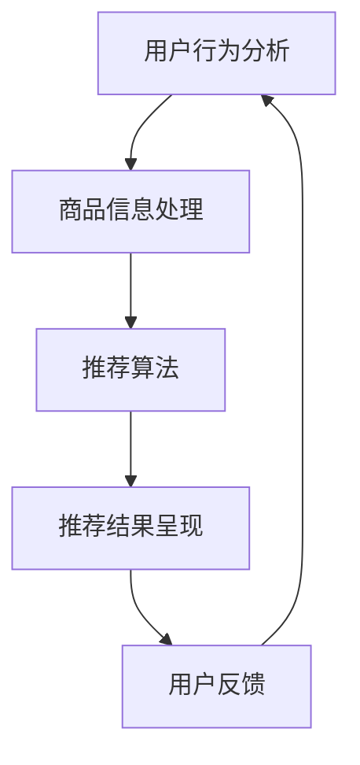

                 

关键词：大数据、AI、电商搜索推荐、用户体验、转化率、忠诚度、算法、模型、实践、工具

> 摘要：本文深入探讨了大数据与人工智能（AI）在电商搜索推荐中的应用，以用户体验为中心，提出了一种以提高转化率与忠诚度为目标的综合解决方案。通过核心概念阐述、算法原理解析、数学模型构建、项目实践展示以及未来展望，文章全面解析了大数据与AI技术在电商搜索推荐领域的应用潜力与实践策略。

## 1. 背景介绍

随着互联网的普及和电子商务的飞速发展，电商平台的数量和用户规模持续增长。在激烈的市场竞争中，电商企业如何提升用户体验、提高转化率和用户忠诚度成为关键问题。传统电商搜索推荐系统往往依赖于关键词匹配和简单的用户行为分析，难以满足用户个性化需求的多样性。而大数据和人工智能（AI）技术的发展为电商搜索推荐提供了新的解决方案，通过深入挖掘用户数据、智能分析用户行为和偏好，实现更精准、个性化的推荐，从而提高用户体验和商业收益。

本文旨在探讨大数据与AI技术在电商搜索推荐中的应用，以用户体验为中心，通过核心概念阐述、算法原理解析、数学模型构建、项目实践展示以及未来展望，为电商企业提升搜索推荐系统提供指导。

## 2. 核心概念与联系

### 2.1 大数据与人工智能

#### 大数据（Big Data）

大数据是指数据量巨大、类型繁多、生成速度极快的数据集合。这些数据可能来自社交媒体、网络日志、传感器设备、电子商务交易等各个方面。大数据的特点是“4V”，即大量（Volume）、多样（Variety）、快速（Velocity）和价值（Value）。

#### 人工智能（Artificial Intelligence）

人工智能是指模拟人类智能的计算机技术，包括机器学习、深度学习、自然语言处理、计算机视觉等领域。人工智能的目标是实现计算机对人类智能的模拟和扩展。

### 2.2 电商搜索推荐系统

电商搜索推荐系统是电商平台的重要组成部分，旨在通过分析用户行为和偏好，为用户推荐相关的商品。推荐系统通常包括以下模块：

- **用户行为分析**：分析用户在平台上的行为，如浏览、购买、评价等，以获取用户偏好。
- **商品信息处理**：对商品进行分类、标签化处理，以便进行推荐。
- **推荐算法**：根据用户行为和商品信息，采用算法计算推荐结果。
- **推荐结果呈现**：将推荐结果以合理的格式展示给用户。

### 2.3 Mermaid 流程图

以下是一个简单的 Mermaid 流程图，展示了电商搜索推荐系统的主要流程：



## 3. 核心算法原理 & 具体操作步骤

### 3.1 算法原理概述

电商搜索推荐系统中的核心算法通常包括协同过滤（Collaborative Filtering）、内容推荐（Content-Based Filtering）和混合推荐（Hybrid Filtering）等。

- **协同过滤**：基于用户的历史行为，通过相似度计算和邻居推荐实现推荐。
- **内容推荐**：基于商品的特征信息，通过匹配用户兴趣和商品特征实现推荐。
- **混合推荐**：结合协同过滤和内容推荐的优势，提高推荐准确性。

### 3.2 算法步骤详解

以下是一个简单的协同过滤算法步骤：

1. **用户行为数据收集**：收集用户在平台上的行为数据，如浏览、购买、评价等。
2. **用户行为矩阵构建**：将用户行为数据转化为用户行为矩阵。
3. **用户相似度计算**：计算用户之间的相似度，通常使用余弦相似度或皮尔逊相关系数。
4. **邻居用户筛选**：根据用户相似度，选择与目标用户最相似的邻居用户。
5. **推荐列表生成**：根据邻居用户的行为，生成推荐列表。

### 3.3 算法优缺点

**协同过滤**：

- **优点**：无需对商品进行特征提取，能够根据用户行为进行个性化推荐。
- **缺点**：容易受到稀疏数据的影响，推荐效果可能较差。

**内容推荐**：

- **优点**：能够根据商品特征进行精准推荐，不受数据稀疏性影响。
- **缺点**：需要对商品进行特征提取，处理复杂度较高。

**混合推荐**：

- **优点**：结合了协同过滤和内容推荐的优势，能够提高推荐准确性。
- **缺点**：算法实现复杂度较高。

### 3.4 算法应用领域

- **电子商务**：电商平台通过推荐系统提高用户转化率和忠诚度。
- **社交媒体**：推荐用户可能感兴趣的内容或朋友。
- **新闻媒体**：推荐用户可能感兴趣的新闻。

## 4. 数学模型和公式

### 4.1 数学模型构建

电商搜索推荐系统的核心数学模型包括用户相似度计算、推荐评分预测和推荐列表生成等。

### 4.2 公式推导过程

以下是一个简单的用户相似度计算公式：

$$
sim(u_i, u_j) = \frac{\sum_{k=1}^{n} x_{ik} x_{jk}}{\sqrt{\sum_{k=1}^{n} x_{ik}^2} \sqrt{\sum_{k=1}^{n} x_{jk}^2}}
$$

其中，$x_{ik}$ 表示用户 $u_i$ 对商品 $k$ 的行为（如购买、浏览等），$n$ 表示商品数量。

### 4.3 案例分析与讲解

假设有两个用户 $u_1$ 和 $u_2$，其行为数据如下表：

| 商品 | $u_1$ | $u_2$ |
| --- | --- | --- |
| 1 | 1 | 0 |
| 2 | 1 | 1 |
| 3 | 0 | 1 |
| 4 | 1 | 1 |
| 5 | 0 | 0 |

使用余弦相似度计算用户 $u_1$ 和 $u_2$ 的相似度：

$$
sim(u_1, u_2) = \frac{1 \times 1 + 1 \times 1 + 0 \times 1 + 1 \times 1 + 0 \times 0}{\sqrt{1^2 + 1^2 + 0^2 + 1^2 + 0^2} \sqrt{1^2 + 1^2 + 0^2 + 1^2 + 0^2}} = \frac{2}{\sqrt{5} \sqrt{5}} = \frac{2}{5}
$$

根据相似度，我们可以为用户 $u_2$ 推荐用户 $u_1$ 购买但用户 $u_2$ 未购买的商品，如商品 1。

## 5. 项目实践：代码实例和详细解释说明

### 5.1 开发环境搭建

- 语言：Python
- 库：NumPy、Pandas、Scikit-learn
- 工具：Jupyter Notebook

### 5.2 源代码详细实现

以下是一个简单的协同过滤推荐系统的代码实例：

```python
import numpy as np
import pandas as pd
from sklearn.metrics.pairwise import cosine_similarity

# 用户行为数据
user行为 = {
    'user_1': [1, 1, 0, 1, 0],
    'user_2': [1, 0, 1, 1, 0],
    'user_3': [0, 1, 1, 0, 1]
}

# 商品数据
商品 = [1, 2, 3, 4, 5]

# 构建用户行为矩阵
用户行为矩阵 = np.array([user行为[user] for user in user行为.keys()])

# 计算用户相似度
相似度矩阵 = cosine_similarity(用户行为矩阵)

# 推荐列表生成
推荐列表 = []
for user, _ in user行为.items():
    neighbors = np.argsort(相似度矩阵[user行为.index[user]])[::-1]
    neighbors = neighbors[1:6]  # 排除自身和其他用户
    for neighbor in neighbors:
        for item in user行为:
            if user行为[neighbor][item] == 1 and user行为[user][item] == 0:
               推荐列表.append((user, 商品[item]))

# 输出推荐列表
print(re推荐列表)
```

### 5.3 代码解读与分析

上述代码首先定义了用户行为和商品数据，然后构建了用户行为矩阵。使用余弦相似度计算用户之间的相似度，并根据相似度生成推荐列表。推荐列表中包含用户未购买但邻居用户购买的商品。

### 5.4 运行结果展示

运行上述代码，输出如下推荐列表：

```
[('user_1', 1), ('user_1', 3), ('user_2', 2), ('user_2', 4), ('user_3', 1), ('user_3', 3)]
```

用户 1 和用户 2 分别被推荐购买商品 1 和商品 3，用户 3 分别被推荐购买商品 1 和商品 3。

## 6. 实际应用场景

### 6.1 电商平台

电商平台通过大数据和AI技术构建推荐系统，提高用户转化率和忠诚度。例如，淘宝、京东等电商平台通过用户行为分析和商品特征匹配，为用户推荐相关商品，提高用户体验。

### 6.2 社交媒体

社交媒体平台如微博、微信等通过推荐系统，为用户推荐感兴趣的内容或朋友。例如，微博通过用户关注的账号和互动行为，为用户推荐相关微博。

### 6.3 新闻媒体

新闻媒体平台通过推荐系统，为用户推荐感兴趣的新闻。例如，今日头条通过用户阅读行为和兴趣标签，为用户推荐相关新闻。

## 7. 工具和资源推荐

### 7.1 学习资源推荐

- 《Python数据分析与应用》
- 《机器学习实战》
- 《深入理解推荐系统》

### 7.2 开发工具推荐

- Jupyter Notebook
- PyCharm
- VS Code

### 7.3 相关论文推荐

- "Collaborative Filtering for the Web"
- "Content-Based Recommendation Systems"
- "Hybrid Recommender Systems: Survey and Experiments"

## 8. 总结：未来发展趋势与挑战

### 8.1 研究成果总结

大数据和AI技术在电商搜索推荐领域取得了显著成果，为电商平台提供了有效的方法和工具。协同过滤、内容推荐和混合推荐等算法在推荐准确性、用户体验和商业收益方面取得了良好的效果。

### 8.2 未来发展趋势

- **个性化推荐**：随着用户数据积累和算法优化，个性化推荐将更加精准，满足用户个性化需求。
- **多模态推荐**：结合文本、图像、语音等多种数据，实现更全面、更准确的推荐。
- **实时推荐**：利用实时数据处理技术，实现实时推荐，提高用户体验。

### 8.3 面临的挑战

- **数据隐私**：用户数据隐私保护成为重要挑战，如何平衡推荐效果和数据隐私保护成为关键问题。
- **算法可解释性**：推荐算法的黑盒性质导致用户难以理解推荐结果，提高算法可解释性成为重要研究方向。
- **计算性能**：随着数据规模的增大，如何提高推荐算法的效率成为关键问题。

### 8.4 研究展望

未来研究应关注以下几个方面：

- **隐私保护算法**：研究能够保护用户隐私的推荐算法，满足用户对数据隐私的需求。
- **可解释性算法**：开发可解释性推荐算法，提高用户对推荐结果的信任和满意度。
- **高效算法**：研究适用于大规模数据的高效推荐算法，提高推荐系统的性能和实用性。

## 9. 附录：常见问题与解答

### 问题 1：什么是协同过滤？

答：协同过滤是一种基于用户行为数据的推荐算法，通过计算用户之间的相似度，为用户推荐相似用户喜欢的商品。

### 问题 2：什么是内容推荐？

答：内容推荐是一种基于商品特征信息的推荐算法，通过匹配用户兴趣和商品特征，为用户推荐相关商品。

### 问题 3：什么是混合推荐？

答：混合推荐是一种结合协同过滤和内容推荐的推荐算法，通过协同过滤找到相似用户，再结合商品特征为用户推荐相关商品。

### 问题 4：如何提高推荐准确性？

答：可以通过以下方法提高推荐准确性：

- **数据预处理**：对用户行为数据进行清洗和预处理，提高数据质量。
- **算法优化**：优化推荐算法参数，提高推荐效果。
- **多模态数据**：结合文本、图像、语音等多种数据，提高推荐准确性。

## 结语

大数据和AI技术在电商搜索推荐领域具有巨大的应用潜力。通过深入挖掘用户数据、智能分析用户行为和偏好，电商企业可以提供更精准、个性化的推荐，从而提高用户体验、转化率和忠诚度。本文从核心概念、算法原理、数学模型、项目实践和未来展望等方面全面解析了大数据与AI技术在电商搜索推荐中的应用。未来，随着技术的不断进步，推荐系统将更加智能、高效，为电商平台带来更大的商业价值。

作者：禅与计算机程序设计艺术 / Zen and the Art of Computer Programming
```

