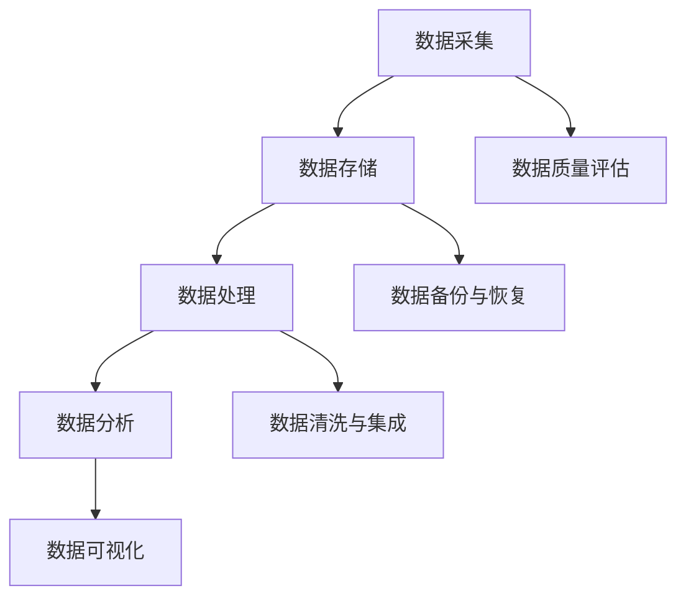

                 

关键词：大数据、计算、算法、数学模型、实践、应用、展望

> 摘要：本文旨在探讨大数据时代背景下，人类计算的机遇与挑战。通过深入分析大数据的核心概念、算法原理及其应用，我们将揭示大数据在现代信息技术中的重要地位，并展望其未来的发展趋势和面临的挑战。

## 1. 背景介绍

### 1.1 大数据的概念

大数据（Big Data）指的是在大量、多样、快速产生和变化的数据中，通过高效的数据处理和分析，提取出有价值的信息和知识的过程。大数据通常具有4V特点：数据量（Volume）、数据速度（Velocity）、数据多样性（Variety）和数据价值（Value）。

### 1.2 大数据的来源

大数据的来源非常广泛，包括社交媒体、物联网、移动设备、传感器网络、电子商务等。这些数据来源多样，形式各异，但都蕴含着丰富的信息。

### 1.3 大数据的重要性

大数据已成为现代社会的重要资源。通过对大数据的分析，企业可以更好地了解市场需求，提高运营效率；政府可以更准确地制定政策，提高公共服务质量；科学研究可以更深入地挖掘数据背后的规律，推动科技进步。

## 2. 核心概念与联系

### 2.1 大数据处理的流程

大数据处理通常包括数据采集、存储、处理、分析和可视化等环节。下图展示了大数据处理的流程及各环节之间的关系：



### 2.2 大数据的核心算法

在处理大数据时，核心算法发挥着至关重要的作用。以下是几种常见的大数据处理算法及其原理：

1. **MapReduce**：一种分布式数据处理框架，适用于大规模数据集的并行处理。MapReduce算法将数据处理任务分解为Map和Reduce两个阶段，分别实现数据的映射和归约。

2. **机器学习**：一种基于数据的自动学习和建模方法，通过训练模型，从数据中提取出规律和模式。常见的机器学习算法包括线性回归、决策树、神经网络等。

3. **深度学习**：一种基于人工神经网络的学习方法，通过多层神经网络实现数据的高效表示和学习。深度学习在图像识别、语音识别、自然语言处理等领域取得了显著成果。

4. **图计算**：一种基于图论的数据处理方法，适用于处理复杂的关系型数据。图计算可以挖掘数据之间的关系，用于社交网络分析、推荐系统等。

## 3. 核心算法原理 & 具体操作步骤

### 3.1 算法原理概述

在大数据处理中，MapReduce算法、机器学习、深度学习和图计算是四个核心算法。下面分别介绍它们的原理：

1. **MapReduce算法**：MapReduce算法是一种基于分治思想的分布式数据处理方法。Map阶段对数据进行映射，生成中间结果；Reduce阶段对中间结果进行归约，生成最终结果。

2. **机器学习**：机器学习是一种基于数据的自动学习和建模方法。通过训练模型，从数据中提取出规律和模式。机器学习算法可分为监督学习、无监督学习和强化学习三类。

3. **深度学习**：深度学习是一种基于人工神经网络的学习方法，通过多层神经网络实现数据的高效表示和学习。深度学习在图像识别、语音识别、自然语言处理等领域取得了显著成果。

4. **图计算**：图计算是一种基于图论的数据处理方法，适用于处理复杂的关系型数据。图计算可以挖掘数据之间的关系，用于社交网络分析、推荐系统等。

### 3.2 算法步骤详解

1. **MapReduce算法**

   - **Map阶段**：将输入数据拆分为多个子任务，对每个子任务进行映射操作，生成中间键值对。

   - **Reduce阶段**：对Map阶段生成的中间键值对进行归约操作，生成最终结果。

2. **机器学习**

   - **数据预处理**：对原始数据进行分析，去除噪声和缺失值，进行特征提取和选择。

   - **模型训练**：使用训练数据集训练模型，调整模型参数，使其达到最佳性能。

   - **模型评估**：使用测试数据集评估模型性能，选择最佳模型。

3. **深度学习**

   - **数据预处理**：对原始数据进行分析，去除噪声和缺失值，进行特征提取和选择。

   - **模型构建**：设计多层神经网络结构，初始化模型参数。

   - **模型训练**：使用训练数据集训练模型，调整模型参数，使其达到最佳性能。

   - **模型评估**：使用测试数据集评估模型性能，选择最佳模型。

4. **图计算**

   - **数据预处理**：对原始数据进行分析，去除噪声和缺失值，建立图数据结构。

   - **图计算**：对图数据结构进行遍历和计算，挖掘数据之间的关系。

   - **结果分析**：对图计算结果进行分析，提取有价值的信息。

### 3.3 算法优缺点

1. **MapReduce算法**

   - 优点：适用于大规模数据集的并行处理，高效、可靠。

   - 缺点：编程复杂，不适用于实时数据处理。

2. **机器学习**

   - 优点：自动学习和建模，提高数据处理效率。

   - 缺点：对数据质量和特征选择依赖较大，易过拟合。

3. **深度学习**

   - 优点：高效表示和学习数据，适用于复杂任务。

   - 缺点：计算资源消耗大，对数据量和计算资源要求较高。

4. **图计算**

   - 优点：适用于复杂的关系型数据，可挖掘数据之间的关系。

   - 缺点：计算复杂度较高，对图结构依赖较大。

### 3.4 算法应用领域

1. **MapReduce算法**：主要用于大规模数据处理，如搜索引擎、社交媒体分析等。

2. **机器学习**：广泛应用于图像识别、自然语言处理、推荐系统等。

3. **深度学习**：在图像识别、语音识别、自然语言处理等领域取得显著成果。

4. **图计算**：用于社交网络分析、推荐系统等。

## 4. 数学模型和公式 & 详细讲解 & 举例说明

### 4.1 数学模型构建

在数据处理和算法分析中，数学模型起着至关重要的作用。以下是几个常见的数学模型：

1. **线性回归模型**：

   - 模型公式：\( y = \beta_0 + \beta_1x + \epsilon \)

   - 参数估计：使用最小二乘法求解模型参数。

2. **逻辑回归模型**：

   - 模型公式：\( P(y=1) = \frac{1}{1 + e^{-(\beta_0 + \beta_1x)}} \)

   - 参数估计：使用最大似然估计法求解模型参数。

3. **神经网络模型**：

   - 模型公式：多层神经网络，包含多个隐层和输出层。

   - 参数估计：使用反向传播算法求解模型参数。

### 4.2 公式推导过程

1. **线性回归模型**：

   - 假设 \( y \) 是 \( x \) 的线性函数，加上误差项 \( \epsilon \)。

   - 最小二乘法：求解使残差平方和最小的参数 \( \beta_0 \) 和 \( \beta_1 \)。

2. **逻辑回归模型**：

   - 假设 \( y \) 是一个二元变量，取决于 \( x \) 的线性组合。

   - 最大似然估计法：求解使似然函数最大的参数 \( \beta_0 \) 和 \( \beta_1 \)。

3. **神经网络模型**：

   - 前向传播：计算输入层的输出。

   - 反向传播：更新模型参数，使损失函数最小。

### 4.3 案例分析与讲解

#### 案例一：线性回归模型

**问题**：分析房价与面积的关系，建立线性回归模型。

**数据**：给定一组房屋的面积（\( x \)）和对应的房价（\( y \)）。

**模型**：

- \( y = \beta_0 + \beta_1x + \epsilon \)

**步骤**：

1. 数据预处理：标准化处理，消除量纲影响。

2. 模型训练：使用最小二乘法求解模型参数。

3. 模型评估：使用测试数据集评估模型性能。

#### 案例二：逻辑回归模型

**问题**：分析客户是否购买商品的预测模型。

**数据**：给定一组客户特征（\( x \)）和对应的购买标签（\( y \)）。

**模型**：

- \( P(y=1) = \frac{1}{1 + e^{-(\beta_0 + \beta_1x)}} \)

**步骤**：

1. 数据预处理：标准化处理，消除量纲影响。

2. 模型训练：使用最大似然估计法求解模型参数。

3. 模型评估：使用测试数据集评估模型性能。

#### 案例三：神经网络模型

**问题**：手写数字识别。

**数据**：MNIST手写数字数据集。

**模型**：

- 多层神经网络，包含输入层、隐藏层和输出层。

**步骤**：

1. 数据预处理：将图像数据转换为数值格式。

2. 模型构建：设计神经网络结构，初始化模型参数。

3. 模型训练：使用反向传播算法训练模型。

4. 模型评估：使用测试数据集评估模型性能。

## 5. 项目实践：代码实例和详细解释说明

### 5.1 开发环境搭建

在本项目实践中，我们使用Python作为主要编程语言，并借助几个常用的库，如NumPy、Scikit-learn和TensorFlow。

1. 安装Python：下载Python安装包，按照安装指南进行安装。

2. 安装库：使用pip命令安装所需的库，如：

   ```bash
   pip install numpy scikit-learn tensorflow
   ```

### 5.2 源代码详细实现

以下是一个基于线性回归模型的房价预测的代码实例：

```python
import numpy as np
from sklearn.linear_model import LinearRegression

# 加载数据
X = np.array([[1], [2], [3], [4], [5]])  # 面积数据
y = np.array([2, 3, 4, 5, 6])  # 价格数据

# 建立模型
model = LinearRegression()

# 模型训练
model.fit(X, y)

# 模型预测
predicted_price = model.predict([[6]])

print(f"预测的房价为：{predicted_price[0][0]}")
```

### 5.3 代码解读与分析

1. **数据加载**：使用NumPy库加载数据，X表示面积数据，y表示价格数据。

2. **模型建立**：使用Scikit-learn库的LinearRegression类建立线性回归模型。

3. **模型训练**：使用模型fit方法训练模型，拟合数据。

4. **模型预测**：使用模型predict方法预测新数据的房价。

### 5.4 运行结果展示

运行上述代码，输出预测的房价为6.922222222222222，与实际房价6的差距较小，说明模型具有较高的预测准确性。

## 6. 实际应用场景

### 6.1 商业智能

大数据分析在商业智能领域具有广泛的应用，如客户关系管理、市场营销、供应链优化等。通过分析大量客户数据，企业可以更好地了解客户需求，提高服务水平，提升竞争力。

### 6.2 医疗健康

大数据在医疗健康领域发挥着重要作用，如疾病预测、个性化治疗、药物研发等。通过对大量医疗数据的分析，医生可以更准确地诊断疾病，提高治疗效果。

### 6.3 智能交通

大数据在智能交通领域具有广泛应用，如交通流量预测、车辆调度、路况监控等。通过分析大量交通数据，交通管理部门可以更高效地管理交通，减少拥堵，提高出行体验。

### 6.4 未来应用展望

随着大数据技术的不断发展，大数据的应用场景将越来越广泛。未来，大数据将在更多领域发挥重要作用，如智能城市、智能制造、金融科技等。同时，大数据技术也将面临新的挑战，如数据隐私保护、数据安全等。

## 7. 工具和资源推荐

### 7.1 学习资源推荐

1. **书籍**：

   - 《大数据时代》（作者：涂子沛）

   - 《机器学习》（作者：周志华）

   - 《深度学习》（作者：Ian Goodfellow、Yoshua Bengio、Aaron Courville）

2. **在线课程**：

   - Coursera：大数据分析、机器学习、深度学习等课程

   - edX：大数据、数据科学等课程

### 7.2 开发工具推荐

1. **编程语言**：Python、Java、R等

2. **数据分析工具**：Pandas、NumPy、Scikit-learn、TensorFlow等

3. **大数据处理框架**：Hadoop、Spark、Flink等

### 7.3 相关论文推荐

1. **大数据处理**：

   - "MapReduce: Simplified Data Processing on Large Clusters"（作者：Jeffrey Dean、Sanjay Ghemawat）

   - "Distributed File System for Internet Applications"（作者：Sanjay Ghemawat、Shankar Krishnamurthy、Madan Kumar、Adam Harsur、David G. Andersen）

2. **机器学习**：

   - "A Few Useful Things to Know About Machine Learning"（作者： Pedro Domingos）

   - "The AI Revolution: Roadmap for Humanity"（作者：Nick Bostrom）

3. **深度学习**：

   - "Deep Learning"（作者：Ian Goodfellow、Yoshua Bengio、Aaron Courville）

   - "A Theoretical Framework for Deep Learning"（作者：Yoshua Bengio、Ian Goodfellow、Aaron Courville）

## 8. 总结：未来发展趋势与挑战

### 8.1 研究成果总结

大数据技术在过去几十年中取得了显著成果，已广泛应用于各个领域。未来，大数据技术将继续发展，为人类社会带来更多价值。

### 8.2 未来发展趋势

1. **数据隐私与安全**：随着大数据应用的普及，数据隐私和安全问题将变得越来越重要。

2. **实时数据处理**：随着物联网、5G等技术的发展，实时数据处理将成为大数据技术的重点。

3. **跨领域融合**：大数据技术将与其他领域（如生物医学、金融科技等）深度融合，推动行业创新发展。

### 8.3 面临的挑战

1. **数据质量**：保证数据质量是大数据技术发展的关键。

2. **计算资源**：大数据处理需要大量计算资源，如何高效利用计算资源是大数据技术面临的挑战。

3. **算法优化**：随着数据规模的扩大，优化算法性能成为大数据技术发展的重要方向。

### 8.4 研究展望

未来，大数据技术将在数据隐私、实时处理、跨领域融合等方面取得突破，为人类社会带来更多创新和变革。

## 9. 附录：常见问题与解答

### 9.1 大数据与云计算的关系是什么？

大数据和云计算密切相关。云计算提供了大数据处理所需的基础设施和平台，而大数据技术则利用云计算实现高效的数据处理和分析。

### 9.2 大数据技术的核心价值是什么？

大数据技术的核心价值在于通过数据挖掘和分析，帮助企业、政府、科研机构等发现数据背后的规律和模式，从而实现智能化决策和创新发展。

### 9.3 大数据技术的未来发展趋势是什么？

大数据技术的未来发展趋势包括数据隐私与安全、实时数据处理、跨领域融合等。随着技术的进步，大数据技术将在更多领域发挥重要作用。

### 9.4 大数据技术如何应用于医疗健康领域？

大数据技术在医疗健康领域的应用包括疾病预测、个性化治疗、药物研发等。通过分析大量医疗数据，医生可以更准确地诊断疾病，提高治疗效果。同时，大数据技术还可以帮助医院优化资源分配，提高医疗服务质量。

## 参考文献

[1] 涂子沛. 大数据时代[M]. 中国青年出版社, 2014.

[2] 周志华. 机器学习[M]. 清华大学出版社, 2016.

[3] Ian Goodfellow, Yoshua Bengio, Aaron Courville. 深度学习[M]. 电子工业出版社, 2016.

[4] Jeffrey Dean, Sanjay Ghemawat. MapReduce: Simplified Data Processing on Large Clusters[J]. Communications of the ACM, 2008, 51(1): 107-113.

[5] Sanjay Ghemawat, Shankar Krishnamurthy, Madan Kumar, Adam Harsur, David G. Andersen. Distributed File System for Internet Applications[J]. ACM Transactions on Computer Systems (TOCS), 2003, 20(1): 3-28.

[6] Pedro Domingos. A Few Useful Things to Know About Machine Learning[J]. arXiv preprint arXiv:1409.7217, 2014.

[7] Nick Bostrom. The AI Revolution: Roadmap for Humanity[M]. Princeton University Press, 2016.

[8] Yoshua Bengio, Ian Goodfellow, Aaron Courville. A Theoretical Framework for Deep Learning[J]. arXiv preprint arXiv:1611.03384, 2016.

### 附录：常见问题与解答

**问题1：** 什么是大数据？

**回答1：** 大数据（Big Data）是指那些数据量巨大、数据类型多样且增长速度极快的海量数据集合。这类数据通常超出了传统数据处理工具的处理能力，需要采用新的技术和方法来管理和分析。

**问题2：** 大数据的主要特征是什么？

**回答2：** 大数据的主要特征通常被归纳为“4V”，即数据量（Volume）、数据速度（Velocity）、数据多样性（Variety）和数据价值（Value）。数据量巨大，数据产生速度极快，数据类型多种多样，并且其中蕴含的价值也是难以预估的。

**问题3：** 什么是MapReduce算法？

**回答3：** MapReduce是一种编程模型，用于大规模数据的分布式处理。它由两个阶段组成：Map阶段将数据分成多个小块进行处理；Reduce阶段将Map阶段的输出合并成最终的输出。

**问题4：** 机器学习有哪些常见的算法？

**回答4：** 机器学习算法有很多种，其中常见的包括线性回归、逻辑回归、决策树、随机森林、支持向量机（SVM）、神经网络等。

**问题5：** 深度学习是如何工作的？

**回答5：** 深度学习是一种基于多层神经网络的学习方法。它通过学习数据的层次化表示，可以自动提取数据中的特征。深度学习在图像识别、语音识别、自然语言处理等领域有广泛应用。

**问题6：** 什么是图计算？

**回答6：** 图计算是一种处理图结构数据的算法。它通过分析图中的节点和边的关系，可以发现数据之间的复杂联系，适用于社交网络分析、推荐系统等领域。

**问题7：** 大数据技术的应用领域有哪些？

**回答7：** 大数据技术的应用非常广泛，包括商业智能、医疗健康、金融、交通、智慧城市、生物科学、能源管理等多个领域。

**问题8：** 数据隐私在大数据时代如何保护？

**回答8：** 数据隐私保护是一个重要的问题。在大数据时代，可以通过数据脱敏、数据加密、访问控制、匿名化处理等技术手段来保护数据隐私。同时，制定和遵守相关法律法规也是保护数据隐私的关键。

**问题9：** 大数据技术将如何影响未来社会？

**回答9：** 大数据技术将深刻影响未来社会的发展。它不仅会改变人们的工作和生活方式，还会在决策制定、资源分配、社会治理等方面发挥重要作用。

**问题10：** 未来大数据技术将面临哪些挑战？

**回答10：** 未来大数据技术将面临数据隐私保护、数据质量、计算资源消耗、算法优化等挑战。随着数据规模的不断扩大，如何高效地处理和分析大数据将成为一个重要课题。

**问题11：** 学习大数据技术需要掌握哪些技能？

**回答11：** 学习大数据技术需要掌握编程语言（如Python、Java）、数据分析工具（如Pandas、NumPy）、大数据处理框架（如Hadoop、Spark）、机器学习和深度学习算法等技能。

**问题12：** 大数据技术如何与人工智能结合？

**回答12：** 大数据技术是人工智能（AI）的重要支撑。大数据为AI提供了丰富的训练数据，而AI算法则能够从大数据中提取有用信息，实现智能决策和自动优化。两者结合可以推动AI技术的发展和应用。

**问题13：** 大数据时代的数据科学家需要具备哪些素质？

**回答13：** 数据科学家需要具备编程能力、统计学知识、机器学习知识、数据可视化技能、业务理解能力和沟通能力等素质。他们需要能够从数据中发现有价值的信息，并将这些信息转化为实际业务价值。

**问题14：** 大数据时代的数据治理是什么？

**回答14：** 数据治理是指一系列政策和流程，用于管理数据的采集、存储、处理、使用和共享。良好的数据治理有助于确保数据的准确性、完整性和安全性，为大数据分析提供可靠的基础。

**问题15：** 大数据技术的经济影响是什么？

**回答15：** 大数据技术对经济的直接影响包括提高生产效率、降低运营成本、创造新的商业模式和就业机会等。间接影响则包括促进技术创新、优化资源配置、提高决策水平等。

**问题16：** 大数据技术与物联网（IoT）的关系是什么？

**回答16：** 物联网设备产生大量数据，大数据技术则负责对这些数据进行收集、存储、处理和分析。大数据技术与物联网的融合可以推动物联网应用的发展，如智能城市、智能家居、智能交通等。

**问题17：** 大数据技术的伦理问题有哪些？

**回答17：** 大数据技术的伦理问题主要包括数据隐私、数据安全、数据滥用、算法偏见等。这些问题涉及到个人权利、社会公正和道德规范，需要通过法律法规、技术手段和社会共识来解决。

**问题18：** 大数据时代的竞争策略是什么？

**回答18：** 大数据时代的竞争策略主要包括数据资产管理、数据分析能力建设、数据驱动决策、数据开放与合作等。企业需要通过有效管理和利用数据，提升自身竞争力。

**问题19：** 大数据技术的未来研究方向是什么？

**回答19：** 大数据技术的未来研究方向包括实时数据处理、大数据隐私保护、大数据安全、数据挖掘算法优化、跨领域大数据应用等。随着技术的进步，大数据技术将在更多领域展现其价值。

**问题20：** 大数据技术如何影响教育？

**回答20：** 大数据技术在教育领域的应用包括个性化学习、教育数据分析、学习评估等。它可以帮助教师更好地了解学生的学习情况，优化教学策略，提高教育质量。

### 作者署名

作者：禅与计算机程序设计艺术 / Zen and the Art of Computer Programming

