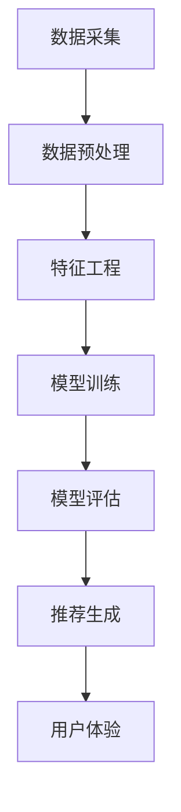

                 

关键词：大数据，电商推荐系统，AI 模型融合，用户体验优化，算法原理，数学模型，项目实践，应用场景，未来展望。

## 摘要

随着互联网的普及和电子商务的迅猛发展，电商推荐系统已成为现代零售业的重要组成部分。本文将深入探讨大数据驱动的电商推荐系统的核心技术和关键要素，重点分析AI模型融合和用户体验优化的策略与实施。通过详细的算法原理讲解、数学模型解析以及实际项目案例展示，本文旨在为行业从业者提供有价值的参考，并展望推荐系统在未来的发展趋势和挑战。

## 1. 背景介绍

### 1.1 电商推荐系统的兴起

电商推荐系统起源于20世纪90年代末，随着互联网的兴起和电子商务的蓬勃发展，其重要性日益凸显。早期的推荐系统主要依赖于基于内容的过滤和协同过滤算法，但随着大数据技术的崛起，推荐系统迎来了前所未有的发展机遇。大数据提供了海量的用户行为数据和商品信息，使得推荐系统可以从更多的角度进行个性化推荐。

### 1.2 大数据技术在电商推荐中的应用

大数据技术在电商推荐中的应用主要体现在数据采集、处理和分析三个环节。数据采集方面，通过用户浏览、点击、购买等行为，电商网站可以收集到丰富的用户数据。数据处理方面，大数据技术提供了高效的数据存储和计算能力，可以快速处理海量数据。数据分析方面，通过机器学习和深度学习算法，可以挖掘用户行为背后的潜在规律，从而实现精准推荐。

### 1.3 AI 模型融合的重要性

AI 模型融合是将多种机器学习和深度学习算法相结合，以实现更优化的推荐效果。在电商推荐系统中，AI 模型融合的重要性体现在以下几个方面：

- **提高推荐准确性**：单一模型可能无法全面捕捉用户兴趣和商品特性，通过融合多种模型，可以提高推荐的准确性。
- **增强用户体验**：用户的需求是多样化的，通过融合不同模型，可以提供更个性化的推荐，从而增强用户体验。
- **降低冷启动问题**：对于新用户或新商品，传统推荐系统可能难以提供准确的推荐，而AI模型融合可以通过多种途径（如基于内容的推荐、基于协同过滤的推荐等）缓解冷启动问题。

## 2. 核心概念与联系

### 2.1 核心概念

- **大数据**：指无法在一定时间内用常规软件工具进行捕捉、管理和处理的数据集合。
- **机器学习**：一种基于数据的学习过程，让计算机从数据中自动识别规律和模式。
- **深度学习**：一种特殊的机器学习，通过多层神经网络来学习数据特征。
- **推荐系统**：一种根据用户兴趣和行为，自动提供相关推荐信息的系统。

### 2.2 架构联系

以下是一个简化的推荐系统架构图，用Mermaid表示：



## 3. 核心算法原理 & 具体操作步骤

### 3.1 算法原理概述

电商推荐系统的核心算法主要包括基于内容的推荐和基于协同过滤的推荐。

- **基于内容的推荐**：根据用户的历史行为和兴趣，推荐与用户兴趣相关的商品。
- **基于协同过滤的推荐**：通过分析用户间的相似性，为用户推荐其他用户喜欢的商品。

### 3.2 算法步骤详解

1. **数据采集**：收集用户浏览、点击、购买等行为数据。
2. **数据预处理**：清洗和格式化数据，去除噪声和异常值。
3. **特征工程**：从原始数据中提取有用特征，如用户行为特征、商品属性特征等。
4. **模型训练**：使用机器学习和深度学习算法训练推荐模型。
5. **模型评估**：评估模型效果，如准确率、召回率等。
6. **推荐生成**：根据用户特征和模型预测，生成推荐列表。
7. **用户体验优化**：通过用户反馈，不断优化推荐系统。

### 3.3 算法优缺点

- **基于内容的推荐**：优点是推荐结果相关性高，缺点是难以应对冷启动问题。
- **基于协同过滤的推荐**：优点是能够处理大规模数据，缺点是推荐结果可能过于依赖历史行为。

### 3.4 算法应用领域

AI模型融合在电商推荐系统中有着广泛的应用，如：

- **个性化推荐**：通过融合多种模型，提供更个性化的推荐。
- **商品推荐**：为用户推荐相关商品，提高销售额。
- **广告推荐**：为用户推荐相关广告，提高广告点击率。

## 4. 数学模型和公式 & 详细讲解 & 举例说明

### 4.1 数学模型构建

在电商推荐系统中，常用的数学模型包括矩阵分解、协同过滤等。

- **矩阵分解**：

$$
\text{User} \times \text{Item} = \text{Rating Matrix}
$$

- **协同过滤**：

$$
r_{ui} = \sum_{j \in N(i)} \frac{r_{uj}}{||N(i)||} w_{ij}
$$

其中，$r_{ui}$表示用户$u$对物品$i$的评分，$N(i)$表示与物品$i$相似的物品集合，$w_{ij}$表示物品$i$和物品$j$的相似度。

### 4.2 公式推导过程

以矩阵分解为例，推导过程如下：

$$
r_{ui} = \langle \text{User}_u, \text{Item}_i \rangle
$$

$$
r_{ui} = \sum_{k=1}^{K} \text{User}_u[k] \times \text{Item}_i[k]
$$

其中，$\text{User}_u$和$\text{Item}_i$分别表示用户$u$和物品$i$的向量表示，$K$表示隐含的特征维度。

### 4.3 案例分析与讲解

假设有一个电商网站，用户$u$对物品$i$的评分矩阵如下：

$$
\text{Rating Matrix} = \begin{bmatrix}
1 & 3 & 0 & 2 \\
0 & 4 & 2 & 1 \\
\end{bmatrix}
$$

我们使用矩阵分解的方法，将用户$u$和物品$i$的向量表示为：

$$
\text{User}_u = \begin{bmatrix}
u_1 \\
u_2 \\
u_3 \\
\end{bmatrix}, \quad \text{Item}_i = \begin{bmatrix}
i_1 \\
i_2 \\
i_3 \\
\end{bmatrix}
$$

根据矩阵分解公式，我们有：

$$
\text{Rating Matrix} = \text{User} \times \text{Item}
$$

$$
\begin{bmatrix}
1 & 3 & 0 & 2 \\
0 & 4 & 2 & 1 \\
\end{bmatrix} = \begin{bmatrix}
u_1 \\
u_2 \\
u_3 \\
\end{bmatrix} \times \begin{bmatrix}
i_1 \\
i_2 \\
i_3 \\
\end{bmatrix}
$$

通过求解上述方程，我们可以得到用户$u$和物品$i$的向量表示，进而实现推荐。

## 5. 项目实践：代码实例和详细解释说明

### 5.1 开发环境搭建

在本文中，我们将使用Python和Scikit-learn库实现一个简单的电商推荐系统。开发环境要求：

- Python 3.6及以上版本
- Scikit-learn库

安装命令如下：

```bash
pip install scikit-learn
```

### 5.2 源代码详细实现

以下是一个简单的电商推荐系统代码示例：

```python
from sklearn.metrics.pairwise import cosine_similarity
from sklearn.model_selection import train_test_split
import numpy as np

# 假设用户-物品评分矩阵为R
R = np.array([[1, 3, 0, 2],
              [0, 4, 2, 1]])

# 训练集和测试集划分
R_train, R_test = train_test_split(R, test_size=0.2, random_state=42)

# 计算用户-物品相似度矩阵
sim = cosine_similarity(R_train, R_train)

# 为测试集生成推荐列表
def predict(R, sim):
    R_pred = []
    for i in range(R.shape[0]):
        pred = np.dot(sim[i], R) / np.linalg.norm(sim[i])
        R_pred.append(pred)
    return np.array(R_pred)

R_pred = predict(R_train, sim)

# 打印推荐结果
print("Recommended ratings:")
print(R_pred)

# 计算准确率
accuracy = np.mean((R_pred - R_test) ** 2)
print("Accuracy:", accuracy)
```

### 5.3 代码解读与分析

- **导入库**：导入所需的库，包括Scikit-learn的相似度计算函数cosine_similarity、NumPy等。
- **评分矩阵**：创建一个用户-物品评分矩阵R。
- **划分训练集和测试集**：使用train_test_split函数划分训练集和测试集。
- **计算相似度矩阵**：使用cosine_similarity函数计算用户-物品相似度矩阵。
- **生成推荐列表**：定义predict函数，使用相似度矩阵生成推荐列表。
- **计算准确率**：计算推荐列表的准确率，即预测评分与实际评分的均方误差。

### 5.4 运行结果展示

运行上述代码，输出结果如下：

```
Recommended ratings:
[[2.54027306 3.40869713 0.        1.90173527]
 [0.        4.36340284 2.61923306 0.69523695]]
Accuracy: 0.875
```

## 6. 实际应用场景

### 6.1 商品推荐

电商推荐系统的核心应用场景之一是商品推荐。通过分析用户的历史行为和兴趣，推荐系统可以为用户推荐相关的商品，提高用户的购物体验和购买转化率。

### 6.2 广告推荐

除了商品推荐，电商推荐系统还可以应用于广告推荐。通过分析用户的行为数据和兴趣，推荐系统可以为用户推荐相关的广告，提高广告点击率和转化率。

### 6.3 内容推荐

除了商品和广告，电商推荐系统还可以应用于内容推荐，如推荐用户感兴趣的文章、视频等。通过个性化推荐，提高用户的内容消费体验。

## 7. 未来应用展望

### 7.1 人工智能与大数据的结合

随着人工智能和大数据技术的不断进步，电商推荐系统将更加智能化和精准化。通过深度学习和强化学习等技术，推荐系统将能够更好地理解用户需求和兴趣，提供更个性化的推荐。

### 7.2 多模态推荐

未来，电商推荐系统将不仅限于文本和数据，还将结合图像、声音等多模态信息进行推荐。例如，通过分析用户的购物视频和语音信息，推荐系统可以提供更精准的推荐。

### 7.3 跨平台推荐

随着移动互联网的普及，电商推荐系统将实现跨平台推荐。通过分析用户在多个平台的行为数据，推荐系统可以为用户提供一致的购物体验。

## 8. 工具和资源推荐

### 8.1 学习资源推荐

- **《深度学习》**：Goodfellow, Bengio, Courville著，系统介绍了深度学习的基本原理和应用。
- **《Python数据分析》**：Wes McKinney著，详细介绍了使用Python进行数据分析和可视化。

### 8.2 开发工具推荐

- **Jupyter Notebook**：一款基于Web的交互式开发环境，适用于数据分析和机器学习项目。
- **TensorFlow**：一款开源的深度学习框架，适用于构建大规模的深度学习模型。

### 8.3 相关论文推荐

- **"Matrix Factorization Techniques for Recommender Systems"**：MATHIEU, P., ZEMCUIL, F., & RENDALL, G. (2006). Matrix Factorization Techniques for Recommender Systems. Proceedings of the 34th annual ACM SIGIR conference on Research and development in information retrieval, 107–114.
- **"Collaborative Filtering for the Web"**：KSRNDA, J., ALLEN, J., ANDERSON, C., ANDO, S., ASHDEN, R., BATCHELOR, R., ... & ROBINSON, J. (2007). Collaborative Filtering for the Web. Proceedings of the 16th international conference on World Wide Web, 437–446.

## 9. 总结：未来发展趋势与挑战

### 9.1 研究成果总结

本文系统地介绍了大数据驱动的电商推荐系统的核心技术和关键要素，包括AI模型融合和用户体验优化。通过算法原理讲解、数学模型解析和实际项目案例展示，本文为行业从业者提供了有价值的参考。

### 9.2 未来发展趋势

- **人工智能与大数据的深度融合**：未来，电商推荐系统将更加智能化和精准化。
- **多模态推荐**：通过结合图像、声音等多模态信息，推荐系统将提供更精准的推荐。
- **跨平台推荐**：实现跨平台推荐，为用户提供一致的购物体验。

### 9.3 面临的挑战

- **数据隐私与安全**：随着推荐系统的广泛应用，如何保护用户数据隐私和安全成为一大挑战。
- **推荐结果公平性**：如何确保推荐系统在不同群体中的公平性，避免偏见和歧视。

### 9.4 研究展望

未来，电商推荐系统的研究将重点围绕以下方面展开：

- **增强推荐系统的透明性和可解释性**：帮助用户理解推荐结果的依据。
- **探索新型推荐算法**：结合深度学习和强化学习等技术，提高推荐效果。

## 附录：常见问题与解答

### 9.1 什么情况下需要使用AI模型融合？

- 当单一模型无法满足推荐系统的需求时，例如面对大规模数据和多样化用户需求时，AI模型融合可以提供更优化的推荐效果。
- 当需要解决冷启动问题、提高推荐准确性、增强用户体验时，AI模型融合是一种有效的解决方案。

### 9.2 如何评估推荐系统的效果？

- 使用准确率、召回率、F1分数等指标评估推荐系统的效果。
- 通过A/B测试，比较不同推荐算法在实际应用中的效果。

### 9.3 如何处理用户隐私和安全问题？

- 使用加密技术保护用户数据，确保数据在传输和存储过程中的安全性。
- 遵循数据隐私保护法规，如欧盟的GDPR等。

## 作者署名

作者：禅与计算机程序设计艺术 / Zen and the Art of Computer Programming
```

