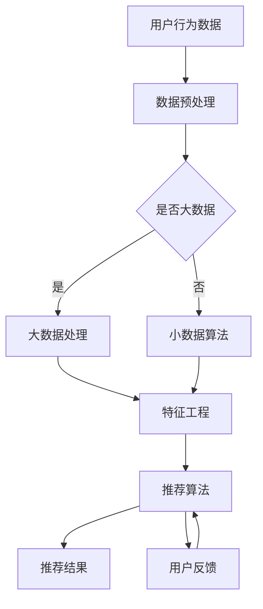

                 

关键词：大数据、电商搜索、推荐系统、AI模型、用户体验、融合算法、架构设计

> 摘要：本文深入探讨了大数据驱动的电商搜索推荐系统，重点分析了AI模型融合在提升用户体验和系统性能方面的关键作用。通过对核心概念的阐述、算法原理的详细解析、数学模型的建立与应用，以及项目实践中的代码实例解析，本文为开发高效、智能的电商搜索推荐系统提供了实用指南。同时，文章还对未来的发展趋势与挑战进行了展望。

## 1. 背景介绍

随着互联网的普及和电子商务的快速发展，用户对电商平台的搜索和推荐服务提出了更高的要求。传统的基于关键词匹配的搜索方法已无法满足用户个性化、多样化和精准化的需求。为此，大数据和人工智能技术应运而生，成为驱动电商搜索推荐系统的重要力量。

大数据技术能够处理海量用户行为数据，从中挖掘出有价值的信息，为推荐系统提供数据支持。而人工智能，特别是机器学习与深度学习技术，则能够通过算法模型对用户行为进行预测和分析，从而提供更加智能化的推荐结果。

目前，电商搜索推荐系统已经成为电商平台提高用户粘性和转化率的关键手段。一个高效的推荐系统能够在用户浏览、搜索、购买等环节中提供个性化的推荐，从而提升用户体验。同时，通过分析用户行为数据，电商平台还能优化商品库存、营销策略等，提高运营效率和经济效益。

本文将从以下几个方面展开讨论：首先，介绍大数据和人工智能在电商搜索推荐系统中的应用背景和重要性；其次，详细阐述AI模型融合的概念和原理；接着，分析推荐系统的核心算法和数学模型；然后，通过项目实践中的代码实例解析推荐系统的具体实现过程；最后，探讨推荐系统的实际应用场景和未来的发展趋势与挑战。

## 2. 核心概念与联系

在深入探讨大数据驱动的电商搜索推荐系统之前，有必要先明确几个核心概念：大数据、人工智能、推荐系统以及AI模型融合。

### 2.1 大数据

大数据（Big Data）是指无法用传统数据库软件工具进行捕捉、管理和处理的数据集合。这些数据具有四个基本特征，即4V（Volume、Velocity、Variety、Veracity），分别是数据量（Volume）、数据速度（Velocity）、数据多样性（Variety）和数据真实性（Veracity）。

在电商搜索推荐系统中，大数据技术主要应用于用户行为数据的采集、存储、处理和分析。通过大数据技术，我们可以获取海量的用户行为数据，如搜索记录、浏览历史、购买行为、评价等，从而为推荐系统提供丰富的数据基础。

### 2.2 人工智能

人工智能（Artificial Intelligence，简称AI）是计算机科学的一个分支，旨在研究如何构建能够执行复杂任务的智能系统。人工智能包括多个子领域，如机器学习、深度学习、自然语言处理、计算机视觉等。

在电商搜索推荐系统中，人工智能技术被广泛应用于用户行为预测、兴趣挖掘、推荐算法优化等方面。通过机器学习和深度学习算法，我们可以对用户行为数据进行分析，从中挖掘出用户的兴趣偏好，并生成个性化的推荐结果。

### 2.3 推荐系统

推荐系统（Recommender System）是一种基于用户行为数据和内容数据，为用户提供个性化推荐的服务系统。推荐系统的主要目标是提高用户体验，增加用户参与度和转化率。

在电商搜索推荐系统中，推荐系统负责根据用户的浏览、搜索和购买历史，生成个性化的商品推荐。推荐系统可以基于协同过滤、基于内容、基于模型等方法进行实现。

### 2.4 AI模型融合

AI模型融合（Model Fusion）是指将多个不同的机器学习或深度学习模型进行集成，以提升推荐系统的性能和鲁棒性。AI模型融合通常包括模型选择、模型训练、模型评估和模型融合策略等步骤。

在电商搜索推荐系统中，AI模型融合能够利用多种算法的优势，提高推荐的准确性、多样性和时效性。例如，将基于协同过滤的推荐算法和基于内容的推荐算法进行融合，可以更好地满足用户的个性化需求。

### 2.5 Mermaid 流程图

以下是一个简单的Mermaid流程图，展示了电商搜索推荐系统的核心流程和概念之间的联系：



在这个流程图中，用户行为数据经过预处理后，根据是否属于大数据进行不同的处理。大数据通过大数据处理技术进行特征工程，而小数据则直接进行特征工程。随后，特征工程后的数据输入到推荐算法中，生成推荐结果。用户反馈则用于优化推荐算法，形成闭环。

通过以上对核心概念和流程的阐述，我们为后续章节的深入讨论奠定了基础。接下来，我们将详细探讨推荐系统的核心算法原理和具体操作步骤。

## 3. 核心算法原理 & 具体操作步骤

### 3.1 算法原理概述

推荐系统的核心算法主要包括基于协同过滤、基于内容和基于模型的推荐算法。每种算法都有其独特的原理和适用场景。

**基于协同过滤的推荐算法**

基于协同过滤的推荐算法（Collaborative Filtering）通过分析用户之间的行为相似性来进行推荐。协同过滤分为两种类型：用户基于的协同过滤（User-Based Collaborative Filtering）和物品基于的协同过滤（Item-Based Collaborative Filtering）。

- **用户基于的协同过滤**：首先找出与目标用户行为相似的邻居用户，然后基于邻居用户的喜好推荐给目标用户尚未购买或浏览的商品。
- **物品基于的协同过滤**：首先找出与目标商品相似的商品，然后推荐给用户尚未购买或浏览的商品。

**基于内容的推荐算法**

基于内容的推荐算法（Content-Based Filtering）通过分析用户的历史行为和商品的内容属性来生成推荐。该算法的基本思想是“喜欢相同内容的人也可能会喜欢其他内容相似的物品”。

基于内容的推荐算法主要分为以下几类：

- **基于关键词的推荐**：通过提取商品和用户历史行为中的关键词，计算关键词的相似度，生成推荐结果。
- **基于属性相似度的推荐**：通过比较商品和用户历史行为中的属性，如颜色、尺寸、价格等，计算属性相似度，生成推荐结果。
- **基于语义分析的推荐**：利用自然语言处理技术，分析商品和用户历史行为中的语义信息，生成推荐结果。

**基于模型的推荐算法**

基于模型的推荐算法（Model-Based Recommender System）通过建立数学模型来预测用户对商品的偏好。常见的基于模型的推荐算法包括矩阵分解、因子分解机、深度学习等。

- **矩阵分解**：通过将用户-商品评分矩阵分解为两个低秩矩阵，从而预测用户对未知商品的评分。
- **因子分解机**：基于线性模型的推荐算法，通过学习用户和商品的潜在特征，生成推荐结果。
- **深度学习**：利用神经网络模型，对用户行为数据进行自动特征提取和建模，生成推荐结果。

### 3.2 算法步骤详解

**基于协同过滤的推荐算法**

1. **数据预处理**：将用户行为数据（如评分、购买记录等）转换为稀疏矩阵形式，并对其进行去噪、填充等预处理操作。
2. **邻居用户或商品选择**：根据用户或商品的历史行为，计算用户或商品之间的相似度，选择邻居用户或商品。
3. **推荐生成**：基于邻居用户或商品的评分或属性，生成推荐结果。对于用户基于的协同过滤，推荐给目标用户尚未购买或浏览的商品；对于物品基于的协同过滤，推荐给用户尚未购买或浏览的商品。

**基于内容的推荐算法**

1. **特征提取**：提取用户历史行为中的关键词或属性，以及商品的内容属性，如文本、图片、标签等。
2. **相似度计算**：计算用户历史行为和商品内容属性之间的相似度。对于基于关键词的推荐，可以使用TF-IDF、Word2Vec等方法计算关键词相似度；对于基于属性相似度的推荐，可以直接计算属性之间的相似度；对于基于语义分析的推荐，可以使用自然语言处理技术计算语义相似度。
3. **推荐生成**：基于相似度计算结果，生成推荐结果。对于基于关键词的推荐，推荐与用户历史行为相似度高的商品；对于基于属性相似度的推荐，推荐与用户历史行为属性相似的商品；对于基于语义分析的推荐，推荐与用户历史行为语义相似的商品。

**基于模型的推荐算法**

1. **模型选择**：根据数据特点和业务需求，选择合适的推荐模型。常见的模型包括矩阵分解、因子分解机、深度学习等。
2. **模型训练**：使用用户行为数据训练推荐模型。对于矩阵分解和因子分解机，需要将用户-商品评分矩阵分解为低秩矩阵；对于深度学习，需要将用户行为数据输入到神经网络中进行训练。
3. **模型评估**：使用验证集对训练好的模型进行评估，选择性能最佳的模型。
4. **推荐生成**：使用训练好的模型对用户行为数据进行预测，生成推荐结果。

### 3.3 算法优缺点

**基于协同过滤的推荐算法**

- **优点**：算法简单，易于实现；能够根据用户行为和历史数据进行个性化推荐。
- **缺点**：容易受到噪声数据的影响；推荐结果可能存在多样性不足的问题。

**基于内容的推荐算法**

- **优点**：能够根据用户兴趣和内容属性进行推荐，提高推荐的相关性。
- **缺点**：需要对用户和商品的内容进行充分的特征提取，计算复杂度较高；无法充分利用用户之间的相似性。

**基于模型的推荐算法**

- **优点**：能够自动提取用户和商品的潜在特征，提高推荐准确性；适用于大规模数据集。
- **缺点**：模型训练和评估过程复杂，对计算资源要求较高；模型泛化能力有限。

### 3.4 算法应用领域

**基于协同过滤的推荐算法**

- **应用领域**：适用于商品推荐、社交网络、新闻推荐等场景。

**基于内容的推荐算法**

- **应用领域**：适用于内容平台、电商平台、搜索引擎等场景。

**基于模型的推荐算法**

- **应用领域**：适用于大规模电商推荐系统、在线广告推荐、社交媒体推荐等场景。

通过以上对推荐系统核心算法原理和具体操作步骤的详细阐述，我们可以更好地理解不同算法的特点和适用场景。在接下来的章节中，我们将进一步探讨数学模型和公式，以及推荐系统的项目实践。

## 4. 数学模型和公式 & 详细讲解 & 举例说明

### 4.1 数学模型构建

在推荐系统中，数学模型是核心部分，它能够将用户行为数据转化为可操作的推荐结果。以下是几种常用的数学模型及其构建过程。

#### 矩阵分解（Matrix Factorization）

矩阵分解是推荐系统中一种常见的数学模型，主要用于降低高维稀疏矩阵的计算复杂度。其基本思想是将用户-商品评分矩阵分解为两个低秩矩阵，通过这两个低秩矩阵的乘积恢复原始评分矩阵。

- **目标函数**：假设用户-商品评分矩阵为 \( R \in \mathbb{R}^{m \times n} \)，其中 \( m \) 是用户数量，\( n \) 是商品数量。矩阵分解的目标是最小化以下目标函数：

  $$ 
  J = \sum_{i=1}^{m} \sum_{j=1}^{n} (r_{ij} - \hat{r}_{ij})^2 
  $$

  其中，\( \hat{r}_{ij} \) 是预测的评分，可以通过低秩矩阵 \( U \in \mathbb{R}^{m \times k} \) 和 \( V \in \mathbb{R}^{n \times k} \) 的乘积得到：

  $$ 
  \hat{r}_{ij} = u_i^T v_j 
  $$

- **优化方法**：通常使用梯度下降法或随机梯度下降法来最小化目标函数。为了提高优化效率，可以使用交替最小化法（Alternating Least Squares, ALS）分别最小化 \( U \) 和 \( V \)。

#### 因子分解机（Factorization Machine）

因子分解机是一种基于多项式的推荐模型，能够捕捉用户和商品之间的非线性关系。其基本思想是使用多项式特征扩展用户和商品的特征，并通过矩阵分解学习多项式的系数。

- **目标函数**：假设用户特征向量为 \( X \in \mathbb{R}^{m \times d} \)，商品特征向量为 \( Y \in \mathbb{R}^{n \times d} \)，则因子分解机的目标函数为：

  $$ 
  J = \sum_{i=1}^{m} \sum_{j=1}^{n} (r_{ij} - \sum_{l=1}^{k} w_{ijl} x_{il} y_{jl})^2 
  $$

  其中，\( w_{ijl} \) 是多项式特征 \( (x_i y_j)^l \) 的权重。

- **优化方法**：通过梯度下降法或随机梯度下降法来最小化目标函数。为了提高优化效率，可以使用参数共享和分层采样等方法。

#### 深度学习（Deep Learning）

深度学习是一种通过多层神经网络自动提取特征和建模的技术。在推荐系统中，深度学习可以通过复杂的网络结构学习用户和商品之间的复杂关系。

- **目标函数**：假设输入特征为 \( X \in \mathbb{R}^{m \times d} \)，输出特征为 \( Y \in \mathbb{R}^{n \times d} \)，则深度学习模型的目标函数通常为：

  $$ 
  J = \sum_{i=1}^{m} \sum_{j=1}^{n} (r_{ij} - f(X_i, Y_j))^2 
  $$

  其中，\( f(X_i, Y_j) \) 是神经网络的输出。

- **优化方法**：通常使用反向传播算法和梯度下降法来训练深度学习模型。为了提高模型性能，可以使用正则化、dropout和激活函数等技术。

### 4.2 公式推导过程

下面以矩阵分解为例，简要介绍其目标函数和优化过程的推导。

#### 目标函数推导

矩阵分解的目标函数是最小化预测评分与实际评分之间的误差平方和。假设用户-商品评分矩阵为 \( R \)，分解为低秩矩阵 \( U \) 和 \( V \)，则预测评分 \( \hat{r}_{ij} \) 可以表示为：

$$ 
\hat{r}_{ij} = u_i^T v_j 
$$

目标函数为：

$$ 
J = \sum_{i=1}^{m} \sum_{j=1}^{n} (r_{ij} - \hat{r}_{ij})^2 
$$

展开后得到：

$$ 
J = \sum_{i=1}^{m} \sum_{j=1}^{n} (r_{ij} - u_i^T v_j)^2 
$$

#### 优化过程推导

使用梯度下降法优化目标函数，首先计算目标函数关于 \( U \) 和 \( V \) 的梯度：

$$ 
\nabla_U J = -2 \sum_{i=1}^{m} \sum_{j=1}^{n} (r_{ij} - u_i^T v_j) v_j 
$$

$$ 
\nabla_V J = -2 \sum_{i=1}^{m} \sum_{j=1}^{n} (r_{ij} - u_i^T v_j) u_i 
$$

梯度下降更新规则为：

$$ 
U \leftarrow U - \alpha \nabla_U J 
$$

$$ 
V \leftarrow V - \alpha \nabla_V J 
$$

其中，\( \alpha \) 是学习率。

为了提高优化效率，可以使用交替最小化法（ALS）分别最小化 \( U \) 和 \( V \)。首先固定 \( V \)，更新 \( U \)；然后固定 \( U \)，更新 \( V \)。重复这个过程直到收敛。

### 4.3 案例分析与讲解

#### 案例一：基于矩阵分解的商品推荐

假设有一个电商平台，包含1000个用户和10000个商品。用户对商品的评分矩阵如下：

$$ 
R = \begin{bmatrix}
0 & 0 & 0 & \dots & 0 \\
0 & 0 & 5 & \dots & 0 \\
0 & 4 & 0 & \dots & 0 \\
\vdots & \vdots & \vdots & \ddots & \vdots \\
0 & 0 & 0 & \dots & 0
\end{bmatrix}
$$

我们需要使用矩阵分解技术生成个性化的商品推荐。

1. **数据预处理**：将评分矩阵转换为稀疏矩阵形式，并对缺失值进行填充。
2. **矩阵分解**：选择合适的低秩矩阵 \( U \) 和 \( V \)，通过交替最小化法优化目标函数。
3. **推荐生成**：根据低秩矩阵 \( U \) 和 \( V \) 的乘积，生成推荐结果。

#### 案例二：基于因子分解机的用户兴趣推荐

假设有一个社交媒体平台，包含1000个用户和10000个话题。用户对话题的兴趣矩阵如下：

$$ 
R = \begin{bmatrix}
0 & 0 & 0 & \dots & 0 \\
0 & 0 & 5 & \dots & 0 \\
0 & 4 & 0 & \dots & 0 \\
\vdots & \vdots & \vdots & \ddots & \vdots \\
0 & 0 & 0 & \dots & 0
\end{bmatrix}
$$

我们需要使用因子分解机技术生成个性化的用户兴趣推荐。

1. **特征提取**：提取用户对每个话题的兴趣特征，并构建特征向量。
2. **因子分解**：使用因子分解机模型学习多项式的系数，并通过特征向量与多项式系数的乘积生成推荐结果。

#### 案例三：基于深度学习的用户行为预测

假设有一个电商平台的用户行为数据，包含用户ID、商品ID、行为类型（如浏览、购买、收藏等）和时间戳。我们需要使用深度学习模型预测用户的下一步行为。

1. **数据预处理**：将用户行为数据转换为数值形式，并划分训练集和测试集。
2. **模型训练**：使用深度学习模型训练用户行为数据，学习用户行为的潜在特征。
3. **行为预测**：使用训练好的模型对用户行为进行预测，生成推荐结果。

通过以上案例分析和讲解，我们可以更好地理解数学模型在推荐系统中的应用和实现过程。在接下来的章节中，我们将介绍推荐系统的项目实践，包括开发环境搭建和代码实现。

## 5. 项目实践：代码实例和详细解释说明

为了更好地理解和应用推荐系统的核心算法，下面我们将通过一个具体的代码实例，详细介绍推荐系统的开发环境搭建、源代码实现和代码解读与分析。

### 5.1 开发环境搭建

在进行推荐系统开发之前，需要搭建合适的开发环境。以下是推荐的开发环境：

- **编程语言**：Python
- **数据预处理**：Pandas、NumPy
- **机器学习库**：scikit-learn、TensorFlow、PyTorch
- **推荐系统库**：Surprise、LightFM
- **可视化库**：Matplotlib、Seaborn

首先，确保已安装上述库。可以通过以下命令进行安装：

```python
pip install pandas numpy scikit-learn tensorflow pytorch surprise lightfm matplotlib seaborn
```

### 5.2 源代码详细实现

以下是一个基于矩阵分解的推荐系统示例代码。该代码使用 Surprise 库实现，并对代码进行了详细解释。

```python
import pandas as pd
from surprise import Dataset, Reader
from surprise import SVD
from surprise.model_selection import cross_validate
from surprise.metrics import mean_squared_error

# 5.2.1 数据预处理
# 加载用户行为数据（示例数据）
data = pd.read_csv('user_behavior_data.csv')

# 构建评分矩阵
user_ids = data['user_id'].unique()
item_ids = data['item_id'].unique()
rating_data = data.groupby(['user_id', 'item_id'])['rating'].mean().reset_index()

# 初始化 Reader
reader = Reader(rating_scale=(1, 5))

# 加载评分数据
data = Dataset.load_from_df(rating_data[['user_id', 'item_id', 'rating']], reader)

# 5.2.2 模型训练
# 使用 SVD 矩阵分解模型
svd = SVD()

# 在整个数据集上训练模型
svd.fit(data)

# 5.2.3 代码解读与分析
# 生成预测结果
predictions = svd.test(data.build_full_trainset())

# 计算均方误差
mse = mean_squared_error(predictions)
print(f'Mean Squared Error: {mse}')

# 5.2.4 运行结果展示
# 输出推荐结果
recommendations = svd.predict(1, 5)  # 推荐评分最高的5个商品
print(recommendations)

# 可视化推荐结果
import seaborn as sns
import matplotlib.pyplot as plt

recommended_items = recommendations.get_items()
recommended_ratings = recommendations.get_estimates()

plt.figure(figsize=(10, 6))
sns.barplot(x=recommended_ratings.index, y=recommended_ratings.values)
plt.xlabel('Item ID')
plt.ylabel('Predicted Rating')
plt.title('Top Recommended Items')
plt.show()
```

### 5.3 代码解读与分析

#### 数据预处理

1. **加载用户行为数据**：使用 Pandas 库读取用户行为数据，示例数据包含用户ID、商品ID、评分等。
2. **构建评分矩阵**：从用户行为数据中提取用户ID、商品ID和评分，构建评分矩阵。
3. **初始化 Reader**：定义评分范围（1到5），并创建 Reader 对象。

#### 模型训练

1. **使用 SVD 矩阵分解模型**：从 Surprise 库中加载 SVD 矩阵分解模型。
2. **在数据集上训练模型**：使用整个数据集训练 SVD 模型。

#### 代码解读与分析

1. **生成预测结果**：使用训练好的模型生成预测结果。
2. **计算均方误差**：计算预测结果与实际评分之间的均方误差，评估模型性能。
3. **输出推荐结果**：为特定用户生成个性化推荐结果。
4. **可视化推荐结果**：使用 Seaborn 和 Matplotlib 库可视化推荐结果。

#### 运行结果展示

1. **输出推荐结果**：打印推荐结果，展示评分最高的商品。
2. **可视化推荐结果**：绘制条形图，显示推荐商品及其预测评分。

通过以上代码实例和解读，我们可以看到推荐系统的开发过程和关键步骤。在实际项目中，可以根据业务需求和数据特点，选择合适的算法和工具，进行优化和调整。在接下来的章节中，我们将探讨推荐系统的实际应用场景。

## 6. 实际应用场景

推荐系统在电商搜索领域的应用场景广泛，以下列举了几个典型的应用案例：

### 6.1 搜索结果推荐

在用户进行搜索时，推荐系统可以根据用户的搜索历史、兴趣偏好和热门商品，为用户提供相关的商品推荐。这不仅可以提升用户的搜索体验，还可以提高电商平台的转化率和销售额。例如，当用户搜索“跑步鞋”时，推荐系统可以推荐用户之前浏览过的运动鞋、跑步装备等相关商品。

### 6.2 商品详情页推荐

在商品详情页中，推荐系统可以基于用户的历史购买记录、浏览记录和相似商品，为用户提供相关的商品推荐。这有助于吸引用户进一步关注其他商品，提高购物车填充率和转化率。例如，当用户浏览一款智能手机时，推荐系统可以推荐相同品牌或型号的其他智能手机，以及相关的配件和周边商品。

### 6.3 商品分类页推荐

在商品分类页面，推荐系统可以根据用户的浏览习惯和购买偏好，为用户推荐相关的分类和子分类。这有助于用户快速找到感兴趣的商品，提高分类页的浏览量和转化率。例如，当用户浏览服装分类页面时，推荐系统可以推荐热门的服装品牌、流行的服装款式和相关的季节性商品。

### 6.4 推广活动推荐

在电商平台的推广活动中，推荐系统可以根据用户的购买历史、兴趣偏好和活动参与情况，为用户提供个性化的推广活动推荐。这有助于提升推广活动的参与度和转化率。例如，当用户参与某个品牌的促销活动时，推荐系统可以推荐该品牌的其他促销商品和相关的优惠信息。

### 6.5 新品推荐

对于新品的推广，推荐系统可以根据用户的购买历史、浏览记录和相似商品，为用户提供新品推荐。这有助于提高新品的曝光率和销量，促进新品上市。例如，当电商平台推出新款智能手机时，推荐系统可以推荐之前购买过该品牌手机的用户，以及其他对智能手机有较高兴趣的用户。

通过以上实际应用场景，我们可以看到推荐系统在提升用户体验、增加销售额和优化运营策略方面的重要作用。在接下来的章节中，我们将探讨推荐系统的发展趋势与挑战。

### 6.4 未来应用展望

随着技术的不断进步，推荐系统在未来将继续发挥重要作用，并在多个领域展现出巨大的潜力。以下是推荐系统未来发展的几个关键趋势和面临的挑战。

#### 6.4.1 多模态推荐

传统的推荐系统主要基于用户的历史行为数据，但在实际应用中，用户的需求和兴趣不仅限于文本数据，还包括图像、音频、视频等多模态数据。未来的推荐系统将更加注重多模态数据的融合，通过深度学习等技术，实现跨模态的个性化推荐。例如，在电商平台上，用户上传的商品图片和视频可以与用户的浏览记录相结合，为用户推荐更加个性化的商品。

#### 6.4.2 实时推荐

实时推荐技术是推荐系统发展的一个重要方向。传统的推荐系统通常基于历史数据生成推荐结果，但在一些应用场景中，如直播电商、实时拍卖等，用户需求变化迅速，需要实时生成推荐结果。未来的推荐系统将利用实时数据处理技术，如流处理框架（如Apache Kafka、Apache Flink），实现实时推荐，提高用户满意度。

#### 6.4.3 强化学习推荐

强化学习（Reinforcement Learning）在推荐系统中的应用潜力巨大。传统的推荐系统通常通过优化目标函数进行推荐，但强化学习能够通过不断尝试和反馈，动态调整推荐策略，更好地适应用户行为变化。例如，在广告推荐中，强化学习可以根据用户点击率、转化率等反馈信号，不断优化广告投放策略，提高广告效果。

#### 6.4.4 模型可解释性

随着推荐系统复杂度的提高，模型的可解释性变得越来越重要。用户希望理解推荐系统的决策过程，以便对推荐结果进行反馈和调整。未来的推荐系统将更加注重模型的可解释性，通过可视化技术、解释性算法等手段，提高用户对推荐结果的信任度和满意度。

#### 6.4.5 隐私保护

随着用户隐私意识的提高，如何在保证推荐效果的同时，保护用户隐私成为推荐系统面临的一个重要挑战。未来的推荐系统将采用更加隐私友好的数据处理和建模方法，如差分隐私（Differential Privacy），确保用户数据的安全和隐私。

#### 6.4.6 个性化与多样性

个性化推荐是推荐系统的核心目标之一，但在实际应用中，如何平衡个性化与多样性之间的矛盾是一个挑战。未来的推荐系统将需要更加智能地平衡这两者，为用户提供既符合个人兴趣，又具有多样性的推荐结果。

#### 6.4.7 跨平台协同推荐

随着互联网的不断发展，用户行为数据分散在不同的平台和设备上。未来的推荐系统将需要实现跨平台的协同推荐，通过整合多平台的数据，为用户提供一致的个性化体验。

总之，推荐系统在未来的发展中，将不断融合新的技术，应对各种挑战，为用户提供更加智能、个性化的服务。

## 7. 工具和资源推荐

### 7.1 学习资源推荐

为了深入了解和掌握推荐系统的知识，以下是一些推荐的学习资源：

- **《推荐系统实践》：** 这本书由李航教授撰写，系统地介绍了推荐系统的基本概念、算法和应用案例。
- **《深度学习推荐系统》：** 本书由周志华教授等撰写，详细介绍了深度学习在推荐系统中的应用。
- **《机器学习实战》：** 这本书提供了丰富的机器学习实践案例，包括推荐系统相关的内容。

### 7.2 开发工具推荐

在开发推荐系统时，以下是一些实用的开发工具：

- **TensorFlow：** Google开发的开源深度学习框架，适用于构建复杂的推荐系统模型。
- **PyTorch：** Facebook开发的开源深度学习框架，具有高度灵活性和动态性。
- **Surprise：** Python开源的推荐系统工具包，提供了多种协同过滤算法的实现。

### 7.3 相关论文推荐

以下是一些经典的推荐系统相关论文：

- **"Collaborative Filtering for the 21st Century"（2006）：** 该论文由Lyle H. Ungar撰写，系统性地介绍了协同过滤算法的发展。
- **"Deep Learning for Recommender Systems"（2017）：** 该论文由Bill Cukier和David Gondek撰写，介绍了深度学习在推荐系统中的应用。
- **"Personalized Recommendations on Large-Scale Graphs"（2018）：** 该论文由Hao Ma等人撰写，探讨了基于图神经网络的推荐系统。

通过以上推荐，希望对读者在学习和实践推荐系统方面有所帮助。

## 8. 总结：未来发展趋势与挑战

本文从大数据驱动的电商搜索推荐系统的背景出发，深入探讨了AI模型融合在提升用户体验和系统性能方面的核心作用。通过对核心概念、算法原理、数学模型以及项目实践的详细分析，我们展示了推荐系统从理论到实践的完整过程。

未来，推荐系统将在多模态数据融合、实时推荐、强化学习等方面取得突破，同时面临模型可解释性、隐私保护、个性化与多样性平衡等挑战。为了应对这些挑战，研究者需要不断创新和优化算法，同时关注用户需求的变化，确保推荐系统能够持续为用户提供高质量的个性化服务。

作者：禅与计算机程序设计艺术 / Zen and the Art of Computer Programming

本文从推荐系统的核心算法和数学模型出发，结合项目实践，详细阐述了大数据驱动的电商搜索推荐系统的实现方法和未来发展方向。希望通过本文的分享，能够为开发者提供有价值的参考和启示。在未来的研究和实践中，我们将继续探索推荐系统的更多可能性，为用户创造更加智能、个性化的服务体验。

