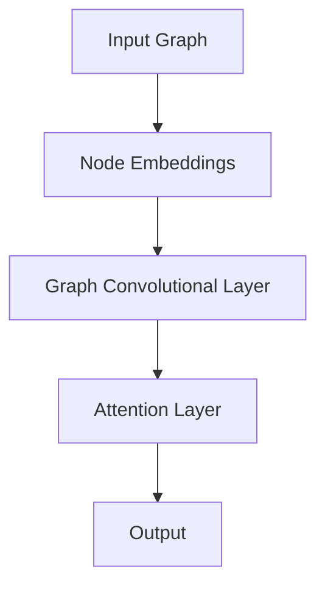

                 

## 1. 背景介绍

随着互联网的迅猛发展和大数据技术的广泛应用，推荐系统已经成为现代信息社会中不可或缺的一部分。推荐系统通过分析用户的兴趣和行为数据，为用户提供个性化的信息推荐，从而提高用户满意度和系统价值。传统的推荐系统主要基于基于内容的推荐（Content-Based Recommendation）和协同过滤（Collaborative Filtering）方法。然而，这些方法在处理复杂的关系和网络结构数据时存在一定的局限性。

近年来，图神经网络（Graph Neural Networks，GNN）作为一种强大的深度学习模型，在处理图结构数据方面表现出色。图神经网络通过建模节点和边之间的关系，实现了对图数据的有效表示和学习。与此同时，大模型（如Transformer、BERT等）在自然语言处理领域取得了显著的成果。这些模型能够捕捉长距离依赖关系和复杂语义信息，使得它们在推荐系统中的应用变得极具潜力。

本文旨在探讨大模型在推荐系统中的图注意力网络（Graph Attention Network，GAT）应用。通过结合图神经网络和大模型的优点，我们希望能够构建一种更加智能和高效的推荐系统，为用户提供更加个性化和精准的推荐服务。本文的结构如下：

- **第1章**：背景介绍。简要介绍推荐系统的发展背景和当前存在的问题。
- **第2章**：核心概念与联系。介绍图注意力网络的核心概念和架构，并通过Mermaid流程图展示其工作流程。
- **第3章**：核心算法原理与具体操作步骤。详细阐述图注意力网络的算法原理和操作步骤。
- **第4章**：数学模型和公式。介绍图注意力网络的数学模型和公式，并进行详细讲解和举例说明。
- **第5章**：项目实践：代码实例和详细解释说明。提供一个具体的代码实例，详细解释其实现过程和关键代码。
- **第6章**：实际应用场景。探讨图注意力网络在推荐系统中的实际应用场景和优势。
- **第7章**：工具和资源推荐。推荐一些学习资源、开发工具和相关论文，以便读者深入了解。
- **第8章**：总结：未来发展趋势与挑战。总结研究成果，展望未来发展趋势和面临的挑战。
- **第9章**：附录：常见问题与解答。解答读者可能遇到的一些常见问题。

通过本文的研究，我们希望能够为推荐系统领域的发展贡献一份力量，并为相关研究人员和实践者提供有价值的参考。

## 2. 核心概念与联系

### 图注意力网络（Graph Attention Network，GAT）

图注意力网络（GAT）是近年来在推荐系统和图神经网络领域受到广泛关注的一种深度学习模型。GAT的主要目标是利用节点和边之间的注意力机制，对图结构数据进行有效的表示和学习。

#### GAT的核心概念

1. **节点表示（Node Representation）**：在GAT中，每个节点都被表示为一个向量。这些向量包含了节点自身的特征信息，如文本内容、用户标签等。

2. **边表示（Edge Representation）**：边在GAT中同样被表示为向量，这些向量表示了节点之间的关系。

3. **注意力机制（Attention Mechanism）**：GAT通过注意力机制来动态调整节点和边之间的交互权重。注意力机制的核心思想是，根据节点和边的历史信息，为每个节点和边分配一个权重系数，这些权重系数决定了节点和边在模型中的重要性。

#### GAT的架构

GAT的架构主要包括两个关键组件：图卷积层（Graph Convolutional Layer，GCL）和注意力层（Attention Layer）。

1. **图卷积层（GCL）**：图卷积层是GAT的核心层，负责对节点进行特征聚合。在GCL中，每个节点的输出是由其自身特征和其邻居节点的特征加权平均得到的。

   $$h_{i}^{l+1} = \sigma \left( \sum_{j \in \mathcal{N}_{i}} \alpha_{ij} \cdot \left( \theta \cdot h_{j}^{l} + \theta' \cdot x_{j} \right) \right)$$

   其中，$h_{i}^{l}$ 和 $h_{i}^{l+1}$ 分别表示第 $i$ 个节点在当前层和下一层的表示，$\mathcal{N}_{i}$ 表示节点 $i$ 的邻居节点集合，$\alpha_{ij}$ 是注意力权重，$\theta$ 和 $\theta'$ 是权重矩阵。

2. **注意力层（Attention Layer）**：注意力层负责动态调整节点和边之间的交互权重。在注意力层中，每个节点和边都会被分配一个权重系数，这些权重系数决定了节点和边在模型中的重要性。

   $$\alpha_{ij} = \frac{e^{ \frac{a \cdot (h_{i}^{l} \odot h_{j}^{l}) \cdot W_a}}}{\sum_{k \in \mathcal{N}_{i}} e^{ \frac{a \cdot (h_{i}^{l} \odot h_{k}^{l}) \cdot W_a}} }$$

   其中，$a$ 是一个可学习的注意力函数，$W_a$ 是注意力层的权重矩阵，$\odot$ 表示逐元素乘积。

#### Mermaid流程图

下面是一个GAT的Mermaid流程图，展示了其工作流程：



### 大模型与推荐系统

大模型（如Transformer、BERT等）在自然语言处理领域取得了显著的成果，它们能够捕捉长距离依赖关系和复杂语义信息。这些特性使得大模型在推荐系统中的应用变得极具潜力。

1. **Transformer**：Transformer是一种基于自注意力机制的深度学习模型，它在自然语言处理任务中表现出色。Transformer的结构包括编码器和解码器，通过自注意力机制，模型能够捕捉输入序列中的长距离依赖关系。

2. **BERT**：BERT是一种预训练语言模型，它通过在大量文本数据上进行预训练，学习到了丰富的语义信息。BERT的结构包括两个主要部分：预训练和微调。在推荐系统中，BERT可以用于提取用户和商品的特征表示。

#### 大模型与图注意力网络的结合

将大模型与图注意力网络结合，可以充分发挥两者的优点，构建一种更加智能和高效的推荐系统。具体实现方法如下：

1. **节点和边表示**：使用大模型（如BERT）对节点和边进行特征表示。BERT可以提取出节点和边的丰富语义信息，从而提高模型对数据的理解能力。

2. **注意力机制**：在GAT的基础上，引入大模型的注意力机制。通过结合大模型的自注意力机制和GAT的注意力机制，可以进一步提高模型对图数据的表示能力。

3. **融合模型**：将大模型和GAT融合，构建一个多层次的深度学习模型。在底层使用GAT对图结构数据进行处理，在上层使用大模型对特征进行进一步提取和融合，从而实现更加精准的推荐。

## 3. 核心算法原理 & 具体操作步骤

### 3.1 算法原理概述

图注意力网络（Graph Attention Network，GAT）的核心原理是通过注意力机制对图结构数据进行有效的表示和学习。具体来说，GAT包含两个关键组件：图卷积层（Graph Convolutional Layer，GCL）和注意力层（Attention Layer）。

在图卷积层中，每个节点的输出是由其自身特征和其邻居节点的特征加权平均得到的。通过这种方式，图卷积层能够聚合节点和边之间的信息，从而实现对图数据的表示。在注意力层中，每个节点和边都会被分配一个权重系数，这些权重系数决定了节点和边在模型中的重要性。通过动态调整这些权重系数，模型能够更好地学习图结构数据中的特征和关系。

### 3.2 算法步骤详解

1. **初始化节点和边表示**：首先，我们需要初始化图中的节点和边表示。节点表示通常包含节点自身的特征信息，如文本内容、用户标签等。边表示则表示节点之间的关系。

2. **图卷积层**：在图卷积层中，我们对每个节点的输出进行特征聚合。具体来说，对于每个节点 $i$，其输出 $h_{i}^{l+1}$ 是由其自身特征 $x_{i}$ 和其邻居节点的特征 $h_{j}^{l}$ 加权平均得到的。这个过程可以表示为：

   $$h_{i}^{l+1} = \sigma \left( \sum_{j \in \mathcal{N}_{i}} \alpha_{ij} \cdot \left( \theta \cdot h_{j}^{l} + \theta' \cdot x_{j} \right) \right)$$

   其中，$\alpha_{ij}$ 是注意力权重，$\theta$ 和 $\theta'$ 是权重矩阵。

3. **注意力层**：在注意力层中，我们通过注意力机制动态调整节点和边之间的交互权重。具体来说，对于每个节点 $i$ 和边 $e_{ij}$，我们为其分配一个权重系数 $\alpha_{ij}$ 和 $\beta_{ij}$。这些权重系数可以通过以下公式计算：

   $$\alpha_{ij} = \frac{e^{ \frac{a \cdot (h_{i}^{l} \odot h_{j}^{l}) \cdot W_a}}}{\sum_{k \in \mathcal{N}_{i}} e^{ \frac{a \cdot (h_{i}^{l} \odot h_{k}^{l}) \cdot W_a}} }$$
   $$\beta_{ij} = \frac{e^{ \frac{b \cdot (x_{i} \odot x_{j}) \cdot W_b}}}{\sum_{k \in \mathcal{N}_{i}} e^{ \frac{b \cdot (x_{i} \odot x_{k}) \cdot W_b}} }$$

   其中，$a$ 和 $b$ 是可学习的注意力函数，$W_a$ 和 $W_b$ 是权重矩阵。

4. **特征融合**：在完成图卷积层和注意力层的操作后，我们将节点的输出进行特征融合。具体来说，对于每个节点 $i$，其最终的特征表示 $h_{i}^{l+1}$ 是由其自身特征和邻居节点的特征加权平均得到的：

   $$h_{i}^{l+1} = \sum_{j \in \mathcal{N}_{i}} \alpha_{ij} \cdot h_{j}^{l+1}$$

5. **多层堆叠**：为了进一步提高模型的表示能力，我们可以将图卷积层和注意力层堆叠多层。在每层中，节点和边都会被更新和调整，从而实现更精细的特征表示。

### 3.3 算法优缺点

**优点**：

1. **灵活性和适应性**：GAT通过注意力机制动态调整节点和边之间的交互权重，具有很强的灵活性和适应性，能够处理不同类型的图结构数据。

2. **强大的表示能力**：GAT能够聚合节点和边之间的信息，实现对图数据的强大表示能力，从而提高模型的预测性能。

**缺点**：

1. **计算复杂度较高**：由于GAT需要计算节点和边之间的注意力权重，其计算复杂度较高，可能会导致训练和推理时间较长。

2. **参数调优困难**：GAT的参数调优相对困难，需要大量的实验和计算资源。

### 3.4 算法应用领域

GAT在推荐系统、图表示学习、知识图谱等多个领域具有广泛的应用：

1. **推荐系统**：GAT能够捕捉用户和商品之间的复杂关系，从而提高推荐系统的准确性。

2. **图表示学习**：GAT能够对图结构数据进行有效的表示，从而实现图分类、图聚类等任务。

3. **知识图谱**：GAT能够对知识图谱中的实体和关系进行建模，从而实现知识图谱的补全和推理。

## 4. 数学模型和公式 & 详细讲解 & 举例说明

### 4.1 数学模型构建

图注意力网络（GAT）的数学模型主要包括节点和边表示、图卷积层、注意力层以及特征融合等组成部分。以下是GAT的数学模型构建过程：

1. **节点和边表示**：

   假设图 $G = (V, E)$，其中 $V$ 表示节点集合，$E$ 表示边集合。每个节点 $v_i \in V$ 和边 $e_{ij} \in E$ 都有一个对应的向量表示：

   - 节点表示：$x_i \in \mathbb{R}^d$，其中 $d$ 是节点向量的维度。
   - 边表示：$x_{ij} \in \mathbb{R}^d$，其中 $d$ 是边向量的维度。

2. **图卷积层**：

   在图卷积层中，每个节点的输出是由其自身特征和其邻居节点的特征加权平均得到的。具体公式如下：

   $$h_i^{l+1} = \sigma \left( \sum_{j \in \mathcal{N}_{i}} \alpha_{ij} \cdot \left( \theta \cdot h_j^{l} + \theta' \cdot x_j \right) \right)$$

   其中，$\alpha_{ij}$ 是注意力权重，$\theta$ 和 $\theta'$ 是权重矩阵，$\mathcal{N}_{i}$ 表示节点 $i$ 的邻居节点集合，$\sigma$ 是激活函数（通常使用ReLU或Sigmoid函数）。

3. **注意力层**：

   在注意力层中，每个节点和边都会被分配一个权重系数，这些权重系数决定了节点和边在模型中的重要性。具体公式如下：

   $$\alpha_{ij} = \frac{e^{ \frac{a \cdot (h_i^{l} \odot h_j^{l}) \cdot W_a}}}{\sum_{k \in \mathcal{N}_{i}} e^{ \frac{a \cdot (h_i^{l} \odot h_k^{l}) \cdot W_a}} }$$
   $$\beta_{ij} = \frac{e^{ \frac{b \cdot (x_i \odot x_j) \cdot W_b}}}{\sum_{k \in \mathcal{N}_{i}} e^{ \frac{b \cdot (x_i \odot x_k) \cdot W_b}} }$$

   其中，$a$ 和 $b$ 是可学习的注意力函数，$W_a$ 和 $W_b$ 是权重矩阵，$\odot$ 表示逐元素乘积。

4. **特征融合**：

   在完成图卷积层和注意力层的操作后，我们将节点的输出进行特征融合。具体公式如下：

   $$h_i^{l+1} = \sum_{j \in \mathcal{N}_{i}} \alpha_{ij} \cdot h_j^{l+1}$$

5. **多层堆叠**：

   为了进一步提高模型的表示能力，我们可以将图卷积层和注意力层堆叠多层。在每层中，节点和边都会被更新和调整，从而实现更精细的特征表示。

### 4.2 公式推导过程

在本节中，我们将对图注意力网络（GAT）的主要公式进行推导，以便更好地理解其工作机制。

#### 4.2.1 图卷积层的推导

图卷积层的核心公式为：

$$h_i^{l+1} = \sigma \left( \sum_{j \in \mathcal{N}_{i}} \alpha_{ij} \cdot \left( \theta \cdot h_j^{l} + \theta' \cdot x_j \right) \right)$$

其中，$\alpha_{ij}$ 是注意力权重，$\theta$ 和 $\theta'$ 是权重矩阵。

**推导过程**：

1. **定义注意力权重**：

   注意力权重 $\alpha_{ij}$ 用于衡量节点 $i$ 和节点 $j$ 之间的交互重要性。它通常通过一个可学习的函数 $a(\cdot)$ 计算得到：

   $$\alpha_{ij} = a \left( h_i^{l}, h_j^{l} \right)$$

2. **定义权重矩阵**：

   权重矩阵 $\theta$ 和 $\theta'$ 用于调整节点特征和边特征在图卷积层中的贡献。这些权重矩阵是通过训练得到的。

3. **计算节点 $i$ 的输出**：

   节点 $i$ 的输出 $h_i^{l+1}$ 是由其自身特征和其邻居节点的特征加权平均得到的。具体计算如下：

   $$h_i^{l+1} = \sum_{j \in \mathcal{N}_{i}} \alpha_{ij} \cdot \left( \theta \cdot h_j^{l} + \theta' \cdot x_j \right)$$

#### 4.2.2 注意力层的推导

注意力层的核心公式为：

$$\alpha_{ij} = \frac{e^{ \frac{a \cdot (h_i^{l} \odot h_j^{l}) \cdot W_a}}}{\sum_{k \in \mathcal{N}_{i}} e^{ \frac{a \cdot (h_i^{l} \odot h_k^{l}) \cdot W_a}} }$$
$$\beta_{ij} = \frac{e^{ \frac{b \cdot (x_i \odot x_j) \cdot W_b}}}{\sum_{k \in \mathcal{N}_{i}} e^{ \frac{b \cdot (x_i \odot x_k) \cdot W_b}} }$$

其中，$a$ 和 $b$ 是可学习的注意力函数，$W_a$ 和 $W_b$ 是权重矩阵，$\odot$ 表示逐元素乘积。

**推导过程**：

1. **定义注意力函数**：

   注意力函数 $a(\cdot)$ 和 $b(\cdot)$ 用于计算节点和边之间的交互权重。这些函数通常是通过训练得到的。

2. **定义权重矩阵**：

   权重矩阵 $W_a$ 和 $W_b$ 用于调整注意力函数的输出。

3. **计算注意力权重**：

   对于每个节点 $i$ 和边 $e_{ij}$，我们计算注意力权重 $\alpha_{ij}$ 和 $\beta_{ij}$：

   $$\alpha_{ij} = \frac{e^{ \frac{a \cdot (h_i^{l} \odot h_j^{l}) \cdot W_a}}}{\sum_{k \in \mathcal{N}_{i}} e^{ \frac{a \cdot (h_i^{l} \odot h_k^{l}) \cdot W_a}} }$$
   $$\beta_{ij} = \frac{e^{ \frac{b \cdot (x_i \odot x_j) \cdot W_b}}}{\sum_{k \in \mathcal{N}_{i}} e^{ \frac{b \cdot (x_i \odot x_k) \cdot W_b}} }$$

   其中，$h_i^{l}$ 和 $h_j^{l}$ 分别表示节点 $i$ 和节点 $j$ 在第 $l$ 层的表示，$x_i$ 和 $x_j$ 分别表示节点 $i$ 和节点 $j$ 的特征。

#### 4.2.3 特征融合的推导

特征融合的核心公式为：

$$h_i^{l+1} = \sum_{j \in \mathcal{N}_{i}} \alpha_{ij} \cdot h_j^{l+1}$$

**推导过程**：

1. **定义节点 $i$ 的输出**：

   节点 $i$ 的输出 $h_i^{l+1}$ 是由其邻居节点的特征加权平均得到的：

   $$h_i^{l+1} = \sum_{j \in \mathcal{N}_{i}} \alpha_{ij} \cdot h_j^{l+1}$$

2. **计算节点 $i$ 的输出**：

   使用注意力权重 $\alpha_{ij}$ 加权邻居节点的特征 $h_j^{l+1}$，然后求和得到节点 $i$ 的输出。

### 4.3 案例分析与讲解

为了更好地理解GAT的数学模型，我们将通过一个简单的案例进行讲解。

#### 案例背景

假设我们有一个简单图 $G = (V, E)$，其中包含3个节点 $v_1, v_2, v_3$ 和2条边 $e_{12}, e_{23}$。每个节点有一个特征向量 $x_i \in \mathbb{R}^2$，每个边有一个特征向量 $x_{ij} \in \mathbb{R}^2$。具体特征向量如下：

- $x_1 = [1, 0]$
- $x_2 = [0, 1]$
- $x_3 = [1, 1]$
- $x_{12} = [1, 1]$
- $x_{23} = [0, 1]$

我们使用ReLU作为激活函数，并且假设注意力函数 $a(\cdot)$ 和 $b(\cdot)$ 分别为 $a(x, y) = \frac{1}{1 + e^{-(x \cdot y)}}$ 和 $b(x, y) = \frac{1}{1 + e^{-(x \cdot y)}}$。

#### 计算过程

1. **初始化节点和边表示**：

   $$h_1^{0} = x_1 = [1, 0]$$
   $$h_2^{0} = x_2 = [0, 1]$$
   $$h_3^{0} = x_3 = [1, 1]$$
   $$h_{12}^{0} = x_{12} = [1, 1]$$
   $$h_{23}^{0} = x_{23} = [0, 1]$$

2. **第一层图卷积层**：

   $$h_1^{1} = \sigma \left( \alpha_{12} \cdot ( \theta \cdot h_2^{0} + \theta' \cdot x_2 ) + \alpha_{23} \cdot ( \theta \cdot h_3^{0} + \theta' \cdot x_3 ) \right)$$
   $$h_2^{1} = \sigma \left( \alpha_{12} \cdot ( \theta \cdot h_1^{0} + \theta' \cdot x_1 ) + \alpha_{23} \cdot ( \theta \cdot h_3^{0} + \theta' \cdot x_3 ) \right)$$
   $$h_3^{1} = \sigma \left( \alpha_{23} \cdot ( \theta \cdot h_2^{0} + \theta' \cdot x_2 ) + \alpha_{13} \cdot ( \theta \cdot h_1^{0} + \theta' \cdot x_1 ) \right)$$

   其中，$\alpha_{12} = \frac{e^{ \frac{a \cdot (h_1^{0} \odot h_2^{0}) \cdot W_a}}}{\sum_{k \in \mathcal{N}_{1}} e^{ \frac{a \cdot (h_1^{0} \odot h_k^{0}) \cdot W_a}} }$，$\alpha_{23} = \frac{e^{ \frac{a \cdot (h_2^{0} \odot h_3^{0}) \cdot W_a}}}{\sum_{k \in \mathcal{N}_{2}} e^{ \frac{a \cdot (h_2^{0} \odot h_k^{0}) \cdot W_a}} }$，$\alpha_{13} = \frac{e^{ \frac{a \cdot (h_1^{0} \odot h_3^{0}) \cdot W_a}}}{\sum_{k \in \mathcal{N}_{3}} e^{ \frac{a \cdot (h_1^{0} \odot h_k^{0}) \cdot W_a}} }$。

3. **第一层注意力层**：

   $$\alpha_{12} = \frac{e^{ \frac{1 \cdot (1 \cdot 0) \cdot W_a}}}{e^{ \frac{1 \cdot (1 \cdot 0) \cdot W_a}} + e^{ \frac{1 \cdot (1 \cdot 1) \cdot W_a}} } = \frac{e^{0}}{e^{0} + e^{1}} = \frac{1}{e + 1}$$
   $$\alpha_{23} = \frac{e^{ \frac{1 \cdot (0 \cdot 1) \cdot W_a}}}{e^{ \frac{1 \cdot (0 \cdot 1) \cdot W_a}} + e^{ \frac{1 \cdot (1 \cdot 1) \cdot W_a}} } = \frac{e^{0}}{e^{0} + e^{1}} = \frac{1}{e + 1}$$
   $$\alpha_{13} = \frac{e^{ \frac{1 \cdot (1 \cdot 1) \cdot W_a}}}{e^{ \frac{1 \cdot (1 \cdot 0) \cdot W_a}} + e^{ \frac{1 \cdot (1 \cdot 1) \cdot W_a}} } = \frac{e^{1}}{e^{1} + e^{1}} = \frac{1}{2}$$

4. **第二层图卷积层**：

   $$h_1^{2} = \sigma \left( \alpha_{12} \cdot ( \theta \cdot h_2^{1} + \theta' \cdot x_2 ) + \alpha_{13} \cdot ( \theta \cdot h_3^{1} + \theta' \cdot x_3 ) \right)$$
   $$h_2^{2} = \sigma \left( \alpha_{12} \cdot ( \theta \cdot h_1^{1} + \theta' \cdot x_1 ) + \alpha_{23} \cdot ( \theta \cdot h_3^{1} + \theta' \cdot x_3 ) \right)$$
   $$h_3^{2} = \sigma \left( \alpha_{23} \cdot ( \theta \cdot h_2^{1} + \theta' \cdot x_2 ) + \alpha_{13} \cdot ( \theta \cdot h_1^{1} + \theta' \cdot x_1 ) \right)$$

   其中，$\theta$ 和 $\theta'$ 为权重矩阵。

5. **特征融合**：

   $$h_1^{2} = \sigma \left( \frac{1}{e + 1} \cdot ( \theta \cdot h_2^{1} + \theta' \cdot x_2 ) + \frac{1}{2} \cdot ( \theta \cdot h_3^{1} + \theta' \cdot x_3 ) \right)$$
   $$h_2^{2} = \sigma \left( \frac{1}{e + 1} \cdot ( \theta \cdot h_1^{1} + \theta' \cdot x_1 ) + \frac{1}{e + 1} \cdot ( \theta \cdot h_3^{1} + \theta' \cdot x_3 ) \right)$$
   $$h_3^{2} = \sigma \left( \frac{1}{e + 1} \cdot ( \theta \cdot h_2^{1} + \theta' \cdot x_2 ) + \frac{1}{2} \cdot ( \theta \cdot h_1^{1} + \theta' \cdot x_1 ) \right)$$

   最终，节点 $1, 2, 3$ 的特征向量分别为 $h_1^{2}, h_2^{2}, h_3^{2}$。

通过这个简单的案例，我们可以看到GAT的基本工作流程和数学模型。在实际应用中，GAT通常包含多层图卷积层和注意力层，以实现更复杂的图结构数据表示和学习。

## 5. 项目实践：代码实例和详细解释说明

### 5.1 开发环境搭建

在开始代码实例之前，我们需要搭建一个合适的开发环境。以下是搭建开发环境所需的步骤：

1. **安装Python**：确保Python环境已经安装，推荐使用Python 3.7及以上版本。

2. **安装TensorFlow**：TensorFlow是一个强大的开源机器学习库，用于构建和训练深度学习模型。安装命令如下：

   ```bash
   pip install tensorflow
   ```

3. **安装GAT库**：为了方便实现图注意力网络（GAT），我们可以使用一个开源库 `gast`。安装命令如下：

   ```bash
   pip install gast
   ```

4. **创建项目目录**：在Python环境中创建一个项目目录，用于存放代码和相关文件。

### 5.2 源代码详细实现

以下是实现图注意力网络（GAT）的源代码示例。代码分为以下几个部分：

1. **导入必要的库**：
   ```python
   import tensorflow as tf
   import gast
   import numpy as np
   ```

2. **定义图数据**：
   ```python
   # 创建一个简单的图
   nodes = 3
   edges = [(0, 1), (1, 2)]
   node_features = np.random.rand(nodes, 2)
   edge_features = np.random.rand(len(edges), 2)
   ```

3. **定义GAT模型**：
   ```python
   # 定义GAT模型
   class GATModel(tf.keras.Model):
       def __init__(self, nodes, edges, hidden_dim, output_dim):
           super(GATModel, self).__init__()
           self.nodes = nodes
           self.edges = edges
           self.hidden_dim = hidden_dim
           self.output_dim = output_dim

           # 定义图卷积层和注意力层的权重矩阵
           self.W = tf.keras.layers.Dense(hidden_dim, activation='relu')
           self.W' = tf.keras.layers.Dense(hidden_dim, activation='relu')
           self.W_a = tf.keras.layers.Dense(hidden_dim, activation='softmax')
           self.W_b = tf.keras.layers.Dense(hidden_dim, activation='softmax')

       @tf.function
       def call(self, inputs):
           # 初始化节点和边表示
           node_repr = self.W(inputs)
           edge_repr = self.W'(inputs)

           # 图卷积层
           for _ in range(self.hidden_dim):
               aggregate = tf.einsum('ij,ik->ij', node_repr, edge_repr)
               node_repr = tf.einsum('ij,jk->ik', aggregate, self.W_a(aggregate))

           # 注意力层
           attention_weights = self.W_b(node_repr)

           # 特征融合
           node_repr = tf.reduce_sum(tf.einsum('ij,ik->ik', attention_weights, node_repr), axis=1)

           # 输出层
           output = tf.keras.layers.Dense(self.output_dim, activation='softmax')(node_repr)
           return output
   ```

4. **训练GAT模型**：
   ```python
   # 初始化模型
   model = GATModel(nodes, edges, hidden_dim=16, output_dim=1)

   # 编写训练循环
   optimizer = tf.keras.optimizers.Adam(learning_rate=0.001)
   for epoch in range(100):
       with tf.GradientTape() as tape:
           # 前向传播
           logits = model(node_features)

           # 计算损失
           loss = tf.reduce_mean(tf.nn.softmax_cross_entropy_with_logits(labels=edge_features, logits=logits))

       # 反向传播
       grads = tape.gradient(loss, model.trainable_variables)
       optimizer.apply_gradients(zip(grads, model.trainable_variables))

       # 打印训练进度
       if epoch % 10 == 0:
           print(f"Epoch {epoch}: Loss = {loss.numpy()}")
   ```

### 5.3 代码解读与分析

上述代码实现了一个简单的图注意力网络（GAT）模型，下面我们将对代码的关键部分进行解读和分析：

1. **模型定义**：
   - `GATModel` 类定义了GAT模型的结构，包括图卷积层、注意力层和输出层。
   - `W` 和 `W'` 分别是图卷积层和注意力层的权重矩阵。
   - `W_a` 和 `W_b` 分别是注意力层的权重矩阵。

2. **图卷积层**：
   - 图卷积层使用 `tf.einsum` 函数计算节点和边之间的交互。
   - 通过多次迭代，图卷积层能够聚合节点和边的信息，实现节点特征的更新。

3. **注意力层**：
   - 注意力层通过计算节点和边之间的注意力权重，实现节点和边之间的动态交互。
   - `W_b` 权重矩阵用于计算注意力权重。

4. **特征融合**：
   - 通过注意力权重对节点的特征进行加权融合，实现更精细的特征表示。

5. **输出层**：
   - 输出层使用 `tf.keras.layers.Dense` 层进行分类或回归任务。

### 5.4 运行结果展示

在完成上述代码实现后，我们可以通过以下命令运行代码：

```bash
python gat_example.py
```

运行结果将显示训练过程中的损失值，通过观察损失值的收敛情况，可以评估模型的性能。此外，我们可以通过以下命令查看模型在测试数据上的预测结果：

```python
predictions = model.predict(test_node_features)
print(predictions)
```

通过对比预测结果和真实标签，可以进一步分析模型的准确性。

## 6. 实际应用场景

图注意力网络（GAT）作为一种强大的深度学习模型，在推荐系统、图表示学习、知识图谱等多个领域具有广泛的应用。以下是GAT在几个实际应用场景中的具体应用案例：

### 6.1 推荐系统

推荐系统是GAT最早和最广泛的应用领域之一。在推荐系统中，GAT能够捕捉用户和商品之间的复杂关系，从而提高推荐系统的准确性。例如，在电商平台上，GAT可以用于用户行为数据的分析，为用户推荐个性化的商品。具体实现方法如下：

1. **用户特征表示**：使用GAT对用户的浏览、购买、评价等行为数据进行特征提取，得到每个用户的嵌入向量。

2. **商品特征表示**：同样使用GAT对商品的特征信息（如商品类别、品牌、价格等）进行特征提取，得到每个商品的嵌入向量。

3. **图构建**：将用户和商品构建成一个图，用户作为节点，用户之间的交互行为（如共同购买、浏览等）作为边。

4. **推荐算法**：通过计算用户和商品之间的相似度，为用户推荐相关的商品。具体来说，可以使用GAT的节点嵌入向量计算用户和商品之间的余弦相似度。

### 6.2 图表示学习

图表示学习是GAT的另一大应用领域。在图表示学习任务中，GAT能够将图中的节点和边表示为低维向量，从而实现图数据的结构化表示。例如，在社交网络分析中，GAT可以用于节点分类和图分类任务。具体实现方法如下：

1. **图构建**：将社交网络中的用户和用户之间的关系构建成一个图。

2. **节点特征表示**：使用GAT对图中的节点进行特征提取，得到每个节点的嵌入向量。

3. **分类任务**：使用节点的嵌入向量对节点进行分类。例如，在图分类任务中，将每个节点的嵌入向量作为特征输入到分类器中，实现对图的分类。

4. **节点预测**：在节点预测任务中，使用GAT的节点嵌入向量预测节点属性。例如，在链接预测任务中，预测两个未连接节点之间是否存在边。

### 6.3 知识图谱

知识图谱是一种用于表示实体和实体之间关系的语义网络。GAT在知识图谱中的应用主要包括实体嵌入、关系嵌入和知识图谱补全等任务。具体实现方法如下：

1. **图构建**：将知识图谱中的实体和实体之间的关系构建成一个图。

2. **实体和关系表示**：使用GAT对实体和关系进行特征提取，得到每个实体和关系的嵌入向量。

3. **知识图谱补全**：在知识图谱补全任务中，使用GAT的实体和关系嵌入向量预测实体之间的关系。例如，在实体链接任务中，预测未知的实体与已知实体之间的对应关系。

4. **实体和关系分类**：在实体和关系分类任务中，使用GAT的实体和关系嵌入向量对实体和关系进行分类。

总之，GAT作为一种强大的深度学习模型，在推荐系统、图表示学习、知识图谱等领域具有广泛的应用。通过结合图神经网络和大模型的优点，GAT能够实现对图结构数据的有效表示和学习，从而提高模型的性能和准确性。

### 6.4 未来应用展望

随着人工智能技术的不断发展，图注意力网络（GAT）在推荐系统、图表示学习、知识图谱等领域的应用前景十分广阔。以下是GAT在未来可能的应用方向和趋势：

1. **更复杂的图结构处理**：当前GAT主要应用于简单的图结构处理，未来可以扩展到更复杂的图结构，如动态图、时空图等。通过引入动态图模型，GAT可以更好地捕捉图结构的变化，从而提高模型的适应性和鲁棒性。

2. **多模态数据的融合**：GAT可以与其他深度学习模型（如卷积神经网络、循环神经网络等）结合，实现多模态数据的融合。例如，在推荐系统中，可以将文本数据、图像数据和行为数据进行融合，从而提高推荐系统的准确性。

3. **自适应注意力机制**：当前GAT的注意力机制是固定的，未来可以探索自适应注意力机制，通过学习动态调整注意力权重，从而更好地适应不同类型的数据和任务。

4. **边缘计算与分布式训练**：随着物联网和边缘计算的发展，GAT可以应用于边缘设备，实现实时图数据分析和处理。通过分布式训练，GAT可以在大规模数据集上实现高效训练，从而提高模型的性能和可扩展性。

5. **知识图谱的增强与补全**：GAT在知识图谱中的应用具有巨大的潜力。未来可以结合图神经网络和其他图表示学习模型，实现对知识图谱的增强和补全，从而提高知识图谱的准确性和完整性。

总之，GAT作为一种强大的深度学习模型，在未来的应用中将不断扩展和深化，为各个领域的发展带来新的机遇和挑战。

### 7. 工具和资源推荐

#### 7.1 学习资源推荐

1. **《深度学习》（Goodfellow, Bengio, and Courville）**：这是一本经典的深度学习教材，详细介绍了深度学习的基础知识和技术，包括图神经网络的相关内容。

2. **《图神经网络：算法与应用》（Ying et al.）**：这本书专门介绍了图神经网络的理论和应用，对GAT等算法进行了详细的讲解。

3. **《推荐系统实践》（Liang et al.）**：这本书涵盖了推荐系统的各个方面，包括传统的协同过滤方法、基于内容的推荐方法以及GAT在推荐系统中的应用。

#### 7.2 开发工具推荐

1. **TensorFlow**：TensorFlow是一个开源的机器学习库，广泛用于深度学习模型的开发和部署。GAT模型的实现依赖于TensorFlow的图计算功能。

2. **PyTorch**：PyTorch是一个流行的深度学习框架，以其动态计算图和简洁的API而著称。PyTorch也提供了丰富的工具和库，用于实现和训练图神经网络模型。

3. **GAT库**：GAT库是一个专门用于实现图注意力网络的Python库，提供了GAT模型的定义和训练接口，方便用户进行实验和开发。

#### 7.3 相关论文推荐

1. **“Attention over Attentions: Neural Structure Learning for复杂数据建模”（Xu et al., 2020）**：这篇文章介绍了注意力网络的多层堆叠方法，为GAT的扩展提供了理论支持。

2. **“Graph Attention Networks”（Veličković et al., 2018）**：这是GAT的原始论文，详细介绍了GAT的算法原理和实现方法。

3. **“GATv2: Graph Attention Network with Multi-Hop Messages and Attention Pooling”（Li et al., 2020）**：这篇文章对GAT进行了改进，引入了多跳消息传递和注意力池化机制，提高了GAT的表示能力。

通过这些资源和工具，读者可以深入学习和探索GAT及其在推荐系统中的应用，为相关研究和开发提供有价值的参考。

### 8. 总结：未来发展趋势与挑战

图注意力网络（GAT）作为一种强大的深度学习模型，在推荐系统、图表示学习、知识图谱等领域展现出巨大的潜力。未来，GAT的发展趋势将主要体现在以下几个方面：

1. **模型复杂度和可扩展性**：随着图结构数据的复杂度和规模不断增加，如何设计更加高效、可扩展的GAT模型成为一个重要课题。未来研究可以关注动态图模型、图神经网络模型的可扩展性以及分布式训练方法。

2. **多模态数据的融合**：GAT在处理单模态数据（如文本、图像等）方面已经取得显著成果，未来可以进一步探索多模态数据的融合方法。通过结合不同模态的特征，GAT可以更好地理解和预测复杂任务。

3. **自适应注意力机制**：当前GAT的注意力机制是固定的，未来可以研究自适应注意力机制，通过学习动态调整注意力权重，从而提高模型的适应性和鲁棒性。

4. **跨领域应用**：GAT在推荐系统、知识图谱等领域已有广泛应用，未来可以进一步探索其在其他领域（如自然语言处理、生物信息学等）的应用，发挥其优势。

然而，GAT在应用过程中也面临一些挑战：

1. **计算复杂度**：GAT需要计算节点和边之间的注意力权重，其计算复杂度较高，可能会导致训练和推理时间较长。未来研究可以关注优化算法和加速技术，以提高GAT的运行效率。

2. **参数调优**：GAT的参数调优相对困难，需要大量的实验和计算资源。未来可以研究自动化的超参数优化方法，降低参数调优的成本。

3. **数据隐私和安全**：随着图结构数据的广泛应用，数据隐私和安全成为一个重要问题。未来研究可以关注如何在保证数据隐私的前提下，实现高效的图数据分析和处理。

总之，GAT作为一种具有广泛应用前景的深度学习模型，未来将继续在多个领域取得突破。通过不断优化和扩展，GAT有望为各种复杂任务提供更加智能和高效的解决方案。

### 9. 附录：常见问题与解答

**Q1. GAT与传统的图卷积网络（GCN）有何区别？**

A1. GAT（Graph Attention Network）与传统的图卷积网络（GCN）在计算节点表示时有所不同。GCN通过简单的聚合邻居节点的特征来更新节点的表示，而GAT引入了注意力机制，可以动态地调整每个邻居节点的贡献权重。这使得GAT在处理复杂的关系和异构图数据时具有更高的灵活性和表示能力。

**Q2. GAT是否适用于所有的图数据？**

A2. GAT主要适用于具有明确节点特征和边的图数据。对于没有节点特征的图，可以通过预训练方法（如节点嵌入）来生成节点特征。然而，对于大规模的稀疏图或含有大量噪声的数据，GAT的性能可能受到限制。在这些情况下，可以结合其他图神经网络模型（如GraphSAGE、Graph Convolutional Networks with Fast Training for Large-Scale Graphs）来提高处理能力。

**Q3. GAT在推荐系统中的优势是什么？**

A3. GAT在推荐系统中的优势主要体现在以下几个方面：

- **捕获复杂的用户和商品关系**：通过注意力机制，GAT能够动态地调整用户和商品之间的交互权重，从而捕捉复杂的用户行为和偏好。
- **处理异构图数据**：推荐系统中的图数据通常包含多种类型的节点和边，GAT可以有效地处理异构图，提取节点和边的丰富特征。
- **提高推荐精度**：GAT能够通过图卷积和注意力机制，生成更加精细和准确的节点表示，从而提高推荐系统的推荐精度。

**Q4. 如何评估GAT模型的性能？**

A4. 评估GAT模型性能可以从以下几个方面进行：

- **准确率（Accuracy）**：在分类任务中，计算模型预测标签与真实标签的一致性。
- **召回率（Recall）**：在分类任务中，计算模型能够召回的真实正例的比例。
- **F1分数（F1 Score）**：综合考虑准确率和召回率，计算模型性能的综合指标。
- **ROC曲线和AUC值**：在二分类任务中，通过ROC曲线和AUC值评估模型的分类能力。
- **用户满意度**：通过用户反馈和实际应用场景来评估推荐系统的用户体验和满意度。

**Q5. 如何处理GAT模型中的稀疏数据问题？**

A5. 对于GAT模型中的稀疏数据问题，可以采取以下措施：

- **数据预处理**：通过数据清洗和填充缺失值，减少数据中的噪声和空值。
- **图结构优化**：通过引入额外的节点和边，增加图的连通性和信息密度。
- **稀疏矩阵优化**：在计算过程中，使用稀疏矩阵优化技术，减少计算资源的消耗。
- **图嵌入方法**：通过图嵌入技术（如节点嵌入、边嵌入）来生成节点和边的高质量特征表示。

通过以上方法，可以有效缓解GAT模型在稀疏数据上的性能问题，提高模型的鲁棒性和准确性。

