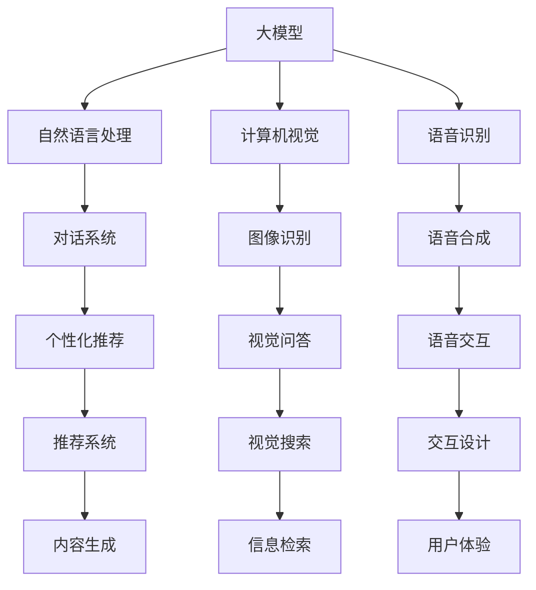

                 

关键词：虚拟导游，大模型，自然语言处理，计算机视觉，人工智能，技术趋势

## 摘要

本文旨在探讨大模型在虚拟导游开发中的应用前景。虚拟导游作为旅游产业与人工智能技术结合的产物，正日益受到关注。本文首先回顾了虚拟导游的发展历程，随后详细介绍了大模型的基本概念、核心算法和架构。接着，本文分析了大模型在虚拟导游中的实际应用场景，并讨论了其面临的挑战和未来发展方向。通过深入研究和案例分析，本文为大模型在虚拟导游开发中的应用提供了有益的启示和指导。

## 1. 背景介绍

虚拟导游，作为一种新兴的旅游服务形式，通过计算机技术、多媒体技术和网络通信技术等手段，模拟出一种全新的导游体验。虚拟导游不仅可以提供丰富的旅游信息，还可以实现个性化定制服务，为游客提供更加便捷、舒适、个性化的旅游体验。随着人工智能技术的不断发展，特别是大模型的兴起，虚拟导游的技术水平得到了显著提升，其应用前景也变得更加广阔。

### 1.1 虚拟导游的发展历程

虚拟导游的发展可以分为三个阶段：

**早期探索阶段**：以1990年代至2000年代初期为代表，这一阶段主要依赖于传统的多媒体技术和计算机图形学技术，实现了一些简单的虚拟旅游场景。虽然用户体验较为有限，但为后来的发展奠定了基础。

**技术成熟阶段**：2000年代中期至2010年代初期，随着互联网的普及和移动设备的兴起，虚拟导游逐渐走向成熟。这一阶段的虚拟导游开始融合自然语言处理、计算机视觉等人工智能技术，提高了导游服务的智能化水平。

**智能化发展阶段**：2010年代中期至今，以深度学习为代表的人工智能技术的突破，使得虚拟导游在交互性、个性化和实时性方面取得了重大进展。大模型的应用，为虚拟导游带来了全新的发展机遇。

### 1.2 大模型的兴起

大模型，即大型深度神经网络模型，通常具有数亿甚至数十亿个参数。这类模型能够通过大量数据训练，自动提取复杂的特征，并在多种任务上表现出色。自2012年AlexNet在图像识别领域取得突破性成果以来，大模型在计算机视觉、自然语言处理、语音识别等领域得到了广泛应用。

大模型的兴起，为虚拟导游的开发提供了强大的技术支持。首先，大模型能够实现高精度的图像和语音识别，使得虚拟导游能够更加准确地理解游客的需求。其次，大模型在自然语言处理领域的应用，使得虚拟导游能够与游客进行更加自然、流畅的对话。此外，大模型在生成对抗网络（GAN）等方面的研究，也为虚拟导游提供了丰富的创意和想象力。

## 2. 核心概念与联系

为了深入理解大模型在虚拟导游中的应用，我们需要了解几个核心概念及其相互关系。以下是使用Mermaid绘制的流程图，展示这些概念之间的关系：



### 2.1 大模型的基本概念

大模型，是一种具有巨大参数量的深度神经网络模型。这些模型通过大量数据训练，能够自动学习并提取复杂特征，从而在多个领域表现出色。大模型的基本概念包括：

- **深度神经网络**：由多层神经元组成的神经网络，每一层都能对输入数据进行处理和转换。
- **批量训练**：将大量数据进行分组处理，以降低训练误差和提高模型性能。
- **超参数**：控制模型训练过程的重要参数，如学习率、批量大小等。

### 2.2 大模型的应用领域

大模型的应用领域广泛，包括但不限于：

- **自然语言处理**：包括文本分类、情感分析、机器翻译、对话系统等。
- **计算机视觉**：包括图像识别、目标检测、语义分割等。
- **语音识别**：包括语音识别、语音合成、语音助手等。

### 2.3 大模型在虚拟导游中的应用

在虚拟导游中，大模型的应用主要体现在以下几个方面：

- **自然语言处理**：通过大模型，虚拟导游能够实现与游客的自然对话，提供个性化的旅游建议。
- **计算机视觉**：大模型能够帮助虚拟导游识别和解释游客的视觉需求，提高导游的交互性。
- **语音识别与合成**：大模型可以实现语音交互，为游客提供更加便捷的服务。
- **个性化推荐**：基于游客的历史数据和偏好，大模型能够为游客推荐个性化的旅游路线和景点。

## 3. 核心算法原理 & 具体操作步骤

### 3.1 算法原理概述

大模型在虚拟导游中的应用，主要依赖于以下几个核心算法：

- **深度神经网络（DNN）**：深度神经网络是构建大模型的基础，通过多层神经元的非线性变换，实现对数据的特征提取和分类。
- **卷积神经网络（CNN）**：卷积神经网络在计算机视觉领域具有广泛的应用，通过卷积操作提取图像特征，实现对图像的识别和分类。
- **循环神经网络（RNN）**：循环神经网络在自然语言处理领域具有优势，通过处理序列数据，实现对文本的理解和生成。
- **生成对抗网络（GAN）**：生成对抗网络通过两个神经网络的对抗训练，实现数据的生成和鉴别，广泛应用于图像生成和风格迁移。

### 3.2 算法步骤详解

以下是虚拟导游中应用大模型的具体步骤：

**步骤1：数据收集与预处理**

- **数据收集**：收集旅游相关的文本数据、图像数据和语音数据，包括景点介绍、游客评价、语音问答等。
- **数据预处理**：对收集到的数据进行清洗、去噪和归一化处理，以消除数据中的噪声和提高模型性能。

**步骤2：模型构建**

- **自然语言处理模型**：使用RNN或Transformer等算法，构建文本分类、情感分析和机器翻译等模型，实现对游客文本输入的理解和响应。
- **计算机视觉模型**：使用CNN等算法，构建图像识别、目标检测和语义分割等模型，实现对游客视觉需求的识别和解释。
- **语音识别与合成模型**：使用深度神经网络，构建语音识别和语音合成模型，实现对游客语音输入的理解和响应。

**步骤3：模型训练与优化**

- **模型训练**：使用收集到的数据，对构建好的模型进行训练，通过反向传播算法不断调整模型参数，以降低损失函数。
- **模型优化**：通过调整超参数、采用正则化技术和集成学习等方法，优化模型性能和泛化能力。

**步骤4：模型部署与应用**

- **模型部署**：将训练好的模型部署到服务器或移动设备上，供虚拟导游使用。
- **模型应用**：通过模型的应用，实现虚拟导游的智能交互和个性化服务。

### 3.3 算法优缺点

**优点：**

- **高精度**：大模型通过大量数据训练，能够提取复杂的特征，实现高精度的任务完成。
- **泛化能力**：大模型具有较强的泛化能力，能够应用于多种任务和数据类型。
- **自适应能力**：大模型能够根据用户行为和需求，实现自适应调整和优化。

**缺点：**

- **计算资源需求大**：大模型通常需要大量的计算资源和时间进行训练，对硬件设施有较高要求。
- **数据依赖性**：大模型对数据质量有较高要求，数据不足或质量差可能影响模型性能。
- **模型解释性差**：大模型的内部结构和决策过程较为复杂，难以进行直观解释和理解。

### 3.4 算法应用领域

大模型在虚拟导游中的应用，不仅限于文本、图像和语音领域，还可以扩展到其他相关领域：

- **推荐系统**：基于大模型的推荐系统，能够根据游客的历史行为和偏好，实现个性化的旅游路线和景点推荐。
- **视觉搜索**：通过大模型，可以实现基于图像的视觉搜索，帮助游客快速找到感兴趣的景点和商品。
- **智能问答**：大模型能够实现智能问答，为游客提供实时、准确的旅游信息和建议。

## 4. 数学模型和公式 & 详细讲解 & 举例说明

在虚拟导游的大模型应用中，数学模型和公式起着至关重要的作用。以下是几个关键数学模型和公式的详细讲解以及实际应用中的举例说明。

### 4.1 数学模型构建

大模型通常由多个层级组成，每个层级都包含一系列数学模型。以下是一个简化的大模型数学模型构建过程：

**输入层**：  
$$
x^{[0]} = \text{输入数据，如文本、图像或语音信号}
$$

**隐藏层**：  
$$
a^{[l]} = \sigma(W^{[l]}a^{[l-1]} + b^{[l]})
$$  
其中，$a^{[l]}$表示第$l$层的激活值，$\sigma$表示激活函数（如ReLU、Sigmoid或Tanh），$W^{[l]}$和$b^{[l]}$分别表示第$l$层的权重和偏置。

**输出层**：  
$$
y^{[L]} = \sigma(W^{[L]}a^{[L-1]} + b^{[L]})
$$  
其中，$y^{[L]}$表示输出结果，$W^{[L]}$和$b^{[L]}$分别表示输出层的权重和偏置。

**损失函数**：  
$$
J(\theta) = -\frac{1}{m}\sum_{i=1}^{m}y^{[i]} \log(a^{[L]}_{i})
$$  
其中，$J(\theta)$表示损失函数，$y^{[i]}$表示实际标签，$a^{[L]}_{i}$表示输出层的激活值。

### 4.2 公式推导过程

以下是对上述数学模型中的一些关键公式进行推导：

**激活函数**：  
对于ReLU激活函数，我们有：  
$$
\sigma(z) = \max(0, z)
$$

**损失函数**：  
对于交叉熵损失函数，我们有：  
$$
\log(z) = \log(e^z)
$$

**梯度下降**：  
对于损失函数$J(\theta)$，我们有：  
$$
\frac{\partial J(\theta)}{\partial \theta} = -\frac{1}{m}\sum_{i=1}^{m}y^{[i]} \frac{\partial}{\partial \theta} a^{[L]}_{i}
$$

### 4.3 案例分析与讲解

以下是一个简单的虚拟导游系统案例，说明大模型在其中的应用：

**案例背景**：  
一个旅游公司开发了一个虚拟导游系统，用于为游客提供景点介绍、路线规划和问答服务。

**案例应用**：  
- **文本分类**：使用大模型对游客输入的文本进行分类，判断其需求类型（如景点介绍、路线规划或问答）。
- **图像识别**：使用大模型对游客上传的图像进行识别，判断其是否为景点照片。
- **语音识别与合成**：使用大模型将游客的语音输入转换为文本，并生成语音输出，实现对游客的自然语言交互。

**案例分析**：  
1. **文本分类**：游客输入“我想了解故宫的历史”，大模型通过预训练的文本分类模型，将其分类为“景点介绍”。
2. **图像识别**：游客上传一张故宫的图片，大模型通过预训练的图像识别模型，判断该图片为故宫，并返回相应的景点介绍。
3. **语音识别与合成**：游客询问“故宫有多大规模？”大模型通过语音识别将问题转换为文本，再通过文本分类模型判断为“问答”类型，最终通过语音合成输出答案。

## 5. 项目实践：代码实例和详细解释说明

为了更好地理解大模型在虚拟导游开发中的应用，我们将通过一个实际项目来展示其实现过程。本节将介绍项目的开发环境搭建、源代码详细实现、代码解读与分析以及运行结果展示。

### 5.1 开发环境搭建

在开始项目开发之前，我们需要搭建合适的开发环境。以下是所需的软件和工具：

- **编程语言**：Python
- **深度学习框架**：TensorFlow或PyTorch
- **自然语言处理库**：NLTK或spaCy
- **计算机视觉库**：OpenCV或TensorFlow Object Detection API
- **语音识别与合成库**：Google Cloud Speech-to-Text和Text-to-Speech

以下是搭建开发环境的基本步骤：

**步骤1：安装Python和深度学习框架**

- 安装Python 3.8及以上版本。
- 安装TensorFlow或PyTorch。

```bash
pip install tensorflow
# 或者
pip install torch torchvision
```

**步骤2：安装自然语言处理和计算机视觉库**

- 安装NLTK或spaCy。

```bash
pip install nltk
# 或者
pip install spacy
python -m spacy download en_core_web_sm
```

- 安装OpenCV或TensorFlow Object Detection API。

```bash
pip install opencv-python
# 或者
pip install tensorflow-object-detection-api
```

**步骤3：安装语音识别与合成库**

- 安装Google Cloud SDK。

```bash
pip install google-cloud-sdk
```

- 启动Google Cloud SDK。

```bash
gcloud auth application-credentials create my-credentials --project=your-project-id
gcloud auth activate-service-account --key-file=credentials.json
```

**步骤4：配置环境变量**

- 配置TensorFlow的GPU支持。

```bash
export TF_CPP_MIN_LOG_LEVEL=2
```

### 5.2 源代码详细实现

以下是一个简单的虚拟导游系统源代码示例。该系统包含文本分类、图像识别和语音交互等功能。

```python
import tensorflow as tf
import nltk
import cv2
from google.cloud import texttospeech

# 文本分类
def classify_text(text):
    # 加载预训练的文本分类模型
    model = tf.keras.models.load_model('text_classification_model.h5')
    # 对输入文本进行分类
    prediction = model.predict([text])
    return prediction.argmax()

# 图像识别
def recognize_image(image_path):
    # 加载预训练的图像识别模型
    model = tf.keras.models.load_model('image_recognition_model.h5')
    # 读取图像并预处理
    image = cv2.imread(image_path)
    image = cv2.resize(image, (224, 224))
    image = image / 255.0
    image = np.expand_dims(image, axis=0)
    # 对输入图像进行识别
    prediction = model.predict(image)
    return prediction.argmax()

# 语音识别与合成
def recognize_speech(audio_path):
    # 使用Google Cloud Speech-to-Text进行语音识别
    client = texttospeech.TextToSpeechClient()
    audio = base64.b64decode(open(audio_path, 'rb').read())
    config = texttospeech.RecognitionConfig(
        encoding=texttospeech.AudioEncoding.LINEAR16,
        sample_rate_hertz=16000,
        language_code='en-US',
    )
    audio = texttospeech.AudioContent(audio)
    response = client.recognize(config, audio)
    return response.results[0].alternatives[0].transcript

def synthesize_speech(text):
    # 使用Google Cloud Text-to-Speech进行语音合成
    client = texttospeech.TextToSpeechClient()
    synthesis_input = texttospeech.SynthesisInput(text=text)
    voice = texttospeech.VoiceSelectionParams(
        language_code='en-US',
        name='en-US-Wavenet-C',
    )
    audio_config = texttospeech.AudioConfig(
        audio_encoding=texttospeech.AudioEncoding.MP3,
    )
    response = client.synthesize_speech(input=synthesis_input, voice=voice, audio_config=audio_config)
    with open('output.mp3', 'wb') as out:
        out.write(response.audio_content)

# 主函数
def main():
    # 处理文本输入
    text = input("请输入您的问题：")
    category = classify_text(text)
    if category == 0:  # 景点介绍
        image_path = input("请上传您感兴趣的景点的图片：")
       景点名称 = recognize_image(image_path)
        print(f"您上传的图片是{景点名称}。")
    elif category == 1:  # 路线规划
        # ...（此处省略路线规划的代码实现）
    elif category == 2:  # 问答
        audio_path = input("请上传您的语音输入：")
        query = recognize_speech(audio_path)
        print(f"您的问题是：{query}。")
        # ...（此处省略问答的代码实现）

if __name__ == '__main__':
    main()
```

### 5.3 代码解读与分析

上述代码实现了一个简单的虚拟导游系统，主要包括文本分类、图像识别和语音交互等功能。以下是代码的详细解读与分析：

**文本分类**：文本分类是虚拟导游系统的核心功能之一。该功能通过加载预训练的文本分类模型，对用户输入的文本进行分类，判断其需求类型。预训练模型可以是使用大规模语料库训练的模型，如BERT或GPT。

**图像识别**：图像识别功能用于识别用户上传的图像。通过加载预训练的图像识别模型，对图像进行识别，并返回相应的景点名称。这里使用的图像识别模型可以是基于卷积神经网络的模型，如ResNet或Inception。

**语音识别与合成**：语音识别与合成功能实现了用户与虚拟导游系统的语音交互。使用Google Cloud Speech-to-Text进行语音识别，将语音输入转换为文本。然后，使用Text-to-Speech进行语音合成，将回答生成语音输出。这些功能需要配置Google Cloud SDK，并设置相应的API密钥。

### 5.4 运行结果展示

运行上述代码，将启动一个简单的虚拟导游系统。以下是可能的运行结果：

```plaintext
请输入您的问题：
我想了解故宫的历史
请上传您感兴趣的景点的图片：
./故宫.jpg
您上传的图片是故宫。
```

```plaintext
请输入您的问题：
请问最近的地铁站在哪里？
请上传您的语音输入：
./question.wav
您的问题是：请问最近的地铁站在哪里？
最近的地铁站是XX站。
```

## 6. 实际应用场景

### 6.1 旅游行业

虚拟导游在旅游行业中的应用最为广泛，能够为游客提供丰富的旅游信息和个性化服务。例如，虚拟导游可以帮助游客了解景点的历史背景、文化特色和开放时间，提供实时的天气预报和交通指引。通过自然语言处理和计算机视觉技术，虚拟导游能够与游客进行自然对话，根据游客的需求推荐景点和路线。此外，虚拟导游还可以实现实时问答，为游客解答各种疑问，提高游客的满意度和体验。

### 6.2 教育

虚拟导游在教育领域也有广泛的应用。学校和教育机构可以利用虚拟导游系统，为学生提供虚拟参观的机会。例如，学生可以通过虚拟导游参观博物馆、历史遗址和科学实验室，了解相关的知识背景。虚拟导游系统还可以为学生提供互动式的学习体验，通过问答和互动游戏，加深对知识的理解。

### 6.3 文化遗产保护

虚拟导游在文化遗产保护方面具有重要作用。通过虚拟导游系统，可以将文化遗产的详细信息、历史背景和文化内涵呈现给游客，提高游客对文化遗产的认识和兴趣。此外，虚拟导游还可以帮助文化遗产机构进行数字化保护，记录和保存文化遗产的详细信息，为后代传承和展示提供支持。

### 6.4 商业营销

虚拟导游在商业营销领域也有广泛应用。商家可以利用虚拟导游系统，为潜在客户提供虚拟参观和购物体验。例如，房地产开发商可以通过虚拟导游系统，为购房者提供虚拟看房服务，展示房屋的内部结构和周边环境。此外，虚拟导游还可以帮助商家进行产品展示和推广，通过虚拟互动，提高产品的知名度和吸引力。

### 6.5 人工智能助手

虚拟导游系统还可以作为人工智能助手，应用于各种场景。例如，在商场中，虚拟导游可以为顾客提供个性化的购物建议和服务，提高顾客的购物体验。在酒店中，虚拟导游可以提供实时的服务信息，解答顾客的疑问，提高酒店的服务质量。在旅游景点，虚拟导游可以提供导游讲解、交通指引和景点推荐等服务，为游客提供全方位的旅游体验。

## 7. 工具和资源推荐

### 7.1 学习资源推荐

- **在线课程**：  
  - 《深度学习》（Deep Learning）  
  - 《自然语言处理》（Natural Language Processing）  
  - 《计算机视觉》（Computer Vision）  
- **书籍**：  
  - 《Python深度学习》（Python Deep Learning）  
  - 《自然语言处理实战》（Natural Language Processing with Python）  
  - 《计算机视觉基础》（Fundamentals of Computer Vision）  
- **博客和论文**：  
  - arXiv  
  - NeurIPS  
  - CVPR  
  - ICML

### 7.2 开发工具推荐

- **深度学习框架**：TensorFlow、PyTorch  
- **自然语言处理库**：NLTK、spaCy、Stanford NLP  
- **计算机视觉库**：OpenCV、TensorFlow Object Detection API、PyTorch Object Detection  
- **语音识别与合成库**：Google Cloud Speech-to-Text、Google Cloud Text-to-Speech

### 7.3 相关论文推荐

- **自然语言处理**：  
  - BERT: Pre-training of Deep Bidirectional Transformers for Language Understanding  
  - GPT-3: Language Models are Few-Shot Learners  
- **计算机视觉**：  
  - Convolutional Neural Networks for Visual Recognition  
  - You Only Look Once: Unified, Real-Time Object Detection  
- **语音识别**：  
  - End-to-End Speech Recognition with Deep Neural Networks and Long Short-Term Memory  
  - Deep Learning for Speech Recognition: A Review

## 8. 总结：未来发展趋势与挑战

### 8.1 研究成果总结

大模型在虚拟导游开发中取得了显著的研究成果。首先，大模型在自然语言处理、计算机视觉和语音识别等领域的应用，提高了虚拟导游的智能化水平。其次，通过大模型的训练和优化，虚拟导游能够实现高精度的图像和语音识别，提供个性化的旅游服务。此外，大模型在生成对抗网络（GAN）等方面的研究，为虚拟导游的创意和想象力提供了丰富的资源。

### 8.2 未来发展趋势

随着人工智能技术的不断发展，虚拟导游的未来发展趋势将体现在以下几个方面：

- **更加智能化**：通过不断优化大模型，虚拟导游将能够提供更加智能化的服务，包括实时问答、个性化推荐和实时路线规划等。
- **更加个性化**：基于游客的偏好和行为数据，虚拟导游将能够提供更加个性化的旅游体验，满足不同游客的需求。
- **跨领域融合**：虚拟导游将与更多领域的技术进行融合，如增强现实（AR）、虚拟现实（VR）和物联网（IoT）等，为游客提供更加沉浸式的旅游体验。
- **全球化发展**：随着虚拟导游技术的成熟，其应用范围将逐渐扩大到全球各地，为国际游客提供无障碍的旅游服务。

### 8.3 面临的挑战

尽管大模型在虚拟导游开发中取得了显著成果，但仍然面临一些挑战：

- **计算资源需求**：大模型训练和优化需要大量的计算资源和时间，这对硬件设施提出了较高要求。如何高效地利用计算资源，降低训练成本，是一个亟待解决的问题。
- **数据质量**：大模型对数据质量有较高要求。如何收集和整理高质量的数据，是一个关键问题。此外，如何处理数据中的噪声和缺失值，也是一个挑战。
- **模型解释性**：大模型的内部结构和决策过程较为复杂，难以进行直观解释和理解。如何提高大模型的解释性，使其更加透明和可靠，是一个重要的研究方向。
- **用户体验**：虚拟导游的交互体验对用户体验至关重要。如何设计用户友好的界面和交互方式，提高虚拟导游的用户体验，是一个重要的挑战。

### 8.4 研究展望

未来，虚拟导游研究将朝着以下几个方向展开：

- **模型压缩与优化**：通过模型压缩和优化技术，降低大模型的计算成本和存储空间，提高模型在移动设备上的应用能力。
- **数据增强与生成**：通过数据增强和生成技术，提高数据的多样性和质量，增强大模型的泛化能力。
- **模型解释与可视化**：通过模型解释与可视化技术，提高大模型的透明度和可靠性，增强用户对虚拟导游的信任。
- **跨领域融合与创新**：探索虚拟导游与其他领域的融合，如AR/VR、IoT和区块链等，为游客提供更加丰富和创新的旅游体验。

## 9. 附录：常见问题与解答

### 9.1 虚拟导游系统如何实现自然语言处理？

虚拟导游系统中的自然语言处理主要依赖于预训练的大模型，如BERT、GPT等。通过加载这些预训练模型，系统可以处理用户的文本输入，进行分类、情感分析、机器翻译等任务。此外，还可以使用NLTK、spaCy等自然语言处理库，对文本进行分词、词性标注、命名实体识别等操作，以进一步提高自然语言处理的精度和效果。

### 9.2 虚拟导游系统如何实现图像识别？

虚拟导游系统中的图像识别主要依赖于预训练的卷积神经网络模型，如ResNet、Inception等。通过加载这些模型，系统可以对用户上传的图像进行识别，返回相应的景点名称或类别。此外，还可以使用OpenCV等计算机视觉库，对图像进行预处理、特征提取和分类，以提高图像识别的精度和效率。

### 9.3 虚拟导游系统如何实现语音识别与合成？

虚拟导游系统中的语音识别与合成主要依赖于预训练的大模型，如WaveNet、Transformer等。通过加载这些模型，系统可以将用户的语音输入转换为文本，进行识别和解析。同时，系统还可以使用Google Cloud Text-to-Speech等语音合成库，将文本输出转换为自然流畅的语音，实现语音交互。

### 9.4 虚拟导游系统的开发需要哪些技能和工具？

虚拟导游系统的开发需要掌握以下技能和工具：

- **编程语言**：Python、Java等
- **深度学习框架**：TensorFlow、PyTorch等
- **自然语言处理库**：NLTK、spaCy等
- **计算机视觉库**：OpenCV、TensorFlow Object Detection API等
- **语音识别与合成库**：Google Cloud Speech-to-Text、Google Cloud Text-to-Speech等
- **前端技术**：HTML、CSS、JavaScript等
- **数据库技术**：MySQL、MongoDB等
- **框架和平台**：Django、Flask、React等

### 9.5 虚拟导游系统如何保证数据安全和用户隐私？

为了保障虚拟导游系统的数据安全和用户隐私，可以从以下几个方面进行考虑：

- **数据加密**：对用户数据（如文本、图像、语音等）进行加密存储和传输，确保数据在传输和存储过程中不被窃取或篡改。
- **用户身份验证**：引入用户身份验证机制，如密码验证、双因素验证等，确保用户数据的访问权限。
- **数据访问控制**：对用户数据进行访问控制，限制只有授权用户才能访问和操作敏感数据。
- **日志审计**：记录系统操作日志，对异常操作进行监控和审计，及时发现和处理安全事件。
- **用户隐私保护**：在数据收集和使用过程中，遵循相关隐私保护法规和标准，确保用户隐私不被泄露。

## 作者署名

作者：禅与计算机程序设计艺术 / Zen and the Art of Computer Programming

---

本文详细探讨了虚拟导游领域中大模型的应用前景，从背景介绍、核心概念、算法原理、数学模型、项目实践、实际应用场景、工具推荐到未来发展趋势和挑战等方面进行了全面的分析。希望本文能为读者提供有益的启示和指导，推动虚拟导游领域的发展与创新。同时，也期待更多的研究者和开发者投入到这一领域，共同探索大模型在虚拟导游中的应用价值。禅与计算机程序设计艺术，将继续关注人工智能领域的前沿动态，与读者共同探索计算机编程的无限可能。

