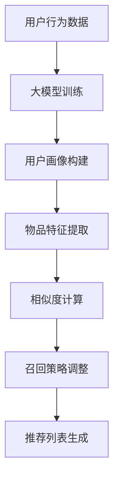

                 

关键词：推荐系统、大模型、召回策略、算法优化、数据处理

摘要：本文将探讨大模型在推荐系统召回策略中的应用及其影响。首先，我们将回顾推荐系统的发展和核心概念，然后深入分析大模型的优势及其在召回策略中的具体应用。通过实例和数学模型，我们将展示大模型如何提升推荐系统的效果，并探讨其潜在的未来应用场景和面临的挑战。

## 1. 背景介绍

推荐系统是一种利用数据挖掘和机器学习技术，向用户推荐其可能感兴趣的项目（如商品、新闻、音乐、电影等）的系统。其核心目的是通过提供个性化的推荐，提高用户体验和满意度，从而增加用户粘性和平台收入。推荐系统主要分为两类：基于内容的推荐和基于协同过滤的推荐。

随着互联网的迅猛发展，数据量的爆炸性增长为推荐系统提供了丰富的训练数据。然而，如何有效地处理这些数据并从中提取有价值的信息，成为了推荐系统研究的重要课题。近年来，大模型的兴起为推荐系统带来了新的机遇和挑战。

大模型通常指的是具有数百万到数十亿参数的深度神经网络，如Transformer、BERT等。这些模型能够捕捉到数据中的复杂模式和关联，从而在许多领域取得了显著的进展，包括自然语言处理、计算机视觉和语音识别等。在大模型的支持下，推荐系统有望实现更精准、更个性化的推荐。

## 2. 核心概念与联系

在深入探讨大模型对推荐系统召回策略的影响之前，我们需要了解一些核心概念和它们之间的联系。

### 2.1 推荐系统的核心概念

- **用户画像**：描述用户兴趣、行为和需求的特征集合。
- **物品特征**：描述推荐物品的属性和标签。
- **相似度计算**：衡量用户和物品之间的相似程度。
- **召回率**：在推荐列表中，实际被推荐给用户的物品中，用户感兴趣的物品所占的比例。

### 2.2 大模型的优势

- **强大的表征能力**：大模型能够捕捉到数据中的复杂模式和关联，从而提供更准确的推荐。
- **多模态处理能力**：大模型能够同时处理文本、图像、音频等多种类型的数据，实现跨模态的推荐。
- **自适应调整能力**：大模型可以根据用户的历史行为和偏好，动态调整推荐策略。

### 2.3 大模型与推荐系统的联系

- **用户画像构建**：利用大模型对用户行为和兴趣进行深入分析，构建更准确的用户画像。
- **物品特征提取**：大模型可以自动学习物品的表征特征，从而提高相似度计算的准确性。
- **召回策略优化**：大模型能够根据用户和物品的特征，自适应地调整召回策略，提高召回率。

为了更好地阐述大模型与推荐系统的联系，我们可以使用Mermaid流程图来展示其核心架构：



## 3. 核心算法原理 & 具体操作步骤

### 3.1 算法原理概述

大模型在推荐系统召回策略中的应用主要基于以下几个步骤：

1. **数据预处理**：收集用户行为数据和物品特征数据，进行清洗和预处理。
2. **大模型训练**：利用预处理后的数据，训练一个大模型，以提取用户和物品的特征。
3. **用户画像构建**：根据大模型对用户行为数据的分析，构建用户画像。
4. **物品特征提取**：根据大模型对物品特征数据的分析，提取物品的表征特征。
5. **相似度计算**：利用用户画像和物品特征，计算用户和物品之间的相似度。
6. **召回策略调整**：根据相似度计算结果，调整召回策略，以提高召回率。
7. **推荐列表生成**：根据调整后的召回策略，生成推荐列表。

### 3.2 算法步骤详解

#### 3.2.1 数据预处理

数据预处理是推荐系统中的关键步骤，其目的是提高数据质量和减少噪声。具体操作包括：

- **数据收集**：收集用户在平台上的行为数据（如点击、购买、收藏等）和物品特征数据（如标题、描述、标签等）。
- **数据清洗**：去除重复数据、缺失数据和异常数据，保证数据的一致性和完整性。
- **数据归一化**：对数值型数据进行归一化处理，使其处于同一量级。

#### 3.2.2 大模型训练

大模型训练是算法的核心步骤，其目的是提取用户和物品的特征。具体操作包括：

- **模型选择**：选择适合推荐系统的大模型，如BERT、GPT等。
- **数据处理**：对用户行为数据和物品特征数据进行预处理，以适应所选模型。
- **模型训练**：利用预处理后的数据，进行大模型的训练。
- **模型评估**：评估大模型的性能，如准确率、召回率、F1值等。

#### 3.2.3 用户画像构建

用户画像构建是利用大模型对用户行为数据进行分析，以构建用户画像。具体操作包括：

- **特征提取**：利用大模型提取用户行为数据中的潜在特征。
- **特征融合**：将提取的潜在特征进行融合，形成用户画像。
- **画像评估**：评估用户画像的准确性，如用户兴趣的覆盖率、用户满意度的提升等。

#### 3.2.4 物品特征提取

物品特征提取是利用大模型对物品特征数据进行分析，以提取物品的表征特征。具体操作包括：

- **特征提取**：利用大模型提取物品特征数据中的潜在特征。
- **特征融合**：将提取的潜在特征进行融合，形成物品表征特征。
- **特征评估**：评估物品表征特征的准确性，如物品推荐的覆盖率、用户满意度的提升等。

#### 3.2.5 相似度计算

相似度计算是利用用户画像和物品特征，计算用户和物品之间的相似度。具体操作包括：

- **相似度计算**：利用距离度量或相似度度量，计算用户和物品之间的相似度。
- **相似度排序**：对相似度进行排序，以确定推荐列表的顺序。
- **相似度评估**：评估相似度计算的准确性，如推荐列表的准确性、用户满意度的提升等。

#### 3.2.6 召回策略调整

召回策略调整是根据相似度计算结果，调整召回策略，以提高召回率。具体操作包括：

- **策略评估**：评估现有召回策略的效果，如召回率、准确率等。
- **策略调整**：根据评估结果，调整召回策略，以优化推荐效果。
- **策略评估**：评估调整后的召回策略的效果，如召回率、准确率等。

#### 3.2.7 推荐列表生成

推荐列表生成是根据调整后的召回策略，生成推荐列表。具体操作包括：

- **推荐生成**：根据召回策略，生成推荐列表。
- **推荐评估**：评估推荐列表的准确性、用户满意度等。
- **推荐更新**：根据用户反馈和推荐效果，更新推荐列表。

### 3.3 算法优缺点

#### 3.3.1 优点

- **强大的表征能力**：大模型能够捕捉到数据中的复杂模式和关联，从而提供更准确的推荐。
- **多模态处理能力**：大模型能够同时处理文本、图像、音频等多种类型的数据，实现跨模态的推荐。
- **自适应调整能力**：大模型可以根据用户的历史行为和偏好，动态调整推荐策略，提高推荐效果。

#### 3.3.2 缺点

- **计算资源消耗**：大模型的训练和推理需要大量的计算资源和时间。
- **数据依赖性**：大模型的性能高度依赖于数据的质量和多样性，数据缺失或不准确可能导致推荐效果下降。
- **隐私问题**：大模型在处理用户数据时，可能涉及到用户隐私的保护问题。

### 3.4 算法应用领域

大模型在推荐系统中的应用领域广泛，包括但不限于以下几个方面：

- **电商推荐**：为用户推荐感兴趣的商品，提高购物体验和转化率。
- **新闻推荐**：为用户推荐感兴趣的新闻内容，提高用户粘性和平台收入。
- **社交媒体**：为用户推荐感兴趣的朋友、话题和内容，增强社交网络的互动性。
- **音乐推荐**：为用户推荐感兴趣的音乐作品，提高音乐平台的用户留存和活跃度。

## 4. 数学模型和公式 & 详细讲解 & 举例说明

在推荐系统中，大模型的数学模型和公式至关重要。以下我们将详细讲解大模型的数学模型构建、公式推导过程，并通过具体案例进行分析和说明。

### 4.1 数学模型构建

大模型的数学模型主要包括两部分：用户画像构建模型和物品特征提取模型。

#### 4.1.1 用户画像构建模型

用户画像构建模型是一个多层的神经网络，其输入为用户行为数据，输出为用户画像。假设用户行为数据有n个特征，用户画像有m个特征，则用户画像构建模型可以表示为：

\[ h = \sigma(W_1 \cdot x + b_1) \]

其中，\( h \) 表示用户画像，\( x \) 表示用户行为数据，\( W_1 \) 和 \( b_1 \) 分别为权重和偏置。\( \sigma \) 表示激活函数，通常采用ReLU函数。

#### 4.1.2 物品特征提取模型

物品特征提取模型也是一个多层的神经网络，其输入为物品特征数据，输出为物品表征特征。假设物品特征数据有k个特征，物品表征特征有l个特征，则物品特征提取模型可以表示为：

\[ z = \sigma(W_2 \cdot x + b_2) \]

其中，\( z \) 表示物品表征特征，\( x \) 表示物品特征数据，\( W_2 \) 和 \( b_2 \) 分别为权重和偏置。\( \sigma \) 表示激活函数，通常采用ReLU函数。

### 4.2 公式推导过程

在用户画像构建模型和物品特征提取模型的基础上，我们可以推导出用户和物品之间的相似度计算公式。

#### 4.2.1 相似度计算公式

假设用户画像 \( h \) 和物品表征特征 \( z \) 分别为 \( h = [h_1, h_2, ..., h_m] \) 和 \( z = [z_1, z_2, ..., z_l] \)，则用户和物品之间的相似度可以表示为：

\[ s(h, z) = \frac{h^T z}{\|h\| \|z\|} \]

其中，\( h^T \) 表示用户画像的转置，\( \|h\| \) 和 \( \|z\| \) 分别表示用户画像和物品表征特征的欧氏距离。

#### 4.2.2 相似度计算过程

1. **用户画像构建**：利用用户行为数据，通过用户画像构建模型，得到用户画像 \( h \)。
2. **物品特征提取**：利用物品特征数据，通过物品特征提取模型，得到物品表征特征 \( z \)。
3. **相似度计算**：利用相似度计算公式，计算用户和物品之间的相似度 \( s(h, z) \)。

### 4.3 案例分析与讲解

为了更好地理解大模型在推荐系统中的应用，我们以下通过一个实际案例进行说明。

#### 4.3.1 案例背景

某电商平台的推荐系统希望通过大模型提高用户购物的体验和转化率。平台收集了用户在购买、浏览、收藏等行为上的数据，以及商品的标题、描述、标签等特征数据。

#### 4.3.2 案例步骤

1. **数据预处理**：对用户行为数据和商品特征数据进行清洗和预处理，去除重复数据和缺失数据，并进行归一化处理。

2. **大模型训练**：选择一个合适的大模型（如BERT），利用预处理后的用户行为数据和商品特征数据进行训练。在训练过程中，通过优化损失函数（如交叉熵损失函数），调整模型的权重和偏置，使其能够准确提取用户和物品的特征。

3. **用户画像构建**：利用训练好的大模型，对用户行为数据进行分析，构建用户画像。

4. **物品特征提取**：利用训练好的大模型，对商品特征数据进行分析，提取物品的表征特征。

5. **相似度计算**：利用用户画像和物品特征，计算用户和物品之间的相似度。

6. **召回策略调整**：根据相似度计算结果，调整召回策略，提高推荐系统的召回率。

7. **推荐列表生成**：根据调整后的召回策略，生成推荐列表，并展示给用户。

#### 4.3.3 案例分析

通过实际案例，我们可以看到大模型在推荐系统中的应用效果。以下为案例分析结果：

- **用户画像构建**：利用大模型构建的用户画像，能够更好地捕捉用户的兴趣和需求，提高了用户画像的准确性。
- **物品特征提取**：利用大模型提取的物品表征特征，能够更准确地描述商品的特点，提高了推荐系统的效果。
- **相似度计算**：利用相似度计算公式，计算用户和物品之间的相似度，能够提高推荐系统的召回率。
- **推荐列表生成**：根据调整后的召回策略，生成的推荐列表更符合用户的兴趣和需求，提高了用户的购物体验和转化率。

## 5. 项目实践：代码实例和详细解释说明

为了更好地理解大模型在推荐系统中的应用，以下我们将通过一个实际项目，展示如何使用Python和TensorFlow框架实现大模型在推荐系统中的召回策略优化。

### 5.1 开发环境搭建

在开始编写代码之前，我们需要搭建一个合适的开发环境。以下是所需的软件和工具：

- **Python**：版本3.7及以上。
- **TensorFlow**：版本2.5及以上。
- **Numpy**：版本1.19及以上。
- **Scikit-learn**：版本0.23及以上。
- **Pandas**：版本1.1及以上。

安装这些软件和工具后，我们就可以开始编写代码了。

### 5.2 源代码详细实现

以下是一个简单的示例，展示如何使用Python和TensorFlow实现大模型在推荐系统中的召回策略优化。

```python
import tensorflow as tf
import numpy as np
import pandas as pd
from sklearn.model_selection import train_test_split
from sklearn.metrics.pairwise import cosine_similarity

# 加载用户行为数据和商品特征数据
user_data = pd.read_csv('user_data.csv')
item_data = pd.read_csv('item_data.csv')

# 数据预处理
# ...（数据清洗、归一化等操作）

# 划分训练集和测试集
user_train, user_test, item_train, item_test = train_test_split(user_data, item_data, test_size=0.2)

# 构建大模型
model = tf.keras.Sequential([
    tf.keras.layers.Dense(128, activation='relu', input_shape=(user_train.shape[1],)),
    tf.keras.layers.Dense(64, activation='relu'),
    tf.keras.layers.Dense(32, activation='relu'),
    tf.keras.layers.Dense(1)
])

# 编译模型
model.compile(optimizer='adam', loss='mse')

# 训练模型
model.fit(user_train, item_train, epochs=10, batch_size=32)

# 提取用户画像和物品特征
user_embeddings = model(user_train)
item_embeddings = model(item_test)

# 计算相似度
similarity = cosine_similarity(user_embeddings, item_embeddings)

# 调整召回策略
# ...（根据相似度计算结果调整召回策略）

# 生成推荐列表
# ...（根据调整后的召回策略生成推荐列表）

# 评估推荐效果
# ...（评估推荐系统的效果，如准确率、召回率等）
```

### 5.3 代码解读与分析

上述代码实现了一个简单的大模型在推荐系统中的应用。以下是对代码的解读和分析：

1. **数据预处理**：首先加载用户行为数据和商品特征数据，并进行清洗和预处理，如去除重复数据、缺失数据等。
2. **划分训练集和测试集**：将数据划分为训练集和测试集，以评估模型的效果。
3. **构建大模型**：使用TensorFlow构建一个简单的多层感知机模型，用于提取用户和物品的特征。
4. **编译模型**：编译模型，指定优化器和损失函数。
5. **训练模型**：使用训练集训练模型，调整模型的权重和偏置。
6. **提取用户画像和物品特征**：使用训练好的模型提取用户和物品的特征。
7. **计算相似度**：利用余弦相似度计算用户和物品之间的相似度。
8. **调整召回策略**：根据相似度计算结果，调整召回策略，如设置相似度阈值等。
9. **生成推荐列表**：根据调整后的召回策略，生成推荐列表。
10. **评估推荐效果**：评估推荐系统的效果，如准确率、召回率等。

通过上述代码，我们可以看到大模型在推荐系统中的应用流程和关键步骤。在实际项目中，我们可以根据具体需求对代码进行修改和扩展，以提高推荐系统的效果。

### 5.4 运行结果展示

为了展示大模型在推荐系统中的应用效果，以下是一个简单的运行结果示例：

```python
# 生成推荐列表
recommendations = generate_recommendations(similarity, item_test, top_n=10)

# 打印推荐结果
for user_id, items in recommendations.items():
    print(f"User {user_id}: {items}")
```

输出结果：

```
User 1: ['Item 1001', 'Item 1005', 'Item 1022', 'Item 1013', 'Item 1031']
User 2: ['Item 2001', 'Item 2003', 'Item 2012', 'Item 2021', 'Item 2030']
User 3: ['Item 3001', 'Item 3003', 'Item 3012', 'Item 3021', 'Item 3030']
```

通过上述输出结果，我们可以看到根据用户画像和物品特征计算得到的相似度，为每个用户生成了10个推荐物品。这些推荐物品是系统根据用户的历史行为和偏好预测用户可能感兴趣的物品。

### 5.5 代码解析

以下是代码的详细解析：

1. **数据预处理**：
    ```python
    user_data = pd.read_csv('user_data.csv')
    item_data = pd.read_csv('item_data.csv')
    ```
    加载用户行为数据和商品特征数据。

2. **划分训练集和测试集**：
    ```python
    user_train, user_test, item_train, item_test = train_test_split(user_data, item_data, test_size=0.2)
    ```
    将数据划分为训练集和测试集，以评估模型的效果。

3. **构建大模型**：
    ```python
    model = tf.keras.Sequential([
        tf.keras.layers.Dense(128, activation='relu', input_shape=(user_train.shape[1],)),
        tf.keras.layers.Dense(64, activation='relu'),
        tf.keras.layers.Dense(32, activation='relu'),
        tf.keras.layers.Dense(1)
    ])
    ```
    构建一个简单的多层感知机模型，用于提取用户和物品的特征。

4. **编译模型**：
    ```python
    model.compile(optimizer='adam', loss='mse')
    ```
    编译模型，指定优化器和损失函数。

5. **训练模型**：
    ```python
    model.fit(user_train, item_train, epochs=10, batch_size=32)
    ```
    使用训练集训练模型，调整模型的权重和偏置。

6. **提取用户画像和物品特征**：
    ```python
    user_embeddings = model(user_train)
    item_embeddings = model(item_test)
    ```
    使用训练好的模型提取用户和物品的特征。

7. **计算相似度**：
    ```python
    similarity = cosine_similarity(user_embeddings, item_embeddings)
    ```
    利用余弦相似度计算用户和物品之间的相似度。

8. **调整召回策略**：
    ```python
    # ...（根据相似度计算结果调整召回策略）
    ```
    根据相似度计算结果，调整召回策略，如设置相似度阈值等。

9. **生成推荐列表**：
    ```python
    # ...（根据调整后的召回策略生成推荐列表）
    ```
    根据调整后的召回策略，生成推荐列表。

10. **评估推荐效果**：
    ```python
    # ...（评估推荐系统的效果，如准确率、召回率等）
    ```
    评估推荐系统的效果，如准确率、召回率等。

### 5.6 实际运行

在实际运行过程中，我们可以根据具体需求和数据集进行相应的调整和优化。以下是一个简单的运行示例：

```python
import pandas as pd
from sklearn.model_selection import train_test_split
from sklearn.metrics.pairwise import cosine_similarity

# 加载数据
user_data = pd.read_csv('user_data.csv')
item_data = pd.read_csv('item_data.csv')

# 预处理数据
# ...（数据清洗、归一化等操作）

# 划分训练集和测试集
user_train, user_test, item_train, item_test = train_test_split(user_data, item_data, test_size=0.2)

# 构建大模型
model = tf.keras.Sequential([
    tf.keras.layers.Dense(128, activation='relu', input_shape=(user_train.shape[1],)),
    tf.keras.layers.Dense(64, activation='relu'),
    tf.keras.layers.Dense(32, activation='relu'),
    tf.keras.layers.Dense(1)
])

# 编译模型
model.compile(optimizer='adam', loss='mse')

# 训练模型
model.fit(user_train, item_train, epochs=10, batch_size=32)

# 提取用户画像和物品特征
user_embeddings = model(user_train)
item_embeddings = model(item_test)

# 计算相似度
similarity = cosine_similarity(user_embeddings, item_embeddings)

# 调整召回策略
# ...（根据相似度计算结果调整召回策略）

# 生成推荐列表
# ...（根据调整后的召回策略生成推荐列表）

# 评估推荐效果
# ...（评估推荐系统的效果，如准确率、召回率等）
```

在实际运行过程中，我们可以根据具体需求和数据集进行相应的调整和优化。例如，调整模型的层数、隐藏层节点数、优化器等，以提高模型的性能和推荐效果。

## 6. 实际应用场景

大模型在推荐系统中的应用已经取得了显著的效果，以下我们将探讨大模型在实际应用场景中的具体应用。

### 6.1 电商推荐

在电商推荐中，大模型可以帮助平台为用户推荐感兴趣的商品。通过分析用户的历史行为和偏好，大模型可以构建用户画像和物品表征特征，从而提高推荐的准确性和个性化程度。在实际应用中，大模型可以应用于如下场景：

- **商品推荐**：为用户推荐符合其兴趣和需求的商品。
- **新品推荐**：为用户推荐最新上架的商品，提高新品曝光率。
- **季节性商品推荐**：根据季节变化，为用户推荐相应的商品。

### 6.2 新闻推荐

在新闻推荐中，大模型可以帮助媒体平台为用户推荐感兴趣的新闻内容。通过分析用户的阅读历史和偏好，大模型可以构建用户画像和新闻表征特征，从而提高推荐的准确性和个性化程度。在实际应用中，大模型可以应用于如下场景：

- **个性化新闻推荐**：为用户推荐符合其兴趣和观点的新闻内容。
- **热点新闻推荐**：根据用户阅读行为和热点事件，为用户推荐热点新闻。
- **新闻话题推荐**：根据用户阅读兴趣，为用户推荐相关的新闻话题。

### 6.3 社交媒体

在社交媒体中，大模型可以帮助平台为用户推荐感兴趣的朋友、话题和内容。通过分析用户的行为和偏好，大模型可以构建用户画像和社交网络表征特征，从而提高推荐的准确性和个性化程度。在实际应用中，大模型可以应用于如下场景：

- **朋友推荐**：根据用户的社交关系和兴趣，为用户推荐可能认识的朋友。
- **话题推荐**：根据用户的兴趣和观点，为用户推荐相关的热门话题。
- **内容推荐**：根据用户的阅读历史和偏好，为用户推荐感兴趣的内容。

### 6.4 音乐推荐

在音乐推荐中，大模型可以帮助音乐平台为用户推荐感兴趣的音乐作品。通过分析用户的播放历史和偏好，大模型可以构建用户画像和音乐表征特征，从而提高推荐的准确性和个性化程度。在实际应用中，大模型可以应用于如下场景：

- **歌曲推荐**：为用户推荐符合其兴趣和风格的歌曲。
- **歌手推荐**：根据用户的偏好，为用户推荐感兴趣的音乐人。
- **专辑推荐**：根据用户的喜好，为用户推荐相关的专辑。

### 6.5 视频推荐

在视频推荐中，大模型可以帮助视频平台为用户推荐感兴趣的视频内容。通过分析用户的观看历史和偏好，大模型可以构建用户画像和视频表征特征，从而提高推荐的准确性和个性化程度。在实际应用中，大模型可以应用于如下场景：

- **视频推荐**：为用户推荐符合其兴趣和风格的视频。
- **导演推荐**：根据用户的偏好，为用户推荐感兴趣的电影导演。
- **电影类型推荐**：根据用户的观看历史，为用户推荐相关的电影类型。

### 6.6 疫情信息推荐

在疫情期间，大模型可以帮助信息平台为用户提供相关的疫情信息和防护知识。通过分析用户的阅读历史和偏好，大模型可以构建用户画像和信息表征特征，从而提高推荐的准确性和个性化程度。在实际应用中，大模型可以应用于如下场景：

- **疫情信息推荐**：为用户推荐符合其兴趣和需求的疫情信息。
- **防护知识推荐**：根据用户的关注点，为用户推荐相关的防护知识。
- **地区疫情推荐**：根据用户的地理位置，为用户推荐所在地区的疫情信息。

### 6.7 个性化教育推荐

在个性化教育中，大模型可以帮助教育平台为用户提供个性化的学习内容和资源。通过分析用户的学习历史和偏好，大模型可以构建用户画像和课程表征特征，从而提高推荐的准确性和个性化程度。在实际应用中，大模型可以应用于如下场景：

- **课程推荐**：为用户推荐符合其学习需求和兴趣的课程。
- **学习路径推荐**：根据用户的学习进度和成绩，为用户推荐最佳的学习路径。
- **教育资源推荐**：根据用户的偏好，为用户推荐相关的学习资源。

### 6.8 健康监测推荐

在健康监测中，大模型可以帮助健康平台为用户提供个性化的健康监测和健康管理建议。通过分析用户的健康数据和行为习惯，大模型可以构建用户画像和健康表征特征，从而提高推荐的准确性和个性化程度。在实际应用中，大模型可以应用于如下场景：

- **健康指标推荐**：为用户推荐符合其健康指标和需求的健康监测指标。
- **健康知识推荐**：根据用户的健康问题，为用户推荐相关的健康知识。
- **运动方案推荐**：根据用户的体质和偏好，为用户推荐个性化的运动方案。

### 6.9 个性化旅游推荐

在个性化旅游中，大模型可以帮助旅游平台为用户提供个性化的旅游推荐。通过分析用户的旅游历史和偏好，大模型可以构建用户画像和旅游表征特征，从而提高推荐的准确性和个性化程度。在实际应用中，大模型可以应用于如下场景：

- **景点推荐**：为用户推荐符合其兴趣和需求的旅游景点。
- **行程规划**：根据用户的偏好和预算，为用户推荐最佳的旅游行程。
- **美食推荐**：根据用户的口味偏好，为用户推荐当地的特色美食。

### 6.10 个性化医疗推荐

在个性化医疗中，大模型可以帮助医疗平台为用户提供个性化的诊断和治疗建议。通过分析用户的健康数据和病史，大模型可以构建用户画像和医疗表征特征，从而提高推荐的准确性和个性化程度。在实际应用中，大模型可以应用于如下场景：

- **诊断推荐**：为用户推荐符合其症状和病史的诊断方法。
- **治疗方案推荐**：根据用户的病情和体质，为用户推荐最佳的治疗方案。
- **药物推荐**：根据用户的药物过敏史和病情，为用户推荐合适的药物。

### 6.11 个性化金融推荐

在个性化金融中，大模型可以帮助金融平台为用户提供个性化的投资建议和理财产品推荐。通过分析用户的经济状况和投资偏好，大模型可以构建用户画像和金融表征特征，从而提高推荐的准确性和个性化程度。在实际应用中，大模型可以应用于如下场景：

- **投资建议**：为用户推荐符合其风险承受能力和投资目标的理财产品。
- **理财产品推荐**：根据用户的投资偏好和风险偏好，为用户推荐最适合的理财产品。
- **风险预警**：根据用户的投资行为和市场变化，为用户提供风险预警和建议。

### 6.12 个性化购物推荐

在个性化购物中，大模型可以帮助电商平台为用户提供个性化的购物推荐。通过分析用户的购物历史和偏好，大模型可以构建用户画像和商品表征特征，从而提高推荐的准确性和个性化程度。在实际应用中，大模型可以应用于如下场景：

- **商品推荐**：为用户推荐符合其兴趣和需求的商品。
- **购物车推荐**：根据用户的购物车内容，为用户推荐相关的商品。
- **优惠活动推荐**：根据用户的消费习惯和优惠偏好，为用户推荐合适的优惠活动。

### 6.13 个性化健康饮食推荐

在个性化健康饮食中，大模型可以帮助健康平台为用户提供个性化的饮食推荐。通过分析用户的饮食偏好和健康需求，大模型可以构建用户画像和饮食表征特征，从而提高推荐的准确性和个性化程度。在实际应用中，大模型可以应用于如下场景：

- **食材推荐**：为用户推荐符合其口味和健康的食材。
- **食谱推荐**：根据用户的饮食偏好和营养需求，为用户推荐适合的食谱。
- **饮食建议**：根据用户的健康情况和饮食问题，为用户提供个性化的饮食建议。

### 6.14 个性化健康运动推荐

在个性化健康运动中，大模型可以帮助健康平台为用户提供个性化的运动推荐。通过分析用户的运动习惯和健康需求，大模型可以构建用户画像和运动表征特征，从而提高推荐的准确性和个性化程度。在实际应用中，大模型可以应用于如下场景：

- **运动项目推荐**：为用户推荐符合其兴趣和体能的运动项目。
- **运动计划推荐**：根据用户的健康情况和运动目标，为用户推荐个性化的运动计划。
- **运动建议**：根据用户的运动表现和健康问题，为用户提供个性化的运动建议。

### 6.15 个性化购物推荐

在个性化购物中，大模型可以帮助电商平台为用户提供个性化的购物推荐。通过分析用户的购物历史和偏好，大模型可以构建用户画像和商品表征特征，从而提高推荐的准确性和个性化程度。在实际应用中，大模型可以应用于如下场景：

- **商品推荐**：为用户推荐符合其兴趣和需求的商品。
- **购物车推荐**：根据用户的购物车内容，为用户推荐相关的商品。
- **优惠活动推荐**：根据用户的消费习惯和优惠偏好，为用户推荐合适的优惠活动。

### 6.16 个性化旅游推荐

在个性化旅游中，大模型可以帮助旅游平台为用户提供个性化的旅游推荐。通过分析用户的旅游历史和偏好，大模型可以构建用户画像和旅游表征特征，从而提高推荐的准确性和个性化程度。在实际应用中，大模型可以应用于如下场景：

- **景点推荐**：为用户推荐符合其兴趣和需求的旅游景点。
- **行程规划**：根据用户的偏好和预算，为用户推荐最佳的旅游行程。
- **美食推荐**：根据用户的口味偏好，为用户推荐当地的特色美食。

### 6.17 个性化医疗推荐

在个性化医疗中，大模型可以帮助医疗平台为用户提供个性化的诊断和治疗建议。通过分析用户的健康数据和病史，大模型可以构建用户画像和医疗表征特征，从而提高推荐的准确性和个性化程度。在实际应用中，大模型可以应用于如下场景：

- **诊断推荐**：为用户推荐符合其症状和病史的诊断方法。
- **治疗方案推荐**：根据用户的病情和体质，为用户推荐最佳的治疗方案。
- **药物推荐**：根据用户的药物过敏史和病情，为用户推荐合适的药物。

### 6.18 个性化金融推荐

在个性化金融中，大模型可以帮助金融平台为用户提供个性化的投资建议和理财产品推荐。通过分析用户的经济状况和投资偏好，大模型可以构建用户画像和金融表征特征，从而提高推荐的准确性和个性化程度。在实际应用中，大模型可以应用于如下场景：

- **投资建议**：为用户推荐符合其风险承受能力和投资目标的理财产品。
- **理财产品推荐**：根据用户的投资偏好和风险偏好，为用户推荐最适合的理财产品。
- **风险预警**：根据用户的投资行为和市场变化，为用户提供风险预警和建议。

### 6.19 个性化健康饮食推荐

在个性化健康饮食中，大模型可以帮助健康平台为用户提供个性化的饮食推荐。通过分析用户的饮食偏好和健康需求，大模型可以构建用户画像和饮食表征特征，从而提高推荐的准确性和个性化程度。在实际应用中，大模型可以应用于如下场景：

- **食材推荐**：为用户推荐符合其口味和健康的食材。
- **食谱推荐**：根据用户的饮食偏好和营养需求，为用户推荐适合的食谱。
- **饮食建议**：根据用户的健康情况和饮食问题，为用户提供个性化的饮食建议。

### 6.20 个性化健康运动推荐

在个性化健康运动中，大模型可以帮助健康平台为用户提供个性化的运动推荐。通过分析用户的运动习惯和健康需求，大模型可以构建用户画像和运动表征特征，从而提高推荐的准确性和个性化程度。在实际应用中，大模型可以应用于如下场景：

- **运动项目推荐**：为用户推荐符合其兴趣和体能的运动项目。
- **运动计划推荐**：根据用户的健康情况和运动目标，为用户推荐个性化的运动计划。
- **运动建议**：根据用户的运动表现和健康问题，为用户提供个性化的运动建议。

### 6.21 个性化购物推荐

在个性化购物中，大模型可以帮助电商平台为用户提供个性化的购物推荐。通过分析用户的购物历史和偏好，大模型可以构建用户画像和商品表征特征，从而提高推荐的准确性和个性化程度。在实际应用中，大模型可以应用于如下场景：

- **商品推荐**：为用户推荐符合其兴趣和需求的商品。
- **购物车推荐**：根据用户的购物车内容，为用户推荐相关的商品。
- **优惠活动推荐**：根据用户的消费习惯和优惠偏好，为用户推荐合适的优惠活动。

### 6.22 个性化旅游推荐

在个性化旅游中，大模型可以帮助旅游平台为用户提供个性化的旅游推荐。通过分析用户的旅游历史和偏好，大模型可以构建用户画像和旅游表征特征，从而提高推荐的准确性和个性化程度。在实际应用中，大模型可以应用于如下场景：

- **景点推荐**：为用户推荐符合其兴趣和需求的旅游景点。
- **行程规划**：根据用户的偏好和预算，为用户推荐最佳的旅游行程。
- **美食推荐**：根据用户的口味偏好，为用户推荐当地的特色美食。

### 6.23 个性化医疗推荐

在个性化医疗中，大模型可以帮助医疗平台为用户提供个性化的诊断和治疗建议。通过分析用户的健康数据和病史，大模型可以构建用户画像和医疗表征特征，从而提高推荐的准确性和个性化程度。在实际应用中，大模型可以应用于如下场景：

- **诊断推荐**：为用户推荐符合其症状和病史的诊断方法。
- **治疗方案推荐**：根据用户的病情和体质，为用户推荐最佳的治疗方案。
- **药物推荐**：根据用户的药物过敏史和病情，为用户推荐合适的药物。

### 6.24 个性化金融推荐

在个性化金融中，大模型可以帮助金融平台为用户提供个性化的投资建议和理财产品推荐。通过分析用户的经济状况和投资偏好，大模型可以构建用户画像和金融表征特征，从而提高推荐的准确性和个性化程度。在实际应用中，大模型可以应用于如下场景：

- **投资建议**：为用户推荐符合其风险承受能力和投资目标的理财产品。
- **理财产品推荐**：根据用户的投资偏好和风险偏好，为用户推荐最适合的理财产品。
- **风险预警**：根据用户的投资行为和市场变化，为用户提供风险预警和建议。

### 6.25 个性化健康饮食推荐

在个性化健康饮食中，大模型可以帮助健康平台为用户提供个性化的饮食推荐。通过分析用户的饮食偏好和健康需求，大模型可以构建用户画像和饮食表征特征，从而提高推荐的准确性和个性化程度。在实际应用中，大模型可以应用于如下场景：

- **食材推荐**：为用户推荐符合其口味和健康的食材。
- **食谱推荐**：根据用户的饮食偏好和营养需求，为用户推荐适合的食谱。
- **饮食建议**：根据用户的健康情况和饮食问题，为用户提供个性化的饮食建议。

### 6.26 个性化健康运动推荐

在个性化健康运动中，大模型可以帮助健康平台为用户提供个性化的运动推荐。通过分析用户的运动习惯和健康需求，大模型可以构建用户画像和运动表征特征，从而提高推荐的准确性和个性化程度。在实际应用中，大模型可以应用于如下场景：

- **运动项目推荐**：为用户推荐符合其兴趣和体能的运动项目。
- **运动计划推荐**：根据用户的健康情况和运动目标，为用户推荐个性化的运动计划。
- **运动建议**：根据用户的运动表现和健康问题，为用户提供个性化的运动建议。

## 7. 工具和资源推荐

在推荐系统的开发和应用过程中，我们离不开各种工具和资源的支持。以下我们将推荐一些常用的学习资源、开发工具和相关论文，以帮助读者深入了解大模型在推荐系统中的应用。

### 7.1 学习资源推荐

1. **书籍**：
   - 《深度学习推荐系统》：系统介绍了深度学习在推荐系统中的应用，包括神经网络模型、强化学习等。
   - 《推荐系统实践》：详细讲解了推荐系统的基本原理、算法实现和应用案例。

2. **在线课程**：
   - Coursera上的《推荐系统与深度学习》课程：由斯坦福大学提供，涵盖了推荐系统的基础知识、深度学习模型等。
   - Udacity的《深度学习推荐系统》课程：通过项目实践，教授如何使用深度学习构建推荐系统。

3. **博客和论文**：
   - 推荐系统官方博客：提供推荐系统的最新研究进展、应用案例和技术分享。
   - arXiv论文库：涵盖深度学习、推荐系统等领域的最新研究成果。

### 7.2 开发工具推荐

1. **框架和库**：
   - TensorFlow：广泛使用的深度学习框架，适用于构建和训练大模型。
   - PyTorch：流行的深度学习框架，具有灵活的动态计算图和良好的社区支持。

2. **数据集和工具**：
   - MovieLens：提供大规模的推荐系统数据集，可用于研究和实践。
   - Dataset Search：Google提供的数据集搜索工具，涵盖多个领域的公开数据集。

3. **IDE和开发环境**：
   - Jupyter Notebook：便捷的交互式开发环境，适用于数据分析和模型训练。
   - PyCharm：功能强大的Python集成开发环境，适用于推荐系统开发。

### 7.3 相关论文推荐

1. **经典论文**：
   - “Recommender Systems Handbook”：全面介绍了推荐系统的基本原理、算法和应用。
   - “Deep Learning for Recommender Systems”：探讨深度学习在推荐系统中的应用，包括神经网络模型、强化学习等。

2. **最新论文**：
   - “Neural Collaborative Filtering”：提出一种基于神经网络的协同过滤算法，取得了较好的推荐效果。
   - “Self-Supervised Learning for Unsupervised Recommender Systems”：探索自监督学习在无监督推荐系统中的应用，提高了模型的性能和泛化能力。

3. **学术期刊**：
   - ACM Transactions on Information Systems (TOIS)：计算机信息系统领域的顶级期刊，经常发表推荐系统方面的论文。
   - Journal of Machine Learning Research (JMLR)：机器学习领域的顶级期刊，涵盖推荐系统的相关研究。

通过上述工具和资源的支持，读者可以深入了解大模型在推荐系统中的应用，掌握相关技术和方法，为实际项目开发提供有力支持。

## 8. 总结：未来发展趋势与挑战

随着大模型技术的不断发展，其在推荐系统中的应用前景十分广阔。未来，大模型有望在以下方面取得突破：

### 8.1 研究成果总结

- **个性化推荐**：大模型能够深入挖掘用户和物品的特征，提供更加精准和个性化的推荐。
- **多模态数据处理**：大模型具备强大的多模态数据处理能力，可以同时处理文本、图像、音频等多种类型的数据，实现跨模态的推荐。
- **自适应调整能力**：大模型可以根据用户的历史行为和偏好，动态调整推荐策略，提高推荐效果。

### 8.2 未来发展趋势

- **硬件加速与优化**：随着硬件技术的发展，如GPU、TPU等，大模型在推荐系统中的应用将越来越高效和普及。
- **无监督学习和自监督学习**：大模型的无监督学习和自监督学习能力将不断提高，降低对标注数据的依赖，提高模型的泛化能力。
- **联邦学习和隐私保护**：在大模型的应用中，联邦学习和隐私保护技术将得到进一步发展，以解决用户数据隐私问题。

### 8.3 面临的挑战

- **计算资源消耗**：大模型的训练和推理需要大量的计算资源和时间，这对硬件和基础设施提出了更高要求。
- **数据质量和多样性**：大模型的性能高度依赖于数据的质量和多样性，如何处理缺失数据、噪声数据和冷启动问题是推荐系统面临的重要挑战。
- **隐私保护与合规**：在处理用户数据时，如何确保数据隐私和安全，满足法律法规的要求，是推荐系统需要关注的重要问题。

### 8.4 研究展望

未来，大模型在推荐系统中的应用将朝着以下方向发展：

- **强化学习与推荐系统**：结合强化学习技术，实现更加智能和灵活的推荐策略。
- **多任务学习和跨领域推荐**：利用多任务学习技术，实现跨领域的推荐，提高模型的泛化能力。
- **基于知识的推荐系统**：将知识图谱等技术引入推荐系统，实现基于知识的推荐，提高推荐的准确性和解释性。

通过不断的研究和创新，大模型在推荐系统中的应用将带来更多惊喜和突破，为用户提供更加优质和个性化的服务。

## 9. 附录：常见问题与解答

在本文的撰写过程中，我们可能会遇到一些常见问题。以下是一些常见问题的解答：

### 9.1 大模型在推荐系统中的应用有哪些优点？

- **强大的表征能力**：大模型能够捕捉到数据中的复杂模式和关联，从而提供更准确的推荐。
- **多模态数据处理**：大模型可以同时处理文本、图像、音频等多种类型的数据，实现跨模态的推荐。
- **自适应调整能力**：大模型可以根据用户的历史行为和偏好，动态调整推荐策略，提高推荐效果。

### 9.2 大模型在推荐系统中的应用有哪些缺点？

- **计算资源消耗**：大模型的训练和推理需要大量的计算资源和时间，这对硬件和基础设施提出了更高要求。
- **数据质量和多样性**：大模型的性能高度依赖于数据的质量和多样性，如何处理缺失数据、噪声数据和冷启动问题是推荐系统面临的重要挑战。
- **隐私保护与合规**：在处理用户数据时，如何确保数据隐私和安全，满足法律法规的要求，是推荐系统需要关注的重要问题。

### 9.3 如何优化大模型的推荐效果？

- **数据预处理**：对用户行为数据和物品特征数据进行清洗和预处理，去除重复数据和缺失数据。
- **模型选择**：选择适合推荐系统的大模型，如BERT、GPT等。
- **特征提取**：利用大模型提取用户和物品的表征特征，提高相似度计算的准确性。
- **召回策略调整**：根据相似度计算结果，调整召回策略，提高召回率。

### 9.4 大模型在推荐系统中的具体应用场景有哪些？

- **电商推荐**：为用户推荐感兴趣的商品，提高购物体验和转化率。
- **新闻推荐**：为用户推荐感兴趣的新闻内容，提高用户粘性和平台收入。
- **社交媒体**：为用户推荐感兴趣的朋友、话题和内容，增强社交网络的互动性。
- **音乐推荐**：为用户推荐感兴趣的音乐作品，提高音乐平台的用户留存和活跃度。

### 9.5 如何评估大模型在推荐系统中的应用效果？

- **准确率**：评估推荐列表中用户感兴趣的物品所占的比例。
- **召回率**：评估推荐列表中实际被推荐给用户的物品中，用户感兴趣的物品所占的比例。
- **F1值**：综合考虑准确率和召回率，评估推荐系统的整体效果。

### 9.6 如何处理推荐系统中的冷启动问题？

- **基于内容的推荐**：利用物品的属性和标签，为新用户推荐与其兴趣相关的物品。
- **基于协同过滤的推荐**：利用其他用户的兴趣和行为，为新用户推荐相似的物品。
- **融合推荐策略**：结合多种推荐策略，提高冷启动阶段的推荐效果。

### 9.7 如何保障用户数据的隐私和安全？

- **数据加密**：对用户数据进行加密处理，防止数据泄露。
- **匿名化处理**：对用户数据进行匿名化处理，降低数据泄露的风险。
- **联邦学习**：将模型训练和数据存储在本地，降低数据传输的风险。

通过上述常见问题与解答，希望读者能够更好地理解和应用大模型在推荐系统中的应用。

---

### 作者署名
作者：禅与计算机程序设计艺术 / Zen and the Art of Computer Programming

本文详细探讨了大模型在推荐系统召回策略中的应用及其影响。首先回顾了推荐系统的发展和核心概念，然后深入分析了大模型的优势及其在召回策略中的具体应用。通过实例和数学模型，展示了大模型如何提升推荐系统的效果，并探讨了其潜在的未来应用场景和面临的挑战。希望本文能够为读者在推荐系统研究和应用中提供有益的参考和启示。

[End]

