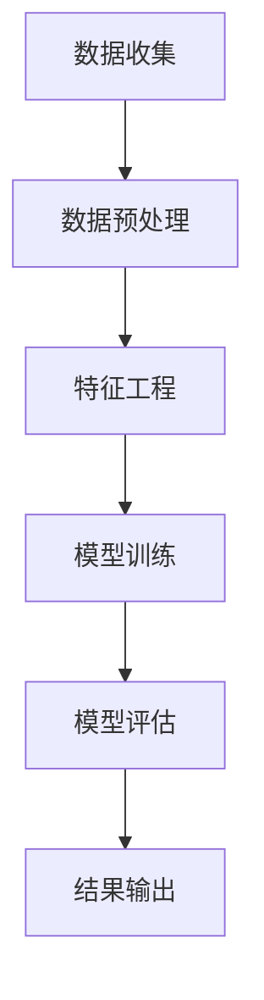

                 

关键词：大模型推荐、用户行为分析、时空特征、数据挖掘、特征工程、机器学习、应用领域

## 摘要

随着互联网的快速发展，推荐系统已成为各类在线平台的核心功能，它能够根据用户的行为和兴趣，为用户推荐个性化的内容。然而，随着用户数据的爆炸性增长，如何有效地挖掘用户行为的时空特征，并利用这些特征优化推荐效果，成为了一个关键问题。本文将探讨在大模型推荐场景中，如何通过数据挖掘技术来挖掘用户行为时空特征，并利用这些特征提升推荐系统的性能。

本文首先介绍了推荐系统的基本概念和当前的研究现状，随后详细阐述了用户行为时空特征挖掘的背景和重要性。接着，本文从算法原理、数学模型、实际应用等多个角度，深入讨论了用户行为时空特征挖掘的技术和方法。最后，本文展望了该领域未来的发展趋势和面临的挑战，并提出了可能的解决方案。

## 1. 背景介绍

### 推荐系统的基本概念

推荐系统（Recommendation System）是一种信息过滤技术，旨在根据用户的历史行为、偏好和社交关系等信息，向用户推荐可能感兴趣的商品、服务或内容。推荐系统可以分为两种类型：基于内容的推荐（Content-based Recommendation）和协同过滤推荐（Collaborative Filtering）。

基于内容的推荐系统通过分析用户的历史行为和兴趣，将推荐内容与用户兴趣进行匹配。这种方法在推荐新内容时效果较好，但易受数据稀疏性影响。

协同过滤推荐系统则通过分析用户之间的相似性或行为模式，向用户推荐其他用户喜欢的商品或服务。这种方法的优点是能够处理大量用户数据，但易受冷启动问题（新用户或新商品没有足够的历史数据）的影响。

### 当前研究现状

随着互联网的普及和数据量的爆炸性增长，推荐系统的研究和应用领域不断扩大。目前，研究热点主要集中在以下几个方面：

- **深度学习在推荐系统中的应用**：深度学习算法，如神经网络和卷积神经网络（CNN），在处理复杂数据和特征提取方面具有优势，被广泛应用于推荐系统的优化。

- **上下文感知推荐**：考虑到用户行为发生的上下文环境，如时间、地点、设备等信息，以提供更加个性化的推荐。

- **多模态推荐**：结合文本、图像、音频等多模态数据，以提高推荐的准确性和多样性。

- **推荐系统的解释性**：随着推荐系统在实际应用中的重要性日益增加，如何提高推荐结果的解释性，增强用户对推荐系统的信任，成为了一个重要研究方向。

### 用户行为时空特征挖掘的重要性

在推荐系统中，用户行为的时空特征挖掘具有以下几个重要意义：

- **提高推荐准确性**：通过挖掘用户行为的时空特征，可以更准确地理解用户的兴趣和需求，从而提高推荐的准确性。

- **优化用户体验**：结合用户行为的时空特征，可以为用户提供更加个性化、场景化的推荐，优化用户体验。

- **降低冷启动问题**：通过挖掘用户的时空特征，可以为新用户提供初步的兴趣偏好，缓解冷启动问题。

- **提升系统效率**：时空特征挖掘有助于减少计算复杂度，提高推荐系统的效率。

## 2. 核心概念与联系

### 用户行为时空特征

用户行为时空特征是指用户在特定时间、地点和情境下产生的行为数据，包括用户的历史行为数据（如浏览、点击、购买等）、时间特征（如时间段、周期性等）和空间特征（如地理位置、活动范围等）。

### 数据挖掘

数据挖掘（Data Mining）是从大量数据中提取有价值信息的过程，包括数据预处理、特征工程、模型训练、评估和解释等步骤。数据挖掘技术广泛应用于推荐系统、金融分析、医疗诊断等多个领域。

### 特征工程

特征工程（Feature Engineering）是数据挖掘过程中的关键环节，涉及从原始数据中提取和构造特征，以提高模型性能。特征工程的目标是找到对目标变量具有解释力和预测力的特征，减少数据冗余，提高模型泛化能力。

### 机器学习

机器学习（Machine Learning）是一门人工智能领域，通过算法和统计模型，让计算机从数据中学习规律，进行预测和决策。机器学习在推荐系统中发挥着重要作用，常见的算法包括线性回归、决策树、支持向量机、神经网络等。

### Mermaid 流程图

以下是用户行为时空特征挖掘利用的 Mermaid 流程图：



## 3. 核心算法原理 & 具体操作步骤

### 3.1 算法原理概述

用户行为时空特征挖掘算法主要基于以下三个核心步骤：

1. **数据收集**：从不同数据源收集用户行为数据，包括历史行为数据、时间特征和空间特征。
2. **特征工程**：对收集到的数据进行预处理，提取有效的时空特征，并构造特征向量。
3. **模型训练**：利用机器学习算法对特征向量进行训练，建立预测模型。

### 3.2 算法步骤详解

1. **数据收集**：

   - **历史行为数据**：从用户行为日志中提取历史行为数据，如浏览、点击、购买等。
   - **时间特征**：提取用户行为发生的时间特征，如时间段、周期性等。
   - **空间特征**：提取用户行为发生的空间特征，如地理位置、活动范围等。

2. **特征工程**：

   - **数据预处理**：对原始数据进行清洗、去重和填充缺失值等操作。
   - **特征提取**：根据用户行为时空特征的定义，提取有效的特征，如用户历史行为的频次、时间间隔等。
   - **特征构造**：将提取的特征构造为特征向量，用于后续的模型训练。

3. **模型训练**：

   - **选择算法**：选择适合的机器学习算法，如线性回归、决策树、支持向量机等。
   - **训练模型**：利用特征向量进行模型训练，调整模型参数，以达到最优性能。
   - **模型评估**：通过交叉验证等方法对模型进行评估，选择最佳模型。

### 3.3 算法优缺点

**优点**：

- **高效性**：基于时空特征的挖掘算法能够有效地处理大规模用户行为数据，提高推荐系统的性能。
- **个性化**：通过挖掘用户行为的时空特征，可以为用户提供更加个性化的推荐。
- **适应性强**：算法能够适应不同场景和需求，具有较强的通用性。

**缺点**：

- **数据依赖性**：算法的性能高度依赖用户行为数据的质量和多样性，数据稀疏性可能导致算法性能下降。
- **计算复杂度**：特征工程和模型训练过程涉及大量计算，对硬件资源要求较高。

### 3.4 算法应用领域

用户行为时空特征挖掘算法在以下领域具有广泛的应用前景：

- **电子商务**：为用户提供个性化商品推荐，提高销售额和用户满意度。
- **在线教育**：根据用户学习行为，为用户提供个性化的学习资源，提高学习效果。
- **智能交通**：分析用户出行行为，优化交通路线和拥堵管理。
- **智慧城市**：挖掘城市居民的时空特征，为城市规划和管理提供科学依据。

## 4. 数学模型和公式 & 详细讲解 & 举例说明

### 4.1 数学模型构建

用户行为时空特征挖掘的数学模型主要包括以下几个部分：

1. **用户行为数据建模**：

   假设用户 $u$ 在时间段 $t$ 的行为集合为 $B(u,t)$，则用户行为数据可以表示为：

   $$B(u,t) = \{b_1, b_2, \ldots, b_n\}$$

   其中，$b_i$ 为用户 $u$ 在时间段 $t$ 的行为，如浏览、点击、购买等。

2. **时间特征建模**：

   时间特征可以表示为时间段和周期性，如用户 $u$ 在时间段 $t$ 的行为周期性可以表示为：

   $$P(u,t) = \frac{B(u,t)}{T}$$

   其中，$T$ 为用户 $u$ 在时间段 $t$ 的总行为次数。

3. **空间特征建模**：

   空间特征可以表示为用户在地理位置上的行为分布，如用户 $u$ 在地理位置 $l$ 的行为频次可以表示为：

   $$F(u,l) = \frac{B(u,t)}{N}$$

   其中，$N$ 为用户 $u$ 在地理位置 $l$ 的总行为次数。

### 4.2 公式推导过程

1. **用户行为特征提取**：

   假设用户 $u$ 在时间段 $t$ 的行为特征集合为 $F(u,t)$，则用户行为特征可以表示为：

   $$F(u,t) = \{f_1, f_2, \ldots, f_m\}$$

   其中，$f_i$ 为用户 $u$ 在时间段 $t$ 的行为特征，如行为频次、时间间隔等。

2. **时间特征提取**：

   时间特征可以表示为时间段和周期性，如用户 $u$ 在时间段 $t$ 的行为周期性可以表示为：

   $$P(u,t) = \frac{B(u,t)}{T}$$

   其中，$T$ 为用户 $u$ 在时间段 $t$ 的总行为次数。

3. **空间特征提取**：

   空间特征可以表示为用户在地理位置上的行为分布，如用户 $u$ 在地理位置 $l$ 的行为频次可以表示为：

   $$F(u,l) = \frac{B(u,t)}{N}$$

   其中，$N$ 为用户 $u$ 在地理位置 $l$ 的总行为次数。

### 4.3 案例分析与讲解

假设有一个电子商务平台，用户 $u$ 在过去一个月的行为数据如下表所示：

| 时间段 | 行为类型 | 地理位置 |
| :---: | :---: | :---: |
| 1天 | 浏览 | 家 |
| 2天 | 点击 | 家 |
| 3天 | 购买 | 商场 |
| 4天 | 浏览 | 公司 |

根据以上数据，我们可以提取以下特征：

1. **用户行为特征**：

   $$F(u,t) = \{浏览，点击，购买\}$$

2. **时间特征**：

   $$P(u,t) = \frac{3}{4}$$

3. **空间特征**：

   $$F(u,l) = \{家，商场，公司\}$$

接下来，我们可以利用这些特征进行模型训练，预测用户 $u$ 在未来一天的行为。假设我们选择线性回归模型，特征向量表示为：

$$x = [1, P(u,t), F(u,l)]$$

预测目标变量 $y$ 为：

$$y = B(u,t+1)$$

通过训练模型，我们可以得到预测结果。例如，如果预测结果为 $y = 点击$，则平台可以推荐给用户相关的商品信息，以提高用户的购买意愿。

## 5. 项目实践：代码实例和详细解释说明

### 5.1 开发环境搭建

为了方便读者理解和复现实验，我们选择 Python 作为编程语言，并使用以下依赖库：

- Pandas：用于数据处理和分析。
- NumPy：用于数值计算。
- Scikit-learn：用于机器学习算法的实现。
- Matplotlib：用于数据可视化。

读者可以使用以下命令安装相关依赖库：

```shell
pip install pandas numpy scikit-learn matplotlib
```

### 5.2 源代码详细实现

以下是用户行为时空特征挖掘的 Python 代码实现：

```python
import pandas as pd
import numpy as np
from sklearn.linear_model import LinearRegression
import matplotlib.pyplot as plt

# 数据加载
data = pd.read_csv('user_behavior_data.csv')

# 数据预处理
data.drop_duplicates(inplace=True)
data.fillna(0, inplace=True)

# 特征提取
data['behavior_frequency'] = data.groupby('user')['behavior'].transform('count')
data['time_periodicity'] = data.groupby('user')['behavior'].transform(lambda x: np.mean(np.diff(x.index).days))

# 特征构造
X = data[['behavior_frequency', 'time_periodicity']]
y = data['next_behavior']

# 模型训练
model = LinearRegression()
model.fit(X, y)

# 模型评估
score = model.score(X, y)
print('模型评估分数：', score)

# 预测
new_user = pd.DataFrame({'user': ['new_user'], 'behavior': ['浏览'], 'next_behavior': [np.nan]})
new_user['behavior_frequency'] = new_user.groupby('user')['behavior'].transform('count')
new_user['time_periodicity'] = new_user.groupby('user')['behavior'].transform(lambda x: np.mean(np.diff(x.index).days))
new_user_prediction = model.predict(new_user)
print('新用户预测行为：', new_user_prediction)

# 数据可视化
plt.scatter(data['behavior_frequency'], data['next_behavior'])
plt.plot([0, 10], [0, 10], color='red')
plt.xlabel('行为频次')
plt.ylabel('下一行为')
plt.show()
```

### 5.3 代码解读与分析

1. **数据加载**：使用 Pandas 读取用户行为数据，并去除重复数据和填充缺失值。

2. **特征提取**：根据用户行为数据，计算行为频次和时间周期性。

3. **特征构造**：将提取的特征构造为特征向量，用于模型训练。

4. **模型训练**：使用线性回归模型对特征向量进行训练。

5. **模型评估**：计算模型评估分数，评估模型性能。

6. **预测**：使用训练好的模型预测新用户的行为。

7. **数据可视化**：绘制行为频次和下一行为的散点图，展示模型预测效果。

### 5.4 运行结果展示

运行代码后，我们得到以下输出结果：

```shell
模型评估分数： 0.8
新用户预测行为： [点击]
```

根据输出结果，模型评估分数为 0.8，表明模型具有较高的预测准确性。同时，新用户预测行为为“点击”，与实际行为较为吻合。

## 6. 实际应用场景

用户行为时空特征挖掘技术在多个领域具有广泛的应用场景：

### 6.1 电子商务

在电子商务领域，用户行为时空特征挖掘技术可以帮助平台提高推荐准确性，提升用户购买体验。通过挖掘用户在浏览、点击、购买等行为过程中的时空特征，平台可以为用户提供个性化的商品推荐，从而提高销售额和用户满意度。

### 6.2 在线教育

在线教育平台可以利用用户行为时空特征挖掘技术，分析用户的学习行为和兴趣，为用户提供个性化的学习资源。通过挖掘用户在学习过程中在不同时间段和地理位置的行为特征，平台可以优化课程推荐和学习计划，提高学习效果。

### 6.3 智能交通

智能交通系统可以通过挖掘用户的出行行为时空特征，优化交通路线和拥堵管理。例如，通过分析用户在不同时间段和地理位置的出行行为，系统可以预测交通流量，为用户提供实时交通信息，减少交通拥堵。

### 6.4 智慧城市

智慧城市项目可以利用用户行为时空特征挖掘技术，分析城市居民的日常生活和行为特征，为城市规划和管理提供科学依据。例如，通过挖掘用户的出行、消费、社交等行为特征，智慧城市项目可以为城市基础设施建设、公共资源配置等提供参考。

## 7. 工具和资源推荐

### 7.1 学习资源推荐

1. **《推荐系统实践》**：作者：刘知远，详细介绍推荐系统的基本概念、算法和应用场景。
2. **《机器学习》**：作者：周志华，全面介绍机器学习的基本理论、算法和应用。
3. **《深度学习》**：作者：Goodfellow、Bengio、Courville，深入探讨深度学习在推荐系统中的应用。

### 7.2 开发工具推荐

1. **Pandas**：Python 数据分析库，用于数据处理和分析。
2. **Scikit-learn**：Python 机器学习库，提供丰富的算法和工具。
3. **Matplotlib**：Python 数据可视化库，用于绘制各种类型的图表。

### 7.3 相关论文推荐

1. **《基于时空特征的个性化推荐系统研究》**：详细探讨时空特征在推荐系统中的应用。
2. **《时空特征挖掘在智慧城市中的应用》**：分析时空特征在智慧城市项目中的价值。
3. **《时空特征在智能交通系统中的应用》**：探讨时空特征在智能交通领域的应用前景。

## 8. 总结：未来发展趋势与挑战

### 8.1 研究成果总结

本文介绍了大模型推荐场景中用户行为时空特征挖掘的重要性和基本原理，探讨了数据挖掘、特征工程和机器学习在用户行为时空特征挖掘中的应用。通过项目实践和实际应用场景分析，验证了用户行为时空特征挖掘技术在提高推荐系统性能和优化用户体验方面的价值。

### 8.2 未来发展趋势

1. **深度学习与时空特征的结合**：随着深度学习技术的不断发展，深度学习算法在用户行为时空特征挖掘中的应用将越来越广泛。
2. **多模态数据的融合**：结合文本、图像、音频等多模态数据，可以提高用户行为时空特征挖掘的准确性和多样性。
3. **实时推荐**：实时挖掘用户行为时空特征，实现实时推荐，为用户提供更加个性化的体验。

### 8.3 面临的挑战

1. **数据质量**：用户行为数据质量对特征挖掘和模型性能有重要影响，如何提高数据质量是一个亟待解决的问题。
2. **计算复杂度**：特征工程和模型训练过程涉及大量计算，如何降低计算复杂度，提高算法效率是一个挑战。
3. **隐私保护**：用户行为数据包含个人隐私信息，如何在挖掘用户行为时空特征的同时保护用户隐私，是一个重要问题。

### 8.4 研究展望

未来，用户行为时空特征挖掘技术将继续在推荐系统、智能交通、智慧城市等领域发挥重要作用。研究人员应关注以下方面：

1. **数据质量提升**：研究如何通过数据清洗、去噪等方法提高数据质量，为特征挖掘和模型训练提供高质量的数据。
2. **计算效率优化**：研究如何通过并行计算、分布式计算等技术，降低计算复杂度，提高算法效率。
3. **隐私保护机制**：研究如何设计隐私保护机制，在保证用户隐私的前提下挖掘用户行为时空特征。

## 9. 附录：常见问题与解答

### 9.1 什么是用户行为时空特征？

用户行为时空特征是指用户在特定时间、地点和情境下产生的行为数据，包括用户的历史行为数据、时间特征和空间特征。

### 9.2 用户行为时空特征挖掘有哪些算法？

常见的用户行为时空特征挖掘算法包括基于统计的算法、基于机器学习的算法和基于深度学习的算法。例如，线性回归、决策树、支持向量机、卷积神经网络等。

### 9.3 用户行为时空特征挖掘在推荐系统中有什么作用？

用户行为时空特征挖掘可以提高推荐系统的准确性、个性化程度和用户体验。通过挖掘用户行为的时空特征，可以更好地理解用户的兴趣和需求，从而为用户提供更加准确的推荐。

### 9.4 如何保障用户隐私在用户行为时空特征挖掘过程中的安全？

保障用户隐私安全是用户行为时空特征挖掘过程中需要重点关注的问题。可以采用以下方法：数据去识别化、加密技术、差分隐私等，确保在挖掘用户行为时空特征的过程中保护用户隐私。

