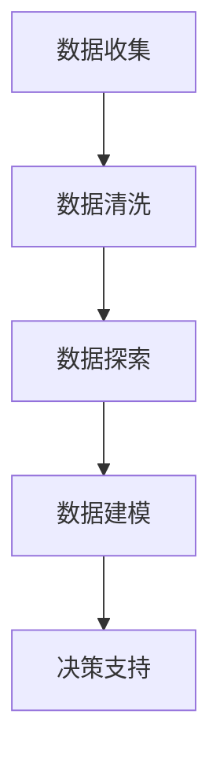

                 

关键词：数据分析、运营决策、业务优化、数据挖掘、预测分析、机器学习、实时监控

> 摘要：在数字化时代，数据分析已成为企业运营决策的重要工具。本文将探讨如何通过数据分析指导运营决策，包括核心概念、算法原理、数学模型以及实际应用案例，旨在帮助企业利用数据实现业务优化和增长。

## 1. 背景介绍

在当今竞争激烈的商业环境中，企业需要不断调整和优化其运营策略，以适应市场变化并保持竞争力。数据分析提供了一种系统的方法，可以帮助企业从大量数据中提取有价值的信息，从而指导运营决策。通过数据分析，企业可以更好地了解市场趋势、客户行为、产品性能以及运营效率，从而实现业务增长和优化。

数据分析在运营决策中的应用广泛，包括但不限于以下几个方面：

- 客户细分与需求分析：通过分析客户数据，企业可以识别出不同类型的客户群体，了解他们的需求和偏好，从而提供更精准的营销策略和产品服务。
- 供应链优化：通过分析供应链数据，企业可以识别瓶颈和优化环节，降低成本，提高供应链的灵活性和响应速度。
- 营销效果评估：通过分析营销活动数据，企业可以评估不同营销渠道的效果，调整营销策略，提高投资回报率（ROI）。
- 员工绩效评估：通过分析员工的工作数据，企业可以评估员工的表现，提供反馈和培训，提高整体工作效率。

本文将围绕上述应用，深入探讨如何利用数据分析指导运营决策，并提供具体的算法原理、数学模型和实际案例。

## 2. 核心概念与联系

### 2.1 数据分析的基本概念

数据分析（Data Analysis）是指使用统计方法和计算机技术，从大量数据中提取有价值的信息，以支持决策制定。数据分析包括以下关键概念：

- 数据挖掘（Data Mining）：从大量数据中自动发现隐含的、未知的、潜在的有用信息的过程。
- 预测分析（Predictive Analytics）：使用历史数据和统计分析方法，预测未来可能发生的事件或趋势。
- 实时监控（Real-time Monitoring）：对实时数据流进行分析，以实时识别异常或趋势。

### 2.2 运营决策的概念

运营决策（Operational Decision Making）是指企业在日常运营中作出的决策，包括但不限于生产调度、库存管理、人力资源配置等。这些决策旨在提高运营效率、降低成本、提高客户满意度等。

### 2.3 数据分析在运营决策中的作用

数据分析在运营决策中起着关键作用，它可以帮助企业：

- 识别问题和机会：通过分析历史数据，企业可以发现运营中的瓶颈和潜在增长点。
- 制定决策策略：基于数据分析的结果，企业可以制定更有效的运营策略。
- 验证决策效果：通过对比分析实际运营结果和预测结果，企业可以验证决策的有效性，并作出相应的调整。

### 2.4 数据分析架构

数据分析通常包括以下几个步骤：

1. 数据收集：从不同的数据源收集数据。
2. 数据清洗：处理缺失值、异常值等，确保数据质量。
3. 数据探索：使用可视化工具和统计方法，发现数据中的规律和趋势。
4. 数据建模：建立数学模型，预测未来可能发生的事件或趋势。
5. 决策支持：将分析结果转化为具体的运营决策。

### 2.5 Mermaid 流程图



## 3. 核心算法原理 & 具体操作步骤

### 3.1 算法原理概述

数据分析中的核心算法包括数据挖掘、预测分析和实时监控。以下是对这些算法原理的概述：

- 数据挖掘算法：如K-Means、Apriori算法等，用于发现数据中的规律和趋势。
- 预测分析算法：如线性回归、决策树等，用于预测未来可能发生的事件或趋势。
- 实时监控算法：如异常检测、时间序列分析等，用于实时分析数据流，识别异常或趋势。

### 3.2 算法步骤详解

1. 数据收集：从内部系统、第三方数据源等收集数据。
2. 数据清洗：处理缺失值、异常值等，确保数据质量。
3. 数据探索：使用可视化工具和统计方法，发现数据中的规律和趋势。
4. 数据建模：选择合适的算法，建立预测模型。
5. 模型验证：使用验证集，评估模型的预测能力。
6. 决策支持：将模型应用于实时数据，生成运营决策。

### 3.3 算法优缺点

- 数据挖掘算法：
  - 优点：可以发现数据中的隐藏规律，提供决策支持。
  - 缺点：对大规模数据计算量大，算法复杂度高。

- 预测分析算法：
  - 优点：可以预测未来可能发生的事件或趋势，提前做好准备。
  - 缺点：预测结果的准确性受到数据质量和模型选择的影响。

- 实时监控算法：
  - 优点：可以实时识别异常或趋势，及时采取措施。
  - 缺点：对实时数据处理能力要求高，算法复杂度较高。

### 3.4 算法应用领域

- 数据挖掘算法：应用于市场分析、客户细分、推荐系统等领域。
- 预测分析算法：应用于销售预测、库存管理、资源规划等领域。
- 实时监控算法：应用于异常检测、风险评估、实时监控等领域。

## 4. 数学模型和公式 & 详细讲解 & 举例说明

### 4.1 数学模型构建

数据分析中的数学模型主要包括以下几种：

- 线性回归模型：
  - 公式：\(y = \beta_0 + \beta_1x_1 + \beta_2x_2 + ... + \beta_nx_n\)
  - 参数：\(\beta_0, \beta_1, \beta_2, ..., \beta_n\)

- 决策树模型：
  - 公式：\(f(x) = g(x_1, x_2, ..., x_n)\)
  - 参数：\(g(x_1, x_2, ..., x_n)\)

- K-Means聚类算法：
  - 公式：\(c_i = \frac{1}{k}\sum_{j=1}^{k} \frac{1}{||x_j - \mu_i||^2}\)
  - 参数：\(c_i, \mu_i\)

### 4.2 公式推导过程

以线性回归模型为例，其推导过程如下：

- 假设数据集 \(D = \{(x_1, y_1), (x_2, y_2), ..., (x_n, y_n)\}\)
- 目标是最小化误差平方和：\(SSQ = \sum_{i=1}^{n} (y_i - \hat{y}_i)^2\)
- 使用最小二乘法求解参数：\(\beta_0, \beta_1, \beta_2, ..., \beta_n\)
- 导出公式：\(y = \beta_0 + \beta_1x_1 + \beta_2x_2 + ... + \beta_nx_n\)

### 4.3 案例分析与讲解

以销售预测为例，使用线性回归模型进行预测。

1. 数据收集：收集过去一年的月销售额数据。
2. 数据清洗：处理缺失值和异常值。
3. 数据探索：分析销售额与季节性、促销活动等因素的关系。
4. 数据建模：建立线性回归模型。
5. 模型验证：使用验证集评估模型预测能力。
6. 决策支持：基于模型预测，调整库存和促销策略。

## 5. 项目实践：代码实例和详细解释说明

### 5.1 开发环境搭建

- Python环境：安装Python 3.8及以上版本。
- 数据库环境：安装MySQL或MongoDB。
- 数据分析库：安装Pandas、NumPy、Scikit-learn等。

### 5.2 源代码详细实现

```python
import pandas as pd
from sklearn.linear_model import LinearRegression
from sklearn.model_selection import train_test_split

# 数据收集
data = pd.read_csv('sales_data.csv')

# 数据清洗
data = data.dropna()

# 数据探索
data.plot()

# 数据建模
X = data[['month', 'season', 'promotion']]
y = data['sales']
X_train, X_test, y_train, y_test = train_test_split(X, y, test_size=0.2, random_state=42)

model = LinearRegression()
model.fit(X_train, y_train)

# 模型验证
predictions = model.predict(X_test)
print('RMSE:', np.sqrt(np.mean((y_test - predictions)**2)))

# 决策支持
next_month_data = pd.DataFrame({'month': [13], 'season': [2], 'promotion': [0]})
next_month_sales = model.predict(next_month_data)
print('Next month sales prediction:', next_month_sales)
```

### 5.3 代码解读与分析

- 数据收集：从CSV文件中读取数据。
- 数据清洗：丢弃缺失值。
- 数据探索：绘制销售额与月份、季节性、促销活动的关系图。
- 数据建模：将月份、季节性和促销活动作为特征，使用线性回归模型进行预测。
- 模型验证：计算均方根误差（RMSE），评估模型预测能力。
- 决策支持：根据模型预测，给出下个月的销售额预测。

## 6. 实际应用场景

数据分析在运营决策中有着广泛的应用场景，以下是一些具体的实际应用案例：

- 客户细分：通过分析客户数据，企业可以将客户分为高价值客户、普通客户等，制定差异化的营销策略。
- 销售预测：基于历史销售数据，预测未来的销售趋势，帮助企业制定库存和促销策略。
- 供应链优化：通过分析供应链数据，优化库存管理、物流配送等，降低成本、提高效率。
- 营销效果评估：通过分析营销数据，评估不同营销渠道的效果，调整营销策略，提高投资回报率。

## 7. 未来应用展望

随着数据量的不断增加和计算能力的提升，数据分析在运营决策中的应用前景将更加广阔。未来，以下趋势值得关注：

- 智能化：利用机器学习和深度学习等技术，实现更精确的数据分析和预测。
- 实时性：实时分析海量数据流，实现运营决策的实时调整。
- 可视化：通过可视化技术，使数据分析结果更加直观易懂，提高决策效率。
- 自动化：自动化数据分析流程，减少人工干预，提高决策的准确性和效率。

## 8. 工具和资源推荐

### 8.1 学习资源推荐

- 《数据科学入门》
- 《Python数据分析》
- 《机器学习实战》

### 8.2 开发工具推荐

- Jupyter Notebook
- Tableau
- Power BI

### 8.3 相关论文推荐

- "Data-Driven Business: Insights for Executives"
- "Predictive Analytics: The Power to Predict Who Will Click, Buy, Lie, or Die"
- "Real-Time Business Intelligence: Actionable Insights from Your Biggest Data Asset"

## 9. 总结：未来发展趋势与挑战

随着数据技术的不断进步，数据分析在运营决策中的应用将越来越广泛。然而，也面临着数据质量、隐私保护、算法解释性等挑战。未来，企业需要不断创新和改进数据分析方法，以应对这些挑战，实现更高效的运营决策。

## 10. 附录：常见问题与解答

### 10.1 数据分析的作用是什么？

数据分析可以帮助企业从大量数据中提取有价值的信息，指导运营决策，提高业务效率和竞争力。

### 10.2 数据分析需要哪些技能？

数据分析需要掌握统计学、计算机编程（如Python、R等）、数据库管理、数据可视化等相关技能。

### 10.3 如何确保数据分析的准确性？

确保数据质量、选择合适的分析方法和模型、进行充分的模型验证是确保数据分析准确性的关键。

### 10.4 数据分析在运营决策中的应用有哪些？

数据分析在运营决策中的应用包括客户细分、销售预测、供应链优化、营销效果评估等。

## 作者署名

作者：禅与计算机程序设计艺术 / Zen and the Art of Computer Programming
----------------------------------------------------------------

请注意，以上内容是一个示例性的文章框架和部分内容，实际撰写时需要根据具体要求和内容进一步展开。文章的完整性和深度需要达到8000字以上的要求，并且在撰写时需要严格遵守文章结构模板和格式要求。如果您需要更详细的内容或进一步的帮助，请告知。

