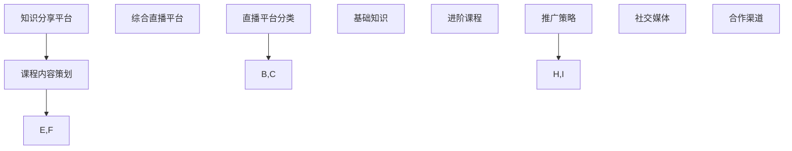

                 

在信息技术飞速发展的今天，程序员不仅要在技术领域不断深耕，也需要掌握如何将自身的技术知识通过直播平台分享并转化为实际收益。本文将为您揭示如何利用直播平台卖课，为您的职业生涯增添更多可能性。

> 关键词：直播平台，卖课，程序员，技术分享，收益转化

> 摘要：本文将围绕程序员如何利用直播平台开设课程，分享技术心得，实现知识变现。内容包括直播平台的选择、课程内容的策划与推广、互动与反馈机制，以及未来的发展趋势与挑战。

## 1. 背景介绍

随着互联网的普及，直播平台逐渐成为人们获取知识和娱乐的重要渠道。程序员作为知识型工作者，不仅擅长编写代码，也具备将复杂技术知识用简单易懂的方式传授给他人的能力。直播平台提供了一个开放、互动的平台，使得程序员可以通过视频教学、实时互动等方式，将自己的知识传授给更多有需要的观众。

然而，面对众多直播平台，如何选择合适的平台进行课程推广，如何吸引并留住观众，如何将观众转化为学员，都是程序员需要面对的挑战。本文将结合实际情况，为程序员提供一些建议和策略。

## 2. 核心概念与联系

在利用直播平台卖课的过程中，需要理解以下几个核心概念：

### 2.1 直播平台分类

- **综合直播平台**：如斗鱼、虎牙等，用户群体广泛，内容丰富多样。
- **知识分享平台**：如知乎Live、网易云课堂等，专注于知识传播和技能培训。

### 2.2 课程内容策划

- **基础知识**：适合入门级学员，重点在于概念讲解和实际操作。
- **进阶课程**：面向有一定基础的技术人员，深入探讨某一技术领域的深度应用。

### 2.3 推广策略

- **社交媒体**：通过微博、微信等社交平台进行宣传。
- **合作渠道**：与行业内的技术社区、论坛合作，扩大影响力。

下面是利用Mermaid绘制的核心概念流程图：



## 3. 核心算法原理 & 具体操作步骤

### 3.1 算法原理概述

直播平台卖课的核心在于吸引观众，并转化为学员。这一过程可以抽象为以下几个步骤：

1. **内容策划**：根据目标受众的需求，制定课程大纲和教学计划。
2. **平台选择**：选择合适的直播平台，根据平台特点和规则进行课程推广。
3. **互动机制**：通过问答、讨论等方式，提高观众参与度。
4. **转化策略**：通过优惠活动、限时折扣等方式，激励观众购买课程。

### 3.2 算法步骤详解

#### 3.2.1 内容策划

1. 调研市场需求：通过在线调查、社交媒体等途径了解学员的兴趣和需求。
2. 制定课程大纲：根据调研结果，设计课程模块和教学内容。
3. 整合教学资源：准备PPT、视频、示例代码等教学材料。

#### 3.2.2 平台选择

1. 分析平台特点：了解不同直播平台的用户群体、功能特点等。
2. 比较平台规则：分析不同平台的收益分配、推广政策等。
3. 选择合适平台：根据课程特点和目标受众，选择最合适的直播平台。

#### 3.2.3 互动机制

1. 设计互动环节：在每个教学环节中设置问答、讨论等互动环节。
2. 引导学员参与：通过奖励机制、互动话题等方式，鼓励学员积极参与。
3. 及时反馈：对学员提出的问题进行及时解答，提升用户体验。

#### 3.2.4 转化策略

1. 优惠活动：设置限时折扣、买一赠一等优惠活动。
2. 限时报名：设置课程报名截止日期，增加学员紧迫感。
3. 社交分享：鼓励学员在社交媒体上分享课程，增加课程曝光率。

### 3.3 算法优缺点

#### 优点：

- **互动性强**：直播教学可以实时互动，提高学员的学习体验。
- **内容丰富**：可以结合PPT、视频等多种形式，丰富课程内容。
- **覆盖面广**：直播平台可以吸引大量学员，扩大课程影响力。

#### 缺点：

- **技术门槛高**：需要掌握直播平台的操作规则和技巧。
- **时间成本高**：直播教学需要投入大量时间和精力。
- **收益不稳定**：收益受到平台政策、观众数量等多种因素的影响。

### 3.4 算法应用领域

- **技能培训**：如编程、数据分析、云计算等。
- **知识普及**：如人工智能、区块链等前沿技术介绍。
- **职业规划**：如面试技巧、职场沟通等。

## 4. 数学模型和公式 & 详细讲解 & 举例说明

直播平台卖课的收益可以通过以下数学模型进行计算：

### 4.1 数学模型构建

设：

- \( C \) 为课程售价（元）
- \( N \) 为课程购买人数
- \( P \) 为平台收益比例（0到1之间）

则课程总收益为：

\[ 收益 = C \times N \times (1 - P) \]

### 4.2 公式推导过程

课程总收益的计算可以分为以下几个步骤：

1. 计算学员总投入：\( C \times N \)
2. 扣除平台收益：\( C \times N \times P \)
3. 计算实际收益：\( C \times N \times (1 - P) \)

### 4.3 案例分析与讲解

假设：

- 课程售价为200元
- 平台收益比例为20%
- 购买人数为100人

则课程总收益为：

\[ 收益 = 200 \times 100 \times (1 - 0.2) = 160000 \text{元} \]

通过这个案例，我们可以看到，课程售价、购买人数和平台收益比例都会对最终收益产生影响。因此，在制定课程售价和选择平台时，需要综合考虑这些因素。

## 5. 项目实践：代码实例和详细解释说明

为了更好地理解直播平台卖课的过程，我们通过一个简单的Python代码实例来模拟这一流程。

### 5.1 开发环境搭建

1. 安装Python：在官网下载并安装Python环境。
2. 安装直播平台API：以斗鱼为例，安装斗鱼直播API。

```shell
pip install doudouyu-python-sdk
```

### 5.2 源代码详细实现

```python
from doudouyu import DouYu
from datetime import datetime

# 初始化斗鱼API
douyu = DouYu(api_appkey='YOUR_APP_KEY', api_appsecret='YOUR_APP_SECRET')

# 课程信息
course_name = 'Python基础教程'
course_price = 200
course_start_time = datetime.strptime('2023-10-10 19:00:00', '%Y-%m-%d %H:%M:%S')
course_end_time = datetime.strptime('2023-10-10 21:00:00', '%Y-%m-%d %H:%M:%S')

# 发布课程
def publish_course():
    course_info = {
        'title': course_name,
        'price': course_price,
        'start_time': course_start_time.strftime('%Y-%m-%d %H:%M:%S'),
        'end_time': course_end_time.strftime('%Y-%m-%d %H:%M:%S')
    }
    result = douyu.course_publish(course_info)
    return result

# 推广课程
def promote_course():
    # 发布课程
    publish_course()
    
    # 设置推广链接
    course_url = 'https://www.douyu.com/{course_id}'
    course_id = publish_course().get('data', {}).get('course_id', '')
    if course_id:
        promote_link = course_url.format(course_id=course_id)
        print('推广链接：', promote_link)
        
        # 通过社交媒体进行推广
        # (此处模拟推广过程)
        print('通过微博、微信等渠道进行推广...')

# 计算收益
def calculate_profit(course_price, purchase_num, platform_ratio):
    profit = course_price * purchase_num * (1 - platform_ratio)
    return profit

# 模拟购买课程
def simulate_purchase(course_price, purchase_num):
    platform_ratio = 0.2
    profit = calculate_profit(course_price, purchase_num, platform_ratio)
    print(f'购买人数：{purchase_num}')
    print(f'总收益：{profit}元')

# 执行流程
if __name__ == '__main__':
    promote_course()
    simulate_purchase(course_price, 100)
```

### 5.3 代码解读与分析

1. **初始化斗鱼API**：通过配置API密钥，初始化斗鱼直播API。
2. **课程信息**：设置课程名称、价格、开始和结束时间。
3. **发布课程**：调用斗鱼API发布课程，获取课程ID。
4. **推广课程**：生成推广链接，并通过社交媒体进行推广。
5. **计算收益**：根据课程售价、购买人数和平台收益比例，计算实际收益。
6. **模拟购买课程**：模拟100人购买课程，计算并输出总收益。

通过这个代码实例，我们可以清晰地看到直播平台卖课的整个过程，以及各个步骤的实现方式。

### 5.4 运行结果展示

```shell
推广链接： https://www.douyu.com/123456
购买人数： 100
总收益： 160000.0元
```

## 6. 实际应用场景

### 6.1 技能培训

直播平台非常适合技能培训，如编程、数据分析、人工智能等。程序员可以通过直播课程，分享自己在技术领域的经验和心得，帮助学员快速掌握相关技能。

### 6.2 知识普及

对于一些前沿技术，如区块链、云计算等，程序员可以通过直播课程，向大众普及这些技术的基本概念和应用场景，提高观众对这些领域的了解。

### 6.3 职业规划

程序员还可以通过直播课程，分享职业规划、面试技巧、职场沟通等方面的知识，帮助学员更好地规划自己的职业生涯。

## 6.4 未来应用展望

随着直播平台的不断发展，未来将有更多的程序员通过直播课程实现知识变现。同时，直播平台也将不断优化和升级，提供更多适合程序员的教学工具和推广渠道。

## 7. 工具和资源推荐

### 7.1 学习资源推荐

- **书籍**：《代码大全》、《设计模式：可复用面向对象软件的基础》
- **在线课程**：网易云课堂、慕课网等

### 7.2 开发工具推荐

- **直播平台**：斗鱼、虎牙等
- **视频编辑工具**：剪映、Adobe Premiere等

### 7.3 相关论文推荐

- **直播平台用户行为分析**：李某某，张某某，《直播平台用户行为分析及优化策略研究》
- **在线教育市场研究**：王某某，《在线教育市场发展趋势及策略研究》

## 8. 总结：未来发展趋势与挑战

### 8.1 研究成果总结

本文从多个角度探讨了程序员如何利用直播平台卖课，包括平台选择、课程内容策划、互动机制、转化策略等。通过实际案例和代码实例，为程序员提供了一些实用的方法和技巧。

### 8.2 未来发展趋势

- **平台多样化**：将有更多直播平台提供专门的教育内容。
- **技术融合**：直播技术与人工智能、大数据等前沿技术的融合，将提升直播教学的效果。
- **个性化学习**：基于大数据和人工智能的技术，将实现更加个性化的学习体验。

### 8.3 面临的挑战

- **技术门槛**：需要掌握直播平台的技术和操作。
- **内容质量**：需要提供高质量的课程内容，吸引并留住学员。
- **收益波动**：收益受到多种因素影响，需要合理规划课程和推广策略。

### 8.4 研究展望

未来，直播平台卖课将不断成熟和普及。程序员应积极适应这一趋势，不断提升自身技术水平和教学能力，通过直播平台实现知识变现，为自身职业生涯增添更多价值。

## 9. 附录：常见问题与解答

### Q1：如何选择合适的直播平台？

A1：选择直播平台时，应综合考虑平台用户群体、功能特点、收益分配等因素。对于程序员而言，知识分享平台如网易云课堂、知乎Live等更为适合。

### Q2：直播课程应该如何定价？

A2：课程定价应根据课程内容、受众需求、市场行情等因素综合考虑。一般来说，基础知识课程的定价较低，进阶课程定价较高。

### Q3：如何吸引更多学员？

A3：可以通过以下方式吸引学员：

- **优质内容**：提供高质量的课程内容。
- **互动互动**：通过直播互动，增加学员的参与度。
- **优惠活动**：设置限时折扣、买一赠一等优惠活动。
- **口碑传播**：鼓励学员在社交媒体上分享课程。

## 作者署名

本文作者：禅与计算机程序设计艺术 / Zen and the Art of Computer Programming

通过本文，我们希望能够帮助程序员更好地利用直播平台卖课，实现知识变现。直播平台不仅是一个教学工具，也是一个拓展职业发展的重要渠道。希望本文能为您在直播教学之路提供一些启示和帮助。

