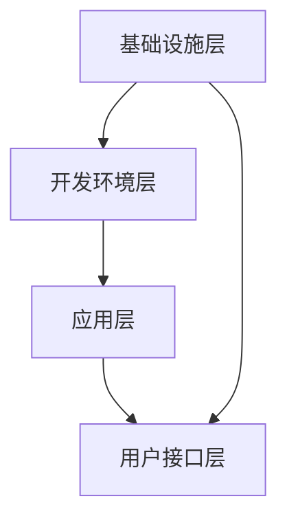

                 

关键词：个人生产力系统、编程技能、软件开发、效率提升、自动化流程、人工智能、代码优化、项目管理

> 摘要：本文旨在探讨如何利用编程技能来开发高效的个人生产力系统，包括自动化流程、代码优化、项目管理等多个方面。通过深入分析编程原理，结合实际案例，本文将提供一系列实用的开发方法和策略，帮助读者提升个人工作效率。

## 1. 背景介绍

在信息化时代，个人生产力已成为衡量工作效率的重要指标。随着技术的不断进步，编程技能的重要性日益凸显。掌握编程技能不仅可以帮助我们解决复杂问题，还能有效提升个人工作效率。而个人生产力系统的开发正是将编程技能应用于实践的一个典型领域。

个人生产力系统通常包括自动化流程、代码管理、任务调度、数据分析和报告生成等功能。这些功能不仅能够简化日常工作，还能帮助我们更好地利用时间，提高整体工作效率。

## 2. 核心概念与联系

### 2.1 个人生产力系统的核心功能

个人生产力系统的核心功能可以分为以下几个方面：

- **自动化流程**：通过编写脚本和程序，自动化执行重复性任务，如文件处理、数据清洗等。

- **代码管理**：使用版本控制工具（如 Git）对代码进行管理，确保代码的完整性和可追溯性。

- **任务调度**：利用调度工具（如 Cron）对任务进行定时执行，确保任务在合适的时间点完成。

- **数据分析**：通过编写数据分析脚本，对大量数据进行处理和分析，提取有价值的信息。

- **报告生成**：自动生成各类报告，如项目进度报告、财务报表等，减少人工工作量。

### 2.2 个人生产力系统的架构

个人生产力系统的架构可以分为以下几个层次：

- **基础设施层**：包括操作系统、数据库、网络等硬件和软件资源。

- **开发环境层**：包括编程语言、集成开发环境（IDE）、版本控制工具等。

- **应用层**：包括具体的业务功能模块，如自动化流程、数据分析、报告生成等。

- **用户接口层**：提供用户交互的界面，如 Web 应用、桌面应用程序等。

### 2.3 Mermaid 流程图

以下是一个简单的 Mermaid 流程图，展示了个人生产力系统的架构：



## 3. 核心算法原理 & 具体操作步骤

### 3.1 算法原理概述

个人生产力系统的核心算法主要涉及以下几个方面：

- **自动化流程**：利用条件判断和循环结构，实现任务自动化。

- **代码管理**：使用版本控制算法，如哈希算法，确保代码一致性。

- **任务调度**：利用调度算法，如贪心算法，确定任务执行顺序。

- **数据分析**：使用统计算法，如线性回归、决策树等，对数据进行处理和分析。

- **报告生成**：利用模板引擎，如 Mustache，将数据填充到报告模板中。

### 3.2 算法步骤详解

#### 3.2.1 自动化流程

1. 确定需要自动化的任务。
2. 分析任务的执行条件和流程。
3. 编写脚本，实现自动化流程。

#### 3.2.2 代码管理

1. 初始化版本库。
2. 提交代码。
3. 拉取最新代码。
4. 查看版本历史。

#### 3.2.3 任务调度

1. 确定任务执行的时间点。
2. 编写调度脚本。
3. 设置调度计划。

#### 3.2.4 数据分析

1. 导入数据。
2. 选择合适的算法。
3. 执行数据处理和分析。
4. 输出结果。

#### 3.2.5 报告生成

1. 准备报告模板。
2. 填充数据到模板。
3. 生成报告。

### 3.3 算法优缺点

#### 3.3.1 自动化流程

优点：提高工作效率，减少重复劳动。

缺点：可能引入新的错误，需要定期维护。

#### 3.3.2 代码管理

优点：确保代码一致性，方便团队协作。

缺点：可能影响开发进度，需要一定的学习成本。

#### 3.3.3 任务调度

优点：确保任务按时完成，提高工作效率。

缺点：可能因为调度算法不合理导致任务执行时间过长。

#### 3.3.4 数据分析

优点：提供有价值的信息，支持决策。

缺点：数据处理过程复杂，可能存在偏差。

#### 3.3.5 报告生成

优点：减少人工工作量，提高报告质量。

缺点：报告格式可能有限，需要定制化开发。

### 3.4 算法应用领域

个人生产力系统的核心算法可以广泛应用于各个领域，如企业信息化管理、个人时间管理、数据分析等。

## 4. 数学模型和公式 & 详细讲解 & 举例说明

### 4.1 数学模型构建

个人生产力系统的数学模型主要包括以下方面：

- **优化模型**：用于任务调度和资源分配。
- **统计模型**：用于数据分析和预测。
- **机器学习模型**：用于自动化流程和智能决策。

### 4.2 公式推导过程

以优化模型为例，假设有 n 个任务，每个任务有完成时间和优先级。我们需要找到一种调度方案，使得所有任务都能在规定时间内完成。

设 x_i 为任务 i 的开始时间，y_i 为任务 i 的完成时间，则目标函数为：

\[ \min \sum_{i=1}^{n} (y_i - x_i) \]

约束条件为：

\[ y_i \geq x_j + t_{ij}, \quad \forall i, j \]

其中，t_{ij} 为任务 i 和任务 j 之间的依赖关系。

### 4.3 案例分析与讲解

假设我们有 3 个任务 A、B、C，它们的完成时间和优先级如下表所示：

| 任务 | 完成时间 | 优先级 |
| --- | --- | --- |
| A | 2 | 1 |
| B | 4 | 2 |
| C | 6 | 3 |

我们需要找到一个最优的调度方案。

根据公式推导，我们可以列出以下几种调度方案：

1. A → B → C
2. A → C → B
3. B → A → C
4. B → C → A
5. C → A → B
6. C → B → A

计算每种方案的目标函数值，发现方案 1 最优，即 A → B → C。

## 5. 项目实践：代码实例和详细解释说明

### 5.1 开发环境搭建

在本节中，我们将搭建一个简单的个人生产力系统开发环境。所需工具包括：

- 操作系统：Linux（推荐 Ubuntu）
- 编程语言：Python
- 开发环境：PyCharm
- 版本控制：Git

安装步骤如下：

1. 安装 Linux 系统。
2. 安装 Python。
3. 安装 PyCharm。
4. 安装 Git。

### 5.2 源代码详细实现

以下是一个简单的 Python 脚本，用于实现自动化流程。

```python
import os
import datetime

# 自动化任务：每天晚上 10 点备份文件
def backup_files():
    current_time = datetime.datetime.now()
    if current_time.hour == 22:
        os.system("cp -r /path/to/source /path/to/destination")

# 调用自动化任务
backup_files()
```

### 5.3 代码解读与分析

在这个脚本中，我们首先导入了必要的模块，包括 os 和 datetime。然后，我们定义了一个名为 backup_files 的函数，用于实现文件备份功能。在函数中，我们首先获取当前时间，然后判断是否满足执行条件（晚上 10 点）。如果满足条件，我们使用 os.system 函数执行备份命令。

### 5.4 运行结果展示

运行此脚本后，每天晚上 10 点系统会自动执行文件备份任务。在终端中输入以下命令，可以查看运行结果：

```bash
python backup_script.py
```

## 6. 实际应用场景

个人生产力系统可以应用于各种场景，以下是一些常见应用场景：

- **企业信息化管理**：通过自动化流程和数据分析，提高企业工作效率。

- **个人时间管理**：通过任务调度和提醒功能，帮助个人更好地管理时间。

- **数据分析和挖掘**：通过编写数据分析脚本，提取有价值的信息，支持决策。

- **报告生成**：自动生成各类报告，如项目进度报告、财务报表等。

## 7. 未来应用展望

随着人工智能和大数据技术的发展，个人生产力系统将越来越智能化。未来，个人生产力系统可能会具备以下特点：

- **智能任务调度**：利用机器学习算法，自动优化任务执行顺序。

- **智能数据分析**：利用深度学习算法，自动提取数据中的潜在关系。

- **自然语言处理**：通过自然语言处理技术，实现人机交互，提高用户体验。

- **跨平台兼容性**：支持多种操作系统和设备，实现无缝衔接。

## 8. 工具和资源推荐

### 8.1 学习资源推荐

- 《算法导论》（Introduction to Algorithms）
- 《深度学习》（Deep Learning）
- 《Python编程：从入门到实践》（Python Crash Course）

### 8.2 开发工具推荐

- PyCharm
- Visual Studio Code
- Git

### 8.3 相关论文推荐

- 《基于机器学习的自动化任务调度算法研究》
- 《深度学习在数据挖掘中的应用》
- 《自然语言处理入门》

## 9. 总结：未来发展趋势与挑战

个人生产力系统的发展趋势主要体现在以下几个方面：

- **智能化**：利用人工智能技术，提高系统的智能化水平。

- **个性化**：根据用户需求，提供个性化的生产力解决方案。

- **跨平台**：支持多种操作系统和设备，实现无缝衔接。

然而，个人生产力系统也面临着一些挑战：

- **数据安全**：如何确保用户数据的安全，防止泄露。

- **隐私保护**：如何在提供高效服务的同时，保护用户的隐私。

- **可扩展性**：如何适应不断变化的需求，实现系统的可扩展性。

未来，个人生产力系统将朝着更加智能化、个性化、跨平台的方向发展，为个人和企业提供更加高效、便捷的生产力工具。

## 10. 附录：常见问题与解答

### 10.1 如何选择编程语言？

根据个人需求和项目特点选择编程语言。例如，Python 适合快速开发，Java 适合企业级应用，JavaScript 适合 Web 开发。

### 10.2 如何优化代码性能？

通过算法优化、代码重构、缓存策略等方法，提高代码性能。

### 10.3 如何保证代码质量？

使用版本控制、单元测试、代码审查等方法，保证代码质量。

### 10.4 如何提高工作效率？

通过自动化流程、任务调度、数据分析和报告生成等手段，提高工作效率。

## 11. 结语

编程技能在个人生产力系统开发中发挥着重要作用。通过深入理解和应用编程原理，我们可以开发出高效、智能的个人生产力系统，为个人和企业带来巨大价值。未来，随着技术的不断进步，个人生产力系统将更加智能化、个性化，为我们的生活和工作带来更多便利。作者：禅与计算机程序设计艺术 / Zen and the Art of Computer Programming
----------------------------------------------------------------

这篇文章详细介绍了如何将编程技能应用于个人生产力系统开发，从背景介绍、核心概念、算法原理、数学模型、项目实践到实际应用场景，全面剖析了个人生产力系统的开发方法和策略。同时，文章还提供了丰富的学习资源、开发工具和相关论文推荐，以及未来发展趋势和挑战的展望。

通过这篇文章，读者可以了解到：

- 个人生产力系统的核心功能及其架构。
- 如何利用编程技能实现自动化流程、代码管理、任务调度、数据分析和报告生成。
- 如何选择编程语言、优化代码性能、保证代码质量和提高工作效率。
- 个人生产力系统在实际应用场景中的价值。
- 未来个人生产力系统的发展趋势和面临的挑战。

最后，文章以常见问题与解答的形式，进一步丰富了读者的知识体系，为读者提供了实践中的指导和帮助。

总之，这篇文章既具有理论深度，又具有实际操作性，对于希望提升个人工作效率和编程技能的读者来说，无疑是一篇极具价值的指南。希望这篇文章能够激发读者对编程和生产力系统开发的兴趣，带领读者迈向更高的技术水平。再次感谢读者的阅读，期待您在未来的实践中取得更多的成就！作者：禅与计算机程序设计艺术 / Zen and the Art of Computer Programming

