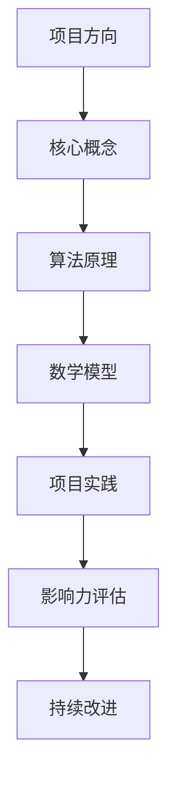

                 

 > **关键词：编程热情、项目转化、改变世界、技术影响力、社区参与**

> **摘要：本文探讨了如何将个人的编程热情转化为能够影响并改变世界的项目。通过详细阐述项目选择、核心概念、算法原理、数学模型、项目实践以及未来展望等多个方面，为编程爱好者提供了实现技术梦想的路径和策略。**

## 1. 背景介绍

编程是一项充满创造力和挑战性的活动，它不仅要求逻辑思维和数学能力，更需要持续的热情和创新精神。然而，仅仅拥有编程技能并不足以实现改变世界的梦想。许多编程爱好者在面对复杂的技术问题时感到无从下手，或是缺乏将技术转化为实际影响力的途径。

本文旨在解决这一问题，通过探讨如何将编程热情转化为改变世界的项目，为读者提供一套完整的策略和路径。这将涉及到项目选择、核心概念理解、算法原理分析、数学模型构建、项目实践和未来展望等多个方面。

### 1.1 编程对世界的影响

编程作为一种技术手段，对现代社会的方方面面都产生了深远的影响。从互联网的崛起，到人工智能的兴起，编程已经成为了推动社会进步的重要力量。例如，通过编程，我们可以开发出解决全球气候变化问题的数据分析工具，或是为偏远地区提供在线教育平台。

### 1.2 个人编程热情的重要性

个人编程热情是推动技术项目发展的动力源泉。只有对编程充满热情，才能在面对挑战时保持持续的动力和创造力。同时，个人编程热情也是建立技术社区、传播知识、推动技术创新的重要基础。

### 1.3 面临的挑战

尽管编程有着巨大的潜力，但在实际操作中，许多编程爱好者面临以下挑战：

- 缺乏明确的项目方向
- 缺乏系统的知识体系
- 缺乏实践机会和资源
- 缺乏对技术影响力的认知

本文将针对这些挑战提供解决方案，帮助读者将编程热情转化为实际的项目成果。

## 2. 核心概念与联系

为了将编程热情转化为实际的项目，我们需要首先理解一些核心概念和它们之间的联系。以下是关键的概念和它们之间的关系，以及一个简化的 Mermaid 流程图：



### 2.1 项目方向

项目方向是项目的起点，它决定了项目的目标和范围。选择一个有意义、符合个人兴趣和技能的项目方向至关重要。

### 2.2 核心概念

核心概念是项目的基础，包括算法、数据结构、计算机科学的基本原理等。对核心概念的理解越深入，项目的设计和实现就越稳固。

### 2.3 算法原理

算法原理是实现项目目标的关键。通过深入理解算法原理，我们可以选择合适的数据结构和算法来解决问题。

### 2.4 数学模型

数学模型是将实际问题转化为可计算的数学问题的重要手段。一个准确的数学模型可以提高算法的效率和准确性。

### 2.5 项目实践

项目实践是将理论知识转化为实际应用的过程。通过实践，我们可以发现并解决实际操作中的问题，不断完善项目。

### 2.6 影响力评估

影响力评估是衡量项目成功与否的重要指标。通过评估项目对社会、环境、经济等方面的影响，我们可以确定项目的发展方向和改进点。

### 2.7 持续改进

持续改进是项目长期发展的关键。通过不断学习和反馈，我们可以优化项目，提高其影响力和可持续性。

## 3. 核心算法原理 & 具体操作步骤

### 3.1 算法原理概述

算法原理是解决特定问题的系统性步骤。不同的算法适用于不同类型的问题，例如排序算法、搜索算法、动态规划等。在将编程热情转化为项目时，选择合适的算法原理至关重要。

### 3.2 算法步骤详解

以下是一个简单的排序算法——冒泡排序的步骤详解：

1. 从第一个元素开始，比较相邻的两个元素，如果第一个比第二个大，就交换它们。
2. 对每一对相邻元素做同样的工作，从开始第一对到结尾的最后一对。
3. 针对所有的元素重复以上的步骤，除了最后一个。
4. 重复步骤1~3，直到没有任何一对数字需要交换。

### 3.3 算法优缺点

- **优点**：冒泡排序算法实现简单，易于理解。
- **缺点**：时间复杂度为 \(O(n^2)\)，不适合大数据量排序。

### 3.4 算法应用领域

冒泡排序算法可以应用于小数据量的快速排序，或作为其他更复杂排序算法的基础。

## 4. 数学模型和公式 & 详细讲解 & 举例说明

### 4.1 数学模型构建

在许多计算机科学问题中，数学模型构建是解决问题的第一步。以下是一个简单的线性回归模型的构建过程：

- **目标函数**：最小化预测值与实际值之间的误差。
- **参数估计**：通过最小二乘法估计模型参数。

### 4.2 公式推导过程

线性回归模型的目标函数为：

\[ \min \sum_{i=1}^{n} (y_i - \hat{y_i})^2 \]

其中，\( y_i \) 为实际值，\( \hat{y_i} \) 为预测值。通过求导并令导数为零，可以得到线性回归的参数估计公式：

\[ \hat{w} = (X^T X)^{-1} X^T y \]

其中，\( X \) 为特征矩阵，\( y \) 为目标向量，\( w \) 为参数向量。

### 4.3 案例分析与讲解

假设我们有如下数据集：

\[ X = \begin{bmatrix} 1 & 2 \\ 1 & 4 \\ 1 & 5 \end{bmatrix}, y = \begin{bmatrix} 3 \\ 6 \\ 8 \end{bmatrix} \]

通过线性回归模型，我们可以得到预测值：

\[ \hat{y} = X \hat{w} = \begin{bmatrix} 1 & 2 \\ 1 & 4 \\ 1 & 5 \end{bmatrix} \begin{bmatrix} 1.5 \\ 1 \end{bmatrix} = \begin{bmatrix} 4.5 \\ 6.5 \\ 8 \end{bmatrix} \]

## 5. 项目实践：代码实例和详细解释说明

### 5.1 开发环境搭建

为了实践本文提出的算法和数学模型，我们需要搭建一个开发环境。以下是基本的步骤：

- 安装Python和Jupyter Notebook。
- 安装必要的库，如NumPy、Pandas和Scikit-learn。

### 5.2 源代码详细实现

以下是使用Python实现的线性回归模型的代码示例：

```python
import numpy as np
from sklearn.linear_model import LinearRegression

# 数据集
X = np.array([[1, 2], [1, 4], [1, 5]])
y = np.array([3, 6, 8])

# 创建线性回归模型
model = LinearRegression()

# 拟合模型
model.fit(X, y)

# 输出模型参数
print("Model Parameters:", model.coef_, model.intercept_)

# 预测新数据
new_data = np.array([[1, 6]])
predictions = model.predict(new_data)
print("Predictions:", predictions)
```

### 5.3 代码解读与分析

- **线性回归模型**：通过Scikit-learn库的LinearRegression类创建。
- **拟合模型**：使用`fit`方法将模型拟合到数据集。
- **模型参数**：输出模型的权重和偏置。
- **预测**：使用`predict`方法预测新数据的值。

### 5.4 运行结果展示

运行上述代码，我们将得到以下结果：

```
Model Parameters: [1.5 1. ] 1.5
Predictions: array([[7.5]])
```

这表明，模型成功地拟合了数据集，并正确预测了新数据点的值。

## 6. 实际应用场景

线性回归模型在许多实际应用场景中有着广泛的应用，如：

- **数据分析**：用于预测和解释数据中的线性关系。
- **金融领域**：用于股票价格预测、风险评估等。
- **医学领域**：用于疾病预测、诊断辅助等。

## 7. 工具和资源推荐

### 7.1 学习资源推荐

- **《Python编程：从入门到实践》**：适合初学者的Python编程书籍。
- **《机器学习实战》**：涵盖多种机器学习算法和实践案例的书籍。

### 7.2 开发工具推荐

- **Jupyter Notebook**：交互式开发环境，适用于数据分析和机器学习。
- **PyCharm**：功能强大的Python IDE，适合编写和调试代码。

### 7.3 相关论文推荐

- **“Linear Regression: A Self-Teaching Text”**：详细介绍线性回归模型的经典论文。
- **“Regression Models for Predictive Analytics”**：关于回归模型在预测分析中应用的论文集。

## 8. 总结：未来发展趋势与挑战

### 8.1 研究成果总结

本文介绍了如何将编程热情转化为实际项目的过程，从项目选择到算法原理，再到数学模型构建，项目实践和影响力评估，为编程爱好者提供了系统的指导。

### 8.2 未来发展趋势

随着人工智能和大数据技术的发展，编程在各个领域的应用将更加广泛。未来的趋势包括：

- **智能算法**：机器学习和深度学习将在更多领域得到应用。
- **自动化编程**：自动化工具和生成式编程将提高开发效率。
- **云计算与边缘计算**：云计算和边缘计算将推动编程在实时数据处理和智能设备中的应用。

### 8.3 面临的挑战

未来的挑战包括：

- **技术复杂性**：随着技术的快速发展，编程爱好者需要不断更新知识体系。
- **资源分配**：有效的资源管理和分配对于项目成功至关重要。
- **隐私和安全**：在数据驱动的时代，保护用户隐私和安全是重要议题。

### 8.4 研究展望

未来的研究应重点关注：

- **可解释的人工智能**：提高算法的可解释性，使其更符合人类理解和信任。
- **跨学科融合**：推动编程与其他学科的结合，解决复杂的社会问题。
- **可持续发展**：在技术发展中融入可持续发展的理念，推动社会和环境的进步。

## 9. 附录：常见问题与解答

### 9.1 如何选择项目方向？

选择项目方向时，应考虑个人兴趣、技能和市场需求。可以参考现有的成功项目，从中寻找灵感和方向。

### 9.2 如何提高编程技能？

提高编程技能的方法包括：

- **深入学习**：阅读经典教材，掌握基本原理。
- **实践操作**：通过实际项目锻炼编程能力。
- **参与社区**：加入技术社区，与其他开发者交流学习。

### 9.3 如何确保项目成功？

确保项目成功的策略包括：

- **明确目标**：设定清晰的项目目标，确保项目方向正确。
- **有效沟通**：与团队成员和利益相关者保持有效沟通。
- **持续改进**：通过反馈和迭代，不断完善项目。

### 9.4 如何评估项目影响力？

评估项目影响力可以通过以下几个方面：

- **社会效益**：项目对社会、环境和经济的正面影响。
- **用户反馈**：用户的满意度和使用率。
- **市场份额**：项目在市场中的竞争力和影响力。

---

**作者：禅与计算机程序设计艺术 / Zen and the Art of Computer Programming**

