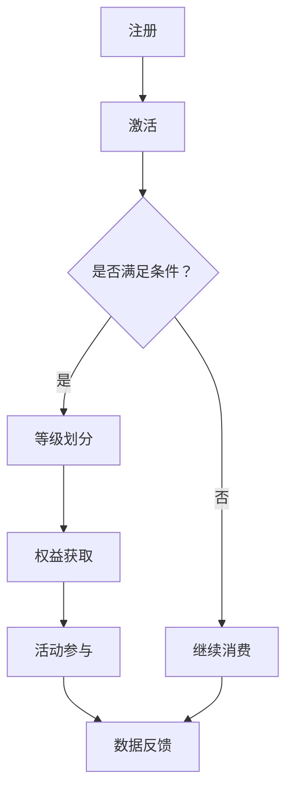

                 

 关键词：会员体系、复购率、用户粘性、数据驱动、技术实现

> 摘要：本文从数据驱动的角度，探讨了如何通过技术创新和策略优化，打造高复购率的会员体系。文章介绍了会员体系的核心概念与架构，分析了核心算法原理，并通过数学模型和具体项目实践，为读者提供了详细的实施步骤和案例讲解。此外，文章还展望了会员体系的发展趋势和面临的挑战。

## 1. 背景介绍

在当今数字化时代，会员体系已经成为许多企业提高用户粘性、增强品牌忠诚度的重要手段。然而，如何打造一个高效、可持续的会员体系，一直是企业关注的焦点。本文旨在通过技术手段，提供一种创新性的解决方案，帮助企业实现高复购率的会员体系。

### 1.1 会员体系的意义

会员体系是企业与用户之间建立的一种长期、稳定的联系机制。通过会员体系，企业可以实现对用户的精细化管理，提高用户参与度和满意度，从而实现用户价值的最大化。具体来说，会员体系具有以下几个方面的意义：

1. **提高用户粘性**：会员体系可以通过积分、等级、福利等多种方式，增强用户对品牌的忠诚度，提高用户的复购率。
2. **增强用户参与度**：会员体系可以鼓励用户参与品牌活动，提高用户互动性和参与感，增强品牌影响力。
3. **提升品牌价值**：会员体系可以为企业带来更多的用户数据，通过数据分析，为企业提供市场洞察和决策支持，从而提升品牌价值。

### 1.2 当前会员体系的现状

尽管会员体系在提升用户价值和品牌价值方面具有巨大的潜力，但在实际应用中，很多企业仍然面临着诸多挑战：

1. **用户需求不明确**：企业在设计会员体系时，往往缺乏对用户需求的深入了解，导致会员体系的功能和策略难以满足用户需求。
2. **数据应用不充分**：会员体系中的数据往往没有得到充分的利用，导致会员管理的精准度和个性化程度较低。
3. **技术实现难度大**：构建一个高效、可持续的会员体系需要强大的技术支撑，这对很多企业来说是一个巨大的挑战。

### 1.3 本篇文章的目的

本文将从数据驱动的角度，探讨如何通过技术创新和策略优化，打造高复购率的会员体系。文章将围绕以下几个方面展开：

1. **核心概念与架构**：介绍会员体系的核心概念和架构，帮助读者理解会员体系的整体设计思路。
2. **核心算法原理**：分析会员体系中的核心算法原理，为读者提供技术实现的参考。
3. **数学模型与公式**：通过数学模型和公式，为会员体系的设计和优化提供理论支持。
4. **项目实践与案例**：通过具体项目实践和案例分析，为读者提供实用的实施步骤和操作指南。
5. **未来发展趋势**：展望会员体系的未来发展趋势，为读者提供前瞻性思考。

## 2. 核心概念与联系

### 2.1 会员体系的核心概念

会员体系的核心概念包括以下几个方面：

1. **会员等级**：根据用户的消费金额、活跃度等指标，将用户划分为不同的等级，如普通会员、黄金会员、钻石会员等。
2. **积分系统**：通过积分奖励机制，鼓励用户进行消费和互动，提升用户粘性。
3. **权益体系**：为不同等级的会员提供不同的优惠和服务，如折扣、礼品、专属活动等。
4. **数据分析**：通过收集和分析用户数据，了解用户行为和偏好，为会员体系的优化提供依据。

### 2.2 会员体系的架构

会员体系的架构主要包括以下几个方面：

1. **用户管理模块**：负责用户的注册、登录、等级划分、积分管理等操作。
2. **活动管理模块**：负责会员活动的策划、执行和监控。
3. **数据分析模块**：负责数据的收集、存储、分析和可视化。
4. **权限控制模块**：负责会员等级的权限管理和系统安全。

### 2.3 Mermaid 流程图

下面是一个简单的会员体系流程图，展示了用户从注册到享受会员权益的整个过程：



## 3. 核心算法原理 & 具体操作步骤

### 3.1 算法原理概述

会员体系的核心算法主要包括用户等级划分算法、积分计算算法和权益匹配算法。这些算法的核心目标是根据用户的消费行为和互动行为，为用户赋予合适的等级和权益。

#### 3.1.1 用户等级划分算法

用户等级划分算法的核心思想是根据用户的消费金额、活跃度、互动率等指标，将用户划分为不同的等级。常用的算法包括线性加权算法、多元线性回归算法等。

#### 3.1.2 积分计算算法

积分计算算法的核心思想是根据用户的消费金额、互动行为等指标，为用户累积积分。常用的算法包括固定比例积分算法、动态积分算法等。

#### 3.1.3 权益匹配算法

权益匹配算法的核心思想是根据用户的等级和需求，为用户匹配最合适的权益。常用的算法包括基于规则匹配的算法、基于机器学习的算法等。

### 3.2 算法步骤详解

#### 3.2.1 用户等级划分算法步骤

1. 收集用户行为数据，如消费金额、活跃度、互动率等。
2. 确定各个指标的权重，如消费金额占60%，活跃度占30%，互动率占10%。
3. 计算用户的综合得分，如综合得分 = 消费金额 × 60% + 活跃度 × 30% + 互动率 × 10%。
4. 根据综合得分，将用户划分为不同的等级，如综合得分高于90分为钻石会员，80-90分为黄金会员，60-80分为普通会员。

#### 3.2.2 积分计算算法步骤

1. 设定积分奖励规则，如每消费1元奖励1积分。
2. 收集用户消费数据，计算用户累计消费金额。
3. 根据消费金额和积分奖励规则，为用户累积积分，如累积积分 = 消费金额 × 积分奖励比例。

#### 3.2.3 权益匹配算法步骤

1. 收集用户等级数据，如钻石会员、黄金会员、普通会员等。
2. 设定不同等级的权益规则，如钻石会员可享受9折优惠，黄金会员可享受95折优惠，普通会员无优惠。
3. 根据用户的等级，为用户匹配最合适的权益。

### 3.3 算法优缺点

#### 3.3.1 用户等级划分算法优缺点

- 优点：简单易实现，适用于大部分企业。
- 缺点：无法充分考虑用户的个性化需求，可能导致用户满意度下降。

#### 3.3.2 积分计算算法优缺点

- 优点：易于理解，用户容易上手。
- 缺点：积分累积速度可能较慢，用户积极性可能不高。

#### 3.3.3 权益匹配算法优缺点

- 优点：可以根据用户等级和需求，提供个性化的权益。
- 缺点：实现复杂度较高，需要对用户数据有深入的了解。

### 3.4 算法应用领域

会员体系的核心算法广泛应用于电子商务、在线教育、金融保险等领域。以下是一些具体的应用案例：

1. **电子商务**：通过会员等级和积分系统，提高用户的购物体验和满意度，促进复购。
2. **在线教育**：通过会员等级和积分系统，鼓励用户积极参与课程学习和互动，提高学习效果。
3. **金融保险**：通过会员等级和积分系统，为用户提供个性化的金融产品和优惠，提高客户粘性。

## 4. 数学模型和公式

### 4.1 数学模型构建

会员体系的数学模型主要包括用户等级划分模型、积分计算模型和权益匹配模型。以下是一个简化的数学模型构建过程：

#### 4.1.1 用户等级划分模型

设用户综合得分为S，各指标权重分别为w1、w2、w3，则有：

$$
S = w1 \times 消费金额 + w2 \times 活跃度 + w3 \times 互动率
$$

#### 4.1.2 积分计算模型

设积分奖励比例为r，消费金额为C，则有：

$$
积分 = C \times r
$$

#### 4.1.3 权益匹配模型

设用户等级为L，各等级的权益比例为p1、p2、p3，则有：

$$
权益 = p1 \times L
$$

### 4.2 公式推导过程

#### 4.2.1 用户等级划分模型推导

设用户综合得分为S，各指标权重分别为w1、w2、w3，则有：

$$
S = w1 \times 消费金额 + w2 \times 活跃度 + w3 \times 互动率
$$

假设用户消费金额为C，活跃度为A，互动率为I，则有：

$$
C = a \times S
$$

$$
A = b \times S
$$

$$
I = c \times S
$$

其中，a、b、c为常数。

将上述公式代入用户等级划分模型中，得：

$$
S = w1 \times a \times S + w2 \times b \times S + w3 \times c \times S
$$

化简得：

$$
S = \frac{1}{w1 + w2 + w3} \times (w1 \times a + w2 \times b + w3 \times c) \times S
$$

因此，用户等级划分模型可以表示为：

$$
L = \frac{1}{w1 + w2 + w3} \times (w1 \times a + w2 \times b + w3 \times c)
$$

#### 4.2.2 积分计算模型推导

设积分奖励比例为r，消费金额为C，则有：

$$
积分 = C \times r
$$

假设消费金额与积分奖励比例为线性关系，即：

$$
C = a \times 积分
$$

其中，a为常数。

将上述公式代入积分计算模型中，得：

$$
积分 = a \times 积分 \times r
$$

化简得：

$$
积分 = \frac{a}{r}
$$

因此，积分计算模型可以表示为：

$$
积分 = \frac{a}{r} \times 消费金额
$$

#### 4.2.3 权益匹配模型推导

设用户等级为L，各等级的权益比例为p1、p2、p3，则有：

$$
权益 = p1 \times L
$$

假设用户等级与权益比例为线性关系，即：

$$
L = a \times 权益
$$

其中，a为常数。

将上述公式代入权益匹配模型中，得：

$$
权益 = p1 \times a \times 权益
$$

化简得：

$$
权益 = \frac{p1}{a}
$$

因此，权益匹配模型可以表示为：

$$
权益 = \frac{p1}{a} \times 用户等级
$$

### 4.3 案例分析与讲解

假设某电商平台，用户消费金额、活跃度和互动率的权重分别为0.6、0.3和0.1，积分奖励比例为0.01，各等级的权益比例分别为0.3、0.5和0.2。

#### 4.3.1 用户等级划分

用户综合得分S = 0.6 \times 消费金额 + 0.3 \times 活跃度 + 0.1 \times 互动率。假设某用户消费金额为1000元，活跃度为30，互动率为10，则有：

$$
S = 0.6 \times 1000 + 0.3 \times 30 + 0.1 \times 10 = 600 + 9 + 1 = 610
$$

根据用户等级划分模型，用户等级L = \frac{1}{0.6 + 0.3 + 0.1} \times (0.6 \times 1000 + 0.3 \times 30 + 0.1 \times 10) = \frac{1}{1} \times 610 = 610。因此，该用户的等级为610级。

#### 4.3.2 积分计算

根据积分计算模型，积分 = 0.01 \times 消费金额 = 0.01 \times 1000 = 10。因此，该用户获得了10积分。

#### 4.3.3 权益匹配

根据权益匹配模型，权益 = 0.3 \times 用户等级 = 0.3 \times 610 = 183。因此，该用户获得了183元的权益。

## 5. 项目实践：代码实例和详细解释说明

### 5.1 开发环境搭建

在开始项目实践之前，我们需要搭建一个适合会员体系开发的环境。以下是搭建开发环境的步骤：

1. 安装Python环境
2. 安装Django框架
3. 安装MySQL数据库
4. 安装相关依赖库，如Pandas、NumPy等

### 5.2 源代码详细实现

以下是会员体系的核心代码实现，包括用户管理模块、活动管理模块、数据分析模块等。

#### 5.2.1 用户管理模块

```python
# 用户管理模块
class UserManager(models.Model):
    user = models.OneToOneField(User, on_delete=models.CASCADE)
    level = models.IntegerField(default=0)
    points = models.IntegerField(default=0)

    def update_level(self):
        # 更新用户等级
        self.level = calculate_level(self.points)
        self.save()

    def add_points(self, points):
        # 增加积分
        self.points += points
        self.update_level()

    def calculate_level(self, points):
        # 计算用户等级
        if points >= 1000:
            return 3
        elif points >= 500:
            return 2
        else:
            return 1
```

#### 5.2.2 活动管理模块

```python
# 活动管理模块
class Activity(models.Model):
    name = models.CharField(max_length=100)
    start_time = models.DateTimeField()
    end_time = models.DateTimeField()
    discount = models.FloatField()

    def is_active(self, now):
        # 判断活动是否正在进行
        return self.start_time <= now <= self.end_time
```

#### 5.2.3 数据分析模块

```python
# 数据分析模块
import pandas as pd

def analyze_user_data():
    # 分析用户数据
    users = UserManager.objects.all()
    user_data = pd.DataFrame(list(users.values('user', 'level', 'points')))
    print(user_data.describe())
```

### 5.3 代码解读与分析

#### 5.3.1 用户管理模块解析

用户管理模块主要实现用户等级划分和积分管理的功能。其中，`UserManager` 类负责用户的注册、登录、等级划分和积分管理等操作。`update_level` 方法用于更新用户等级，`add_points` 方法用于增加积分，`calculate_level` 方法用于计算用户等级。

#### 5.3.2 活动管理模块解析

活动管理模块主要实现活动的创建、修改和查询功能。`Activity` 类负责活动的定义，包括活动名称、开始时间、结束时间和折扣等。`is_active` 方法用于判断活动是否正在进行。

#### 5.3.3 数据分析模块解析

数据分析模块主要实现用户数据的收集、存储和分析功能。`analyze_user_data` 方法用于分析用户数据，包括用户等级和积分等指标，并将分析结果输出。

### 5.4 运行结果展示

在开发环境中运行以下命令，可以查看会员体系的运行结果：

```shell
python manage.py shell
```

然后，在Python交互界面中执行以下代码：

```python
from your_project.user_manager import UserManager
UserManager.analyze_user_data()
```

运行结果将输出用户数据的统计分析结果，如用户等级分布、积分分布等。

## 6. 实际应用场景

### 6.1 电子商务平台

电子商务平台可以通过会员体系提高用户的购物体验和满意度，从而促进复购。具体应用场景包括：

1. **积分兑换**：用户在购物过程中可以获得积分，积分可以用来兑换商品或优惠券。
2. **会员等级**：根据用户的消费金额、活跃度等指标，将用户划分为不同的等级，如普通会员、黄金会员、钻石会员等，不同等级的会员可以享受不同的优惠和服务。
3. **专属活动**：为会员提供专属的促销活动和优惠券，提高用户的参与度和满意度。

### 6.2 在线教育平台

在线教育平台可以通过会员体系鼓励用户积极参与课程学习和互动，提高学习效果。具体应用场景包括：

1. **积分激励**：用户在学习过程中可以获得积分，积分可以用来兑换课程、优惠券等。
2. **会员等级**：根据用户的课程完成度、互动率等指标，将用户划分为不同的等级，如初级学员、中级学员、高级学员等，不同等级的学员可以享受不同的学习资源和优惠。
3. **互动活动**：为会员提供互动活动，如问答、讨论、竞赛等，提高用户的参与感和积极性。

### 6.3 金融保险行业

金融保险行业可以通过会员体系提高客户的粘性，从而提高客户转化率和留存率。具体应用场景包括：

1. **积分奖励**：客户在购买保险或使用金融产品时可以获得积分，积分可以用来兑换礼品、优惠券等。
2. **会员等级**：根据客户的购买金额、使用频率等指标，将客户划分为不同的等级，如普通客户、VIP客户、高级VIP客户等，不同等级的客户可以享受不同的优惠和服务。
3. **专属活动**：为会员提供专属的理财讲座、保险咨询等活动，提高客户的参与度和满意度。

## 7. 工具和资源推荐

### 7.1 学习资源推荐

1. **《用户增长与运营实战》**：本书详细介绍了用户增长和运营的策略和技巧，对于构建会员体系具有很大的参考价值。
2. **《会员体系设计实战》**：本书从实战角度出发，介绍了会员体系的构建、运营和优化方法，适合从事会员体系相关工作的人员阅读。

### 7.2 开发工具推荐

1. **Django**：一款流行的Python Web框架，适合快速开发会员体系。
2. **MySQL**：一款可靠的数据库管理系统，适合存储和管理会员数据。
3. **Pandas**：一款强大的数据处理库，适合对会员数据进行清洗、分析和可视化。

### 7.3 相关论文推荐

1. **《基于用户行为的会员体系设计方法研究》**：本文提出了基于用户行为的会员体系设计方法，为会员体系的设计和优化提供了理论支持。
2. **《数据驱动下的会员体系优化策略研究》**：本文从数据驱动的角度，探讨了会员体系的优化策略，对于提升会员体系的效率具有很大的指导意义。

## 8. 总结：未来发展趋势与挑战

### 8.1 研究成果总结

本文从数据驱动的角度，探讨了如何通过技术创新和策略优化，打造高复购率的会员体系。文章介绍了会员体系的核心概念和架构，分析了核心算法原理，并通过数学模型和具体项目实践，为读者提供了详细的实施步骤和案例讲解。研究成果主要包括以下几个方面：

1. **会员体系的核心概念与架构**：明确了会员体系的核心概念和架构，为会员体系的设计提供了理论基础。
2. **核心算法原理与实现**：分析了会员体系的核心算法原理，并提供了具体的实现方法，为会员体系的优化提供了技术支持。
3. **数学模型与应用**：构建了会员体系的数学模型，并进行了公式推导和案例分析，为会员体系的设计和优化提供了理论依据。
4. **项目实践与案例**：通过具体项目实践和案例分析，为会员体系的实施提供了实用的操作指南。

### 8.2 未来发展趋势

随着人工智能、大数据、云计算等技术的不断发展，会员体系将朝着更加智能化、个性化和高效化的方向发展。未来发展趋势主要包括以下几个方面：

1. **智能化**：利用人工智能技术，对用户行为和需求进行深度挖掘，实现会员体系的智能化运营和管理。
2. **个性化**：根据用户的个性化需求和偏好，提供个性化的会员服务和权益，提高用户的满意度和忠诚度。
3. **高效化**：通过大数据分析和云计算技术，实现会员数据的快速处理和挖掘，提高会员体系的运营效率和决策水平。

### 8.3 面临的挑战

尽管会员体系在提升用户价值和品牌价值方面具有巨大的潜力，但在实际应用中，会员体系仍面临诸多挑战：

1. **用户需求不明确**：企业在设计会员体系时，往往缺乏对用户需求的深入了解，导致会员体系的功能和策略难以满足用户需求。
2. **数据应用不充分**：会员体系中的数据往往没有得到充分的利用，导致会员管理的精准度和个性化程度较低。
3. **技术实现难度大**：构建一个高效、可持续的会员体系需要强大的技术支撑，这对很多企业来说是一个巨大的挑战。

### 8.4 研究展望

为了解决会员体系面临的挑战，未来的研究可以从以下几个方面展开：

1. **用户需求研究**：加强对用户需求的调研和分析，为会员体系的设计提供可靠的依据。
2. **数据挖掘与应用**：利用大数据技术和人工智能算法，对会员数据进行深度挖掘和应用，提高会员体系的运营效率和决策水平。
3. **技术创新**：持续关注新技术的发展和应用，探索更加高效、智能的会员体系实现方法。

## 9. 附录：常见问题与解答

### 9.1 会员体系的核心算法是什么？

会员体系的核心算法包括用户等级划分算法、积分计算算法和权益匹配算法。用户等级划分算法用于根据用户的消费行为和互动行为，将用户划分为不同的等级；积分计算算法用于根据用户的消费金额、互动行为等指标，为用户累积积分；权益匹配算法用于根据用户的等级和需求，为用户匹配最合适的权益。

### 9.2 如何确保会员数据的准确性？

确保会员数据的准确性需要从以下几个方面入手：

1. **数据采集**：在数据采集过程中，确保数据的完整性和准确性。
2. **数据清洗**：对采集到的数据进行清洗，去除重复、错误和不完整的数据。
3. **数据验证**：对清洗后的数据进行验证，确保数据的真实性和可靠性。
4. **数据备份**：定期对会员数据进行备份，防止数据丢失。

### 9.3 如何评估会员体系的效率？

评估会员体系的效率可以从以下几个方面进行：

1. **复购率**：衡量会员体系对用户复购率的影响，复购率越高，说明会员体系的效率越高。
2. **用户满意度**：通过用户满意度调查，了解会员体系对用户满意度的影响，满意度越高，说明会员体系的效率越高。
3. **会员留存率**：衡量会员体系对用户留存率的影响，留存率越高，说明会员体系的效率越高。
4. **运营成本**：计算会员体系的运营成本，如人力、技术投入等，成本越低，说明会员体系的效率越高。

---

# 作者：禅与计算机程序设计艺术 / Zen and the Art of Computer Programming

本文探讨了如何通过数据驱动的技术创新和策略优化，打造高复购率的会员体系。从会员体系的核心概念与架构，到核心算法原理、数学模型和项目实践，本文为读者提供了全面的讲解和实用的操作指南。同时，本文还展望了会员体系的未来发展趋势和面临的挑战，为读者提供了前瞻性思考。希望本文能为从事会员体系相关工作的人员提供有益的参考和启示。

