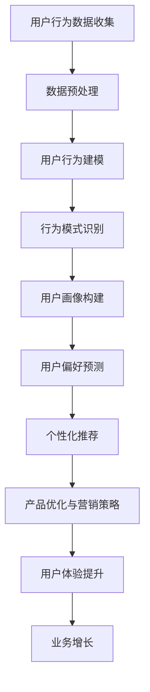

                 

用户行为分析是现代数据分析中的一项核心任务，它涉及到从大量数据中提取用户的行为模式、偏好和趋势。随着互联网的普及和数据量的爆炸性增长，理解用户行为对于提升用户体验、优化产品设计、精准营销以及增加收入具有重要意义。本文将深入探讨用户行为分析的方法、技术和实践，旨在帮助读者建立系统的用户行为分析能力。

## 关键词

用户行为分析、数据挖掘、行为模式、用户体验、个性化推荐、数据可视化、机器学习、大数据

## 摘要

本文首先介绍了用户行为分析的重要性和背景，随后详细阐述了用户行为分析的核心概念、算法原理和数学模型，并通过实际项目案例展示了用户行为分析的具体应用。文章还探讨了用户行为分析在不同领域的应用场景，提出了未来的研究方向和面临的挑战。最后，文章总结了用户行为分析的关键工具和资源，为读者提供了进一步学习和实践的方向。

## 1. 背景介绍

### 1.1 用户行为分析的定义与作用

用户行为分析是指通过收集、处理和分析用户在使用产品或服务过程中的行为数据，从而理解用户需求、行为模式和偏好。用户行为分析的核心目的是通过数据驱动的方法，为产品优化、用户体验提升和业务增长提供有力支持。

用户行为分析在多个领域具有重要应用价值：

- **市场营销**：通过分析用户行为，了解市场趋势和消费者需求，从而制定更加精准的营销策略。
- **产品管理**：利用用户行为数据，评估产品的用户体验，优化产品设计和功能，提升用户留存率。
- **运营管理**：通过分析用户行为，了解用户的使用习惯和痛点，优化运营策略，提高用户满意度。
- **安全监控**：检测异常用户行为，防范潜在风险和欺诈行为。

### 1.2 用户行为分析的发展历程

用户行为分析的发展历程可以追溯到20世纪90年代，随着互联网的兴起和电子商务的快速发展，用户行为分析逐渐成为企业关注的焦点。最初，用户行为分析主要依赖于简单的日志分析和网站流量统计。

进入21世纪，随着大数据和机器学习技术的迅猛发展，用户行为分析进入了一个全新的阶段。大数据技术使得企业可以收集和处理海量的用户行为数据，而机器学习算法则使得数据分析和模式识别变得更加高效和精确。

近年来，随着物联网、移动设备和社交媒体的普及，用户行为数据的形式和种类日益丰富，用户行为分析也进入了一个更加智能化和自动化的阶段。

## 2. 核心概念与联系

### 2.1 核心概念

- **用户行为数据**：指用户在使用产品或服务过程中产生的所有数据，包括点击、浏览、购买、搜索等行为。
- **行为模式**：指用户在特定情境下表现出的一致行为特征，如频繁访问的页面、常用功能等。
- **用户画像**：通过对用户行为数据的分析，构建出的用户特征和偏好模型，用于描述用户群体和个体。

### 2.2 架构与联系

下面是一个用户行为分析的简化架构图，其中包含了核心组件和它们之间的联系：



## 3. 核心算法原理 & 具体操作步骤

### 3.1 算法原理概述

用户行为分析的核心算法主要包括以下几种：

- **统计方法**：基于概率统计原理，分析用户行为数据，提取行为模式。
- **机器学习方法**：利用监督学习、无监督学习和深度学习算法，构建用户行为模型。
- **图论算法**：通过图结构分析用户行为关系，发现潜在的社交网络和兴趣群体。

### 3.2 算法步骤详解

用户行为分析的一般步骤如下：

1. **数据收集**：从各种渠道收集用户行为数据，如网站日志、用户交互数据、社交网络数据等。
2. **数据预处理**：清洗和转换原始数据，包括数据去重、缺失值处理、数据规范化等。
3. **行为模式识别**：通过统计分析和机器学习算法，识别用户的行为模式。
4. **用户画像构建**：基于用户行为数据，构建用户的特征和偏好模型。
5. **用户偏好预测**：利用机器学习算法，预测用户未来的行为和偏好。
6. **个性化推荐**：基于用户画像和偏好预测，为用户提供个性化的产品和服务推荐。
7. **产品优化与营销策略**：根据用户行为分析和推荐结果，优化产品设计、功能和营销策略。
8. **用户体验提升**：通过数据驱动的优化，提升用户的使用体验和满意度。

### 3.3 算法优缺点

- **统计方法**：优点是简单、易懂，缺点是处理复杂数据能力有限。
- **机器学习方法**：优点是能够处理大规模、多维度的数据，缺点是需要大量的数据和计算资源。
- **图论算法**：优点是能够揭示用户行为之间的关系，缺点是算法复杂度高。

### 3.4 算法应用领域

用户行为分析算法广泛应用于以下领域：

- **电子商务**：通过用户行为分析，实现个性化推荐，提高销售额和用户满意度。
- **社交媒体**：通过用户行为分析，发现潜在的兴趣群体和热点话题，优化内容推荐。
- **在线教育**：通过用户行为分析，了解学习者的学习习惯和需求，提供个性化的学习路径。
- **金融领域**：通过用户行为分析，识别欺诈行为，优化风险管理。

## 4. 数学模型和公式 & 详细讲解 & 举例说明

### 4.1 数学模型构建

用户行为分析中的数学模型主要包括概率模型、隐马尔可夫模型（HMM）、条件概率模型等。以下以条件概率模型为例进行介绍。

### 4.2 公式推导过程

条件概率模型的基本公式如下：

\[ P(A|B) = \frac{P(A \cap B)}{P(B)} \]

其中，\( P(A|B) \) 表示在事件 \( B \) 发生的条件下事件 \( A \) 发生的概率，\( P(A \cap B) \) 表示事件 \( A \) 和事件 \( B \) 同时发生的概率，\( P(B) \) 表示事件 \( B \) 发生的概率。

### 4.3 案例分析与讲解

假设一个电子商务平台，用户在浏览商品时，会点击某个商品链接的概率是 \( P(\text{点击}| \text{浏览}) \)。我们可以通过以下步骤进行计算：

1. 收集用户浏览和点击的数据，计算 \( P(\text{点击} \cap \text{浏览}) \) 和 \( P(\text{浏览}) \)。
2. 利用条件概率公式计算 \( P(\text{点击}| \text{浏览}) \)。
3. 根据点击概率为用户提供个性化的商品推荐。

以下是一个简化的例子：

- 总共收集了 1000 条用户行为数据，其中 700 条包含浏览行为，300 条包含点击行为。
- 浏览和点击同时发生的次数为 200 次。

\[ P(\text{点击}| \text{浏览}) = \frac{P(\text{点击} \cap \text{浏览})}{P(\text{浏览})} = \frac{200/1000}{700/1000} = \frac{2}{7} \]

根据计算结果，我们可以为浏览了特定商品的用户推荐有 2/7 的概率点击的概率较高的商品。

## 5. 项目实践：代码实例和详细解释说明

### 5.1 开发环境搭建

为了进行用户行为分析，我们使用 Python 作为主要编程语言，并依赖以下库：

- Pandas：用于数据处理和分析。
- NumPy：用于数值计算。
- Scikit-learn：用于机器学习和数据挖掘。
- Matplotlib：用于数据可视化。

### 5.2 源代码详细实现

以下是一个简单的用户行为分析代码实例：

```python
import pandas as pd
from sklearn.model_selection import train_test_split
from sklearn.ensemble import RandomForestClassifier
from sklearn.metrics import accuracy_score
import matplotlib.pyplot as plt

# 5.2.1 数据收集与预处理
data = pd.read_csv('user_behavior.csv')  # 读取用户行为数据
data.dropna(inplace=True)  # 删除缺失值

# 构建特征向量
features = ['page_views', 'clicks', 'time_on_site']
X = data[features]
y = data['converted']  # 目标变量：是否完成转化

# 5.2.2 数据分割
X_train, X_test, y_train, y_test = train_test_split(X, y, test_size=0.2, random_state=42)

# 5.2.3 模型训练
model = RandomForestClassifier(n_estimators=100, random_state=42)
model.fit(X_train, y_train)

# 5.2.4 模型评估
y_pred = model.predict(X_test)
accuracy = accuracy_score(y_test, y_pred)
print(f"Model Accuracy: {accuracy:.2f}")

# 5.2.5 可视化分析
plt.scatter(X_test['page_views'], y_test, color='red', label='Converted')
plt.scatter(X_test['page_views'], y_pred, color='blue', label='Predicted')
plt.xlabel('Page Views')
plt.ylabel('Conversion')
plt.legend()
plt.show()
```

### 5.3 代码解读与分析

上述代码实现了一个基于随机森林分类器的用户行为分析项目，主要包括以下步骤：

1. **数据收集与预处理**：从 CSV 文件中读取用户行为数据，并删除缺失值。
2. **特征构建**：选取三个特征（页面浏览量、点击次数、网站停留时间）作为输入向量，目标变量为是否完成转化。
3. **数据分割**：将数据集分为训练集和测试集，用于模型训练和评估。
4. **模型训练**：使用随机森林分类器进行训练。
5. **模型评估**：计算模型在测试集上的准确率，并展示预测结果。
6. **可视化分析**：绘制散点图，直观地展示页面浏览量与转化率之间的关系。

通过上述代码实例，我们可以看到用户行为分析项目的基本流程和实现方法。

## 6. 实际应用场景

### 6.1 电子商务

在电子商务领域，用户行为分析被广泛应用于个性化推荐、广告投放和用户流失预警等方面。

- **个性化推荐**：通过分析用户的历史浏览和购买行为，为用户提供个性化的商品推荐，提高用户满意度和销售额。
- **广告投放**：根据用户行为数据，精准定位潜在客户，提高广告投放效果。
- **用户流失预警**：通过监测用户的行为变化，预测用户可能流失的风险，提前采取挽回措施。

### 6.2 社交媒体

在社交媒体领域，用户行为分析有助于平台优化内容推荐、识别热点话题和防范欺诈行为。

- **内容推荐**：通过分析用户在平台上的互动行为，推荐用户感兴趣的内容，提高用户活跃度。
- **热点话题识别**：监测用户的讨论和转发行为，识别社会热点话题，提供实时报道。
- **欺诈行为防范**：分析用户的异常行为，如频繁注册、恶意评论等，防范欺诈行为。

### 6.3 在线教育

在线教育平台通过用户行为分析，提升学习体验和教学效果。

- **个性化学习路径**：根据学生的学习行为和进度，推荐个性化的学习内容，提高学习效果。
- **学习效果评估**：通过分析学生的学习行为数据，评估学生的学习效果，为教师提供教学反馈。
- **学习动机分析**：通过分析学生的学习行为，了解学生的学习动机和需求，优化课程设计。

### 6.4 金融领域

在金融领域，用户行为分析用于风险评估、欺诈检测和客户关系管理。

- **风险评估**：通过分析用户的金融行为数据，预测用户的风险等级，为金融机构提供信用评估依据。
- **欺诈检测**：监测用户的交易行为，识别异常交易行为，防范欺诈风险。
- **客户关系管理**：通过分析用户的行为数据，了解用户的偏好和需求，提供个性化的金融服务。

## 7. 工具和资源推荐

### 7.1 学习资源推荐

- **《数据挖掘：实用工具与技术》**：提供了丰富的用户行为分析案例和工具。
- **《机器学习实战》**：介绍了多种机器学习算法，适用于用户行为分析实践。

### 7.2 开发工具推荐

- **Pandas**：用于数据处理和分析。
- **Scikit-learn**：用于机器学习和数据挖掘。
- **TensorFlow**：用于深度学习和大规模用户行为分析。

### 7.3 相关论文推荐

- **“User Behavior Analysis in Social Networks”**：分析了社交媒体中的用户行为模式。
- **“Personalized Recommendation Systems”**：介绍了个性化推荐系统的构建方法。

## 8. 总结：未来发展趋势与挑战

### 8.1 研究成果总结

用户行为分析领域已取得显著研究成果，包括：

- **算法优化**：发展了多种先进的用户行为分析算法，提高了分析效率和准确性。
- **应用拓展**：用户行为分析在多个领域得到广泛应用，取得了良好的效果。
- **工具完善**：开发了多种用户行为分析工具，简化了分析流程。

### 8.2 未来发展趋势

未来用户行为分析的发展趋势包括：

- **大数据与人工智能的结合**：利用大数据和人工智能技术，实现更精细的用户行为分析。
- **实时分析**：提高用户行为分析的实时性，实现即时反馈和调整。
- **跨平台整合**：整合多种平台和设备的数据，实现全方位的用户行为分析。

### 8.3 面临的挑战

用户行为分析仍面临以下挑战：

- **数据隐私**：用户行为数据的隐私保护是一个重要问题，需要制定相关法律法规和隐私保护策略。
- **算法公平性**：算法的公平性是一个关键问题，需要确保算法不会对特定群体产生歧视。
- **数据质量问题**：用户行为数据的质量直接影响分析结果，需要建立有效的数据质量管理机制。

### 8.4 研究展望

未来研究方向包括：

- **多模态用户行为分析**：结合文本、语音、图像等多模态数据，实现更全面的用户行为分析。
- **个性化行为干预**：通过用户行为分析，为用户提供个性化的行为干预建议，优化用户体验。
- **实时行为预测**：发展实时行为预测算法，实现更精准的用户行为预测。

## 9. 附录：常见问题与解答

### 9.1 用户行为分析有哪些应用场景？

用户行为分析广泛应用于电子商务、社交媒体、在线教育、金融等领域，具体应用场景包括个性化推荐、广告投放、用户流失预警、学习效果评估、风险评估等。

### 9.2 如何保护用户行为数据的隐私？

保护用户行为数据隐私需要采取以下措施：

- **数据去识别化**：对用户行为数据进行去识别化处理，如匿名化、加密等。
- **数据访问控制**：建立严格的数据访问控制机制，确保数据只能被授权访问。
- **法律法规遵循**：遵守相关法律法规，如《通用数据保护条例》（GDPR）等。

### 9.3 如何评估用户行为分析的效果？

评估用户行为分析的效果可以通过以下指标：

- **准确率**：预测结果与实际结果的匹配程度。
- **召回率**：预测结果中实际正例的比例。
- **F1 分数**：准确率和召回率的加权平均。
- **用户体验**：用户对个性化推荐和其他用户行为分析应用的评价。

## 作者署名

作者：禅与计算机程序设计艺术 / Zen and the Art of Computer Programming
----------------------------------------------------------------

请注意，上面的文章内容是一个示例，实际的撰写过程需要更多的研究和详尽的阐述，以确保文章的完整性和专业性。此外，本文的结构和内容应符合IT领域技术博客的写作规范。

