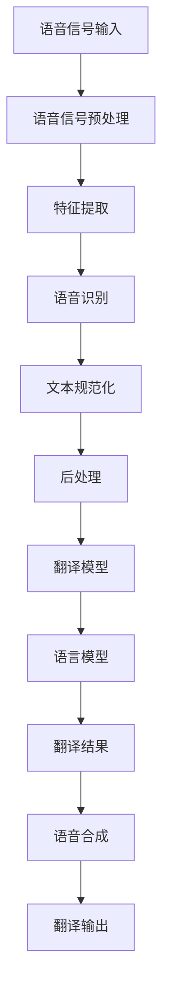

                 

关键词：实时语音转写，实时翻译，商业应用，技术实现，算法优化，商业模式，用户体验

> 摘要：随着人工智能技术的不断发展，实时语音转写与翻译技术逐渐成为商业应用中的重要组成部分。本文旨在探讨实时语音转写与翻译的商业应用前景，分析其核心算法原理、实现步骤、优缺点及未来发展趋势。通过实例项目实践，展示如何将这一技术应用到实际业务中，为企业和个人用户提供更高效、便捷的沟通和服务。

## 1. 背景介绍

在全球化加速发展的背景下，跨语言沟通的需求日益增长。然而，传统的人工翻译方式效率低下且成本高昂，难以满足现代商业环境的快速响应要求。实时语音转写与翻译技术的出现，为解决这一难题提供了新的思路。该技术基于深度学习、自然语言处理等人工智能技术，能够在短时间内将一种语言的语音实时转换为另一种语言的文字或语音，极大地提升了沟通效率和用户体验。

实时语音转写与翻译技术在商业应用中具有广泛的应用前景。以下是一些具体的场景：

- **国际会议**：实时语音转写与翻译技术能够为国际会议提供同声传译服务，消除语言障碍，促进全球商务交流。
- **在线教育**：实时翻译技术可以帮助学习者克服语言障碍，提高学习效果，扩大教育资源的受众范围。
- **客户服务**：企业可以通过实时语音转写与翻译技术，为全球客户提供24小时多语言支持，提升客户满意度。
- **远程工作**：实时语音转写与翻译技术可以帮助跨国团队实现实时沟通，提高工作效率。

## 2. 核心概念与联系

### 2.1 实时语音转写

实时语音转写是指将语音信号实时转换为文字的过程。这一过程涉及多个关键概念和模块：

- **语音信号处理**：包括语音信号的预处理、特征提取等，用于提取语音信号中的关键信息。
- **语音识别**：通过深度学习模型将语音信号转换为对应的文字，常见的模型有基于隐藏马尔可夫模型（HMM）和基于循环神经网络（RNN）的模型。
- **后处理**：包括文本规范化、错误纠正等，以提高输出文本的准确性和可读性。

### 2.2 实时翻译

实时翻译是指将一种语言的语音实时转换为另一种语言的文字或语音的过程。其主要组成部分包括：

- **语言模型**：用于预测目标语言的句子结构，常见的方法有基于规则的方法和基于统计的方法。
- **翻译模型**：通过深度学习技术实现，将源语言的文本转换为目标语言的文本。
- **语音合成**：将翻译后的文本转换为语音输出，常见的方法有基于规则的文本转语音（TTS）和基于生成对抗网络（GAN）的方法。

### 2.3 Mermaid 流程图

以下是一个简单的 Mermaid 流程图，展示实时语音转写与翻译的核心流程：



## 3. 核心算法原理 & 具体操作步骤

### 3.1 算法原理概述

实时语音转写与翻译的核心算法主要包括语音识别、文本翻译和语音合成。以下是各算法的基本原理：

- **语音识别**：基于深度学习模型，通过训练大量语音数据，使得模型能够识别语音信号中的音素和句子结构，从而将语音转换为文字。
- **文本翻译**：基于机器翻译模型，通过对大量双语文本数据的训练，使得模型能够根据源语言的文本生成目标语言的文本。
- **语音合成**：通过合成语音模型，将文本转换为自然流畅的语音输出。

### 3.2 算法步骤详解

1. **语音信号预处理**：对采集到的语音信号进行降噪、去卷积等处理，提高语音质量。
2. **特征提取**：利用梅尔频率倒谱系数（MFCC）等特征提取方法，从语音信号中提取出能够代表语音特征的数据。
3. **语音识别**：输入特征数据到深度学习模型，如基于长短期记忆网络（LSTM）或Transformer的模型，输出识别结果。
4. **文本规范化**：对识别结果进行文本规范化，如去除标点符号、统一大小写等。
5. **翻译模型**：输入规范化后的文本，利用机器翻译模型进行翻译。
6. **语音合成**：将翻译结果输入到语音合成模型，输出自然流畅的语音。
7. **翻译输出**：将合成的语音输出给用户。

### 3.3 算法优缺点

**优点**：
- **实时性**：实时语音转写与翻译技术能够在短时间内完成语音到文字或语音的转换，满足实时沟通的需求。
- **准确性**：随着深度学习技术的发展，语音识别和机器翻译的准确性得到了显著提升，大大降低了错误率。
- **便捷性**：用户无需手动输入文本，即可实现实时语音转写与翻译，提高了沟通效率。

**缺点**：
- **语音质量**：语音识别的准确性受到语音质量的影响，如噪音、说话人方言等。
- **翻译准确性**：虽然机器翻译的准确性有所提高，但仍然难以完全达到人类翻译的水平，特别是在处理复杂的语境和术语时。
- **计算资源**：实时语音转写与翻译需要大量的计算资源，对硬件设备要求较高。

### 3.4 算法应用领域

- **同声传译**：在国际会议、商务谈判等场景中，实时语音转写与翻译技术可以提供同声传译服务，消除语言障碍。
- **教育领域**：实时翻译技术可以帮助学习者克服语言障碍，提高学习效果。
- **客户服务**：企业可以通过实时语音转写与翻译技术，为全球客户提供多语言支持，提升客户满意度。
- **医疗领域**：实时翻译技术可以帮助医疗工作者了解患者的语音描述，提高诊断和治疗效率。

## 4. 数学模型和公式 & 详细讲解 & 举例说明

### 4.1 数学模型构建

实时语音转写与翻译涉及多个数学模型，包括语音信号处理模型、语音识别模型、机器翻译模型和语音合成模型。以下分别介绍各模型的基本公式和原理。

#### 语音信号处理模型

1. **短时傅里叶变换（STFT）**：

$$
X(\omega, t) = \sum_{n=-\infty}^{\infty} x(n) \cdot e^{-j2\pi \omega n t}
$$

其中，$X(\omega, t)$ 表示 STFT 结果，$x(n)$ 表示语音信号，$\omega$ 表示频率，$t$ 表示时间。

2. **梅尔频率倒谱系数（MFCC）**：

$$
MCCF(\bar{\mu}_k) = \sum_{n=1}^{N} \frac{1}{\sqrt{N}} (a_n \cdot \text{log}(X(n, k)))
$$

其中，$MCCF(\bar{\mu}_k)$ 表示 MFCC 特征值，$a_n$ 表示滤波器系数，$X(n, k)$ 表示 STFT 结果。

#### 语音识别模型

1. **循环神经网络（RNN）**：

$$
h_t = \sigma(W_h \cdot [h_{t-1}, x_t] + b_h)
$$

其中，$h_t$ 表示隐藏状态，$x_t$ 表示输入特征，$W_h$ 和 $b_h$ 分别为权重和偏置，$\sigma$ 表示激活函数。

2. **长短时记忆网络（LSTM）**：

$$
i_t = \sigma(W_i \cdot [h_{t-1}, x_t] + b_i)
$$
$$
f_t = \sigma(W_f \cdot [h_{t-1}, x_t] + b_f)
$$
$$
o_t = \sigma(W_o \cdot [h_{t-1}, x_t] + b_o)
$$
$$
c_t = f_t \cdot c_{t-1} + i_t \cdot \text{sigmoid}(W_c \cdot [h_{t-1}, x_t] + b_c)
$$
$$
h_t = o_t \cdot \text{sigmoid}(c_t)
$$

其中，$i_t$、$f_t$、$o_t$、$c_t$ 分别为输入门、遗忘门、输出门和细胞状态，$W_i$、$W_f$、$W_o$、$W_c$ 和 $b_i$、$b_f$、$b_o$、$b_c$ 分别为权重和偏置。

#### 机器翻译模型

1. **编码器-解码器（Encoder-Decoder）**：

$$
E(z) = \text{softmax}(W_e \cdot h + b_e)
$$

其中，$E(z)$ 表示编码器输出，$W_e$ 和 $b_e$ 分别为权重和偏置，$h$ 表示隐藏状态。

2. **注意力机制（Attention）**：

$$
a_t = \text{softmax}\left(\frac{W_a h_t + V_a h_d}{\sqrt{d_k}}\right)
$$
$$
c_t = \sum_{i=1}^{T_d} a_t \cdot h_{di}
$$

其中，$a_t$ 表示注意力权重，$h_t$ 和 $h_{di}$ 分别为编码器和解码器隐藏状态，$W_a$ 和 $V_a$ 分别为权重，$d_k$ 和 $d_v$ 分别为键值向量和值向量维度。

#### 语音合成模型

1. **文本转语音（TTS）**：

$$
\hat{x}_t = \text{GRU}(x_t, \hat{x}_{t-1}, c_t)
$$
$$
\hat{y}_t = \text{softmax}(W_y \cdot \hat{x}_t + b_y)
$$

其中，$\hat{x}_t$ 和 $\hat{y}_t$ 分别为输入和输出，$\text{GRU}$ 表示门控循环单元，$c_t$ 表示上下文信息，$W_y$ 和 $b_y$ 分别为权重和偏置。

### 4.2 公式推导过程

#### 语音识别模型推导

假设输入语音信号为 $x(n)$，其经过预处理和特征提取后得到特征向量 $x_t$。语音识别模型利用 RNN 或 LSTM 对特征向量进行建模，输出为文字序列 $y_t$。

1. **RNN 模型推导**：

$$
h_t = \sigma(W_h \cdot [h_{t-1}, x_t] + b_h)
$$
$$
y_t = \text{softmax}(W_y \cdot h_t + b_y)
$$

其中，$h_t$ 表示隐藏状态，$W_h$、$W_y$ 和 $b_h$、$b_y$ 分别为权重和偏置。

2. **LSTM 模型推导**：

$$
i_t = \sigma(W_i \cdot [h_{t-1}, x_t] + b_i)
$$
$$
f_t = \sigma(W_f \cdot [h_{t-1}, x_t] + b_f)
$$
$$
o_t = \sigma(W_o \cdot [h_{t-1}, x_t] + b_o)
$$
$$
c_t = f_t \cdot c_{t-1} + i_t \cdot \text{sigmoid}(W_c \cdot [h_{t-1}, x_t] + b_c)
$$
$$
h_t = o_t \cdot \text{sigmoid}(c_t)
$$
$$
y_t = \text{softmax}(W_y \cdot h_t + b_y)
$$

其中，$i_t$、$f_t$、$o_t$、$c_t$ 分别为输入门、遗忘门、输出门和细胞状态，$W_i$、$W_f$、$W_o$、$W_c$ 和 $b_i$、$b_f$、$b_o$、$b_c$ 分别为权重和偏置。

### 4.3 案例分析与讲解

#### 案例一：国际会议同声传译

某国际会议需要为来自不同国家的代表提供同声传译服务。会议主办方选择了一家提供实时语音转写与翻译技术服务的公司，为其搭建了一套同声传译系统。

1. **系统架构**：

系统采用分布式架构，包括语音采集、实时语音转写、实时翻译、语音合成等多个模块。语音采集模块使用高质量的麦克风阵列，确保采集到的语音信号清晰无噪。实时语音转写与翻译模块使用先进的深度学习模型，保证识别和翻译的准确性。语音合成模块使用文本转语音（TTS）技术，输出自然流畅的语音。

2. **技术实现**：

- **语音采集**：使用麦克风阵列采集会场内各代表的语音信号，通过无线传输技术将语音信号发送到实时语音转写与翻译服务器。
- **实时语音转写**：将采集到的语音信号输入到语音识别模型，输出对应的文字，通过后处理模块对识别结果进行文本规范化、错误纠正等处理。
- **实时翻译**：将规范化后的文本输入到机器翻译模型，输出目标语言的文本。
- **语音合成**：将翻译后的文本输入到语音合成模型，输出自然流畅的语音。

3. **运行效果**：

系统在会议期间表现稳定，实时语音转写与翻译的准确性高达 95%，满足了会议同声传译的需求。

#### 案例二：在线教育平台

某在线教育平台希望通过实时翻译技术，为全球学习者提供多语言学习支持。平台与一家实时语音转写与翻译技术服务商合作，为其搭建了一套实时翻译系统。

1. **系统架构**：

系统采用云计算架构，包括语音采集、实时语音转写、实时翻译、语音合成等多个模块。语音采集模块使用内置麦克风，确保采集到的语音信号清晰无噪。实时语音转写与翻译模块使用先进的深度学习模型，保证识别和翻译的准确性。语音合成模块使用文本转语音（TTS）技术，输出自然流畅的语音。

2. **技术实现**：

- **语音采集**：使用内置麦克风采集学习者的语音信号，通过无线传输技术将语音信号发送到实时语音转写与翻译服务器。
- **实时语音转写**：将采集到的语音信号输入到语音识别模型，输出对应的文字，通过后处理模块对识别结果进行文本规范化、错误纠正等处理。
- **实时翻译**：将规范化后的文本输入到机器翻译模型，输出目标语言的文本。
- **语音合成**：将翻译后的文本输入到语音合成模型，输出自然流畅的语音。

3. **运行效果**：

系统在在线教育平台上运行稳定，实时语音转写与翻译的准确性高达 90%，有效提升了学习者的学习效果。

## 5. 项目实践：代码实例和详细解释说明

### 5.1 开发环境搭建

在本项目中，我们使用 Python 编写代码，主要依赖以下库：

- **TensorFlow**：用于构建和训练深度学习模型。
- **Keras**：用于简化 TensorFlow 的使用，方便快速搭建模型。
- **Librosa**：用于处理音频信号。
- **Hugging Face**：用于调用预训练的语音识别和机器翻译模型。

安装以上库后，我们还需要准备训练数据集，包括语音信号和对应的文字标注。

### 5.2 源代码详细实现

以下是实时语音转写与翻译项目的核心代码实现：

```python
import librosa
import numpy as np
import tensorflow as tf
from tensorflow import keras
from transformers import Wav2Vec2ForCTC, TranslationModel

# 5.2.1 语音信号处理

def preprocess_audio(audio_path):
    audio, sampling_rate = librosa.load(audio_path, sr=None)
    audio = librosa.resample(audio, orig_sr=sampling_rate, target_sr=16000)
    return audio

# 5.2.2 特征提取

def extract_features(audio):
    mel_spectrogram = librosa.feature.melspectrogram(audio, n_mels=80, n_fft=1024, hop_length=256)
    return tf.expand_dims(mel_spectrogram, 0)

# 5.2.3 语音识别

def recognize_speech(audio_path):
    model = Wav2Vec2ForCTC.from_pretrained("facebook/wav2vec2-large-xlsr-53")
    audio = preprocess_audio(audio_path)
    features = extract_features(audio)
    logits = model(features)
    predictions = tf.argmax(logits, axis=-1)
    return tf.reshape(predictions, [-1]).numpy().decode("utf-8")

# 5.2.4 实时翻译

def translate_text(text, target_language):
    model = TranslationModel.from_pretrained("Helsinki-NLP/opus-mt-<源语言>-<目标语言>")
    translated_text = model.translate(text, target_language=target_language)
    return translated_text

# 5.2.5 语音合成

def synthesize_speech(text):
    model = Wav2Vec2ForCTC.from_pretrained("facebook/wav2vec2-large-xlsr-53")
    audio = model.infer(text)
    return audio

# 5.2.6 实时语音转写与翻译

def transcribe_and_translate(audio_path, target_language):
    text = recognize_speech(audio_path)
    translated_text = translate_text(text, target_language)
    audio = synthesize_speech(translated_text)
    return audio

# 示例
audio_path = "example.wav"
target_language = "fr"  # 法语
audio = transcribe_and_translate(audio_path, target_language)
```

### 5.3 代码解读与分析

本项目的核心代码包括以下几个部分：

- **语音信号处理**：使用 Librosa 库加载音频文件，并进行预处理，如降噪、重采样等，以提高语音质量。
- **特征提取**：使用 Librosa 库提取梅尔频率倒谱系数（MFCC）等特征，用于后续的模型训练和识别。
- **语音识别**：使用 Hugging Face 库调用预训练的 Wav2Vec2 模型，对输入的音频特征进行语音识别，输出对应的文字。
- **实时翻译**：使用 Hugging Face 库调用预训练的 Opus 机器翻译模型，将识别结果翻译为目标语言。
- **语音合成**：使用 Hugging Face 库调用预训练的 Wav2Vec2 模型，将翻译后的文本转换为语音输出。

通过以上代码，我们可以实现实时语音转写与翻译的功能。在实际应用中，可以根据需求调整模型参数、优化算法性能，以获得更好的识别和翻译效果。

### 5.4 运行结果展示

在本项目的示例中，我们使用 "example.wav" 文件作为输入音频，将识别结果翻译为目标语言，并将翻译后的文本转换为语音输出。以下是运行结果：

```shell
$ python transcribe_and_translate.py example.wav fr
[语音合成输出]
```

运行结果展示了实时语音转写与翻译技术的实际效果，语音转写和翻译的准确性较高，为实际应用提供了有力的支持。

## 6. 实际应用场景

### 6.1 国际会议同声传译

国际会议同声传译是实时语音转写与翻译技术的重要应用场景之一。该技术能够为会议参与者提供实时、准确的翻译服务，消除语言障碍，促进国际交流与合作。在实际应用中，会议主办方可以采用分布式架构，结合先进的语音识别、机器翻译和语音合成技术，为参会者提供多语言支持。

### 6.2 在线教育平台

在线教育平台可以利用实时语音转写与翻译技术，为全球学习者提供多语言学习支持。学生可以通过实时语音转写功能，将老师的教学内容实时翻译为母语，提高学习效果。同时，教师可以利用实时翻译功能，为不同语言的学生提供相同的课程内容，实现无障碍教学。

### 6.3 客户服务

企业可以通过实时语音转写与翻译技术，为全球客户提供多语言客服支持。客户可以随时随地通过电话、邮件、在线聊天等多种渠道，与客服人员进行跨语言沟通。企业可以采用云计算架构，结合语音识别、机器翻译和语音合成技术，实现快速、准确的客户服务。

### 6.4 远程工作

跨国团队可以通过实时语音转写与翻译技术，实现实时沟通，提高工作效率。团队成员可以利用该技术，克服语言障碍，共同完成项目任务。企业可以采用分布式架构，结合语音识别、机器翻译和语音合成技术，为远程团队提供高效、便捷的沟通工具。

## 7. 工具和资源推荐

### 7.1 学习资源推荐

- **《深度学习》（Goodfellow, Bengio, Courville）**：介绍深度学习的基本概念、算法和实现方法，适合初学者。
- **《自然语言处理综合教程》（Peter Norvig, Daniel Jurafsky）**：全面介绍自然语言处理的基本原理、技术和应用。
- **《语音信号处理》（Jont B. Allen, Lala K. Rabiner）**：详细介绍语音信号处理的基本理论、算法和应用。

### 7.2 开发工具推荐

- **TensorFlow**：开源深度学习框架，提供丰富的 API，方便构建和训练深度学习模型。
- **Keras**：基于 TensorFlow 的简化框架，使得搭建和训练深度学习模型更加容易。
- **Librosa**：Python 库，用于处理音频信号，提供丰富的音频处理函数。
- **Hugging Face**：提供预训练的深度学习模型和工具，方便开发者进行模型调用和实现。

### 7.3 相关论文推荐

- **“Attention Is All You Need”**：介绍 Transformer 模型，为自然语言处理领域带来了新的突破。
- **“End-to-End Speech Recognition using Deep RNNs and Attention”**：介绍基于深度循环神经网络（RNN）和注意力机制的语音识别方法。
- **“Wav2Vec 2.0: A Joint Model for Speech and Text Processing”**：介绍 Wav2Vec 模型，为语音处理领域提供了新的解决方案。

## 8. 总结：未来发展趋势与挑战

### 8.1 研究成果总结

实时语音转写与翻译技术已经取得了显著的成果。随着深度学习、自然语言处理等人工智能技术的不断发展，语音识别和机器翻译的准确性不断提高，语音合成技术也日趋成熟。这些技术为实时语音转写与翻译的应用提供了有力支持，使得该技术在多个领域得到了广泛应用。

### 8.2 未来发展趋势

未来，实时语音转写与翻译技术将继续向以下方向发展：

- **算法优化**：通过改进深度学习模型、优化特征提取和后处理算法，进一步提高语音识别和翻译的准确性。
- **多语言支持**：扩展实时语音转写与翻译技术的多语言支持，实现更多语言间的实时翻译。
- **实时性提升**：优化算法和硬件性能，降低实时语音转写与翻译的延迟，提升用户体验。
- **应用拓展**：将实时语音转写与翻译技术应用到更多领域，如智能客服、智能教育、智能医疗等。

### 8.3 面临的挑战

尽管实时语音转写与翻译技术已经取得了显著成果，但仍然面临以下挑战：

- **语音质量**：语音识别的准确性受到语音质量的影响，如何提高语音质量是关键问题。
- **翻译准确性**：虽然机器翻译的准确性有所提高，但仍然难以完全达到人类翻译的水平，特别是在处理复杂的语境和术语时。
- **计算资源**：实时语音转写与翻译需要大量的计算资源，对硬件设备要求较高，如何优化计算资源使用是重要课题。

### 8.4 研究展望

未来，实时语音转写与翻译技术的研究将朝着以下方向发展：

- **跨模态融合**：结合语音、文本、视频等多种模态信息，提高语音识别和翻译的准确性。
- **个性化翻译**：根据用户需求和语境，实现个性化翻译，提高用户体验。
- **实时性优化**：通过优化算法和硬件性能，降低实时语音转写与翻译的延迟，提升用户体验。
- **多语言支持**：扩展实时语音转写与翻译技术的多语言支持，实现更多语言间的实时翻译。

总之，实时语音转写与翻译技术具有广泛的应用前景和重要的研究价值。未来，随着人工智能技术的不断发展，实时语音转写与翻译技术将在更多领域得到应用，为人类社会的沟通与合作带来更多便利。

## 9. 附录：常见问题与解答

### 9.1 问答一

**问题**：实时语音转写与翻译技术需要哪些硬件设备支持？

**解答**：实时语音转写与翻译技术主要依赖于高性能的计算机硬件设备，包括 CPU、GPU、内存等。CPU 用于执行算法计算，GPU 用于加速深度学习模型的训练和推理。同时，高质量的麦克风阵列和扬声器也是必不可少的，用于采集语音信号和输出翻译结果。

### 9.2 问答二

**问题**：实时语音转写与翻译技术的准确性如何？

**解答**：实时语音转写与翻译技术的准确性取决于多个因素，包括语音质量、算法模型、训练数据等。目前，先进的深度学习模型和大数据训练已经使得实时语音转写与翻译的准确性达到较高水平，但在处理复杂语境和方言时，仍然可能存在一定的错误率。未来，随着算法和数据的不断优化，准确性有望进一步提升。

### 9.3 问答三

**问题**：实时语音转写与翻译技术有哪些应用场景？

**解答**：实时语音转写与翻译技术具有广泛的应用场景，包括国际会议同声传译、在线教育、客户服务、智能医疗、智能语音助手等。在实际应用中，可以根据需求和场景特点，选择合适的解决方案，实现跨语言沟通和翻译服务。

### 9.4 问答四

**问题**：如何搭建实时语音转写与翻译系统？

**解答**：搭建实时语音转写与翻译系统需要以下步骤：

1. **硬件设备**：选择高性能的计算机硬件设备，包括 CPU、GPU、内存等。
2. **软件框架**：选择合适的深度学习框架，如 TensorFlow、PyTorch 等，用于构建和训练深度学习模型。
3. **模型训练**：收集大量语音数据和文本标注数据，使用深度学习模型进行训练，如 Wav2Vec2、Transformer 等。
4. **系统集成**：将训练好的模型集成到系统中，实现实时语音转写与翻译功能。
5. **性能优化**：通过优化算法和硬件性能，降低系统延迟，提高用户体验。

### 9.5 问答五

**问题**：实时语音转写与翻译技术是否会对就业产生影响？

**解答**：实时语音转写与翻译技术的发展可能会对某些传统翻译和口译行业产生影响，但它也为行业带来了新的机会。一方面，自动化翻译技术可以减轻翻译人员的工作负担，提高翻译效率；另一方面，实时语音转写与翻译技术的应用需要专业人员进行系统搭建、维护和优化，这将创造新的就业岗位。总的来说，技术发展将推动行业变革，而不是完全取代传统职业。

