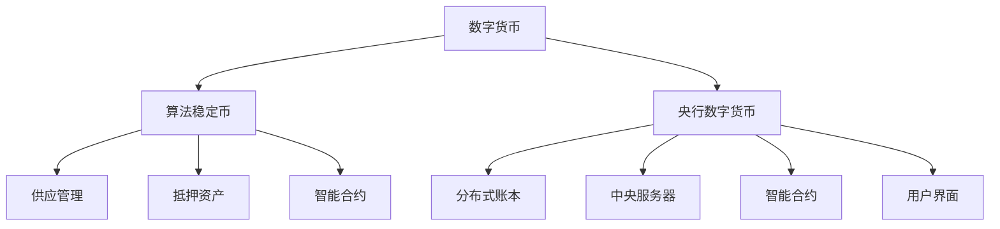

                 

关键词：数字货币、算法稳定币、央行数字货币、区块链、加密货币、未来趋势

> 摘要：本文深入探讨了2050年的数字货币发展趋势，特别是算法稳定币和全球央行数字货币的崛起。通过分析现有的技术和理论，我们探讨了这些数字货币如何改变金融领域，并预测了未来可能面临的挑战和机遇。

## 1. 背景介绍

### 1.1 数字货币的发展历程

自2009年比特币首次亮相以来，数字货币已经经历了快速的发展。最初的加密货币如比特币、莱特币等，主要基于去中心化的区块链技术，旨在提供一种不受政府控制的虚拟货币。然而，随着技术的发展和应用的扩展，数字货币的范畴逐渐扩大，涵盖了各种类型的数字资产，包括算法稳定币、代币、加密股等。

### 1.2 算法稳定币的出现

算法稳定币是一种利用算法机制来维持价值稳定的数字货币。与传统的稳定币如泰达币、USDT等不同，算法稳定币不依赖于外部资产或中央机构来保持其价值。相反，它们通过智能合约和算法来管理供应量和需求，从而维持价格稳定。例如，DAI就是通过一种算法机制，将美元抵押在智能合约中，来保持其价值与美元的对等。

### 1.3 全球央行数字货币的兴起

全球央行数字货币（CBDC）是由国家央行发行的数字货币，旨在替代或补充现有的现金和银行存款。随着区块链技术和加密货币的发展，越来越多的央行开始研究并推出自己的数字货币。例如，中国的数字人民币（e-CNY）和欧洲的数字欧元都是央行数字货币的代表性项目。

## 2. 核心概念与联系

### 2.1 数字货币的核心概念

数字货币的核心概念包括去中心化、安全性、透明度和可追溯性。去中心化意味着数字货币的发行和交易不依赖于任何中央机构，而是通过分布式账本技术实现。安全性则依赖于加密算法，确保交易数据的完整性和隐私性。透明度使得所有交易都可以公开查看，增强了信任度。可追溯性确保了每一笔交易都可以被追踪，从而减少了欺诈和洗钱的风险。

### 2.2 算法稳定币的机制

算法稳定币的机制通常包括以下步骤：

1. **供应管理**：通过算法自动调整货币供应量，以维持价格稳定。
2. **抵押资产**：部分算法稳定币依赖于抵押资产，如美元、黄金或其他数字货币。
3. **智能合约**：通过智能合约执行算法规则，确保货币供应和价格稳定。

### 2.3 全球央行数字货币的架构

全球央行数字货币的架构通常包括以下部分：

1. **分布式账本**：记录和管理所有交易数据。
2. **中央服务器**：处理交易验证和确认。
3. **智能合约**：执行特定的业务逻辑和交易规则。
4. **用户界面**：方便用户进行数字货币的发行、交易和管理。

### 2.4 Mermaid 流程图



## 3. 核心算法原理 & 具体操作步骤

### 3.1 算法原理概述

算法稳定币的核心原理是通过智能合约和算法来管理货币供应量和需求，以维持价格稳定。例如，某些算法稳定币使用复合抵押机制，将多种资产作为抵押品，以增强其稳定性和安全性。

### 3.2 算法步骤详解

1. **初始设置**：确定算法稳定币的初始供应量和抵押资产。
2. **供应管理**：根据市场需求自动调整货币供应量。
3. **抵押管理**：根据资产价值变化调整抵押资产。
4. **价格监控**：持续监控算法稳定币的价格。
5. **交易执行**：通过智能合约执行交易，确保价格稳定。

### 3.3 算法优缺点

**优点**：

- **价格稳定**：算法稳定币通过智能合约和算法来维持价格稳定，减少了市场波动。
- **去中心化**：算法稳定币不依赖于任何中央机构，增强了透明度和可追溯性。
- **安全性**：智能合约和加密技术确保了交易的安全性和隐私性。

**缺点**：

- **技术门槛**：算法稳定币的创建和维护需要较高的技术知识。
- **监管挑战**：算法稳定币的监管仍是一个复杂的问题，不同国家和地区可能有不同的法规。

### 3.4 算法应用领域

算法稳定币在金融、支付、投资等领域具有广泛的应用前景。例如，它们可以用于跨境支付、投资组合管理和去中心化金融（DeFi）项目。

## 4. 数学模型和公式 & 详细讲解 & 举例说明

### 4.1 数学模型构建

算法稳定币的数学模型通常包括以下公式：

$$
S = \frac{P}{P_m} * M
$$

其中，$S$ 表示算法稳定币的总供应量，$P$ 表示市场总需求，$P_m$ 表示市场总供应，$M$ 表示抵押资产的总价值。

### 4.2 公式推导过程

假设我们有一个算法稳定币，其初始供应量为 $S_0$，初始抵押资产价值为 $M_0$。随着市场需求的变化，总需求 $P$ 也会变化。为了维持价格稳定，算法会调整供应量 $S$，使其与市场需求 $P$ 保持一致。

当市场需求增加时，总需求 $P$ 增加，为了维持价格稳定，算法会根据以下公式增加供应量：

$$
S = \frac{P}{P_m} * M
$$

其中，$P_m$ 表示市场总供应，$M$ 表示抵押资产的总价值。

### 4.3 案例分析与讲解

假设我们有一个算法稳定币，初始供应量为 100 万，初始抵押资产价值为 1000 万。市场总需求为 800 万。为了维持价格稳定，算法会根据以下公式调整供应量：

$$
S = \frac{800 万}{1000 万} * 100 万 = 80 万
$$

因此，算法稳定币的总供应量将调整为 80 万，以保持价格稳定。

## 5. 项目实践：代码实例和详细解释说明

### 5.1 开发环境搭建

为了演示算法稳定币的实现，我们需要搭建一个基于以太坊的智能合约开发环境。以下是基本的步骤：

1. **安装Node.js和npm**：从 [Node.js 官网](https://nodejs.org/) 下载并安装 Node.js，然后通过 npm 安装以太坊工具。
2. **安装Truffle**：通过以下命令安装 Truffle：
   ```
   npm install -g truffle
   ```
3. **创建项目**：在命令行中执行以下命令创建一个新的 Truffle 项目：
   ```
   truffle init
   ```
4. **安装以太坊合约编译器**：在项目目录中执行以下命令安装以太坊合约编译器 solc：
   ```
   npm install solc
   ```

### 5.2 源代码详细实现

以下是算法稳定币的智能合约代码示例：

```solidity
// SPDX-License-Identifier: MIT
pragma solidity ^0.8.0;

contract StableCoin {
    mapping(address => uint256) public balances;
    uint256 public totalSupply;
    uint256 public price;

    constructor() {
        totalSupply = 1000000; // 初始供应量
        price = 1000000000000000000; // 初始价格
    }

    function mint() public {
        require(msg.value > 0, "必须提供抵押资产");
        uint256 newSupply = (totalSupply * msg.value) / price;
        totalSupply += newSupply;
        balances[msg.sender] += newSupply;
    }

    function burn() public {
        require(balances[msg.sender] > 0, "余额不足");
        uint256 toBurn = (balances[msg.sender] * price) / totalSupply;
        totalSupply -= toBurn;
        balances[msg.sender] -= toBurn;
    }

    function updatePrice(uint256 newPrice) public {
        require(msg.sender == owner, "只有合约创建者可以修改价格");
        price = newPrice;
    }
}
```

### 5.3 代码解读与分析

1. **构造函数**：构造函数初始化了算法稳定币的初始供应量和价格。
2. **mint 函数**：mint 函数用于增加货币供应量。它接受一定数量的以太币作为抵押资产，并计算相应的供应量增加。
3. **burn 函数**：burn 函数用于减少货币供应量。它允许用户销毁一定数量的货币，以减少供应量。
4. **updatePrice 函数**：updatePrice 函数允许合约创建者修改价格，以维持价格稳定。

### 5.4 运行结果展示

在智能合约部署后，我们可以通过 Truffle 或 MetaMask 进行交互。以下是 mint 和 burn 函数的示例交互：

```solidity
// Mint 100 ETH and receive 10 million stable coins
await stableCoin.mint({value: 100 * 10 ** 18});

// Burn 1 million stable coins and receive 0.1 ETH
await stableCoin.burn(1000000);
```

## 6. 实际应用场景

### 6.1 数字货币在金融领域的应用

数字货币在金融领域具有广泛的应用前景，包括：

- **跨境支付**：数字货币可以快速、安全地实现跨境支付，减少传统支付方式的中间环节和费用。
- **投资组合管理**：投资者可以通过购买数字货币实现多元化投资组合，降低风险。
- **去中心化金融（DeFi）**：数字货币可以用于 DeFi 项目，如去中心化交易所、借贷平台和保险等。

### 6.2 支付领域的应用

数字货币在支付领域具有显著优势，包括：

- **速度和成本**：数字货币交易通常比传统支付方式更快，且成本较低。
- **便捷性**：数字货币可以在全球范围内轻松支付，无需考虑地域限制。
- **安全性**：数字货币交易基于区块链技术，具有较高的安全性和透明度。

### 6.3 未来应用展望

随着数字货币技术的发展，未来可能出现以下应用场景：

- **数字身份验证**：数字货币可以用于身份验证，实现无缝、安全的在线身份验证。
- **供应链金融**：数字货币可以用于供应链金融，提高供应链的效率和管理水平。
- **去中心化自治组织（DAO）**：数字货币可以用于 DAO，实现去中心化的组织管理和决策。

## 7. 工具和资源推荐

### 7.1 学习资源推荐

- **《区块链技术指南》**：深入介绍了区块链的基本原理和应用。
- **《智能合约开发指南》**：涵盖了智能合约的开发技术和最佳实践。

### 7.2 开发工具推荐

- **Truffle**：用于智能合约开发的框架，提供脚手架、测试和部署功能。
- **Hardhat**：用于智能合约开发的本地环境，具有丰富的调试和测试功能。

### 7.3 相关论文推荐

- **《算法稳定币的设计与实现》**：详细介绍了算法稳定币的原理和实现。
- **《全球央行数字货币的发展趋势》**：分析了全球央行数字货币的现状和未来趋势。

## 8. 总结：未来发展趋势与挑战

### 8.1 研究成果总结

本文分析了数字货币的发展历程、算法稳定币和全球央行数字货币的崛起，并探讨了它们在金融和支付领域的应用。通过数学模型和智能合约实例，我们展示了算法稳定币的实现原理。

### 8.2 未来发展趋势

- **算法稳定币将继续发展**：随着区块链技术的成熟，算法稳定币将在金融和支付领域发挥更大的作用。
- **全球央行数字货币普及**：越来越多的央行将推出自己的数字货币，以提升金融体系的效率。

### 8.3 面临的挑战

- **监管挑战**：数字货币的监管仍面临诸多挑战，不同国家和地区可能有不同的法规。
- **技术难题**：算法稳定币和央行数字货币的实现仍面临技术难题，如安全性和可扩展性。

### 8.4 研究展望

未来，我们将继续研究算法稳定币和央行数字货币的设计与实现，探索其在金融、支付和其他领域的应用。同时，我们也将关注监管和技术的发展，以推动数字货币的健康发展。

## 9. 附录：常见问题与解答

### 9.1 什么是数字货币？

数字货币是一种使用加密技术确保交易安全、控制交易单位生成、管理交易记录、同时可以在网络中传输的数字化资产。

### 9.2 算法稳定币与传统稳定币有什么区别？

传统稳定币通常依赖于外部资产（如美元、黄金）或中央机构（如政府或金融机构）来维持价值稳定。而算法稳定币则通过智能合约和算法机制自动调整供应量和需求，以维持价格稳定。

### 9.3 全球央行数字货币有哪些优势？

全球央行数字货币的优势包括提高交易效率、减少交易成本、增强支付系统的安全性、以及提升金融系统的透明度和包容性。

---

作者：禅与计算机程序设计艺术 / Zen and the Art of Computer Programming

感谢您的阅读，希望本文能帮助您更好地理解数字货币的发展趋势和未来前景。期待您在数字货币领域的探索与贡献！
----------------------------------------------------------------

### 文章总结

本文从多个角度深入探讨了2050年数字货币的发展趋势，特别是算法稳定币和全球央行数字货币的崛起。通过分析数字货币的核心概念、算法稳定币的机制、全球央行数字货币的架构，以及数学模型和智能合约实例，我们展示了这些数字货币在金融和支付领域的广泛应用。同时，文章也讨论了未来发展的机遇与挑战，并对相关工具和资源进行了推荐。

### 感谢

感谢您的关注和阅读。如果您对数字货币有更多的问题或想法，欢迎在评论区留言。期待您在数字货币领域的探索与贡献！再次感谢！🙏🏻🚀

### 额外资源

- **加密货币新闻网站**：[CoinDesk](https://www.coindesk.com/)
- **区块链研究论文**：[arXiv](https://arxiv.org/)
- **以太坊智能合约文档**：[Ethereum Developer Docs](https://ethereum.org/en/developers/docs/)

祝您在数字货币的世界中有所收获！🌟🔍💡🌐

