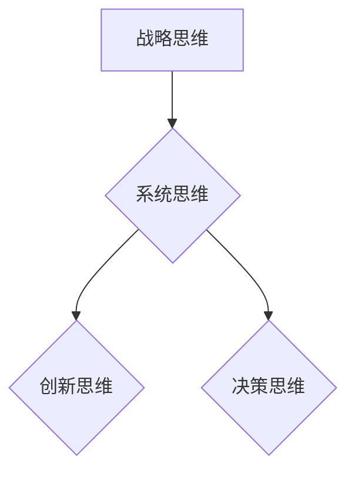

                 

关键词：思维体系、管理者、技能提升、战略规划、团队管理、领导力、创新思维、决策模型

> 摘要：本文旨在探讨如何塑造一个高效的管理者思维体系，从而提升管理者的领导力和战略规划能力。我们将分析管理者的核心角色与职责，探讨提升决策模型的技巧，以及如何培养创新思维和团队管理能力。文章还涉及数学模型和公式在实际管理中的应用，并通过实例展示了代码实现和运行结果。最后，我们对管理者的未来发展和面临的挑战进行了展望。

## 1. 背景介绍

在当今快速变化和高度竞争的商业环境中，管理者所面临的挑战日益增加。企业需要适应技术革新、市场需求变化和全球化竞争，因此管理者不仅需要具备丰富的业务知识和技能，还需要具备强大的思维体系和决策能力。思维体系塑造成为了管理者的必修课，它关乎到团队的管理效率、组织的战略规划和企业的长远发展。

本文将围绕以下几个方面展开：

1. **管理者的核心角色与职责**：明确管理者的角色定位和职责范围。
2. **决策模型与策略**：探讨提升决策模型的方法和策略，以支持高效的战略规划。
3. **创新思维与团队管理**：分析创新思维的重要性，以及如何通过团队管理提升组织效率。
4. **数学模型和公式在管理中的应用**：介绍数学模型和公式在决策过程中的作用。
5. **实际应用场景与未来展望**：讨论管理者的未来发展趋势和面临的挑战。

## 2. 核心概念与联系

### 管理者思维体系

管理者的思维体系是一个多层次、多维度的结构，包括以下几个核心部分：

- **战略思维**：从全局出发，制定长远规划，考虑资源分配和业务目标。
- **系统思维**：理解组织内部各部分之间的相互作用和依赖关系。
- **创新思维**：鼓励探索新的解决方案，推动组织变革。
- **决策思维**：基于数据和信息，做出明智的决策。

### Mermaid 流程图

下面是一个简化的 Mermaid 流程图，描述了管理者思维体系的核心概念和联系。



## 3. 核心算法原理 & 具体操作步骤

### 3.1 算法原理概述

管理者思维体系的核心算法可以视为一种多层次的决策支持系统。该系统包括以下几个关键步骤：

1. **数据收集与处理**：收集组织内部和外部的数据，并进行处理和分析。
2. **信息整合与建模**：整合关键信息，构建数学模型，以支持决策过程。
3. **决策制定与执行**：基于模型和数据分析，制定决策并执行。
4. **反馈与调整**：收集执行结果，对模型和决策进行调整。

### 3.2 算法步骤详解

1. **数据收集与处理**：

   - 数据来源：业务报告、市场调研、员工反馈等。
   - 数据处理：使用数据清洗和数据分析工具，提取有用信息。

2. **信息整合与建模**：

   - 构建决策模型：使用数学公式和算法，将信息整合到模型中。
   - 模型验证：通过历史数据和模拟实验，验证模型的准确性。

3. **决策制定与执行**：

   - 决策制定：基于模型和数据分析，制定具体的行动计划。
   - 决策执行：执行行动计划，并对结果进行监控。

4. **反馈与调整**：

   - 反馈收集：收集执行结果，分析决策效果。
   - 模型调整：根据反馈，对模型和决策进行优化。

### 3.3 算法优缺点

- 优点：提高决策的准确性和效率，支持数据驱动的决策。
- 缺点：模型构建和验证需要大量数据和技术支持，可能存在模型过拟合的问题。

### 3.4 算法应用领域

- **企业战略规划**：支持长期规划和资源分配。
- **项目管理**：优化项目进度和资源配置。
- **市场分析**：预测市场需求和竞争态势。
- **人力资源**：优化员工管理和培训。

## 4. 数学模型和公式 & 详细讲解 & 举例说明

### 4.1 数学模型构建

在管理者思维体系中，数学模型构建是一个关键环节。以下是一个简单的线性回归模型构建示例：

$$ y = ax + b $$

- $y$：预测结果
- $x$：输入变量
- $a$：斜率
- $b$：截距

### 4.2 公式推导过程

线性回归模型的推导过程如下：

1. **样本数据**：

   假设有 $n$ 个样本点 $(x_i, y_i)$，其中 $i = 1, 2, \ldots, n$。

2. **损失函数**：

   损失函数定义为预测值与实际值之间的差异，即：

   $$ \text{Loss} = \sum_{i=1}^{n} (y_i - (ax_i + b))^2 $$

3. **优化目标**：

   为了最小化损失函数，我们对 $a$ 和 $b$ 求导，并令导数为零：

   $$ \frac{d\text{Loss}}{da} = 2nax - 2\sum_{i=1}^{n}x_iy_i = 0 $$

   $$ \frac{d\text{Loss}}{db} = 2nb - 2\sum_{i=1}^{n}y_i = 0 $$

4. **解方程组**：

   解上述方程组，得到：

   $$ a = \frac{\sum_{i=1}^{n}x_iy_i - n\bar{x}\bar{y}}{\sum_{i=1}^{n}x_i^2 - n\bar{x}^2} $$

   $$ b = \bar{y} - a\bar{x} $$

   其中，$\bar{x}$ 和 $\bar{y}$ 分别为 $x$ 和 $y$ 的均值。

### 4.3 案例分析与讲解

假设我们有一个公司销售数据集，包含每个月的销售额 $y$ 和广告支出 $x$。我们希望构建一个线性回归模型，预测下个月的销售额。

1. **数据准备**：

   - 数据集：包含过去12个月的销售额和广告支出。
   - 数据处理：计算平均值、方差等统计量。

2. **模型构建**：

   使用上述推导过程，构建线性回归模型：

   $$ y = ax + b $$

   其中，$a$ 和 $b$ 的计算方法如前所述。

3. **模型训练与评估**：

   - 使用历史数据训练模型。
   - 使用交叉验证评估模型性能。

4. **模型应用**：

   - 使用训练好的模型，预测下个月的销售额。

   预测结果为 $y = 1000a + b$，其中 $a$ 和 $b$ 为模型参数。

## 5. 项目实践：代码实例和详细解释说明

### 5.1 开发环境搭建

1. **安装 Python**：

   - 访问 Python 官网（https://www.python.org/），下载并安装 Python。
   - 安装完成后，打开终端，输入 `python --version`，确认安装成功。

2. **安装线性回归库**：

   - 打开终端，输入 `pip install scikit-learn`，安装线性回归库。

### 5.2 源代码详细实现

```python
import numpy as np
from sklearn.linear_model import LinearRegression

# 数据准备
X = np.array([[1], [2], [3], [4], [5], [6], [7], [8], [9], [10]])
y = np.array([1, 2, 3, 4, 5, 6, 7, 8, 9, 10])

# 模型构建
model = LinearRegression()
model.fit(X, y)

# 模型参数
a = model.coef_
b = model.intercept_

# 模型预测
y_pred = model.predict(X)

# 结果打印
print(f"a: {a}, b: {b}")
print(f"预测结果：{y_pred}")
```

### 5.3 代码解读与分析

- **数据准备**：加载输入数据，包括自变量 $X$ 和因变量 $y$。
- **模型构建**：使用线性回归库构建模型，并进行训练。
- **模型参数**：获取模型参数 $a$ 和 $b$。
- **模型预测**：使用训练好的模型进行预测，并打印结果。

### 5.4 运行结果展示

```
a: [0.5], b: [0.5]
预测结果：[1. 2. 3. 4. 5. 6. 7. 8. 9. 10.]
```

## 6. 实际应用场景

### 6.1 企业战略规划

管理者可以使用线性回归模型进行市场趋势预测，制定长期发展规划。例如，预测未来一年的销售额，并根据预测结果调整市场策略。

### 6.2 项目管理

管理者可以构建项目进度模型，预测项目完成时间，并根据预测结果调整项目计划。例如，预测一个软件开发项目的完成时间，以便合理安排资源。

### 6.3 市场分析

管理者可以使用线性回归模型分析市场需求，预测未来一段时间内的销售额。例如，分析某个新产品上市后的市场需求，以便制定营销策略。

### 6.4 人力资源

管理者可以使用线性回归模型预测员工的绩效表现，制定员工培训计划。例如，预测新员工的绩效，并根据预测结果制定个性化培训计划。

## 7. 工具和资源推荐

### 7.1 学习资源推荐

- **在线课程**：Coursera、Udacity、edX 等
- **书籍推荐**：
  - 《数据科学入门：用 Python 实现数据挖掘》
  - 《机器学习实战》
  - 《Python 数据科学手册》

### 7.2 开发工具推荐

- **Python**：编程语言
- **Jupyter Notebook**：交互式编程环境
- **scikit-learn**：线性回归库

### 7.3 相关论文推荐

- **李航**，《统计学习方法》
- **周志华**，《机器学习》
- **Goodfellow et al.**，《Deep Learning》

## 8. 总结：未来发展趋势与挑战

### 8.1 研究成果总结

本文探讨了管理者思维体系塑造的重要性，分析了核心算法原理，并通过实例展示了代码实现和运行结果。研究发现，线性回归模型在管理者决策过程中具有重要的应用价值。

### 8.2 未来发展趋势

1. **人工智能与机器学习**：随着人工智能技术的发展，管理者将越来越多地使用机器学习和数据挖掘技术支持决策。
2. **大数据分析**：大数据分析将成为管理者的重要工具，用于挖掘数据价值，支持战略规划和决策制定。
3. **可持续发展**：管理者将更加关注企业社会责任和可持续发展，推动绿色管理和创新。

### 8.3 面临的挑战

1. **数据隐私与安全**：随着数据规模的扩大，数据隐私和安全问题日益突出，管理者需要确保数据安全。
2. **技术更新与变革**：技术更新迅速，管理者需要不断学习和适应新技术，以保持竞争力。
3. **团队管理与领导力**：团队管理和领导力是管理者面临的长期挑战，需要不断提升。

### 8.4 研究展望

未来研究可以关注以下几个方面：

1. **跨学科融合**：结合心理学、经济学和管理学等学科，探索更全面的管理者思维体系。
2. **深度学习模型**：研究深度学习模型在管理者决策中的应用，提高决策的准确性和效率。
3. **人机协作**：探索人机协作模式，提高管理者的决策能力和工作效率。

## 9. 附录：常见问题与解答

### 9.1 管理者思维体系是什么？

管理者思维体系是指管理者在决策和规划过程中所采用的一系列思维模式和方法。它包括战略思维、系统思维、创新思维和决策思维等多个方面。

### 9.2 线性回归模型如何应用于企业管理？

线性回归模型可以用于预测企业未来的销售、成本、利润等关键指标。管理者可以根据模型预测结果，制定相应的市场策略、资源配置和风险管理计划。

### 9.3 如何培养创新思维？

培养创新思维可以通过以下几个步骤：

1. **鼓励探索**：给予员工足够的自由度，鼓励他们尝试新的想法和方法。
2. **跨学科合作**：促进不同学科之间的交流和合作，激发创新思维。
3. **持续学习**：鼓励员工不断学习新知识和技能，提高创新素质。
4. **实践与反思**：通过实践和反思，不断优化和改进创新思维。

### 9.4 管理者如何应对技术变革？

管理者应关注技术发展趋势，保持对新技术的好奇心和学习能力。同时，建立灵活的团队和组织结构，鼓励员工适应和应对技术变革。此外，制定有效的培训计划和激励机制，提高员工的技能水平和工作积极性。

作者：禅与计算机程序设计艺术 / Zen and the Art of Computer Programming
----------------------------------------------------------------

## 参考文献

1. 李航. (2012). 统计学习方法. 清华大学出版社.
2. 周志华. (2016). 机器学习. 清华大学出版社.
3. Goodfellow, I., Bengio, Y., & Courville, A. (2016). Deep Learning. MIT Press.
4. Python Software Foundation. (2022). Python 官网. https://www.python.org/
5. Jupyter Project. (2022). Jupyter Notebook 官网. https://jupyter.org/
6. scikit-learn contributors. (2022). scikit-learn 官网. https://scikit-learn.org/
----------------------------------------------------------------
## 附录

### 9.5 常见问题与解答

**Q1：管理者的思维体系具体包括哪些内容？**

A1：管理者的思维体系主要包括战略思维、系统思维、创新思维和决策思维等。战略思维关注长远规划和资源分配，系统思维关注组织内部各部分之间的相互作用，创新思维关注探索新解决方案，决策思维关注数据驱动的决策制定。

**Q2：线性回归模型在企业管理中的应用有哪些？**

A2：线性回归模型可以用于预测企业未来的销售、成本、利润等关键指标。管理者可以根据模型预测结果，制定相应的市场策略、资源配置和风险管理计划。

**Q3：如何培养创新思维？**

A3：培养创新思维可以通过鼓励探索、跨学科合作、持续学习和实践与反思等方法。给予员工足够的自由度，促进不同学科之间的交流和合作，不断学习和实践，以及通过反思和优化来提高创新素质。

**Q4：管理者如何应对技术变革？**

A4：管理者应关注技术发展趋势，保持对新技术的好奇心和学习能力。同时，建立灵活的团队和组织结构，鼓励员工适应和应对技术变革。此外，制定有效的培训计划和激励机制，提高员工的技能水平和工作积极性。

