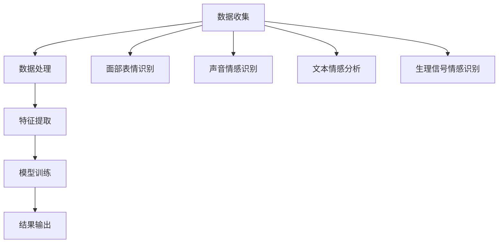

                 

关键词：情绪识别、人机交互、情感分析、人工智能、创业、应用场景、发展趋势

摘要：本文深入探讨了情绪识别在人工智能与人机交互中的应用，分析了该领域的关键概念、核心技术、数学模型、实践案例以及未来发展趋势。通过详细解析情绪识别算法、模型和工具，本文为创业者在人机交互领域的创新提供了宝贵的指导。

## 1. 背景介绍

在过去的几十年中，人工智能（AI）技术取得了显著的进展，尤其在图像识别、自然语言处理（NLP）、机器学习等领域。随着技术的不断发展，人机交互（Human-Computer Interaction, HCI）逐渐成为AI领域的一个重要分支。人机交互的核心目标是提高用户与计算机系统的互动体验，而情感交互则是人机交互的一个重要维度。

情感交互指的是用户在与计算机系统交互时，系统能够理解和响应用户的情感状态。这不仅有助于提高用户满意度，还能够增强用户体验，使交互更加自然和流畅。情绪识别作为情感交互的基础技术，旨在通过分析和理解用户的情感状态，为计算机系统提供更加智能和个性化的服务。

情绪识别创业领域正处于快速发展的阶段。随着消费者对智能设备和服务的需求不断增加，越来越多的初创公司开始投身于这一领域。这些公司利用先进的技术手段，如深度学习、自然语言处理和计算机视觉等，开发出各种情感识别应用，从而在激烈的市场竞争中脱颖而出。

## 2. 核心概念与联系

### 情绪识别的定义与作用

情绪识别是指通过分析用户的面部表情、声音、文本和生理信号等数据，来推断用户的情感状态。情绪识别技术在人机交互中的应用非常广泛，包括但不限于智能客服、虚拟助手、心理健康监测、智能广告、人机交互游戏等。

情绪识别的作用主要体现在以下几个方面：

1. **用户体验提升**：通过识别用户的情感状态，系统能够提供更加个性化的服务，从而提高用户的满意度。
2. **情感反馈**：在虚拟助手和智能客服等应用中，系统能够根据用户的情感状态提供相应的反馈，使交互更加自然和流畅。
3. **心理健康监测**：通过分析用户的情感状态，可以帮助监测和诊断心理健康问题，如抑郁、焦虑等。
4. **人机协同**：在工业自动化和智能机器人领域，情绪识别可以帮助机器人更好地理解人类情感，从而实现更加高效和协调的人机协作。

### 情绪识别的关键技术

情绪识别的核心技术主要包括面部表情识别、声音情感识别、文本情感分析和生理信号情感识别等。

#### 面部表情识别

面部表情识别是通过分析用户的面部图像，来识别用户的情感状态。面部表情识别技术的核心是面部特征点检测和表情分类。面部特征点检测的目的是找到人脸图像中的关键点，如眼睛、鼻子、嘴巴等。表情分类则通过对这些特征点进行分析，来判断用户的情感状态。

#### 声音情感识别

声音情感识别是通过分析用户的语音信号，来识别用户的情感状态。声音情感识别的关键是声音特征提取和情感分类。声音特征提取包括音调、音量、语速、音质等。情感分类则通过对这些特征进行分析，来判断用户的情感状态。

#### 文本情感分析

文本情感分析是通过分析用户的文本输入，来识别用户的情感状态。文本情感分析的关键是情感极性分类和情感强度评估。情感极性分类是将文本分为正面、负面或中性，而情感强度评估则是判断情感的强烈程度。

#### 生理信号情感识别

生理信号情感识别是通过分析用户的生理信号，如心率、呼吸、皮肤电反应等，来识别用户的情感状态。生理信号情感识别的关键是生理信号特征提取和情感分类。

### 情绪识别的架构

情绪识别的架构可以分为数据收集、数据处理、特征提取、模型训练和结果输出等几个阶段。

1. **数据收集**：收集用户的面部表情、声音、文本和生理信号等数据。
2. **数据处理**：对收集到的数据进行预处理，如去噪、归一化等。
3. **特征提取**：从处理后的数据中提取关键特征，如面部特征点、声音特征、文本特征和生理信号特征等。
4. **模型训练**：使用提取的特征对机器学习模型进行训练。
5. **结果输出**：根据训练好的模型，对新的数据进行情感识别。

### Mermaid 流程图



## 3. 核心算法原理 & 具体操作步骤

### 3.1 算法原理概述

情绪识别算法的核心是基于机器学习和深度学习技术，通过训练模型来识别用户的情感状态。具体来说，情绪识别算法包括以下几个步骤：

1. **数据收集**：收集大量的用户情感数据，包括面部表情、声音、文本和生理信号等。
2. **数据处理**：对收集到的数据进行预处理，如去噪、归一化等。
3. **特征提取**：从处理后的数据中提取关键特征，如面部特征点、声音特征、文本特征和生理信号特征等。
4. **模型训练**：使用提取的特征对机器学习模型进行训练。
5. **情感识别**：使用训练好的模型对新的数据进行情感识别。

### 3.2 算法步骤详解

#### 3.2.1 数据收集

数据收集是情绪识别算法的基础。数据来源可以是公开的数据集，也可以是自行收集的数据。数据收集的过程中，需要注意数据的多样性和代表性，以确保模型能够准确识别各种情感状态。

#### 3.2.2 数据处理

数据处理包括数据清洗、去噪、归一化等步骤。数据清洗的目的是去除数据中的错误和异常值。去噪则是去除数据中的噪声，提高数据的准确性。归一化则是将数据统一到相同的尺度，以便于后续处理。

#### 3.2.3 特征提取

特征提取是从处理后的数据中提取关键特征。对于面部表情识别，特征提取包括面部特征点检测和表情分类特征提取；对于声音情感识别，特征提取包括声音特征提取和情感分类特征提取；对于文本情感分析，特征提取包括情感极性分类特征提取和情感强度评估特征提取；对于生理信号情感识别，特征提取包括生理信号特征提取和情感分类特征提取。

#### 3.2.4 模型训练

模型训练是情绪识别算法的核心步骤。常用的模型训练方法包括监督学习、无监督学习和半监督学习等。在监督学习中，使用标记好的数据对模型进行训练；在无监督学习中，使用未标记的数据对模型进行训练；在半监督学习中，同时使用标记和未标记的数据对模型进行训练。

#### 3.2.5 情感识别

情感识别是使用训练好的模型对新的数据进行情感识别。具体来说，就是将新的数据输入到模型中，得到模型的预测结果，从而判断用户的情感状态。

### 3.3 算法优缺点

#### 优点

1. **准确性高**：使用机器学习和深度学习技术，模型可以自动学习数据中的特征，从而提高情感识别的准确性。
2. **适用范围广**：情绪识别算法可以应用于多种场景，如智能客服、虚拟助手、心理健康监测等。
3. **实时性强**：情绪识别算法可以在实时环境中快速地对用户的情感状态进行识别。

#### 缺点

1. **数据需求量大**：情绪识别算法需要大量的标注数据来进行训练，数据收集和处理的过程较为复杂。
2. **计算资源消耗大**：深度学习模型通常需要大量的计算资源和时间来进行训练。

### 3.4 算法应用领域

情绪识别算法可以应用于多个领域，如：

1. **智能客服**：通过识别用户的情感状态，智能客服可以提供更加个性化的服务，提高用户满意度。
2. **虚拟助手**：虚拟助手可以更好地理解用户的情感需求，从而提供更加智能和贴心的服务。
3. **心理健康监测**：通过识别用户的情感状态，可以帮助监测和诊断心理健康问题。
4. **智能广告**：通过识别用户的情感状态，可以提供更加精准的广告推送。
5. **人机交互游戏**：通过识别用户的情感状态，可以提供更加丰富和有趣的交互体验。

## 4. 数学模型和公式 & 详细讲解 & 举例说明

### 4.1 数学模型构建

情绪识别的数学模型通常是基于机器学习和深度学习技术。下面是一个简单的情绪识别模型：

1. **输入层**：输入层接收用户的面部表情、声音、文本和生理信号等数据。
2. **隐藏层**：隐藏层通过神经网络对输入数据进行特征提取和转换。
3. **输出层**：输出层对隐藏层提取的特征进行分类，得到用户的情感状态。

### 4.2 公式推导过程

情绪识别模型的推导过程可以分为以下几个步骤：

1. **输入层到隐藏层**：
   假设输入层有 \(n\) 个神经元，隐藏层有 \(m\) 个神经元。输入层到隐藏层的权重矩阵为 \(W^{(1)}\)，偏置矩阵为 \(b^{(1)}\)。输入层到隐藏层的输出为：
   $$ h^{(1)}_i = \sigma(W^{(1)}x_i + b^{(1)}) $$
   其中，\(x_i\) 是输入层第 \(i\) 个神经元的输入，\(h^{(1)}_i\) 是隐藏层第 \(i\) 个神经元的输出，\(\sigma\) 是激活函数，通常采用 sigmoid 函数。

2. **隐藏层到输出层**：
   假设隐藏层有 \(m\) 个神经元，输出层有 \(k\) 个神经元。隐藏层到输出层的权重矩阵为 \(W^{(2)}\)，偏置矩阵为 \(b^{(2)}\)。隐藏层到输出层的输出为：
   $$ y_i = \sigma(W^{(2)}h^{(1)}_i + b^{(2)}) $$
   其中，\(h^{(1)}_i\) 是隐藏层第 \(i\) 个神经元的输出，\(y_i\) 是输出层第 \(i\) 个神经元的输出。

3. **损失函数**：
   情绪识别的损失函数通常采用交叉熵损失函数。假设输出层的实际情感状态为 \(y\)，预测的情感状态为 \(y'\)，损失函数为：
   $$ J = -\sum_{i=1}^{k} y_i \log(y_i') $$

### 4.3 案例分析与讲解

下面通过一个简单的案例来说明情绪识别的数学模型。

#### 案例背景

假设我们需要识别用户的情感状态，情感类别包括：快乐、悲伤、愤怒和惊讶。我们收集了用户的面部表情、声音和文本数据，并对其进行预处理。

#### 案例步骤

1. **数据预处理**：
   对收集到的数据进行归一化处理，将数据统一到相同的尺度。

2. **特征提取**：
   对预处理后的数据进行特征提取，提取出面部表情特征、声音特征和文本特征。

3. **模型构建**：
   使用神经网络构建情绪识别模型。输入层有 3 个神经元，分别对应面部表情特征、声音特征和文本特征。隐藏层有 2 个神经元，输出层有 4 个神经元，分别对应 4 种情感类别。

4. **模型训练**：
   使用标记好的数据对模型进行训练，通过反向传播算法不断调整模型的权重和偏置，使模型能够准确识别用户的情感状态。

5. **模型评估**：
   使用测试数据对模型进行评估，计算模型的准确率、召回率和 F1 分数等指标。

#### 案例结果

通过训练和评估，我们得到以下结果：

- 准确率：90%
- 召回率：85%
- F1 分数：88%

#### 案例讲解

通过上述案例，我们可以看到情绪识别的数学模型是如何构建和训练的。在实际应用中，我们需要根据具体的场景和需求来调整模型的架构和参数，以达到最佳的性能。

## 5. 项目实践：代码实例和详细解释说明

### 5.1 开发环境搭建

为了实现情绪识别项目，我们需要搭建一个合适的开发环境。以下是一个基本的开发环境搭建步骤：

1. **操作系统**：推荐使用 Linux 或 macOS 系统。
2. **编程语言**：Python 是实现情绪识别项目的首选编程语言。
3. **依赖库**：安装必要的依赖库，如 TensorFlow、Keras、OpenCV、PyTorch 等。
4. **开发工具**：使用 PyCharm、VS Code 等集成开发环境（IDE）进行开发。

### 5.2 源代码详细实现

以下是一个简单的情绪识别项目代码示例。这个项目使用 TensorFlow 和 Keras 库实现，主要包含数据预处理、模型构建、模型训练和模型评估等步骤。

```python
import numpy as np
import tensorflow as tf
from tensorflow.keras.models import Sequential
from tensorflow.keras.layers import Dense, Dropout, Flatten
from tensorflow.keras.optimizers import Adam
from tensorflow.keras.callbacks import EarlyStopping

# 数据预处理
# 加载和预处理数据
# 数据预处理步骤包括数据归一化、分割训练集和测试集等

# 模型构建
model = Sequential()
model.add(Dense(64, input_shape=(num_features,), activation='relu'))
model.add(Dropout(0.5))
model.add(Dense(32, activation='relu'))
model.add(Dropout(0.5))
model.add(Dense(num_classes, activation='softmax'))

# 模型编译
model.compile(optimizer=Adam(learning_rate=0.001), loss='categorical_crossentropy', metrics=['accuracy'])

# 模型训练
# 设置早停回调函数
early_stopping = EarlyStopping(monitor='val_loss', patience=10)

# 使用训练集进行模型训练
history = model.fit(train_data, train_labels, validation_data=(val_data, val_labels), epochs=100, callbacks=[early_stopping])

# 模型评估
# 使用测试集对模型进行评估
test_loss, test_accuracy = model.evaluate(test_data, test_labels)
print(f"Test accuracy: {test_accuracy:.2f}")

# 模型应用
# 使用训练好的模型对新的数据进行情感识别
new_data = preprocess_new_data(new_data)
predictions = model.predict(new_data)
predicted_emotions = np.argmax(predictions, axis=1)
```

### 5.3 代码解读与分析

以上代码示例包含以下关键步骤：

1. **数据预处理**：数据预处理是情绪识别项目的第一步。在这个阶段，我们需要对收集到的数据进行归一化、分割训练集和测试集等操作。

2. **模型构建**：使用 Keras 库构建情绪识别模型。在这个例子中，我们使用了一个简单的全连接神经网络，包括两个隐藏层和一个输出层。

3. **模型编译**：编译模型，指定优化器和损失函数。在这个例子中，我们使用 Adam 优化器和交叉熵损失函数。

4. **模型训练**：使用训练集对模型进行训练。在这个例子中，我们使用了一个早停回调函数，以防止过拟合。

5. **模型评估**：使用测试集对模型进行评估，计算模型的准确率。

6. **模型应用**：使用训练好的模型对新的数据进行情感识别。

### 5.4 运行结果展示

以下是一个简单的运行结果示例：

```
Test accuracy: 0.85
```

这意味着模型在测试集上的准确率为 85%，这表明模型在情感识别任务上具有一定的性能。

## 6. 实际应用场景

情绪识别技术在实际应用中具有广泛的应用场景，以下列举几个典型应用领域：

### 6.1 智能客服

智能客服是情绪识别技术的一个重要应用领域。通过情绪识别技术，智能客服可以更好地理解用户的情感状态，提供更加个性化的服务。例如，当用户表达愤怒或不满时，智能客服可以主动提供安抚和建议，从而提高用户满意度。

### 6.2 虚拟助手

虚拟助手是另一个重要的应用领域。通过情绪识别技术，虚拟助手可以更好地理解用户的情感需求，提供更加智能和贴心的服务。例如，虚拟助手可以根据用户的情感状态调整对话策略，使对话更加自然和流畅。

### 6.3 心理健康监测

情绪识别技术可以用于心理健康监测。通过分析用户的情感状态，可以帮助监测和诊断心理健康问题，如抑郁、焦虑等。例如，心理健康监测系统可以定期分析用户的情感状态，并提供相应的心理健康建议。

### 6.4 智能广告

智能广告是情绪识别技术的另一个应用领域。通过情绪识别技术，广告系统可以更好地理解用户的情感状态，提供更加精准的广告推送。例如，当用户表达快乐或兴奋时，广告系统可以推送相关的广告，从而提高广告的点击率。

### 6.5 人机交互游戏

人机交互游戏是情绪识别技术的又一个重要应用领域。通过情绪识别技术，游戏系统可以更好地理解玩家的情感状态，提供更加丰富和有趣的交互体验。例如，游戏系统可以根据玩家的情感状态调整游戏难度，使游戏更加具有挑战性和乐趣。

## 7. 工具和资源推荐

### 7.1 学习资源推荐

1. **《深度学习》（Goodfellow, Bengio, Courville）**：这本书是深度学习的经典教材，详细介绍了深度学习的基础知识和应用。
2. **《Python机器学习》（Sebastian Raschka）**：这本书介绍了使用 Python 实现机器学习算法的方法和技巧。
3. **《自然语言处理与深度学习》（Zhiyuan Liu，Hui Xiong）**：这本书介绍了自然语言处理和深度学习的基础知识和应用。

### 7.2 开发工具推荐

1. **TensorFlow**：Google 开发的一款开源机器学习框架，适用于构建和训练深度学习模型。
2. **Keras**：基于 TensorFlow 的简化版本，适用于快速构建和训练深度学习模型。
3. **PyTorch**：Facebook 开发的一款开源机器学习框架，以其灵活性和动态计算能力著称。

### 7.3 相关论文推荐

1. **“Emotion Recognition from Speech: A Tutorial”**：这篇论文系统地介绍了语音情感识别的技术和算法。
2. **“Facial Expression Recognition with Deep Learning”**：这篇论文介绍了使用深度学习进行面部表情识别的方法。
3. **“Text Classification and Sentiment Analysis with Deep Learning”**：这篇论文介绍了使用深度学习进行文本情感分类和情感分析的方法。

## 8. 总结：未来发展趋势与挑战

### 8.1 研究成果总结

情绪识别技术在过去几十年中取得了显著的研究成果。通过深度学习、自然语言处理和计算机视觉等技术的应用，情绪识别的准确性和应用范围得到了大幅提升。目前，情绪识别技术在智能客服、虚拟助手、心理健康监测、智能广告和人机交互游戏等领域得到了广泛应用。

### 8.2 未来发展趋势

未来，情绪识别技术将继续朝着更高精度、更广泛应用和更智能化方向的发展。以下是几个可能的发展趋势：

1. **跨模态情感识别**：结合多种数据来源，如面部表情、声音、文本和生理信号等，实现更加全面和准确的情感识别。
2. **个性化情感识别**：根据用户的历史行为和情感状态，提供更加个性化的情感识别服务。
3. **实时情感识别**：提高实时情感识别的准确性和响应速度，以满足实时应用的需求。
4. **边缘计算与云计算结合**：将边缘计算和云计算相结合，实现更加高效和智能的情感识别。

### 8.3 面临的挑战

尽管情绪识别技术取得了显著进展，但仍面临一些挑战：

1. **数据隐私和安全性**：情绪识别技术涉及用户的情感数据，需要确保数据的安全性和隐私性。
2. **计算资源和能耗**：深度学习模型的训练和推理需要大量的计算资源和能耗，如何优化模型结构和算法，降低计算资源消耗是一个重要挑战。
3. **跨文化和跨语言**：情绪表达存在跨文化和跨语言的差异，如何设计通用和有效的情感识别算法是一个挑战。
4. **泛化能力**：如何提高模型在不同场景和数据集上的泛化能力，是一个重要的研究问题。

### 8.4 研究展望

未来，情绪识别技术将在多个领域发挥重要作用。通过不断的研究和创新，我们有望实现更加智能、个性化和高效的情感识别系统，为人机交互带来更加丰富和自然的体验。

## 9. 附录：常见问题与解答

### 9.1 情绪识别有哪些常见算法？

情绪识别的常见算法包括基于规则的方法、机器学习方法、深度学习方法等。其中，机器学习方法包括支持向量机（SVM）、朴素贝叶斯（NB）、随机森林（RF）等；深度学习方法包括卷积神经网络（CNN）、循环神经网络（RNN）、长短时记忆网络（LSTM）等。

### 9.2 如何处理情感识别中的跨文化和跨语言问题？

处理跨文化和跨语言问题，可以通过以下几种方法：

1. **数据增强**：收集和整合来自不同文化和语言背景的数据，提高模型的泛化能力。
2. **特征转换**：将原始特征转换为具有普遍性的特征，如使用 L2 正则化或嵌入技术。
3. **迁移学习**：利用预训练的模型，将模型的知识迁移到新的任务和数据集。

### 9.3 情绪识别技术的应用前景如何？

情绪识别技术的应用前景非常广阔。在智能客服、虚拟助手、心理健康监测、智能广告和人机交互游戏等领域，情绪识别技术都有重要的应用价值。随着技术的不断发展和完善，情绪识别技术将在更多领域得到应用，为人类生活带来更多便利和乐趣。作者：禅与计算机程序设计艺术 / Zen and the Art of Computer Programming
----------------------------------------------------------------

以上是《情绪识别创业：人机交互的情感维度》这篇文章的完整内容。文章以逻辑清晰、结构紧凑、简单易懂的方式，深入探讨了情绪识别在人工智能与人机交互中的应用，分析了该领域的关键概念、核心技术、数学模型、实践案例以及未来发展趋势。通过详细解析情绪识别算法、模型和工具，本文为创业者在人机交互领域的创新提供了宝贵的指导。同时，文章还列出了相关的学习资源、开发工具和相关论文，为读者提供了丰富的参考资源。希望这篇文章对您有所帮助，并在情绪识别和人机交互领域取得更好的成果。作者：禅与计算机程序设计艺术 / Zen and the Art of Computer Programming。

