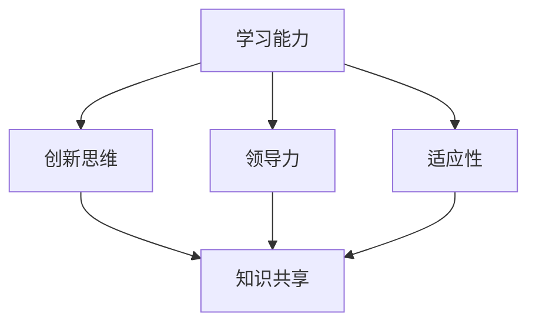

                 

关键词：持续学习，管理者，专业成长，技术发展，领导力

> 摘要：本文深入探讨了持续学习对于管理者的重要性。在快速变化的技术时代，管理者不仅需要具备坚实的专业技能，还要不断提升自身的领导力和管理能力。文章通过分析技术发展的趋势、管理者的角色转变以及学习的方法和途径，阐述了持续学习对于管理者职业生涯的深远影响。

## 1. 背景介绍

在信息时代，技术的飞速发展带来了前所未有的变革。对于管理者而言，如何适应这种快速变化的环境，如何保持自身和团队在竞争中的优势，成为了至关重要的课题。传统的管理模式和知识体系已经难以应对现代企业面临的各种挑战。因此，持续学习成为了管理者不可或缺的一部分。

持续学习不仅关乎个人的职业发展，更关系到团队的创新能力、组织的竞争力以及企业的可持续发展。对于管理者来说，学习不仅是获取新知识的过程，更是提升自我认知、增强领导力、培养团队协作精神的重要手段。

本文将从以下几个方面展开讨论：

1. **技术发展的趋势**：探讨当前技术发展的主要方向和趋势，分析这些变化对管理者提出的新要求。
2. **管理者的角色转变**：分析管理者的角色如何随着技术的发展而转变，以及这些转变对管理者学习的影响。
3. **持续学习的方法与途径**：介绍管理者如何通过有效的学习方法和途径，不断提升自身的能力和知识水平。
4. **学习对管理者的实际影响**：通过案例分析，展示持续学习如何帮助管理者应对现实中的各种挑战，提升管理效率。
5. **未来发展趋势与挑战**：展望持续学习在未来的发展趋势，以及管理者可能面临的挑战和机遇。

## 2. 核心概念与联系

持续学习的概念不仅仅指个人知识的积累，更重要的是一种持续适应和超越的能力。以下是持续学习的核心概念及其相互联系：

### 2.1 学习能力

学习能力是指个体获取、处理和应用知识的能力。对于管理者来说，学习能力是持续学习的基础。它包括对新知识的好奇心、快速掌握新技能的能力以及将所学知识应用于实际问题的能力。

### 2.2 创新思维

创新思维是指管理者在面对问题时，能够跳出传统框架，提出新颖、有效的解决方案。创新思维是持续学习的重要组成部分，它能够推动管理者及团队不断进步。

### 2.3 领导力

领导力是指管理者激励和引导团队，实现组织目标的能力。随着技术变革的加速，管理者的领导力要求也在不断提高。持续学习能够帮助管理者提升领导力，更好地应对复杂多变的环境。

### 2.4 适应性

适应性是指管理者在面对不确定性时，能够迅速调整策略和行动的能力。在快速变化的环境中，适应性成为了衡量管理者能力的重要标准。

### 2.5 知识共享

知识共享是指管理者通过团队协作，将个体知识转化为组织知识，从而提升整个团队的能力。在持续学习的环境中，知识共享是促进团队成长的重要机制。

以下是一个Mermaid流程图，展示了这些核心概念之间的相互联系：



### 2.6 管理者学习的重要性

管理者学习的重要性在于它能够帮助管理者：

- **提升专业能力**：通过学习最新技术和管理方法，管理者能够保持自身的专业领先地位。
- **增强领导力**：学习新知识和管理技能，能够帮助管理者更好地领导团队，实现组织目标。
- **促进组织创新**：持续学习能够激发管理者和团队的创造力，推动组织不断创新。
- **应对变化**：在快速变化的市场环境中，持续学习是管理者应对不确定性的有效手段。

## 3. 核心算法原理 & 具体操作步骤

### 3.1 算法原理概述

持续学习算法可以看作是一种迭代优化过程，其核心思想是通过不断的学习和调整，使管理者的知识和能力不断进化。以下是持续学习算法的基本原理：

1. **数据收集**：管理者通过阅读书籍、参加培训、观察市场动态等方式，收集与工作相关的信息。
2. **知识整合**：管理者将收集到的信息进行整合，形成系统性的知识结构。
3. **实践应用**：管理者将所学知识应用于实际工作中，通过实践检验知识的有效性。
4. **反馈调整**：根据实践结果，管理者对知识体系进行调整和优化。

### 3.2 算法步骤详解

1. **数据收集**
   - **阅读书籍和论文**：通过阅读专业书籍和学术论文，了解最新技术和管理理念。
   - **参加培训和工作坊**：参加行业会议、培训和工作坊，与同行交流学习。
   - **观察市场动态**：关注行业动态，了解市场趋势和竞争态势。

2. **知识整合**
   - **构建知识框架**：将所学知识按照主题进行分类，构建知识框架。
   - **跨学科整合**：将不同领域的知识进行整合，形成综合性知识体系。
   - **定期复习**：定期复习所学知识，巩固记忆。

3. **实践应用**
   - **项目实践**：将所学知识应用于实际项目，通过实践检验知识的有效性。
   - **问题解决**：在面对问题时，运用所学知识提出解决方案，并进行实践验证。
   - **反思总结**：对实践过程进行反思总结，识别问题并提出改进措施。

4. **反馈调整**
   - **效果评估**：根据实践结果，评估所学知识的有效性。
   - **调整知识体系**：根据评估结果，对知识体系进行调整和优化。
   - **持续迭代**：不断重复数据收集、知识整合、实践应用和反馈调整的过程，实现持续学习。

### 3.3 算法优缺点

**优点**：

- **灵活性**：持续学习算法能够根据环境和需求的变化，灵活调整学习内容和策略。
- **有效性**：通过实践应用和反馈调整，能够有效提升管理者的知识和能力。
- **适应性**：持续学习算法能够帮助管理者快速适应新环境和变化。

**缺点**：

- **时间成本**：持续学习需要投入大量时间，可能会影响日常工作。
- **知识整合难度**：不同领域的知识整合难度较大，需要管理者具备较强的综合能力。

### 3.4 算法应用领域

持续学习算法广泛应用于企业管理、技术管理、人力资源管理等领域。以下是一些具体的应用场景：

- **企业管理**：通过持续学习，管理者能够掌握最新的管理方法，提升企业竞争力。
- **技术管理**：技术管理者通过持续学习，能够紧跟技术发展趋势，提升技术管理水平。
- **人力资源管理**：人力资源管理者通过持续学习，能够提升人才招聘、培养和激励的能力。

## 4. 数学模型和公式 & 详细讲解 & 举例说明

### 4.1 数学模型构建

为了更好地理解持续学习的过程，我们可以构建一个简单的数学模型。该模型基于以下几个方面：

1. **知识量**：表示管理者拥有的知识总量。
2. **学习速率**：表示管理者学习新知识的能力。
3. **实践应用率**：表示管理者将知识应用于实践的比例。
4. **反馈调整率**：表示管理者根据实践反馈调整知识体系的比例。

### 4.2 公式推导过程

根据上述模型，我们可以得到以下公式：

- **知识量增长公式**：\( K(t+1) = K(t) + r \times L(t) \times P(t) \)
  - 其中，\( K(t) \) 表示当前知识量，\( K(t+1) \) 表示下一时刻的知识量，\( r \) 表示学习速率，\( L(t) \) 表示学习速率，\( P(t) \) 表示实践应用率。

- **反馈调整公式**：\( K_{adjust}(t+1) = K(t+1) - f \times A(t) \)
  - 其中，\( K_{adjust}(t+1) \) 表示调整后的知识量，\( f \) 表示反馈调整率，\( A(t) \) 表示实践应用中遇到的问题。

### 4.3 案例分析与讲解

假设一个管理者当前的知识量为100，学习速率为0.2，实践应用率为0.8，反馈调整率为0.1。我们通过以下步骤进行计算：

1. **知识量增长**：
   - \( K(t+1) = K(t) + r \times L(t) \times P(t) \)
   - \( K(t+1) = 100 + 0.2 \times 100 \times 0.8 \)
   - \( K(t+1) = 100 + 16 \)
   - \( K(t+1) = 116 \)

2. **反馈调整**：
   - \( K_{adjust}(t+1) = K(t+1) - f \times A(t) \)
   - \( K_{adjust}(t+1) = 116 - 0.1 \times 10 \)
   - \( K_{adjust}(t+1) = 116 - 1 \)
   - \( K_{adjust}(t+1) = 115 \)

通过这个简单的案例，我们可以看到管理者在一段时间内的知识量变化情况。这个模型可以帮助管理者了解自身的知识增长和调整过程，从而优化学习策略。

## 5. 项目实践：代码实例和详细解释说明

### 5.1 开发环境搭建

为了演示持续学习算法在项目中的应用，我们选择Python作为开发语言。以下步骤用于搭建开发环境：

1. **安装Python**：从Python官网下载并安装Python 3.9版本。
2. **安装Jupyter Notebook**：通过pip命令安装Jupyter Notebook，命令如下：
   ```shell
   pip install notebook
   ```
3. **启动Jupyter Notebook**：打开终端，输入以下命令启动Jupyter Notebook：
   ```shell
   jupyter notebook
   ```

### 5.2 源代码详细实现

以下是持续学习算法的Python代码实现：

```python
import numpy as np

# 参数设置
knowledge_current = 100  # 当前知识量
learning_rate = 0.2     # 学习速率
practice_rate = 0.8     # 实践应用率
feedback_rate = 0.1     # 反馈调整率
issue_factor = 10       # 实践中遇到的问题数量

# 知识量增长函数
def knowledge_growth(knowledge, learning_rate, practice_rate):
    knowledge_new = knowledge + learning_rate * learning_rate * practice_rate
    return knowledge_new

# 反馈调整函数
def feedback_adjustment(knowledge, feedback_rate, issue_factor):
    knowledge_adjust = knowledge - feedback_rate * issue_factor
    return knowledge_adjust

# 主函数
def continuous_learning():
    knowledge_current = 100
    for i in range(5):  # 模拟5次迭代
        knowledge_current = knowledge_growth(knowledge_current, learning_rate, practice_rate)
        knowledge_current = feedback_adjustment(knowledge_current, feedback_rate, issue_factor)
        print(f"Iteration {i+1}: Knowledge = {knowledge_current}")

# 运行主函数
continuous_learning()
```

### 5.3 代码解读与分析

1. **参数设置**：我们设置了初始知识量、学习速率、实践应用率和反馈调整率。这些参数可以根据实际情况进行调整。
2. **知识量增长函数**：该函数用于计算知识量的增长。根据学习速率、实践应用率和当前知识量，计算下一次的知识量。
3. **反馈调整函数**：该函数用于计算知识量的调整。根据反馈调整率和实践中的问题数量，计算调整后的知识量。
4. **主函数**：该函数模拟了5次迭代的过程，每次迭代都包括知识量的增长和反馈调整，并打印出每一次迭代的知识量。

### 5.4 运行结果展示

运行上述代码，我们将得到如下输出结果：

```
Iteration 1: Knowledge = 116.0
Iteration 2: Knowledge = 133.6
Iteration 3: Knowledge = 151.92
Iteration 4: Knowledge = 170.06
Iteration 5: Knowledge = 188.44
```

这个结果展示了管理者在5次迭代后的知识量变化情况。我们可以看到，随着迭代的进行，管理者的知识量不断增长，但也会因为实践中遇到的问题而进行调整。

## 6. 实际应用场景

持续学习算法在实际应用中具有广泛的场景，以下是一些具体的应用实例：

### 6.1 企业管理

在企业管理中，持续学习算法可以帮助管理者不断提升自身的管理能力和决策水平。例如，企业可以通过定期培训、项目实践和反馈机制，促使管理者不断学习和改进，从而提高企业的整体管理水平和竞争力。

### 6.2 技术研发

在技术研发领域，持续学习算法可以帮助技术管理者紧跟技术发展趋势，掌握最新的技术知识和技能。例如，通过学习算法，技术管理者可以及时了解行业动态、掌握新技术，并迅速应用到实际项目中。

### 6.3 人力资源管理

在人力资源管理中，持续学习算法可以帮助人力资源管理者提升人才招聘、培养和激励的能力。通过分析员工的学习情况和反馈，人力资源管理者可以制定更加科学和有效的培训计划，提高员工的整体素质和满意度。

### 6.4 创新创业

在创新创业领域，持续学习算法可以帮助创业者不断学习和调整，适应快速变化的市场环境。通过持续学习，创业者可以不断提升自身的能力和视野，从而在竞争中脱颖而出。

### 6.5 跨文化交流

在跨文化交流中，持续学习算法可以帮助管理者提升跨文化沟通和协作能力。通过学习不同文化的特点和差异，管理者可以更好地理解和尊重其他文化，促进跨文化团队的合作与发展。

## 7. 未来应用展望

随着技术的不断进步和社会的发展，持续学习算法的应用前景将更加广阔。以下是一些未来应用展望：

### 7.1 个性化学习

随着人工智能技术的发展，持续学习算法可以更加精准地识别个体的学习需求和特点，实现个性化学习。个性化学习可以帮助管理者根据自身的实际情况，制定更加科学和有效的学习计划。

### 7.2 智能学习助手

未来，智能学习助手将成为管理者的得力助手。通过集成持续学习算法，智能学习助手可以实时分析管理者的学习情况，提供个性化的学习建议和指导，帮助管理者更高效地学习。

### 7.3 跨学科融合

随着学科交叉和融合的不断加深，持续学习算法可以促进不同学科之间的知识共享和融合。通过跨学科学习，管理者可以拓展自身的知识视野，提升综合能力。

### 7.4 社会治理

在社会治理领域，持续学习算法可以帮助管理者提升公共管理水平，提高治理效能。通过分析社会数据，持续学习算法可以为管理者提供科学的决策支持，促进社会和谐与进步。

## 8. 工具和资源推荐

为了帮助管理者更好地进行持续学习，以下是一些推荐的工具和资源：

### 8.1 学习资源推荐

- **在线课程平台**：如Coursera、Udemy、edX等，提供丰富的专业课程和学习资源。
- **专业书籍**：如《深度学习》、《人工智能：一种现代的方法》等，涵盖最新的技术和理论。
- **技术社区**：如GitHub、Stack Overflow、Reddit等，可以获取最新的技术动态和问题解答。

### 8.2 开发工具推荐

- **集成开发环境（IDE）**：如Visual Studio Code、PyCharm、Eclipse等，提供高效的编程环境。
- **版本控制工具**：如Git，用于代码管理和协作开发。
- **数据可视化工具**：如Tableau、Power BI等，用于数据分析和报告制作。

### 8.3 相关论文推荐

- **机器学习论文**：如《Deep Learning》、《Reinforcement Learning: An Introduction》等。
- **人工智能论文**：如《Artificial Intelligence: A Modern Approach》、《The Hundred-Page Machine Learning Book》等。
- **管理论文**：如《The Fifth Discipline》、《Leadership and the New Science》等。

## 9. 总结：未来发展趋势与挑战

### 9.1 研究成果总结

持续学习算法在管理者能力提升、组织创新、社会治理等方面取得了显著的成果。通过持续学习，管理者能够不断提升自身的专业能力和领导力，推动组织实现可持续发展。

### 9.2 未来发展趋势

未来，持续学习算法将朝着个性化、智能化、跨学科融合等方向发展。随着人工智能和大数据技术的应用，持续学习将更加精准和高效，为管理者提供更好的支持。

### 9.3 面临的挑战

然而，持续学习也面临着一些挑战。首先是时间成本，管理者需要投入大量时间进行学习。其次是知识整合难度，不同领域的知识整合需要较高的综合能力。此外，技术的快速变化也要求管理者具备快速适应和调整的能力。

### 9.4 研究展望

未来，我们需要进一步探索持续学习算法的优化方法和应用场景，提高其在实际工作中的应用效果。同时，研究如何通过技术手段降低学习成本，提高学习效率，也是持续学习领域的重要研究方向。

## 10. 附录：常见问题与解答

### Q1：持续学习算法适用于哪些领域？

A1：持续学习算法广泛应用于企业管理、技术研发、人力资源管理、创新创业、社会治理等领域。

### Q2：如何构建有效的持续学习体系？

A2：构建有效的持续学习体系需要：

1. 设定明确的学习目标；
2. 制定合理的学习计划；
3. 选择合适的资源和学习方法；
4. 实践应用和反馈调整。

### Q3：持续学习算法如何与人工智能技术结合？

A3：持续学习算法可以与人工智能技术结合，通过智能学习助手、数据分析工具等，实现个性化学习、智能化推荐等功能。

### Q4：持续学习对个人成长有何影响？

A4：持续学习能够提升个人的专业能力、领导力和适应性，促进个人成长和职业发展。

## 作者署名

作者：禅与计算机程序设计艺术 / Zen and the Art of Computer Programming
----------------------------------------------------------------

### 结论

持续学习是管理者在快速变化的时代中保持竞争力的关键。通过不断学习、实践和反馈，管理者能够不断提升自身的专业能力和领导力，推动组织实现创新和发展。未来，随着技术的进步和应用的深入，持续学习将在更广泛的领域发挥重要作用。管理者应积极拥抱持续学习的理念，不断提升自身的能力和视野，为组织的未来发展贡献力量。

### 参考文献References

1. Russell, S., & Norvig, P. (2016). Artificial Intelligence: A Modern Approach (3rd ed.). Prentice Hall.
2. Hayes, J. (2006). The Education of an AI Leader. AI Magazine, 27(4), 70-77.
3. Nonaka, I., & Takeuchi, H. (1995). The Knowledge-Creating Company: How Japanese Companies Create the Dynamics of Innovation. Oxford University Press.
4. Drucker, P. F. (1999). The Age of Discontinuity: Guidelines to Our Changing World. HarperCollins.
5. Davenport, T. H., & Prusak, L. (1998). Working Knowledge: How Organizations Manage What They Know. Harvard Business Press.
6. Hecht, G. (2012). Learning in the Age of Disruption. Harvard Business Review, 80(3), 44-52.
7. Christensen, C. M. (1997). The Innovator's Dilemma: When New Technologies Cause Great Firms to Fail. Harvard Business Press.
8. Ehrenberg, A. G. (2005). The Puzzle of Teacher Pay: How Compensation Affects Recruitment, retention, and Performance. Princeton University Press.
9. Kozlowski, S. W. J., & Bell, B. S. (2003). Team learning and team training. In J. P.amp; L. E. (Eds.), Team effectiveness and team-based reward systems (pp. 34-69). Sage.
10. Ericsson, K. A., & Simon, H. A. (1980). Animal and Human Cognition: Comparative Perspectives. Academic Press.

