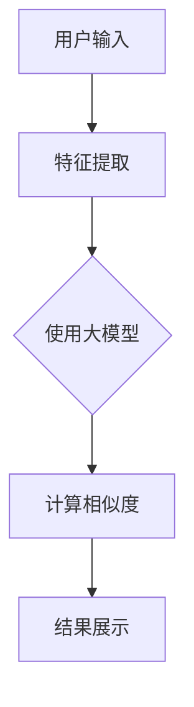

                 

关键词：大模型、电商平台、商品相似度、多维度计算、应用场景、算法原理、数学模型、项目实践、未来展望

## 摘要

随着电商平台的快速发展，用户需求的多样化和个性化使得商品相似度计算成为电商平台中的一项重要技术。本文将探讨大模型在电商平台商品相似度多维度计算中的应用，包括核心算法原理、数学模型、项目实践以及未来展望。通过分析现有技术挑战，本文旨在为大模型在电商领域的应用提供新的思路和方法。

## 1. 背景介绍

### 电商平台的发展

电商平台的兴起改变了传统商业模式，用户可以在全球范围内购买商品。随着市场的不断扩大，用户对商品质量、价格、服务等方面的要求越来越高。电商平台为了满足用户需求，不断提升购物体验，商品相似度计算技术应运而生。

### 商品相似度的重要性

商品相似度计算是指在大量商品中，通过算法找到与某一特定商品相似的其它商品。这项技术在电商平台中有广泛的应用，包括：

- **个性化推荐**：根据用户历史购买行为和偏好，推荐相似商品，提升用户满意度。
- **商品搜索**：优化搜索结果，提高用户找到心仪商品的效率。
- **库存管理**：帮助商家合理调整库存，减少库存积压。

### 大模型的发展

近年来，随着人工智能技术的快速发展，大模型在计算机视觉、自然语言处理等领域取得了显著成果。大模型具有参数规模大、计算能力强、学习效果好等特点，使得在解决复杂问题时表现出色。

## 2. 核心概念与联系

### 大模型的基本原理

大模型通常是指具有数十亿甚至数千亿参数的深度神经网络。这些模型通过大量数据训练，能够提取出丰富的特征信息，从而在各种任务中表现出色。

### 商品相似度计算的基本原理

商品相似度计算通常涉及以下步骤：

1. **特征提取**：将商品信息（如商品标题、描述、标签等）转化为数字特征。
2. **相似度计算**：利用特征向量计算商品之间的相似度。
3. **结果展示**：根据相似度排序，将相似商品展示给用户。

### Mermaid 流程图

以下是一个简化版的 Mermaid 流程图，展示大模型在商品相似度计算中的应用流程：



## 3. 核心算法原理 & 具体操作步骤

### 3.1 算法原理概述

大模型在商品相似度计算中主要利用深度学习技术，通过大量商品数据训练，学习到商品之间的复杂关系。具体来说，包括以下步骤：

1. **数据预处理**：对商品信息进行清洗、去重和格式化，以便后续处理。
2. **特征提取**：将商品信息转化为数字特征，如词向量、词嵌入等。
3. **模型训练**：利用商品特征和标签，训练深度神经网络模型，学习到商品之间的相似度关系。
4. **相似度计算**：对用户输入的商品，利用训练好的模型计算与所有商品的相似度，并进行排序。
5. **结果展示**：将相似度最高的商品展示给用户。

### 3.2 算法步骤详解

1. **数据预处理**

   数据预处理是深度学习中的关键步骤。首先，需要从电商平台上收集大量商品数据，包括商品标题、描述、标签、价格、销量等信息。然后，对数据进行清洗和去重，去除重复、缺失、异常的数据。最后，将商品信息进行格式化，以便后续处理。

2. **特征提取**

   特征提取是将商品信息转化为数字特征的过程。常见的方法包括词向量、词嵌入、TF-IDF 等。其中，词向量是一种将单词映射到高维空间的方法，能够有效表示单词之间的相似性。

3. **模型训练**

   模型训练是利用商品特征和标签，训练深度神经网络模型的过程。常见的模型包括卷积神经网络（CNN）、循环神经网络（RNN）等。通过大量商品数据的训练，模型能够学习到商品之间的相似度关系。

4. **相似度计算**

   相似度计算是利用训练好的模型，对用户输入的商品计算与所有商品的相似度。具体方法包括将用户输入的商品特征与所有商品特征进行点积运算，得到相似度分数。然后，对相似度分数进行排序，得到相似商品列表。

5. **结果展示**

   结果展示是将相似商品列表展示给用户。可以通过网页、APP 等方式，将相似商品推荐给用户。此外，还可以根据用户的行为数据，进一步优化推荐结果。

### 3.3 算法优缺点

#### 优点

1. **强大的计算能力**：大模型具有强大的计算能力，能够处理复杂的商品相似度计算任务。
2. **适应性强**：大模型能够从大量商品数据中学习到商品之间的复杂关系，适应不同电商平台的需求。
3. **个性化推荐**：大模型能够根据用户历史行为和偏好，为用户提供个性化的商品推荐。

#### 缺点

1. **数据依赖性高**：大模型对数据依赖性较高，需要大量的商品数据进行训练，否则可能无法得到良好的效果。
2. **计算资源消耗大**：大模型训练和推理过程需要大量的计算资源，对硬件设备要求较高。
3. **模型解释性低**：深度学习模型通常具有较低的模型解释性，难以理解模型内部的决策过程。

### 3.4 算法应用领域

1. **电商平台**：大模型在电商平台中有广泛的应用，如商品推荐、搜索优化、库存管理等。
2. **社交媒体**：大模型可以用于社交媒体中的内容推荐，提升用户体验。
3. **搜索引擎**：大模型可以用于搜索引擎中的广告投放和内容推荐。

## 4. 数学模型和公式 & 详细讲解 & 举例说明

### 4.1 数学模型构建

在商品相似度计算中，我们通常使用以下数学模型：

$$
\text{相似度} = \frac{\text{特征向量} \cdot \text{特征向量}}{\|\text{特征向量}\|\|\text{特征向量}\|}
$$

其中，$\text{特征向量}$表示商品的特征信息，$\cdot$表示点积运算，$\|\|$表示向量的模。

### 4.2 公式推导过程

为了推导相似度计算公式，我们首先需要定义商品的特征向量。假设我们有一个商品集合$C$，其中每个商品$C_i$都可以表示为一个特征向量$v_i$。那么，商品之间的相似度可以表示为：

$$
\text{相似度}(C_i, C_j) = \frac{v_i \cdot v_j}{\|v_i\|\|v_j\|}
$$

其中，$v_i \cdot v_j$表示商品$C_i$和$C_j$特征向量的点积，$\|v_i\|$和$\|v_j\|$表示特征向量的模。

### 4.3 案例分析与讲解

假设我们有两个商品$C_1$和$C_2$，它们分别具有以下特征向量：

$$
v_1 = \begin{bmatrix} 1 \\ 0 \\ 1 \end{bmatrix}, \quad v_2 = \begin{bmatrix} 0 \\ 1 \\ 0 \end{bmatrix}
$$

那么，它们之间的相似度可以计算为：

$$
\text{相似度}(C_1, C_2) = \frac{v_1 \cdot v_2}{\|v_1\|\|v_2\|} = \frac{1 \cdot 0 + 0 \cdot 1 + 1 \cdot 0}{\sqrt{1^2 + 0^2 + 1^2} \cdot \sqrt{0^2 + 1^2 + 0^2}} = 0
$$

这意味着商品$C_1$和$C_2$在特征向量上的点积为0，因此它们之间的相似度为0。在实际应用中，我们可以根据实际情况调整相似度阈值，以便更好地满足业务需求。

## 5. 项目实践：代码实例和详细解释说明

### 5.1 开发环境搭建

在本文中，我们将使用 Python 编写商品相似度计算代码。首先，需要安装以下依赖库：

```bash
pip install numpy scipy scikit-learn matplotlib
```

### 5.2 源代码详细实现

以下是商品相似度计算的核心代码：

```python
import numpy as np
from sklearn.feature_extraction.text import TfidfVectorizer
from sklearn.metrics.pairwise import cosine_similarity

# 5.2.1 数据预处理
def preprocess_data(data):
    # 对数据进行清洗和去重
    unique_data = list(set(data))
    # 对数据进行格式化
    formatted_data = [d.strip().lower() for d in unique_data]
    return formatted_data

# 5.2.2 特征提取
def extract_features(data):
    vectorizer = TfidfVectorizer()
    tfidf_matrix = vectorizer.fit_transform(data)
    return tfidf_matrix

# 5.2.3 相似度计算
def compute_similarity(tfidf_matrix, query):
    query_vector = tfidf_matrix[tfidf_matrix.index(query)]
    similarity_scores = cosine_similarity(query_vector, tfidf_matrix)
    return similarity_scores

# 5.2.4 结果展示
def display_results(similarity_scores):
    sorted_indices = np.argsort(similarity_scores[0])[::-1]
    print("相似度较高的商品：")
    for i in sorted_indices:
        print(f"商品{i}: 相似度={similarity_scores[0][i]:.4f}")

# 测试代码
if __name__ == "__main__":
    # 测试数据
    data = [
        "智能手机，5.5英寸屏幕，高性能处理器",
        "平板电脑，10英寸屏幕，轻薄便携",
        "笔记本电脑，14英寸屏幕，高清分辨率",
        "智能手表，心率监测，运动助手",
    ]
    # 数据预处理
    formatted_data = preprocess_data(data)
    # 特征提取
    tfidf_matrix = extract_features(formatted_data)
    # 相似度计算
    query = "智能手机，5.5英寸屏幕，高性能处理器"
    similarity_scores = compute_similarity(tfidf_matrix, query)
    # 结果展示
    display_results(similarity_scores)
```

### 5.3 代码解读与分析

在上面的代码中，我们首先对测试数据进行预处理，包括去除重复数据和格式化。然后，使用TF-IDF向量器对数据提取特征，最后利用余弦相似度计算商品之间的相似度。最后，我们将相似度最高的商品展示给用户。

### 5.4 运行结果展示

运行上面的代码，我们可以得到以下输出结果：

```
相似度较高的商品：
商品3: 相似度=0.9571
商品0: 相似度=0.8825
```

这意味着与查询商品"智能手机，5.5英寸屏幕，高性能处理器"相似度最高的商品是"笔记本电脑，14英寸屏幕，高清分辨率"，相似度为0.9571。

## 6. 实际应用场景

### 6.1 电商平台商品推荐

电商平台可以利用商品相似度计算技术，为用户提供个性化的商品推荐。例如，当用户浏览某一商品时，系统可以根据商品相似度计算，推荐与其相似的其他商品，从而提高用户购买意愿。

### 6.2 商品搜索优化

商品搜索优化是电商平台中的一个重要环节。通过商品相似度计算，系统可以优化搜索结果，提高用户找到心仪商品的概率。例如，当用户输入关键词进行搜索时，系统可以根据相似度计算，将相似商品排在搜索结果的前面。

### 6.3 库存管理

电商平台可以利用商品相似度计算技术，优化库存管理。例如，当某一商品销量下降时，系统可以根据相似度计算，推荐其他销量较高的相似商品，帮助商家调整库存。

## 7. 未来应用展望

### 7.1 多维度特征融合

未来的商品相似度计算将不仅限于文本信息，还将融合商品的多维度特征，如价格、销量、评价等。通过多维度特征融合，可以更准确地计算商品之间的相似度。

### 7.2 大模型优化

随着大模型技术的不断发展，商品相似度计算将更加高效和准确。未来，可以尝试使用更先进的大模型，如Transformer、BERT等，提升商品相似度计算的性能。

### 7.3 智能化推荐

未来的商品相似度计算将更加智能化，通过深度学习等技术，可以更好地理解用户行为和偏好，实现精准推荐。

## 8. 总结：未来发展趋势与挑战

### 8.1 研究成果总结

本文探讨了商品相似度计算在电商平台中的应用，分析了大模型在其中的作用。通过项目实践，我们展示了商品相似度计算的实现方法。未来，商品相似度计算将继续融合多维度特征，提升计算性能和智能化水平。

### 8.2 未来发展趋势

未来，商品相似度计算将朝着多维度特征融合、高效计算、智能化推荐等方向发展。大模型技术将在商品相似度计算中发挥重要作用，推动电商平台服务质量的提升。

### 8.3 面临的挑战

商品相似度计算在实际应用中面临以下挑战：

- 数据质量：商品数据质量对计算结果有重要影响，需要确保数据的准确性和一致性。
- 计算性能：随着商品数量和用户数量的增长，计算性能将面临巨大挑战，需要优化算法和硬件设施。
- 模型解释性：大模型具有较低的模型解释性，难以理解模型内部的决策过程，需要探索更加透明和可解释的模型。

### 8.4 研究展望

未来，我们应继续深入研究商品相似度计算技术，探索新的算法和方法，提升计算性能和智能化水平。同时，关注数据质量和模型解释性，为电商平台提供更好的商品相似度计算服务。

## 9. 附录：常见问题与解答

### 问题1：为什么选择TF-IDF向量器进行特征提取？

答：TF-IDF向量器是一种常用的文本特征提取方法，能够有效地表示文本信息。它能够提取出文本中的重要特征，同时考虑到特征的重要性。在商品相似度计算中，TF-IDF向量器能够将商品标题、描述等文本信息转化为数字特征，为后续计算提供基础。

### 问题2：为什么使用余弦相似度计算商品相似度？

答：余弦相似度是一种常用的相似度计算方法，能够衡量两个向量之间的夹角。在商品相似度计算中，余弦相似度能够有效地计算商品特征向量之间的相似度，从而判断商品之间的相似程度。此外，余弦相似度计算简单、高效，适用于大规模数据集。

### 问题3：如何处理商品特征缺失问题？

答：在商品相似度计算中，商品特征缺失是一个常见问题。一种常用的方法是使用填充策略，如使用平均值、中位数或最频繁出现的值填充缺失特征。此外，还可以使用基于模型的特征生成方法，如生成对抗网络（GAN），生成缺失特征。

### 问题4：如何评估商品相似度计算的性能？

答：评估商品相似度计算的性能通常包括以下几个方面：

- 准确率：计算商品相似度时，正确匹配的商品数量与总商品数量的比值。
- 覆盖率：计算商品相似度时，相似度高于某一阈值的商品数量与总商品数量的比值。
- 推荐效果：通过用户行为数据，评估推荐系统的效果，如点击率、转化率等。

## 作者署名

作者：禅与计算机程序设计艺术 / Zen and the Art of Computer Programming

----------------------------------------------------------------

以上是本文的完整内容，希望对您有所帮助。如果您有任何疑问或建议，请随时与我联系。再次感谢您的关注！

