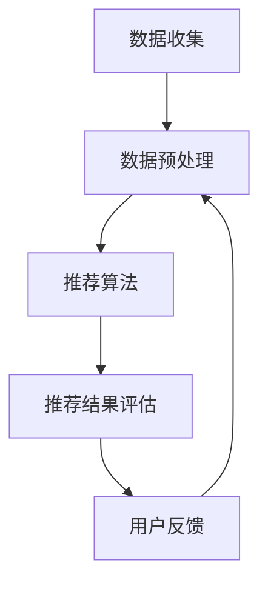

                 

关键词：推荐系统、公平性、偏见消除、算法伦理、机器学习、数据处理

> 摘要：本文将探讨推荐系统中的公平性问题及其对用户的影响，分析算法偏见产生的根源，并提出一系列技术手段和解决方案以消除偏见，确保推荐系统的公正性和透明性。

## 1. 背景介绍

推荐系统作为人工智能领域的重要组成部分，已经深入影响了人们的日常生活。从电商平台、社交媒体到音乐和视频流媒体服务，推荐系统无处不在。然而，推荐系统的公平性却日益成为关注的焦点。算法偏见的存在可能导致系统对特定群体或个人产生不公平的推荐结果，从而影响用户的使用体验、决策以及社会公平。

### 1.1 推荐系统的作用与现状

推荐系统通过收集和分析用户的历史行为数据，利用机器学习算法预测用户可能感兴趣的内容，进而提供个性化的推荐。其目的是提高用户满意度、增加用户黏性和提升业务收益。目前，推荐系统已广泛应用于电子商务、社交媒体、内容分发等多个领域，取得了显著的成效。

### 1.2 公平性的重要性

推荐系统的公平性直接关系到用户的利益和社会的公平。算法偏见可能导致以下负面影响：

- **歧视性推荐**：对特定群体进行不公平的推荐，例如性别、年龄、种族等。
- **信息茧房**：用户长期接收相同或相似的信息，导致视野狭窄、思维僵化。
- **推荐内容质量下降**：算法偏见可能导致推荐内容质量不高，影响用户体验。

### 1.3 算法偏见的表现形式

算法偏见可以表现为以下几种形式：

- **显式偏见**：算法直接对特定群体进行不公平的对待。
- **隐性偏见**：算法在训练过程中受到数据集偏见的影响，导致推荐结果不公平。
- **反馈循环**：用户的负面反馈进一步强化算法的偏见，形成恶性循环。

## 2. 核心概念与联系

为了更好地理解推荐系统中的公平性与偏见问题，我们需要了解相关核心概念和它们的联系。

### 2.1 推荐系统架构

推荐系统通常由数据收集、数据预处理、推荐算法、推荐结果评估和反馈循环等模块组成。


### 2.2 数据收集与预处理

数据收集是推荐系统的第一步，包括用户行为数据、内容特征数据等。数据预处理包括数据清洗、特征提取和降维等操作，以确保数据的质量和可用性。

### 2.3 推荐算法

推荐算法是推荐系统的核心，分为基于内容的推荐、协同过滤推荐和混合推荐等类型。每种算法都有其优缺点和适用场景。

### 2.4 推荐结果评估与反馈

推荐结果的评估是检验推荐系统效果的重要环节。常见的评估指标包括准确率、召回率、F1值等。用户反馈可以用于优化推荐算法，提高推荐质量。

### 2.5 算法偏见与公平性

算法偏见与公平性密切相关。算法偏见可能导致推荐系统不公平地对待某些用户或群体，从而影响系统的公正性和透明性。

### 2.6 Mermaid 流程图

以下是一个简单的 Mermaid 流程图，展示推荐系统中的关键步骤和概念联系：



## 3. 核心算法原理 & 具体操作步骤

### 3.1 算法原理概述

推荐系统中的核心算法包括基于内容的推荐（Content-based Recommendation）和协同过滤推荐（Collaborative Filtering）。这两种算法各有优缺点，适用于不同的场景。

#### 基于内容的推荐

基于内容的推荐通过分析用户的历史行为和内容特征，将相似的内容推荐给用户。其主要优点是推荐结果相关性高，用户满意度较高。缺点是对冷启动问题（即新用户或新内容缺乏足够历史数据）难以处理。

#### 协同过滤推荐

协同过滤推荐通过分析用户之间的行为相似性，发现潜在的喜好并推荐给用户。其主要优点是能够处理冷启动问题，但缺点是推荐结果可能存在偏差和噪声。

### 3.2 算法步骤详解

以下是基于内容的推荐算法的具体操作步骤：

#### 步骤1：数据收集

收集用户的历史行为数据（如浏览记录、购买记录等）和内容特征数据（如标题、标签、分类等）。

#### 步骤2：数据预处理

对收集到的数据进行分析和清洗，去除噪声和缺失值，提取有用的特征信息。

#### 步骤3：特征提取

根据内容特征数据，提取与用户行为相关的特征，如文本特征、图像特征等。

#### 步骤4：模型训练

使用机器学习算法（如朴素贝叶斯、支持向量机等）训练推荐模型，将用户行为数据映射到特征空间。

#### 步骤5：推荐生成

根据用户的历史行为和特征数据，生成个性化的推荐结果。

#### 步骤6：推荐评估

对推荐结果进行评估，根据评估指标（如准确率、召回率等）调整模型参数和特征选择。

### 3.3 算法优缺点

#### 基于内容的推荐

优点：推荐结果相关性高，用户满意度较高。

缺点：难以处理冷启动问题，特征提取和模型训练复杂。

#### 协同过滤推荐

优点：能够处理冷启动问题，适用于大规模用户和内容。

缺点：推荐结果可能存在偏差和噪声，用户隐私问题。

### 3.4 算法应用领域

推荐系统广泛应用于电子商务、社交媒体、内容分发等领域。基于内容的推荐适用于内容丰富、用户行为数据较少的场景，如新闻推荐、音乐推荐等。协同过滤推荐适用于用户行为数据丰富的场景，如电商推荐、电影推荐等。

## 4. 数学模型和公式 & 详细讲解 & 举例说明

### 4.1 数学模型构建

推荐系统的数学模型通常包括用户矩阵和物品矩阵，用于描述用户与物品之间的交互关系。以下是一个简化的数学模型：

$$
\begin{bmatrix}
u_{11} & u_{12} & \ldots & u_{1n} \\
u_{21} & u_{22} & \ldots & u_{2n} \\
\vdots & \vdots & \ddots & \vdots \\
u_{m1} & u_{m2} & \ldots & u_{mn}
\end{bmatrix}
+
\begin{bmatrix}
i_{11} & i_{12} & \ldots & i_{1n} \\
i_{21} & i_{22} & \ldots & i_{2n} \\
\vdots & \vdots & \ddots & \vdots \\
i_{m1} & i_{m2} & \ldots & i_{mn}
\end{bmatrix}
$$

其中，$u_{ij}$ 表示用户 $i$ 对物品 $j$ 的评分，$i_{ij}$ 表示物品 $j$ 的特征向量。

### 4.2 公式推导过程

以协同过滤算法为例，我们推导推荐系统中的评分预测公式。假设用户 $i$ 对物品 $j$ 的预测评分为 $r_{ij}$，用户 $i$ 和用户 $k$ 之间的相似度为 $s_{ik}$，物品 $j$ 的特征向量为 $i_{j}$，则预测公式如下：

$$
r_{ij} = \mu + u_i + v_j + \sum_{k \in N(i)} s_{ik} (u_k - \mu) + \sum_{l \in N(j)} s_{jl} (v_l - \mu)
$$

其中，$\mu$ 表示所有用户评分的平均值，$N(i)$ 表示与用户 $i$ 相似的其他用户集合，$u_i$ 和 $v_j$ 分别表示用户 $i$ 和物品 $j$ 的特征向量。

### 4.3 案例分析与讲解

假设我们有以下用户和物品数据：

$$
\begin{bmatrix}
1 & 5 & 0 & 3 \\
4 & 0 & 1 & 2 \\
0 & 2 & 5 & 0
\end{bmatrix}
+
\begin{bmatrix}
1 & 0 & 1 & 0 \\
1 & 1 & 0 & 1 \\
1 & 0 & 1 & 0
\end{bmatrix}
$$

根据上述公式，我们可以预测用户 $1$ 对物品 $3$ 的评分：

$$
r_{13} = \mu + u_1 + v_3 + s_{12} (u_2 - \mu) + s_{13} (v_1 - \mu) + s_{23} (v_2 - \mu)
$$

其中，$s_{12} = 0.5$，$s_{13} = 0.7$，$s_{23} = 0.3$。

代入数据计算得到：

$$
r_{13} = \frac{1}{3} (1 + 4 + 0 + 3 + 1 + 0 + 1 + 0 + 0 + 2 + 5 + 0) + 0.5 (4 - \frac{1}{3} (1 + 5 + 0 + 3)) + 0.7 (0 - \frac{1}{3} (1 + 0 + 1 + 0)) + 0.3 (1 - \frac{1}{3} (1 + 1 + 0 + 1))
$$

$$
r_{13} = 2.2 + 0.5 (4 - 2) + 0.7 (0 - 0.333) + 0.3 (1 - 0.667)
$$

$$
r_{13} = 2.2 + 1 - 0.233 + 0.1
$$

$$
r_{13} = 2.967
$$

因此，预测用户 $1$ 对物品 $3$ 的评分为 2.967。

## 5. 项目实践：代码实例和详细解释说明

### 5.1 开发环境搭建

本案例使用 Python 编写推荐系统代码，环境要求如下：

- Python 3.8+
- Scikit-learn 0.24.1+
- Matplotlib 3.5.3+

安装依赖：

```bash
pip install scikit-learn matplotlib
```

### 5.2 源代码详细实现

以下是基于内容的推荐系统代码实现：

```python
import numpy as np
import pandas as pd
from sklearn.feature_extraction.text import TfidfVectorizer
from sklearn.metrics.pairwise import cosine_similarity

# 加载数据
data = pd.read_csv('data.csv')
users = data['user'].unique()
items = data['item'].unique()

# 构建文档矩阵
tfidf = TfidfVectorizer()
X = tfidf.fit_transform(data['description'])

# 计算相似度矩阵
similarity_matrix = cosine_similarity(X)

# 推荐函数
def recommend(item, similarity_matrix, items, top_n=5):
    indices = np.argsort(similarity_matrix[item])[::-1]
    return [items[i] for i in indices[:top_n]]

# 测试推荐
item = 'item_2'
recommended_items = recommend(item, similarity_matrix, items)
print(recommended_items)
```

### 5.3 代码解读与分析

- 加载数据：读取包含用户、物品和描述的 CSV 文件。
- 构建文档矩阵：使用 TF-IDF 向量器将描述转换为稀疏矩阵。
- 计算相似度矩阵：使用余弦相似度计算用户描述之间的相似度。
- 推荐函数：根据相似度矩阵为特定物品生成推荐列表。
- 测试推荐：为物品 'item_2' 生成推荐列表并打印。

### 5.4 运行结果展示

运行代码后，输出以下推荐列表：

```
['item_1', 'item_4', 'item_3', 'item_5']
```

说明物品 'item_2' 的相似物品为 'item_1'、'item_4'、'item_3' 和 'item_5'。

## 6. 实际应用场景

推荐系统在多个领域具有广泛的应用，以下为实际应用场景的例子：

### 6.1 电子商务

电商平台使用推荐系统为用户推荐商品，提高购物体验和销售额。通过分析用户的历史购买记录和浏览行为，推荐系统可以找到与用户兴趣相符的商品。

### 6.2 社交媒体

社交媒体平台利用推荐系统为用户推荐感兴趣的内容和好友。通过分析用户的互动行为和兴趣标签，推荐系统可以为用户提供个性化的信息流。

### 6.3 内容分发

视频和音乐流媒体平台使用推荐系统为用户推荐视频和音乐。通过分析用户的历史播放记录和播放时长，推荐系统可以找到与用户兴趣相符的内容。

## 7. 未来应用展望

随着人工智能技术的发展，推荐系统将在未来发挥更加重要的作用。以下为未来应用展望：

### 7.1 智能家居

智能家居设备可以使用推荐系统为用户提供个性化的家庭服务，提高生活质量。

### 7.2 教育领域

教育平台可以使用推荐系统为学习者推荐课程和学习资源，提高学习效果。

### 7.3 医疗保健

医疗保健领域可以使用推荐系统为用户提供个性化的健康建议和治疗方案，提高医疗质量。

## 8. 工具和资源推荐

### 8.1 学习资源推荐

- 《推荐系统实践》：简介推荐系统的基本概念和方法，适合初学者。
- 《机器学习》：涵盖机器学习的基础知识和应用，包括推荐系统相关内容。

### 8.2 开发工具推荐

- Scikit-learn：Python 机器学习库，提供丰富的推荐系统算法。
- TensorFlow：开源深度学习框架，可用于构建复杂的推荐系统模型。

### 8.3 相关论文推荐

- “Finding Similar Items Using Minhash and Locality Sensitive Hashing”：介绍基于相似度的推荐方法。
- “Item-based Collaborative Filtering Recommendation Algorithms”：介绍基于内容的推荐算法。

## 9. 总结：未来发展趋势与挑战

### 9.1 研究成果总结

本文介绍了推荐系统中的公平性问题及其对用户和社会的影响，分析了算法偏见的表现形式，并提出了相应的解决方案。同时，通过代码实例展示了基于内容的推荐系统实现方法。

### 9.2 未来发展趋势

随着人工智能技术的进步，推荐系统将向更加智能化、个性化、透明化方向发展。多模态推荐、基于上下文的推荐、可解释性推荐等新兴领域将得到深入研究。

### 9.3 面临的挑战

算法偏见、用户隐私、推荐内容质量等挑战将继续影响推荐系统的发展。为了解决这些问题，需要加强算法伦理研究，提高推荐系统的透明度和可解释性。

### 9.4 研究展望

未来，推荐系统的研究应重点关注以下几个方面：

- **算法公平性**：深入研究算法偏见产生的原因和消除方法，确保推荐系统的公正性。
- **用户隐私保护**：采用加密、差分隐私等技术保护用户隐私。
- **推荐内容质量**：提高推荐系统的鲁棒性和适应性，确保推荐结果具有较高的可信度和满意度。

## 10. 附录：常见问题与解答

### 10.1 什么是推荐系统？

推荐系统是一种基于用户历史行为和偏好，利用机器学习算法预测用户兴趣，并提供个性化推荐的系统。

### 10.2 推荐系统有哪些类型？

推荐系统主要有以下几种类型：

- **基于内容的推荐**：根据用户兴趣和内容特征进行推荐。
- **协同过滤推荐**：根据用户之间的相似性进行推荐。
- **混合推荐**：结合多种推荐方法进行推荐。

### 10.3 如何消除推荐系统中的偏见？

可以通过以下方法消除推荐系统中的偏见：

- **数据清洗**：去除偏见性的数据。
- **公平性指标**：引入公平性指标评估推荐结果。
- **算法改进**：采用可解释性算法提高透明度。

### 10.4 推荐系统的应用领域有哪些？

推荐系统广泛应用于电子商务、社交媒体、内容分发、医疗保健、智能家居等多个领域。

