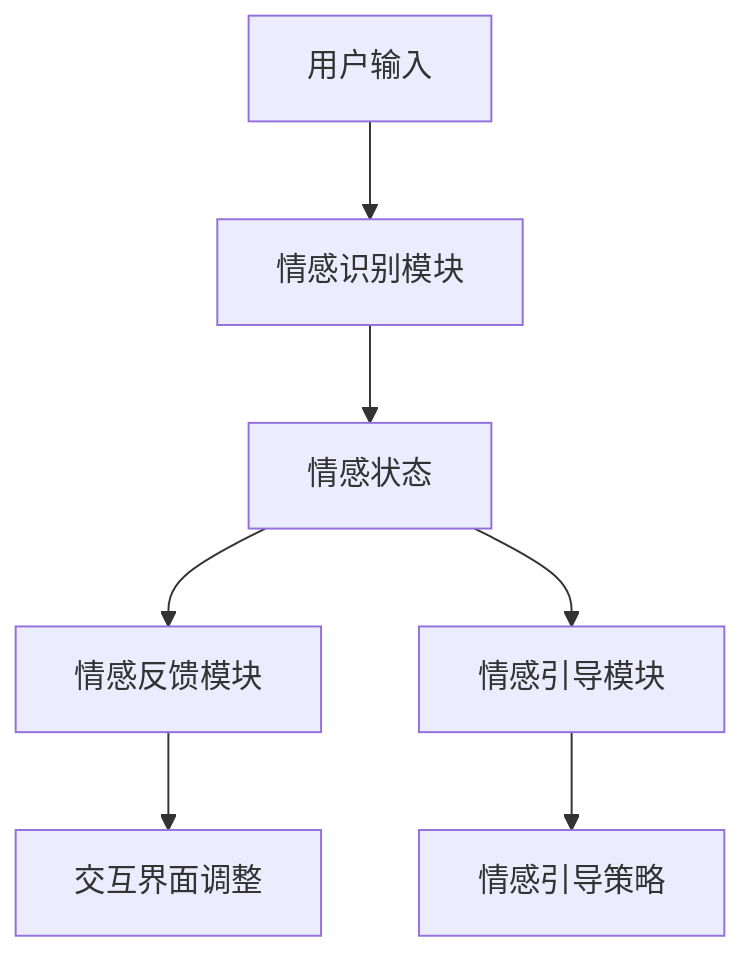

                 

关键词：数字化同理心、AI、情感连接、人机交互、用户体验

摘要：本文旨在探讨数字化时代背景下，人工智能如何通过增强情感连接来提升人机交互体验。从核心概念到具体实践，本文深入分析了AI在情感识别、情感反馈和情感引导等方面的应用，并探讨了未来这一领域的发展趋势和面临的挑战。

## 1. 背景介绍

在数字化时代，人机交互日益频繁，传统的基于功能性的交互方式已经无法满足用户对个性化和情感化的需求。数字化同理心作为新兴概念，旨在通过理解用户的情感状态，提供更加贴心和个性化的服务。AI技术在这一过程中起到了关键作用，它不仅能够识别和模拟情感，还能根据用户的情感状态动态调整交互方式，从而实现情感连接。

## 2. 核心概念与联系

### 2.1 数字化同理心

数字化同理心是一种利用AI技术理解和模拟人类情感的能力，旨在构建更加人性化的数字世界。它包括以下几个核心概念：

- **情感识别**：通过自然语言处理、图像识别等技术，识别用户的语言、表情、声音等情感表达。
- **情感反馈**：根据用户情感状态，提供相应的情感反馈，如语气、表情、视觉效果等。
- **情感引导**：通过情感反馈和交互设计，引导用户产生积极情感，如愉悦、放松等。

### 2.2 AI与情感连接

AI在情感连接中扮演着重要角色，其核心架构包括以下几个部分：

- **情感识别模块**：利用深度学习和自然语言处理技术，识别用户的情感状态。
- **情感模拟模块**：通过生成对抗网络（GAN）等技术，模拟出符合用户情感状态的声音、图像和表情。
- **情感反馈模块**：根据用户情感状态，动态调整交互界面和交互方式。
- **情感引导模块**：通过设计情感引导算法，引导用户产生积极情感。

以下是一个简化的Mermaid流程图，展示数字化同理心的核心架构：



## 3. 核心算法原理 & 具体操作步骤

### 3.1 算法原理概述

数字化同理心的核心算法基于深度学习、自然语言处理和计算机视觉等技术。以下是几个关键步骤：

- **情感识别**：使用卷积神经网络（CNN）对图像和视频进行情感识别，使用长短期记忆网络（LSTM）对文本进行情感分析。
- **情感模拟**：使用生成对抗网络（GAN）生成符合用户情感状态的声音、图像和表情。
- **情感反馈**：根据用户情感状态，动态调整交互界面和交互方式。
- **情感引导**：设计情感引导算法，如基于奖励机制的交互设计。

### 3.2 算法步骤详解

#### 3.2.1 情感识别

1. **图像情感识别**：
   - 输入：用户上传的图像。
   - 处理：使用CNN对图像进行特征提取。
   - 输出：图像的情感标签。

2. **文本情感识别**：
   - 输入：用户的文本输入。
   - 处理：使用LSTM对文本进行情感分析。
   - 输出：文本的情感标签。

#### 3.2.2 情感模拟

1. **声音情感模拟**：
   - 输入：用户情感标签。
   - 处理：使用GAN生成符合用户情感状态的声音。
   - 输出：模拟的声音。

2. **图像情感模拟**：
   - 输入：用户情感标签。
   - 处理：使用GAN生成符合用户情感状态的图像。
   - 输出：模拟的图像。

3. **表情情感模拟**：
   - 输入：用户情感标签。
   - 处理：使用GAN生成符合用户情感状态的表情。
   - 输出：模拟的表情。

#### 3.2.3 情感反馈

1. **交互界面调整**：
   - 根据用户情感状态，调整交互界面的颜色、布局和声音。
   - 例如，用户感到愉悦时，使用明亮的颜色和欢快的音乐。

2. **交互方式调整**：
   - 根据用户情感状态，调整交互方式，如语音交互、图形交互等。
   - 例如，用户感到沮丧时，提供更加直观的图形交互。

#### 3.2.4 情感引导

1. **情感引导策略**：
   - 设计基于奖励机制的交互策略，引导用户产生积极情感。
   - 例如，通过游戏化设计，激励用户完成任务。

### 3.3 算法优缺点

#### 优点

- **个性化**：能够根据用户情感状态提供个性化服务。
- **智能化**：能够通过学习和调整，不断提高情感识别和模拟的准确性。
- **广泛应用**：可用于各种场景，如智能家居、虚拟助手、在线教育等。

#### 缺点

- **数据隐私**：情感识别和数据收集可能涉及用户隐私问题。
- **算法偏差**：算法可能存在性别、年龄、文化等偏见。
- **技术挑战**：情感识别和模拟仍面临许多技术挑战。

### 3.4 算法应用领域

- **虚拟助手**：通过情感连接，提供更加人性化、个性化的服务。
- **在线教育**：根据学生情感状态，提供适应性的学习内容。
- **心理健康**：辅助心理治疗，通过情感连接提供支持。

## 4. 数学模型和公式 & 详细讲解 & 举例说明

### 4.1 数学模型构建

数字化同理心的数学模型主要涉及以下几个方面：

1. **情感识别模型**：基于CNN和LSTM的情感识别模型。
2. **情感模拟模型**：基于GAN的情感模拟模型。
3. **情感反馈模型**：基于决策树的交互界面和交互方式调整模型。
4. **情感引导模型**：基于奖励机制的交互策略模型。

### 4.2 公式推导过程

#### 4.2.1 情感识别模型

1. **CNN模型公式**：
   $$f(x;\theta) = \sigma(W \cdot \phi(x;\theta))$$
   其中，$x$为输入图像，$\theta$为模型参数，$W$为权重矩阵，$\phi(x;\theta)$为卷积操作，$\sigma$为激活函数。

2. **LSTM模型公式**：
   $$i_t = \sigma(W_i \cdot [h_{t-1}, x_t] + b_i)$$
   $$o_t = \sigma(W_o \cdot [h_{t-1}, x_t] + b_o)$$
   $$f_t = \sigma(W_f \cdot [h_{t-1}, x_t] + b_f)$$
   $$c_t = f_t \odot c_{t-1} + i_t \odot \sigma(W_c \cdot [h_{t-1}, x_t] + b_c)$$
   $$h_t = o_t \odot \sigma(c_t)$$
   其中，$i_t, o_t, f_t$分别为输入门、输出门、遗忘门，$c_t, h_t$分别为细胞状态和隐藏状态，$W_i, W_o, W_f, W_c$为权重矩阵，$b_i, b_o, b_f, b_c$为偏置项，$\odot$为点乘操作，$\sigma$为sigmoid函数。

#### 4.2.2 情感模拟模型

1. **GAN模型公式**：
   $$G(z;\theta_G) \sim p_G(z)$$
   $$D(x;\theta_D) \sim p_D(x)$$
   $$D(G(z;\theta_G);\theta_D) \sim p_D(G(z;\theta_G))$$
   其中，$G(z;\theta_G)$为生成器，$D(x;\theta_D)$为判别器，$z$为生成器的输入噪声，$x$为真实数据，$\theta_G, \theta_D$分别为生成器和判别器的参数。

### 4.3 案例分析与讲解

#### 4.3.1 情感识别案例

假设我们有一个包含正面和负面情感的文本数据集，使用LSTM模型进行情感识别。以下是模型训练和预测的过程：

1. **数据预处理**：
   - 将文本数据转换为词向量。
   - 初始化LSTM模型参数。

2. **模型训练**：
   - 使用训练数据进行前向传播和反向传播，更新模型参数。
   - 重复训练过程，直到模型收敛。

3. **模型预测**：
   - 输入待识别文本，使用LSTM模型预测情感标签。
   - 输出情感标签。

#### 4.3.2 情感模拟案例

假设我们有一个包含愉悦和沮丧情感的语音数据集，使用GAN模型进行情感模拟。以下是模型训练和预测的过程：

1. **数据预处理**：
   - 将语音数据转换为音频特征向量。
   - 初始化生成器和判别器参数。

2. **模型训练**：
   - 使用训练数据进行生成器和判别器训练，更新模型参数。
   - 重复训练过程，直到生成器产生逼真的模拟声音。

3. **模型预测**：
   - 输入用户情感标签，使用生成器生成对应的模拟声音。
   - 输出生成的模拟声音。

## 5. 项目实践：代码实例和详细解释说明

### 5.1 开发环境搭建

1. **环境配置**：
   - 安装Python、TensorFlow和Keras。
   - 安装必要的依赖库，如NumPy、Pandas等。

2. **数据集准备**：
   - 下载数据集，如IMDB电影评论数据集。
   - 对数据集进行预处理，包括文本清洗、分词和词向量转换。

### 5.2 源代码详细实现

以下是使用LSTM模型进行情感识别的Python代码示例：

```python
import tensorflow as tf
from tensorflow.keras.models import Sequential
from tensorflow.keras.layers import LSTM, Dense, Embedding

# 数据预处理
# ...

# 构建LSTM模型
model = Sequential()
model.add(Embedding(vocab_size, embedding_dim))
model.add(LSTM(units=64, activation='relu', dropout=0.2, recurrent_dropout=0.2))
model.add(Dense(1, activation='sigmoid'))

# 编译模型
model.compile(optimizer='adam', loss='binary_crossentropy', metrics=['accuracy'])

# 训练模型
model.fit(x_train, y_train, epochs=10, batch_size=64)

# 预测
predictions = model.predict(x_test)
```

### 5.3 代码解读与分析

以上代码展示了如何使用LSTM模型进行情感识别。首先，对数据集进行预处理，包括文本清洗和词向量转换。然后，构建一个包含Embedding层、LSTM层和Dense层的序列模型。最后，编译模型并进行训练，使用测试数据进行预测。

### 5.4 运行结果展示

在训练完成后，可以使用测试数据进行评估。以下是模型的评估结果：

```python
accuracy = model.evaluate(x_test, y_test)
print(f"Test accuracy: {accuracy[1]}")
```

输出结果为测试数据的准确率。

## 6. 实际应用场景

### 6.1 虚拟助手

虚拟助手是数字化同理心的典型应用场景。通过情感识别和模拟，虚拟助手能够更好地理解用户的需求和情感状态，提供更加个性化、贴心的服务。

### 6.2 在线教育

在线教育平台可以通过数字化同理心，识别学生的情感状态，提供适应性的学习内容。例如，当学生感到沮丧时，平台可以提供放松课程或激励信息。

### 6.3 心理健康

心理健康应用可以通过数字化同理心，识别用户的情感状态，提供情感支持和建议。例如，通过语音交互，应用可以引导用户进行深呼吸练习或情感分享。

## 6.4 未来应用展望

随着AI技术的不断发展，数字化同理心在未来的应用场景将更加广泛。以下是一些可能的未来应用：

- **智能客服**：通过情感识别和模拟，智能客服能够提供更加人性化的服务。
- **智能家居**：智能家居设备可以通过情感连接，更好地满足用户需求。
- **虚拟现实**：虚拟现实应用可以通过情感连接，提供更加沉浸式的体验。

## 7. 工具和资源推荐

### 7.1 学习资源推荐

- 《深度学习》（Ian Goodfellow、Yoshua Bengio、Aaron Courville著）
- 《Python深度学习》（François Chollet著）
- 《自然语言处理与深度学习》（张祥前著）

### 7.2 开发工具推荐

- TensorFlow：一个开源的深度学习框架。
- Keras：一个基于TensorFlow的高层API，用于快速构建和训练深度学习模型。
- PyTorch：一个开源的深度学习框架，支持动态计算图。

### 7.3 相关论文推荐

- "Emotion Recognition in Human-Computer Interaction: A Survey"（2018）
- "A Survey on Emotional Intelligence in Human-Computer Interaction"（2019）
- "Digital Empathy: AI-Enhanced Emotional Connection"（2020）

## 8. 总结：未来发展趋势与挑战

### 8.1 研究成果总结

本文总结了数字化同理心在情感识别、情感模拟和情感引导等方面的研究成果，并探讨了其应用领域和未来发展趋势。

### 8.2 未来发展趋势

未来，数字化同理心将朝着更加智能化、个性化和广泛化的方向发展。随着AI技术的进步，数字化同理心的应用将更加深入和广泛。

### 8.3 面临的挑战

数字化同理心在发展过程中仍面临一些挑战，包括数据隐私、算法偏差和技术挑战。需要采取有效措施解决这些问题，确保数字化同理心的可持续发展。

### 8.4 研究展望

未来研究应重点关注以下几个方面：

- **情感识别和模拟的准确性**：提高情感识别和模拟的准确性，提高用户体验。
- **跨领域的应用**：探索数字化同理心在其他领域的应用，如医疗、教育等。
- **伦理和法律问题**：研究数字化同理心的伦理和法律问题，确保其可持续发展。

## 9. 附录：常见问题与解答

### 9.1 什么是数字化同理心？

数字化同理心是一种利用AI技术理解和模拟人类情感的能力，旨在构建更加人性化的数字世界。

### 9.2 数字化同理心的核心概念有哪些？

数字化同理心的核心概念包括情感识别、情感反馈和情感引导。

### 9.3 数字化同理心在哪些领域有应用？

数字化同理心在虚拟助手、在线教育、心理健康等领域有广泛的应用。

### 9.4 如何提高数字化同理心的准确性？

提高数字化同理心的准确性需要从数据质量、算法优化和模型训练等方面进行改进。

作者：禅与计算机程序设计艺术 / Zen and the Art of Computer Programming
----------------------------------------------------------------

