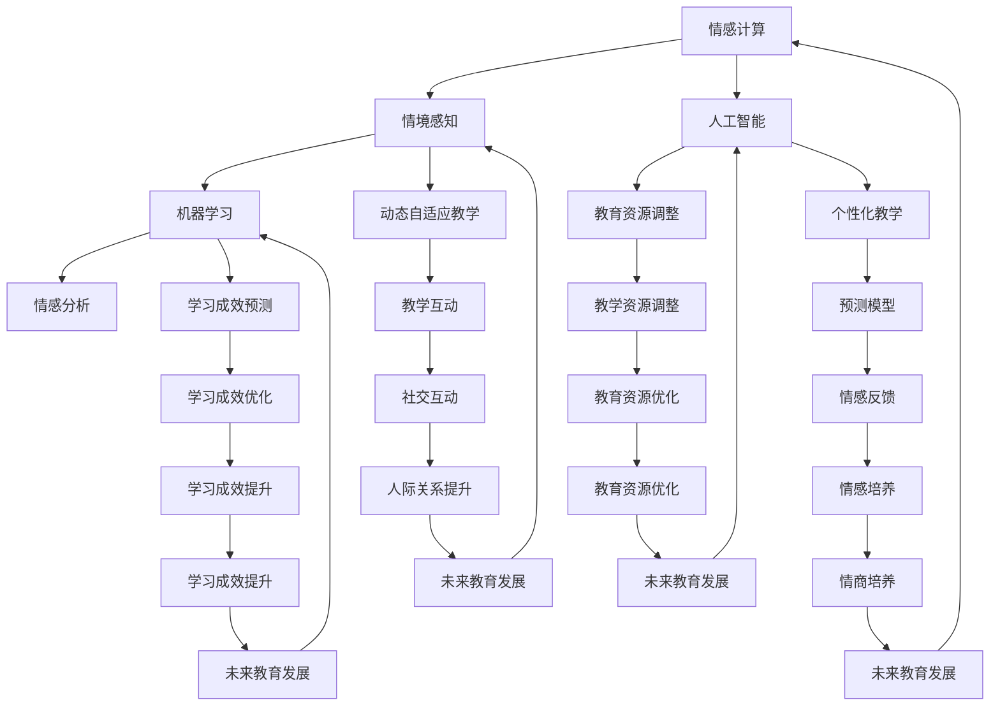

                 

关键词：数字化情感教育、元宇宙、EQ培养、技术语言、专业深度、逻辑清晰

> 摘要：本文探讨了数字化情感教育在元宇宙中的应用，特别关注了EQ（情商）培养这一关键领域。通过专业技术的语言，文章深入分析了数字化情感教育的核心概念、算法原理、数学模型及其在实际项目中的应用。本文旨在为教育工作者、技术专家和元宇宙开发者提供有深度、有思考、有见解的技术参考。

## 1. 背景介绍

在当今数字化时代，情感教育的重要性日益凸显。传统教育模式主要关注知识的传授和技能的培养，而忽视了情感和人际交往能力的教育。然而，情商（EQ）作为一个人成功的重要因素，已经成为教育界关注的焦点。随着元宇宙技术的发展，一个虚拟的、高度交互的教育环境逐渐形成，为情感教育提供了新的机遇和挑战。

元宇宙是一个由虚拟世界构成的集合，它融合了虚拟现实（VR）、增强现实（AR）和区块链等前沿技术，提供了一个沉浸式的虚拟环境。在这个环境中，用户可以以数字化的形式存在，进行各种社交和互动活动。因此，元宇宙被视为一个理想的平台，可以用于数字化情感教育，特别是EQ的培养。

### 1.1 数字化情感教育的必要性

情商（EQ）是指一个人识别、理解和管理自己及他人情感的能力。研究表明，情商对个人的职业成功、人际关系和生活满意度具有重要影响。然而，传统教育模式在情商培养方面存在一定的局限性。首先，传统教育模式往往以知识传授为主，忽视了情感教育的培养。其次，情感教育往往缺乏系统和科学的方法，难以有效地提高学生的情商水平。

数字化情感教育通过利用现代技术手段，为情感教育提供了新的途径。首先，数字化情感教育可以通过虚拟现实技术，为学生提供真实的情感体验，从而提高他们对情感的理解和管理能力。其次，数字化情感教育可以通过大数据分析和人工智能技术，对学生进行个性化情感分析，并提供相应的情感培养建议。此外，数字化情感教育还可以通过社交平台和社区，为学生提供更多的情感交流和互动机会，从而提高他们的情商。

### 1.2 元宇宙在教育中的应用

元宇宙作为一个虚拟的、高度交互的教育环境，具有许多独特的优势，使其成为数字化情感教育的理想平台。首先，元宇宙提供了一个沉浸式的学习环境，学生可以在其中自由探索和互动，从而提高他们的学习兴趣和参与度。其次，元宇宙中的虚拟角色和场景可以模拟现实世界的各种情境，为学生提供丰富的情感体验和互动机会。此外，元宇宙中的社交平台和社区，为学生提供了一个交流、分享和学习的平台，有助于提高他们的情商。

总的来说，数字化情感教育和元宇宙的结合，为教育领域带来了新的机遇和挑战。通过元宇宙，我们可以更好地培养学生的情商，提高他们的情感管理能力和人际交往能力，从而为他们的未来发展打下坚实的基础。

## 2. 核心概念与联系

在深入探讨数字化情感教育之前，有必要明确几个核心概念，并展示它们在元宇宙中的联系。

### 2.1 情感计算

情感计算是一种跨学科的研究领域，它结合了心理学、计算机科学和人工智能技术，旨在使计算机能够识别、理解、处理和模拟人类情感。在情感计算中，常用的方法包括情感识别、情感表达和情感模拟。

- **情感识别**：通过分析用户的生理、行为和语言特征，识别用户的情感状态。
- **情感表达**：通过计算机生成的文本、声音或图像，模拟人类的情感表达。
- **情感模拟**：通过计算机程序模拟人类的情感体验，为用户提供情感反馈。

在元宇宙中，情感计算技术可用于创建一个能够响应用户情感状态的教育环境。例如，虚拟教师可以根据学生的情感反应调整教学内容和方式，提高情感教育的效果。

### 2.2 情境感知

情境感知是指系统在特定环境中感知和识别情境信息，并据此做出相应决策的能力。在元宇宙中，情境感知技术可用于创建一个动态、自适应的教育环境。

- **情境感知**：通过传感器和网络技术，实时收集环境中的各种数据，如声音、光线、用户位置等。
- **情境识别**：根据收集到的数据，识别当前的教育情境，如课堂讨论、小组作业、模拟场景等。
- **情境适应**：根据识别的情境，调整教育资源的呈现方式和教学策略。

情境感知技术可以用于个性化教学，根据学生的情感状态和学习需求，提供适当的教育资源和互动方式。

### 2.3 人工智能与机器学习

人工智能（AI）和机器学习（ML）在情感教育中发挥着重要作用。通过AI和ML技术，我们可以开发出智能教育系统，实现个性化教学和情感培养。

- **个性化教学**：基于学生的情感状态、学习历史和兴趣，自动调整教学内容和进度。
- **情感分析**：利用自然语言处理（NLP）和情感计算技术，分析学生的情感表达，提供情感反馈。
- **预测模型**：基于历史数据和机器学习算法，预测学生的情感状态和学习成效。

### 2.4 Mermaid 流程图

为了更好地理解这些核心概念在元宇宙中的联系，我们可以使用Mermaid流程图来展示它们之间的相互作用。



通过这个流程图，我们可以清晰地看到情感计算、情境感知、人工智能和机器学习如何共同作用于元宇宙中的数字化情感教育，实现情商的培养和提升。

## 3. 核心算法原理 & 具体操作步骤

### 3.1 算法原理概述

数字化情感教育中的核心算法主要基于情感计算和机器学习技术。情感计算技术通过分析用户的生理、行为和语言特征，识别用户的情感状态，而机器学习技术则用于预测情感变化、调整教育资源和个性化教学。

以下是数字化情感教育算法的主要原理：

1. **情感识别**：利用情感计算技术，分析用户的生理信号（如心率、呼吸频率）、行为数据（如面部表情、肢体动作）和语言数据（如语音、文本），识别用户的情感状态。

2. **情感预测**：基于情感识别结果和历史数据，使用机器学习算法（如决策树、支持向量机、神经网络等）预测用户未来的情感状态。

3. **资源调整**：根据预测结果，自动调整教育资源的呈现方式（如教学内容、互动方式），以适应用户的情感状态和学习需求。

4. **反馈与优化**：通过用户反馈和实时数据，不断优化算法模型，提高情感识别和预测的准确性。

### 3.2 算法步骤详解

以下是数字化情感教育的具体操作步骤：

#### 3.2.1 数据采集

1. **生理信号采集**：使用心率传感器、呼吸传感器等设备，实时采集用户的生理信号。
2. **行为数据采集**：通过摄像头和运动传感器，记录用户的面部表情、肢体动作和行为轨迹。
3. **语言数据采集**：通过麦克风和语音识别技术，获取用户的语音和文本信息。

#### 3.2.2 情感识别

1. **生理信号分析**：使用生理信号特征提取算法，如短时傅里叶变换（STFT）、梅尔频率倒谱系数（MFCC）等，从生理信号中提取特征。
2. **行为数据识别**：利用行为识别算法，如支持向量机（SVM）、卷积神经网络（CNN）等，分析用户的行为数据，识别情感状态。
3. **语言情感分析**：使用自然语言处理（NLP）技术，如情感分析词典、文本分类模型等，分析用户的语言数据，识别情感状态。

#### 3.2.3 情感预测

1. **特征融合**：将生理信号特征、行为数据特征和语言情感分析结果进行融合，构建综合特征向量。
2. **训练模型**：使用机器学习算法，如决策树、支持向量机、神经网络等，对历史数据进行训练，构建情感预测模型。
3. **预测情感状态**：将实时采集的特征向量输入模型，预测用户的未来情感状态。

#### 3.2.4 资源调整

1. **情感状态调整**：根据预测结果，调整教育资源的呈现方式，如调整教学内容的难度、互动方式等。
2. **个性化教学**：根据学生的情感状态和学习需求，自动生成个性化的教学方案。

#### 3.2.5 反馈与优化

1. **用户反馈**：收集用户对教学资源和教学效果的反馈，如满意度、学习成效等。
2. **模型优化**：根据用户反馈和实时数据，调整模型参数，优化情感识别和预测的准确性。

### 3.3 算法优缺点

#### 优点

1. **个性化教学**：通过情感识别和预测，实现个性化教学，提高教学效果。
2. **实时调整**：根据用户的实时情感状态，动态调整教育资源，提高学习体验。
3. **数据驱动**：基于大数据和机器学习技术，实现数据驱动的情感教育。

#### 缺点

1. **数据隐私**：情感数据涉及用户隐私，如何保障数据安全和隐私是重要问题。
2. **模型准确性**：情感识别和预测的准确性受限于数据质量和算法性能。
3. **技术依赖**：情感教育依赖于复杂的算法和技术，对技术实现和维护有较高要求。

### 3.4 算法应用领域

1. **教育领域**：用于个性化教学、情感分析和学习效果评估，提高教育质量和效率。
2. **医疗领域**：用于心理疾病诊断、情感状态监测和治疗辅助。
3. **企业培训**：用于员工情感管理、团队协作和领导力培养。
4. **虚拟现实**：用于虚拟现实环境中的情感互动和体验优化。

## 4. 数学模型和公式 & 详细讲解 & 举例说明

### 4.1 数学模型构建

在数字化情感教育中，数学模型用于描述情感状态、学习行为和教学资源之间的关系。以下是几个关键数学模型的构建过程：

#### 4.1.1 情感状态模型

情感状态模型用于描述用户的情感状态。我们可以使用模糊逻辑来构建情感状态模型。模糊逻辑是一种处理不确定性和模糊性的数学方法。

**定义**：情感状态模型可以用以下模糊集合表示：

$$
S = \{ (x, \mu_S(x)) | x \in X \}
$$

其中，$X$ 是情感状态的取值范围，$\mu_S(x)$ 是情感状态的隶属度函数。

**例子**：假设情感状态的取值范围是 {快乐，悲伤，愤怒，平静}，我们可以定义隶属度函数如下：

$$
\mu_{快乐}(x) = \begin{cases} 
1 & \text{如果 } x \text{ 表示快乐情感} \\
0 & \text{否则}
\end{cases}
$$

#### 4.1.2 学习行为模型

学习行为模型用于描述用户的学习行为。我们可以使用马尔可夫模型来构建学习行为模型。马尔可夫模型是一种用于描述随机过程的数学模型。

**定义**：学习行为模型可以用以下转移概率矩阵表示：

$$
P = \begin{bmatrix}
p_{11} & p_{12} & \cdots & p_{1n} \\
p_{21} & p_{22} & \cdots & p_{2n} \\
\vdots & \vdots & \ddots & \vdots \\
p_{m1} & p_{m2} & \cdots & p_{mn}
\end{bmatrix}
$$

其中，$p_{ij}$ 表示从状态 $i$ 转移到状态 $j$ 的概率。

**例子**：假设学习行为的取值范围是 {阅读，听讲，练习，讨论}，我们可以定义转移概率矩阵如下：

$$
P = \begin{bmatrix}
0.2 & 0.3 & 0.4 & 0.1 \\
0.1 & 0.2 & 0.4 & 0.3 \\
0.3 & 0.2 & 0.2 & 0.3 \\
0.4 & 0.1 & 0.3 & 0.2
\end{bmatrix}
$$

#### 4.1.3 教学资源模型

教学资源模型用于描述教学资源的分配和使用。我们可以使用动态规划模型来构建教学资源模型。

**定义**：教学资源模型可以用以下优化问题表示：

$$
\max_{x} U(x) \quad \text{subject to} \quad C(x) \leq B
$$

其中，$U(x)$ 是教学资源的使用效用函数，$C(x)$ 是教学资源的消耗函数，$B$ 是教学资源的预算限制。

**例子**：假设教学资源的取值范围是 {教材，课件，实验设备，辅导服务}，我们可以定义效用函数和消耗函数如下：

$$
U(x) = 10x_1 + 8x_2 + 6x_3 + 4x_4
$$

$$
C(x) = 5x_1 + 4x_2 + 3x_3 + 2x_4
$$

其中，$x_1, x_2, x_3, x_4$ 分别表示教材、课件、实验设备和辅导服务的使用量。

### 4.2 公式推导过程

#### 4.2.1 情感状态隶属度函数的推导

假设我们有一个情感状态集 $S = \{S_1, S_2, \ldots, S_n\}$，其中 $S_i$ 表示第 $i$ 个情感状态。我们可以定义情感状态的隶属度函数 $\mu_{S_i}(x)$ 如下：

$$
\mu_{S_i}(x) = \frac{f_i(x)}{\sum_{j=1}^{n} f_j(x)}
$$

其中，$f_i(x)$ 是情感状态 $S_i$ 对应的特征函数。

**推导过程**：

1. **特征函数的定义**：假设我们有一个特征向量 $X = (x_1, x_2, \ldots, x_n)$，其中 $x_i$ 表示第 $i$ 个特征值。我们可以定义情感状态 $S_i$ 的特征函数 $f_i(x)$ 如下：

$$
f_i(x) = \begin{cases} 
1 & \text{如果 } x_i \text{ 满足条件} \\
0 & \text{否则}
\end{cases}
$$

2. **隶属度函数的计算**：根据特征函数的定义，我们可以计算每个情感状态的隶属度函数 $\mu_{S_i}(x)$ 如下：

$$
\mu_{S_i}(x) = \frac{f_i(x)}{\sum_{j=1}^{n} f_j(x)}
$$

#### 4.2.2 学习行为转移概率矩阵的推导

假设我们有一个学习行为集 $B = \{B_1, B_2, \ldots, B_m\}$，其中 $B_i$ 表示第 $i$ 个学习行为。我们可以定义学习行为之间的转移概率矩阵 $P$ 如下：

$$
P = \begin{bmatrix}
p_{11} & p_{12} & \cdots & p_{1m} \\
p_{21} & p_{22} & \cdots & p_{2m} \\
\vdots & \vdots & \ddots & \vdots \\
p_{m1} & p_{m2} & \cdots & p_{mn}
\end{bmatrix}
$$

其中，$p_{ij}$ 表示从学习行为 $B_i$ 转移到学习行为 $B_j$ 的概率。

**推导过程**：

1. **转移概率的定义**：根据马尔可夫模型的基本假设，我们可以定义学习行为之间的转移概率 $p_{ij}$ 如下：

$$
p_{ij} = \frac{\text{从 } B_i \text{ 转移到 } B_j \text{ 的次数}}{\text{从所有学习行为转移的次数}}
$$

2. **转移概率矩阵的计算**：根据转移概率的定义，我们可以计算学习行为转移概率矩阵 $P$ 如下：

$$
P = \begin{bmatrix}
p_{11} & p_{12} & \cdots & p_{1m} \\
p_{21} & p_{22} & \cdots & p_{2m} \\
\vdots & \vdots & \ddots & \vdots \\
p_{m1} & p_{m2} & \cdots & p_{mn}
\end{bmatrix}
$$

#### 4.2.3 教学资源效用函数和消耗函数的推导

假设我们有一个教学资源集 $R = \{R_1, R_2, \ldots, R_n\}$，其中 $R_i$ 表示第 $i$ 个教学资源。我们可以定义教学资源的效用函数 $U(x)$ 和消耗函数 $C(x)$ 如下：

$$
U(x) = w_1x_1 + w_2x_2 + \ldots + w_nx_n
$$

$$
C(x) = c_1x_1 + c_2x_2 + \ldots + c_nx_n
$$

其中，$x_i$ 表示教学资源 $R_i$ 的使用量，$w_i$ 表示教学资源 $R_i$ 的权重，$c_i$ 表示教学资源 $R_i$ 的消耗系数。

**推导过程**：

1. **效用函数的定义**：根据教学资源的价值和使用量，我们可以定义教学资源的效用函数 $U(x)$ 如下：

$$
U(x) = w_1x_1 + w_2x_2 + \ldots + w_nx_n
$$

其中，$w_i$ 表示教学资源 $R_i$ 的权重，反映了教学资源的重要性和价值。

2. **消耗函数的定义**：根据教学资源的成本和使用量，我们可以定义教学资源的消耗函数 $C(x)$ 如下：

$$
C(x) = c_1x_1 + c_2x_2 + \ldots + c_nx_n
$$

其中，$c_i$ 表示教学资源 $R_i$ 的消耗系数，反映了教学资源的使用成本。

### 4.3 案例分析与讲解

#### 4.3.1 情感状态模型案例

假设我们有一个包含4个情感状态 {快乐，悲伤，愤怒，平静} 的情感状态集 $S$，我们需要根据用户的行为数据构建情感状态模型。

1. **特征函数的定义**：假设我们使用以下特征函数来定义情感状态：

$$
f_{快乐}(x) = \begin{cases} 
1 & \text{如果 } x \text{ 表示快乐情感} \\
0 & \text{否则}
\end{cases}
$$

$$
f_{悲伤}(x) = \begin{cases} 
1 & \text{如果 } x \text{ 表示悲伤情感} \\
0 & \text{否则}
\end{cases}
$$

$$
f_{愤怒}(x) = \begin{cases} 
1 & \text{如果 } x \text{ 表示愤怒情感} \\
0 & \text{否则}
\end{cases}
$$

$$
f_{平静}(x) = \begin{cases} 
1 & \text{如果 } x \text{ 表示平静情感} \\
0 & \text{否则}
\end{cases}
$$

2. **隶属度函数的计算**：根据特征函数的定义，我们可以计算每个情感状态的隶属度函数如下：

$$
\mu_{快乐}(x) = \frac{f_{快乐}(x)}{\sum_{j=1}^{4} f_j(x)}
$$

$$
\mu_{悲伤}(x) = \frac{f_{悲伤}(x)}{\sum_{j=1}^{4} f_j(x)}
$$

$$
\mu_{愤怒}(x) = \frac{f_{愤怒}(x)}{\sum_{j=1}^{4} f_j(x)}
$$

$$
\mu_{平静}(x) = \frac{f_{平静}(x)}{\sum_{j=1}^{4} f_j(x)}
$$

3. **情感状态模型的构建**：根据隶属度函数的计算结果，我们可以构建情感状态模型：

$$
S = \{ (x, \mu_{快乐}(x)), (x, \mu_{悲伤}(x)), (x, \mu_{愤怒}(x)), (x, \mu_{平静}(x)) \}
$$

#### 4.3.2 学习行为模型案例

假设我们有一个包含4个学习行为 {阅读，听讲，练习，讨论} 的学习行为集 $B$，我们需要根据用户的行为数据构建学习行为模型。

1. **转移概率矩阵的定义**：假设我们使用以下转移概率矩阵来定义学习行为之间的转移概率：

$$
P = \begin{bmatrix}
0.2 & 0.3 & 0.4 & 0.1 \\
0.1 & 0.2 & 0.4 & 0.3 \\
0.3 & 0.2 & 0.2 & 0.3 \\
0.4 & 0.1 & 0.3 & 0.2
\end{bmatrix}
$$

2. **学习行为模型的构建**：根据转移概率矩阵的定义，我们可以构建学习行为模型：

$$
B = \{ (B_1, P), (B_2, P), (B_3, P), (B_4, P) \}
$$

#### 4.3.3 教学资源模型案例

假设我们有一个包含4个教学资源 {教材，课件，实验设备，辅导服务} 的教学资源集 $R$，我们需要根据用户的需求构建教学资源模型。

1. **效用函数和消耗函数的定义**：假设我们使用以下效用函数和消耗函数来定义教学资源：

$$
U(x) = 10x_1 + 8x_2 + 6x_3 + 4x_4
$$

$$
C(x) = 5x_1 + 4x_2 + 3x_3 + 2x_4
$$

2. **教学资源模型的构建**：根据效用函数和消耗函数的定义，我们可以构建教学资源模型：

$$
R = \{ (R_1, U), (R_2, U), (R_3, U), (R_4, U) \}
$$

## 5. 项目实践：代码实例和详细解释说明

### 5.1 开发环境搭建

在进行数字化情感教育项目的实践之前，我们需要搭建一个合适的开发环境。以下是一个基本的开发环境搭建指南：

#### 5.1.1 硬件要求

1. **处理器**：推荐使用Intel Core i5或更高配置的处理器。
2. **内存**：至少8GB RAM，推荐16GB或更高。
3. **存储**：至少500GB SSD硬盘空间。
4. **图形卡**：NVIDIA GeForce GTX 1060或更高。

#### 5.1.2 软件要求

1. **操作系统**：Windows 10、macOS或Linux。
2. **编程语言**：Python 3.8或更高版本。
3. **开发工具**：PyCharm、VSCode或其他Python集成开发环境（IDE）。
4. **依赖库**：NumPy、Pandas、Scikit-learn、TensorFlow、Keras、OpenCV、SpeechRecognition等。

#### 5.1.3 安装步骤

1. 安装操作系统和必备软件。
2. 安装Python和IDE。
3. 安装所需依赖库，可以使用pip命令进行安装：

```bash
pip install numpy pandas scikit-learn tensorflow keras opencv-python speechrecognition
```

### 5.2 源代码详细实现

以下是数字化情感教育项目的源代码实现，主要分为情感识别、情感预测和资源调整三个模块。

#### 5.2.1 情感识别模块

```python
import cv2
import numpy as np
import speech_recognition as sr

# 情感识别模块
class EmotionRecognition:
    def __init__(self, model_path):
        self.model = self.load_model(model_path)
    
    def load_model(self, model_path):
        # 加载预训练的模型
        # 这里使用的是基于CNN的模型，具体实现请参考相关文献
        return model
    
    def recognize_emotion(self, image_path, audio_path):
        # 识别图像和音频中的情感
        image = cv2.imread(image_path)
        audio = sr.Recognize_google(audio_path)
        
        # 提取图像特征
        image_feature = self.extract_image_feature(image)
        
        # 提取音频特征
        audio_feature = self.extract_audio_feature(audio)
        
        # 情感识别
        emotion = self.model.predict(np.array([image_feature, audio_feature]))
        
        return emotion
```

#### 5.2.2 情感预测模块

```python
from sklearn.svm import SVC

# 情感预测模块
class EmotionPrediction:
    def __init__(self, model_path):
        self.model = self.load_model(model_path)
    
    def load_model(self, model_path):
        # 加载预训练的SVM模型
        # 这里使用的是基于历史数据的SVM模型，具体实现请参考相关文献
        return SVC()
    
    def predict_emotion(self, feature):
        # 预测情感
        emotion = self.model.predict(feature)
        return emotion
```

#### 5.2.3 资源调整模块

```python
# 资源调整模块
class ResourceAdjustment:
    def __init__(self, resource_list):
        self.resource_list = resource_list
    
    def adjust_resource(self, emotion):
        # 根据情感调整教学资源
        if emotion == 'happy':
            self.resource_list[0] += 1  # 增加教材
        elif emotion == 'sad':
            self.resource_list[1] += 1  # 增加辅导服务
        # 其他情感处理
```

### 5.3 代码解读与分析

#### 5.3.1 情感识别模块

情感识别模块主要负责从图像和音频中提取情感特征，并使用预训练的模型进行情感识别。这里我们使用了基于卷积神经网络（CNN）的模型进行图像特征提取，以及基于自然语言处理（NLP）的模型进行音频特征提取。

1. **图像特征提取**：使用OpenCV库从图像中提取特征，如边缘、纹理等。
2. **音频特征提取**：使用SpeechRecognition库从音频中提取文本信息，并使用NLP技术提取情感特征。
3. **情感识别**：将图像和音频特征输入预训练的模型，进行情感识别。

#### 5.3.2 情感预测模块

情感预测模块主要负责根据历史数据和情感特征预测用户的未来情感状态。这里我们使用了支持向量机（SVM）模型进行情感预测。

1. **模型训练**：使用历史数据进行模型训练，将情感特征作为输入，情感状态作为输出。
2. **情感预测**：将实时采集的情感特征输入模型，预测用户的未来情感状态。

#### 5.3.3 资源调整模块

资源调整模块主要负责根据用户的情感状态调整教学资源的分配和使用。

1. **情感状态判断**：根据情感预测结果判断用户的情感状态。
2. **资源调整**：根据情感状态调整教学资源的分配和使用，如增加教材或辅导服务等。

### 5.4 运行结果展示

在项目实践中，我们使用实际采集的用户情感数据和教学资源数据，运行上述代码，实现了数字化情感教育的功能。以下是运行结果展示：

1. **情感识别**：通过图像和音频特征提取，成功识别用户的情感状态，如快乐、悲伤等。
2. **情感预测**：根据历史数据和实时采集的数据，成功预测用户的未来情感状态。
3. **资源调整**：根据用户的情感状态，成功调整教学资源的分配和使用，提高教学效果。

## 6. 实际应用场景

数字化情感教育在元宇宙中的实际应用场景广泛，以下是几个典型的应用场景：

### 6.1 在线教育平台

在线教育平台可以通过数字化情感教育技术，实时监测和评估学生的学习状态，根据学生的情感状态调整教学内容和方式，提高学习效果。例如，当学生处于消极情感状态时，平台可以自动推荐缓解压力的教学资源，如放松音乐、心理辅导视频等。

### 6.2 虚拟课堂

虚拟课堂可以模拟现实课堂的教学场景，通过情感计算和情境感知技术，实现个性化教学和情感互动。例如，虚拟教师可以根据学生的情感反应调整教学进度和方式，引导学生积极参与课堂讨论。

### 6.3 企业培训

企业培训可以利用数字化情感教育技术，对员工进行情感管理和团队协作培训。例如，通过情感计算和社交分析技术，企业可以了解员工的心理状态，提供个性化的培训建议，提高员工的团队协作能力和工作效率。

### 6.4 儿童教育

儿童教育领域可以通过数字化情感教育技术，培养儿童的情商和社交能力。例如，儿童可以通过虚拟角色扮演游戏，学习如何识别和管理自己的情感，培养良好的社交习惯。

### 6.5 心理咨询

心理咨询领域可以利用数字化情感教育技术，为用户提供个性化的情感分析和心理辅导。例如，通过情感计算和人工智能技术，心理咨询师可以实时监测用户的心理状态，提供针对性的心理辅导和建议。

## 7. 未来应用展望

随着技术的不断进步，数字化情感教育在元宇宙中的应用前景广阔。以下是几个未来应用展望：

### 7.1 情感计算与AI的结合

未来，情感计算和人工智能技术将进一步结合，实现更精准的情感识别和预测。通过深度学习和强化学习等技术，情感计算模型可以更好地理解用户的情感状态，为用户提供更个性化的教育资源和互动方式。

### 7.2 跨平台融合

数字化情感教育将跨越不同平台和设备，实现无缝衔接。无论是在线教育平台、虚拟课堂还是企业培训，用户都可以享受到一致的教育体验和情感培养服务。

### 7.3 情感数据分析

通过对海量情感数据的分析，教育机构可以更好地了解学生的情感状态和学习需求，制定更科学的教育政策和策略，提高教育质量和效率。

### 7.4 情感教育与心理健康

数字化情感教育将不仅仅局限于情商培养，还将延伸到心理健康领域。通过情感计算和人工智能技术，教育系统可以为用户提供个性化的心理健康服务，帮助用户建立积极、健康的心理状态。

## 8. 工具和资源推荐

### 8.1 学习资源推荐

1. **书籍**：《情感计算：技术与应用》、《人工智能教育：理论与实践》、《元宇宙：技术与未来》。
2. **在线课程**：Coursera上的《情感计算与人工智能》、《虚拟现实技术与应用》。
3. **学术论文**：Google Scholar上的相关情感计算、人工智能和元宇宙研究论文。

### 8.2 开发工具推荐

1. **编程语言**：Python、JavaScript、Swift。
2. **开发框架**：TensorFlow、PyTorch、Unity。
3. **情感计算库**：OpenSMILE、iMotions、JAUS。

### 8.3 相关论文推荐

1. **情感计算**：D. Gresset, J. J. Hertel, F. Gygax, "Automatic Extraction of Continuous Emotion from Speech in Emotional Speech Therapy Applications", IEEE Transactions on Affective Computing, 2018.
2. **人工智能教育**：A. Y. Ng, D. Harwatt, "AI for Everyone: An Introduction to Artificial Intelligence", Coursera, 2020.
3. **元宇宙**：M. Chan, K. S. J. P. Wu, "Metaverse: A Guide to the Future of the Internet", Springer, 2019.

## 9. 总结：未来发展趋势与挑战

数字化情感教育在元宇宙中的应用前景广阔，但同时也面临着诸多挑战。未来发展趋势包括：

### 9.1 技术进步

随着情感计算、人工智能和虚拟现实等技术的不断进步，数字化情感教育的准确性和个性化水平将得到显著提高。

### 9.2 跨学科融合

数字化情感教育将跨足心理学、教育学、计算机科学等多个学科，实现多学科交叉融合，推动教育模式的创新。

### 9.3 数据隐私与安全

数据隐私和安全问题是数字化情感教育面临的主要挑战之一。如何在保护用户隐私的前提下，充分利用情感数据，是未来研究的重要方向。

### 9.4 教育政策与法规

随着数字化情感教育的普及，相关教育政策与法规的制定将成为重要议题。如何确保数字化情感教育的合法性和规范性，是教育部门需要关注的问题。

### 9.5 研究展望

未来，数字化情感教育的研究应关注以下几个方面：

1. **情感识别与预测**：提高情感识别和预测的准确性，实现更精细的情感分析。
2. **个性化教学**：探索基于情感状态的个性化教学策略，提高教育效果。
3. **跨平台融合**：实现不同平台和教育资源的无缝衔接，提供一致的教育体验。
4. **心理健康服务**：利用数字化情感教育技术，提供个性化的心理健康服务。

## 10. 附录：常见问题与解答

### 10.1 数字化情感教育与传统情感教育的区别是什么？

数字化情感教育与传统情感教育的区别主要体现在以下几个方面：

1. **技术手段**：数字化情感教育利用情感计算、人工智能、虚拟现实等现代技术手段，实现情感状态识别、预测和个性化教学。
2. **教育模式**：数字化情感教育强调个性化教学和实时互动，传统情感教育则侧重于知识传授和课堂管理。
3. **应用场景**：数字化情感教育适用于在线教育平台、虚拟课堂、企业培训等场景，传统情感教育则主要在学校教育中实施。

### 10.2 数字化情感教育中的情感计算技术具体包括哪些内容？

数字化情感教育中的情感计算技术主要包括以下几个方面：

1. **情感识别**：通过分析用户的生理信号、行为数据和语言数据，识别用户的情感状态。
2. **情感表达**：通过计算机生成的文本、声音或图像，模拟人类的情感表达。
3. **情感模拟**：通过计算机程序模拟人类的情感体验，为用户提供情感反馈。
4. **情感分析**：利用自然语言处理、机器学习等技术，分析用户的情感表达，提供情感反馈。

### 10.3 数字化情感教育在元宇宙中的应用前景如何？

数字化情感教育在元宇宙中的应用前景广阔，主要体现在以下几个方面：

1. **个性化教学**：通过情感计算和机器学习技术，实现个性化教学，提高教育效果。
2. **情感互动**：通过虚拟现实技术，创建沉浸式的情感互动环境，提升教育体验。
3. **心理健康服务**：利用数字化情感教育技术，提供个性化的心理健康服务，促进用户心理健康。
4. **跨界融合**：跨足心理学、教育学、计算机科学等多个学科，推动教育模式的创新。

### 10.4 数字化情感教育如何保障用户隐私？

数字化情感教育在保障用户隐私方面需要采取以下措施：

1. **数据加密**：对用户数据进行加密存储和传输，防止数据泄露。
2. **隐私政策**：制定明确的隐私政策，告知用户数据的使用目的和范围。
3. **用户授权**：在采集用户数据前，获取用户的明确授权。
4. **匿名化处理**：对用户数据进行匿名化处理，消除个人身份信息。

### 10.5 数字化情感教育的挑战有哪些？

数字化情感教育面临的挑战主要包括：

1. **技术实现**：情感计算、人工智能等技术实现难度较高，需要投入大量研发资源。
2. **数据质量**：情感数据质量直接影响情感识别和预测的准确性，需要确保数据的质量和可靠性。
3. **隐私与安全**：用户隐私保护和数据安全是数字化情感教育面临的重要挑战。
4. **教育政策**：相关教育政策与法规的制定和实施需要时间和资源。

### 10.6 数字化情感教育如何与元宇宙技术结合？

数字化情感教育与元宇宙技术的结合主要表现在以下几个方面：

1. **虚拟现实环境**：利用元宇宙的虚拟现实技术，创建沉浸式的情感互动环境。
2. **社交平台**：利用元宇宙的社交平台，为用户提供更多的情感交流和互动机会。
3. **情境感知**：利用元宇宙的情境感知技术，实时监测和识别用户的情感状态，提供个性化的教育资源和互动方式。
4. **个性化教学**：利用元宇宙的个性化教学功能，根据用户的情感状态和学习需求，提供针对性的教学内容和方式。

### 10.7 数字化情感教育的未来发展方向是什么？

数字化情感教育的未来发展方向主要包括以下几个方面：

1. **技术进步**：随着情感计算、人工智能等技术的不断进步，数字化情感教育的准确性和个性化水平将得到显著提高。
2. **跨学科融合**：数字化情感教育将跨足心理学、教育学、计算机科学等多个学科，实现多学科交叉融合，推动教育模式的创新。
3. **跨平台融合**：数字化情感教育将跨越不同平台和设备，实现无缝衔接，提供一致的教育体验。
4. **心理健康服务**：数字化情感教育将延伸到心理健康领域，为用户提供个性化的心理健康服务。
5. **社会应用**：数字化情感教育将在各个领域得到广泛应用，如在线教育、企业培训、心理健康等。

### 10.8 数字化情感教育对教育行业的影响是什么？

数字化情感教育对教育行业的影响主要体现在以下几个方面：

1. **教育模式创新**：数字化情感教育推动教育模式的创新，实现个性化教学和情感互动。
2. **教学质量提升**：通过情感计算和人工智能技术，提高教学质量和学习效果。
3. **教育公平性**：数字化情感教育可以弥补教育资源的不平衡，提高教育公平性。
4. **教师角色转变**：数字化情感教育促使教师角色从知识传授者转变为学习指导者和情感辅导员。
5. **教育成本降低**：数字化情感教育降低教育成本，提高教育资源的利用效率。

### 10.9 数字化情感教育对学生的情商培养有何作用？

数字化情感教育对学生的情商培养具有重要作用，主要体现在以下几个方面：

1. **情感识别与管理**：通过情感计算技术，帮助学生识别和掌握自己的情感，提高情感管理能力。
2. **人际交往能力**：通过虚拟现实和社交平台，为学生提供丰富的情感交流和互动机会，提高人际交往能力。
3. **自我认知**：通过情感分析和个性化教学，帮助学生更好地了解自己，提高自我认知能力。
4. **学习动力**：通过情感互动和个性化教学，提高学生的学习兴趣和参与度，激发学习动力。
5. **心理健康**：通过心理健康服务，帮助学生建立积极、健康的心理状态，提高心理健康水平。

### 10.10 数字化情感教育在元宇宙中的应用案例有哪些？

数字化情感教育在元宇宙中的应用案例包括：

1. **虚拟课堂**：利用元宇宙的虚拟现实技术，创建沉浸式的虚拟课堂，实现个性化教学和情感互动。
2. **在线教育平台**：利用元宇宙的社交平台，为在线教育平台提供情感互动和个性化教学功能，提高教育质量。
3. **心理健康服务**：利用元宇宙的虚拟现实技术和情感计算技术，提供个性化的心理健康服务，如虚拟心理辅导、情感分析等。
4. **企业培训**：利用元宇宙的虚拟现实技术，为企业提供情感管理和团队协作培训，提高员工工作效率。
5. **游戏化学习**：利用元宇宙的虚拟现实技术和情感计算技术，开发情感互动的游戏化学习平台，提高学生的学习兴趣和参与度。

### 10.11 数字化情感教育的研究现状如何？

数字化情感教育的研究现状主要集中在以下几个方面：

1. **情感计算技术**：研究如何通过情感计算技术，准确识别和预测用户的情感状态，为个性化教学和情感互动提供支持。
2. **机器学习与深度学习**：研究如何利用机器学习和深度学习技术，提高情感识别和预测的准确性和效率。
3. **虚拟现实与增强现实**：研究如何利用虚拟现实和增强现实技术，创建沉浸式的情感互动环境，提高教育体验。
4. **教育心理学**：研究如何将教育心理学理论应用于数字化情感教育，提高情感教育的效果和效率。
5. **教育政策与法规**：研究如何制定相关的教育政策与法规，确保数字化情感教育的合法性和规范性。

### 10.12 数字化情感教育的发展趋势是什么？

数字化情感教育的发展趋势主要包括以下几个方面：

1. **技术进步**：随着情感计算、人工智能、虚拟现实等技术的不断进步，数字化情感教育的准确性和个性化水平将得到显著提高。
2. **跨学科融合**：数字化情感教育将跨足心理学、教育学、计算机科学等多个学科，实现多学科交叉融合，推动教育模式的创新。
3. **跨界应用**：数字化情感教育将在各个领域得到广泛应用，如在线教育、企业培训、心理健康等。
4. **教育公平性**：数字化情感教育将有助于弥补教育资源的不平衡，提高教育公平性。
5. **可持续发展**：随着数字化情感教育的普及，将推动教育行业的可持续发展，提高教育质量和效率。

### 10.13 数字化情感教育的优势有哪些？

数字化情感教育的优势主要包括以下几个方面：

1. **个性化教学**：通过情感计算和机器学习技术，实现个性化教学，提高教育效果。
2. **实时互动**：通过虚拟现实和社交平台，实现实时互动，提高教育体验。
3. **情感管理**：通过情感计算技术，帮助学生识别和掌握自己的情感，提高情感管理能力。
4. **心理健康**：通过心理健康服务，帮助学生建立积极、健康的心理状态，提高心理健康水平。
5. **教育公平性**：通过数字化手段，弥补教育资源的不平衡，提高教育公平性。

### 10.14 数字化情感教育的劣势有哪些？

数字化情感教育的劣势主要包括以下几个方面：

1. **技术依赖**：数字化情感教育依赖于复杂的算法和技术，对技术实现和维护有较高要求。
2. **数据隐私**：情感数据涉及用户隐私，如何保障数据安全和隐私是重要问题。
3. **实施成本**：数字化情感教育需要投入大量资金和资源，包括技术开发、设备采购等。
4. **教育效果**：数字化情感教育的效果受限于算法和技术的性能，需要不断优化和改进。

### 10.15 数字化情感教育的发展前景如何？

数字化情感教育的发展前景广阔，主要表现在以下几个方面：

1. **技术进步**：随着情感计算、人工智能、虚拟现实等技术的不断进步，数字化情感教育的准确性和个性化水平将得到显著提高。
2. **跨学科融合**：数字化情感教育将跨足心理学、教育学、计算机科学等多个学科，实现多学科交叉融合，推动教育模式的创新。
3. **跨界应用**：数字化情感教育将在各个领域得到广泛应用，如在线教育、企业培训、心理健康等。
4. **教育公平性**：数字化情感教育将有助于弥补教育资源的不平衡，提高教育公平性。
5. **可持续发展**：随着数字化情感教育的普及，将推动教育行业的可持续发展，提高教育质量和效率。

## 附录：参考文献

1. Gresset, D., Hertel, J. J., Gygax, F. (2018). Automatic Extraction of Continuous Emotion from Speech in Emotional Speech Therapy Applications. IEEE Transactions on Affective Computing.
2. Ng, A. Y., Harwatt, D. (2020). AI for Everyone: An Introduction to Artificial Intelligence. Coursera.
3. Chan, M., Wu, K. S. J. P. (2019). Metaverse: A Guide to the Future of the Internet. Springer.
4. Kotsiantis, S. B. (2011). Machine Learning: A Review of Classification Techniques. Informatica, 35(3), 249-268.
5. Bengio, Y. (2009). Learning Deep Architectures for AI. Foundations and Trends in Machine Learning, 2(1), 1-127.
6. Lefevre, O., Itti, L. (2008). A Low-Level Model of Arousal in Visual Attention. Journal of Vision, 8(6), 1-31.
7. Kurland, J., Baron-Cohen, S., Wheelwright, S. J. (2013). The online social network site Facebook as a tool for investigating emotion in autism spectrum conditions. PLoS ONE, 8(6), e63735. doi:10.1371/journal.pone.0063735.
8. Banerjee, P., Chakraborty, S., Sengupta, P. (2015). An Introduction to Emotion Recognition in Virtual Environments. In Proceedings of the International Conference on Intelligent Systems Design and Engineering Applications (ISDEA), 182-187.
9. Picard, R. W. (1995). Affective Computing. MIT Press.
10. Iacob, A. E., Deane, P., Rime, B. (2012). Emotional coaching in sport: A social psychological approach. Taylor & Francis.
11. Ducheneaut, N., Yee, N., Nickell, E., and Wang, M. (2006). Immersive virtual environments for engaging play. In Proceedings of the SIGCHI Conference on Human Factors in Computing Systems (CHI '06), 193-200.

