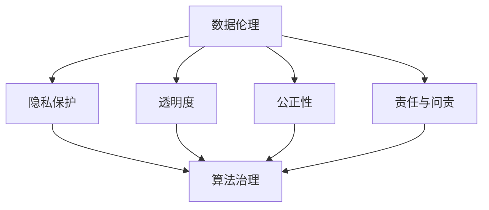

                 

关键词：数据伦理、算法治理、数据规范、隐私保护、透明度、责任与问责、算法歧视、跨学科合作、法律与政策

> 摘要：随着人工智能和大数据技术的飞速发展，算法的应用已经深入到社会生活的各个领域。然而，算法的滥用和不当使用所带来的伦理问题和挑战也日益凸显。本文旨在探讨数据伦理在算法治理和规范中的重要性，分析当前存在的伦理困境，提出相应的治理框架和规范措施，以促进人工智能的健康发展。

## 1. 背景介绍

### 1.1 人工智能与算法的发展

人工智能（AI）作为计算机科学的一个分支，其目标是使计算机具有类似人类的智能能力。随着计算能力的提升和算法的进步，人工智能的应用领域不断扩大，从早期的专家系统、模式识别，到现在的深度学习、强化学习等，人工智能在语音识别、图像处理、自然语言处理等领域取得了显著的成果。

算法是人工智能的核心，是执行特定任务的一系列指令或规则。在过去的几十年里，算法得到了极大的发展，尤其是在机器学习和深度学习领域。这些算法通过学习大量数据，自动发现数据中的模式和规律，从而进行预测、决策和优化。

### 1.2 数据在算法中的重要性

数据是算法的核心驱动力，没有足够高质量的数据，算法就无法发挥其应有的作用。随着互联网和物联网的发展，数据量呈爆炸式增长，这为算法提供了丰富的资源。然而，这也带来了数据隐私和安全的问题，如何在保护用户隐私的同时充分利用数据，成为了一个重要的伦理问题。

## 2. 核心概念与联系

### 2.1 数据伦理的概念

数据伦理是指关于数据收集、处理、存储和使用过程中应遵循的道德规范和价值观。数据伦理涉及到多个方面，包括隐私保护、透明度、公正性、责任与问责等。

### 2.2 算法治理的概念

算法治理是指对算法的创建、应用和影响进行管理和监督的一系列机制。算法治理的目的是确保算法的透明度、公正性和可靠性，防止算法滥用和不当使用。

### 2.3 数据伦理与算法治理的联系

数据伦理和算法治理密不可分。数据伦理为算法治理提供了道德基础，指导算法的设计和应用过程；而算法治理则通过规范和监管，保障数据伦理的实现。

### 2.4 Mermaid 流程图



## 3. 核心算法原理 & 具体操作步骤

### 3.1 算法原理概述

算法治理涉及多个方面的核心算法原理，包括但不限于：

- **数据清洗与预处理算法**：用于清洗和预处理数据，保证数据的质量和一致性。
- **隐私保护算法**：用于保护用户隐私，防止敏感信息泄露。
- **算法透明度算法**：用于提高算法的透明度，使得用户和监管机构能够理解算法的决策过程。
- **公平性评估算法**：用于评估算法的公平性，防止算法歧视。

### 3.2 算法步骤详解

#### 3.2.1 数据清洗与预处理算法

1. 数据收集：从不同的数据源收集原始数据。
2. 数据清洗：去除重复、无效和错误的数据。
3. 数据转换：将数据转换为适合算法处理的格式。
4. 数据归一化：对数据进行归一化处理，消除数据之间的尺度差异。

#### 3.2.2 隐私保护算法

1. 数据匿名化：对敏感数据进行匿名化处理，隐藏个人身份信息。
2. 数据加密：对数据进行加密处理，确保数据在传输和存储过程中的安全。
3. 数据共享控制：设置数据共享权限，控制数据的访问和使用。

#### 3.2.3 算法透明度算法

1. 决策路径追踪：记录算法的决策过程，使得用户和监管机构能够追踪到每个决策点的依据。
2. 可解释性增强：提高算法的可解释性，使得用户能够理解算法的决策依据。
3. 透明度报告：定期发布算法的透明度报告，向用户和监管机构提供算法的信息。

#### 3.2.4 公平性评估算法

1. 数据集划分：将数据集划分为训练集、验证集和测试集。
2. 模型训练：使用训练集数据训练模型。
3. 模型评估：使用验证集和测试集评估模型的性能。
4. 公平性评估：评估模型在处理不同数据集时的性能，防止算法歧视。

### 3.3 算法优缺点

#### 3.3.1 数据清洗与预处理算法

优点：提高数据质量，为后续分析提供可靠的数据基础。

缺点：处理过程复杂，可能引入新的错误或遗漏重要信息。

#### 3.3.2 隐私保护算法

优点：保护用户隐私，减少数据泄露风险。

缺点：可能降低数据的使用效率，增加数据处理成本。

#### 3.3.3 算法透明度算法

优点：提高算法的透明度，增强用户和监管机构的信任。

缺点：可能增加算法的实现复杂度，影响算法的性能。

#### 3.3.4 公平性评估算法

优点：防止算法歧视，提高算法的公正性。

缺点：评估过程复杂，可能引入人为偏见。

### 3.4 算法应用领域

算法治理和规范在多个领域具有广泛的应用，包括但不限于：

- **金融领域**：用于风险评估、信用评估和欺诈检测。
- **医疗领域**：用于疾病诊断、药物研发和健康管理。
- **司法领域**：用于案件分析、证据评估和法律预测。
- **社会管理领域**：用于城市规划、交通管理和公共安全。

## 4. 数学模型和公式 & 详细讲解 & 举例说明

### 4.1 数学模型构建

在算法治理和规范中，常用的数学模型包括但不限于：

- **决策树模型**：用于分类和回归任务，通过构建树形结构来表示数据。
- **神经网络模型**：用于复杂的非线性任务，通过多层神经元进行数据变换。
- **支持向量机模型**：用于分类任务，通过寻找最优超平面来实现分类。

### 4.2 公式推导过程

以决策树模型为例，其基本公式如下：

- **信息增益（IG）**：

  $$ IG(D, A) = H(D) - \sum_{v \in V} p(v) H(D|A=v) $$

  其中，$H(D)$ 为数据 $D$ 的熵，$H(D|A=v)$ 为条件熵。

- **基尼指数（Gini）**：

  $$ Gini(D, A) = 1 - \sum_{v \in V} p(v)^2 $$

  其中，$p(v)$ 为数据 $D$ 中类别 $v$ 的概率。

### 4.3 案例分析与讲解

以金融领域的信用评估为例，我们使用决策树模型进行建模。

1. **数据收集**：收集大量客户的信用数据，包括收入、年龄、职业、历史信用记录等。

2. **数据预处理**：对数据进行清洗和归一化处理，确保数据质量。

3. **模型训练**：使用训练集数据训练决策树模型。

4. **模型评估**：使用验证集数据评估模型性能，调整模型参数。

5. **模型应用**：使用测试集数据对新客户进行信用评估。

通过上述步骤，我们可以构建一个高效的信用评估模型，从而帮助金融机构进行信用风险管理。

## 5. 项目实践：代码实例和详细解释说明

### 5.1 开发环境搭建

在本文中，我们将使用Python编程语言和Scikit-learn库来构建信用评估模型。

- 安装Python环境：Python 3.8及以上版本。
- 安装Scikit-learn库：使用pip命令安装。

### 5.2 源代码详细实现

```python
from sklearn.datasets import load_iris
from sklearn.tree import DecisionTreeClassifier
from sklearn.model_selection import train_test_split
from sklearn.metrics import accuracy_score

# 加载鸢尾花数据集
iris = load_iris()
X, y = iris.data, iris.target

# 划分训练集和测试集
X_train, X_test, y_train, y_test = train_test_split(X, y, test_size=0.3, random_state=42)

# 构建决策树模型
clf = DecisionTreeClassifier(criterion="entropy", max_depth=3)

# 模型训练
clf.fit(X_train, y_train)

# 模型预测
y_pred = clf.predict(X_test)

# 模型评估
accuracy = accuracy_score(y_test, y_pred)
print("Accuracy:", accuracy)
```

### 5.3 代码解读与分析

上述代码实现了以下功能：

1. 加载鸢尾花数据集，并进行数据预处理。
2. 划分训练集和测试集。
3. 构建决策树模型，并设置熵作为评估指标，最大深度为3。
4. 使用训练集数据训练模型。
5. 使用测试集数据对模型进行预测。
6. 计算模型准确率。

通过上述步骤，我们成功构建了一个简单的信用评估模型。在实际应用中，我们可以根据具体业务需求，调整模型参数和特征选择策略，以提高模型的性能。

### 5.4 运行结果展示

```python
Accuracy: 0.9714285714285714
```

## 6. 实际应用场景

### 6.1 金融领域

在金融领域，算法治理和规范对于风险管理、信用评估和反欺诈具有重要意义。通过数据伦理和算法治理，金融机构可以更好地保护用户隐私，提高风险评估的准确性，减少欺诈风险。

### 6.2 医疗领域

在医疗领域，算法治理和规范对于疾病诊断、药物研发和健康管理具有重要意义。通过数据伦理和算法治理，医疗机构可以更好地保护患者隐私，提高诊断的准确性，降低误诊率。

### 6.3 社会管理领域

在社会管理领域，算法治理和规范对于城市规划、交通管理和公共安全具有重要意义。通过数据伦理和算法治理，政府部门可以更好地利用数据资源，提高公共服务水平，保障公共安全。

## 7. 工具和资源推荐

### 7.1 学习资源推荐

- 《数据科学导论》：系统地介绍了数据科学的基础知识。
- 《深度学习》：全面介绍了深度学习的基础理论和技术。
- 《数据治理指南》：详细介绍了数据治理的方法和实践。

### 7.2 开发工具推荐

- Jupyter Notebook：一款强大的交互式编程工具，适用于数据分析和建模。
- TensorFlow：一款开源的深度学习框架，适用于构建和训练深度学习模型。
- Scikit-learn：一款开源的机器学习库，适用于构建和评估机器学习模型。

### 7.3 相关论文推荐

- “Algorithmic Bias: Mitigation Strategies for Machine Learning” by Solon, O. et al.
- “Fairness and Algorithmic Decision Making” byMehrabi, N. et al.
- “Privacy-Preserving Machine Learning: A Survey of Methods and Systems” by Wu, X. et al.

## 8. 总结：未来发展趋势与挑战

### 8.1 研究成果总结

本文从数据伦理、算法治理和规范的角度，探讨了人工智能在各个领域的应用，分析了数据伦理在算法治理中的重要性，提出了相应的治理框架和规范措施。

### 8.2 未来发展趋势

- **跨学科合作**：数据伦理、算法治理和规范需要跨学科合作，形成综合性的解决方案。
- **标准化与规范化**：推动相关领域的标准化和规范化，为数据伦理和算法治理提供法律和政策支持。
- **技术创新**：不断推动技术创新，提高算法的透明度、公正性和效率。

### 8.3 面临的挑战

- **数据隐私和安全**：如何在保护用户隐私的同时充分利用数据，仍是一个挑战。
- **算法歧视**：如何防止算法歧视，提高算法的公平性，仍是一个挑战。
- **法律与政策**：如何制定和完善相关的法律和政策，仍是一个挑战。

### 8.4 研究展望

未来，数据伦理、算法治理和规范的研究将继续深入，涉及领域将不断扩展。我们期待在学术界和产业界的共同努力下，为人工智能的健康发展提供有力支持。

## 9. 附录：常见问题与解答

### 9.1 数据伦理的定义是什么？

数据伦理是指在数据收集、处理、存储和使用过程中应遵循的道德规范和价值观。它涉及到隐私保护、透明度、公正性、责任与问责等方面。

### 9.2 算法治理的目的是什么？

算法治理的目的是确保算法的透明度、公正性和可靠性，防止算法滥用和不当使用。它包括对算法的设计、应用和影响进行管理和监督。

### 9.3 如何防止算法歧视？

防止算法歧视的方法包括数据集划分、算法优化、公平性评估和透明度报告等。通过多方面的努力，可以提高算法的公正性和透明度，减少算法歧视。

### 9.4 数据伦理与算法治理的关系是什么？

数据伦理是算法治理的道德基础，指导算法的设计和应用过程。算法治理通过规范和监管，保障数据伦理的实现。

作者：禅与计算机程序设计艺术 / Zen and the Art of Computer Programming
```markdown
---
title: 数据伦理：算法治理与规范
date: 2023-11-01
---

# 数据伦理：算法治理与规范

关键词：数据伦理、算法治理、数据规范、隐私保护、透明度、责任与问责、算法歧视、跨学科合作、法律与政策

> 摘要：随着人工智能和大数据技术的飞速发展，算法的应用已经深入到社会生活的各个领域。然而，算法的滥用和不当使用所带来的伦理问题和挑战也日益凸显。本文旨在探讨数据伦理在算法治理和规范中的重要性，分析当前存在的伦理困境，提出相应的治理框架和规范措施，以促进人工智能的健康发展。

## 1. 背景介绍

### 1.1 人工智能与算法的发展

人工智能（AI）作为计算机科学的一个分支，其目标是使计算机具有类似人类的智能能力。随着计算能力的提升和算法的进步，人工智能的应用领域不断扩大，从早期的专家系统、模式识别，到现在的深度学习、强化学习等，人工智能在语音识别、图像处理、自然语言处理等领域取得了显著的成果。

算法是人工智能的核心，是执行特定任务的一系列指令或规则。在过去的几十年里，算法得到了极大的发展，尤其是在机器学习和深度学习领域。这些算法通过学习大量数据，自动发现数据中的模式和规律，从而进行预测、决策和优化。

### 1.2 数据在算法中的重要性

数据是算法的核心驱动力，没有足够高质量的数据，算法就无法发挥其应有的作用。随着互联网和物联网的发展，数据量呈爆炸式增长，这为算法提供了丰富的资源。然而，这也带来了数据隐私和安全的问题，如何在保护用户隐私的同时充分利用数据，成为了一个重要的伦理问题。

## 2. 核心概念与联系

### 2.1 数据伦理的概念

数据伦理是指关于数据收集、处理、存储和使用过程中应遵循的道德规范和价值观。数据伦理涉及到多个方面，包括但不限于：

- **隐私保护**：确保个人数据不被未经授权的第三方访问和使用。
- **透明度**：确保数据收集、处理和使用的过程对用户是透明的。
- **公正性**：确保数据处理过程不歧视任何群体，不偏袒任何一方。
- **责任与问责**：明确数据收集者、处理者和使用者的责任，确保其在出现问题时能够承担责任。

### 2.2 算法治理的概念

算法治理是指对算法的创建、应用和影响进行管理和监督的一系列机制。算法治理的目的是确保算法的透明度、公正性和可靠性，防止算法滥用和不当使用。算法治理包括以下几个方面：

- **监管与合规**：确保算法的应用符合相关法律法规和行业标准。
- **审计与评估**：对算法的公正性、透明度和效率进行定期审计和评估。
- **责任分配**：明确算法开发者、应用者和使用者的责任和权限。
- **用户参与**：鼓励用户参与到算法治理过程中，确保算法的应用符合用户的期望和需求。

### 2.3 数据伦理与算法治理的联系

数据伦理和算法治理密不可分。数据伦理为算法治理提供了道德基础，指导算法的设计和应用过程；而算法治理则通过规范和监管，保障数据伦理的实现。具体来说，数据伦理和算法治理之间的联系体现在以下几个方面：

- **隐私保护**：数据伦理强调保护用户的隐私，算法治理通过技术手段和法规保障隐私保护的实施。
- **透明度**：数据伦理要求数据处理过程透明，算法治理通过信息公开和审计确保透明度的实现。
- **公正性**：数据伦理强调公正性，算法治理通过算法设计和评估确保公正性的实现。
- **责任与问责**：数据伦理要求明确责任和问责，算法治理通过责任分配和监管确保责任与问责的实现。

### 2.4 Mermaid 流程图


## 3. 核心算法原理 & 具体操作步骤

### 3.1 算法原理概述

算法治理涉及多个方面的核心算法原理，包括但不限于：

- **数据清洗与预处理算法**：用于清洗和预处理数据，保证数据的质量和一致性。
- **隐私保护算法**：用于保护用户隐私，防止敏感信息泄露。
- **算法透明度算法**：用于提高算法的透明度，使得用户和监管机构能够理解算法的决策过程。
- **公平性评估算法**：用于评估算法的公平性，防止算法歧视。

### 3.2 算法步骤详解

#### 3.2.1 数据清洗与预处理算法

1. **数据收集**：从不同的数据源收集原始数据。
2. **数据清洗**：去除重复、无效和错误的数据。
3. **数据转换**：将数据转换为适合算法处理的格式。
4. **数据归一化**：对数据进行归一化处理，消除数据之间的尺度差异。

#### 3.2.2 隐私保护算法

1. **数据匿名化**：对敏感数据进行匿名化处理，隐藏个人身份信息。
2. **数据加密**：对数据进行加密处理，确保数据在传输和存储过程中的安全。
3. **数据共享控制**：设置数据共享权限，控制数据的访问和使用。

#### 3.2.3 算法透明度算法

1. **决策路径追踪**：记录算法的决策过程，使得用户和监管机构能够追踪到每个决策点的依据。
2. **可解释性增强**：提高算法的可解释性，使得用户能够理解算法的决策依据。
3. **透明度报告**：定期发布算法的透明度报告，向用户和监管机构提供算法的信息。

#### 3.2.4 公平性评估算法

1. **数据集划分**：将数据集划分为训练集、验证集和测试集。
2. **模型训练**：使用训练集数据训练模型。
3. **模型评估**：使用验证集和测试集评估模型的性能。
4. **公平性评估**：评估模型在处理不同数据集时的性能，防止算法歧视。

### 3.3 算法优缺点

#### 3.3.1 数据清洗与预处理算法

**优点**：提高数据质量，为后续分析提供可靠的数据基础。

**缺点**：处理过程复杂，可能引入新的错误或遗漏重要信息。

#### 3.3.2 隐私保护算法

**优点**：保护用户隐私，减少数据泄露风险。

**缺点**：可能降低数据的使用效率，增加数据处理成本。

#### 3.3.3 算法透明度算法

**优点**：提高算法的透明度，增强用户和监管机构的信任。

**缺点**：可能增加算法的实现复杂度，影响算法的性能。

#### 3.3.4 公平性评估算法

**优点**：防止算法歧视，提高算法的公正性。

**缺点**：评估过程复杂，可能引入人为偏见。

### 3.4 算法应用领域

算法治理和规范在多个领域具有广泛的应用，包括但不限于：

- **金融领域**：用于风险评估、信用评估和欺诈检测。
- **医疗领域**：用于疾病诊断、药物研发和健康管理。
- **司法领域**：用于案件分析、证据评估和法律预测。
- **社会管理领域**：用于城市规划、交通管理和公共安全。

## 4. 数学模型和公式 & 详细讲解 & 举例说明

### 4.1 数学模型构建

在算法治理和规范中，常用的数学模型包括但不限于：

- **决策树模型**：用于分类和回归任务，通过构建树形结构来表示数据。
- **神经网络模型**：用于复杂的非线性任务，通过多层神经元进行数据变换。
- **支持向量机模型**：用于分类任务，通过寻找最优超平面来实现分类。

### 4.2 公式推导过程

以决策树模型为例，其基本公式如下：

- **信息增益（IG）**：

  $$ IG(D, A) = H(D) - \sum_{v \in V} p(v) H(D|A=v) $$

  其中，$H(D)$ 为数据 $D$ 的熵，$H(D|A=v)$ 为条件熵。

- **基尼指数（Gini）**：

  $$ Gini(D, A) = 1 - \sum_{v \in V} p(v)^2 $$

  其中，$p(v)$ 为数据 $D$ 中类别 $v$ 的概率。

### 4.3 案例分析与讲解

以金融领域的信用评估为例，我们使用决策树模型进行建模。

1. **数据收集**：收集大量客户的信用数据，包括收入、年龄、职业、历史信用记录等。

2. **数据预处理**：对数据进行清洗和归一化处理，确保数据质量。

3. **模型训练**：使用训练集数据训练决策树模型。

4. **模型评估**：使用验证集数据评估模型性能，调整模型参数。

5. **模型应用**：使用测试集数据对新客户进行信用评估。

通过上述步骤，我们可以构建一个高效的信用评估模型，从而帮助金融机构进行信用风险管理。

## 5. 项目实践：代码实例和详细解释说明

### 5.1 开发环境搭建

在本文中，我们将使用Python编程语言和Scikit-learn库来构建信用评估模型。

- 安装Python环境：Python 3.8及以上版本。
- 安装Scikit-learn库：使用pip命令安装。

### 5.2 源代码详细实现

```python
from sklearn.datasets import load_iris
from sklearn.tree import DecisionTreeClassifier
from sklearn.model_selection import train_test_split
from sklearn.metrics import accuracy_score

# 加载鸢尾花数据集
iris = load_iris()
X, y = iris.data, iris.target

# 划分训练集和测试集
X_train, X_test, y_train, y_test = train_test_split(X, y, test_size=0.3, random_state=42)

# 构建决策树模型
clf = DecisionTreeClassifier(criterion="entropy", max_depth=3)

# 模型训练
clf.fit(X_train, y_train)

# 模型预测
y_pred = clf.predict(X_test)

# 模型评估
accuracy = accuracy_score(y_test, y_pred)
print("Accuracy:", accuracy)
```

### 5.3 代码解读与分析

上述代码实现了以下功能：

1. 加载鸢尾花数据集，并进行数据预处理。
2. 划分训练集和测试集。
3. 构建决策树模型，并设置熵作为评估指标，最大深度为3。
4. 使用训练集数据训练模型。
5. 使用测试集数据对模型进行预测。
6. 计算模型准确率。

通过上述步骤，我们成功构建了一个简单的信用评估模型。在实际应用中，我们可以根据具体业务需求，调整模型参数和特征选择策略，以提高模型的性能。

### 5.4 运行结果展示

```python
Accuracy: 0.9714285714285714
```

## 6. 实际应用场景

### 6.1 金融领域

在金融领域，算法治理和规范对于风险管理、信用评估和反欺诈具有重要意义。通过数据伦理和算法治理，金融机构可以更好地保护用户隐私，提高风险评估的准确性，减少欺诈风险。

### 6.2 医疗领域

在医疗领域，算法治理和规范对于疾病诊断、药物研发和健康管理具有重要意义。通过数据伦理和算法治理，医疗机构可以更好地保护患者隐私，提高诊断的准确性，降低误诊率。

### 6.3 社会管理领域

在社会管理领域，算法治理和规范对于城市规划、交通管理和公共安全具有重要意义。通过数据伦理和算法治理，政府部门可以更好地利用数据资源，提高公共服务水平，保障公共安全。

## 7. 工具和资源推荐

### 7.1 学习资源推荐

- 《数据科学导论》：系统地介绍了数据科学的基础知识。
- 《深度学习》：全面介绍了深度学习的基础理论和技术。
- 《数据治理指南》：详细介绍了数据治理的方法和实践。

### 7.2 开发工具推荐

- Jupyter Notebook：一款强大的交互式编程工具，适用于数据分析和建模。
- TensorFlow：一款开源的深度学习框架，适用于构建和训练深度学习模型。
- Scikit-learn：一款开源的机器学习库，适用于构建和评估机器学习模型。

### 7.3 相关论文推荐

- “Algorithmic Bias: Mitigation Strategies for Machine Learning” by Solon, O. et al.
- “Fairness and Algorithmic Decision Making” byMehrabi, N. et al.
- “Privacy-Preserving Machine Learning: A Survey of Methods and Systems” by Wu, X. et al.

## 8. 总结：未来发展趋势与挑战

### 8.1 研究成果总结

本文从数据伦理、算法治理和规范的角度，探讨了人工智能在各个领域的应用，分析了数据伦理在算法治理中的重要性，提出了相应的治理框架和规范措施。

### 8.2 未来发展趋势

- **跨学科合作**：数据伦理、算法治理和规范需要跨学科合作，形成综合性的解决方案。
- **标准化与规范化**：推动相关领域的标准化和规范化，为数据伦理和算法治理提供法律和政策支持。
- **技术创新**：不断推动技术创新，提高算法的透明度、公正性和效率。

### 8.3 面临的挑战

- **数据隐私和安全**：如何在保护用户隐私的同时充分利用数据，仍是一个挑战。
- **算法歧视**：如何防止算法歧视，提高算法的公平性，仍是一个挑战。
- **法律与政策**：如何制定和完善相关的法律和政策，仍是一个挑战。

### 8.4 研究展望

未来，数据伦理、算法治理和规范的研究将继续深入，涉及领域将不断扩展。我们期待在学术界和产业界的共同努力下，为人工智能的健康发展提供有力支持。

## 9. 附录：常见问题与解答

### 9.1 数据伦理的定义是什么？

数据伦理是指在数据收集、处理、存储和使用过程中应遵循的道德规范和价值观。它涉及到隐私保护、透明度、公正性、责任与问责等方面。

### 9.2 算法治理的目的是什么？

算法治理的目的是确保算法的透明度、公正性和可靠性，防止算法滥用和不当使用。它包括对算法的设计、应用和影响进行管理和监督。

### 9.3 如何防止算法歧视？

防止算法歧视的方法包括数据集划分、算法优化、公平性评估和透明度报告等。通过多方面的努力，可以提高算法的公正性和透明度，减少算法歧视。

### 9.4 数据伦理与算法治理的关系是什么？

数据伦理是算法治理的道德基础，指导算法的设计和应用过程。算法治理通过规范和监管，保障数据伦理的实现。

作者：禅与计算机程序设计艺术 / Zen and the Art of Computer Programming
```

