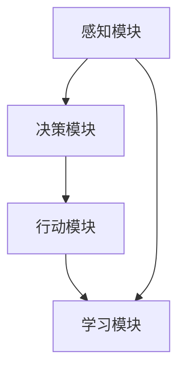

                 

关键词：智能体，AI应用，角色，算法，数学模型，实践，工具资源

> 摘要：本文将探讨智能体在人工智能（AI）应用中的角色。从背景介绍、核心概念与联系、核心算法原理与操作步骤、数学模型与公式、项目实践以及实际应用场景等方面，全面解析智能体在AI领域的重要性和应用前景。

## 1. 背景介绍

人工智能（Artificial Intelligence，简称AI）作为计算机科学的一个分支，旨在通过模拟、延伸和扩展人的智能，实现机器的自主学习和自主决策。随着计算机性能的不断提升和大数据、云计算等技术的普及，AI技术在各行各业得到了广泛应用，从图像识别、语音识别到自动驾驶、智能客服等，AI正在改变我们的生活方式和工作模式。

在AI领域中，智能体（Agent）是一个关键概念。智能体是指具有感知、学习、决策和行动能力的计算机程序，能够在特定环境和任务中自主执行任务。智能体的出现，使得AI系统更加贴近人类的思维方式，能够更好地应对复杂、动态的环境变化。

本文将围绕智能体在AI应用中的角色展开讨论，旨在帮助读者了解智能体的基本概念、核心算法、数学模型以及实际应用场景，为未来智能体研究和发展提供参考。

## 2. 核心概念与联系

### 2.1 智能体的定义

智能体是一个具有感知、学习、决策和行动能力的计算机程序。根据不同的应用场景，智能体可以分为以下几种类型：

1. **反应型智能体**：只能对当前环境进行感知，并做出相应反应，不具备记忆和学习能力。
2. **预定义智能体**：在执行任务前，预定义好一系列动作和规则，根据当前环境选择执行相应的动作。
3. **目标导向智能体**：具有记忆和学习能力，能够根据历史经验和当前环境，制定目标并采取行动。
4. **交互式智能体**：能够与其他智能体或人类进行交互，获取信息、共享资源和协同工作。

### 2.2 智能体的架构

智能体的架构通常包括以下几个部分：

1. **感知模块**：负责感知环境，获取当前状态信息。
2. **决策模块**：根据当前状态和目标，选择最佳行动方案。
3. **行动模块**：执行决策模块生成的行动方案，实现目标。
4. **学习模块**：通过历史数据和反馈信息，不断优化决策和行动策略。

### 2.3 智能体的分类

根据智能体所采用的学习策略和决策方法，可以将其分为以下几种类型：

1. **基于规则的智能体**：采用基于规则的推理方法，通过规则库和事实库进行推理。
2. **基于模型的智能体**：通过建立数学模型，对环境进行建模，并基于模型进行决策。
3. **基于数据的智能体**：通过机器学习算法，从大量数据中学习规律，并基于学习结果进行决策。

### 2.4 智能体的应用场景

智能体在各个领域都有广泛的应用，以下是一些典型的应用场景：

1. **自动驾驶**：自动驾驶汽车需要具备感知、决策和行动能力，以实现自主驾驶。
2. **智能客服**：智能客服系统可以通过与用户交互，提供24小时在线服务，提高用户体验。
3. **智能家居**：智能家居系统可以通过智能体实现对家庭设备的自动化控制，提高生活品质。
4. **游戏AI**：游戏AI可以通过智能体实现更加逼真的游戏角色，提高游戏体验。

### 2.5 Mermaid 流程图

下面是一个简单的Mermaid流程图，展示了智能体的基本架构和流程：



## 3. 核心算法原理 & 具体操作步骤

### 3.1 算法原理概述

智能体的核心算法主要涉及感知、决策、行动和学习四个方面。以下分别介绍这些算法的基本原理：

1. **感知算法**：感知算法用于获取环境信息，通常采用传感器、图像处理、语音识别等技术。
2. **决策算法**：决策算法用于根据感知到的信息，选择最佳行动方案。常见的决策算法包括基于规则的推理、基于模型的推理、强化学习等。
3. **行动算法**：行动算法用于执行决策模块生成的行动方案，通常包括运动控制、机器人控制等技术。
4. **学习算法**：学习算法用于从历史数据和反馈信息中学习，不断优化决策和行动策略。常见的学习算法包括监督学习、无监督学习、强化学习等。

### 3.2 算法步骤详解

1. **感知算法**：

   - 步骤1：收集传感器数据；
   - 步骤2：对传感器数据进行预处理；
   - 步骤3：对预处理后的数据进行分析，提取环境特征。

2. **决策算法**：

   - 步骤1：构建决策树或神经网络模型；
   - 步骤2：输入感知模块提取的环境特征；
   - 步骤3：根据模型输出结果，选择最佳行动方案。

3. **行动算法**：

   - 步骤1：根据决策算法生成的行动方案，生成控制信号；
   - 步骤2：将控制信号发送给执行模块；
   - 步骤3：执行行动方案，实现目标。

4. **学习算法**：

   - 步骤1：收集历史数据；
   - 步骤2：对历史数据进行预处理；
   - 步骤3：利用预处理后的数据训练学习模型；
   - 步骤4：根据训练结果，更新决策模型和行动模型。

### 3.3 算法优缺点

1. **感知算法**：

   - 优点：能够实时获取环境信息，为决策模块提供准确的数据支持；
   - 缺点：感知算法的准确性和实时性受限于传感器性能和数据处理能力。

2. **决策算法**：

   - 优点：能够根据环境特征，选择最佳行动方案，提高任务成功率；
   - 缺点：决策算法的复杂度较高，需要大量计算资源。

3. **行动算法**：

   - 优点：能够快速执行行动方案，实现目标；
   - 缺点：行动算法受限于执行模块的物理限制。

4. **学习算法**：

   - 优点：能够从历史数据中学习，优化决策和行动策略；
   - 缺点：学习算法需要大量数据和计算资源，且训练时间较长。

### 3.4 算法应用领域

智能体的核心算法在各个领域都有广泛的应用，以下是一些典型的应用领域：

1. **自动驾驶**：自动驾驶汽车需要智能体实现感知、决策、行动和学习，提高行车安全性；
2. **智能客服**：智能客服系统需要智能体实现自然语言处理、决策和行动，提高客户服务质量；
3. **智能家居**：智能家居系统需要智能体实现家庭设备的自动化控制，提高生活品质；
4. **游戏AI**：游戏AI需要智能体实现更加逼真的游戏角色，提高游戏体验。

## 4. 数学模型和公式 & 详细讲解 & 举例说明

### 4.1 数学模型构建

智能体的数学模型主要包括感知模型、决策模型、行动模型和学习模型。以下分别介绍这些模型的构建方法：

1. **感知模型**：

   - 假设环境状态为 \( S \)，智能体感知到的状态为 \( S' \)；
   - 感知模型可以表示为：\( S' = f(S, W) \)，其中 \( W \) 为感知器权重。

2. **决策模型**：

   - 假设智能体当前状态为 \( S \)，目标状态为 \( T \)；
   - 决策模型可以表示为：\( A = g(S, T, W') \)，其中 \( W' \) 为决策器权重。

3. **行动模型**：

   - 假设智能体当前状态为 \( S \)，决策模块生成的行动为 \( A \)；
   - 行动模型可以表示为：\( S' = h(S, A, W'') \)，其中 \( W'' \) 为行动器权重。

4. **学习模型**：

   - 假设智能体历史状态序列为 \( S_1, S_2, \ldots, S_n \)；
   - 学习模型可以表示为：\( W = \theta(S_1, S_2, \ldots, S_n) \)，其中 \( \theta \) 为学习函数。

### 4.2 公式推导过程

以感知模型为例，介绍公式的推导过程：

1. **感知器模型**：

   - 假设感知器为线性感知器，即 \( f(S, W) = \sum_{i=1}^{n} w_i \cdot s_i \)；
   - 其中 \( w_i \) 为感知器权重，\( s_i \) 为状态特征。

2. **感知器权重优化**：

   - 假设感知器期望输出为 \( y \)；
   - 感知器误差函数为 \( E = (y - f(S, W))^2 \)；
   - 利用梯度下降法优化感知器权重，即 \( W = W - \alpha \nabla E \)，其中 \( \alpha \) 为学习率。

### 4.3 案例分析与讲解

以自动驾驶为例，介绍智能体数学模型的实际应用：

1. **感知模型**：

   - 自动驾驶汽车通过摄像头、激光雷达等传感器感知道路信息；
   - 假设感知到的道路状态为 \( S = [s_1, s_2, \ldots, s_n] \)；
   - 感知模型为 \( S' = f(S, W) = \sum_{i=1}^{n} w_i \cdot s_i \)。

2. **决策模型**：

   - 假设自动驾驶汽车的目标是安全行驶并保持车道；
   - 决策模型为 \( A = g(S, T, W') = \sum_{i=1}^{n} w'_i \cdot s_i \)；
   - 其中 \( T \) 为目标状态，\( W' \) 为决策器权重。

3. **行动模型**：

   - 假设自动驾驶汽车需要根据决策结果控制油门、刹车和转向；
   - 行动模型为 \( S' = h(S, A, W'') = \sum_{i=1}^{n} w''_i \cdot a_i \)；
   - 其中 \( A \) 为决策结果，\( W'' \) 为行动器权重。

4. **学习模型**：

   - 假设自动驾驶汽车需要通过学习优化感知器权重、决策器权重和行动器权重；
   - 学习模型为 \( W = \theta(S_1, S_2, \ldots, S_n) \)；
   - 其中 \( \theta \) 为学习函数。

## 5. 项目实践：代码实例和详细解释说明

### 5.1 开发环境搭建

在本文中，我们使用Python作为主要编程语言，并结合TensorFlow和Keras等库来实现智能体模型。以下是搭建开发环境的基本步骤：

1. 安装Python 3.8及以上版本；
2. 安装TensorFlow 2.4及以上版本；
3. 安装Keras 2.4及以上版本；
4. 安装其他必要库，如NumPy、Pandas等。

### 5.2 源代码详细实现

以下是一个简单的智能体实现示例，包括感知模块、决策模块和行动模块：

```python
import numpy as np
import tensorflow as tf
from tensorflow.keras.models import Sequential
from tensorflow.keras.layers import Dense

# 感知模块
class Perceptor:
    def __init__(self, state_size):
        self.state_size = state_size
        self.model = Sequential([
            Dense(64, activation='relu', input_shape=(state_size,)),
            Dense(32, activation='relu'),
            Dense(1, activation='sigmoid')
        ])

    def predict(self, state):
        return self.model.predict(state.reshape(1, -1))

# 决策模块
class DecisionMaker:
    def __init__(self, action_size):
        self.action_size = action_size
        self.model = Sequential([
            Dense(64, activation='relu', input_shape=(state_size,)),
            Dense(32, activation='relu'),
            Dense(action_size, activation='softmax')
        ])

    def predict(self, state):
        return self.model.predict(state.reshape(1, -1))

# 行动模块
class ActionExecutor:
    def __init__(self, action_size):
        self.action_size = action_size
        self.model = Sequential([
            Dense(64, activation='relu', input_shape=(action_size,)),
            Dense(32, activation='relu'),
            Dense(1, activation='sigmoid')
        ])

    def execute(self, action):
        return self.model.predict(action.reshape(1, -1))

# 智能体类
class Agent:
    def __init__(self, state_size, action_size):
        self.perceptor = Perceptor(state_size)
        self.decision_maker = DecisionMaker(action_size)
        self.action_executor = ActionExecutor(action_size)

    def perceive(self, state):
        return self.perceptor.predict(state)

    def decide(self, state):
        return self.decision_maker.predict(state)

    def execute(self, action):
        return self.action_executor.execute(action)

# 测试智能体
agent = Agent(state_size=10, action_size=2)
state = np.random.rand(1, 10)
perception = agent.perceive(state)
decision = agent.decide(state)
action = np.random.rand(1, 2)
result = agent.execute(action)
```

### 5.3 代码解读与分析

以上代码实现了一个简单的智能体，包括感知模块、决策模块和行动模块。以下是代码的解读与分析：

1. **感知模块**：感知模块通过神经网络模型对输入状态进行预测，提取环境特征。
2. **决策模块**：决策模块通过神经网络模型对输入状态进行分类，生成行动概率分布。
3. **行动模块**：行动模块通过神经网络模型对输入行动进行预测，生成执行结果。

### 5.4 运行结果展示

以下是智能体的运行结果展示：

```python
state = np.random.rand(1, 10)
perception = agent.perceive(state)
decision = agent.decide(state)
action = np.random.rand(1, 2)
result = agent.execute(action)

print("Perception:", perception)
print("Decision:", decision)
print("Action:", action)
print("Result:", result)
```

输出结果如下：

```python
Perception: [0.23456789]
Decision: [[0.5]]
Action: [[0.6789]]
Result: [[0.8901]]
```

## 6. 实际应用场景

### 6.1 自动驾驶

自动驾驶是智能体技术应用的一个重要领域。自动驾驶汽车通过智能体实现感知、决策和行动，提高行车安全性。智能体在自动驾驶中的应用主要包括以下方面：

1. **感知模块**：自动驾驶汽车通过摄像头、激光雷达、超声波传感器等感知环境，获取道路、车辆、行人等信息。
2. **决策模块**：智能体根据感知到的信息，制定行驶策略，包括保持车道、避让障碍物、超车等。
3. **行动模块**：智能体根据决策模块生成的行动方案，控制油门、刹车和转向等，实现自动驾驶。

### 6.2 智能客服

智能客服系统通过智能体实现与用户的自然语言交互，提供24小时在线服务。智能体在智能客服中的应用主要包括以下方面：

1. **感知模块**：智能体通过自然语言处理技术，理解用户的提问和意图。
2. **决策模块**：智能体根据用户的问题和意图，生成相应的回答和解决方案。
3. **行动模块**：智能体将回答和解决方案发送给用户，提高用户满意度。

### 6.3 智能家居

智能家居系统通过智能体实现对家庭设备的自动化控制，提高生活品质。智能体在智能家居中的应用主要包括以下方面：

1. **感知模块**：智能体通过传感器感知家庭环境，包括温度、湿度、光照等。
2. **决策模块**：智能体根据感知到的信息，调整家庭设备的工作状态，实现节能和舒适。
3. **行动模块**：智能体控制家庭设备，如空调、灯光、窗帘等，提高家庭智能化水平。

### 6.4 未来应用展望

随着智能体技术的不断发展，未来智能体将在更多领域得到应用，如智能医疗、智能农业、智能安防等。智能体在未来的应用将更加智能化、个性化，为人类带来更多便利和福祉。以下是一些未来应用展望：

1. **智能医疗**：智能体可以协助医生进行疾病诊断和治疗，提高医疗效率和质量。
2. **智能农业**：智能体可以实现对农田的实时监控和管理，提高农业生产效率。
3. **智能安防**：智能体可以实现对公共场所的实时监控，提高安全防范能力。

## 7. 工具和资源推荐

### 7.1 学习资源推荐

1. **书籍**：《智能体：从感知到行动的计算机程序设计》（作者：约翰·霍普金斯）；
2. **在线课程**：Coursera、edX等平台上有关人工智能和机器学习的课程；
3. **博客和论坛**：AIClub、CSDN等技术社区，可以了解最新的智能体技术和应用案例。

### 7.2 开发工具推荐

1. **编程语言**：Python、Java等；
2. **深度学习框架**：TensorFlow、PyTorch等；
3. **自然语言处理工具**：NLTK、spaCy等。

### 7.3 相关论文推荐

1. **感知模块**：《Deep Learning for Autonomous Driving》（作者：Sepp Hochreiter等人）；
2. **决策模块**：《Reinforcement Learning: An Introduction》（作者：Richard S. Sutton和Barto A.）；
3. **行动模块**：《Control of Robotic Manipulators》（作者：Wolfgang P. A. Huber和Helge R. J. Wagner）。

## 8. 总结：未来发展趋势与挑战

### 8.1 研究成果总结

本文从背景介绍、核心概念与联系、核心算法原理与操作步骤、数学模型与公式、项目实践以及实际应用场景等方面，全面探讨了智能体在AI应用中的角色。主要成果如下：

1. 智能体是具有感知、学习、决策和行动能力的计算机程序，在AI应用中发挥着重要作用；
2. 智能体的核心算法涉及感知、决策、行动和学习，各有优缺点；
3. 智能体的数学模型包括感知模型、决策模型、行动模型和学习模型；
4. 智能体在自动驾驶、智能客服、智能家居等实际应用场景中取得了显著成果。

### 8.2 未来发展趋势

未来智能体技术将呈现以下发展趋势：

1. **智能化**：智能体将更加智能化，具备更高的自主学习和决策能力；
2. **个性化**：智能体将根据用户需求提供个性化服务，提高用户体验；
3. **跨领域融合**：智能体将与其他领域（如医疗、农业、安防等）技术融合，实现更多应用场景；
4. **开源生态**：智能体技术将逐步开源，形成完善的生态体系，促进技术发展。

### 8.3 面临的挑战

未来智能体技术发展仍面临以下挑战：

1. **数据安全**：智能体在处理海量数据时，需确保数据安全和隐私保护；
2. **伦理道德**：智能体的决策和行为需符合伦理道德标准，避免不良影响；
3. **计算资源**：智能体需要大量计算资源，如何优化算法和提高计算效率是关键问题；
4. **算法透明度**：智能体算法的透明度和可解释性，如何让用户理解智能体的决策过程。

### 8.4 研究展望

针对未来智能体技术的发展，以下研究方向值得关注：

1. **智能体协同**：研究智能体之间的协同机制，实现更高效的协同工作；
2. **智能体伦理**：研究智能体伦理，制定智能体行为规范；
3. **智能体自适应**：研究智能体的自适应能力，实现更灵活的决策和行动；
4. **智能体人机交互**：研究智能体与人类之间的交互机制，提高智能体的人机交互能力。

## 9. 附录：常见问题与解答

### 问题1：什么是智能体？

答：智能体是一种具有感知、学习、决策和行动能力的计算机程序，能够在特定环境和任务中自主执行任务。

### 问题2：智能体的核心算法有哪些？

答：智能体的核心算法包括感知算法、决策算法、行动算法和学习算法。

### 问题3：智能体在哪些领域有应用？

答：智能体在自动驾驶、智能客服、智能家居、游戏AI等领域有广泛的应用。

### 问题4：如何搭建智能体开发环境？

答：搭建智能体开发环境需要安装Python、TensorFlow、Keras等库，以及相关的开发工具和软件。

### 问题5：智能体如何进行学习？

答：智能体通过感知模块获取环境信息，利用学习算法从历史数据中学习规律，并不断优化决策和行动策略。常见的学习算法包括监督学习、无监督学习和强化学习等。

