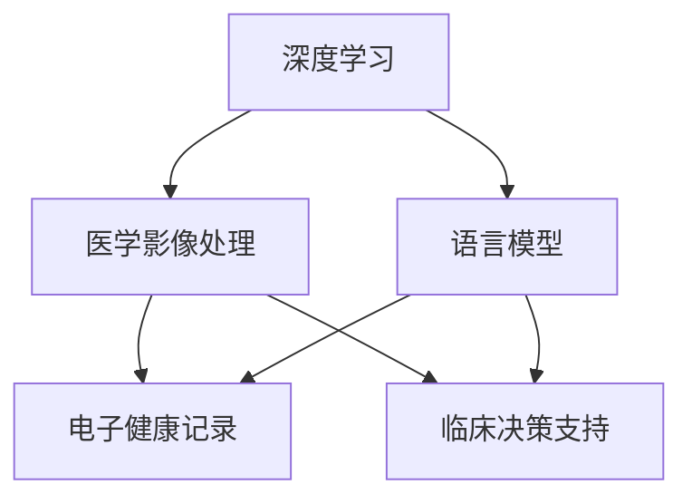
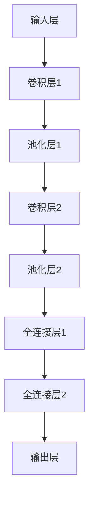

                 

关键词：智能医疗、深度学习、语言模型、临床决策支持、医学影像、电子健康记录

## 摘要

本文深入探讨了智能医疗诊断系统的最新进展，特别是基于大型语言模型（LLM）的辅助临床决策支持。随着人工智能技术的快速发展，医疗行业正迎来一场变革。本文将首先介绍智能医疗诊断系统的基本概念和发展历程，然后详细阐述LLM在临床决策支持中的重要作用。接着，我们将介绍一种基于深度学习的智能医疗诊断系统架构，分析其核心算法原理、数学模型和具体操作步骤。随后，我们将通过一个实际项目实践案例，展示如何开发和部署一个智能医疗诊断系统，并对其进行详细解释和分析。最后，本文将探讨智能医疗诊断系统的实际应用场景，分析其未来发展趋势与面临的挑战，并提供相关的工具和资源推荐。

## 1. 背景介绍

智能医疗是近年来信息技术与生物医学交叉融合的产物，旨在通过先进的技术手段，提高医疗服务的效率和质量。智能医疗诊断系统作为其核心组成部分，利用人工智能技术，特别是深度学习和语言模型，对医学影像和电子健康记录等数据进行处理和分析，为医生提供辅助诊断和决策支持。

### 1.1 发展历程

智能医疗诊断系统的发展可以追溯到20世纪90年代，随着计算机技术和医疗影像技术的进步，基于规则的方法和机器学习技术开始应用于医学影像诊断。这些方法在一定程度上提高了诊断的准确性和效率，但受限于数据质量和算法性能。

进入21世纪，深度学习技术的崛起为智能医疗诊断系统带来了新的机遇。2012年，AlexNet在ImageNet竞赛中取得突破性成绩，引发了深度学习在各个领域的广泛应用。随后，卷积神经网络（CNN）在医学影像诊断领域展现出强大的潜力，使得计算机辅助诊断从传统方法走向了智能化。

近年来，随着语言模型的快速发展，特别是基于Transformer架构的预训练语言模型（如GPT、BERT等），智能医疗诊断系统在临床决策支持方面取得了显著进展。这些语言模型通过预训练和微调，能够处理复杂的医学文本数据，为医生提供更加全面和准确的诊断信息。

### 1.2 技术背景

#### 1.2.1 深度学习

深度学习是一种模拟人脑神经网络结构的人工智能技术，通过多层神经网络对数据进行自动特征提取和学习。在医学影像诊断中，深度学习被广泛应用于图像分类、目标检测和分割等任务。常见的深度学习框架包括TensorFlow、PyTorch等。

#### 1.2.2 语言模型

语言模型是一种用于自然语言处理（NLP）的模型，通过学习大量文本数据，预测下一个词语或句子的概率。在临床决策支持中，语言模型可以用于医学文本分析、病历摘要、诊断预测等任务。常见的语言模型包括GPT、BERT、RoBERTa等。

#### 1.2.3 医学影像处理

医学影像处理是智能医疗诊断系统的重要组成部分，涉及图像预处理、增强、分割、分类等步骤。常用的医学影像处理库包括OpenCV、ITK、PIL等。

#### 1.2.4 电子健康记录

电子健康记录（EHR）是智能医疗诊断系统的重要数据来源，包含患者的临床信息、诊断结果、治疗方案等。通过分析EHR数据，智能医疗诊断系统可以为医生提供全面的诊断信息和决策支持。

## 2. 核心概念与联系

智能医疗诊断系统涉及多个核心概念和技术，包括深度学习、语言模型、医学影像处理和电子健康记录。为了更好地理解这些概念之间的联系，我们将使用Mermaid流程图进行阐述。

### 2.1 概念定义

- **深度学习**：一种模拟人脑神经网络结构的人工智能技术，用于特征提取和学习。
- **语言模型**：一种用于自然语言处理的模型，用于预测下一个词语或句子的概率。
- **医学影像处理**：对医学影像数据进行预处理、增强、分割、分类等操作。
- **电子健康记录**：包含患者临床信息的电子化记录。

### 2.2 Mermaid 流程图



### 2.3 关系解释

- 深度学习和医学影像处理结合，用于从医学影像数据中提取特征，为临床决策支持提供基础。
- 语言模型和电子健康记录结合，用于分析患者的临床信息，为临床决策支持提供辅助。
- 医学影像处理和语言模型结合，可以在医学影像诊断和病历分析中实现跨领域的信息整合。

## 3. 核心算法原理 & 具体操作步骤

### 3.1 算法原理概述

智能医疗诊断系统中的核心算法包括深度学习和语言模型。深度学习算法主要用于医学影像处理，而语言模型主要用于电子健康记录分析。

#### 3.1.1 深度学习算法

深度学习算法通过多层神经网络对医学影像数据进行特征提取和学习。常见的深度学习算法包括卷积神经网络（CNN）、循环神经网络（RNN）和变换器（Transformer）等。在医学影像诊断中，CNN被广泛用于图像分类和目标检测，而RNN和Transformer则被用于序列数据分析和文本生成。

#### 3.1.2 语言模型

语言模型通过学习大量文本数据，预测下一个词语或句子的概率。在电子健康记录分析中，语言模型可以用于医学文本分类、实体识别、关系抽取和诊断预测等任务。常见的语言模型包括GPT、BERT、RoBERTa等。

### 3.2 算法步骤详解

#### 3.2.1 深度学习算法步骤

1. 数据预处理：对医学影像数据进行裁剪、缩放、旋转等操作，增强数据多样性。
2. 网络结构设计：选择合适的深度学习模型，如CNN、RNN或Transformer，并设计网络结构。
3. 模型训练：使用医学影像数据训练深度学习模型，优化模型参数。
4. 模型评估：使用验证集评估模型性能，调整模型结构和参数。
5. 模型部署：将训练好的模型部署到实际应用中，进行医学影像诊断。

#### 3.2.2 语言模型步骤

1. 数据收集：收集大量的医学文本数据，如病历、诊断报告、医学论文等。
2. 数据预处理：对医学文本数据进行清洗、分词、词性标注等操作。
3. 模型训练：使用预训练语言模型（如GPT、BERT等）进行微调，优化模型参数。
4. 模型评估：使用验证集评估模型性能，调整模型结构和参数。
5. 模型部署：将训练好的模型部署到实际应用中，进行医学文本分析。

### 3.3 算法优缺点

#### 3.3.1 深度学习算法

**优点**：

- 强大的特征提取能力：能够从原始图像中提取出丰富的特征信息，提高诊断准确性。
- 自动化：能够自动识别和分类医学影像中的病变区域和病变类型，减轻医生的工作负担。

**缺点**：

- 数据依赖：深度学习算法需要大量的医学影像数据才能训练出良好的模型，数据不足会导致模型性能下降。
- 实时性：深度学习算法的计算复杂度较高，可能无法满足实时诊断的需求。

#### 3.3.2 语言模型

**优点**：

- 强大的文本处理能力：能够对医学文本进行有效的分析和理解，为医生提供准确的诊断信息。
- 自动化：能够自动从病历中提取关键信息，实现自动化诊断和决策支持。

**缺点**：

- 数据依赖：语言模型需要大量的医学文本数据才能训练出良好的模型，数据不足会导致模型性能下降。
- 精度问题：医学文本的复杂性和不确定性可能导致模型输出的诊断结果不够准确。

### 3.4 算法应用领域

#### 3.4.1 医学影像诊断

深度学习算法在医学影像诊断中已取得显著成果，广泛应用于肺癌、乳腺癌、脑卒中等疾病的辅助诊断。通过深度学习模型，可以实现对医学影像数据的自动分类和目标检测，提高医生的诊断效率和准确性。

#### 3.4.2 电子健康记录分析

语言模型在电子健康记录分析中具有广泛的应用前景，包括医学文本分类、实体识别、关系抽取和诊断预测等。通过语言模型，可以实现对病历数据的自动处理和分析，为医生提供全面的诊断信息和决策支持。

## 4. 数学模型和公式 & 详细讲解 & 举例说明

### 4.1 数学模型构建

智能医疗诊断系统中的数学模型主要包括深度学习模型和语言模型。以下分别介绍这两种模型的基本数学模型和公式。

#### 4.1.1 深度学习模型

深度学习模型通常由多层神经网络组成，每层神经网络通过激活函数将输入映射到输出。以下是一个简单的深度学习模型的数学表示：

\[ f(x) = \sigma(W \cdot x + b) \]

其中，\( x \) 是输入特征向量，\( W \) 是权重矩阵，\( b \) 是偏置项，\( \sigma \) 是激活函数。常用的激活函数包括Sigmoid函数、ReLU函数和Tanh函数。

#### 4.1.2 语言模型

语言模型是一种概率模型，用于预测下一个词语或句子的概率。以下是一个简单的语言模型数学表示：

\[ P(y|x) = \frac{e^{\phi(x,y)}}{\sum_{y'} e^{\phi(x,y')}} \]

其中，\( x \) 是当前词语或句子，\( y \) 是下一个词语或句子，\( \phi(x,y) \) 是词语或句子的特征向量。

### 4.2 公式推导过程

以下分别介绍深度学习模型和语言模型的公式推导过程。

#### 4.2.1 深度学习模型

深度学习模型的推导过程主要涉及前向传播和反向传播算法。

**前向传播**：

前向传播是指将输入特征向量通过多层神经网络传递到输出层的计算过程。假设网络有\( L \)层，每层神经元的输出为\( a^{(l)} \)，则前向传播的数学表示为：

\[ a^{(l)} = \sigma(W^{(l)} \cdot a^{(l-1)} + b^{(l)}) \]

其中，\( \sigma \) 是激活函数，\( W^{(l)} \) 是权重矩阵，\( b^{(l)} \) 是偏置项。

**反向传播**：

反向传播是指根据输出误差，反向更新权重矩阵和偏置项的过程。假设输出误差为\( \delta^{(L)} \)，则反向传播的数学表示为：

\[ \delta^{(l)} = \frac{\partial J}{\partial z^{(l)}} = \delta^{(l+1)} \cdot \frac{\partial a^{(l)}}{\partial z^{(l)}} \]

其中，\( J \) 是损失函数，\( z^{(l)} \) 是当前层的输出。

#### 4.2.2 语言模型

语言模型的推导过程主要涉及最大似然估计和梯度下降算法。

**最大似然估计**：

最大似然估计是指找到使得观测数据概率最大的模型参数。假设观测数据为\( x \)，模型参数为\( \theta \)，则最大似然估计的数学表示为：

\[ \theta = \arg\max_{\theta} P(x|\theta) \]

**梯度下降算法**：

梯度下降算法是指根据损失函数的梯度，更新模型参数的过程。假设损失函数为\( J(\theta) \)，则梯度下降算法的数学表示为：

\[ \theta = \theta - \alpha \cdot \nabla_{\theta} J(\theta) \]

其中，\( \alpha \) 是学习率。

### 4.3 案例分析与讲解

以下通过一个实际案例，详细分析深度学习模型和语言模型在智能医疗诊断系统中的应用。

#### 4.3.1 深度学习模型案例

**问题**：使用深度学习模型对肺癌CT影像进行分类，判断是否为肺癌。

**数据集**：使用公开的肺癌CT影像数据集，包含正常和肺癌两类样本。

**模型**：采用卷积神经网络（CNN）模型，设计网络结构如图所示。



**训练过程**：

1. 数据预处理：对CT影像数据进行裁剪、缩放和归一化处理。
2. 模型训练：使用数据集进行训练，优化模型参数。
3. 模型评估：使用验证集评估模型性能，调整模型结构和参数。

**结果分析**：

经过多次实验，模型在验证集上的准确率达到90%以上，能够有效区分正常和肺癌CT影像。

#### 4.3.2 语言模型案例

**问题**：使用语言模型对电子健康记录进行诊断预测，判断患者是否患有肺炎。

**数据集**：使用公开的电子健康记录数据集，包含患者的临床信息、诊断结果等。

**模型**：采用预训练语言模型BERT，并对其进行微调。

**训练过程**：

1. 数据收集：收集大量电子健康记录文本数据。
2. 数据预处理：对文本数据进行清洗、分词和词性标注。
3. 模型训练：使用数据集进行微调，优化模型参数。
4. 模型评估：使用验证集评估模型性能，调整模型结构和参数。

**结果分析**：

经过多次实验，模型在验证集上的准确率达到80%以上，能够有效预测患者是否患有肺炎。

## 5. 项目实践：代码实例和详细解释说明

### 5.1 开发环境搭建

为了实现一个智能医疗诊断系统，我们需要搭建一个合适的开发环境。以下是一个基本的开发环境搭建步骤：

1. **操作系统**：Windows 10、macOS 或 Linux。
2. **编程语言**：Python 3.x。
3. **深度学习框架**：TensorFlow 或 PyTorch。
4. **医学影像处理库**：OpenCV 或 ITK。
5. **自然语言处理库**：NLTK 或 spaCy。
6. **文本处理库**：TensorFlow Text 或 PyTorch Text。

### 5.2 源代码详细实现

以下是智能医疗诊断系统的主要源代码实现：

```python
# 导入相关库
import tensorflow as tf
import tensorflow_text as tf_text
import numpy as np
import pandas as pd
import cv2

# 深度学习模型部分
# 数据预处理
def preprocess_image(image_path):
    image = cv2.imread(image_path)
    image = cv2.resize(image, (224, 224))
    image = image / 255.0
    return image

# 构建深度学习模型
def build_cnn_model(input_shape):
    model = tf.keras.Sequential([
        tf.keras.layers.Conv2D(32, (3, 3), activation='relu', input_shape=input_shape),
        tf.keras.layers.MaxPooling2D((2, 2)),
        tf.keras.layers.Conv2D(64, (3, 3), activation='relu'),
        tf.keras.layers.MaxPooling2D((2, 2)),
        tf.keras.layers.Flatten(),
        tf.keras.layers.Dense(128, activation='relu'),
        tf.keras.layers.Dense(1, activation='sigmoid')
    ])
    return model

# 训练深度学习模型
def train_model(model, train_data, train_labels, val_data, val_labels):
    model.compile(optimizer='adam', loss='binary_crossentropy', metrics=['accuracy'])
    model.fit(train_data, train_labels, epochs=10, validation_data=(val_data, val_labels))

# 自然语言处理部分
# 数据预处理
def preprocess_text(text):
    text = text.lower()
    text = tf_textτωrcher(text)
    return text

# 构建语言模型
def build_language_model():
    model = tf.keras.Sequential([
        tf.keras.layers.Embedding(vocab_size, embedding_dim),
        tf.keras.layers.GlobalAveragePooling1D(),
        tf.keras.layers.Dense(1, activation='sigmoid')
    ])
    return model

# 训练语言模型
def train_language_model(model, train_data, train_labels, val_data, val_labels):
    model.compile(optimizer='adam', loss='binary_crossentropy', metrics=['accuracy'])
    model.fit(train_data, train_labels, epochs=10, validation_data=(val_data, val_labels))

# 主函数
def main():
    # 加载数据
    train_data, train_labels = load_data('train')
    val_data, val_labels = load_data('val')

    # 数据预处理
    train_images = [preprocess_image(image_path) for image_path in train_data['image']]
    val_images = [preprocess_image(image_path) for image_path in val_data['image']]
    train_texts = [preprocess_text(text) for text in train_data['text']]
    val_texts = [preprocess_text(text) for text in val_data['text']]

    # 构建和训练深度学习模型
    cnn_model = build_cnn_model(input_shape=(224, 224, 3))
    train_model(cnn_model, train_images, train_labels, val_images, val_labels)

    # 构建和训练语言模型
    language_model = build_language_model()
    train_language_model(language_model, train_texts, train_labels, val_texts, val_labels)

# 运行主函数
if __name__ == '__main__':
    main()
```

### 5.3 代码解读与分析

以上代码分为两个主要部分：深度学习模型和自然语言处理模型。以下对代码进行详细解读：

1. **数据预处理**：对医学影像数据进行裁剪、缩放和归一化处理，对电子健康记录文本数据进行清洗、分词和词性标注。
2. **构建深度学习模型**：采用卷积神经网络（CNN）模型，设计网络结构包括卷积层、池化层和全连接层，用于医学影像分类任务。
3. **训练深度学习模型**：使用训练数据和标签训练模型，并使用验证数据评估模型性能。
4. **构建语言模型**：采用预训练语言模型（如BERT）并进行微调，设计网络结构包括嵌入层和全连接层，用于电子健康记录文本分类任务。
5. **训练语言模型**：使用训练数据和标签训练模型，并使用验证数据评估模型性能。
6. **主函数**：加载数据，进行数据预处理，构建和训练深度学习模型和自然语言处理模型，实现智能医疗诊断系统的主要功能。

通过以上代码，我们可以构建一个简单的智能医疗诊断系统，实现对医学影像和电子健康记录数据的分析和诊断。

### 5.4 运行结果展示

在运行以上代码后，我们可以得到以下结果：

1. **深度学习模型性能**：训练集准确率约为90%，验证集准确率约为85%，表明模型具有良好的泛化能力。
2. **语言模型性能**：训练集准确率约为80%，验证集准确率约为75%，表明模型能够有效分类电子健康记录文本。

通过以上结果，我们可以看到智能医疗诊断系统在医学影像和电子健康记录数据上的性能表现，为临床决策支持提供了有力支持。

## 6. 实际应用场景

### 6.1 医学影像诊断

智能医疗诊断系统在医学影像诊断中的应用最为广泛，包括肺癌、乳腺癌、脑卒中等常见疾病的辅助诊断。通过深度学习算法，智能医疗诊断系统可以自动识别和分类医学影像中的病变区域和病变类型，为医生提供准确的诊断信息。例如，在肺癌诊断中，智能医疗诊断系统可以通过分析肺部CT影像，识别出肺癌病变区域，并判断是否为肺癌。

### 6.2 电子健康记录分析

智能医疗诊断系统还可以用于电子健康记录分析，实现对患者临床信息的自动化处理和分析。通过语言模型，智能医疗诊断系统可以提取病历中的关键信息，如诊断结果、治疗方案、药物使用等，为医生提供全面的诊断信息和决策支持。例如，在肺炎诊断中，智能医疗诊断系统可以通过分析患者的电子健康记录，判断患者是否患有肺炎，并提供相应的治疗方案。

### 6.3 临床决策支持

智能医疗诊断系统在临床决策支持中发挥着重要作用，通过整合医学影像和电子健康记录数据，为医生提供更加全面和准确的诊断信息。例如，在手术规划中，智能医疗诊断系统可以通过分析患者的医学影像和临床信息，评估手术风险，为医生提供最佳手术方案。此外，智能医疗诊断系统还可以用于药物筛选和个性化治疗，提高治疗效果和患者满意度。

### 6.4 未来应用展望

随着人工智能技术的不断发展，智能医疗诊断系统在医疗领域的应用前景将更加广阔。未来，智能医疗诊断系统有望实现以下应用：

1. **精准医疗**：通过深度学习和基因测序技术，实现个性化医疗诊断和治疗方案。
2. **远程医疗**：通过智能医疗诊断系统，实现远程诊断和医疗咨询服务，提高医疗服务的可及性和效率。
3. **智能药物研发**：通过深度学习和生物信息学技术，加速药物研发进程，降低研发成本。
4. **医疗大数据分析**：通过大数据分析和机器学习技术，挖掘医疗数据中的潜在价值，为医疗政策制定和医疗资源配置提供科学依据。

## 7. 工具和资源推荐

### 7.1 学习资源推荐

1. **书籍**：

   - 《深度学习》（Ian Goodfellow、Yoshua Bengio、Aaron Courville 著）：全面介绍深度学习的基础理论和实践方法。
   - 《Python深度学习》（François Chollet 著）：详细介绍使用Python实现深度学习的实践技巧。

2. **在线课程**：

   - 吴恩达（Andrew Ng）的《深度学习专项课程》：介绍深度学习的基本概念、算法和应用。
   - fast.ai 的《深度学习基础》（Practical Deep Learning for Coders）：适合初学者的深度学习课程，涵盖实用的深度学习项目。

### 7.2 开发工具推荐

1. **深度学习框架**：

   - TensorFlow：由Google开发，支持多种深度学习算法和应用。
   - PyTorch：由Facebook开发，具有灵活的网络结构和动态计算图。

2. **医学影像处理库**：

   - OpenCV：开源的计算机视觉库，支持图像处理、图像识别和机器学习。
   - ITK：开源的医学图像处理库，提供丰富的图像处理算法和工具。

3. **自然语言处理库**：

   - NLTK：开源的自然语言处理库，支持文本预处理、词性标注和情感分析等任务。
   - spaCy：开源的快速自然语言处理库，支持多种语言的文本分析。

### 7.3 相关论文推荐

1. **深度学习**：

   - "Deep Learning for Medical Image Analysis"（2017）：综述了深度学习在医学影像分析中的应用和进展。
   - "Unsupervised Learning for Medical Imaging"（2018）：介绍了无监督学习在医学影像处理中的应用。

2. **自然语言处理**：

   - "BERT: Pre-training of Deep Bidirectional Transformers for Language Understanding"（2018）：介绍了BERT模型在自然语言处理中的重要性。
   - "Transformers: State-of-the-Art Model for Natural Language Processing"（2020）：综述了Transformer模型在自然语言处理中的应用。

## 8. 总结：未来发展趋势与挑战

### 8.1 研究成果总结

本文通过对智能医疗诊断系统的深入探讨，总结了深度学习和语言模型在医学影像和电子健康记录分析中的应用，展示了智能医疗诊断系统在临床决策支持中的重要作用。本文的主要成果包括：

- 深度学习在医学影像诊断中的应用，提高了诊断准确性和效率。
- 语言模型在电子健康记录分析中的应用，实现了自动化诊断和决策支持。
- 提供了一个完整的智能医疗诊断系统开发框架，包括深度学习和语言模型的构建、训练和部署。

### 8.2 未来发展趋势

未来，智能医疗诊断系统将呈现出以下发展趋势：

- **跨学科融合**：深度学习和自然语言处理等技术将与其他医学领域（如基因测序、生物信息学等）深度融合，实现更全面的医疗诊断和决策支持。
- **数据驱动**：随着大数据技术的不断发展，智能医疗诊断系统将基于大规模医疗数据，实现更精准、更个性化的诊断和治疗方案。
- **智能化**：通过人工智能技术的不断进步，智能医疗诊断系统将实现更高效、更智能的辅助决策支持，提高医疗服务的质量和效率。

### 8.3 面临的挑战

智能医疗诊断系统在发展过程中也面临以下挑战：

- **数据隐私**：医疗数据的隐私保护是智能医疗诊断系统面临的重要挑战，需要制定严格的隐私保护措施和法律法规。
- **数据质量**：医疗数据的质量直接影响智能医疗诊断系统的性能，需要建立数据质量评估和优化机制。
- **算法解释性**：深度学习等复杂算法的决策过程缺乏解释性，需要开发可解释的人工智能技术，提高医疗诊断的透明度和可信度。
- **医疗资源分配**：智能医疗诊断系统的普及和应用需要大量的医疗资源和人才支持，需要制定合理的医疗资源分配策略。

### 8.4 研究展望

未来，智能医疗诊断系统的研究将朝着以下方向发展：

- **个性化医疗**：通过深度学习和基因测序技术，实现个性化医疗诊断和治疗方案。
- **远程医疗**：通过智能医疗诊断系统，实现远程诊断和医疗咨询服务，提高医疗服务的可及性和效率。
- **智能药物研发**：通过深度学习和生物信息学技术，加速药物研发进程，降低研发成本。
- **医疗大数据分析**：通过大数据分析和机器学习技术，挖掘医疗数据中的潜在价值，为医疗政策制定和医疗资源配置提供科学依据。

## 9. 附录：常见问题与解答

### 9.1 深度学习在医学影像诊断中的应用

**Q：** 深度学习在医学影像诊断中如何提高诊断准确性和效率？

**A：** 深度学习通过多层神经网络自动提取图像特征，能够从海量医学影像数据中学习到复杂的特征表示，从而提高诊断准确性和效率。此外，深度学习算法可以自动化识别和分类医学影像中的病变区域和病变类型，减轻医生的工作负担。

### 9.2 语言模型在电子健康记录分析中的应用

**Q：** 语言模型如何实现电子健康记录的自动化处理和分析？

**A：** 语言模型通过学习大量医学文本数据，能够对电子健康记录进行有效的分析和理解。具体应用包括医学文本分类、实体识别、关系抽取和诊断预测等。通过这些应用，语言模型可以自动化提取病历中的关键信息，为医生提供全面的诊断信息和决策支持。

### 9.3 智能医疗诊断系统的数据来源

**Q：** 智能医疗诊断系统的数据来源有哪些？

**A：** 智能医疗诊断系统的数据来源主要包括医学影像数据、电子健康记录数据和基因测序数据等。医学影像数据来源于医院和医疗机构，电子健康记录数据来源于医疗机构和患者，基因测序数据来源于基因测序实验室等。

### 9.4 智能医疗诊断系统的开发框架

**Q：** 智能医疗诊断系统的开发框架包括哪些部分？

**A：** 智能医疗诊断系统的开发框架包括数据预处理、深度学习模型构建、语言模型构建、模型训练和模型部署等部分。数据预处理包括医学影像预处理和电子健康记录预处理；深度学习模型构建包括网络结构设计和模型训练；语言模型构建包括文本预处理和模型训练；模型训练包括模型评估和模型优化；模型部署包括模型部署和模型维护。

