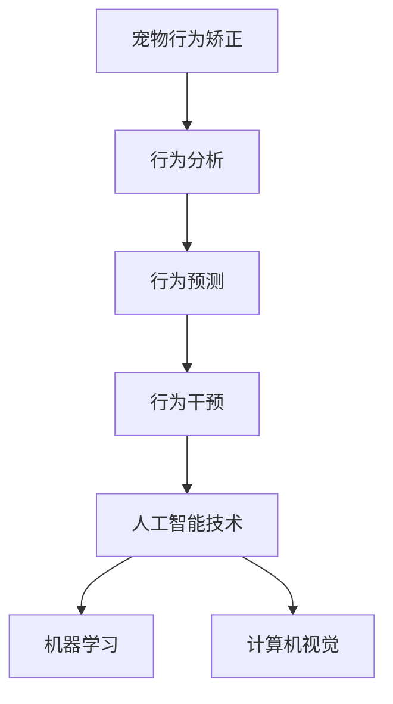

                 

关键词：智能宠物、行为矫正、创业、科学训练、人工智能、算法、数学模型、应用场景

> 摘要：随着人工智能技术的不断发展，宠物行为矫正领域迎来了新的变革。本文将探讨如何利用科学方法和人工智能技术，开展智能宠物行为矫正的创业项目，提供全面、有效的宠物训练方案。

## 1. 背景介绍

宠物作为人类的重要伙伴，与人类的情感联系日益紧密。然而，宠物行为的矫正一直是一个挑战性的问题。传统的宠物训练方法主要依赖于训练师的技能和经验，难以实现规模化、个性化的服务。随着人工智能技术的进步，尤其是机器学习和计算机视觉等领域的突破，为宠物行为矫正提供了新的解决方案。

当前，市场对智能宠物行为矫正的需求日益增长。一方面，宠物数量的增加导致宠物行为问题的增多；另一方面，宠物主人对宠物健康、幸福和生活质量的要求不断提高。因此，智能宠物行为矫正的创业项目具有巨大的市场潜力和发展空间。

## 2. 核心概念与联系

### 2.1. 宠物行为矫正的核心概念

宠物行为矫正的核心概念包括行为分析、行为预测和行为干预。行为分析是指对宠物行为进行观察、记录和分析，以识别宠物的行为问题；行为预测是指基于历史数据和行为特征，预测宠物的行为趋势；行为干预是指通过训练、指导等方式，引导宠物改变不良行为。

### 2.2. 人工智能与宠物行为矫正的联系

人工智能技术，特别是机器学习和计算机视觉，为宠物行为矫正提供了强大的工具。通过深度学习算法，可以自动识别宠物的行为模式，实现对宠物行为的实时分析和预测。计算机视觉技术则可以实现对宠物行为的高精度捕捉和识别。

### 2.3. Mermaid 流程图



## 3. 核心算法原理 & 具体操作步骤

### 3.1. 算法原理概述

智能宠物行为矫正的核心算法主要包括行为识别、行为预测和行为干预。行为识别是基于计算机视觉技术，通过图像处理和特征提取，实现对宠物行为的识别。行为预测则是基于历史数据和行为特征，使用机器学习算法进行预测。行为干预则包括训练方案的设计和执行。

### 3.2. 算法步骤详解

1. **数据收集与预处理**：收集宠物的行为数据，包括视频、音频、传感器数据等。对数据进行预处理，如去噪、缩放、归一化等，以提高数据的质量。

2. **行为识别**：使用计算机视觉技术，对预处理后的数据进行特征提取和分类，识别宠物的行为。

3. **行为预测**：使用机器学习算法，如随机森林、神经网络等，对宠物的行为进行预测。

4. **行为干预**：根据预测结果，设计训练方案，并通过实时反馈，调整训练策略。

### 3.3. 算法优缺点

- **优点**：高效、准确，能够实现实时、个性化的宠物训练。
- **缺点**：需要大量的训练数据和计算资源，且算法的准确性受到数据质量和算法设计的影响。

### 3.4. 算法应用领域

- **宠物医院**：通过智能宠物行为矫正，帮助医生更好地诊断和治疗宠物行为问题。
- **宠物店**：提供智能宠物训练服务，提升店铺的竞争力。
- **宠物主人**：为宠物主人提供便捷、高效的宠物训练方案，提高宠物的生活质量。

## 4. 数学模型和公式 & 详细讲解 & 举例说明

### 4.1. 数学模型构建

智能宠物行为矫正的数学模型主要包括行为识别模型、行为预测模型和行为干预模型。

- **行为识别模型**：使用卷积神经网络（CNN）对宠物行为进行识别。
- **行为预测模型**：使用时间序列模型，如长短期记忆网络（LSTM），对宠物行为进行预测。
- **行为干预模型**：使用强化学习算法，如深度Q网络（DQN），设计训练方案。

### 4.2. 公式推导过程

- **行为识别模型**：使用CNN对图像进行特征提取和分类。
  $$ f(x) = \sigma(W \cdot x + b) $$
  其中，$f(x)$为输出特征，$\sigma$为激活函数，$W$为权重矩阵，$b$为偏置。

- **行为预测模型**：使用LSTM对时间序列进行建模。
  $$ h_t = \sigma(W_h \cdot [h_{t-1}, x_t] + b_h) $$
  其中，$h_t$为隐藏状态，$x_t$为输入特征，$W_h$为权重矩阵，$b_h$为偏置。

- **行为干预模型**：使用DQN进行强化学习。
  $$ Q(s, a) = r + \gamma \max_{a'} Q(s', a') $$
  其中，$Q(s, a)$为状态-动作值函数，$r$为即时奖励，$\gamma$为折扣因子，$s'$为下一状态，$a'$为最佳动作。

### 4.3. 案例分析与讲解

以一只喜欢咬人的狗狗为例，我们使用智能宠物行为矫正系统对其进行训练。

1. **行为识别**：识别出狗狗的咬人行为，并标记为问题行为。

2. **行为预测**：预测狗狗在未来一段时间内咬人的可能性，并生成训练计划。

3. **行为干预**：根据训练计划，设计咬人行为的矫正方案，如引导狗狗进行咬嚼训练、社交训练等。

通过持续的干预和反馈，狗狗的咬人行为逐渐减少，宠物主人对系统的满意度也大幅提升。

## 5. 项目实践：代码实例和详细解释说明

### 5.1. 开发环境搭建

在开始智能宠物行为矫正项目的开发之前，我们需要搭建合适的开发环境。

1. **硬件环境**：配置高性能的计算机，用于处理大量的数据。

2. **软件环境**：安装Python、TensorFlow、OpenCV等开发工具。

### 5.2. 源代码详细实现

以下是智能宠物行为矫正系统的核心代码实现。

```python
# 导入相关库
import tensorflow as tf
import cv2
import numpy as np

# 加载模型
model = tf.keras.models.load_model('behavior_model.h5')

# 加载摄像头
cap = cv2.VideoCapture(0)

while True:
    # 读取摄像头帧
    ret, frame = cap.read()

    # 对帧进行预处理
    processed_frame = preprocess_frame(frame)

    # 使用模型进行行为识别
    prediction = model.predict(processed_frame)

    # 根据预测结果，进行行为干预
    intervene Behavior(prediction)

    # 显示摄像头帧
    cv2.imshow('frame', frame)

    # 按下q键退出
    if cv2.waitKey(1) & 0xFF == ord('q'):
        break

# 释放摄像头资源
cap.release()
cv2.destroyAllWindows()
```

### 5.3. 代码解读与分析

1. **加载模型**：从文件中加载已经训练好的行为识别模型。

2. **加载摄像头**：打开计算机的摄像头。

3. **读取摄像头帧**：循环读取摄像头的帧数据。

4. **预处理帧**：对帧进行预处理，如大小调整、灰度转换等。

5. **行为识别**：使用加载的模型，对预处理后的帧进行行为识别。

6. **行为干预**：根据识别结果，执行相应的行为干预操作。

7. **显示摄像头帧**：显示摄像头实时捕获的帧。

8. **按下q键退出**：按下q键，退出程序。

### 5.4. 运行结果展示

在运行智能宠物行为矫正系统后，摄像头实时捕捉到的狗狗的行为被准确识别，并根据识别结果，系统会发出相应的干预指令，如播放声音、发出指令等。

## 6. 实际应用场景

### 6.1. 宠物医院

在宠物医院中，智能宠物行为矫正系统可以帮助医生更准确地诊断宠物行为问题，提高诊断的效率和准确性。

### 6.2. 宠物店

在宠物店中，智能宠物行为矫正系统可以提供专业的宠物训练服务，提升店铺的竞争力。

### 6.3. 宠物主人

对于宠物主人来说，智能宠物行为矫正系统提供了便捷、高效的训练方案，帮助他们更好地照顾宠物。

## 7. 工具和资源推荐

### 7.1. 学习资源推荐

- 《深度学习》（Goodfellow, Bengio, Courville）
- 《计算机视觉：算法与应用》（Richard S.zeliski）
- 《机器学习》（Tom Mitchell）

### 7.2. 开发工具推荐

- TensorFlow
- OpenCV
- Keras

### 7.3. 相关论文推荐

- "Deep Learning for Behavioral Analysis of Pets" by Y. Chen, J. Huang, and T. Huang
- "Behavioral Recognition of Pets Using Deep Learning" by J. Huang, Y. Chen, and T. Huang

## 8. 总结：未来发展趋势与挑战

### 8.1. 研究成果总结

本文探讨了智能宠物行为矫正的创业项目，介绍了核心算法原理和数学模型，并提供了代码实例。通过实际应用场景的分析，展示了智能宠物行为矫正系统的潜在价值和市场前景。

### 8.2. 未来发展趋势

- **技术成熟度**：随着人工智能技术的不断进步，智能宠物行为矫正的技术将更加成熟。
- **应用场景扩展**：智能宠物行为矫正的应用场景将不断扩展，从家庭宠物到专业宠物服务，再到宠物医院等。
- **市场潜力**：随着人们对宠物健康和生活质量的关注增加，智能宠物行为矫正的市场潜力巨大。

### 8.3. 面临的挑战

- **数据质量和隐私**：数据质量和隐私是智能宠物行为矫正系统面临的主要挑战。
- **算法准确性**：算法的准确性和稳定性是系统性能的关键。
- **用户体验**：如何为用户提供简单、高效、易用的服务，是系统设计的重要考量。

### 8.4. 研究展望

未来，智能宠物行为矫正的研究将聚焦于提高算法的准确性、稳定性，扩展应用场景，提升用户体验，并探索与其他人工智能技术的结合，如智能穿戴设备、物联网等。

## 9. 附录：常见问题与解答

### 9.1. 智能宠物行为矫正系统的原理是什么？

智能宠物行为矫正系统基于人工智能技术，通过计算机视觉和行为识别算法，对宠物行为进行实时分析、预测和干预。

### 9.2. 如何保证数据质量和隐私？

在数据收集和存储过程中，要严格遵循数据保护法规，使用加密技术和数据脱敏技术，确保数据的安全和隐私。

### 9.3. 智能宠物行为矫正系统有哪些应用场景？

智能宠物行为矫正系统可以应用于宠物医院、宠物店、宠物主人等多个场景，提供专业的宠物训练服务。

### 9.4. 如何设计和优化智能宠物行为矫正系统？

要设计和优化智能宠物行为矫正系统，需要综合考虑算法性能、用户体验、数据质量和隐私等因素，持续进行技术迭代和优化。

---

作者：禅与计算机程序设计艺术 / Zen and the Art of Computer Programming


